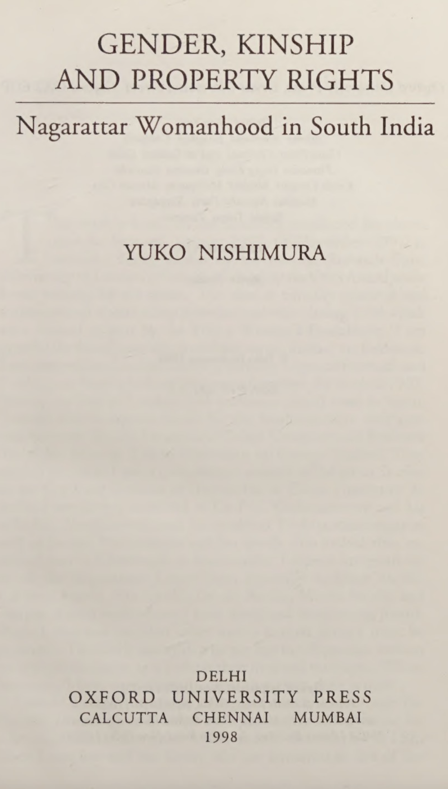
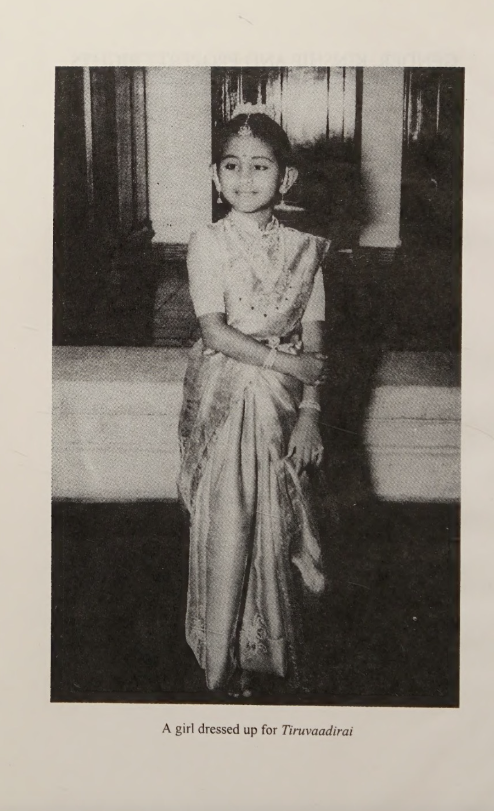

> A great work, "Gender, Kinship & Property Rights on Nagarathars by Yuko Nishimura"
>
> Nagarathars are a social-group of mercantile castes in South-India.
{fig-alt="Nagarathar Family Portrait" fig-width="40%"}

---

## A. What are my reflections from this work?

{fig-alt="Nagarathar Book" width=40%}

Firstly, I want to appreciate, thank Nagarathar's contribution to Tamil Society.

Nagarathars built schools, libraries, colleges, patrons of Hindu Temples. Nagarathars built, the famous Annamalai University, located in Chidambaram, Tamil Nadu. Nagarathar institutions are providing jobs in South-India, contributing to this day. To name a few:

- Murugappa Group
- Chettinad Group
- Indian Overseas Bank
- Indian Bank
- United India Insurance

---

## B. What did Nagarathar women do?

- Nagarathar women were not subjected to patriarchal norms of Tamil society; they were economically independent.
- Nagarathar women were actively involved in financial services.
- They provided seed-capital and inherited their mother's assets.
- Nagarathar marriage is mostly about matching economic status & keeping their assets intact. One who spends an extravagant amount of money for weddings receives highest honor and face. One who invites 10,000–20,000 people for their son/daughter's wedding gains prestige.
- Marrying within their clan allows them to retain social-financial kinship networks.

Chapter two gave me a glimpse of Nagarathar beliefs:

> Nagarathar women are fed to believe, "Arranged Marriage" marrying same endogamy kin is honorable, face-giving. This is a majority belief among South-Indian Women/Castes.

When I was reading, it struck me the mindset, beliefs, and worldview are the same among the majority of Tamils. This is not confined to the Nagarathar caste, but applies to almost all Tamils.

{fig-alt="Nagarathar Women in Finance" fig-width="40%"}

---

## C. How Pure-Caste Narratives fuels Tamil Society?

{fig-alt="Nagarathar Women in Finance" fig-width="60%"}

Custom of endogamy is still practiced to this day in India.

Majority of Tamils favor and would give you subtle, socially reinforced reasoned beliefs in favor of endogamy. Endogamy is one of the important reasons for the perpetual continuation of India's caste-system.

I was quite struck by the distinction between **Pure Nagarathar** and **Non-Pure Nagarathar** within their clan:

- **Pure Nagarathar**: Those from the same kin, lineage within Nagarathar.
- **Non-Pure Nagarathar**: Inter-caste or families affected by tragic social events, likely to marry someone outside the pure Nagarathar-lineage.

These are beliefs from the 18th–19th centuries, originating in a feudal & agricultural economy. Strong social, family, and kinship relationships kept women adhering to these beliefs.

In reality, genetic scientists can communicate there's no such thing as pure caste or race. These are beliefs of the early–late 19th century.

---

## D. How Endogamy limited innovation and institutional modernization?

Endogamy, considered a strategy for protecting assets and building trust, is in my opinion a boon. It is the glue of the caste-system in modern India. However, Nagarathars limited themselves within a small social network bubble that did not allow their financial institutions to modernize or be part of global financial centers.

They could not modernize or develop their financial services further. For example, London and New York City are hubs of institutions providing specialized financial services & products closely related to Nagarathars' work. As they failed to adapt to changing times and customs, Nagarathars lost the majority of their wealth, with only a few families spared. Their occupations transitioned to professional white-collar careers and offering financial lending.

Nagarathars, at their peak in the early 20th century, held/owned 570,000 acres in Burma. They gained Burmese land by providing lending services to rice farmers. Unfortunately, they lost 3/5th during WWII.

Their loss is also a loss of human capital, financial skills, and financial capital expertise for entire South India. South India does not have specialized financial sectors like London or New York.

Concretely, South India could have developed using Nagarathars' financial acumen—creating their own Wall Street.

To be part of the modern economy, especially the financial services sector, requires strong computing, physics, and financial skills to manage such enterprises, which requires openness.

**Credits to Muthu Palaniappan for recommending this book.**

---

**Source:**

1. [Gender, Kinship \& Property Rights by Yuko Nishimura](https://www.goodreads.com/review/show/4836057846)
2. [A Tamil library stands testament of Capitalism](https://rickrejeleene.me/Tamil/posts/2025-04-06-Tamil-Capitalism/)