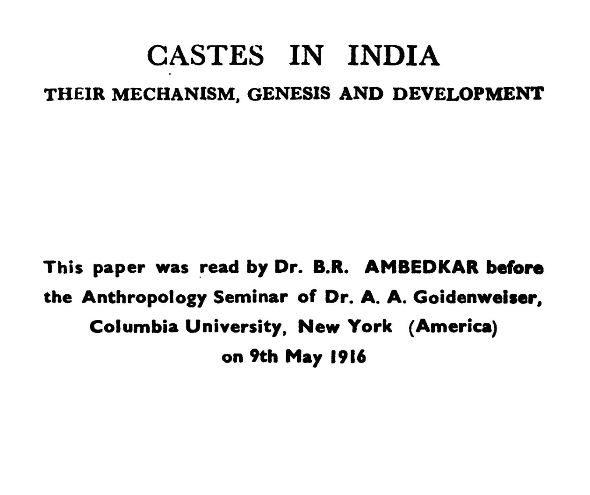

{fig-alt="Frontispiece of Castes in India" fig-width="55%"}

## Castes in India: Their Mechanism, Genesis and Development by B.R. Ambedkar  

Recently, I encountered Ambedkar's ideas again while reading Social-Organization and Religion of Piramalai Kallar by Louis Dumont, one of the most influential 20th century french anthropologists.  
To this day, Ambedkar's works are extremely popular. His pictures are frequently found in villages all over India. Streets are named in his name. Many villages have flagpoles showing support for Ambedkar.

In this short anthropology paper, Ambedkar speaks the core binding glue of India's Caste as Endogamy. He examines definitions of castes by various scholars, as too little or too much.  
Caste's definition, according to Ambedkar is prohibition of Intermarriage between different castes, sub-castes.  
By this definition of Ambedkar, Tamil speaking people living in Tamil Country might be most practitioners of caste in day-to-day family-life.  
Ambedkar moves towards Surplus Man & Surplus Women problem, which Indians used to resolve by Sati or forced widowhood, polygyny, remarriage was blocked under caste-rules.

So we have, following categories of castes:  
 *(a) Brahmans, Priestly caste  
*(b) Kshatriyas, Military caste  
*(c) Vaisya, Merchant Caste  
*(d) Sudra, artisans  
+-- Dalits are outside the four.

Ambedkar says, at some point in Indian History, priestly castes socially detached themselves, closed doors or psychologically, some found doors closed against them. On Origin & Spread of Caste, Ambedkar speaks of Brahmins, who practiced this custom, and other castes imitated them as law-givers were Brahmins. He says caste existed before, Manu, the first Man & Manu-smriti [Laws of Manu]  

Mahatma Gandhi disagreed with Ambedkar, urging to judge Hinduism through best adherents and reform gradually, rather to condemn entire adherents of Hinduism through worst practitioners.  

Ambedkar insisted on political and legal protection of Dalits.  
Due to Ambedkar's scholarship, Indian Constitution adopted:  

1. [Article 15 – Promoting equal opportunity, regardless of religion, caste affiliation](https://indiankanoon.org/doc/609295/)  
2. [Article 16 – Promoting equal opportunity and affirmative action for certain castes](https://indiankanoon.org/doc/211089/)  
3. [Article 17 – Abolishing untouchability](https://indiankanoon.org/doc/1987997/)  
4. [Article 46 – Promoting wellbeing of Dalits](https://indiankanoon.org/doc/352126/)  

The difference between caste & class, caste is permanent, legally ascribed to you in India. But, you cannot change your caste, certainly class shifts over life-time. Recently, I was saddened to hear a speech on Caste, by a Tamil Politician not adhering to authentic claims by people from both perspectives. To me, it seemed he was doing politics not adhering to historical truths and sharing authentic sources.  Now, I am eager to find out, thought-out responses on Caste's anthropology, sociology from Hindu, Islam perspective -- here's why?  I observed, the goal of this Tamil politician was mainly to engage with his audience and keep them divided, their votes, not strive for social-political solution.  

## Sources

1. [Castes in India: Their Mechanism, Genesis and Development by B.R. Ambedkar](https://franpritchett.com/00ambe.../txt_ambedkar_castes.html)  
2. [Constitution of India](https://legislative.gov.in/constitution-of-india/)  
   - [Article 15 – Promoting equal opportunity, regardless of religion, caste affiliation](https://indiankanoon.org/doc/609295/)  
   - [Article 16 – Promoting equal opportunity and affirmative action for certain castes](https://indiankanoon.org/doc/211089/)  
   - [Article 17 – Abolishing untouchability](https://indiankanoon.org/doc/1987997/)  
   - [Article 46 – Promoting wellbeing of Dalits](https://indiankanoon.org/doc/352126/)  
3. [Untouchability Wall in Tamil Nadu](https://theprint.in/.../in-this-tn-village-a.../2454393/)  
   > ‘People of different castes, do not interact with each other’  
   > ‘The Wall separates castes’  
4. [School Expansion & Inter-caste marriages in India (Nitin Kumar Bharti)](https://www.isid.ac.in/.../papers/NitinKumarBharti.pdf)  
   - *Note:* p. 5 – 62 % of adults in UP favored laws banning intermarriage between high and low castes.  
   - After reservation policy expansion, TN inter-caste marriage rate (2023) is 3.8 %: [BPAS Journals](https://bpasjournals.com/.../journal/article/view/1774/1129)  
5. [Goodreads review of B.R. Ambedkar](https://www.goodreads.com/review/show/4110808304)  
