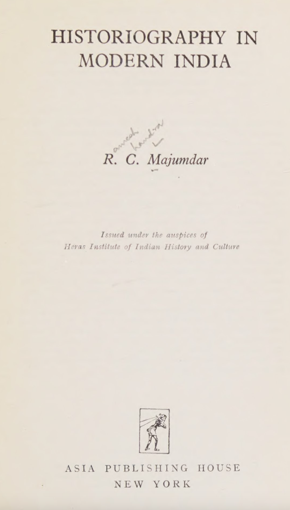
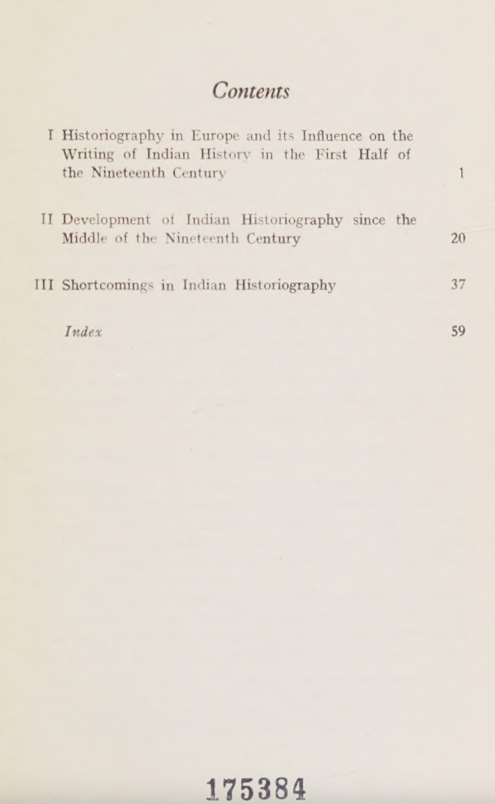
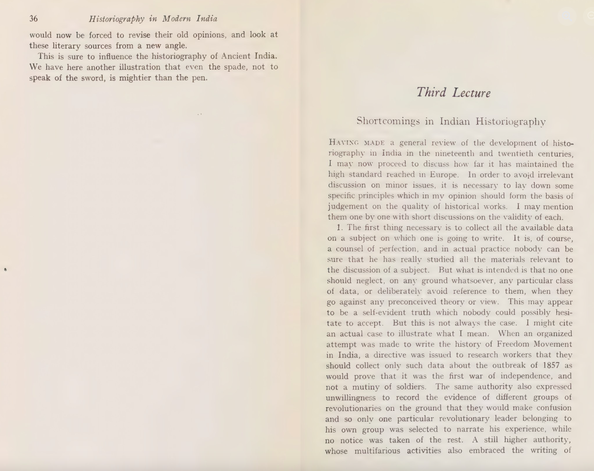

{fig-alt="Portrait of R. C. Majumdar"}

Majumdar’s commitment to truth shines through in this 1970 essay. He observes how Indian history has often been bent to serve teleology, national policy, moral instruction, or political ends. Decades and scores of new publications later, the overall landscape of Indian historiography remains surprisingly unchanged.

## Outline

1. **Historiography in Europe**  
   Writings of Indian history in the first half of the nineteenth century  
2. **Development since the mid-nineteenth century**  
3. **Shortcomings in Indian historiography**

---

## 1. My Reflections

{fig-alt="K. A. Nilakanta Sastri"}

My first deep dive was K. A. Nilakanta Sastri’s *Historical Method in Relation to Problems of South Indian History*, where he defines four methods: heuristic, criticism, synthesis, and exposition. This led me to Sir William Irvine’s exhaustive—but unfinished—twelve years of Mughal source collection, later completed by Sir Jadunath Sarkar. Sarkar’s works on **Shivaji (1919)** and his five-volume Aurangazeb series **(1912–24)** epitomize scholarly rigor.

In contrast, many contemporary writers fall short of the Rankean ideal **“to show what actually occurred,”** opting instead for narratives that score political points or serve communal agendas.

---

## 2. Majumdar’s Analysis

{fig-alt="Timeline of Indian Historiography"}

Majumdar examines historians from **1750–1850**, detailing evolving source materials, translations, and manuscript discoveries. He shows that the nineteenth century was dominated by English historians; only in the twentieth did Indian scholars begin to contribute in earnest. He critiques James Mill’s standard textbook for its bias against Hindus and its flawed ancient chronology.

I wonder how the 1900–1950 generation balanced national pride with objective scholarship—many popularized the narrative **“the British took away all our wealth.”** Majumdar insists that **truth** must guide the historian, quoting Jadunath Sarkar:

> “I would not care whether truth is pleasant or unpleasant, and in consonance with or opposed to current views. I would not mind in the least whether truth is or is not a blow to the glory of my country. If necessary, I shall bear in patience the ridicule and slander of friends and society for the sake of preaching truth. But still I shall seek truth, understand truth, and accept truth. This should be the firm resolve of a historian.”

*Thanks to Professor Rajat Kumar Pradhan for the recommendation.*

---

## References

1. Majumdar, R. C. *Historiography in Modern India* (1970). [Goodreads review][1]  
2. Sastri, K. A. Nilakanta. *Historical Method in Relation to Problems of South Indian History*. [Goodreads review][2]

[1]: https://www.goodreads.com/review/show/7621329171
[2]: https://www.goodreads.com/review/show/4515114502
