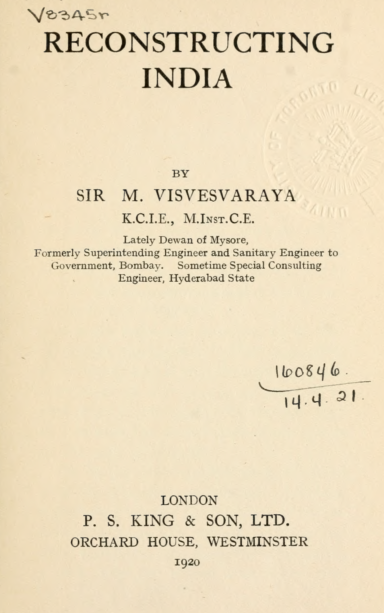

Visvesvaraya — Reconstruction of India (1920) by Rick Rejeleene

{fig-alt="Nagarathar Book" width=40%}

Visvesvaraya was more than a civil engineer in his career. 
He was a statesman, planner and the Prime Minister of Mysore. 

In this book, Reconstruction of India, I examine his plans, responses to challenges facing India. For anyone, who is interested in challenges and proposing solutions of India from agriculture, manufacturing, governance, social conditions, will find this work invaluable. 

The reason why I selected this excellent work is to hear from India’s foremost engineer his own thoughts on issues of India, underdevelopment and how to solve them, improve things. 

This book was written in 1920, with concern of India’s low standards of living. This is a historical account of India’s past issues. The writing is precise, clear which makes it easy to cover. He compares, India’s deficiencies of statistics with advanced nation’s education, social structures, industries. 

The approach Visvesvaraya takes on this work is comparative visionary and analytical. 

## 1. Comparative visionary approach: Learning from the World 

Visvesvaraya speaks about the will of Indians. He says, without will, effort and support from government (state), it is less likely India will modernize. He studies industrialization, developmental paths of Canada, Japan, US . 

### 1.1 United States and Protectionism 

He highlights US government’s help for local industries growth, under long history of protectionism. Protectionism helped developmental phase of American industries to safeguard from European competitors. The government established bureau of mines, standards that actively enabled progress of American Agriculture and Industry. 

He observes, America’s industry focus on efficiency, large scale production using corporation and trusts is a major factor in its industry success. We can conclude the wealthiest nation on the planet was built on protective tariffs, with active government support for research and development. He even notices during World War 1, United Kingdom, abandoned laissez-faire economic policy, into actively supporting, protect and nurturing local industries. 

### 1.2 Japan as role model for India

Visvesvaraya  viewed Japan’s industrialization from 1868 to 1912 as role-model. India’s policy was laissez-faire, which he argues wouldn’t work without active support of government to nurture, protect, build industries. In 2025, we see parallels looking at China which actively nurtured their local industries, protected until they became mature to compete on Global markets. 

## 2. Vision for Federal structure of India: 

Visvesvaraya calls for federal structure for future India. Now looking back, India’s states and centre is organized federally. He compares and suggests India to follow with Japan’s self-governance at Village, local level. 

Somethings which stood out to me, In 1920s, child marriage was the norm. 
Visvesvaraya says at ages of 7 to 10, many Indians were married. It was also one of the reason for large scale poverty. Illiteracy is another major issue that was in India. In 2025, India doesn’t have this issue anymore, large number of Indians, can read and write. 

## 3. Social Reform of India: 

He was appalled by Caste-System, demands abolishment of depressed classes (untouchables) something that he asks to abolish. He says it’s a blot on India’s social structure and social history. He demands women to be considered equal and be part of India’s workforce. In 2025, Many educated Indians have no solution for this issue, and majority of Indian Men are socially-conservative, so women being part of the workforce is discouraged. Progressive Indian Men, are a minority among the population. The caste and social problems are still relevant to this day in modern India. As we reflect India in 2025, we can still notice, vestiges of feudalism. Factions of India’s political party members promote actively feudalism, i.e pushing against western modernization, considering local indigenous knowledge to be superior, rather than actually admitting, it’s time to modernize as Japanese successfully modernized their country. 

## 4. Agriculture in India: Conservative Habits or Rational Choice?

I’ve always shunned to think, contemplate of entire India’s issues, so I limited myself to my own state, Tamil Nadu. However, in this work, I learnt how Visvesvaraya was able to deftly write down problems of entire India. The first chapter, He puts India as the center, compares with advanced nations as UK, Japan, Canada, US. 

In 1920, He says, majority of Indians were depended on Agriculture for their livelihood, so India as a majority was poor. As agriculture did not allow to help material condition of majority Indians. Most of the manufactured goods, finished goods were imported from abroad. 

One impressionable part from his work, which I agree is the modernization of India. He was inspired by Japan’s modernization in 1920.  He shares how India can follow the same path, apply the methods, processes, systems Japanese used to modernize the country. Moreover, avoid the pitfalls which plagued some of the advanced countries as poor living conditions (slums). He observed living conditions of India’s villages were poorer than slums.  In Urbanization, He suggests proper town-planning, industrialization. Although in 2025, India suffers greatly in large scale urbanization problem. 

He was inspired by the industrialization of the West. 
He encouraged Indians to visit, travel the world, learn the best practices in Agriculture, Manufacturing and Governance. 

### 4.1 Visvesvaraya’s Call to learn from Abroad: 

“The best method of national activity should be selected. This will be possible
only if delegations of Indian statesmen, students and business men are sent abroad to study up-to-date foreign systems, theories and practices.”

### 4.2 Reflections from Theodore Schultz 

In Agriculture, He covers usual issue of India’s agriculture as lack of applicability of scientific practices, due to farmers clinging to conservative old habits of past. From 1920 to 2025, We have come long way in Indian Agriculture. I am cautious to point fingers or blame, as I came across, Nobel Prize Winner’s Theodore Schultz work who contributed to, “Human Capital”. 

He worked among poor eastern European farmers, during his lifetime (1902-1998), came up with interesting observations, rather than blaming them for making rational decisions. He says poverty of farmers, was not due to small land-size, land fertility, laziness but rather higher cost, lack of availability of productive inputs. The constraint was lack of access to profitable, modern inputs and knowledge. He came to the conclusion, given the conditions, the traditional farmers were making the most rational decision, so it was not that they were lazy or not trying to expand activities in agriculture, they were limited, due to high taxes and artificial low agricultural prices set by their government. 

He came to the conclusion in the work, Transforming Traditional Agriculture that the best way to help them was to change old inputs into newer more profitable inputs and allowing them to make their own decisions, with less government intervention. This resulted in high yield varieties during green revolution (1960s, 1970s) which became central to India’s Green Revolution. So Schultz’s point is that farmers adapted due to economic incentives, innovate when profitable technologies are available. So, if we agree with Theodore Schultz, small land holdings in agriculture might not be the major limiting factor. 

Anyway, In 1920, during Visvesvaraya’s time, Agriculture was poorer in India. 
At the moment, 47-48% of India’s population are involved in agricultural activities, comparing with America’s 1-2% of the population, it might increase to 18% if you include food processing units, indirectly related farm activities like transportation, agricultural related retail. 

### 4.3 Visvesvaraya’s urgent calls to modernize: 

He says, “The first practical step is to enable Indians in increasing numbers to see for themselves what science is doing to improve agriculture throughout the world. Parties of representative men, from every province, should be encouraged to travel abroad, especially to Japan.”

## 5. Industrialization and Economic Modernization: 

With respect to Industries, he says, Industries of a country reflect productive  capabilities, executive abilities, and forms chief tests of a nation's efficiency. 
In 1920 — India’s Shipbuilding industry depended on British support. 
Visvesvaraya asks if the British could support India’s industries, both countries could benefit industrialization as a win-win situation. Throughout the book, Visvesvaraya compares U.S’s industries, Dominion of Canada and Japan’s industries. At that time in India’s Economic History, he highlights needs in the following: 

1. Textiles — cotton, woollen and silk
2. Smelting of ores — manganese, lead, copper, etc.
3. Iron and steel
4. Manufacture of machinery and other articles of iron and steel
5. Shipbuilding
6. Chemical industries — dyes, sulphuric acid, soda ash, artificial manures, etc.
7. Porcelain, glass, cement
8. Paper-pulp and paper
9. Leather industries
10. Sugar

So all these industries are actively part of India’s industry in 2025. 
In Organization, Visvesvaraya asks citizens to be part of social groups, nonprofits, supports religious organizations and chamber of commerce. 

## 5.1 Reflections on state of Tamil Nadu: 

As of 2025, following Visvesvaraya, if we were to examine economic, social, industrial conditions of Tamil Nadu, there’s much more work to be done, especially accepting workers from all over the world. Industrialists need to focus on gaining expertise, know-how in managing business-units. Most children of working, middle-upper class Tamils go on with narrow selected careers as doctor and engineers, neglecting development of their own towns, introducing new industries like shipbuilding, higher value industries. 

### Here’s the outline of the book: 

::: {.callout-note title="Book Structure" style="font-size:0.9em;"}

*1)* The Indian Problem: 
    India in Relation to Progressive Countries

*2)* Political and Administrative Reconstruction:  
  The Central Government  
  Provincial Administration  
  Local Self-Government  
  Finance

*3)* Economic Reconstruction:  
  Economic Activities in Advanced Countries  
  Trade and Commerce  
  Industries  
  Agriculture  
  Development of Resources and Communications

*4)* Social Reconstruction:  
  Betterment of Social Conditions  
  Social Reform  
  Education

*5)* Shaping the Future:  
  Nation-Building  
  Organization  
  The Immediate Task

:::

Visvesvaraya’s works reminds me of Japan’s Meiji reformers. At present, I am reminded of China’s modernization path, which India’s leadership neglects to consider, absorb and learn from them. Visvesvaraya’s imagined an India that was industrial, modern, rational — His model remains unfinished and unimplemented in India as of 2025. 

**Sources:**

1. Theodore W. Schultz, *Transforming Traditional Agriculture* (Yale University Press, 1964)
2. M. Visvesvaraya, *Reconstruction of India* (P.S. King & Son, 1920)
