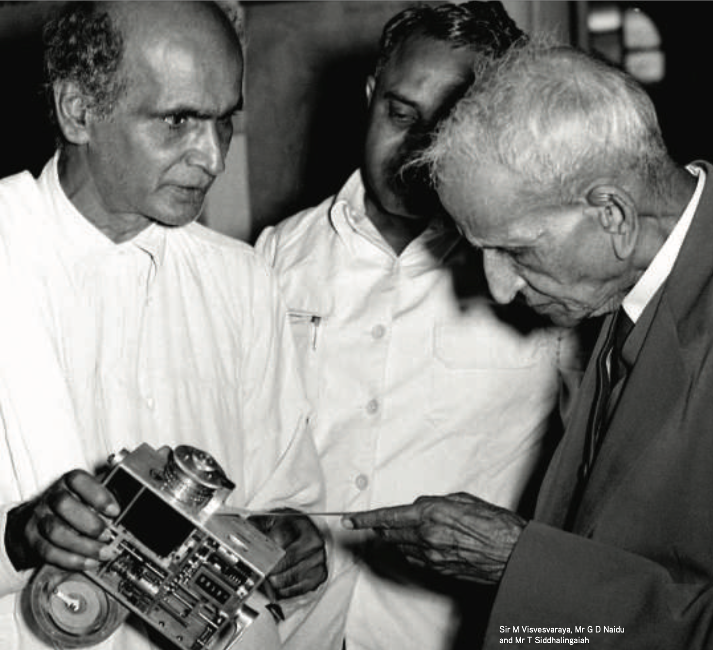

## Introduction

{fig-alt="Visvesvaraya with Naidu of Lakshmi Machine WorKs" width=80%}

Mokshagundam Visvesvaraya is widely regarded as the **Father of Indian Engineers**, yet his legacy remains under-appreciated in regions such as Tamil Nadu, India. His remarkable life and achievements offer profound lessons for engineers, engineering education, and industrial development across India. Living to the remarkable age of 102, Visvesvaraya’s contributions shaped the early development of South India. His birthday, **September 15**, is celebrated as **Engineer’s Day** in India.

## Legacy and Achievements

- **Visionary for Science Education**: Inspired the establishment of the District Science Center in Tirunelveli, with other science museum branches in Bangalore, Gulbarga, Mysore, and Tirupathi.
- **Major Engineering Projects**:
  - Built the **Krishna Raja Sagara (KRS) Dam**
  - Designed **Flood Protection** for Hyderabad
- **Industrial and Institutional Foundations**:
  - Established **Bhadravati Iron and Steel Works**
  - Founded the **State Bank of Mysore**
  - Established **Mysore University**, emphasizing technical and scientific education
- **Political Leadership**:
  - Served as **Diwan (Prime Minister) of Mysore**
- **Advocate for Industrialization**:
  - Strongly promoted the industrialization of India, drawing inspiration from Western models

## The Situation in Tamil Nadu

Despite having a large number of engineering colleges, Tamil Nadu’s perception of engineers is often negative. This is due to challenges such as:

- Unemployment
- Lack of ownership of work
- Poor teaching faculty
- Outdated curriculum design
- Insufficient practical training

These are temporary problems that can be mitigated.

## The Need for Role Models in Engineering Education

A major issue is the absence of strong, inspiring role models and benchmarks within the engineering curriculum. Figures like Visvesvaraya could be introduced to address this gap.

### Areas for Curriculum Improvement

1. **Staff Training and Teaching**
2. **Applied Research & Hands-on Work**
3. **Entrepreneurship & Capital Support**
4. **Access to Global Job Opportunities**

## Conclusion

Introducing Visvesvaraya as a benchmark could reinspire students by integrating his vision of public service, industrial development and contribution to society. 
An Oath can equally, enable everyone to become the highest ideal Engineer for Society. 

### Oath to Engineers graduating from Tamil Nadu's colleges

>  "I am an engineer. In my profession I solve practical problems. To it I owe solemn obligations. Since the stoneage, human progress has been spurred by the engineering genius. Engineers have made usable nature's vast resources of materials and energy for humanity's benefit. Engineers have vitalized and turned to practical use the principles of science and the means of technology. Were it not for this heritage of accumulated experiences, my efforts would be feeble.
As an engineer, I, (full name), pledge to practice integrity and fair dealing, tolerance, and respect, and to uphold devotion to the standards and dignity of my profession, conscious always that my skill carries with it the obligation to serve humanity by making best use of the earth's precious wealth. As an engineer, I shall participate in none but honest enterprises. When needed, my skill and knowledge shall be given without reservation for the public good. In the performance of duty, and in fidelity to my profession, I shall give the utmost."] 

## Sources

1. [Engineering a Nation: The Life and Career of M. Visvesvaraya](https://www.amazon.com/Engineering-Nation.../dp/B0DGXTQY13)
2. [M. Visvesvaraya "continues to be a source of inspiration", Jairam Ramesh](https://www.thehinducentre.com/resources/article29655681.ece)
3. [Facts about Visvesvaraya](https://www.newsgram.com/.../engineers-day-2020-here-are...)
4. [Wikipedia: M. Visvesvaraya](https://en.wikipedia.org/wiki/M._Visvesvaraya)
5. [Sir M Visvesvaraya by Aparajith Ramnath with R Gopu & Ashwin Prabhu. April 5, 2025](https://www.youtube.com/watch?v=Vf1KPe823PY)
6. [More about his life & contributions (PDF)](https://csp.indica.in/wp-content/uploads/2020/09/Sir-M-Visvesvaraya-–-The-Legendary-Nation-Builder-1.pdf)