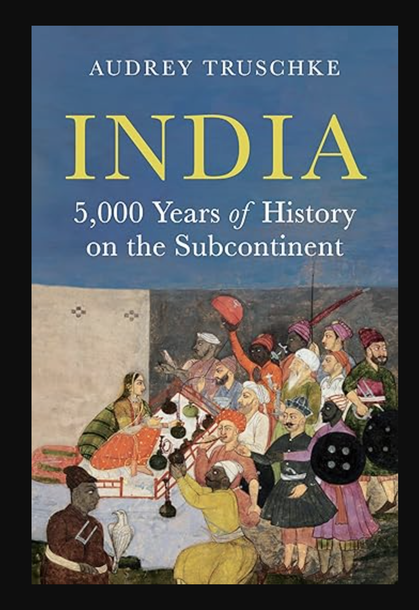

{fig-alt="Cover of Audrey Truschke's Indian History " width=50%}

*Cover of Audrey Truschke's Indian History*

# Introduction

A Herculean task to cover entire Indian History. 
This work is a broad survey of all Indian History.
The Author has covered it all in 514 pages. 

The Author’s selection of scholars, reliable sources are commendable. 
The Sheer breadth of references, meticulously spanning 117 pages from 547-664 elevates it as a masterclass in historical scholarship. In each of the chapters, scholars specific to each specialized area of their expertise is chosen. 
This has led readers to discover other professional Indian Historians. 

## Accessibility and Approach

This work will be accessible to all, as there’s not much specialist words even-though this is academic. The Author says, 5000 years title is something the publishers suggested. I hope that answer questions relating to the title.

## Indian Historiography 

The Author has taken a non-Nationalist historiography approach of Indian History. 
Many Indian history writers from 1860-1960 have nationalistic approach to communicate to their readers. In this approach, there’s over-emphasis on local achievements, unity and resistance to colonial role. Out of this approach, came works of Romesh Chunder Dutt, Dadabhai Naoroji. The 1857 revolt, mutiny was bloodshed, this was rebranded as Indian fight for independence, historically in 1857, there was no such thing as *Indian* at that stage of History. These historians played a crucial role for legitimization of Indian independence, downplaying India’s internal divisions, tensions. 

The approach of selecting, which historical events to share includes, diverse voices, preferably people who are not upper-caste women, minorities, which is commendable work. The author doesn’t praise any dynasties or kings in the work. 

It’s thoughtful, engaging to realize how, Indian History is not only a series of empires and kings, there’s more to the story of Indians. The Author says, majority of the Indian history writers focused on Political History. This is important, others as economic, social, cultural history are equally important. 

## Indian History & Earlier Work

In school, Indian history is taught as a set of Kings, Wars, Dynasties. 
There are multiple dynasties that were living in same time period, so overlapping timelines and interaction is a way to describe their existence. 

The author’s earlier work, take on India’s Mughal History has not been received with praise by some readers of Indian History. Many claim the author is trying to shift perspective or revisionism of Mughal History. 

Yet, as of now,  I find no evidence, or actual documentation, arguments to show how this historians take on Mughal Empire is flawed. Have we, as readers of Indian History, taken the time to examine these perspectives? One must subject Indian Historians writers to scrutiny. 

So, I decided to take the task for myself, I decided to check the earliest entries of Aurangzeb. My examination is not thorough, as I want to check more authors, sources of Aurangzeb’s life. Aurangzeb’s time period is longest in Mughal Empire, expanded significantly. 

## Jadunath Sarkar and Aurangzeb

Jadunath Sarkar is considered to be the foremost historian for Aurangzeb. 
In this, We briefly examine his work specific to Aurangzeb.

Indian Historian, Jadunath Sarkar’s (1870-1958) works on Mughal Empire is considered to be master-piece. Professor Sarkar was a practicing Hindu. Now, when we write works of historical-scholarship, we need to make sure to not bring personal beliefs into the work. 

In Jadunath Sarkar, History of Aurangzeb’s life. 
In Chapter 14, Islamic State-Church, He labels it as Islamic theocracy.
This is Volume III, Chapter XXXIV, drawing from Persian Sources. 
Jadunath Sarkar writes this volume between years of 1912 and 1924.

Firstly, I raise some questions, Aurangzeb’s reign was 1618-1707. 
During this time in History, there was no democracy? 
Democracy was not the norm, social order was feudal, where kings had highest authority without accountability for their political power. 

From earliest times to Aurangzeb, Indian kings were brutal to each other. 
I could not see Jadunath Sarkar contextualizing this information, political power of pre-modern India. Perhaps, he has applied presentism, which is applying subjective political lens of his time to the past?

While Jadunath Sarkar’s extensive use of Persian sources and his selection of materials lend his works as authentic, I remain uncertain about his methodological rigor and interpretive framework regarding Aurangzeb. My primary reservation concerns his tendency toward moralistic judgments, which at times compromises historical objectivity.

Ideally, a historian should present a balanced account by systematically describing how different sources characterize Aurangzeb, for example, noting that sources X depict him as a, b, c, while sources Y present him as d, e, f. Such an approach is both professional and objective.
 
British Historians in 17th-18th century, deftly categorized Indian History into Hindu and Muslim Era. This is no longer supported according to Professional Indian Historians today. The tripartite classification, Hindu, Muslim and British is failing to capture pluralistic dimension of Indian History. For example, we have Hindu-Raja Man Singh of Rajputs, who served as a general during Mughal King, Akbar. India had variety of animistic beliefs practiced by tribes. All these are examples of why we can’t categorize as Hindu period, so we can put this classification as false. 

## Chapter One to Four

The Indus Valley Civilization is along with four ancient centers of civilization, Egypt, Mesopotamia, Egypt and China. The author shares evidence for Indus Valley Civilization, from unicorn seal and modern impressions. Mound, “F” excavation at Harrapa, Punjab. We do not have much evidence about basis of social stratification, government, religion, language, warfare tactics. Most of this chapter is detailed explanation of architectures, urban planning of Mohenjo Dart, Harappa and Lakshanjo Daro. 

In Chapter two, the author introduces ancient Vedic practices and migrants. 
Around 1700-1200 BCE, people who spoke Indo-European language migrated into Northwestern India. They migrated in search of land, for farming. They were later called as, “Arya” i.e “Nobel”. The author calls them as Vedic people, as neutral description. Vedic rituals, social organization, relationship with animals, languages developed over time, which the author calls as Hinduism. However, Hinduism of present does not look, anything from this era. Over course of 3000 years, Hinduism has evolved, changed. 

Linguistic evidence provides migration of Indo-Europeans into northern India, from second millennium BCE. While the author doesn’t expand in detail on this. 

We can look at the evidences for this claim of Indo-Aryan migration from multiple angles: 

a) Steppe ancestry is found among Northern Indian population around 1500-1000 BCE 
b) R1a-Z93 Y-chromosome haplogroup (human y-chromosome DNA haplo group) is widespread among North Indian, Central Asia
c) Indo-Aryan languages Sanskrit, Hindi has shared vocabulary, grammar, phonology with Greek, Latin, Persian
d) Mittani inscription in Syria shows Indo-Aryan names, Indra, Varuna showing early migration 
e) Rigveda mentions geography of northwest of India, Sarasvati and Afghan rivers

The Vedas —  Rig, Sama, Yajur, Atharva, were composed around 1400-500 BCE.
Rig is the oldest with 1028 hymns. The Vedas promise wisdom, veda means knowledge. The rest of the chapter goes into historical developments of Vedic tradition, Karma. The next chapter is describing mostly early cities, development of cities (550-325 BCE), Ajivikas, Charvakas, Jainism, development of Buddhism. 

In Modern India, endogamy is strongly practiced among Indians of all social groups. Endogamy is one of the strongest social institutions, surviving to this day from ancient India. In Indian History, there was only a brief period, where Indians intermarried across, described in Rig Veda which described two communities that intermixed, migrants who revered Vedic hymns, rituals and those they name as Dasa or Dasyu, residents of North India. All Dasa groups spoke dravidian and munda languages. Intermarriage between Brahmin men and dasa mothers were spoken highly in later Vedic texts. 

Ashoka is one of the most popular Kings from Indian History. He’s described in Chapter four. Chandragupta, established Mauryan Empire by seizing capital of Pataliputra, which is Patna in modern India. Ashoka had a thirty-six year rule, during which he ordered dozens of inscriptions, carved on rock faces, stone pillars, that communicate information about his life and rule. The scripts were written in prakit language and in Brahmi script. Ashoka’s Mauryan empire left enough historical evidence, for historians to study. Ashoka doesn’t narrate why he became a Buddhist, rather narrated his activities as a convert, he did not prescribe others to convert into Buddhism in his empire. In the conquest of Kalinga (260BCE), recorded in thirteenth rock inscription, mauryan forces captured 150,000 people and killed about 100,000. The Author has covered Ashoka superbly. After the conquest, Ashoka portrayed himself as a reformed ruler, who aspired non-violence. He left monumental objects on the continent, financing wells, rest houses, highways, other public works, as Girnar in Gujarat. Less known is Sita-Marhi cave, located in Bihar. The most famous is four lion pillar complete with dharmachakra at Sarnath. Many Buddhists have credited Ashoka was instrumental in spreading Buddhist practices. 

## Chapter Five

Chapter five is about the Mahabharata, tale of ancient India. The author shares Sanskrit becoming popular around 100-200 C.E, upper-caste began to use Sanskrit exclusively for Vedic ritual and theology. Mahabharatas travelled north and South in first, second millennium by migrating Brahmins, Purvashikha Brahmins moved to Tamil regions in early first century CE. A second group migrated fifth and eighth century CE. In Chapter 6, the author covers trade with Sea Routes, and Silk Roads. Trade exploded between first and third centuries CE, as Egypt was acquired by Rome. Pepper was exported, grown in ancient India. Horses were exported and author said, The Vedic people valued horses due to cultural, religious and practical reasons. Indian Buddhism spreads across the Globe. The author covers Gupta rulers, who were practicing polygamy, owned harems. 

## Chapter Seven and Reflections on Social Structure

In the first three chapters, as a modern reader, I was certainly struck by how society was organized. It's important to remember that ancient Indian society was feudal in nature. Economically majority were employed in agriculture. The author brings up text of Manusmṛti, one of the legal texts of Hinduism. For a modern reader, it definitely will not give anything that will be supportive as society, values have shifted.  

 I encounter the Manusmriti in reading Chapter 7 - “Inequality, Pleasure and Power”. Manusmriti asserts that people are inherently unequal. It does not advocate for equal rights, each are assigned towards specific duties (dharma), occupations, and roles based on caste, gender, and life stage. Manu’s social order is one of harmony within hierarchy, where an individual’s caste duty (svadharma), occupation (svakarman), and inborn nature (svabhava) are aligned. 
 
 This stands in stark contrast to the political innovations of the West and modern India. Modern India’s political rights of equality are deeply rooted in a long Western tradition, drawing from the works of Stoic philosophers and the Judeo-Christian belief in the inherent dignity of all humans as being made in the image of God. 
 
 The principle that “all men are created equal” forms the foundation for equal dignity and rights. 
 Enlightenment thinkers and writers, such as John Locke, further affirmed the equal dignity of all individuals. 
 Revolutionary political-documents like the French Revolution’s Declaration of the Rights of Man and of the Citizen and the American Declaration of Independence explicitly enshrined these ideals, proclaiming that “men are born and remain free and equal in rights” and that the preservation of liberty, property, and security is the aim of every political association. Thus this broke old social order, forming new social order in Europe and America. 

## Chapter Nine to Twelve

In Chapter 9, the author shares historical events, Chola dynasty, details involving Srilanka, their wars. Chola empire shrunk to town of Tanjore in 1279 with Pandyas taking over. The Years of 1190-1350 were marked by Indo-Persian Rule with Ghurids entering India from Afghanistan, who built mosques, places of worship. A Jain merchant Jagadu, sponsored mosques, hindu temples, jain temples in Gujarat. Qutb complex is most visible monument from their period, standing 238 feet tall, higher than Rajarajeshvaram Temple by Cholas. India shifted significantly culturally to India-Persian by 1340s, 150 years rule of Ghurid conquest of Delhi. 

In Long fifteenth century, Chapter 11, We are introduced Bahmani royalty and Vijayanagar empire. Both intermarried, and lasted until 16th century, they presented culturally islamic style, with white tunics and tall conical hats. Vijayanagara Kings worshipped Shiva, yet they did not portray themselves as Hindu kings, rather as Sultans. Both the Bahmanis and Vijayanagara kings appointed Brahmins to state administrators. Both Bahmanis and Vijayanagara valued sea-trade, importing war-elephants, silk. They used slave labor, and they accompanies Krishnadevaraya. In the same chapter, author explores Kashmir, weaving together stories from Sanskrit Brahmin Historians. Chapter 12 explains founding of Sikhism with Guru Nanak, and 1500 could be considered as South Asia’s modernity, with Portuguese establishing trading port in 1498, which lasted until 1961. The Portuguese found Hindu allies as Timoja, Hindu ruler of Kanara, who helped to take over Goa in 1510. Pepper was the core export for a millennium from India. 

## Chapter Thirteen to Seventeen: Mughals 

The Mughals begin in 1526, founded by Babur, the author goes into details of his life. The Mughals continued after Babur, in Chapter 13 is the famous, popular Mughal Emperor, Akbar living from around 1542-1605, who depended on Rajput Kings and non-Rajputs for his kingdom. Mughal Court was brimming with intellectual output from poetry to religious texts through joint efforts between Sanskrit and Persian-translators. Chapter 14 is about Srilanka from 1600-1650, where the author shares social history of Srilankan Buddhists, Bengali Muslims, Gujarati Jains, Benarus Brahmins.  The author covers brief social history of Bengali Muslims, Jains in Gujarat, Brahmins in Mughal Benarus. 

The Taj Mahal is one of the wonders of World, it stands as a Symbol of India. The author covers, how Mughals started to construct many monuments, from gardens to mausoleums. Unapologetically, the Taj Mahal is Islamic, expression of paradise on earth. Mughal empire reached largest under Aurangzeb Alamir. In his era, people who worked in his administration did not use Hindus, which is a Persian-Arabic term. They identified using caste, regional, sectarian affiliations. Aurangzeb spent final years in company of Udaipuri, his son Kim Bakshsh’s mother, who was a musician and Hindu. He employed Hindus in state positions, which benefitted Kayasths, Rajputs, other Hindu groups. His finance minister was Raja Raghunatha. 

There are controversial aspects of Aurangzeb Alamir’s reign, the author says temple protection and destruction was part of imperial policy. Indian kings from Cholas, Pandas, Pratiharas, Delhi Sultanates ordered destruction of Jain, Hindu temples, when they undermined state interests. For example, Benares’s Vishvanantha Temple was destroyed after the land lords in 1669 rebelled. Temple destruction was infrequent Mughal tool to compel submission. Similarly the rhetoric spread to Rajputs. 

Aurangzeb reinstated Jizya, that was unpopular, mainly because of increasing state revenues or to employ ulama. Letters survive calling Aurangzeb, snatching Beggar’s bowls, yet Aurangzeb was not moved by it. In the same chapter, the author narrates Maratha empire, with Maratha Bhonsle family, who were from Shudras. Shivaji declared himself to be chatrapati, faced a caste challenged, he needed to be Kshatriya to perform consecration ceremony, although they claimed to be Rajput descent. So there was a ceremony to advertise his self purposed kshatriya heritage formulated and led by Gangabhatta, a benares brahmin. Gangabhatta pitched the event as caste recovery ceremony, as caste can’t be changed. The Nayaks were under Vijayanagar Empire, they were military chiefs, they were not moved by caste-status, instead celebrated their heritage. Many Indians pushed against Caste, including early Buddhists, Jains, Shiva groups, Guru Nanak. In the 18th century many other kingdoms arose in India, Wodeyars, as Mughal power waned slowly. The Mughal power limped until 1858 until next century, Mughal Empire largely shrunk to Delhi. 

## Chapter Eigthteen: English 

The English power slowly expanded from company rule, 1757-1857 and then towards Crown rule (1857-1947), slowly from small port, the English absorbed entire India, through political strategies, war, negotiation. In terms of European powers who showed up in India, the British were late, the Portuguese came before, the Dutch were next and French, all established tradings posts. Since 1780s, the British sent officers to smaller towns in India as judges or revenue officials, this was partly to have more political control after witnessing America’s independence and French Revolution. While many Indian kings supported or sided with English, Tipu sultan was against them.  However at the end, he was defeated. 
Many Indians were employed as soldiers for English East India Company and British Raj, we may ask the question - Why did they work for them? It was for job security, pay was reliable and better than other Indian rulers of the time. The British also accommodated their cultural, religious preferences. Slavery continued during the British Raj, however banned slavery in 1843. Around this time, many English intellectuals were interested in Brahminical texts, produced translations of them, from Nathaniel Halhed, who produced Code of Gentoo Laws in 1776. The British then began enacting Hindu-Muslim Law dividing the legal life in colonial life. 

Slavery is not a topic of discussion in India. It was part of life in Madras Presidency, with 12% of population as Slaves. Landlords, Mirasdars gave money to lower castes for marriage expenses, housing or farming. On defaulting, 
many lower castes were obliged to pay through labor, which continued as generational labor. Triplicane was the market for slaves in 1790s, when women and children were sold. Vellalars, Brahmins had mirasi rights in Madras Presidency. 
Francis Ellis Whyte, an IAS administaror, introduced famous, Dravidian family of Languages noticed Slavery in Madras Presidency. Three communities, Paraiyars, Pallars, Palli who were enslaved as slaves in Madras Presidency. Many of the slaves were attached to Land. In Northern India, Slavery was part of Indian history, until British outlawed slavery in 1833. The 1833 Slavery Abolition Act was introduced in United Kingdom, although it didn't immediately come into effect in India, as many parts of India was under English East India company rule. 

## Fictional Hindu-Muslim Historiography

The British thought of Hindus and Muslims together, so they created historical chronology of Hindu rule of about 1200 CE, followed by Muslim rule until 1750s, starting with British rule. They relied on Tarikh-i Firishta, history written in 1600s for Deccan based Adil Shahi dynasty. This work focused mostly on Muslim rulers. Firishta was a Persian scholar and historian, who worked for Sultan of Bijapur. 

The English published substantial works of Indian History, such as Alexander Dow’s History of Hindustan (1772), James Mill’s History of British India (1817). In both of these works, they demonize Indo-Muslim rulers, so British might look good by comparison. More broadly, they simply reduced entire Indian history into religion, writing about Hindu rulers, Muslim rulers, suggesting British alone could rise above religious divide. Evidences point against this, as we know, Mughals, Marathas, Vijayanagara empire absorbed, accommodated roles from different religions. This era of study is called orientalist knowledge, overall much of the modern fictional hindu-muslim divide comes from this, the legacy has been overall negative. However, the study of History in India can be traced to this era. James Princep, deciphered, Brahmi and Kharosthi scripts. William Jones noticed similarities between Sanskrit, Greek and Latin, popularized knowledge of links in languages. Around 1810, a clear theory of languages emerged, so scholars for the first time, understood that there were two major language families in South Asia with Indo-European (Hindi, Bengali, Gujarati, Punjabi, Urudu) and Dravidian languages common to South (Malayalam, Telugu, Kannada, Tamil). 

## How Indians thought of themselves from 1780s-1900?

As orientalist knowledge spread, it caused Indians to rethink about themselves, particularly Bengal’s Bhadralok, Urban elite, rethought about Hinduism and desired to reform Hinduism in lines with Unitarianism. The first term Hindooism, first attested in 1780s spread, with groups like Lingala’s, Vaishnavas competing for proper Hindu ideas and practices. Raja Ram Mohan Roy founded Brahmo Samaj in 1828, which advocated for reformist ideas of Hinduism. Roy travelled to England as a Mughal representative, even pushing against Hindu caste norms, crossing by kala pani, where one would lose caste. The British accelerated their expansion in Indian territories, not by themselves, with support from local merchants, such as Seth Naomul, a local trader, who helped to conquer Sindh province. After the Sepoy Rebellion, 1857, the British officers suppressed the rebellion, took strict action by ruthlessly murdering, some were put inside a cannon and blown. 

Three major decisions were taken after Sepoy Rebellion, Mughal Rule completely ended, dissolved company rule and English crown took over. From 1860-1900, the major Indian census was carried out, that officially reified the religious and caste-categories among Indians. The Census forged modern Indian identities. The Brahminical theory of caste also got solidified in India, creating messy social realities. Indian literate Men were less than 1 percent of the population, who were English-educated, upper-caste. Literacy was rare in pre-modern societies, about 68 percent graduates from University of Madras were Brahmins. The age of consent for marriage was raised from 10 to 12, following debate during this era. However, B.G Tilak opposed raising the age of consent, arguing that child marriage was Hindu custom. Indians from 1850 migrated all over the world, from South Africa to Caribbean, as British invested in the Railways. 

Between 1850-1914, Indians were among the traders and seamen, involving in the economic boom, with million Indian traders residing outside of South Asia by 1930, many migrated as coolies for job. Mahatma Gandhi spent his formative years in South Africa, who campaigned to abolish indentured labor. Indians migrated to North-America, who are largely Punjabi Sikhs and Muslims, they encountered racial pushback, mostly worked in agriculture focused jobs. Many Indians toured North-America, with Jamshedji Tata touring in 1900. Famous Swami Vivekanda popularizing Hinduism in the West. Chapter 21 is mostly about equal rights, Dalits, founding of Indian National Congress, Mahatma Gandhi’s involvement in independence movement. Hindu Nationalism was formalized established in 1920s. Most of the ideas of Hindu Nationalism is borrowed from ideas from the West, with K.B. Hedgewar meeting Sarvarkar establishing RSS, to promote Hindu nationalism. Ambedkar took harsh approach in abolishing caste system, burning manusmriti. As time progressed with INC, The British decided to leave India, with certainly, after World War 2, India was divided into Pakistan and India, with mass migration, chaos, lot of homelessness, people migrating from Pakistan to India, as borders were redrawn, shuffled. 

## Modern South Asia

After 1947, South Asia had six new states, Afghanistan, Bhutan, Ceylon, India, Nepal and Pakistan. Afghanistan became independent right after Anglo-Afghan War, and Bangladesh came into existence in 1971. The author shares Srilanka’s history with civil wars, after passing of Sinhala-only act. In India, due to pressure, states were reorganized into linguistic lines. After Independence, India inherited  all the British mills, Pakistan was a bit weaker economically, volatile with their governments unstable, as Muslim league that won Pakistan’s existence collapsed. The author covers political events like emergency period of India, forming of Bangladesh, conflict. Pakistan decided to align with the Western bloc, during liberalization, India introduced more caste equity measures through mandal commission. The last chapter covers living standards in South Asia, current issues as economic inequality, such as Ambani’s Antilla, 400,000 square-feet occupying Mumbai, with stark poverty only few blocks away. The author focuses on wide variety of issues such as manual scavenging, obsession with fair-skin, issues of lower caste, Gujarat riots, floods in India. 

One question that might shed more light on is the religious beliefs of dynasty, kings of India. Many readers might not be concerned about religious beliefs of rulers. Based on what I have read so far, many Indian Kings accommodated many religious traditions, space. Around 1000-1600, many Kings, dynasties anchor their origins in some story of mythic God. 
This might be due to honor or to gain face culturally. This will shed light on Indian History, as popular Indian-History views Indian kings merely by religion. 

Overall, I enjoyed going through this work written for non-technical audience. 
The choice of references, entry is excellent. Below is the outline of the book, which I covered. 

### Outline:

1. Indus Valley Civilization, 2600–1900 BCE
2. Ancient Migrants and Vedic Practices
3. Building and Renouncing Cities, 550–325 BCE
4. Ashoka’s Mauryan Empire
5. Mahabharata: A Tale of Ancient India
6. South Asians Traveling, 200 BCE–300 CE
7. Inequality, Pleasure, and Power in Early India
8. India in the World, ca. 700 CE
9. Medieval South India
10. Indo-Persian Rule and Culture, 1190–1350
11. The Long Fifteenth Century
12. Seeking God or Fame, 1500–1550
13. Ordinary and Extraordinary Lives in Early Modern India
14. Religious Communities and Elite Culture, 1600–1650
15. Aurangzeb’s Empire and Two Shudra Lineages
16. Regional Flourishing, 1720–1780
17. Company Bahadur
18. Sepoy Rebellion and Dawn of the British Raj
19. Knowing India and Indians, 1860–1900
20. Indians on the Move, 1880–1920
21. Advocating for Independence, Nationalism, and Equal Rights
22. Dividing India in 1947
23. New Nation-States, 1947–1990
24. Everyday Life in Contemporary South Asia

## Contemplating possible objections to this Author: 

It’s undeniable, that there were instances of discrimination by upper-caste, including Brahmins, having occurred throughout Indian history. It seems oversimplification, to dismiss, entire upper caste perspective or reject sources of information from these groups. 

Moreover, consider feudal society of India. There was no social, poltiical innovation or revolutionary events such as French revolution breaking old social order to form newer social order, where every man and women is prescribed to have equal rights. In the light of this, the author’s perspective of injustice or specific social groups being not included might not be fair. We could say, the social order was the way it was, and so, we moved to modern India, where we were proscribed foreign concepts such as inalienable rights for all humans. 

I am cautious about characterizing Brahmins, or upper caste communities as antagonists in the historical narrative, as these groups played significant role in pages of Indian history as administrators, building, managing dynasties at various times. 

The author appears to selectively highlight negative episodes, involving Brahmins, such as account in Chapter 9, describing their abuse of power at a Shiva temple in Tamil Nadu. In page 251, Badauni, a curmudgeonly courtier and reluctant translator wrote in his generally scathing history of Akbar’s reign, “Cheating imposter Brahmins… told Akbar repeatedly that he had descended to earth, like Ram, Krishnan, and other infidel rulers, who although lords of the world, had taken on human form to act on the earth. 

This might result in one-sided view of Indian history which is similar to Hindutva history, where Muslim Kings are portrayed as villains or causing heinous acts of suffering upon Hindus. Both of these need to be communicated in broader context of events.  

::: {.panel .panel-default}
## Brief Selection of Scholars

- Patrick Olivelle  
- Upinder Singh  
- Sonar Kachru  
- Romila Thapar  
- E. Hultzsch  
- Harry Falk  
- Gregory Schopen  
- John Smith’s translation of *Mahabharata*  
- Carole Satyamurti  
- Clay’s Sanskrit Library  
- Rig Veda 
- Krishnamurti Dravidian Languages 
- Bronkhorst, How Brahmins won
- Koshmin, Land of Elephant Kings
- Thomas Metcalf
- R Suntharalingam 
- Peter Van der Veer 
- Priya Atwal 
- Tony Ballantyne 
- Purnima Dhavan 
- Rudragshu Mukherjee 
- Sanjay Subrahmanyam 
- Richard Eaton 
- Katherine Brown 
- David Shulman 
- Chandra De Silva for Srilanka 
- Wheeler Thackston 
- Catherine Asher 
- Ananya Chakravarti 
- Noboru Karishma 
- Y. Subbarayalu 
- Hermann Kulke 
- Sheldon Pollock 
:::

