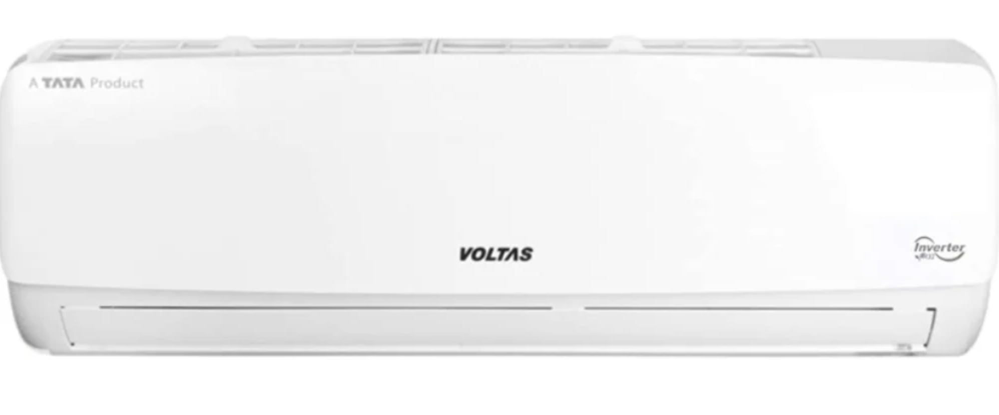
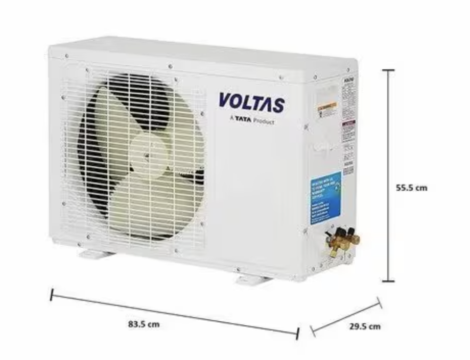
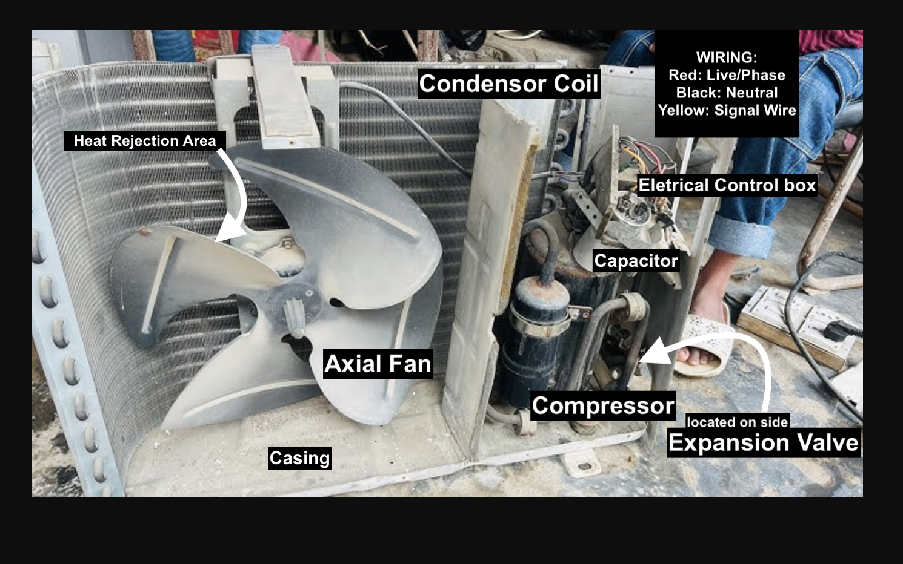
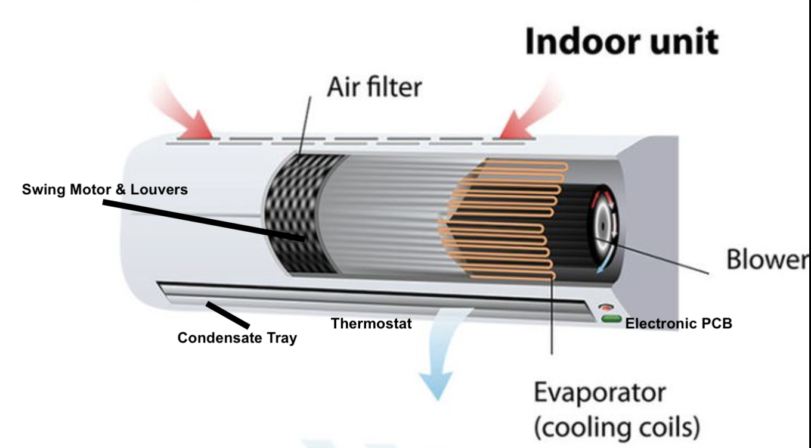
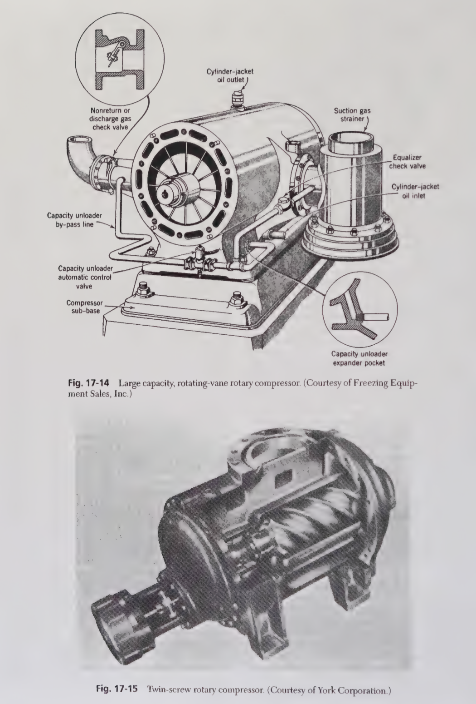
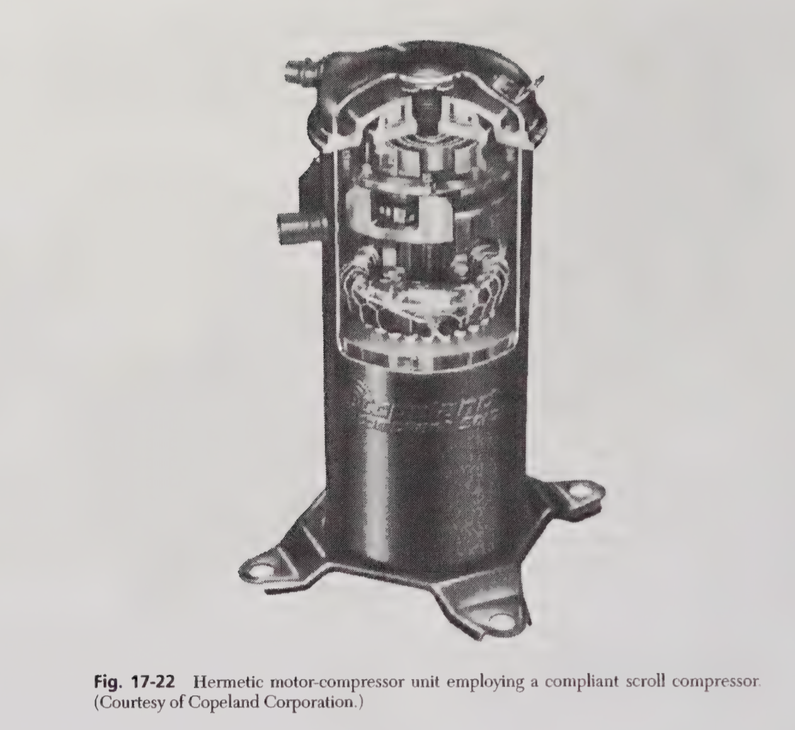
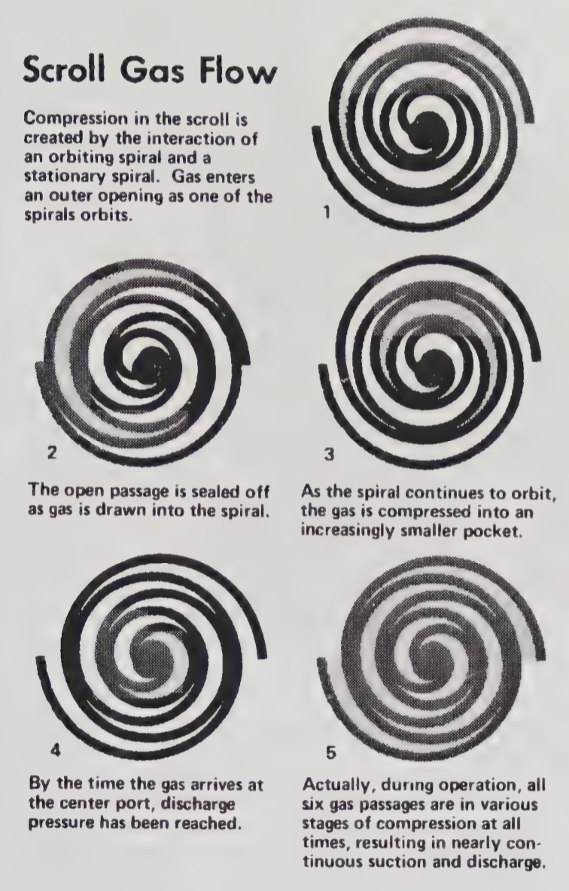

## Motivation: 

Air-conditioners are found everywhere in the world. After noticing how ubiquitous this technology has been around the globe.
This sparked interest, we are depended to this technology, that We cannot live without this technology. 
After noticing, Mitsubishi air conditioners installed in majority of buildings, one must learn the know-how of this technology.
In India, Voltas are one of the top selling brands among Indian customers. In America, the top selling brand is Carrier. 
In terms of technology prowess, Daikin leads with the large amount of patents in this technology. 
In this article, I write everything reasonable, you need to know about air-conditioners. 
At the end, we hope to build one for ourselves. 

There’s many types of air-conditioners. 
For sake of understanding, Let’s focus on the common split-AC, inverter types. Voltas Adjustable Inverter AC (1.5 Ton) is a split air conditioner.[^longnote]

In India, Voltas sells approximately 120,000 to 150,000 units per month.[^1]

> **Assumptions:**  
> - Price per unit: ₹35,000  
> - Profit margin: 5.5%

Based on these figures, the **estimated annual revenue** ranges from **$586 million to $733 million**, with an **annual profit** of approximately **$32 million to $40 million**. There’s a large size market waiting for you. 

[^longnote]: The Voltas Adjustable Inverter AC features inverter technology for energy-efficient cooling and variable compressor speeds.  
[^1]: Sales data reflects monthly volume in the Indian market. Calculations assume the stated price and profit margin, with exchange rate approximations applied.


## 1. What’s the core of Air-conditioner technology?  


The core of air-conditioners are Refrigeration cycle. 
In Refrigerant cycle, heat is removed from a space and transferred to another location. In the case of practical air conditioners, heat is removed locally from a room and expelled to outdoors. 


{width=60% fig-align="center" fig-alt="Schematic of a basic refrigeration cycle."}

To complete  Refrigeration cycle, We need four components:

(@) Compressor 
(@) Condenser
(@) Restriction
(@) Evaporator 

 > Refrigerant is a working fluid used in the cooling, heating, or reverse cooling/heating cycles of air conditioning. 
 > Voltas uses R410A (chlorine-free hydrofluorocarbon) refrigerant.

We need refrigerant as a working fluid, that might be gas, liquid, vapor enabling refrigeration cycle to transfer heat and produce cooling. Refrigerant absorbs heat from the space at low temperature, releases heat to surroundings at higher pressure and temperature 

We can describe beautifully this Refrigeration cycle: 

```{mermaid}
flowchart LR
    Compressor -->|Isentropic compression| Condenser
    Condenser -->|Isobaric heat rejection| Expansion_Valve
    Expansion_Valve -->|Isenthalpic process| Evaporator
    Evaporator -->|Isobaric heat absorption| Compressor
```


$w_{comp} = h_2 - h_1$, \qquad $q_{out} = h_2 - h_3$, \qquad $h_3 = h_4$, \qquad $q_{in} = h_1 - h_4$


## 2. What are the basic components in Air-conditioning unit? 

We take Voltas Adjustable-Inverter AC, the top selling model in India.

{width=60% fig-align="center" fig-alt="Voltas indoor unit."}

{width=60% fig-align="center" fig-alt="Voltas outdoor unit."}

We may ask the question, *Why do we need two units in split inverter air conditioner?*

> I thought to myself - *Why not one?* 

The reason for this fundamental division is efficient cooling.
Remember, The air-conditioning is not creating cold air. 
The air-conditioner is moving heat from one place to another. 
A Single-unit will release the heat back into the room.

[*Indoor unit and Outdoor unit*]{.underline} are two components in inverter air-conditioners. 

1.Indoor unit: Its function is to absorb heat *from* the air in your room. 
Warm indoor air is pulled over cold evaporator coils, and the heat is transferred to a refrigerant liquid, 
cooling the air that is then blown back into the room.

2.Outdoor unit: Its function is to release the collected heat *to* the outside environment. 
The refrigerant, now carrying the heat from your room, is pumped to the outdoor unit, where a compressor and condenser coils work to dissipate the heat.


::: {.text-left}

| Indoor Unit Components           | Function                        |
|:------------------------------- |:------------------------------- |
| Evaporator Coil                  | Cools air by absorbing heat     |
| Fan or Blower                    | Circulates air                  |
| Air Filter                       | Cleans incoming air             |
| Louvers/Fins                     | Directs airflow                 |
| Electronic Control Board (PCB)   | Controls unit logic             |
| Temperature Sensor or Thermistor | Reads temperature               |
| Display Panel                    | Shows settings/status           |
| Drain Pan & Drain Line           | Removes condensate              |
: Indoor Unit Table {#tbl-indoor}

:::

<br>

::: {.text-left}

| Outdoor Unit Components           | Function                        |
|:--------------------------------- |:------------------------------- |
| **Inverter Compressor ** (♥)^[This is the heart of air-conditioners.] | Electric pump to pressurize refrigerant gas for increasing temperatures |
| Condenser Coil                    | Releases High Pressure Refrigerant Gas to outside air |
| Condenser Fan & Motor             | Dissipate the heat from refrigerant    |
| Expansion Valve                   | Control Flow of Liquid Refrigerant to Indoor unit, reduce pressure of refrigerant |
| Filter Drier                      |Filter out impurities, Remove moisture from Refrigerant| 
| Outdoor Control Board (PCB)       | Control Compressor, Condensor Fan, Expansion Valve |
| Refrigerant                       | Fluid, R32 refrigerant circuilating between indoor, outdoor unit  |
| Casing                            | Metal or Plastic that covers airconditoner to protect   |
: Outdoor Unit Table {#tbl-outdoor}

:::


## 4. What does the outdoor unit do for the air-conditioning? 

Outdoor unit's function is to release heat absorbed from inside, the room to external environment. 
The processes involved are **Compression, Heat Rejection, Expansion.** 

- **Compression:** Increases the pressure and temperature of the refrigerant.
- **Heat Rejection:** Releases absorbed heat to the outside air.
- **Expansion:** Prepares the refrigerant to absorb heat again upon re-entering the indoor unit.

Let's describe Physical phenomena inside the outdoor unit using equations, 

$$W_{comp}=\dot{m}(h_2-h_1);\quad \frac{T_2}{T_1}=\left(\frac{P_2}{P_1}\right)^{\frac{\gamma-1}{\gamma}};\quad Q_{out}=\dot{m}(h_2-h_3);\quad \dot{Q}=UA\Delta T_{lm};\quad h_3=h_4$$

- $W_{comp}$: Compressor power input (W)  
- $\dot{m}$: Refrigerant mass flow rate (kg/s)  
- $h_1$: Enthalpy at compressor inlet (J/kg)  
- $h_2$: Enthalpy at compressor outlet (J/kg)  
- $T_2/T_1$: Temperature ratio across compressor (unitless)  
- $P_2/P_1$: Pressure ratio across compressor (unitless)  
- $\gamma$: Heat capacity ratio ($c_p/c_v$), dimensionless  
- $Q_{out}$: Heat rejected to the outside in condenser (W)  
- $\dot{Q}$: Heat transfer rate across condenser coil (W)  
- $U$: Overall heat transfer coefficient (W/m²·K)  
- $A$: Heat exchanger surface area (m²)  
- $\Delta T_{lm}$: Log-mean temperature difference (K or °C)  
- $h_3=h_4$: Isenthalpic expansion (no enthalpy change across valve)


### Main Components in Outdoor-unit:
1. Compressor
2. Condensor Coil 
3. Condensor Fan & Fan Motor 
4. Expansion Valve
5. Filter Drier 
6. Refrigerant
7. Casing


#### Compressor: 

Primary part of outdoor unit, which has high EER rotary-BLDC inverter compressor. 
Its main function is to compress the refrigerant, which can be R-32 or  R-410A, has higher efficiency. R-32 is Difluoromethane (CH₂F₂), R-410A is Hydrofluorocarbon (HFC) blend. Compressor draws low-pressure refrigerant gas from evaporator, compresses it into high pressure and sends to condenser, where heat is released outside. 


{width=60% fig-align="center" fig-alt="Voltas outdoor unit."}

#### Condenser Coil and Fan 

Mostly copper coil. It releases heat, the refrigerant has absorbed from inside the room. We have an outdoor fan which is part of the outdoor unit, that blows air over condenser coil, removing heat from refrigerant to outside environment. Capillary Tube in the outdoor unit controls amount of refrigerant entering the evaporator coil. 

#### Expansion Valve

This regulates the amount of refrigerant entering the evaporator coil, ensuring optimal cooling performance.

#### Electrical Control Box & Wiring

This Controls power distribution for the unit. Routes electric power to all vital AC components (e.g., compressor, fan, PCB). Incorporates safety components such as fuses, circuit breakers, and surge protectors.

| Color of Wiring           | Function           |
|---------------------------|-------------------|
| <span style="color:black;">**Black**</span>         | Hot/Live (phase)  |
| <span style="color:blue;">**Blue**</span>           | Neutral           |
| <span style="color:green;">**Green**</span>-<span style="color:orange;">**Yellow**</span> | Earth/Ground      |


#### Filter Drier and Casing 

Filter Drier, Removes moisture and contaminants from the refrigerant.
Casing, Protects the unit from weather and physical damage. 


## 5. What does the indoor unit do for the air-conditioning? 

Indoor Unit's plays central role in providing cooling to indoor spaces. 

Indoor unit’s main job is to **cool, dehumidify, filter** and **circulate** the air inside the room. 

So the first step is evaporator coil, that is filled with cold refrigerant. Warm air from the room is drawn, passed to the evaporator coil. As air passes, moisture in air condenses on coil’s surface, process removes humidity, making air feel cooler and comfortable. Indoor unit has air filter, which traps dust, pollen to improve air quality. A blower fan continuosly moves the air through the coil and in the room. The indoor unit has sensors which monitors temperature and humidity. 


Let's describe the physical phenomena inside the indoor unit, 

$$\dot{Q}_{evap}=\dot{m}(h_1-h_4);\quad Q_{latent}=\dot{m}_{water} \cdot h_{fg,water};\quad \dot{Q}=UA\Delta T_{lm};\quad \dot{V}=A \cdot v;\quad \Delta P=\rho \cdot \frac{v^2}{2}$$

- $\dot{Q}_{evap}$: Heat absorbed in evaporator (cooling capacity, W)  
- $\dot{m}$: Refrigerant mass flow rate (kg/s)  
- $h_1$: Enthalpy of refrigerant entering evaporator (J/kg)  
- $h_4$: Enthalpy after expansion valve (J/kg)  
- $Q_{latent}$: Heat removed via moisture condensation (W)  
- $\dot{m}_{water}$: Rate of water condensed from air (kg/s)  
- $h_{fg,water}$: Latent heat of vaporization for water (~2.26 MJ/kg)  
- $\dot{Q}$: Heat transfer rate through coil (W)  
- $U$: Overall heat transfer coefficient (W/m²·K)  
- $A$: Coil surface area (m²)  
- $\Delta T_{lm}$: Log-mean temperature difference across coil (K or °C)  
- $\dot{V}$: Volumetric air flow rate (m³/s)  
- $v$: Air velocity over coil (m/s)  
- $\Delta P$: Static pressure gain by blower (Pa)  
- $\rho$: Air density (kg/m³)

Together, Indoor unit is **cooling, dehumidifying, filtering** and **circulating** the air inside the room. 


### Main Components in Indoor-unit:
1. Air Filter
2. Blower Fan 
3. Evaporator Coil 
4. Condensate Drain 
5. Swing Motor & Louvers 
6. Thermostat 
7. Electronic PCB




#### Air Filter
To improve air quality, this part traps dust, pollen, particles from indoor air to improve air quality, protect internal componnets from clogging. 

#### Blower Fan

This is for filtering, pushing across evaporator coil, circulating cooling, dehumidifying air back into space. 

#### Evaporator Coil

Filled with cold refrigerant, it absorbs heat and moisture from indoor air, cooling and dehumidifying it during air-conditioning.

#### Condensate Drain

Collects and removes water condensed from the air on the evaporator coil surface, preventing moisture buildup inside the unit.

#### Swing Motor & Louvers

Adjusts the direction and oscillation of airflow to evenly distribute conditioned air throughout the room.

#### Thermostat

Monitors indoor temperature (and sometimes humidity) and signals the system to maintain the user-set comfort levels.

#### Electronic PCB

Controls the indoor unit’s electronics and operations, including fan speed, temperature regulation, and communication with the outdoor unit.


## 6. What’s the physical principles (theoretical) for air-conditioning? 

Every modern equipment has fundamental theoretical underpinnings, that allowed us to utilize and master the technology. In the case of air-conditioning, many people have worked on this technology.   

First Law of Thermodynamics, where change in internal energy ΔU of a System is equal to heat Q added, minus the work done by the System W. $$\Delta U=Q−W$$

Second Law of Thermodynamics, This says heat naturally flows from hot to cold. So, if we want to move from cold to hold, we need to apply external force. This external force is provided by compressor that does mechanical work. In case of air conditioner, compressors allow us to reverse this flow, moving heat from cooler interior to warmer exterior. 

$$\Delta S = \frac{Q}{T}$$

### Vapor-Compression Cycle:

Vapor-Compression Cycle is the heart of air conditioners. It’s a thermodynamic process, where most heat is transferred from low temperature to high temperature. This process works cyclical and closed-loop by four steps, using refrigerant R-32 or  R-410A.

We have closed loop where refrigerant uses to move heat from a room, to outside. In the compressor, refrigerant enters in low pressure vapor form, the compressor raises the pressure and temperature. 

$\Delta U = Q - W$ (First Law)

$Q_{in} = m \cdot (h_1 - h_4)$ (Vapor Compression Cycle)

$W_{comp} = m \cdot (h_2 - h_1)$ (Work input to compressor)

$Q_{out} = m \cdot (h_2 - h_3)$ (Heat pushed outside)

$h_3= h_4$ (Expansion Valve for Throttling, Isenthalpic Process)
$$
COP  = \frac{h_1 - h_4}{h_2 - h_1}
$$

## 7. Can We illustrate Voltas Split Air-conditioner through diagrams to understand? 

This schematic shows the flow of power, control signals, and communication between the major components of an inverter split AC system.

### Voltas Split Air-conditioner Block Diagram

```{mermaid}
%%{ init : { "themeVariables": { "fontSize": "48px" }, "flowchart": { "nodeSpacing": 80, "rankSpacing": 60 } } }%%
flowchart LR
  AC[AC Mains] --> RU[Rectifier / Filter]
  RU --> IB[Inverter Bridge]
  IB --> CM[Compressor Motor]
  IB --> GD[Gate Drivers]
  GD --> OMCU[Outdoor MCU / Controller]
  OMCU --> SENS[Sensors: Temp, Current, Pressure]
  OMCU --> FAN[Condenser Fan]
  OMCU --> COIL[Condenser Coil]
  OMCU --> BUS[Communication Bus]
  BUS --> IU[Indoor Unit]

  IU --> MCU[Indoor MCU / Controller]
  MCU --> EVAP[Evaporator Coil]
  MCU --> BF[Blower Fan]
  MCU --> UI[User Interface, Sensors, Display]
  MCU --> FIL[Filters]
```
### Architecture diagram of Voltas Split Air-conditioner
```{mermaid}
%%{init: {"themeVariables": {
  "fontSize": "24px"
}}}%%
flowchart TD
    AC["AC Mains"]
    AC --> OU["Outdoor Unit"]
    subgraph Outdoor_Unit [Outdoor Unit]
      style Outdoor_Unit fill:#fff,stroke:#333,stroke-width:2px; %% Set fill to white, add a border for clarity
      RF["Rectifier/Filter"]
      IB["Inverter Bridge"]
      CM["Compressor Motor"]
      GD["Gate Drivers"]
      OM["Outdoor MCU/Controller"]
      SNS["Sensors"]
      FAN["Condenser Fan"]
      COIL["Condenser Coil"]
      RF --> IB
      IB --> CM
      GD --> IB
      SNS --> OM
      OM --> IB
      FAN --> OM
      COIL --> OM
    end
    OU -. Comm Bus .-> IU["Indoor Unit"]
    subgraph Indoor_Unit [Indoor Unit]
      style Indoor_Unit fill:#fff,stroke:#333,stroke-width:2px; %% Set fill to white, add a border for clarity
      IM["Indoor MCU/Controller"]
      EVAP["Evaporator Coil"]
      BLOWER["Blower Fan"]
      UI["User Interface"]
      FILT["Filters"]
      IM --> EVAP
      IM --> BLOWER
      UI --> IM
      FILT --> IM
    end
```

### Functional Schematic of Voltas Split Air-conditioner
``` {dot}
digraph Voltas_AC_Control {
  rankdir=LR;
  size="16,9!"; // Set a larger, more balanced size (e.g., 12 inches wide, 9 inches tall)
  dpi=72;     // Increase the resolution for a sharper image

  node [shape=box, fontsize=11, style=filled, fillcolor=lightyellow]; // Increased node fontsize
  edge [fontsize=10]; // Increased edge fontsize
  
  Power [label="230V AC Power Supply", fillcolor=lightgray];
  IndoorPCB [label="Indoor PCB (Main Control)"];
  OutdoorPCB [label="Outdoor PCB"];
  Remote [label="Remote Control"];
  IndoorFan [label="Indoor Fan Motor"];
  OutdoorFan [label="Outdoor Fan Motor"];
  Compressor [label="Compressor"];
  Thermistors [label="Thermistors (Indoor/Outdoor)"];
  Relay [label="Relays / Contactors"];
  Capacitor [label="Startup Capacitor"];
  Emergency [label="Emergency Switch"];
  Display [label="User Display & Sensors"];

  Power -> IndoorPCB;
  IndoorPCB -> OutdoorPCB [label="Power + Control Signal", style=dashed];
  Remote -> IndoorPCB;
  Display -> IndoorPCB;
  Thermistors -> IndoorPCB;
  Thermistors -> OutdoorPCB;
  IndoorPCB -> IndoorFan;
  IndoorPCB -> Emergency;

  OutdoorPCB -> Relay;
  OutdoorPCB -> Compressor;
  OutdoorPCB -> OutdoorFan;
  OutdoorPCB -> Capacitor;

  Relay -> Compressor;
  Relay -> OutdoorFan;
  Capacitor -> Compressor;
}
```

## 8. Can we understand in details about components in Voltas-Split AC? 

We must understand that Compressor is the heart of air-conditioners. 
In Principles of Refrigeration, Chapter 16 and Chapter 17 share in depth about Compressors & Compressor Design. 
There's many types of Compressors, for Airconditioning three types are present. 

- **Reciprocating**
- **Rotary** 
- **Centrifugal**

Rotary is the most popular used due to lower noise, efficiency. 
Scroll types are used for inverter models.
In Voltas Split Airconditioner, inverter means the cooling is adjusted automatically based on cooling demands. 

{width=60% fig-align="center" fig-alt="Rotary design compressor from Principles of Refrigeration."}

In Rotary design, we have cylindrical chamber, rotating component, a rolling screw which compresses refrigerant or air. 
Compression process occurs, when chamber volume is reduced as roller or screws rotate, reaching maximum pressure at end of rotation cycle. 
Compression is not continuous comparing with scroll compressors. However, they produce reliable, high output flow of compressed air. 
Rotary design might wear out faster, produce a bit more noise. 


{width=60% fig-align="center" fig-alt="Scroll design compressor from Principles of Refrigeration."}

In Scroll design, we have two spiral shaped scrolls, one fixed and one orbiting, which traps and compress gas in pockets, between the scrolls. 
In this design, compression is continuous and moves like an orbit in circular motion around fixed scroll. This reduces leakage, delivering smoother
compression. 

{width=60% fig-align="center" fig-alt="Scroll processes from Principles of Refrigeration."}

The big advantage of Scroll design is that it requires lower maintainance throughout its lifetime. 

**Electrical Architecture:**

*Voltas Split Inverter AC has two components*

**Indoor Unit:** Internal room user control, blower, communication

**Outdoor Unit:** Compressor, fan, power electronics, main inverter logic

**Indoor Unit:** 
Requires Power Selection, AC-DC, in case of India, step down, voltage (230V) to low-voltage DC (5V, 12V, 3.3V) & Fuse for protection 

**Microcontroller Processor:** 
We usually have 8/16/32-bit MCU. 
This handles, user interface, sensors, communication with outdoor unit, control logic. 

**Sensor Inputs:** Thermistors, Humidity Sensor, Air quality sensors 

**Blower Motor Control:** BLDC Driver Circuit, Relay or Triac for on/off 

**Display:** IR Receiver (remote), 7-segment LCD

**Communication:** RS-485 or UART, Serial for communication with outdoor unit, WiFi/Bluetooth/Zigbee for features

**Outdoor Unit:** Power electronics and control hub, which takes AC power, for compressor and fan

**Power Selection:** Rectifier & Filter converts AC to DC, so DC is needed for variable-frequency AC for the compressor and fan motors. Inverter Bridge converts back controlled, variable-frequency 3-phase AC.

**BLDC or Inverter Compressor:** BLDC (Brushless DC) or PMSM (Permanent Magnet Synchronous Motor) type. Gate Drivers act as interface between microcontroller and high-voltage IGBTs/MOSFETs. We also have Current/Voltage Sensors, to measure current and voltage to compressor 

**Outdoor Fan:** Controlled by same or a separate MCU

**Microcontroller/Processor:**  From internal unit, receives commands. 
Can manage, Compressor PWM generation, Fan speed control, Safety/protection logic, Fault diagnosis and reporting

## 9. How does Software and Firmware work in Voltas Split Airconditioners? 

Voltas split air conditioners integrate microcontroller-based control systems. 
The micro-controller systems are used to manage operations. 
Both 8-bit or 16 bit might are used. 
Micro-controller executes the built-in firmware of Voltas split air conditioner. 
Communication protocol takes place using serial, RS-485. 
RS-485 is industry standard for how serial data communication is executed in HVAC systems. 
Both the indoor and outdoor units are embedded with real-time firmware. 

## Functions offered by Micro-controller: 

- Core Control function: Adjust mode control, Inverter Compressor Speed, Voltage Range
- User UI functions: Mode, Temperature, Timer, Sleep, Turbo Control 
- Smart Features: Vertical, Horizontal Swing, LCD display
- Safety Features: Compressor Protection Algorithm, Voltage Fluctuation, Anti-Freeze
- Energy Management: Stop/Start to save power, Energy efficiency optimization

### Micro-controller Firmware Source Code

<details>
<summary><strong>**Click to Expand C Firmware Code**</strong></summary>

```c
#include <stdio.h>
#include <stdlib.h>
#include <stdbool.h>
#include <stdint.h>
#include <string.h>

// Hardware abstraction layer includes
#include "adc.h"
#include "timer.h"
#include "gpio.h"
#include "uart.h"
#include "lcd.h"
#include "eeprom.h"

// System Constants
#define TEMP_MIN 16
#define TEMP_MAX 32
#define VOLTAGE_MIN 170
#define VOLTAGE_MAX 270
#define COMPRESSOR_MIN_SPEED 20
#define COMPRESSOR_MAX_SPEED 100
#define FREEZE_THRESHOLD 0
#define TIMER_MAX_HOURS 24

// Operating Modes
typedef enum {
    MODE_OFF = 0,
    MODE_COOL,
    MODE_HEAT,
    MODE_AUTO,
    MODE_DRY,
    MODE_FAN
} ac_mode_t;

// Fan Speeds
typedef enum {
    FAN_LOW = 1,
    FAN_MED,
    FAN_HIGH,
    FAN_AUTO
} fan_speed_t;

// System States
typedef enum {
    STATE_IDLE = 0,
    STATE_COOLING,
    STATE_HEATING,
    STATE_DEFROST,
    STATE_PROTECTION,
    STATE_ERROR
} system_state_t;

// Main System Structure
typedef struct {
    // User Settings
    uint8_t target_temp;
    ac_mode_t mode;
    fan_speed_t fan_speed;
    bool turbo_mode;
    bool sleep_mode;
    uint8_t timer_hours;
    bool swing_vertical;
    bool swing_horizontal;
    
    // Sensor Readings
    int16_t room_temp;
    int16_t evaporator_temp;
    int16_t condenser_temp;
    uint16_t supply_voltage;
    uint16_t compressor_current;
    
    // Control Variables
    uint8_t compressor_speed;
    system_state_t state;
    uint32_t runtime_seconds;
    uint32_t last_start_time;
    
    // Safety Flags
    bool voltage_protection;
    bool freeze_protection;
    bool compressor_protection;
    
    // Energy Management
    uint16_t power_consumption;
    uint8_t efficiency_rating;
    
} ac_system_t;

// Global system instance
ac_system_t ac_system;

// Function Prototypes
void system_init(void);
void read_sensors(void);
void process_user_input(void);
void core_control_logic(void);
void safety_protection(void);
void energy_management(void);
void update_display(void);
void control_outputs(void);
void save_settings(void);
void load_settings(void);

// Sensor Reading Functions
int16_t read_temperature_sensor(uint8_t channel);
uint16_t read_voltage_sensor(void);
uint16_t read_current_sensor(void);

// Control Functions
void set_compressor_speed(uint8_t speed);
void set_fan_speed(fan_speed_t speed);
void control_swing(bool vertical, bool horizontal);
void control_defrost(bool enable);

// Safety Functions
bool check_voltage_range(uint16_t voltage);
bool check_freeze_protection(int16_t evap_temp);
bool check_compressor_protection(uint16_t current, uint32_t runtime);

// Energy Management Functions
void optimize_power_consumption(void);
void implement_sleep_mode(void);
void manage_start_stop_cycles(void);

// ============================================================================
// MAIN SYSTEM INITIALIZATION
// ============================================================================
void system_init(void) {
    // Initialize hardware
    gpio_init();
    adc_init();
    timer_init();
    uart_init();
    lcd_init();
    eeprom_init();
    
    // Load saved settings
    load_settings();
    
    // Initialize system state
    ac_system.state = STATE_IDLE;
    ac_system.runtime_seconds = 0;
    ac_system.last_start_time = 0;
    
    // Initialize safety flags
    ac_system.voltage_protection = false;
    ac_system.freeze_protection = false;
    ac_system.compressor_protection = false;
    
    // Display initialization message
    lcd_clear();
    lcd_print("VOLTAS AC");
    lcd_set_cursor(1, 0);
    lcd_print("INITIALIZING...");
    
    // Brief initialization delay
    delay_ms(2000);
    
    printf("Voltas AC System Initialized\n");
}

// ============================================================================
// SENSOR READING FUNCTIONS
// ============================================================================
void read_sensors(void) {
    // Read temperature sensors
    ac_system.room_temp = read_temperature_sensor(0);
    ac_system.evaporator_temp = read_temperature_sensor(1);
    ac_system.condenser_temp = read_temperature_sensor(2);
    
    // Read electrical parameters
    ac_system.supply_voltage = read_voltage_sensor();
    ac_system.compressor_current = read_current_sensor();
    
    // Update runtime counter
    ac_system.runtime_seconds++;
}

int16_t read_temperature_sensor(uint8_t channel) {
    uint16_t adc_value = adc_read(channel);
    // Convert ADC value to temperature (simplified conversion)
    int16_t temp = ((adc_value * 3300) / 4095 - 500) / 10;
    return temp;
}

uint16_t read_voltage_sensor(void) {
    uint16_t adc_value = adc_read(3);
    // Convert to voltage (assuming voltage divider)
    uint16_t voltage = (adc_value * 330) / 4095;
    return voltage;
}

uint16_t read_current_sensor(void) {
    uint16_t adc_value = adc_read(4);
    // Convert to current in mA
    uint16_t current = (adc_value * 5000) / 4095;
    return current;
}

// ============================================================================
// USER INPUT PROCESSING
// ============================================================================
void process_user_input(void) {
    uint8_t key = get_key_press();
    
    switch(key) {
        case KEY_POWER:
            if(ac_system.mode == MODE_OFF) {
                ac_system.mode = MODE_COOL;
                ac_system.target_temp = 24;
            } else {
                ac_system.mode = MODE_OFF;
            }
            break;
            
        case KEY_MODE:
            if(ac_system.mode != MODE_OFF) {
                ac_system.mode = (ac_system.mode % 5) + 1;
            }
            break;
            
        case KEY_TEMP_UP:
            if(ac_system.target_temp < TEMP_MAX) {
                ac_system.target_temp++;
            }
            break;
            
        case KEY_TEMP_DOWN:
            if(ac_system.target_temp > TEMP_MIN) {
                ac_system.target_temp--;
            }
            break;
            
        case KEY_FAN:
            ac_system.fan_speed = (ac_system.fan_speed % 4) + 1;
            break;
            
        case KEY_TURBO:
            ac_system.turbo_mode = !ac_system.turbo_mode;
            break;
            
        case KEY_SLEEP:
            ac_system.sleep_mode = !ac_system.sleep_mode;
            break;
            
        case KEY_TIMER:
            ac_system.timer_hours = (ac_system.timer_hours + 1) % (TIMER_MAX_HOURS + 1);
            break;
            
        case KEY_SWING_V:
            ac_system.swing_vertical = !ac_system.swing_vertical;
            break;
            
        case KEY_SWING_H:
            ac_system.swing_horizontal = !ac_system.swing_horizontal;
            break;
    }
    
    // Save settings when changed
    save_settings();
}
// ============================================================================
// CORE CONTROL LOGIC
// ============================================================================
void core_control_logic(void) {
    if(ac_system.mode == MODE_OFF) {
        ac_system.state = STATE_IDLE;
        ac_system.compressor_speed = 0;
        return;
    }
    
    int16_t temp_diff = ac_system.room_temp - ac_system.target_temp;
    
    switch(ac_system.mode) {
        case MODE_COOL:
            control_cooling_mode(temp_diff);
            break;
            
        case MODE_HEAT:
            control_heating_mode(temp_diff);
            break;
            
        case MODE_AUTO:
            control_auto_mode(temp_diff);
            break;
            
        case MODE_DRY:
            control_dry_mode();
            break;
            
        case MODE_FAN:
            control_fan_mode();
            break;
            
        default:
            ac_system.state = STATE_IDLE;
            break;
    }
    
    // Apply turbo mode if enabled
    if(ac_system.turbo_mode && ac_system.compressor_speed > 0) {
        ac_system.compressor_speed = min(ac_system.compressor_speed + 20, COMPRESSOR_MAX_SPEED);
    }
}

// ============================================================================
// MAIN CONTROL LOOP
// ============================================================================
int main(void) {
    // Initialize system
    system_init();
    
    printf("Voltas Split AC Firmware Started\n");
    
    // Main control loop
    while(1) {
        // Read all sensors
        read_sensors();
        
        // Process user input
        process_user_input();
        
        // Execute core control logic
        core_control_logic();
        
        // Check safety conditions
        safety_protection();
        
        // Manage energy consumption
        energy_management();
        
        // Update display
        update_display();
        
        // Control outputs
        control_outputs();
        
        // System delay (100ms cycle time)
        delay_ms(100);
    }
    
    return 0;
}
// For Demo purpose only

```

</details>


## 10. What are the Layout design of the split Air Conditioner? 

### Thermodynamic Layout of Voltas Split AC

We explain the thermodynamic cycle, air flows in the Voltas Split AC. 

```{mermaid}
sequenceDiagram
    participant E as Evaporator<br/>(Indoor Unit)
    participant C as Compressor<br/>(Outdoor Unit)
    participant Cond as Condenser<br/>(Outdoor Unit)
    participant EXV as Expansion Valve<br/>(Outdoor Unit)
    participant RA as Room Air
    participant AA as Ambient Air

    Note over E,EXV: Refrigerant Cycle - Cooling Mode
    
    rect rgb(240, 248, 255)
        Note over E: State 1: Low P, Low T<br/>Saturated Vapor
        E->>C: Refrigerant vapor<br/>R32/R410A
        Note over C: State 2: High P, High T<br/>Superheated Vapor
        C->>Cond: Compressed hot vapor<br/>Compressor work input
    end
    
    rect rgb(255, 248, 240)
        Note over Cond: State 3: High P, Medium T<br/>Saturated Liquid
        Cond->>AA: Heat rejection<br/>Condenser fan
        AA-->>Cond: 35°C ambient air
        Cond->>EXV: High pressure liquid
    end
    
    rect rgb(240, 255, 240)
        Note over EXV: State 4: Low P, Low T<br/>Wet mixture
        EXV->>E: Throttled refrigerant<br/>Pressure drop
        E->>RA: Cooling effect<br/>Heat absorption
        RA-->>E: 25°C room air
        Note over RA: Cooled to 18°C
    end

    Note over E,EXV: Heat Transfer Process
    
    rect rgb(250, 250, 250)
        RA->>E: Room air circulation<br/>Indoor fan
        E->>RA: Cooled & dehumidified air
        AA->>Cond: Ambient air intake<br/>Outdoor fan
        Cond->>AA: Hot air discharge<br/>45°C
    end
```


## 11. Illustrate the component-layout of the split Air-Conditioner? 

```{mermaid}
flowchart TB
    A[Front Panel] --> B[Air Intake Grille]
    B --> F[Air Filter]
    F --> C[Evaporator Coil]
    C --> G[Condensate Drain Pan]
    G --> H[Drain Pipe]
    C --> D[Blower Fan]
    D --> E[Air Outlet with Louvers]
    I[Sensor & UI PCB] --> A
    J[Remote Control Receiver] --> I
```


## 12. Illustrate the structured technical diagram of the split Air-Conditioner? 


### System Control Architecture

- We describe system-level coordination between outdoor and indoor units

$$\begin{aligned}
&\textbf{[AC Mains Input]} \\
&\quad \downarrow \\
&\textbf{[Outdoor Unit]} \\
&\quad \text{Rectifier \& Filter} \rightarrow \text{High-Voltage DC Bus} \\
&\quad \downarrow \\
&\text{Inverter Bridge (IGBT/MOSFET)} \rightarrow \text{Compressor Motor (BLDC/PMSM)} \\
&\quad \downarrow \\
&\text{Outdoor MCU/Controller} \\
&\quad \left\{
  \begin{array}{l}
    \text{Receives: Sensor Inputs (Temp, Pressure, Current)} \\
    \text{Controls: Compressor, Condenser Fan, Protection} \\
    \text{Communicates with Indoor MCU (UART/RS-485, opto-isolated)}
  \end{array}
\right. \\
&\quad \downarrow \text{(Communication Bus)} \\
&\textbf{[Indoor Unit]} \\
&\quad \text{SMPS Power Supply} \rightarrow \text{Low-Voltage DC for Control} \\
&\quad \downarrow \\
&\text{Indoor MCU/Controller} \\
&\quad \left\{
  \begin{array}{l}
    \text{Receives: User Interface (Buttons, IR, Display)} \\
    \text{Reads: Room/Coil Temp, Humidity Sensors} \\
    \text{Controls: Evaporator Fan Driver, Display, Air Deflectors} \\
    \text{Communicates with Outdoor MCU}
  \end{array}
\right. \\
&\quad \downarrow \\
&\text{Evaporator Fan Motor, Display, Air Deflector Motor}
\end{aligned}$$

### Microcontroller Internal Structure 

$$\begin{aligned}
&\textbf{[Power Supply]} \\
&\quad \downarrow \\
&\textbf{[Clock Oscillator]} \\
&\quad \downarrow \\
&\textbf{[Microcontroller (MCU)]} \\
&\quad \left\{
  \begin{array}{l}
    \text{Program Memory (ROM/Flash): Stores firmware} \\
    \text{Data Memory (RAM): Temporary storage} \\
    \text{CPU Core: Executes instructions, control logic} \\
    \text{Timers/Counters: PWM generation, timekeeping} \\
    \text{I/O Ports:} \\
    \quad \text{-- Sensor Inputs (Temp, Pressure, Current, Humidity)} \\
    \quad \text{-- User Interface (Buttons, IR, Display)} \\
    \quad \text{-- Communication (UART/RS-485/CAN)} \\
    \quad \text{-- PWM Outputs (Gate Drivers for Inverter/Fan)} \\
    \quad \text{-- Relay/Valve Control (if present)} \\
    \text{Interrupt Controller: Handles real-time events} \\
    \text{Analog-to-Digital Converter (ADC): Reads sensor signals} \\
  \end{array}
\right. \\
&\quad \downarrow \\
&\textbf{[External Drivers/Actuators]} \\
&\quad \text{(Gate Drivers, Fan Drivers, Display Drivers, Relays)}
\end{aligned}$$


### Refrigerant Thermodynamic Path


$$\begin{aligned}
&\textbf{[AC Mains Input]} \\
&\quad \downarrow \\
&\textbf{[Rectifier \& Filter]} \\
&\quad \downarrow \\
&\textbf{[Inverter Bridge (IGBT/MOSFET)]} \\
&\quad \downarrow \\
&\textbf{[Compressor (BLDC/PMSM)]} \\
&\quad \downarrow \\
&\textbf{[Discharge Line]} \\
&\quad \downarrow \\
&\textbf{[Outdoor Heat Exchanger (Condenser)]} \\
&\quad \downarrow \\
&\textbf{[Expansion Device (Capillary/EEV)]} \\
&\quad \downarrow \\
&\textbf{[Indoor Heat Exchanger (Evaporator)]} \\
&\quad \downarrow \\
&\textbf{[Suction Line]} \\
&\quad \uparrow \\
&\textbf{[Compressor]}
\end{aligned}$$


### Concluding Thoughts: 

There's always room for innovation. 
The direction for innovation is shaped by customer needs, technical needs and business goals. 
Machine Learning is used in many applications, I noticed there's features like Smart-AC. 
Smart-AC means, inverter technology, Wifi, IOT integration are embedded. 
There might be more use-cases for Split-AC, maybe power-consumping and cost is an area to optimize. 
Air-quality is another area that can be improved as well, Maintenance and Diagnostics. 

This is reasonable background to understand know-how of Voltas Split Reverse AC. 
There are more aspects to technical-innovation, cost-engineering, supply-chain, product development, market-understanding, and manufacturing. 
These topics can be covered for another-post. I plan to cover manufacturing from real-world perspective. I also share two important books on this topic, that gives you detailed understanding of HVAC. I have not covered financial details, manufacturing processes, industry design and research, supplier management, building teams, Managing small engineering-business unit.


## References {.appendix}

1. **Ramesh Chandra Arora** – *Refrigeration and Air Conditioning*  
   A comprehensive book that provides the theoretical foundations for HVAC systems. Written by R. C. Arora, former Professor of Mechanical Engineering at IIT Kharagpur (1987–2005), the book spans 23 chapters and is essential for advancing refrigeration and air conditioning technology.

2. **Roy J. Dossat & Thomas J. Horan** – *Principles of Refrigeration*  
   A well-structured book divided into four parts, totaling 429 pages across 26 chapters. It is concise and easier to finish, making it suitable for quick coverage of refrigeration principles.

3. **Github Repo of HVAC C code** - *Code and tutorial for firmware* [Repository link](https://github.com/sisilasenevirathne/HVAC-Contoller-and-Protecting-system)

4. **Airconditoner C Code simulation** - *Code and Simulation*
[Simulated Air Conditioner Project on Wokwi](https://wokwi.com/projects/387731853271010305){.external target="_blank"}
