::: {style="display: flex; justify-content: space-around;"}
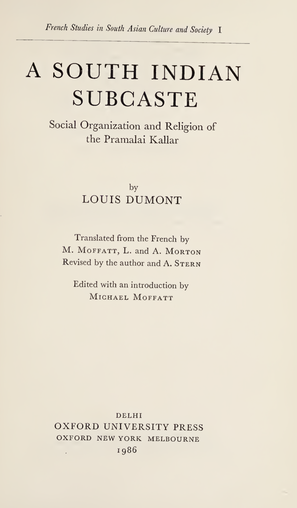{width=52%}
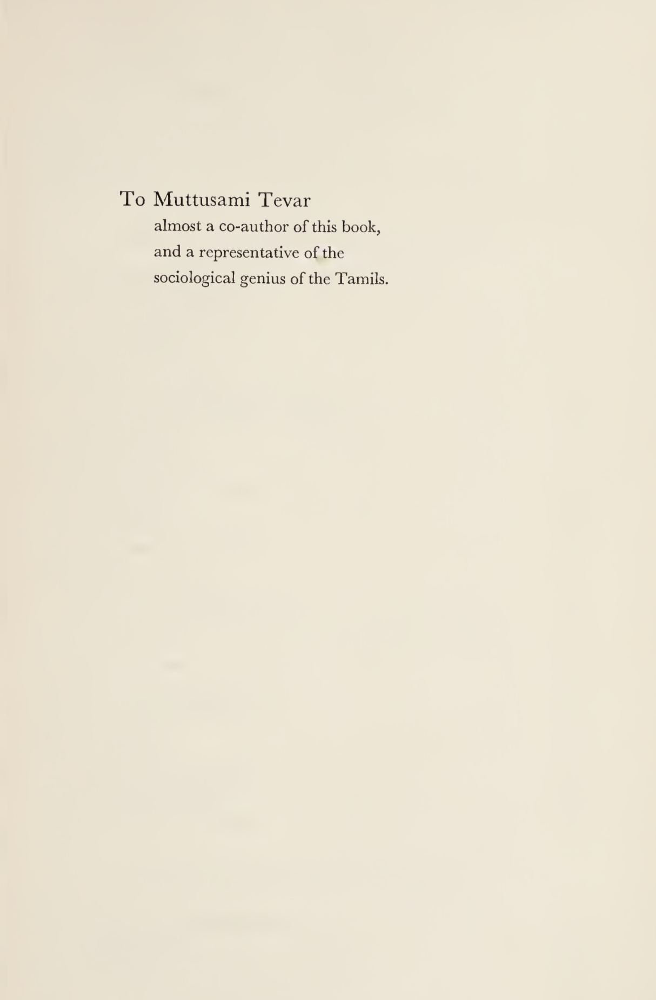{width=42%}
:::

## A South Indian Subcaste: Social Organization and Religion of the Pramalai Kallar by Louis Dumont

This Book is well-written and organized.  
Louis Dumont is considered to be an excellent anthropologist.  
The writing is clear, easy to follow through, not many books are clear.  
We can appreciate books that are deeply researched and accessible to a reader.  
Even lay-readers can understand, follow the work.  

Dumont is famous for proposing *Homo Hierarchicus*, where lower caste emulate habits of higher caste, which was labelled as Sanskritisation by M.N. Srinivasan. My own opinion as of now is, caste is evolving dynamically, organically in Indian society. Even though Tamil Nadu is an urbanized state, caste plays a major role in political voting-blocs, the central focus of Tamil’s lives as marriage, forming social capital through caste-association groups.  Dumont compares, Homo Hierarchicus, with modern Western societies based on equality, Homo Æqualis. He emphasizes traditional societies focusing on the whole, collective group and modern societies stress the individual and egalitarianism. 

### Table of Contents

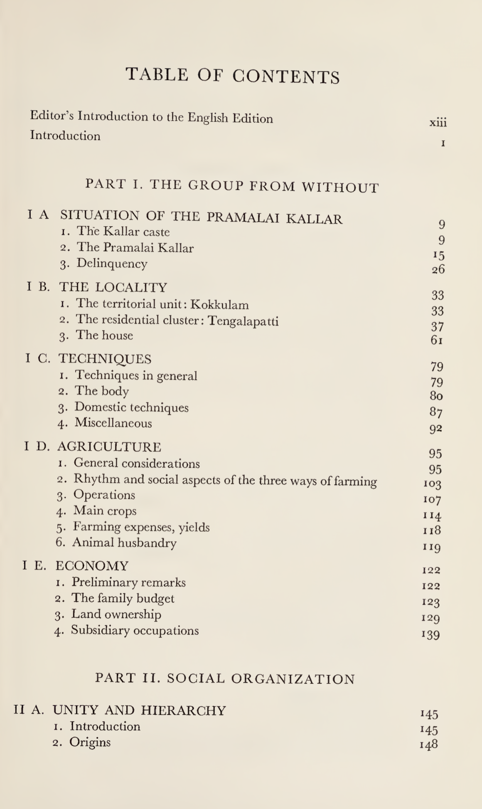{width=59%} 

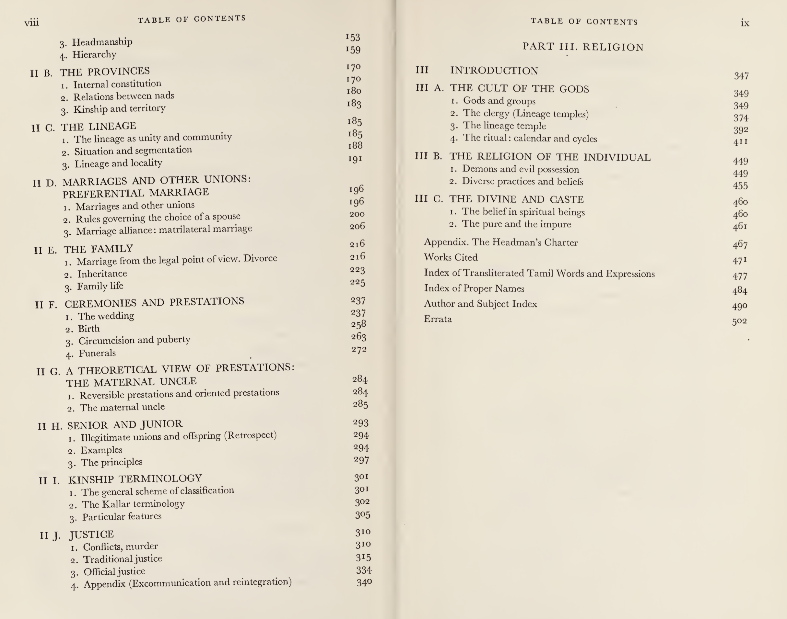{width=99%}

Having outlined Dumont's approach, structure of his study, it's important to consider, how we can develop his ideas further. Most importantly, some of his observations are resonating with social issues of current Tamil Society. 
Ethnographic work is valuable, when it helps us connect past patterns with present social realities. In that spirit, the following are a few critical questions that emerging from current social realities. 

### Application questions to ponder: 

1. There's Honor-Killings in the name of Caste, yet I wonder where the belief comes from theoretically? 
2. I am wondering if Dravidian-Kinship structure is responsible for such a belief?
3. The way Tamil Society is structured, organized might contribute to present social fissures - True or False?  

### The Answer might be in revisiting Ambedkar's writing: 

We might need to revisit Ambedkar's work, question his assumptions, we might come to different conclusions. 
As of now, I watched countless discussions from Tamil Media-Personalities, I don't find them giving original answer. 
Many blame each other, or make it into us-vs them; Some Tamils say, so and so caste's character or habit is such, that's why. This is another reason, why Tamil families like to justify endogamy. 

Louis Dumont says ideology underlying caste system is at odds with principles of egalitarian society, where all individuals have equal worth and moral status. So say someone who is from working class background, he or she has equal worth with someone who is from old-money. This underlies beliefs of American Society. 

## Introduction: Excerpts from the Book

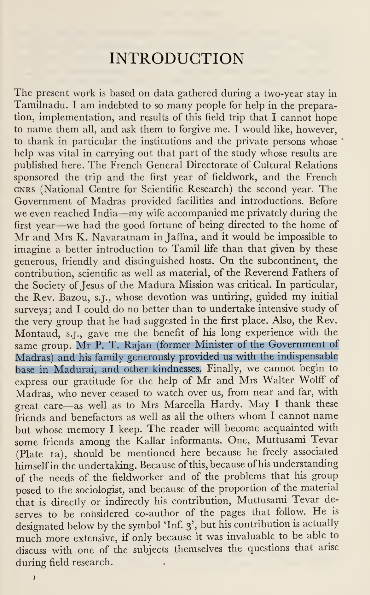{width=69% fig-align="left"}

### What's surprising in this? 

Louis Dumont had met Sir Ponnambala Thiaga Rajan, President of Justice Party. 
He was speaker of Tamil Nadu's Legislative Assembly in 1952. At present, his Grandson, Palanivel Thiaga Rajan is a Minister of Tamil Nadu Government. 

Dumont's interpretation of Caste, internal and external social relations are conceived as status hierarchy. 
Castes are ranked, layered groups based on kinship, rituals, dominance and territorial control. 
In Dumont's approach, social status, hierarchical rank are central organizational principles. 
In this structure, sub-castes are grouped layered, ranked internally. 

#### A Cross-Cultural Caste analysis: 

David West Rudner's Nattukottai Chettiars work says, Nagarathar Chettiar's do not fit within status hierarchy rank. 
They might have titles, yet their organizing principles are of egalitarian values. 
Internally, structurally equivalent kin groups were given rotating offices and responsibilities, preventing dominance of any one particular family. Nagarathar Chettiar's social structure involved clan temples that integrated the community, with decision-making and honors shared among multiple families, rather than concentrating power vertically in a strict hierarchy.

#### Historical records of Kallars: 

Thirumalai Nayak one of the rulers of Madurai during Nayak Dynasty in 17th century. 
During his time, between 1645 and 1657, Nayak issued a series of copper plate grants to Kallar Leader, Pinna Thevar. 
In his grant [1655 plate](https://eap.bl.uk/archive-file/EAP314-1-3-2), he formally recognized hereditary headmanship over Pramalai Kallars. In [1657 plate](https://eap.bl.uk/archive-file/EAP314-1-3-1), he granted cementing land and revenue rights. The [1645 plate](https://eap.bl.uk/archive-file/EAP314-1-3-3) grant of land, privileges in exchange for 50 rupee tribute. 

## 1. What is this book speaking about?  

A detailed ethnographic study of Piramalai Kallars, located within Madurai region.  
This work covers their settlement patterns, economic occupations, kinship structure, customs in marriage, judicial system, religious belief and rituals.  

The author chose to study Kallars due to earlier theories of India’s culture based on Aryan and Dravidian race, however Dumont dismissed this theory after coming in contact with Kallars, as social realities of India could not be fitted with this binary division of India, during his fieldwork (1948–1957). Moreover Aryan, Dravidian are confined to linguistic lines, race as a concept has been scientifically proven false.  

Piramalai Kallars, a sub-caste of Kallars, are part of the Mukkulathor Social Group in Tamil Nadu. Mukkulathor Social Group includes Maravar and Agamudayar castes. Mukkulathor, Thevar are used synonymously — they mean celestial divine beings. Mukkulathor means three clans united together.  

### Mythic-Origins  

Their origin story is based on being offsprings of Hindu God Indra and Celestial Woman. Susan Bayly, an anthropologist, claims Kallar and Maravar are newer social groups (caste), who were granted titles during Poligars in the 17th–18th century (chieftains). *Kallar/kallan* (robber), *Maravan* (warrior) and *Aghamutaiyan* (serf or field labourer).  

Earlier during British Era, the social group were labelled and put into category of discriminatory, denotified tribes as criminal caste, due to their rebellious attitude towards British.  

In recent political history of Tamil Nadu, they formed a major political voting block for AIADMK political party. There’s about 9.4 million of them in this social group. They are mostly located in Madurai and nearby districts, Trichy, Pudukkottai and Ramanathapuram.  

Piramalai Kallars are located in the west of Madurai; Ambalakkarar Kallars, found in the east around Melur, are mainly farmers. Piramalai Kallars consider Ambalakkarar as junior and inferior branch, due to irregular ancestry, illegitimate sons or unions with lower caste women. Thevar is the title for headman of Piramalai Kallars; although the term is democratized and used to denote all of them.  

In history, Maravars are sometimes referred as soldiers out of work. They are found in Ramnad district, perceived to be more loyal as they surrounded themselves faithfully to Raja of Ramnad — nobler and perhaps better united than Kallars. They collected protection fees (*kaval-kasu*) in Sivaganga district. Agamudayar are also known as *Agam Padaiyar* (defending soldiers).  

## 2. What occupation did they do earlier in Tamil Nadu?  

During Nayakkar dynasty (1529–1736), Kallars were mercenaries mediating conflicts of English, French and local chieftains. They were employed in the militia. They were known as "brigands" or "shock troops" post-Nayakkar era in Tamil History. Historically, the Kallar caste had a reputation as thieves, harassment, raids, destruction, plundering. They stole cattle, committed burglary, and highway robbery. They performed the function of security as watchmen (*Kavalan*), levying tithe on the revenues of productive castes.  

During the British Era, some became peasants as the British forbade the watchman system (*kaval*). They were described as mediocre farmers. At present, many are involved in quarrying, lime-kilns, transportation, money-lending, butchering, and blacksmithing. Many Maravars held large land tracts (*palayams*) during Raja of Ramnad times, responsible for revenue collection and security.  

**Wealth distribution** – In Louis Dumont's ethnography, Some families owned 5–15 acres in Tengalapatti (Vadipatti taluk of Madurai district). The rest lived in chronic cash deficit and poverty. They were not wealthy comparing with Nagarathar Chettiars. 

When asked about theft, the Kallar is conscious of it:  

> “Everyone steals. The bureaucrat takes bribes, the lawyer encourages disputes so as to pocket legal fees, the merchant waters the alcohol, salts the sugar, etc. The Kallar differ only in the directness of their methods.”

**Kallar Reclamation Policy** – Early 20th century, aimed to improve economic situation and promote education, army recruitment, and irrigation (Periyar Canal, 1895–1905). Workshops for artisans, land distribution, plantation migration, schools, and sports (bull racing) were encouraged.  

The Kallar have not widely pursued higher education. Villages remain insular and impenetrable to outsiders.  

**Modern shift** – Many transitioned into white collar government and private sector jobs, with large numbers in Tamil Nadu Police and politics.  

## 3. Property & Socio-Mobility: Wealth and how it passes?

### Story of how one Kallar family lost their wealth  

**The Grandfather (Mayattevar):**  
- Had a large farm by local standards:  
  - 5 acres of irrigated garden land (with 2 good wells)  
  - 4 acres of dry land (in 5 different plots)  
  - 0.5 acres of paddy field  

**Next Generation – The Father (Pachakumbattevar, died 1949):**  
- Initially farmed his brothers' shares when they were absent  
- Wasn't hardworking or ambitious  
- Gradually sold off land *"to eat"* (for daily expenses)  
- Lost all the dry land over time  
- Sold the paddy field to a neighbor (who dug a profitable well there)  
- Kept only 1.25 acres of garden and 0.5 acres of field  

**Final Generation – The Final Division (to his four sons):**  
- Before dying, Pachakumbattevar:  
  - Gave 0.33 acres to his wife (which would eventually go to the sons)  
  - Sold remaining garden land in small pieces to his own sons  
- Result: Each son got about 0.31 acres (1/4 of 1.25 acres)  

---

### Fates of Four Sons – Third Generation  

**Son #1 (The Successful One)**  
- Worked in Madurai textile mills  
- Brought back savings from city work  
- Bought most of his father's land while working  
- Now owns bullocks and additional land  
- *Economic status:* Doing well  

**Son #2 (The Worker)**  
- Works as rice transporter for hire  
- Gets by through hard work  
- *Economic status:* Managing  

**Sons #3 & #4**  
- Living in poverty  
- No additional income sources  
- *Economic status:* Miserable  

---

**Common features in this example:**  
- Fragmentation of good land  
- Loss of other land due to inactivity  
- Injection of outside money (allowing one of the sons to retain something like a farm)  

---

### Stories of Squandering  

A man who had worked for some ten years in the spinning-mills at Madurai returned in debt to the village and began to alienate all the property of his father, who apparently left all initiative to his son until he finally died.  

- First, one acre of garden was mortgaged for Rs 700 (interest included)  
- A supplementary agreement permitted the mortgager to retain operation in return for Rs 100 per year (!)  
- At the end of five or six years, the masoned house was lost to cover the interest  
- And so on, in total, more than Rs 2,000 appear to have been received, and dispossession is now total  

---

### Reflection on Social Mobility  

The social mobility patterns are quite interesting to read.  

I am reminded of **Sathappa Ramanatha Muthiah Chettiar**, Patriarch of Nagarathar-Chettiars. I frequently quote S. Rm. Muthiah Chettiar, as he is the patriarch of Nagarathar-Chettiars. He was responsible for donating, helping Nataraja Temple at Chidambaram.  

In their lineage, four or five generations have passed, they maintain their inherited wealth. In fact, the fourth generation **P. Chidambaram** donated a state-of-the-art library in Karaikudi, Tamil Nadu. This signifies their contribution to Tamil Society. 

---

### Inference  

From this comparison, We can infer that the Mukkulathor social group may not be fully aware of cultural values and habits that could improve their socio-economic position, partly because most Tamils practice endogamy, which limits exposure to other worldviews.

In theory, the Mukkulathors could benefit from the financial acumen of the Nagarathar Chettiars, while the Nagarathars could learn from the Mukkulathors’ pragmatic outlook on life. However, strict social boundaries prevent such social exchanges, resulting in a missed opportunity for mutual enrichment. This is prevalent across all caste groups of Tamil Nadu. 

This raises an important question: does endogamy preserve distinct cultural traditions, or does it undermine egalitarianism and reduce the potential for broader social and kinship networks? The evidence here suggests that while endogamy maintains separation of worldviews, it also reinforces caste hierarchies and restricts collaboration across groups. 

## 4. Social Organization of Kallars

The word *nâdu* is usually used in Tamil to designate a territorial unit of any extent. *Tamil country* is called *tamir nâdu*; here the country of the Piramalai Kallars is commonly referred to as *kallar nâdu*, and we have seen that the eight main territorial units within the latter are called *nâdu*.  

---

### Kinship  

Kinship is an intriguing topic, which unites people through social relationships.  
Unlike the West, Americans have the Eskimo kinship system, where priority is given to immediate family, not much distinguishing between mother’s and father’s side relatives.  

Kallars are Tamils, who are part of the Dravidian kinship system, where many social groups prefer cross-cousin marriage. Dravidian kinship practices involve the alliance theory of exchange, where marriages are seen as forms of giving and receiving.  

- **Patrilineal** – ancestry is traced through the father’s lineage, inserting father’s identity, property, social status.  
- **Household** – revolves around the male line.  
- **Polygyny** – practiced among Kallars due to frequent divorce and remarriage.  
- **Land ownership** – Kallar women did not typically own land, receiving marriage expenses instead.  
- **Marriage economics** – typically reduces Kallar families to indebtedness.  

The Kallars prefer to live in their own villages rather than mixed towns, while barbers, washermen, carpenters, and potters provide services to Kallar households. Earlier, Sakkiliyar and Paraiyars used to provide agricultural labor and perform ceremonies.  

---

### Story of Periyasami  

While monogamy is general, divorce is common, so that there are many men whose present spouse is not their first, and the same is true for women.

**Marriage 1:**  
Periyasami, the headman and priest of the small Taleiyan lineage in Tengalapatti, married four times. The first time he divorced after two years. Having ‘discovered’ that the woman was a Pulukkar, he obtained a divorce by blaming her for her bad housekeeping. As she went away after serving him his meal, he emptied the water from his rice and replaced it, and then said: 
> “See — my wife does not salt my food, she does not want to keep me.”  
There were no children born from this marriage.

**Marriage 2:**  
Subsequently, Periyasami married, thirty-three years ago, a woman of Kilakkudi, Virumayi. They lived together for three years without the birth of a child, and after a quarrel the wife returned to her father’s house, where she still lives. There has been no divorce; Periyasami goes to visit her from time to time, and his sons from the next marriage spent time with her during their childhood — one for five years, the other for three. She is a *senior mother* to them, and they will give her filial honours — they will lead the mourning when she dies.

**Marriage 3:**  
Twenty-eight years ago, Periyasami married Kaluvayi of Manvettipatti, the mother of all his children and the mistress of the house — the main wife.

**Marriage 4:**  
Some fifteen years ago, Periyasami married this woman’s younger sister, Pecci Amma. She had been married in Aiyampatti before. The husband suspected Periyasami of having had relations with her and forced him to prove his innocence through an ordeal. Finally, they divorced and Periyasami married the woman. She remained with her father, and Periyasami bought Rs 100 worth of land at her place for her maintenance, which her father cultivates. There are no children.

---

### Father–Son Rivalry  

Rivalry smoulders between the father and his eldest son. Once he is married, the son has a choice between remaining dependent on his father and becoming independent.  
> “The choice is to be a dog or a wolf.”  

The Kallar generally chooses to be a wolf. His independence is costly, he can expect nothing from his father. The father retains all the family property until his death.  

---

### Violence & Murder  

An experienced, intelligent police officer told me:  

> “The Kallar kills impulsively. We should probably make a distinction. The Kallar who is surprised during an outside expedition kills impulsively, perhaps out of fear. The Kallar who is involved in an internal quarrel on the other hand also kills in calculated fashion, although he sometimes lets himself become carried away with his anger; and he often attacks the weaker and less dangerous adversary rather than the main opponent.”  

Murder is the most serious form conflict can take, for the Kallar as for us, and at any rate the most costly. We might guess that, in its formal and recognized form, so to speak, murder implies a certain distance between the murderer and his victim.  

In one case, a husband killed his wife and went to give himself up to the police with the weapon still in his hand:  
> “The body is in such-and-such a place, the head in such-and-such another place.”  
(*A ‘grandfather’ of Inf. 3, deported and then pardoned.*)  

But this case seems exceptional. A husband may beat his wife or divorce her, but I am inclined to believe that he does not kill her, in spite of certain cases culled from court records.  

---

### Excommunication Case  

Kallars practice excommunication.  

A story from the book that the author interviews:  

A rich man has taken an Untouchable servant woman as his mistress. She is pregnant, and since she is not married, there is no one to accept the child’s paternity.  

After four months, the family notices. There is a quarrel. The women beat the servant:  
> “Why didn’t she say something sooner, when she could have had an abortion (between one and three months)? Now it is too late.”  

The village is buzzing when the news gets out:  
> “They set fire to the village when they reveal the situation.”  
> “They talk about it on every street corner, on the mandai and elsewhere” 

Inside the house they try to suppress the scandal; they bring in an Untouchable woman abortionist (Rs 150). She subjects the pregnant woman to a diet based on *tinei* (*Setaria italica*), at the rate of one meal a day. The woman aborts. The foetus is buried at the end of the tank.  

### Social practices 

>Female Infanticide  

Female infanticide was largely practiced in the Kallar community.  
- Faced with unbearable socio-economic pressures, an estimated **6000 babies** were killed between 1976 and 1986 alone.  
- The first daughter is rarely killed.  
- Successive female infants face murder because of the social and economic burdens that crush this community.  
These days, it is less prevalent as there are laws against it. 

## 5. Religious Life

Religious values are intrinsic, deeply ingrained as part of their social group.  
They have:  
- **Common temple** (*Podhu-Kovil*)  
- **Private temple** (*Sondha-Kovil*)  

This leads to three categories:  
1. Village cults  
2. Nad cults  
3. Lineage cults  

They celebrate **Tai Pongal**, **Adi**, **Kartikka**, where animals are sacrificed. Oftentimes, they are the climax of a festival.  

Religious expressions such as belief in *Pei/Pisasu* are common. Sterility in women is often attributed to a *Pei*. Distinction between pure and impure permeates their social group.  

Kallars have rigorously oriented space:  
- **North** – for upper caste  
- **South** – for meat-eaters, lower caste  

Their engagement in philosophical concepts includes karma, though moral codes are less pronounced.  

---

### Village Deities & Community Space  

- **Mandei Karuppanaswami** (*Black God*) and **Mandai Amman** are village Gods.  
- Believed to protect them from epidemics and provide prosperity.  
- The **village square** (*Mandai*) provides the place for community life, resolving disputes, and administering justice.  

The majority of the conflicts are disputes over land, boundaries, mortgage, and murder among their own kin is common.  
While the Tamil Nadu court now controls the justice system, traditional practices persist in memory.  

---

### Religious Diversity  

There are some Kallars who were Muslims.  
- Muslims are *Thaivazhi Sontham* (related through mother’s line).  
- The Piramalai Kallars had the custom of **markkakalyanam** (circumcision).  
- Kallar boys were ritually circumcised before puberty. However, *markkakalyanam* is not so prevalent among the Kallars now.  

---

### Christianity Among Kallars  

Christianity is practiced among Kallars.  
- Many Christian missionary stations were established in Madura county.  
- Swedish mission, namely Madura Pudukkottai and Anikadu.  
- Swedish missionaries focused on Ramnad; Himmelstrand founded the station at Usilampatti.  

According to missionary Else Gäbler, wife of Gustav Hermann Gäbler who worked in Pattukkottai:  

> “The Kallar are a characteristic. Harsh people, thieves, and robbers are in the community.”  

But I don’t agree with this statement because later part of my article I explained origin and occupation of Kallars (Gäbler 1936).  

However, the Gospel brought them social change. The social change has been explained by the missionaries in the following way:  

> “God’s word has not come back empty. Our best and most efficient pastors and teachers have emerged from the Kallar communities.”  

For example, the well-known native Tamil preacher **N. Devasagayam** mentions his own origin as being the *Kaller caste*.  

---

### Geographical Location and Kinship Structure of Piramallai Kallars

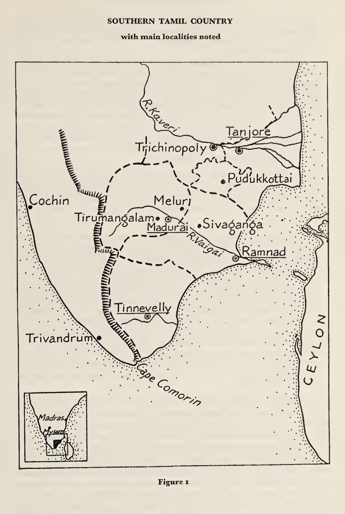

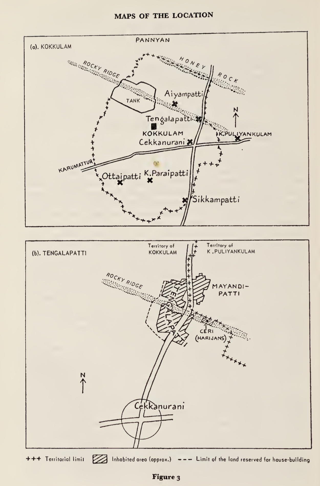

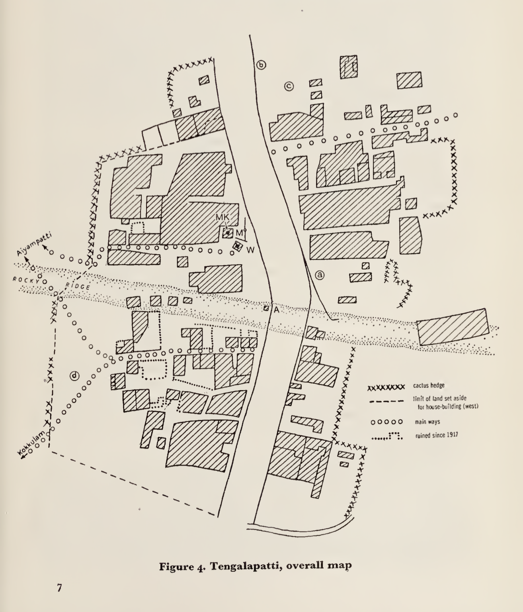

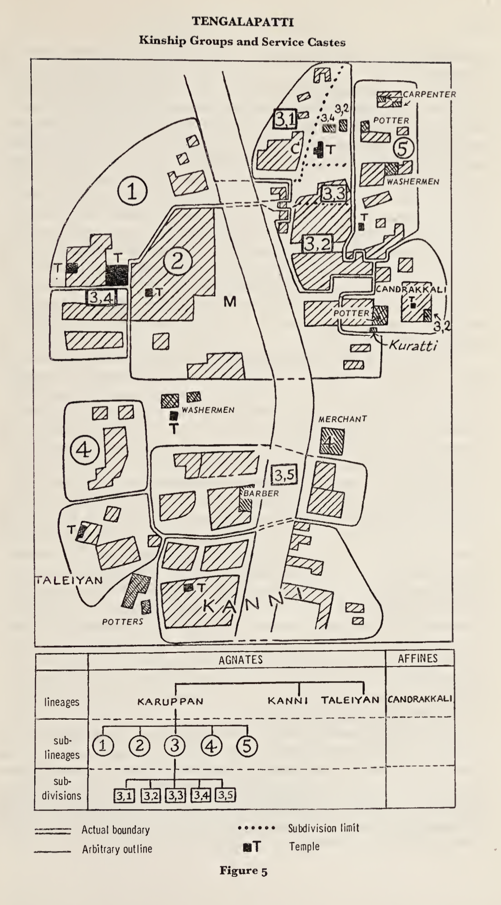

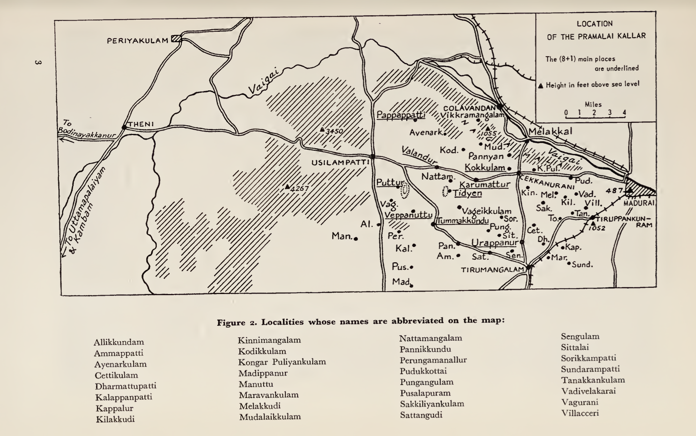

### Final Note  

This work is superb. I highly recommend reading this work, to anyone interested in Sociology, Anthropology. 
Louis Dumont applies Structuralist Ethnography in this work to study Kallars of Madurai.  
Structuralist method is applied by analyzing cultural practices, religious belief, rituals, myths, to uncover underlying patterns, logic and structure which governs the culture.  

As a Social-group, they appear to lack awareness, of requirements by Modern Economy. 
Tamil Nadu's Economy is [growing at 11.19%](https://rickrejeleene.me/Tamil/posts/2025-08-10-Tamil-Economy25/index.html), 
with service sector occupying majority of the growth. To gain employment, a college degree is pre-requisite. 
Internally the Kallar youth may have been discouraged from pursuing an education. 
This was observed among Nagarathar Chettiar Youth, who shunned education. 
The reason was education made them aloof and abstract. 

Caste has always been of high discussion among Tamils.
The discussion fizzles after sometime, with nothing original being formed at the social organization level. 
It is a repeating social issue, that appears in current events of Tamil Society. 

---

## 6. Ethnographical Visual Archives of Kallars in 1950s:

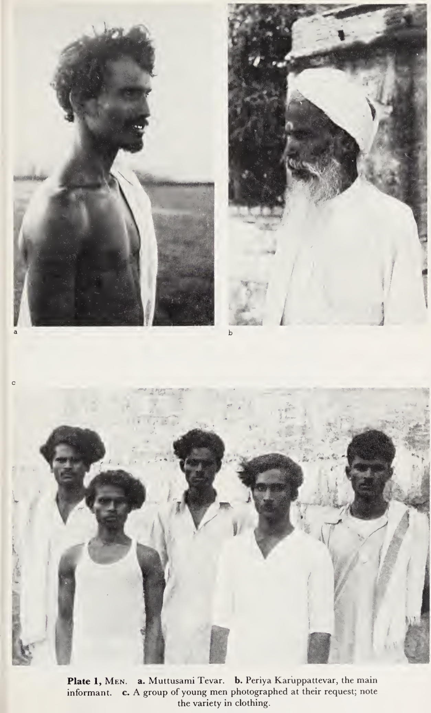

## Selected readings to explore on Caste and Tamil Nadu

1. [*Caste and Capitalism in Colonial India of The Nattukottai Chettiars*](https://publishing.cdlib.org/ucpressebooks/view?docId=ft88700868;chunk.id=0;doc.view=print) – David West Rudner  
2. *The Elementary Structures of Kinship* – Claude Lévi-Strauss  
3. *Dravidian Kinship* – Thomas Trautmann  
4. [*The Big Bang of Dravidian Kinship*](https://test-anthro.web.ox.ac.uk/sites/default/files/anthro/documents/media/jaso3_1_2011_38_66.pdf) – Ruth Manimekalai  
5. Manoharan, Karthick Ram (2019) – [*Murder in Mudukulathur: Caste and Electoral Politics in Tamil Nadu*](https://www.goodreads.com/review/show/3566094304)  
6. Murthy, Jayabalan (2023) – [*Christianity and Its Impact on the Lives of Kallars in Tamil Nadu*](https://www.mdpi.com/2077-1444/14/5/582)  
7. B.R. Ambedkar – [*Annihilation of Caste*](https://www.goodreads.com/review/show/2322239228)
8. Narayani, P. A. (2020) – [*King Thirumalai Nayak and the Kallar connection*](https://www.thehindu.com/news/cities/Madurai/king-thirumalai-nayak-and-the-kallar-connection/article32431472.ece)
