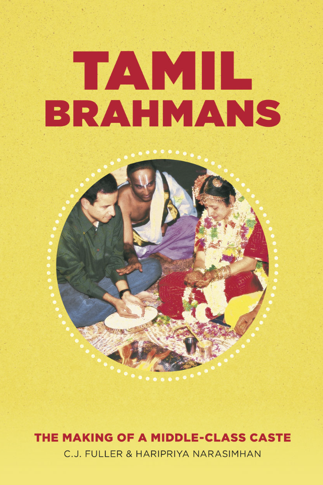
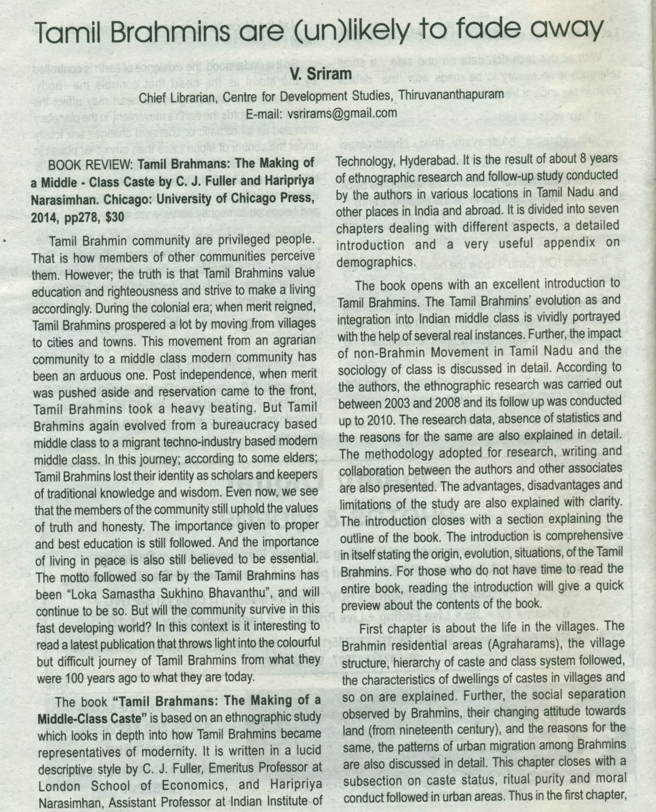
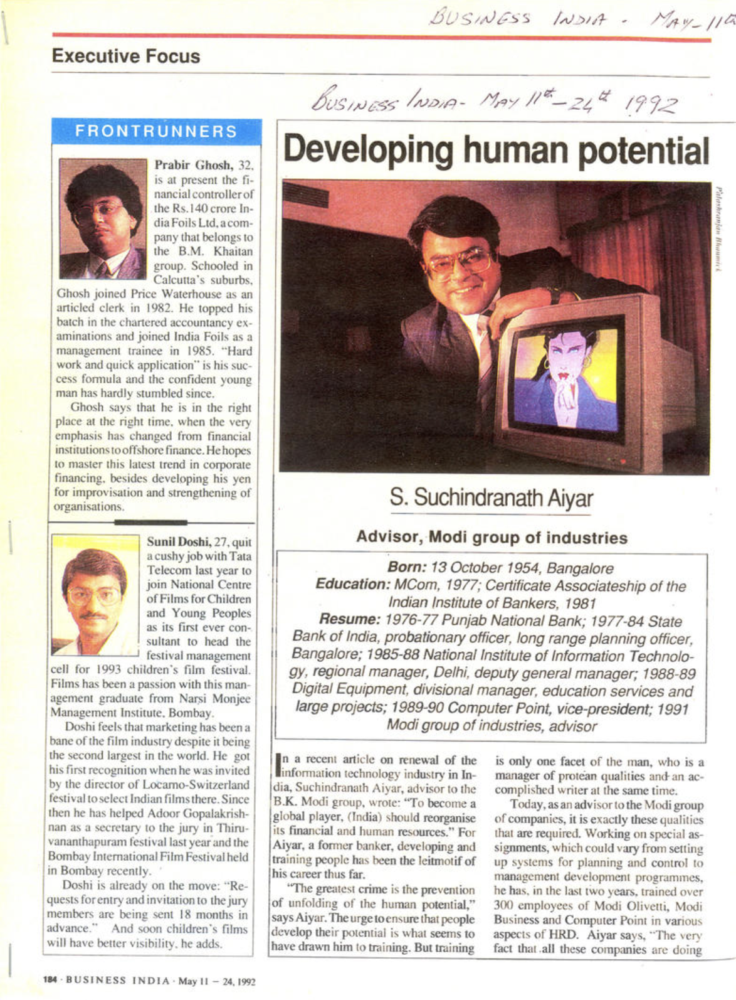
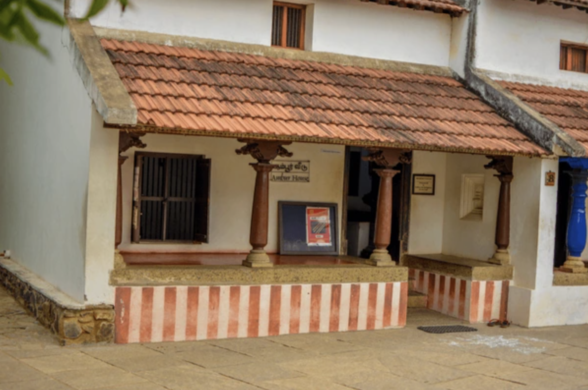
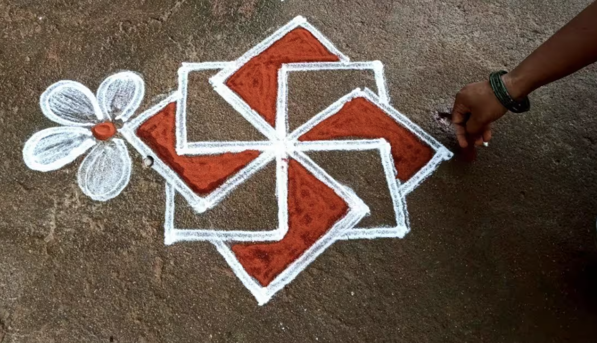

<!-- Intro image at the beginning -->

  

# Introduction

Caste has always been an inescapable part of Tamil society. Growing up in southern Tamil Nadu, I witnessed how caste permeates politics, marriage, customs, and even death rituals. In some cemeteries, people from certain castes are banned from burial, and riots have broken out over such issues. This illustrates the enduring force of caste boundaries in Tamil society. 

At Present in Tamil Society, Tamil Brahmins are urbanized. They are orthodox, yet at the same time modern. In Tamil society are found in many spheres of occupations. Endogamy, at the heart of Caste is still an issue, to which I've been pondering for a while, maybe compare and look for tangible solutions. I encountered kinship structures, Maybe there might be the answer for tangible solutions? 

This post is a reflection inspired by **C.J. Fuller and Haripriya Narasimhan’s book _Tamil Brahmans: The Making of a Middle-Class Caste_**, an excellent work based on detailed ethnographic surveys.  The aim here is to provide a brief overview of the **history, transformation, and present-day identity** of Tamil Brahmins.

### Unlikely to fade away

  

Click or ← → to change

Acknowledgements: V. Sriram, Chief Librarian, Centre for Development Studies, Thiruvananthapuram,  
E-mail: vsrirams@gmail.com
Publisher: Vipradwani: A Multi Cultural Monthly of Kerala Brahmana Sabha, Thiruvananthapuram, Vol - 3, Issue - 13, August 2015

# Historical Background

## From Agrarian Villages to Agraharams

Tamil Brahmins were historically less than 3% of Tamil Nadu’s population, yet their cultural and political influence was significant. Traditionally, they lived in **agraharams**—village settlements around temples granted by kings or landlords. Their roles were primarily as priests, landlords, and scholars in an agrarian society.  

Over generations, they earned a reputation as learned elites. Even today, they are known for academic excellence.
At present, the popular perception is they are skilled at learning. Some might even believe, they have genes for such abilities.
However, it's the cultural capital that has been part of their social-group, know-how and values that shapes them. 

In terms of social sphere, as Tamils practice endogamy strictly, their social peer groups are mostly relatives, few friends from work, college. 
This limits other social groups to freely mix with Tamil Brahmins, as both can learn from each other. This might be the problem of Endogamy. 
As I shared in earlier writings. 

## Colonial Transformation

During the **Madras Presidency under British rule**, Tamil Brahmins were among the first to embrace **English education** and white-collar jobs. They filled professions such as law, administration, academia, and science. From 18th - 21st Century, Tamil Brahmins influenced in many spheres of Social Fabric in Tamil Nadu.

Notable figures included:  
- **V. Bhashyam Aiyangar**, a towering jurist commemorated at the Madras High Court.  
- **S. Subramania Iyer**, judge and educationist.  
- **Sir C. P. Ramaswami Iyer**, Indian lawyer, Advocate-General of Madras Presidency in 1920s
- **Srinivasa Ramanujan**, legendary mathematician.  
- **C.V. Raman**, Nobel Prize-winning physicist.  
- **Venki Ramakrishnan**, Nobel laureate in Chemistry.  
- **T.V. Sundaram Iyengar**, pioneering industrialist.  
- **Chakravarti Rajagopalachari**, Scholar, Governor-General, Chief Minister of Madras State.  
- **J. Jayalalithaa**, former Chief Minister of Tamil Nadu, Actress.

By the early 20th century, Brahmins (mostly Tamil) occupied **~70% of high-level posts in Madras government**. This disproportionate representation created resentment among non-Brahmin groups.

## Dravidian Challenges Contested

In the popular discourse, many speak of Brahminism as values associated with social-order and discrimination.[^1]  
This can be certainly contested, however bulk of Tamil Political discourse after 1960s shifted towards focusing on Brahminism.
To an average Tamil, this meant, introducing non-Brahmin social group into white collar jobs. 
They argued, Brahminism is not same as Brahmins. This is hotly contested politically by both sides. 
I'd allow space for other side. 

Brahminism is religious, cultural, and social system centered around the Brahmins, who represent the highest varna or social class in Hindu society of four varnas: Brahmins (priests and teachers), Kshatriyas (warriors and rulers), Vaishyas (merchants and farmers), and Shudras (laborers). Brahminism, therefore, is both a religious ideology and a social doctrine that upholds Brahmin supremacy and ritual purity and justifies a hierarchical social structure.[^2]

C. J. Fuller (1992), *The Camphor Flame: Popular Hinduism and Society in India*. Princeton University Press.  
Fuller describes Brahminism as the system of ritual, purity, and hierarchy rooted in Brahmin authority.[^2]

[^1]: For discussion of Tamil political discourse and social critiques of Brahminism, see:  
    - Pandian, M. S. S. (2007). *Brahmin and Non-Brahmin: Genealogies of the Tamil Political Present*. Permanent Black.  
    - Subramanian, Narendra. (1999). *Ethnicity and Populist Mobilization: Political Parties, Citizens and Democracy in South India*. Oxford University Press.  

[^2]: Fuller, C. J. (1992). *The Camphor Flame: Popular Hinduism and Society in India*. Princeton University Press.

## Rise of Anti-Brahmin Politics

- As early as **1916**, the **Justice Party** demanded reservations in jobs for non-Brahmin castes.  
- **Periyar E.V. Ramasamy** spearheaded the **Dravidian Movement**, directly attacking "Brahminism" and implementing affirmative action.  
- By **1967**, Dravidian parties consolidated power in Tamil Nadu, reducing Brahmin presence in government and academia.  

As the affirmative action policies started to take root into Tamil Nadu's Government, the demographics of people in Tamil Nadu government shifted. 
Slowly after two or three generation Brahmins, who were professionals, the newer youth could not gain employment, so they migrated towards other opportunities. 

> Question of Human-Capital? 

In Tamil Nadu, as Tamil Politics targeted Tamil Brahmins.
We can wonder about question of Human capital and Tamil Brahmins? 

Thomas Sowell is an Economist and famous author of Basic Economics. 
In his famous work, Wealth, Poverty and Politics: An International Perspective, He focuses on Human Capital. 
He shows how successful social groups were targetted across the world, across society. 
Either their wealth was confiscated or they abandoned the town. In the end, the society loses the skills, know-how. 

He says, when highly productive groups of society are marginalized it might result in negative outcomes.
While lot of Tamil Brahmins migrated towards greater job opportunities. Sowell says, it will lead towards negative outcomes, yet Tamil Nadu didn't crumble? 
I don't know the answer, Why? 

In terms of Human capital, consider additional example of two-towns, where economic productivity are starkly different. 
Another example is from harshest coldest towns in Russia. It's paradoxical example, where it's difficult to live, survive. 
However, the men and women living in these towns are surviving. Some thriving due to their skills - take Yakutsk. Yakutsk has a per capita $20k, higher than the Southern Tamil city, Tirunelveli, where agriculture products like potatoes, wheat, vegetables in arctic weather and mining dominates their productive capacity. Tirunelveli had Agraharam settlement in a small village caled, Kallidaikurchi. Many Brahmins migrated, left to greener pastures. Maybe the town of Tirunelveli has lost skills drain and wane of cultural capital due to migrations. 

Thomas Sowell's theory of human capital in Tirunelveli can be applicable. Many Kallidaikurchi Brahmins became White collar professionals, with few creating industries.  Sankaralinga Iyer created India Cements in 1946. As many Brahmin families left, India Cements did not expand. It was recently sold off to UltraTech Cement. Authors notice, write decline of Tamil Brahmins as they have migrated, lost their own traditional, cultural values.[^3]

[^3]: Boloji.com. (n.d.). *Tamil Brahmins*. Retrieved from [https://www.boloji.com/articles/9570/tamil-brahmins](https://www.boloji.com/articles/9570/tamil-brahmins)

## Migration and Adaptation

Tamil Brahmins did not fight politically, 
Rather than resist, Tamil Brahmins migrated—  
- Within India (to Delhi, Bombay, Bangalore).  
- Abroad (Europe, North America).  

They entered central government, private sectors, and later, the booming IT industry. Over time, they **bent caste taboos**—accepting medicine, engineering, and even overseas travel once considered ritually impure.

Few challenge this migration story, such as Tamil Nadu's Minister, P.T. Rajan[^4].
He argues that it was opportunity that attracted Tamil Brahmins emigration, and their education allowed them towards global career launchpads. 
Dravidian Politics was centered around Brahminism, P.T. Rajan defends and welcomes their achievements as gain. As their success benefits Tamil Nadu. 
He gives example of TVS Group, started by T. V. Sundram Iyengar[^5]. TVS was started by Tamil Brahmin, which began as a bus transport business in 1911 and later expanded into automobile dealerships, with Sundaram Motors incorporated in 1945. 

[^4]: [Tamil Brahmin emigration was driven by opportunity, not socialism or identity politics](https://www.thenewsminute.com/tamil-nadu/opinion-tamil-brahmin-emigration-was-driven-opportunity-not-socialism-or-identity-politics).
[^5]: [History of TVS Group, started by Tamil Brahmin, Sundaram Motors](https://www.sundarammotors.com/Aboutus.html).

# Values and Middle-Class Identity

Fuller and Narasimhan argue that Tamil Brahmins **merged caste with class identity**. 
The Old Brahmanical ideals of ritual discipline transformed into, 

- **Education** → Professional achievement.  
- **Learning** → Scientific and academic excellence.  
- **Social propriety** → Middle-class respectability.  

### Core Values Observed:
- **Investment in Education**  
- **Investment in Housing**  
- **Investment in Future Generations**  

Tamil Brahmin families sacrifice heavily for their children’s schooling, echoing patterns of American upper-middle-class families.
One of the most important values is admiring knowledge, seeking knowledge for the sake of knowledge. 
This value is communicated through Science [^gosling1] and the Indian Tradition, India in the Modern World by David Gosling [^gosling2]

[^gosling1]:[Science and the Indian Tradition, India in the Modern World by David Gosling](https://www.goodreads.com/review/show/3673809600)
[^gosling2]: [Science and the Indian Tradition, by David Gosling, Routledge Press](https://www.taylorfrancis.com/books/mono/10.4324/9780203961889/science-indian-tradition-david-gosling)

He is a nuclear physicist and academic describes majority of Upper-castes of India valued knowledge. 
David Gosling observes that while upper-caste groups valued scientific knowledge for its own sake, many other social groups prioritized quicker financial returns, which shaped their underrepresentation in academia. In this case, for other social groups, the financial benefits might not be rewarding for pursuing scientific research in Indian academia. This is why, there is higher representation is among upper-castes. 

# Women, Culture, and Modern Life

Over the 20th century, these norms have liberalized significantly. By the late 1900s, Tamil Brahmin women began pursuing higher education and professional careers alongside men. The book by Fuller & Narasimhan documents how today it is normal for women in this community to work in white-collar jobs, and companionate marriage (where the husband and wife are closer in age, educated, and treat each other as partners) is now the idea

The transformation was not only occupational but also social.  
- **Women’s roles** expanded in education and employment.  
- Cultural contributions remained strong in **religion, Carnatic music, and Bharatanatyam dance**.  
- Daily life today reflects **urban, white-collar, middle-class occupations**: engineers, doctors, software professionals, academics, bureaucrats, and entrepreneurs.  

A traditional Tamil Brahmin wedding ceremony in progress infuses both traditions and modern values. 
Despite modern education and lifestyles, Tamil Brahmins continue to celebrate weddings with elaborate Vedic rituals and customs. Brides and grooms today marry at a later age than in the past, and often share similar educational backgrounds, reflecting a shift towards more egalitarian “companionate” marriages within the community. Caste endogamy remains the overwhelming norm, Tamil Brahmins almost always still marry within the Brahmin community.

# Comparative Perspective

Reading about Tamil Brahmins reminded me of other socio-economic classes that combined tradition with modern adaptation.
There are three, which we can briefly highlight. 

- **Prussian Junkers** in Germany.  
- **Bengali Bhadralok** in India.  
- **Japanese Meiji-era elites**.  

The Junkers were social group in Prussia, influencing political power in 1850s-1930s. 
Mainly, the owned estates and pesants worked to maintain them. The famous Prussian Junker was  Otto von Bismarck. 
While Tamil Brahmins focused on White collar occupations, Prussian Junkers were found as Soldiers, mercenaries, Administraors, Military Leaders. 
The Junkers owned majority of the arable land, controlling the Prussian Army, giving them immense social status and political influence. 

They formed tight knit elite group, comparable to Mylapore Clique, which consisted of small group of brahmins from lawyers, educators, industrialists. 
During early 1880s-1920s, they exerted incredible influence especially in Madras High Court, Legal system. They influenced jobs for well-connected candidates. 
Srinivasa Ramanujan, got financial support from  R. Ramachandra Rao, a District collector, President of Indian Mathematical Association (1915-1917). 
He was able to get a job as a clerk in Madras Port Trust. The Junkers controlled monopoly on agriculture, east side of River Elbe. 
They took advantage of the monopoly, by storing up grains and driving up prices, giving them wealth to maintain control over political office. 
The Junkers were considered to be anti-democractic, supporting protectionism and conservative. 

Bengali Bhadralok was three caste groups together,  Brahmin, Baidya and Kayastha. 
In this Social group, Wealth, English education, and high status in terms of administrative service. 
Raja Ram Mohan Roy, Tagore family were all part of Bengali Bhadralok. 
Unlike the other social groups, the Bengali Bhadrolok declined after Independence. 
As they could not organize businesses, mechanics of production, agriculture. 

The Spoils of Partition by Joya Chatterji:

*"Bengal's partition frustrated the plans and purposes of the very groups who had demanded it. Why their strategy failed so disastrously is a question which will no doubt be debated by bhadralok Bengal long after the last vestiges of its influence have been swept away.But perhaps part of the explanation is this: for all their self-belief in their cultural superiority and their supposed talent for politics, the leaders of bhadralok Bengal misjudged matters so profoundly because, in point of fact, they were deeply inexperienced as a political class. Admittedly, they were highly educated and in some ways sophisticated, but they had never captured the commanding heights of Bengal's polity or its economy. They had been called upon to execute policy but not to make it. They had lived off the proceeds of the land, but had never organised the business of agriculture. Whether as theorists or practitioners, they understood little of the mechanics of production and exchange, whether on the shop-floor or in the fields. Above all, they had little or no experience in the delicate arts of ruling and taxing people. Far from being in the vanguard as they liked to believe, by 1947 Bengal's bhadralok had become a backward-looking group, living in the past, trapped in the aspic of outdated assumptions, and so single-mindedly focused upon their own narrow purposes that they were blind to the larger picture and the big changes that were taking place around them"*

Meiji-era was during 1868 to 1912, where Japan modernized itself rapidly. 
It's one of the most important era in History. Japan pulled itself from feudal society, launcing as industrial, modern nation.
This was possible due to small group of former samurai. 

They were from Western parts of Japan (Satsuma, Chōshū, Tosa, and Saga)
They valued education highly, advocating through individual development, meritocracy, national independence through personal independence. 
Fukuzawa Yukichi is one of the famous Meiji Era reformers, who advocated for Japanse modernization, emphasis on education.
Pratical learning, where Western education were absorbed, emphasized in governance and industry. 
One demonstrative work is [An Encouragement of Learning by Fukuzawa Yukichi](https://www.jstor.org/stable/10.7312/fuku16714).
In these essays, Fukuzawa advocated for the adoption of Western modes of education to help the Japanese people build a modern nation.

All share traits of valuing, learning & education, shaping their societies.

# Outline of Fuller & Narasimhan’s Work

1. The Village: Caste, Land, and Emigration to the City  
2. Education and Employment in the Colonial Period  
3. Education and Employment After Independence  
4. The Changing Position of Women  
5. Urban Ways of Life  
6. Religion, Music, and Dance  
7. Tamil Brahmans as a Middle-Class Caste  

Haripriya further has expanded and contributed, [*From Landlords to Software Engineers: Migration and Urbanization among Tamil Brahmans*](https://eprints.lse.ac.uk/4138/1/Fuller_From_landlords_software_2008.pdf). In this, the anthropologist argues migration, urbanization and education allowed them to transition from mirasidars to disproportionately represented in India's IT industry.

The author has collected family genealogies, tracing grand-father, father were mirasidars, subsequently newer generation moved into Banking, Law, Accounting, IT professional careers. Families owned small-landholdings, shifted to government jobs, and newer generation were in Bangalore or working abroad. The sons of mirasidars were sent to English education schools, who then took clerical positions in English period of Madras Presidency. The enrollment of Madras Presidency shows disproportionately high Brahmin representations. This education is carried into requirements for IT professional careers.  

### Family occupation trajectory

*Nagalingam’s father had onebrother,whose only daughter,Rajalakshmi ,also born in 1927, married a landlord, and they have four children, now in their f ifties. Rajalakshmi’s elder son works for the CUB in Coimbatore and the younger son works in Bangalore for a financial advice and services company started in Chennai in 1974 by Vasudevan, Rajalakshmi’s younger daughter’s husband, who is also a chartered accountant. Vasudevan’s elder daughter is an IT professional living in the United States, his younger daughter is married to a CUB manager in Kumbakonam, and his son works for his father’s company in Chennai.* 

*Rajalakshmi’s elder daughter is married to her cross-cousin (once removed), a landlord in another Vattima village, and they have three sons, one working for the same financial company in Mumbai (Bombay) and the other two for software companies in Chennai. Nagalingam’s father also had one sister, whose four sons, all born in the 1930s, are respectively two retired lawyers, who practiced in nearby Kumbakonam and Mayuvaram, and two landlords (one just mentioned as married to his cross-cousin). Each lawyer had two sons: one works for the CUB in Tirucchirappalli, and three are in Chennai, one in a large private-sector company, one in business, and one an accountant.*

*First, upwardly mobile middle-class Tamil Brahmans have generally migrated more extensively than their lower-class counterparts. Brahman clerks employed in government or banks, or cooks or factory workers, for example, were and are more likely to be fairly stationary within Tamilnadu than those in professional occupations. Secondly, in almost all cases of Brahman migration, men, not women, have been the active agents. Men decide to move for education and employment, and their wives and families accompany them. Similarly, parents encourage or permit sons, rather than daughters, to move away from home for education or employment. In recent years, however, daughters have often enjoyed the same educational opportunities as sons and, particularly in the IT industry*

The contribution from Haripriya on Migration and Urbanization among Tamil Brahmans is worth reading. 

# Conclusion

Tamil Brahmins as a Social group, show tangible path towards illustrating how **a small rural caste transformed into a globalized, professional middle-class community**. Despite political setbacks in Tamil Nadu, they leveraged education and migration to thrive successfully. 

For anyone interested in **social mobility, history, and cultural adaptation**, this book is invaluable.  
- For **Tamils**, it offers insight into the dynamics of caste and politics.  
- For **Westerners**, it provides cultural context when engaging with Tamil families and businesses.  
- For anyone who is interested in Tamil Politics & Social Group.

Due to Globalization, migration, How might, Tamil Brahmins in the future sustain identity, where caste endogamy might weaken? 

## The typical Tamil Brahmin of 70s-90s: Managers & Advisors

  

  

### Current Generation Tamil Brahmins: Industrialists

Sridhar Vembu exemplifies frugality, education and hardwork by co-founding, Chief Scientific Officer of Zoho Corporation. 
His company, Zoho Corporation produces business software and web based tools.

<u>**Best of Bootstrapping by Sramanamitra**</u>[^8]:

Zoho has been a tremendous success story in the cloud. 
I’ve known Zoho CEO and founder Sridhar Vembu for many years. 
Here is my conversation from 2007, when Zoho was a new on-demand office suite. 
Sridhar shares his rather unorthodox but brilliantly successful entrepreneurial journey.

Also read my follow-up interview from 2016, where Sridhar discusses his strategy for Zoho’s next phase of growth, 
and his general observations about the dysfunctions in the cloud ecosystem.

Sramana: I would like to start this interview by tracing your background.

Sridhar: I was born in India, I went to Madras IIT for my undergraduate and came to Princeton to do my PhD in 1989. In 1994 I joined Qualcomm in San Diego. My PhD is in electrical engineering, so I really do not have a software background. I worked on wireless communication which was my area of interest at the time. I worked with Qualcomm for two years. I worked on CDMA, power control and some very detailed issues on wireless communications. That is how I got started in the tech industry.

My brother, who was also there at Qualcomm as a software engineer, wanted to return home to India. Software is a great business to start in India, so he moved back to India and I moved to Silicon Valley to drum up interest in our fledgling venture, which later became AdventNet. We ended up partnering with Tony Thomas, who had some network management software and was experienced in the area. We partnered and created a development center in India. I started selling it to customers in the Bay area, to Cisco and folks like that, and it was a great time to be selling that piece of software because there were a lot of networking companies getting started in the Bay area in the late 1990’s timeframe. That is how our company got started. The name of the company is AdventNet.

Sramana: Tony had written this software already and you got yourself the distribution rights?

Sridhar: He had written a very early piece, he set up a development center in India and we started adding more to that core. He had developed some software by himself, but we came together and developed it further. All credits to Sramana Mitra.

[^8]: Sramana Mitra. *Best of Bootstrapping: Happily Bootstrapping with Zoho CEO Sridhar Vembu*. September 13, 2022. [Link](https://www.sramanamitra.com/2022/09/13/best-of-bootstrapping-happily-bootstrapping-with-zoho-ceo-sridhar-vembu)

### A Tamil-Agraharam

  
  

A Tamil Agraharam, Brahmin settlement or quarter, where you have two houses running in parallel. 
A Temple is one at the end or on both sides, either temples dedicated to Shiva and Vishnu. 
Historically, an Agraharam was originally a grant of land and income from it, awarded by kings or noble families for religious purposes. 

This grant was meant to support Brahmins, who maintained the temples and performed religious duties. 
These settlements were known for their distinctive architecture suited to the local climate, featuring houses with verandas, courtyards, and community-oriented design, fostering joint family living and religious lifestyle [^9]. Women are drawing flower patterns (Kolam) using rice flour as an art. It's widely drawn infront of Homes. 
It's a symbol of Goddess Lakshmi, wealth and prosperity, warding off evil spirits. It's even to offer food for birds, insects. 

[^9]: [P. T. Srinivasa Iyengar (1929). *History of the Tamils from the Earliest Times to 600 A. D.](https://en.wikipedia.org/wiki/P._T._Srinivasa_Iyengar)

-- 

## Authors referenced in this work

- [Chris Fuller: British anthropologist, scholar of Hinduism and caste](https://www.lse.ac.uk/anthropology/people/chris-fuller){.small}  
- [Haripriya Narasimhan: Professor of Anthropology and Sociology, IIT Hyderabad](https://iith.ac.in/la/haripriya/){.small}  
- [C. J. Fuller, Haripriya Narasimhan: From Landlords to Software Engineers, Migration and Urbanization among Tamil Brahmans](https://eprints.lse.ac.uk/4138/1/Fuller_From_landlords_software_2008.pdf){.small}
- [Book Reference — Sir V. Bhashyam Iyengar: *His Life*](http://panjabdigilib.org/webuser/searches/displayPageContent.jsp?ID=8619&CategoryID=1&page=7&Searched=W3GX){.small}  
- [The Hindu Feature — C.J. Fuller: *Tracing a Changing Graph*](https://www.thehindu.com/features/metroplus/tracing-a-changing-graph/article2856687.ece){.small} 

---
