# How a Window AC works? 
>by Rick Rejeleene

In Previous work, We explored the theoretical foundation of Air-conditioners. 

We covered this in our previous article: [How Air-conditioners work](https://rickrejeleene.me/Tamil/posts/2025-07-15-Airconditioners/index.html)

In that post, it was mostly covering the theoretical side, which is required to understand. 
We used example of Voltas Split-AC, went through basics, including Firmware and PCB board. 

In this article, we'll delve into the practical know-how of simple window air conditioners. 

**So, Why choose a Window AC?**

Firstly, It’s an inexpensive unit that has allowed mass manufacturing and scaling of cooling systems across the Globe. 
Secondly, our theoretical understanding can be now connected to practical, application-oriented understanding, which is why. 
Thirdly, what if we were able to scale cooling systems at mass, provide inexpensive systems to all socio-economic classes. 


We have a Window AC unit, they are available everywhere, including India and America. 
Window-AC transformed the way, people lived in warm, hot places, providing comfort.  
If you were to walk to any towns in US, pass through restaurants, apartment buildings, you'd find the units. 

The Goal of this post would be to understand everything deeply, so eventually, We can build a working prototype for ourselves. 
So this would involve tear down of an actual Window-AC. And then, We will do cost analysis. 
In the future post, We'd actually build and demonstrate a working prototype, Megan-1 


An image of a Window-AC.

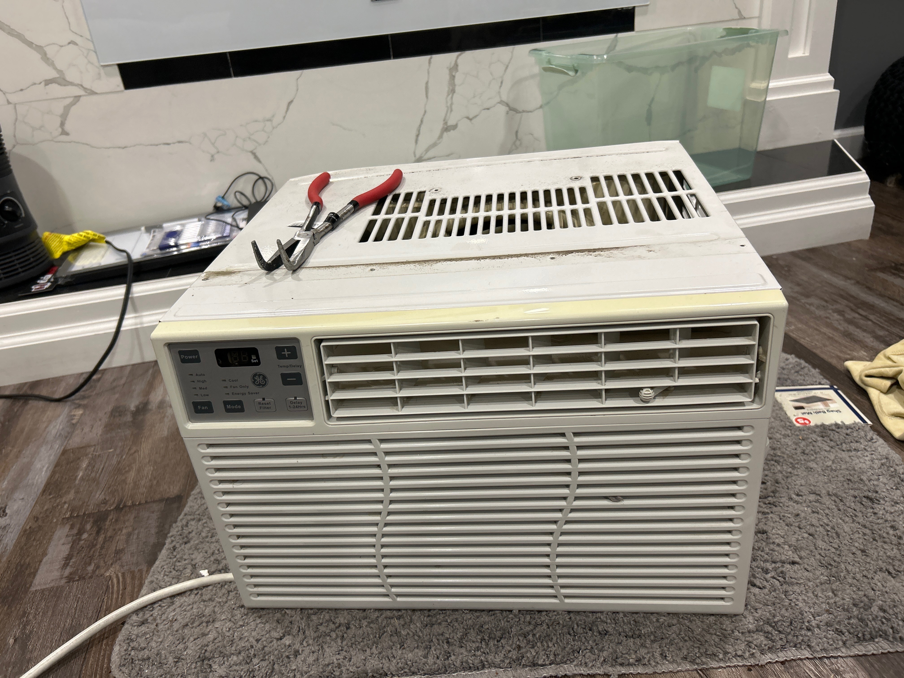{width=99%}


**We'd focus on Finances and actual Engineering know-how**

# Engineering the know-how

This is the direction, we'd be following. 
So, our teardown would involve from electrical plug, front PCB board, capacitor. 
Next, main-PCB board, wiring involved and color codes, compressors, blower fan, evaporator coil. 


## The Front and Back of the Window AC


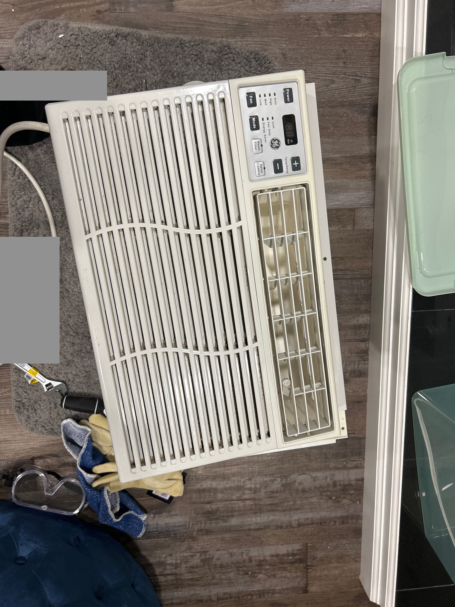{width=99%}
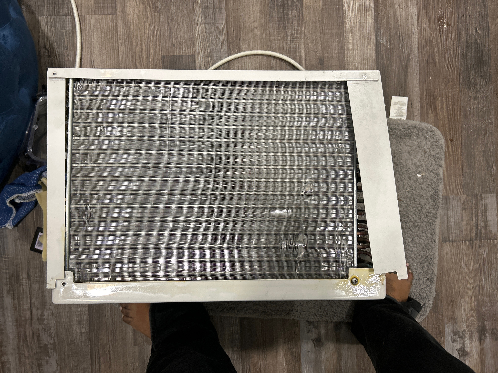{width=99%}


## Protection & Case for Window AC

In the Window-AC, the way the covers are kept is both the indoor and outdoor units clamp together. 
There's Outer Case, Inner Case. There's vents, Drain holes. The inner frame is chasis. 

**Outer Covering of the Window AC**

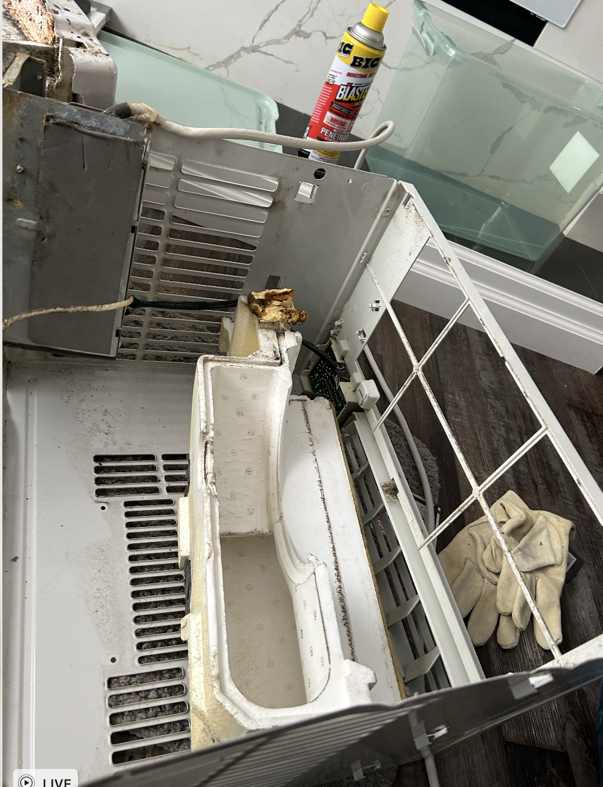{width=39% height=40%}


**Outer cover and Evaporator Coil of the AC**

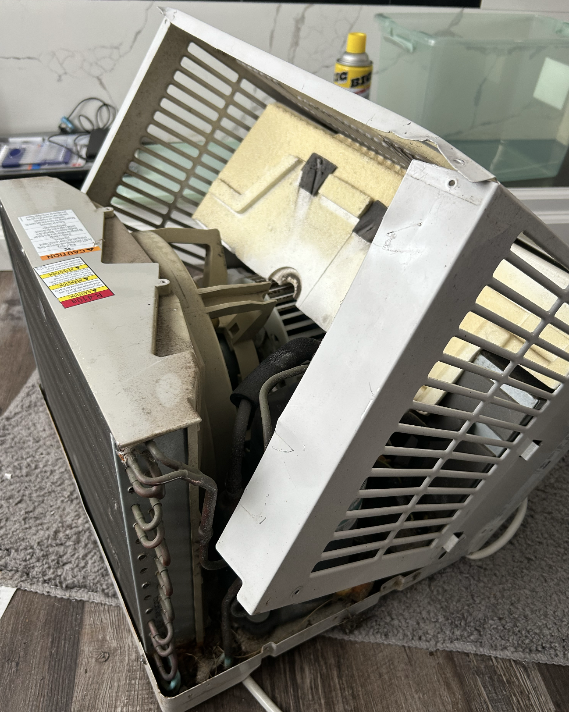{width=39% height=40%}

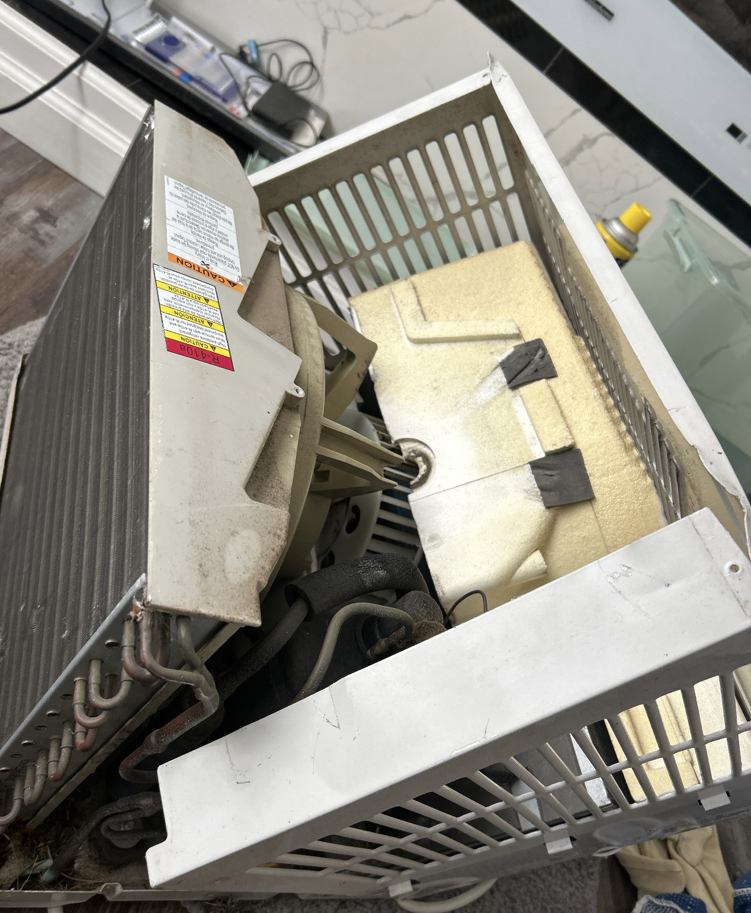{width=39% height=40%}


## Unboxing the Window-AC: 

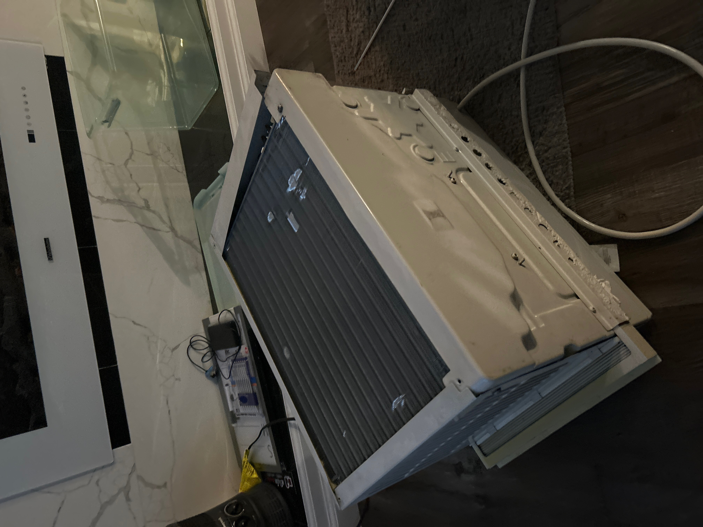{width=420px}


## FRONT LED Display of Window AC and Evaporator Coil 

This is interesting, you can notice evaporator coil. 

{width=420px}

This display is part of the control panel, which is often integrated with the unit's thermostat. 
The LED screen typically shows the current room temperature, the desired set temperature, and the selected operating mode (e.g., Cool, Fan, Dry). 
It may also show fan speed, a timer setting, or other features. 

This visual interface allows you to easily adjust the unit's settings to your comfort, 
providing a more precise and convenient way to manage your indoor climate compared to older models with manual dials.


# What are the components of the Window AC? 

Let's go details into the core know-how of Window-AC

## The Core Components of the Window-AC:

1. Compressor  
2. Condenser Coil  
3. Capillary Tube  
4. Evaporator Coil  
5. Blower Fan  
6. Condenser Fan  


# Tear down of the Window-AC


## Run capacitor


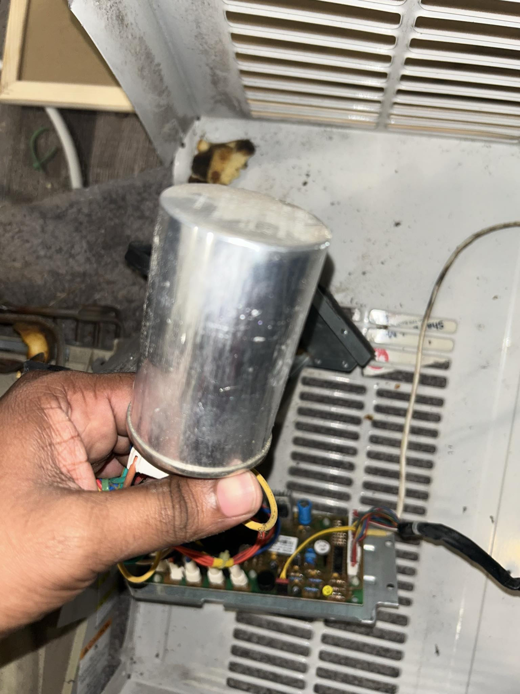{width=420px}

This is a dual-run capacitor. 
You might wonder, what does this do? 

Let's go with the basics. 
In electrical engineering, a capacitor is a device that stores electrical energy by accumulating electric charges on two closely spaced surfaces that are insulated from each other. Capacitors, together with resistors and inductors, belong to the group of passive components in electronic equipment.

Larger capacitors are used for energy storage in such applications as strobe lights, as parts of some types of electric motors, or for power factor correction in AC power distribution systems. Standard capacitors have a fixed value of capacitance, but adjustable capacitors are frequently used in tuned circuits. 
Different types are used depending on required capacitance, working voltage, current handling capacity, and other properties.

In our Window-AC, Capacitors act like a small battery, storing electrical energy and releasing it to help the compressor and fan motors start and run smoothly. 
Window units can have a single capacitor or a dual capacitor that serves both the fan and compressor. 

This is found in HVAC systems as Heat Pumps. 
It's primary job is to have two seperate capacitors with one casing, to provide continuous power to both fan and compressor motor. 
It has,  two different microfarad (μF) ratings, one for each motor, and three terminals: a common terminal for the power supply, a "herm" terminal for the compressor, and a "fan" terminal for the fan motor. This "two-in-one" design saves space and cost compared to using two individual capacitors.


## Step-down Transformer 
This is an interesting part, so after reading the books and understanding the theory. 
It's time to open it up and see how it works. I was surprised by this part.
Rest of the components seem expected as it's part of the Refrigerant Cycle. 


In the Window-AC, we find there's Step down Transformer. 
It's also called as control transformer. 
The main role of this transformer is to take AC power and then convert it into lower AC-power. 

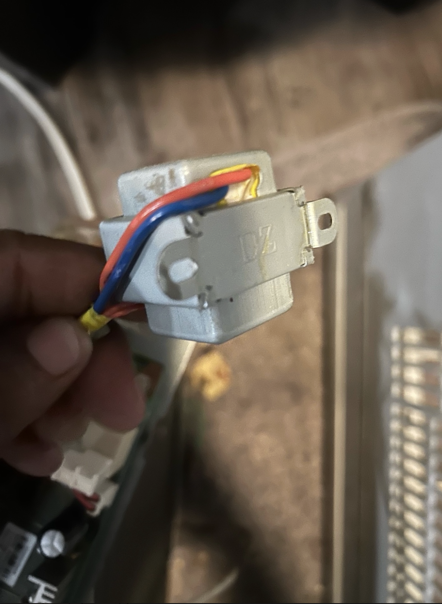{width=39% height=40%}

Input: ~120V or 220V AC

Output: 12V–35V AC

So, we notice there's two set of wiring and we might wonder, Why do we need two sets of wiring? 
The reason is because, there's two windings, as part of the Magnetic Cores, within the Step-down transformers. 

## Power-Plug of Window-AC

This is standard North American plug. 
In India, sockets are not the same. 

North American sockets, plugs are named through NEMA (National Electrical Manufacturers Association).
It's 120 V and 60 Hz. 

So, We have Type A: NEMA 1-15 (two flat parallel blades, ungrounded)
Next, We have Type B: NEMA 5-15 (two flat parallel blades with a round grounding pin)

India's electric system is typically 230 V and 50 Hz.
We have, the following: 
Type C: Europlug (two round pins)
Type D: BS 546 standard (three round pins in a triangular pattern, 5 amps)
Type M: Larger version of Type D (three round pins in a triangular pattern, 15 amps)


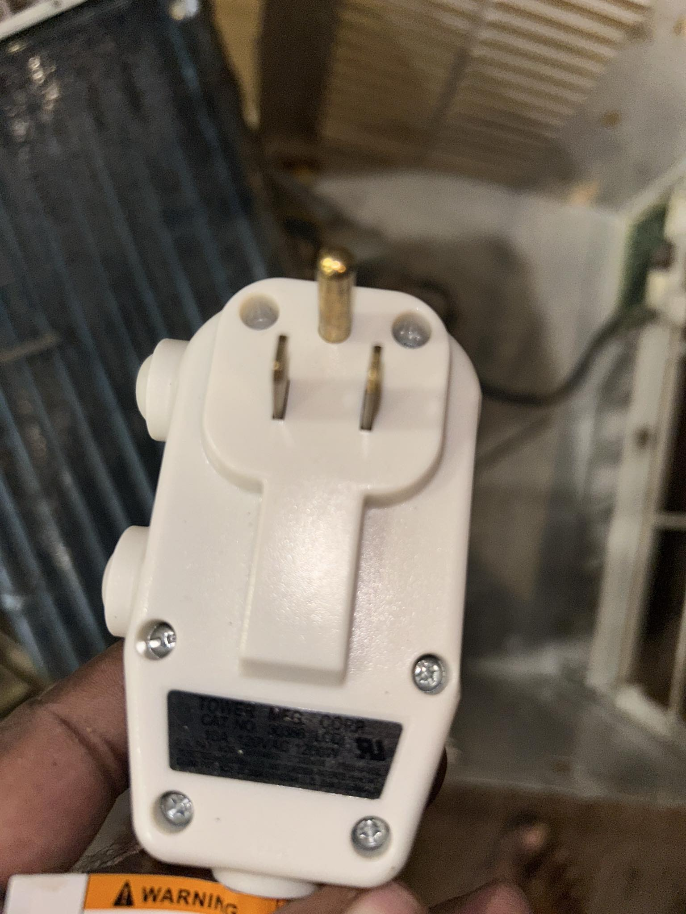{width=39% height=40%}


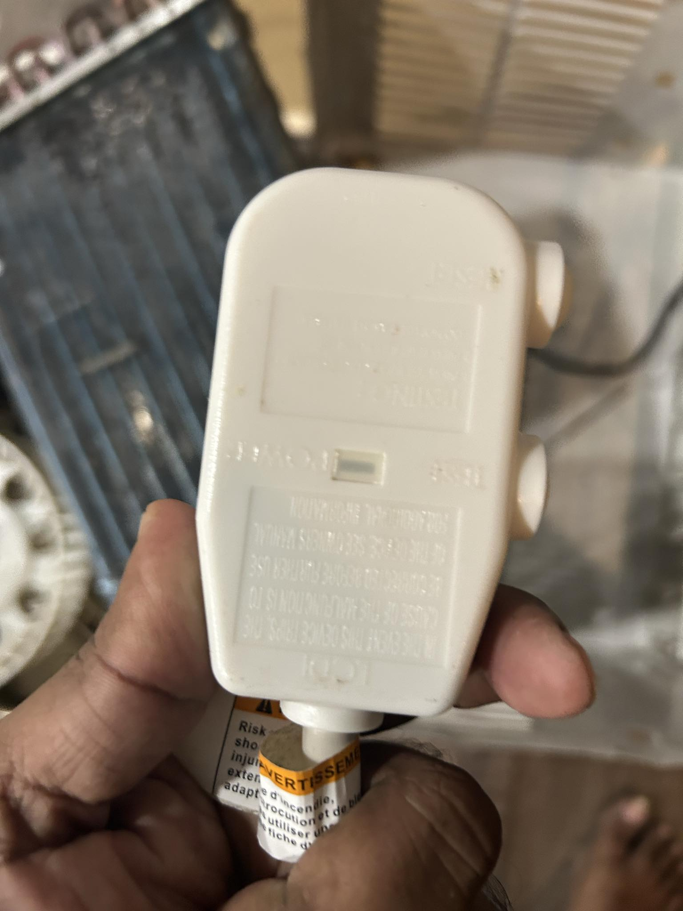{width=39% height=40%}

::: {layout-ncol=1}


## PCB Board: Control Unit 

This Printed Circuit Board is specifically designed to function as a controller.
In short, it manages functions, information, and provides reliability. 

The easiest one to recognize in the PCB board is the fuse. 
It protects the PCB board from overcurrent or short-currents. 
If you were to play with a Mutlimeter, you'd test out continuity through checking the fuse first. 

This is where, handling fan control, temperature sensing, compressor relay control, and communication with the remote/display unit takes place. 
In previous post, we went deeper into how progamming is executed through showing examples from embedded systems. 

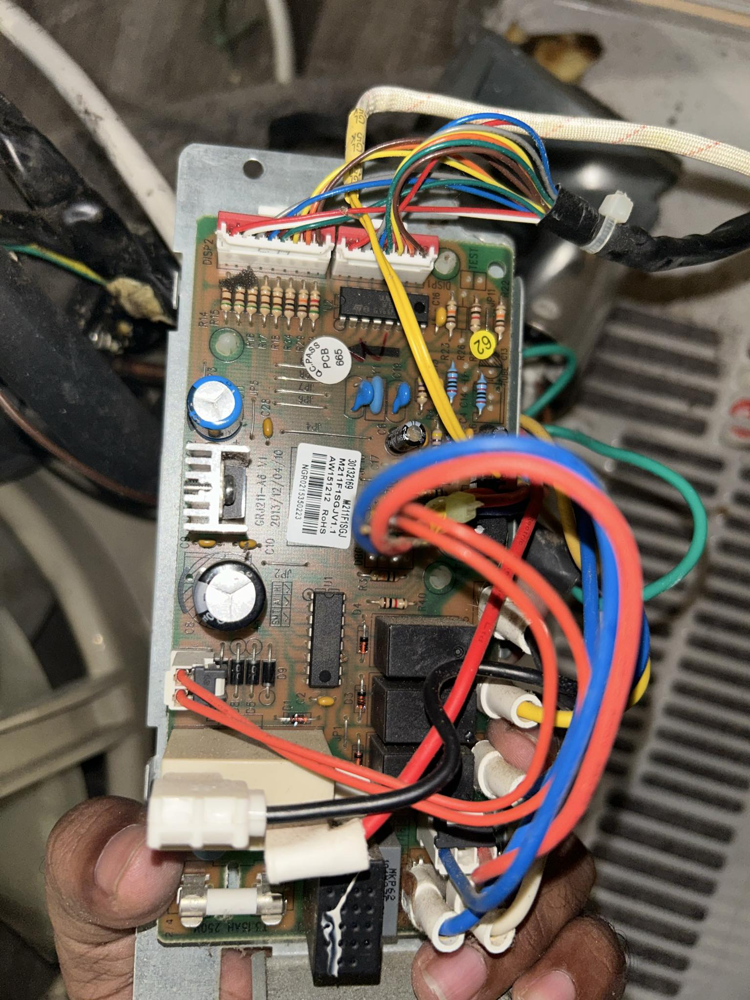{width=420px}

1. Red, blue, yellow wires are Signal and power wires going to fan motor, sensors, compressor
2. White connectors are interface headers connecting display, thermistors, IR receivers


**Microcontrollers** We have a black IC, 8 pin and 20-pin IC. Actually I was wondering, why you have two?
My answer was probably a design choice. So both of them are involved in Thermistor inputs, 
Relay switching, Mode selection, Timer logic, IR remote decoding.

We have Electromagnetic relays that are in two black rectangular components. 
One is for fan motor, and another is for compressor control. 

Several black rectangular boxes of different sizes
These are switches that turn high-power equipment on/off (compressor, fan motors, heating elements)
The control board sends low-voltage signals to these, which then switch high-voltage power
Red and black thick wires are carring AC line voltage to the compressor/fan via relays
The Gray metal fins are voltage regulator, with heat sink to provide 5V DC. 


## Compressor

The heart of the Airconditioner. 

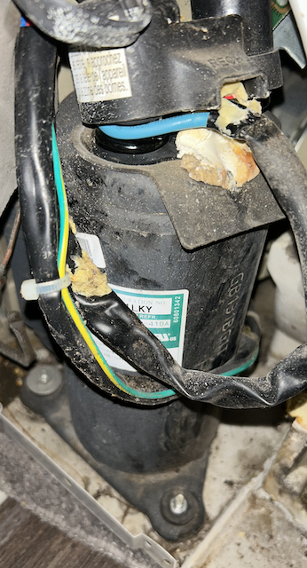{width=5% height=5%}

There are many types of Compressor. 

The one, in the picture is Rotary Compressor. 
Compressor is the most expensive unit for the Window-AC. 
The reason is complexity and making it into production. 
Inside the Rotary Compressor is the precision pump and an electric motor inside a welded, hermetic shell. 

It draws in low-pressure, slightly superheated refrigerant vapor at the suction port and compresses it to a high-pressure, high-temperature gas. 
That hot gas flows to the condenser coil, where a fan removes heat and the gas condenses into a high-pressure liquid. 

The liquid then passes through the capillary/expansion device, where its pressure drops; inside the evaporator coil it boils and absorbs heat from the room air.
Inside a rotary compressor you’ll find an electric motor, eccentric shaft with rolling piston, spring-loaded vane, suction/discharge reed valves, bearings, and oil sump/pump for lubrication and motor cooling.

As an Engineer, I believe advances in this would help to reduce cost and increase effiency. 
The reason is two fold, for cost this is the most expensive unit, for power-consumption, this is what consumes the most power. 
So, this is where innovation, improvements ought to be made for HVAC systems. This is not to say, other components are not important. 
There's an entire specialization, area for compressors in Mechanical Engineering. 

## Wiring to the PCB Board and Capacitor

HVAC follows standard colors, not all appliances would follow the standards. 
This might be different for India, China and U.S. 
For now, we explain basics in US for wiring. 

Green - Safety
White/Blue - Neutral 
Black/Brown - Line/Hot (L)
Red / Yellow / Blue - Motor Leads, usually fan speeds, compressor, capacitor links. 

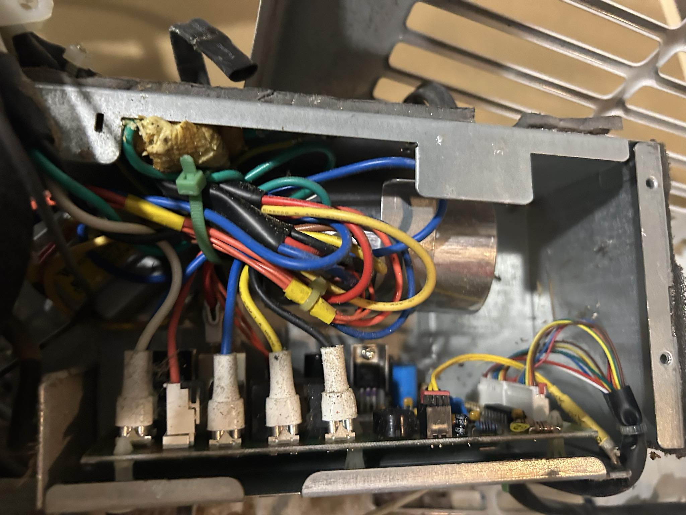{width=400px}

We can notice the Capacitor placed within the PCB board. 
In our Window-AC, The capacitor creates a phase shift in the current, providing the necessary torque for the motors to start and run efficiently.
 It acts like a starter muscle for the compressor and fan motors.

## PCB Board Wiring

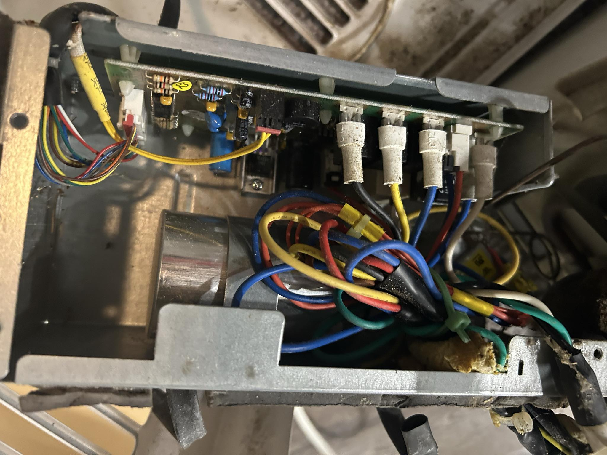{width=420px}

There's two PCB board, one is the front-end, this one is the main PCB board.


Primarily to regulate, control, distribute power.
System control involves turning on, off, change temperature, fan speed, operational modes.
These are standard in Window-AC. If we are to introduce newer features, we would be working on this.


## Front PCB Board

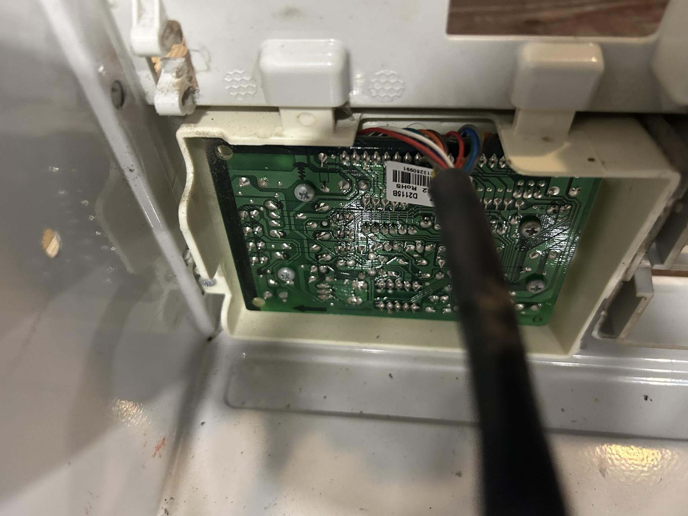{width=420px}

This one is connected to the Front LED Display panel. 
So, I went through the front PCB board. It's a low-voltage logic board. 
It's powered by the step-down transformer, it has buttons, LEDs, 7-segment display, microcontroller I/O lines. 
It also has relays signals to the main power/control board via the white connector on the right. 


## Blower Wheel

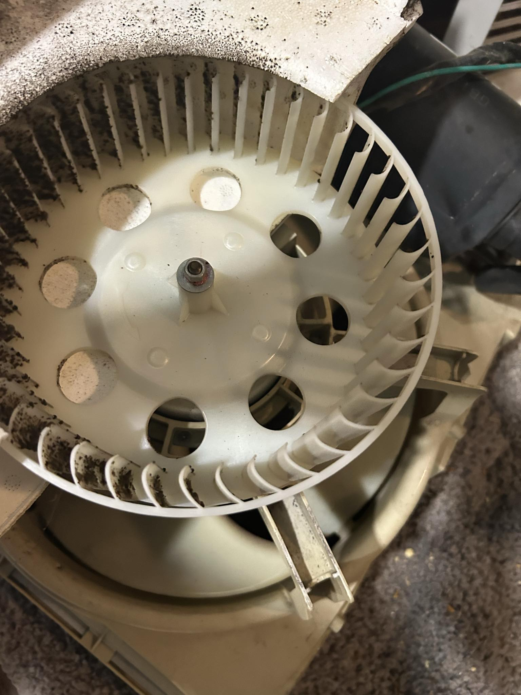{width=420px}

This is a blower wheel present in the Window-AC. 
A blower wheel is an impeller that spins to create airflow, circulating air in systems
It's used to create airflow. And if you are wondering, what's an impeller? 

It's a flow device, typically with helically shaped blades, that rotates to create fluid movement, primarily in low-viscosity liquids. 


## Condenser coil

The condenser coil is the "hot" side of the air conditioner, located on the exterior half of the unit that faces outside. 

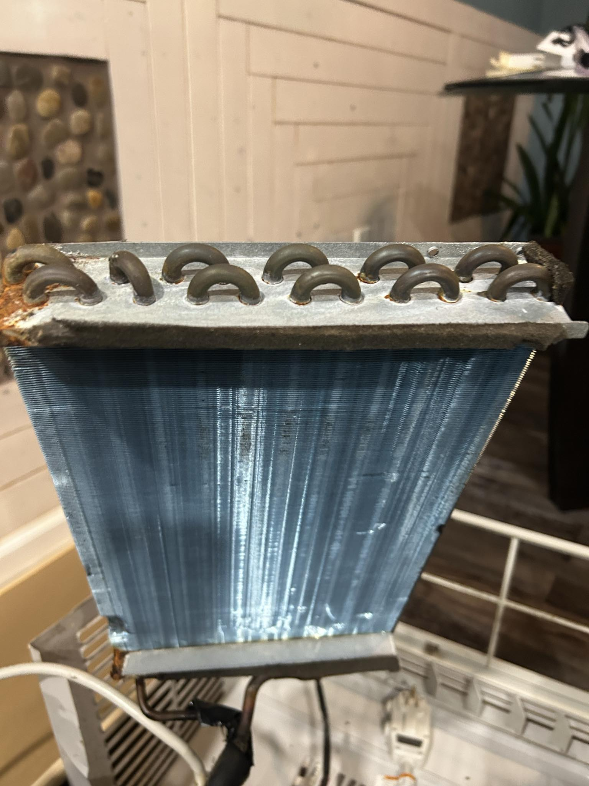{width=420px}

Its primary function is to release heat. After the refrigerant absorbs heat from inside the room at the evaporator coil, it is compressed, becoming a hot, high-pressure gas. This hot refrigerant then travels to the condenser coil.

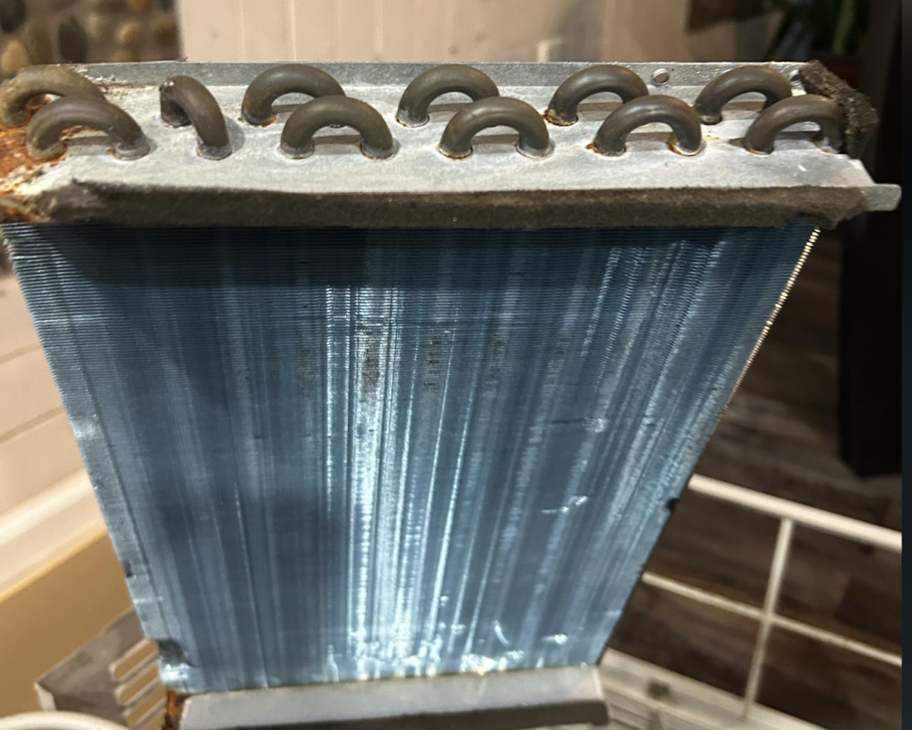{width=420px}


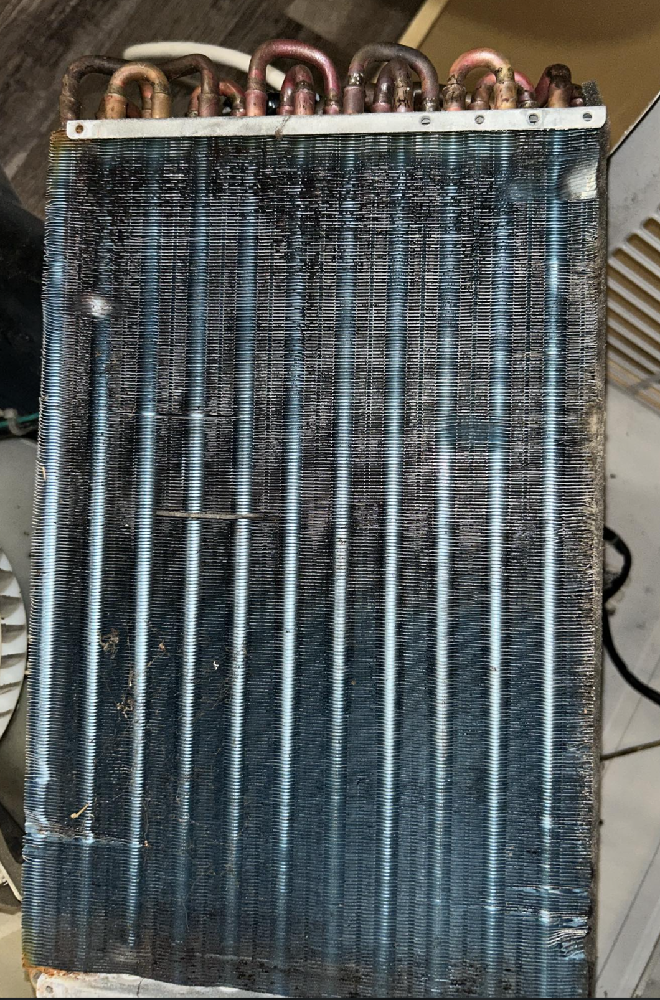{width=420px}

 As the fan blows outdoor air over the condenser fins, the heat from the refrigerant is transferred to the outside air, and the refrigerant cools and turns back into a liquid.

In contrast, the evaporator coil is the "cold" side, located on the inside, and its function is to absorb heat. Both coils are essential for the refrigeration cycle, but they perform opposite, equally important, tasks.


## Corner parts of Evaporator Coil

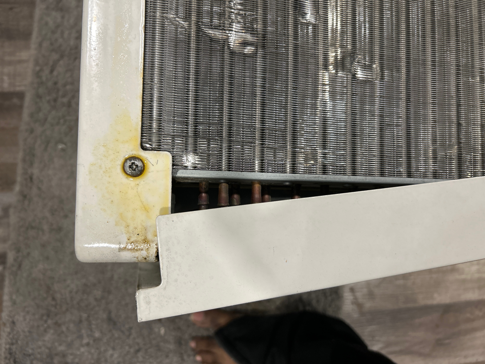{width=420px}
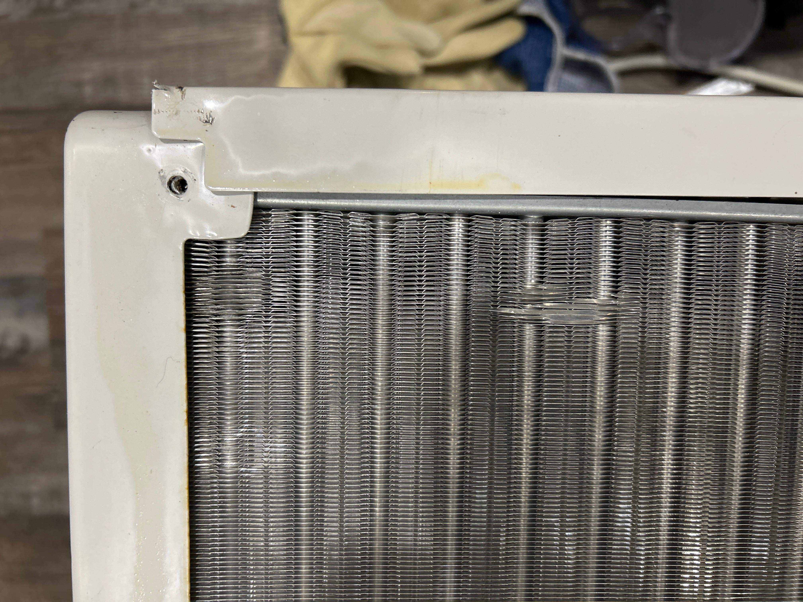{width=420px}


The evaporator coil is a critical component of any air conditioning system. 
We can see its located on the indoor side of the unit and is responsible for absorbing heat from the air inside the room. 
The evaporator coil is typically made of copper or aluminum tubing bent into a serpentine shape, with thin metal fins attached to increase the surface area. 

The refrigerant, a special fluid that easily changes from liquid to gas and back, flows through these tubes. 
As warm, humid air from the room is blown across the cold coil, the refrigerant absorbs the heat and evaporates into a gas. 
This cools and dehumidifies the air, which is then blown back into the room


## Compressor & Evaporator Coil: 

{width=420px}


The Evaporator Coil, we notice blue-colored coating.
This encourages condensed water to spread across the fins instead of forming droplets, 
which improves heat transfer efficiency, speeds up cooling, prevents airflow obstruction, and protects against corrosion and rust.
The refrigerant comes from the compressor, cycles continuously. 

There's capillary tube and a larger tube within the evaporator coil. 
It's main goals are absorb heat from the air, and send that heat away through the refrigerant. 

The compressor, fan, and PCB (Printed Circuit Board) board work together in a coordinated cycle to cool a room. The compressor is the "engine" of the refrigeration cycle. It receives the cool, low-pressure gaseous refrigerant from the evaporator coil, compresses it to a high-pressure, high-temperature gas, and then pumps it to the condenser coil on the outside of the unit. The fan serves two critical purposes: the indoor fan blows warm room air over the evaporator coil to be cooled, while the outdoor fan blows outside air over the hot condenser coil to help it release heat. 

The PCB board is the "brain" of the entire operation. It receives signals from the thermostat, controls the compressor and fan motors, and manages the unit's settings to maintain the desired temperature. All these parts work together in a continuous loop to remove heat from the indoor air and release it outside, providing a comfortable living space.

## Components in the Opened Window-AC

Computer Vision algorithms are able to classify the torn down Window-AC. 
This is a template, sample from the classification.

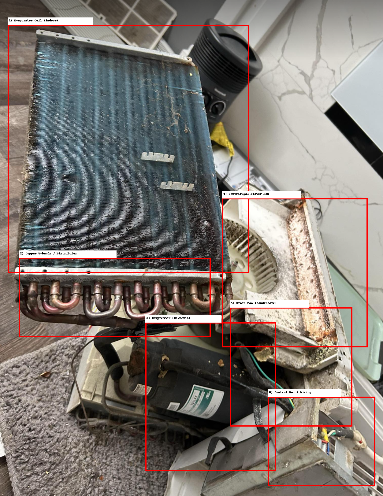{width=420px}
:::


## Printed Circuit Board - (PCB)


### User Interface PCB 

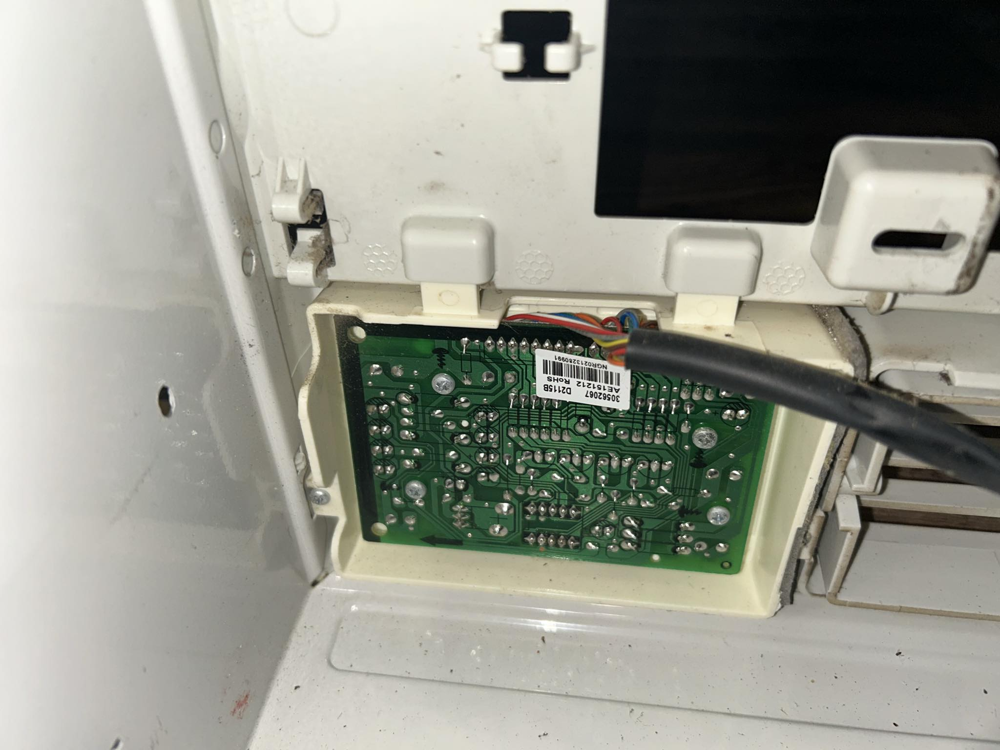{width=420px}

We are seeing the solder side of PCB board. 


This is the main control board inside your AC unit.
It connects the front control panel (buttons, display, remote sensor) with the power section (compressor, fan motor, capacitor, sensors).
Think of it as the middleman between you (the user) and the heavy electrical parts.

This board processes signals from sensors (thermistor/temperature, sometimes humidity).
It controls relays/triacs that switch ON/OFF the compressor, blower fan, swing motor.
It regulates fan speeds (low, med, high) by sending different voltages to the fan motor windings.
It has a power supply section that converts 220V/110V AC into low DC (5V/12V) for the logic ICs and display.
It also handles the remote-control receiver (infrared sensor).

So:You press a button → signal goes into microcontroller → PCB decides → relay clicks → compressor or fan gets power.


## Front PCB

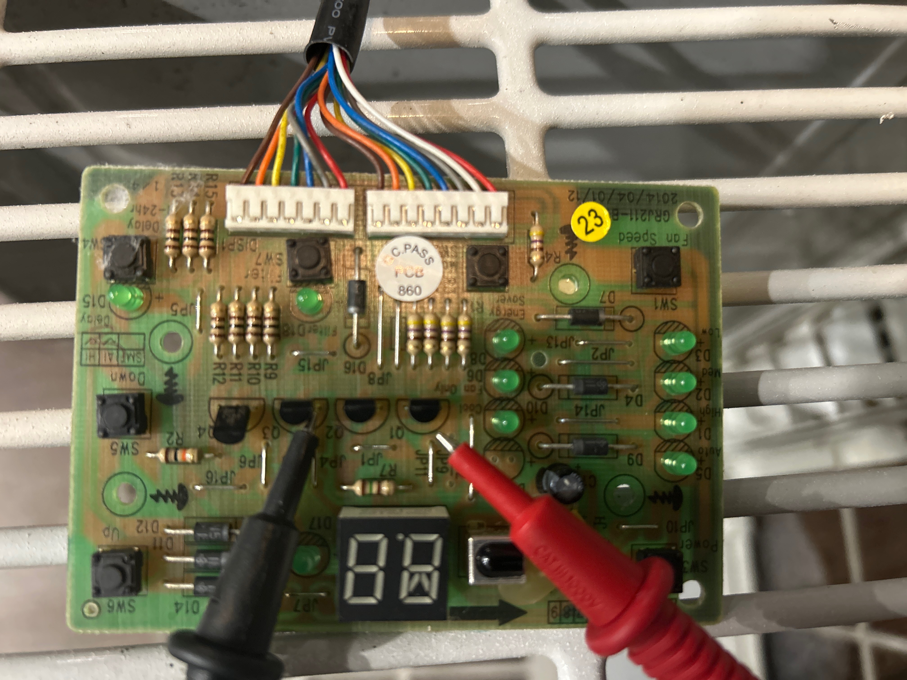{width=99%}


### Wiring Colors You See

1. Red wires: Typically 24V power supply (hot)
2. Blue wires: Often neutral or return power
3. Yellow wire: Usually compressor control signal
4. White wires: Common connections or sensor inputs
5. Green wires: Often fan control or ground connections
6. Orange/other colors: Various sensor inputs and control signals

### Why Colors?

Colors are conventions to avoid mistakes during service.
1. High-voltage (motor/compressor) wires are thicker and brightly colored (safety).
2. Signal/logic wires are thinner, often rainbow colors.


## Thermistor 

A thermistor is a specialized resistor.
It measures the temperature of the evaporator coil or incoming air and sends this data (as a change in resistance) to the control board, 
which uses it to cycle the compressor on and off to maintain the set temperature. 


## Functional Analysis: 

#### Electrical schematic

```{mermaid}
flowchart LR
mains[AC Mains]-->PSU[PSU 12V/5V]
mains-->relay[Compressor Contactor/Relay]
PSU-->MCU[Controller / Thermostat]
MCU-->relay
MCU-->if[Indoor Fan Speeds]
MCU-->of[Outdoor Fan]
sens[Thermistors / HP-LP / Float switch]-->MCU
```

#### Air-Flow Schematic 

```{mermaid}
flowchart TB
RA[Return Air]-->FX[Filter]
FX-->EVA[Evaporator Coil]
EVA-->IB[Indoor Blower]-->SA[Supply Air]
OA[Outdoor Air]-->CF[Condenser Fan]-->CON[Condenser Coil]-->DO[Discharge Outdoors]
```


## Finding the Components for the Window-AC in Current Market

This is a Template on how to find the components for Window-AC. 
For components, lot of suppliers from China, India.This is obvious that components are cheaper in China and India. 

```{python}

#| echo: false
import pandas as pd
import numpy as np

# Component data with prices from different markets
components_data = {
    'Component': [
        'Compressor (1/2 HP)',
        'Evaporator Coil',
        'Condenser Coil', 
        'Condenser Fan Motor',
        'Evaporator Fan Motor',
        'Control Board/PCB',
        'Thermostat',
        'Capacitor (Start/Run)',
        'Window Installation Kit',
        'Refrigerant Lines',
        'Housing/Cabinet',
        'Air Filter'
    ],
    'China ($)': [85, 35, 40, 25, 20, 30, 15, 8, 12, 15, 60, 5],
    'India ($)': [95, 45, 50, 35, 28, 40, 22, 12, 18, 20, 75, 8],
    'USA ($)': [180, 80, 85, 65, 55, 85, 45, 25, 35, 40, 150, 15]
}

# Create DataFrame
df = pd.DataFrame(components_data)

# Display the main components table
print(" Component Pricing Comparison")
display(df)

# Calculate totals
china_total = df['China ($)'].sum()
india_total = df['India ($)'].sum()
usa_total = df['USA ($)'].sum()

# Create totals summary
totals_data = {
    'Market': ['🇨🇳 China', '🇮🇳 India', '🇺🇸 USA'],
    'Total Cost (USD)': [china_total, india_total, usa_total],
    'Savings vs USA': [usa_total - china_total, usa_total - india_total, 0],
    'Savings %': [f"{((usa_total - china_total)/usa_total)*100:.1f}%", 
                  f"{((usa_total - india_total)/usa_total)*100:.1f}%", "0%"]
}

totals_df = pd.DataFrame(totals_data)
print("Cost Summary by Market")
display(totals_df)


# Key findings summary

print("Key Findings")
print(f"Total Component Costs:")
print(f"- 🇨🇳 China: ${china_total}")
print(f"- 🇮🇳 India: ${india_total}")
print(f"- 🇺🇸 USA: ${usa_total}")
print()
print(f"Cost Savings Analysis:")
print(f"- China vs USA: ${usa_total - china_total} ({((usa_total - china_total)/usa_total)*100:.1f}% savings)")
print(f"- India vs USA: ${usa_total - india_total} ({((usa_total - india_total)/usa_total)*100:.1f}% savings)")

# Create supplier links data
supplier_links = {
    'Region': ['🇨🇳 China', '🇮🇳 India', '🇺🇸 USA'],
    'Primary Suppliers': [
        'Made-in-China.com, Alibaba',
        'IndiaMART, TradeIndia, Aldahome', 
        'GE Appliance Parts, Repair Clinic, PartSelect'
    ],
    'Key Links': [
        'https://airconditionersystem.en.made-in-china.com/',
        'https://dir.indiamart.com/impcat/air-conditioner-motor.html',
        'https://www.geapplianceparts.com/'
    ]
}

suppliers_df = pd.DataFrame(supplier_links)
print("Primary Suppliers by Region")
display(suppliers_df)

# Assembly process data
assembly_steps = {
    'Process': [
        'Cabinet Line',
        'Coil Line', 
        'Base Assembly',
        'Piping & Metering',
        'Electricals',
        'Vacuum & Charge',
        'End-of-Line Test'
    ],
    'Description': [
        'Sheet-metal stamping → welding → powder-coat → curing',
        'Fin press → copper hairpin bending → tube insertion → expansion → brazing with nitrogen purge → helium leak test',
        'Mount compressor on rubber grommets → fit condenser/evaporator → install fans & shrouds',
        'Braze discharge/suction → filter-drier → capillary → distributor → evaporator → add service stub',
        'Wiring harness → capacitor(s) → relay/overload → control PCB',
        'Pull to <500 microns → hold → charge refrigerant by weight → pinch/crimp seal',
        'Run test for power draw → temps/pressures → sound → leak sniff → QC stamp → pack & palletize'
    ]
}

assembly_df = pd.DataFrame(assembly_steps)
print("Window AC Assembly Process")
display(assembly_df)
```

## How are they Assembled and put together? 

In this, pay close attention, while we can think of each and every part. 
I am reminded of Interchangeable Parts, American System of Manufacturing, that standardized manufacturing. 
The skilled specialized labor was replaced as Whitney's system of manfacturing came into production. 
This allowed for mass production. 

When machines get complex, we can think of sub-sections, sub-systems together. 
In this way, it's easier to piece them together and test them out. 
While assembling is important phase, in global manufacturing system, it is complex. 
This is for majority of industry except defense sector, the parts, components all come from various locations. 
In large companies, they have contractors, suppliers who manage all this, and the assembling will take place in another location. 
All is decided based on company's resources, goals, this apporach makes it efficient. 


## Core System Components

| Subsystem | Components | Function |
|-----------|------------|----------|
| Refrigerant Loop | Compressor, Condenser Coil, Capillary Tube, Evaporator Coil | Transfers heat from indoors to outdoors via phase change. |
| Air Circulation | Fan Motor, Dual-Shaft Fan, Blower Wheel, Condenser Fan | Moves air over evaporator (cool air) and condenser (heat exhaust). |
| Electrical Control | PCB, Capacitor, Transformer, Thermistor, Relay, IR sensor | Manages temperature control, motor startup, and user interface. |
| Frame & Housing | Sheet Metal Casing, Mounting Rails, Side Curtains, Filters | Provides structural integrity, mounting support, and airflow isolation. |

---

Almost all the Airconditioners will come with instruction manual. 
In the manual, you'd have wiring diagram, frequently asked questions. 

## Internal Assembly – Flow Diagram

```{mermaid}
flowchart TD
    Step1[Install Compressor]
    Step2[Mount Condenser Coil]
    Step3[Mount Evaporator Coil]
    Step4[Connect Capillary and Tubing]
    Step5[Vacuum and Refrigerant Charging]
    Step6[Install Dual Shaft Fan Motor]
    Step7[Attach Fan Blades and Ducts]
    Step8[Mount PCB and Transformer]
    Step9[Install Control Panel]
    Step10[Install Filter and Front Grille]
    Step11[Attach Rear Cover and Side Curtains]
    Step12[Final Testing and Packaging]

    Step1 --> Step2 --> Step3 --> Step4 --> Step5 --> Step6 --> Step7 --> Step8 --> Step9 --> Step10 --> Step11 --> Step12

```

## Window Air Conditioner Assembly Steps

| Step | Subsystem | Task | Description |
|------|-----------|------|-------------|
| 1 | Refrigerant | Install Compressor | Mount rotary compressor inside the base with rubber dampers. |
| 2 | Refrigerant | Mount Condenser Coil | Position condenser coil at the rear of the unit. |
| 3 | Refrigerant | Mount Evaporator Coil | Place evaporator at the front behind the air outlet grille. |
| 4 | Refrigerant | Connect Capillary Tubes | Braze tubes from condenser → capillary → evaporator → suction line. |
| 5 | Refrigerant | Vacuum and Charge | Pull vacuum and inject refrigerant (R-32 or R-410A). |
| 6 | Air Circulation | Install Fan Motor | Mount the dual-shaft motor between coils. |
| 7 | Air Circulation | Attach Fan Blades | Attach blower wheel and condenser fan on both shafts. |
| 8 | Electrical | Mount PCB and Transformer | Screw PCB onto bracket, connect transformer, relay, capacitor. |
| 9 | Electrical | Install Control Panel | Add IR sensor, LED display, buttons, and connect to PCB. |
| 10 | Frame | Install Filter and Grille | Insert air filter, snap in plastic grille. |
| 11 | Frame | Attach Rear Cover | Fix back casing and side curtains. |
| 12 | QA | Final Testing | Run cooling test, check airflow and water drainage. |

## Key Components and Design Rationale

| Category | Component | Reason |
|---------|-----------|--------|
| Compressor | Rotary Hermetic (GMCC) | Reliable, quiet, low energy consumption |
| Coil Material | Copper Tube with Aluminum Fin | Heat-efficient, low cost |
| Expansion Device | Capillary Tube | Passive device, no moving parts |
| Fan Motor | PSC Dual-Shaft Motor | Single motor runs both blower and condenser |
| PCB Voltage | Step-Down to 12–35V AC | Safety and standardization |
| Frame | Galvanized Steel | Durable and rust-resistant |
| Assembly | Snap Fit + Screws | Mass-production ready |


# How they’re assembled in Factory? 

Window AC manufacturing follows a modular, parallel line system, 
each major subsystem is prepared in **separate sub-lines**, 
then merged during final assembly. Below is the typical industrial line flow:

## Line Stages

Most of the time, it's divided, the work is parallelized. 
If you think from capital, sales point of view, you want to manufacture matching the demand. 
Toyota's concepts of Lean manufacturing might be relevant here. 
They only make what you need, do not make, create any waste, which is impressive. 
From what I gather, they improvised from Ford's factories, such should be anyone who is an industrialist. 

### Cabinet Line
- Sheet metal is **stamped**, **punched**, and **notched** into side panels, top/bottom trays, and baffles.
- Edges are spot **welded** or folded with fasteners.
- Assembly passes through **powder coating booths**, then a **curing oven** at ~200°C.

### Coil Line
- **Fin press** stamps aluminum fins.
- **Copper hairpins** are bent and inserted into fin stacks.
- Tubes are **mechanically expanded** to bond fin to copper.
- All joints are **brazed** with nitrogen purge.
- **Helium leak testing** checks for micro-leaks.

### Base Assembly
- Compressor is mounted on **rubber grommets** on the chassis.
- **Condenser and evaporator coils** are fitted and aligned.
- **Dual-shaft motor**, blower wheel, and condenser fan are installed.
- **Shrouds** guide airflow and ensure sealing.

### Piping & Metering
- Braze **discharge**, **suction**, and **filter-drier** connections.
- Connect **capillary tube → distributor → evaporator**.
- Add **service stub** for later vacuuming and charging.

### Electricals
- Add **wiring harness**, **capacitors**, and **relay or overload protector**.
- Mount and wire **control PCB**, IR sensor, display.

### Vacuum & Charging
- Pull system down to **< 500 microns** using vacuum pump.
- Hold vacuum for stability test.
- Charge **refrigerant by weight** (e.g., 450g R-32).
- Pinch, crimp, and seal service line.

### End-of-Line QC
- Run full test:
  - **Amps, pressures, noise, airflow, leak sniffing**.
- Approve with **QC stamp**.
- Pack with foam, box, manual → **palletize** for shipping.

A Flow Diagram of the Assembling: 

```{mermaid}
flowchart TD
    A[Cabinet Line]
    B[Coil Line]
    C[Base Assembly]
    D[Piping and Metering]
    E[Electrical Wiring]
    F[Vacuum and Charging]
    G[End-of-Line Testing]
    H[Packaging and Palletizing]

    A --> C
    B --> C
    C --> D --> E --> F --> G --> H
```

# Financial Costs of Parts in Window-AC

This is certainly the most challenging part, this applies to manufacturing or majority of the business. 
If you are CTO or Chief head that is manufacturing components, from manufacturing, business point of view, this is essential. 
If you could reduce the price of components by 50% that will increase your profits at the end. 
In broader chain of value-activities, this would be one component, yet this is process improvement. 
Historically, many industrialists have made wonders in this chain of value added activities, which pushed for effiency and thwart competitors. 
Andrew Carnegie hired a Chemist, Dr. Fricke, who figured out a way to manufacture pig iron cheaper. 

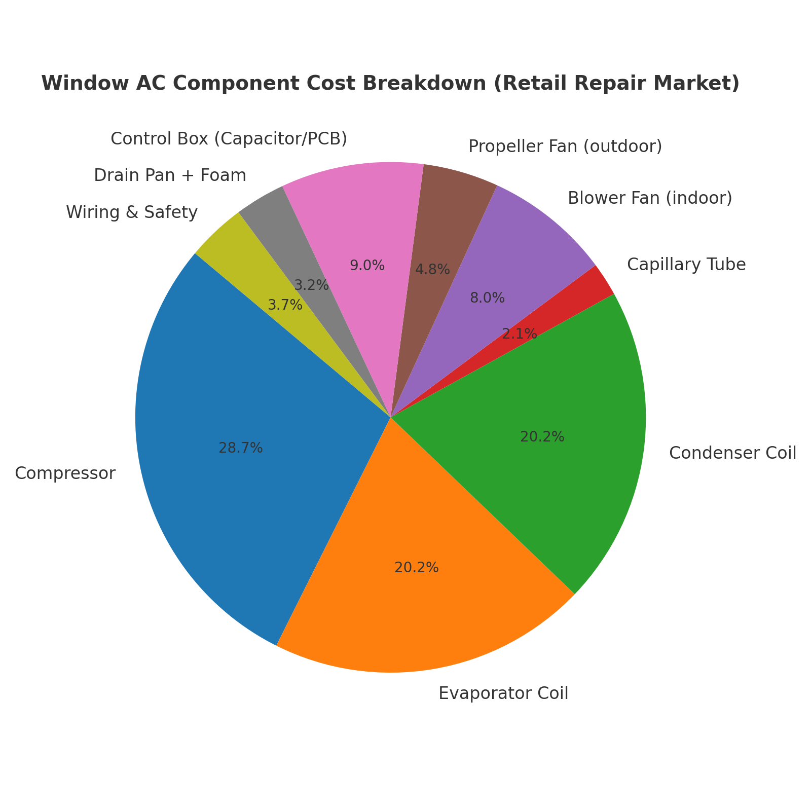{fig-align="center" fig-alt="Alternative text" title="Optional Title"}

We can notice Evaporator Coil, Condensor Coil, Compressor occupies close to 80% of the costs. 
That is staggering 3/4th of the expenses of the unit. The reason why they are expensive is manufacturing complexity. 
Secondly, the materials used to make them also add to the cost. Also add labor, transportation costs. 

We can notice how difficult it is to manage expenses, that itself requires tightly controlling accounting and balancing the budget. 
Expenses would add up easily and making the unit will turn into unprofitable venue for manufacturers. 

::: {.callout-note}
Numbers vary by tonnage (here ~1 ton / 12k BTU), volume, region, and refrigerant. Use as planning ranges, not quotations.
:::

::: {#tbl-oem-retail fig-align="center" tbl-colwidths="[22,14,30,17,17]"}
Table: Indicative costs (OEM vs. replacement retail)

| Subsystem / Part                                   | Function                 | Manufacturing & materials notes                                              | OEM cost (high-volume) | Replacement retail |
|:---------------------------------------------------|:-------------------------|:-----------------------------------------------------------------------------|:-----------------------|:-------------------|
| Rotary compressor (R-410A/R-32, ~12k BTU)          | Pump refrigerant         | Hermetic shell; precision rotor/vane; motor; oil; welded stubs               | $90–$160               | $230–$300          |
| Evaporator coil                                    | Absorb indoor heat       | Cu/Al tubes + louvered fins; leak-proof brazing; hydrophilic coat optional   | $30–$90                | $80–$180           |
| Condenser coil                                     | Reject outdoor heat      | Similar to evap; subcooling section; corrosion protection                     | $30–$90                | $100–$170          |
| Dual-shaft motor                                   | Drive blower + condenser fan | Shaded-pole/PSC; multiple speed taps; rubber mounts                       | $25–$60                | $180–$300          |
| Blower wheel (indoor)                              | Move indoor air          | Injection-molded; balance critical                                           | $8–$25                 | $60–$170           |
| Condenser fan blade                                | Move outdoor air         | Stamped/plastic prop; pitch & diameter tuned                                 | $5–$15                 | $43–$107           |
| Control PCB + UI PCB                               | Logic + power switching  | SMPS (5/12V), MCU, relays/triacs, IR receiver                                | $6–$18                 | $100–$300          |
| Dual run capacitor (e.g., 35/5 µF)                 | Start/run motors         | Metallized film; 3 terminals (C/HERM/FAN)                                    | $2–$6                  | $15–$35            |
| Filter-drier                                       | Moisture/debris control  | Molecular sieve; copper ODF                                                  | $1–$3                  | $6–$12             |
| Capillary tube + distributor                       | Fixed metering           | Precision ID; cut-length; multi-port distributor                             | $1–$4                  | Bundled/low        |
| Sheet metal & plastics                             | Structure & airflow      | Stamping, powder-coat; injection molding                                     | $20–$50                | —                  |
| Harnesses, sensors, grommets, fasteners            | Integration              | NTC thermistors, connectors, rubber isolators                                | $8–$25                 | $15–$60            |
:::

**Typical BOM subtotal (OEM, ex-works, high volume):** $230–$360

_Add labor, overhead, scrap, warranty reserve, packaging, logistics, margin → retail MSRP is 2–4× BOM._

*Note:* Earlier rough totals (e.g., “$188” or compressor “$700–$2,600”) mixed scales/contexts. The table above reflects a realistic window-unit scope (not large commercial scrolls) with current commodity pricing.

## Cost Estimation

::: {.callout-note}
### Subsystem / Part Costs
The following cost ranges are for common replacement parts in a ~1 ton (12k BTU) window/mini-split style system.
:::

**Rotary compressor (~1 ton / 12k BTU, R‑410A)**  
- **Function:** Pumps refrigerant  
- **Cost drivers:** Capacity, refrigerant type, brand, current stock  
- **Typical price:** **$231–$258**

**Evaporator coil (window unit)**  
- **Function:** Absorbs indoor heat  
- **Cost drivers:** Size, Cu/Al construction, OEM fitment  
- **Typical price:** **$80–$180**

**Condenser coil (window unit)**  
- **Function:** Rejects heat outdoors  
- **Cost drivers:** Similar to evaporator coil  
- **Typical price:** **$100–$170**

**Dual-shaft blower motor (115 V, small HP)**  
- **Function:** Drives indoor blower + outdoor prop fan  
- **Cost drivers:** Motor HP, speed taps, shaft configuration  
- **Typical price:** **$180–$300**

**Indoor blower wheel (squirrel‑cage type)**  
- **Function:** Moves air across the evaporator  
- **Cost drivers:** Diameter, width, bore size  
- **Typical price:** **$60–$170**

**Outdoor condenser fan blade (propeller type)**  
- **Function:** Moves air through the condenser coil  
- **Cost drivers:** Diameter, pitch, rotation side  
- **Typical price:** **$43–$107**

**Control PCB / display (GE‑type)**  
- **Function:** Thermostat logic + power switching  
- **Cost drivers:** Model-specific design  
- **Typical price:** **$100–$300**

**Run capacitor (dual, e.g. 35/5 µF, 440V)**  
- **Function:** Starts and runs compressor + fan  
- **Cost drivers:** Mainly rating and brand (commodity part)  
- **Typical price:** **$15–$35**

**Liquid-line filter-drier (¼" ODF)**  
- **Function:** Moisture/debris protection  
- **Typical price:** **$6–$12**

**Capillary tube / distributor**  
- **Function:** Fixed-orifice metering  
- **Typical price:** **(usually bundled with coils / low)**

**Miscellaneous (sensors, harness, louvers, filter, brackets)**  
- **Function:** Ancillary/OEM fit parts  
- **Typical price:** **$15–$60**


---

## Typical Rehabilitation Bill of Materials

::: {.callout-tip}
Categories group common **repair bundles** — what a tech would typically replace together.
:::

**Minor refresh**  
- Includes: Capacitor, filter-drier, small sensors, cleanup  
- **Parts cost range:** **$40–$120**

**Air-moving rehab**  
- Includes: Motor + blower wheel + condenser fan blade  
- **Parts cost range:** **$280–$600**

**Sealed-system rehab**  
- Includes: Compressor + one coil (evap/cond) + filter-drier  
- **Parts cost range:** **$350–$600+**  
- **Note:** This is **before tools/labor** for refrigerant work

**Electronics swap**  
- Includes: Control PCB + capacitor  
- **Parts cost range:** **$120–$330**

---

::: {.callout-warning}
 **Hidden Costs:**  
Sealed-system jobs **require refrigerant tools and EPA compliance**, adding **$200–$500+** in overhead beyond part costs.
:::


## Fire and Electrical Safety 

I'd advise to follow strict safety procedures. 
Never use a device with a damaged cord or plug, as this can lead to short circuits, fires, or electric shock. 
The device should be used with the correct fuse, and you should never overload power points by connecting too many appliances.

I advise to have A Class C fire extinguisher, which is designed for energized electrical fires, is the most effective choice. 
When not in use, it's a good practice to unplug the device to prevent "phantom" power draw and to protect against power surges.  If you notice any signs of a potential electrical issue, such as flickering lights, hot plugs, or a burning smell, cease use immediately and consult a qualified electrician.

WARNING: Capacitors can hold a dangerous electrical charge even after the unit is unplugged. They must be properly discharged before handling.

This is for education and research purpose only. 

## Regulatory Compliance

This is something, which I haven't covered earlier. 
Almost all Air-conditioner units will go through compliance, before it enters into the market. 
In North-American market, it's advisable to have EPA Section 608 certification, DOE SEER/EER efficiency compliance. 
In Indian market, you have BIS standards, BEE star-rating methodology. 
For both these, you'd have to submit application, report your unit, list your model. 
These are standard procedures that HVAC Systems need to follow. 


# Conclusion

Window-AC and Split ACs work to fulfil refrigeration cycle. 
In reality, We can appreciate how engineers worked on mastering the product and building for mass market. 
Both from Physicst and towards building one, it required lot of efforts, constant development. 
In engineering the product, certainly lot of trail and error. 

In this post, we've dismantled a working unit, component by component, examined its inner workings, cost structures, assembly process. From the rotary compressor, hydrophilic evaporator coils to the dual-run capacitor, front-facing PCB logic boards, each element is designed with precision, efficiency.

We didn't go deeper into how each of the components are manufactured, some of them certainly industrial masterpiece. 
Take Compressors, the manufacturing of them requires specialized equipment from metal stamping, forming, and welding for the main housing and rotor components, followed by precise assembly of the intricate mechanical parts like the meshing rotors, motor, and internal sealing elements.

This is to share how we are benifitting the fruits, labor of physicists, engineers, technicians and industrialists.
The industrialists and investors have poured huge pool of capital in the process, that has allowed us to enjoy the benefits of Window-AC. It takes so much effort to manage the capital, plan, allocate the resources. 

Finally, this teardown has given us the blueprint. We've mapped every component, understood its function, and decoded its cost.This is a blueprint,  We've seen how they are assembled in a factory,  Through two of our articles, we covered reasonable amount about Airconditioners. This understanding is enough to build, create a working prototype, which we will cover in the future. 

<div style="border-top: 2px solid #ccc; margin-top: 2em; padding-top: 1em; font-size: 0.95em; color: #555;">
⚙️ Reverse-engineered and Written by **Rick Rejeleene** 