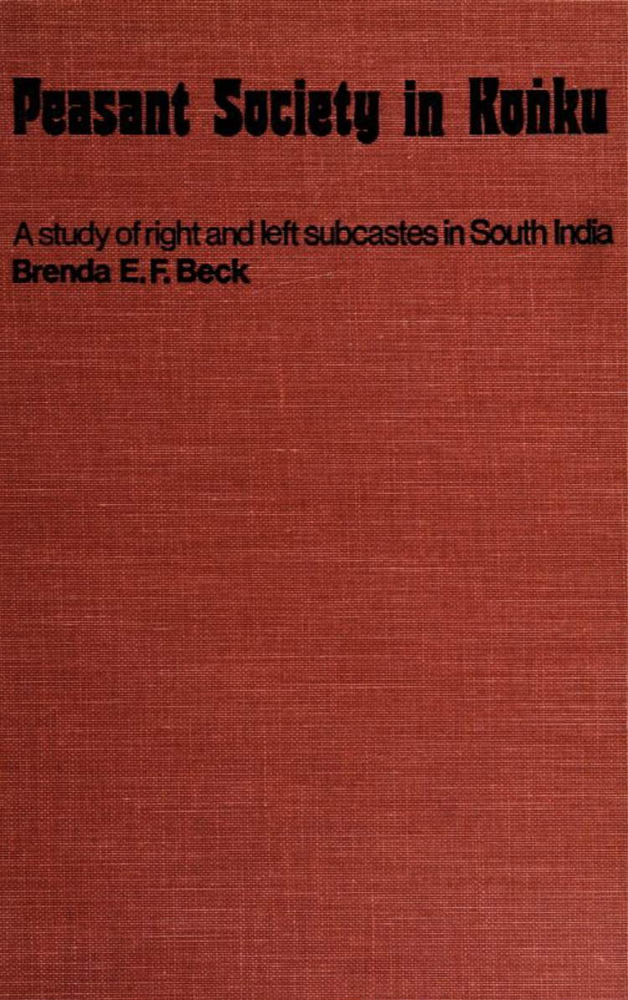
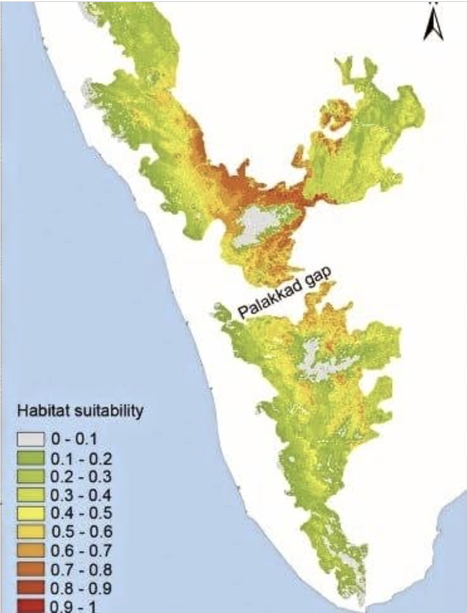
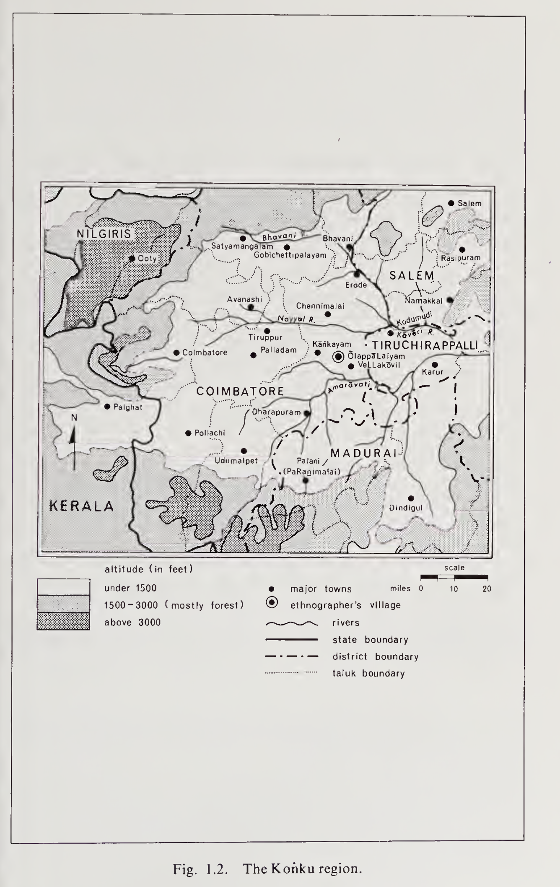
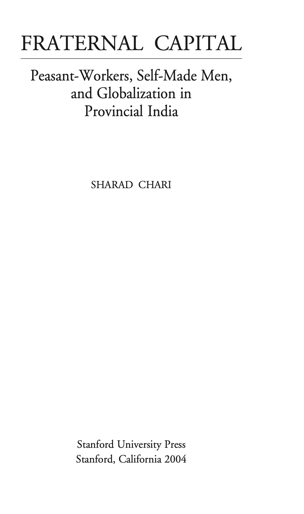
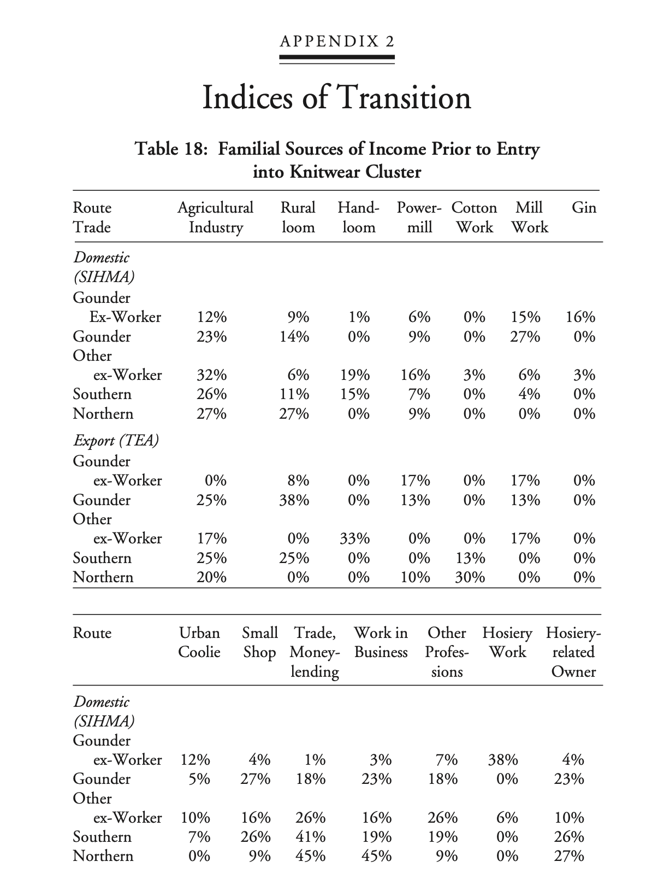
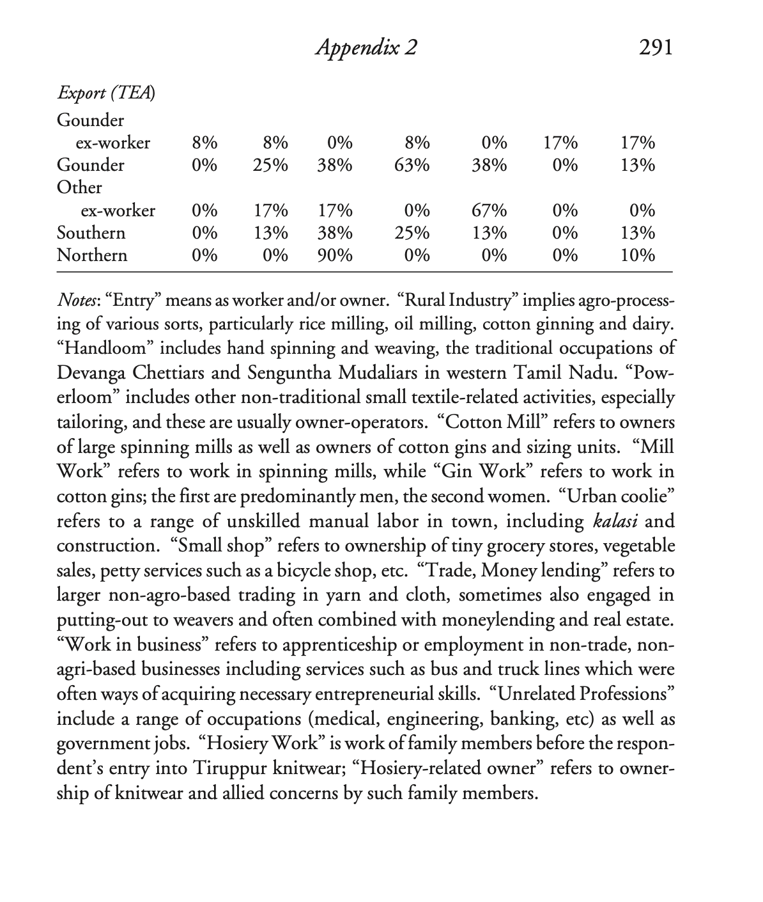
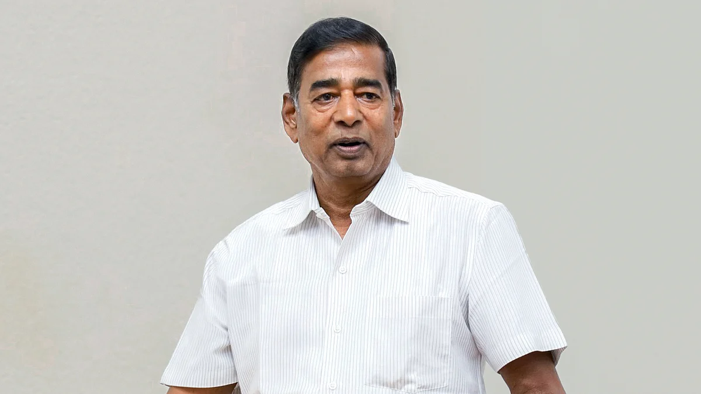
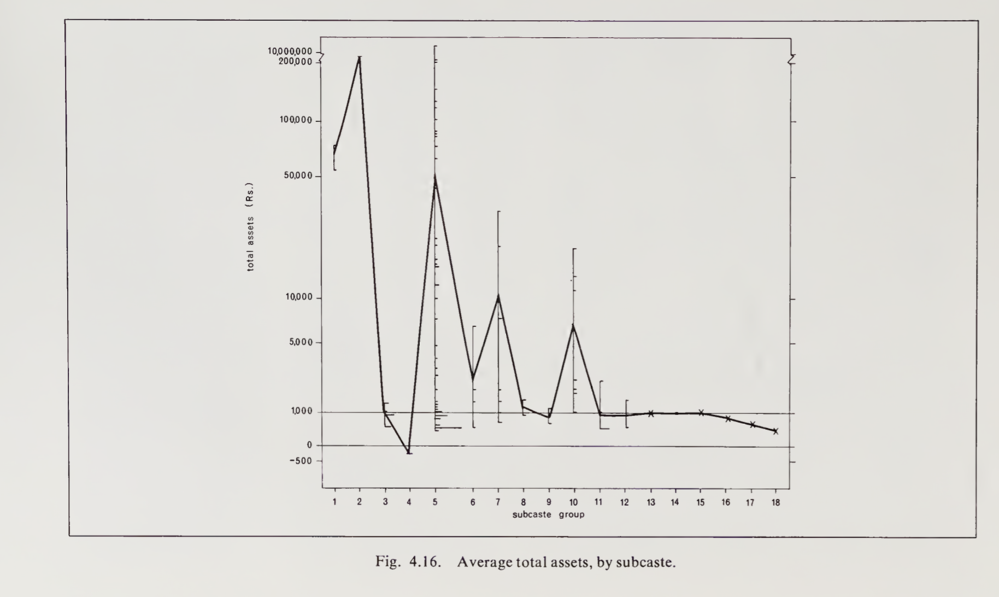
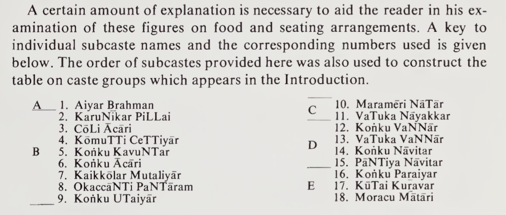

## Peasant Society in Konku
**A Study of Right and Left Subcastes in South India by Brenda E. F. Beck.**

{width="49%" height="30%"}

Brenda E. F. Beck, a Social Anthropologist who has spent a lifetime studying South Asia and, in particular, the Kongu Nadu area of Tamil Nadu
In this Essay, we explore Gounder social group in Tamil Nadu. 
In this work, we come across right-hand faction and left-hand faction castes. 
This is surprising for majority, we think of caste as linear-hierarchical. 
Majority of the work is executed in village-town of Olappalayam (near Aththampalayam) is on Kangeyam-Karur (Tiruchi Road), closer to Vellakovil.

Around 2014-2015, I came across Edgar Thurston’s massive social ethnography of South-India. 
Edgar Thurston's and People Of India: Tamil Nadu by K. Suresh Singh are highly relevant works for Social History. 

While the work is extremely important for historical scholarship, it does have bias of its day, when social-darwinism was strictly believed. 
However, we can still refer to the work, for its critical documentation, references, exhaustive work. 
Edgar Thurston was a civil servant around late 19th century in Madras Presidency. He was managing, both Madras Museum and Connemera Library. 
Kongu region refers to Westerern, North-Western parts of Tamil Nadu covering, towns as Coimbatore, Dharmapuri, Erode, Karur, Krishnagiri, Namakkal, Nilgiris, Tiruppur, Salem. 

## Why do I need to care about this? 

So, one might ask, why spend time, reading, reflecting on books like this. 
One important reason is that, you'd understand how towns, families, wealth, land-ownership grew in a particular town. 
Morever, for administrators, politicians, industrialists might help to uncover economic, social policies for further progress. 
If you are interested in history of families, people-groups in Tamil Nadu. 
And if you are interested in Tamil politics, castes, social-mobility, wealth. 

## Why am I writing about them? 
Firstly, I have been looking into Caste, Indian History for a long time. 
So, I am going through works related to Caste. In earlier writings, I spoke of how endogamy is a disadvantage to Tamil Society or not allowing further social progress of Tamils. 

## How was this region viewed, historically? 

We mostly know through bards (reciters, poets) who lived in this region working for various kingdoms.  
During 500 BCE and 1300 CE, of time period in this region; the region was divided into Pandiya Nadu, Chera Nadu, Tondai Nadu, Kongu Nadu, Chola Nadu, reflecting ancient and medieval Tamilagam. From earliest Sangam literature, we know three principal dynasties administered, the Cheras, Cholas, and Pandyas. 

Kongu Nadu is described in Patiṟṟuppattu, dated between 2th and 5th century and Silappathikaram, dated between 2nd century. From 10th century, the region became culturally, socially relevant from 10th century. At present, Kongu region refers to today’s Coimbatore, Tiruppur, Erode, Salem, Namakkal, Karur, parts of the Nilgiris/Krishnagiri areas in Tamil Nadu. 


{width="89%" height="80%"}

Geographically, We notice Cauvery river passing from Western ghats across towns of Gopichettipalayam, Erode, Velur and Trichy. 
The weather is tropical. For water, the region depends on monsoon rainfall. While, it is not as dry as Southern Tamil Nadu. 

**Immigration**

Many Tamils might not be aware of immigrants to their own cities, towns. 
Historically, during various kingdoms, castes/social-groups migrated from invitation of Kings.

From pages 28-31, 

>Brahmans are mentioned in Kongu, even at this early period. They were brought in to serve as priests at temple centers which were quickly constructed. 
Traders,merchants, and various service groups such as barbers and washermen are also mentioned as present during this period. Mostly before and during the previous era of Ganga rule. At the end of Chola period, Many Mutaliyars are mentioned in inscriptions as having been employed as mercenaries, fight in the Chera armies at this time. Later, it seems, some of them settled in Kongu with their spoils and took to weaving and to business. Carpenters, blacksmiths, stone masons, and builders from other more developed regions must also have been in demand during this period. 


{width="59%" height="40%"}

The areas were organized, with Nadu (region), Gramam (Village), Ooru (Hamlet) defining social, political, ritual order of Kongu region for a millennium.
Since 9th, 10th century, trade took place through Palakkad Gap. 

## Who are they? 

**Kongu Goundars:**

In Southern-India, they are one of the social-groups, castes of Tamil Nadu. 
Majority of them are located in North-Western part of Tamil Nadu. In local Tamil culture, Kongu region represents, Coimbatore, Dharmapuri, Erode, Karur, Krishnagiri, Namakkal, Nilgiris, Tiruppur, Salem. 

**Vellalar**: This refers to group of castes, particularly agricultural, land-owning, aristocratic caste, across Tamil Nadu and Srilanka. 

**Kongu Vellalar**: They are land-owning, regional caste found in Kongu region. 


### Coimbatore

{width="59%" height="50%"}

In 1960s and up to the author’s publication of this book, Coimbatore had the highest standard of living in Tamil Nadu, described in page 28 of this book. 
Not much sources are there about this region of Tamil Nadu. During British Era, lot of ethnography works are available, yet few original observations since 1909. Many of the earlier centuries, there existed local legends, snippets of stories told by pulavars or bards. 

 **Kongu Nadu Varalarru by Ramachandra Chettiar** and **The Kongu Country by M. Arokiaswami** are substantial good works about the region. 


## What does the author investigate? 

Social-Structure of People in Kongu Region of Tamil Nadu. 
The nature and internal structure of castes in the region. 
In this region, there’s left hand faction and right hand faction. 
In Tamil, they are known as Idangai and Valangai. 

## So, how are the castes classified into groups? 

Based on combination of Land, Political Power and Ritual Purity.
These are social structural divisions of people groups in Kongu region. 
What is more interesting is that the families, who are part of these divisions, might reflect the values to this day. 


## What are the right hand faction and left hand faction? 

>Right hand faction: In this faction, the castes focus on land management, political power, interdependence socially. In this faction, Goundars (KavuNTars) lead the faction, with social interdependence and agricultural abundance. 

>Left hand faction: In this faction, it consists of artisans, merchants, and leatherworkers. In this faction, material wealth, ritual purity and connection with South Indian philosophical and scholarly tradition is emphasized. 

It’s surprising that there is ambiguous, neutral division/group: In this, Tamil Brahmins, Aiyangar, Kanakku Pillai (accountants) are considered to be outside of the left-right faction, yet form metaphorical head for the social order. 

In terms of status, the author says, socially, the groups in this region is competing for bifurcate prestige structure, where two groups have ladders to the top, with each of their own rules. The right hand faction, lead by Goundars, for them status was rooted in land management, territorial control, philosophy of dominance. The left hand faction, for them, material wealth, ritual purity, adhering scholarly tradition and emulating Brahmans. While Brahmans are non-aligned, the left hand faction, took Brahmans as models, with their aloof and insular character. 

Brenda Beck observed Goundars exhibited an expansive nature, a swagger, and an eagerness to dominate, the Brahman exhibits an aloofness of manner and extreme touchiness in matters requiring interaction.

Furthermore, their rooted origin myth stories reflect this pattern, For the right hand faction, their origin story is, The Story of the Brothers. The epic is intensely local, its geography tied directly to the Kongu land itself. It recounts the heroic settlement and conquest of the territory by a founding Goundars clan. It is a mythology of being indigenous, rooted, and dominant. In contrasting, the Left Bloc has a collection of separate myths, but they share a powerful, recurring theme. A high ranking community is unjustly persecuted by a king. For instance, in one striking myth, a wealthy Chettiar merchant angers a king, who tries to slaughter his entire community at a feast. A few children escape across a river and, with no wealth to provide dowries for their future marriages, a goddess magically turns bags of stones into gold to re-establish their line. It is a mythology of migration, persecution, and rootlessness, with historical ties to famous urban centers outside the local region.

An Indian Sociologist, Govind Sadashiv Ghurye in his book, Caste, Class, and Occupation (1932) says.

>In Tamilnadu there has been for ages, a faction among the non-Brahmin castes dividing most of them into two groups:

**The right-hand castes and the left-hand castes.**

The “right-hand” castes claim certain privileges which they strongly, refuse to those of the “left-hand”, viz. riding on horse-back Features of the Caste System, in processions, carrying standards with certain devices, and supporting their marriage booths on twelve pillars. They insist that the “left-hand” castes must not raise more than eleven pillars to the booth nor employ on their standards devices peculiar to the “right-hand” castes. 

For this, Ghurye refers, Madras Census, 1871, p. 129 and  G. W. Forrest, Official Writings of Mountstuart Elphinstone, 1884, pp. 310-11. 

## Population

At present, Coimbatore's population is about 3-4 million. 
The entire Kongu region has population of about 27.4 million. 

The author's work on population is from 1960s-70s. The author describes, the present population of the Kongu area is about five million. 
From Census of 1921, At that time, Right hand faction, 42% and Left hand faction, 21%, Unclassified as 3%.
The rest 35% are not included in both factions, ranging from Balija, Devanga, Kamma, Kurumbam, Palli, Pallan.

Center to the region are Titled-families, Pattakararar, who are the apex of the dominant right division. 
They are defined by inherited title, Pattam, which denotes special rights in local area. 
All the four families are from Goundar community, and their leadership is tied with land ownership. 
Their ancestry, titles are traced towards, being granted by Kings, mostly for military service. 

About 35 per cent of the castes named in the old census reports on Coimbatore are not
discussed in this book. Many of these are small groups which are unknown in the District
as a whole. 

A few, those with populations over 20,000 are reasonably important communities. 
The names of these latter groups, along with a brief description, follow. I did not encounter any of these groups in my travels through the area, and I know very little about them. As immigrants, many have probably found work in urban areas. 
Few of the immigrants, mentioned in Kongu region.

- Balija: Telugu-speaking traders. Mostly immigrants from southern Andhra, perhaps.*
- Devanga: Telugu and Kannada-speaking weavers. They may be mostly immigrants from Mysore.*
- Kamma: Telugu-speakers. Originally soldiers, but now largely agriculturalists. Perhaps immigants from the coastal districts of Andhra.*

- Kurumbam:Tamil-speakers who live by hunting, gathering, and crude agriculture in the hill areas.*
- Palli:Tamil-speakers. Mostly agricultural laborers and tenants. They may have emigrated from the Arcot and Salem Districts of Madras.*
- Pallan:Tamil-speakers. A very low-ranking group of agricultural laborers. They could be immigrants from the southern half of Madras State*


## Four Families

The four-families historically held large tracts of land and were titled royal or administrative heads known as Pattakarars in the Kongu region.

*Palaiyakottai Pattakkarar:* Known as  Mandradiar, belonged to Payiran Kulam, controlling large vast land near Palaiyakottai, now Tiruppur area. 

*Kadaiyur Pattakkarar:* Sub-community of Kongu Vellalar, known as Kangaiyar, belonging to Muzhukkadhu Porulanthai Kulam. Also controlling large vast land. 

*Puthur Pattakkarar:* Belonging to Pallavarayar and the Cenkannan Kulam, controlling large vast areas of land. 

*Sankarandampalayam Pattakkarar:* known as Vaenadudeyar are from Periya Kulam clan. It is said, their title was bestowed by Vijayanagar and Chola rulers.  

These were prominent Kongu Goundar families. So, I wondered about at present lineage?  
They do not use their titles anymore. 

With respect to ownership of land, the author says, Traditionally, land could be acquired only through inheritance or by conquest; hence groups which did not already hold territorial control were excluded from access to it. It is important to recognize that the introduction of British law, in which land was defined as a commodity that could be bought and sold, opened up the route to this kind of power to previously landless but materially wealthy groups.

## Industrial Cluster

While around 1960s, 1970s during the Author's compilation of this work, the industrial clusters were smaller. 
Around 1990, Tirupur Exporters Association was established, which has grown to ₹45,000 crore (US $5.39 billion) in 2024. 
The association is a cluster of Kong-Gondar exporters from Tirupur, which is part of Kongu region. 
The membership also has few people from other castes, even North-Indians. 

A honorable mention is  Sharad Chari's book, Fraternal Capital.
Sharad does socio-economic analysis, exploring, Goundar working class men, becoming owners and explores the town of Tiruppur.

{width="49%" height="30%"}

We briefly mention this work, as it is highly relevant to Kongu region. 
From Sharad's work, Tiruppur knitwear cluster, processes and how production works. 

{width="99%" height="80%"}

Sharad says in 1974-1984, No sooner than Gounders had forged their caste domination of the
town than tensions of export production become more acute for their fraternity of capital. Indeed, Gounder control in SIHMA, the associa-
tion of local producers, was challenged for the second time by an ascendant class-fraction of Gounder exporters who formed the rival association, TEA, begun in 1980 by the nephew of the SIHMA leader.

But the new association was more than an expression of tensions be tween máman and nephew. The ascendant class of exporters was unlike the Gounder owners who had achieved the upper hand with organized labor through piece rates and contracting. Exporters could not afford overt confrontation with labor because of the risks associated with time and quality in the fast world of fashion garments.

These Gounder exporters also did away with many of the trappings of their fathers and fathers-in-law in SIHMA. They seldom wore a
starched vécti and kaddar shirt to work; most wear Western office attire, and the head of TEA often wears sunglasses indoors. These men
fancy themselves as urbane, which is why, when I asked one man about caste, he snapped back, “We in Tiruppur are a cosmopolitan people.”

Most importantly, these men do not spend time on the shopfloor with workers; they are much more hierarchical in their approach to staff, and retreat into their tinted, airconditioned offices, safely out of view of their laborers. I return to the continuing forms of personal involvement in production networks, but my first point is that TEA exporters represent a form of class consolidation from within the fraternity of Gounder capital accompanied by new forms of Gounder masculinity.

As this apex class fraction of export-oriented capitalists has emerged from the fraternal hegemony of Gounder domestic owners to now rule
the roost, they have done so by fashioning a cosmopolitan masculinity with Gounder characteristics.

### Statistics of workers

{width="99%" height="80%"}
{width="99%" height="80%"}

## A Present Kongu-Goundar-Family

While there are many Kongu-Goundar families. In this section, we'd cover most popular at present day, K.P. Ramasamy (KPR). 
As in this Essay, We learnt about Kongu region, KPR was born in Kalliampudur (near Perundurai/Erode, Tamil Nadu) in a farming household.

His parents, Palanisamy (father) and Sellammal (mother) were agriculture farmers. He did his primary education in a Christian school here. Then shifted to a school in Perundurai. Ramasamy, being the eldest of three sons, dropped out of school in class 10 and began to help his parents Palanisamy and Sellammal, with farming.

He ended up in a BA course at a college in Sivakasi, only to drop out after six months and return to agriculture. He toiled in the fields to help pay for his two brothers’ education. Legends are made of humble beginnings. In 1971, he borrowed Rs 8,000 from a relative and started a power loom in the village. Business flourished and he set up a yarn unit in Coimbatore, and in 1997, he established a textile mill in Sathyamangalam.


<p><em>Dr. K.P. Ramasamy, founder and chairman of KPR Mills, known as 'Appa' for his compassionate leadership.</em></p>

```{mermaid}
%% 
%%{init: {'themeVariables': {'fontSize': '38px'}}}%%
timeline
    Name: K.P. Ramasamy — Career trajectory
    1971 : ₹8,000 power-loom start (village unit)
    1984 : Formal set-up in Coimbatore (organization begins)
    1989 : Entry into garment exports (global buyers)
    2000s : Vertical integration (spinning → knitting → processing → garments)
    2007 : IPO of K.P.R. Mill (public listing)
    2013 : Sugar / ethanol / co-gen power diversification
    2019 : FASO innerwear launch (consumer brand)
    FY2025 : Consolidated revenue ≈ ₹6,4xx cr 
    FY2025 : PAT ≈ ₹815 cr
    2023 : Forbes India Rich List net worth ≈ $2.3B (fluctuates with market cap)
```

This timeline diagram illustrates the major events in the growth of KPR Mills, starting from the launch of an ₹8,000 power-loom unit in a village in 1971, to formal company setup in Coimbatore in 1984, entry into garment exports by 1989, and vertical integration of manufacturing processes through the 2000s.

## Land Ownership patterns

A household’s total assets, as the author has defined them for used in the figure below, can be calculated by adding together the market value of all land, 
buildings, and animals owned, plus any cash savings, and then subtracting debts from this total.

The main point of figure, is to illustrate the tremendous diversity in real wealth among households, within one subcaste, a diversity almost as great, in the case of the Goundars, as that existing among the averages taken for each of these groups as a whole. The vertical lines in the diagram represent the range of assets
owned by various households within a single subcaste. The length of each horizontal bar on these vertical lines is determined by the number of households which have assets of the same specific, total value (Each “segment” of a horizontal bar represents one household.)


{width="99%" height="90%"}

{width="99%" height="90%"}

**Olappalayam residents wealth:**

All these are approximate conclusions, from the figures given by the Author. 

- Approximately, approximately 630 acres of land, 5% of all arable land in the kiramam
- Top <1% of male household heads control apprxomiately 35%, which is about 220.5 acres
- Next 7% control approximately 40% → approximately 252.0 acres
- Together 1% and 8% together hold almost 472.5 acres of land
- Landlessness: apprxominately 64% of households have no land 
- Approximately about 28% have only bare-subsistence plots

Land is highly valuable asset in Tamil Society. 
So, either way, you are looking at millions per household in net-worth.

We can notice high inequality among land-ownership in this town.
We can notice, 8% of household heads control about 75% of the settlement's land and 64% of households are completely landless. 


### Which castes own the lands?

*Goundars:* approximately 89% of 630 acres, that is about 560.7 acres from 32 landowning households. 
The average is about around 17.5 acres per household. 

*Aiyar Brahman:* approximately 31.5 acres

*Kannaku Pillai:* approximately hold 4.0 per cent of the total acreage (1 household)
The rest are owned by other castes in the village. 

Lefthand faction groups seek independence from local landowners by emphasizing specialized skills and material wealth.

So, they cluster in settlements near good transportation routes, traditional temple centers, reflecting their need for wide networks rather than localized dependence on agriculture. The members of left hand faction, are more mobile than right hand faction. For instance, 60 per cent of adult Left Division members surveyed had traveled beyond the Konku region in their lifetime, compared to 29 per cent of the Right Division members. Education is highly prized by members of lefthand faction, where their average rate of literacy is roughly twice that of equivalent communities in the Right Division, a pattern that has remained stable over time.

In most areas of Kongu, there is no problem of rivalry. The Kongu Goundars own at least eighty per cent of the land and they own it in small, individual holdings. 
Given such an advantage, no other caste can begin to challenge their position. However, in the few areas where Chettiars and Mudhalaiyars own a fair amount of land, they clearly do rival the Goundars for dominance in that particular place. 

This change in dominance relationships is expressed in the altered rules which govern inter-dining in these areas. 
Thus, in certain parts of Kongu region, the Chettiars do surpass Goundars in the social hierarchy. 
This is expressed by the fact that more groups are willing to eat from their hands than from Goundars hands at their local feasts.

## Marriage Patterns


>The right faction, preferred a man to marry his mother's brother's daughter (MBD, a cousin from the maternal line). 
This preference was ritualized in a "uniting ceremony", where a groom formally promises his own sister a future daughter from his marriage for her son to marry. The strategic logic is clear: this system creates a sprawling, resilient web of alliances between families over generations, reinforcing the vast network needed for territorial control.

>Left hand faction: Marriage to the father's sister's daughter (FZD, a cousin from the paternal line). They tended to distinguish between, wife-giving, and wife taking, families and placed a heavy emphasis on dowry. This system creates a tight, repeating closed loop, a hierarchical marriage circle perfectly designed to preserve ritual purity and consolidate wealth within an insular group.

## Present Modernity: Does Right vs Left Faction Values shape Tamil-families? 

Maybe think this way, both factions value different hierarchy in status. 
As both factions are competing for bifurcate prestige structure, where the two groups have ladders to the top, with each of their own rules.

A lot could be inferred based on the social-economic values of Left-Hand Faction and Right-Hand Faction castes. 
There are lot of castes that are grouped under both these factions. So, if we are to meet families from these factions, the values, career choice, life style will reflect approximately this. 

In Conclusion of the author's study, The leading communities of the right division exhibit only a mild interest in education and in new, urban-oriented occupations. High-ranking left-division groups, by contrast, have responded eagerly to increased opportunities for schooling and are correspondingly the ones to seek out the more modern and innovative jobs.

For the right, territorial control is the major criterion for prestige, and this factor could explain the apparent reluctance of leading members of this division to encourage advanced education for their children, which would very likely result in attracting their sons into occupations not related to land. 

When I researched, Nagarathar Chettiars, this seems to reflect their value of education. As members of their caste spoke of becoming aloof, abstract nature of education. They were against education. However, my own conclusion is that, they have missed greatly the opportunity to develop further finance sector in Tamil Nadu. As We can see, capital-markets, stock market related activites are largely absent, Nagarathar Chettiars were the closest to develop further this sector. 
New York City, Sydney, London's economies heavily rely on finance sector, which Nagarathar Chettiars could not access, replicate, without sound education. 
To properly be part of global economy, a modern education is essential. 

Excluded for the most part from territorial control and the prestige associated with it, the high-ranking members of the left have developed a rival struc¬
ture of their own. In their definition of prestige they have emphasized material wealth, ritual purity, and adherence to an all-South Indian literary and philosophical tradition. Their model has thus incorporated the traditional Brahman ideal of scholarship. Among these groups, an interest in education is traditional, and enthusiasm for it is to be expected. Moreover, the non-polluting white-collar occupations that are defined by members of the left as more prestigious than agricultural work are made available to them through educational achievement.

The rates of joint family living are higher among these communities than among corresponding subcastes of the right; and where residence with the groom’s family is impractical, a neolocal arrangement is preferred. There is some evidence of a patrilateral cross-cousin preference among higher-ranking left-division groups. Similarly, dowry is emphasized in these communities and the inferiority of the wife-giving household is affirmed.

## References {.unnumbered}

Beck, B. E. F. (1972). *Peasant Society in Kongu: A Study of Right and Left Subcastes in South India*. UBC Press.

Ghurye, G. S. (1932). *Caste, Class, and Occupation*. Popular Book Depot.

Thurston, E. (1909). *Castes and Tribes of Southern India* (Vols. 1-7). Government Press.

Ramachandra Chettiar, C. (n.d.). *Kongu Nadu Varalarru* [History of Kongu Country].

Arokiaswami, M. (1956). *The Kongu Country*. University of Madras.

*Patiṟṟuppattu* (ca. 2nd-5th century CE). Classical Tamil Sangam literature.

*Silappathikaram* (ca. 2nd century CE). Classical Tamil epic.

Census of India. (1871). *Madras Census Report*.

Chari, S. (2004). *Fraternal Capital: Peasant-Workers, Self-Made Men, and Globalization in Provincial India* (408 pages). 
Stanford University Press.

Census of India. (1921). *Madras Presidency Census Report*.

Forrest, G. W. (Ed.). (1884). *Selections from the Minutes and Other Official Writings of the Honourable Mountstuart Elphinstone*. Richard Bentley and Son.

Forbes India. (2023). *India Rich List*. Forbes India Magazine.

## Acknowledgements: 

Thanks to Dr. Kathir Krishnamurthi, correcting location of *Olappalayam (near Aththampalayam), located on Kangeyam-Karur (Tiruchi Road), closer to Vellakovil.