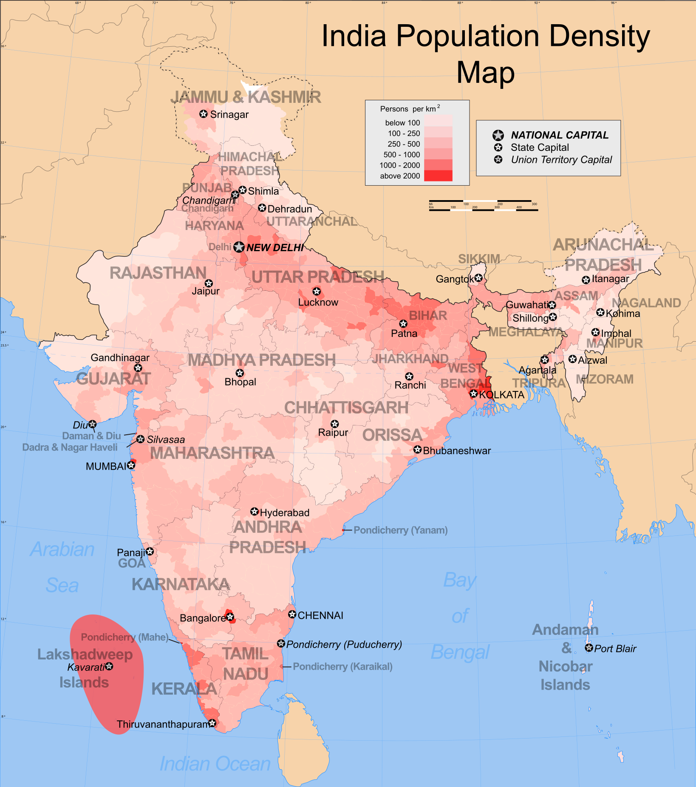
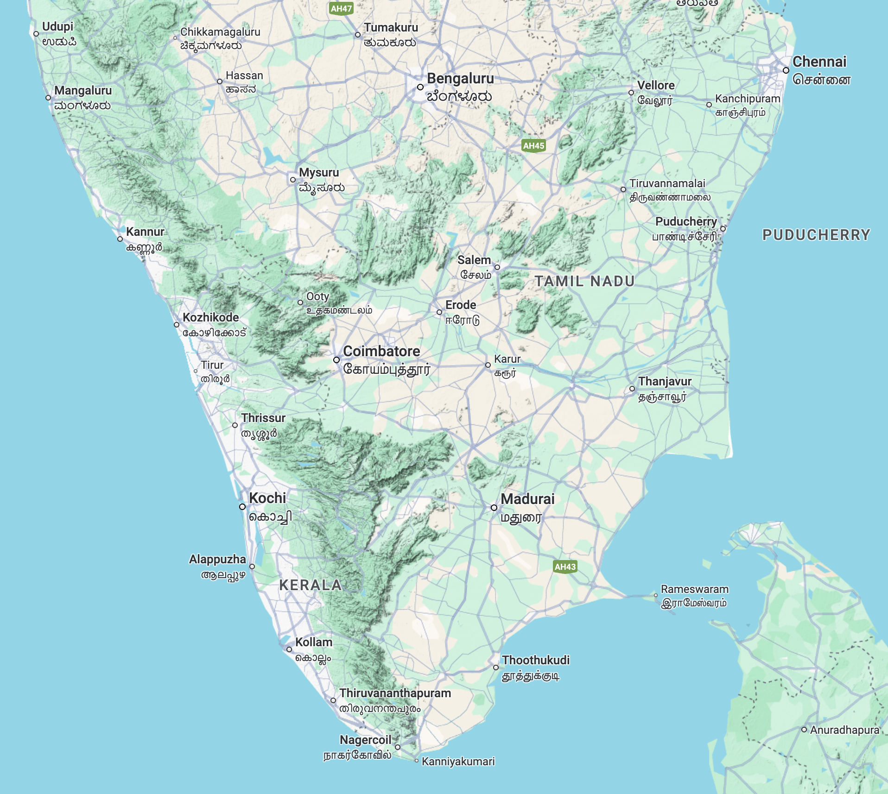
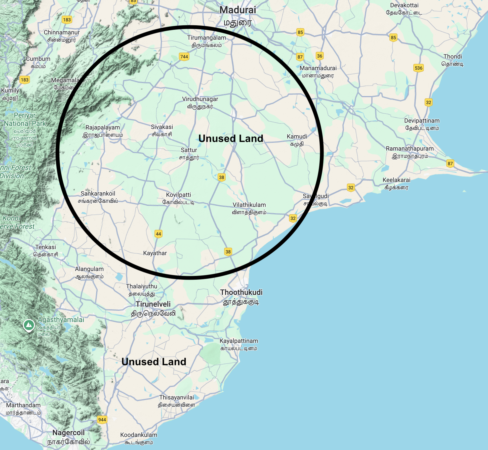

## Most Common Myth of Overpopulation

{width="69%" height="70%"}

Growing up in Tamil Nadu, I often heard from many people, the reason for India’s lack of economic development was,
*“We have over a billion people, so that is our problem.” If we have smaller amount of population, our country would be wealthier”*

This belief is widespread among Indians, including many Tamils. 

However, to me this doesn’t seem to be the major issue. 
In my view, Large population is a net-positive, advantageous for a country. 
Especially in terms of economy, you have a larger market, it’s a blessing for Indians. 

### So, one might ask, How so? 

India has a large population. There is limited job opportunities for large population. 
So, We need to find a large scalable solution, to create, provide and match working age population with a reasonable amount of jobs. 
This would increase their purchasing power, productivity and consumption. Therefore, large population is a great strength.

## Structure of India’s workforce

At present, India’s population in 2025 is about 1.46 billion people. 
The median age is 28.8 years and roughly 607 million active workers in its labor force. 
Many prominent Indian Economists have raised about reliability[^arunkumar2] of the economic data of India [^arunkumar]. 
I am skeptical as well, you usually might have to decrease 2x or 3x times what the Indian Government[^internet] communicates to the broader public[^Rajeswari]. 

The official statistics [^india] says, 
Services (≈55%), including IT, finance, and professional sectors
Industry (≈27%), including manufacturing and construction
Agriculture (≈18%)

According to Indian Economist, Professor Arun Kumar[^arunkumar3], India’s unorganized sector is about 94% of the workforce, only 6% are organized workforce. 

[^arunkumar]: [Why India’s GDP Estimates Miss The Mark – Arun Kumar](https://www.impriindia.com/insights/why-indias-gdp-estimates-miss-the-mark/#google_vignette)  
[^arunkumar2]:[Why India might not have become fourth largest democracy](https://thewire.in/economy/has-india-really-become-the-fourth-largest-economy-five-reasons-to-ask)
[^arunkumar3]: [Arun Kumar on India’s workforce – YouTube](https://www.youtube.com/watch?v=HVMfbpZyWsM)
[^india]: [Provisional GDP Estimates 2025 – MoSPI](https://www.mospi.gov.in/sites/default/files/press_release/GDP_PR_Q1_2025-26_29082025.pdf)  
[^Rajeswari]: [The unending saga of India’s GDP data – Business Standard](https://www.business-standard.com/opinion/columns/the-unending-saga-of-india-s-gdp-data-true-numbers-beyond-the-story-125091501596_1.html) 
[^internet]: [GDP Data Criticism - Reddit India](https://www.reddit.com/r/india/comments/1n3u92v/celebrating_78_gdp_growth_heres_what_the_data/)

**Organized Sector and Unorganized Sector:**

Professor Arun Kumar and other economists estimate that about 94 percent of India’s workforce functions within the unorganized sector, 
while only 6 percent work in the formal or organized economy. 

Out of India’s roughly 607 million workers in 2025, that means only about 36 million people hold formal jobs, while nearly 571 million are in informal employment such as street vending, agriculture, domestic work, construction, gig services, or micro‑enterprise.

So, Formal employment: ≈ 36 million (6 %)
Informal/unorganized employment: ≈ 571 million (94 %)
Contribution to GDP: the unorganized sector produces about 50 percent of India’s $4.1 trillion[^arunkumar4] GDP and as much as 60 percent of real daily output when under‑counted activities are included, so unorganized economy operates largely in cash, low‑productivity segments, and micro‑enterprise. It supports consumption at the base of the pyramid but lacks access to credit, technology, and institutional scale, which restrains productivity growth. Professor Arun Kumar argues that because most workers earn below ₹11000 per month, aggregate demand expands slowly and the formal sector cannot absorb labor fast enough.

[^arunkumar4]: [Indian govt not prioritizing employment-generating sectors - Arun Kumar, CNBC 2025](https://www.cnbc.com/video/2025/07/23/indian-govt-not-prioritizing-employment-generating-sectors-economist.html)  

### Hypothetical transformation: 

So, Assume this transformation takes place, and half of the population, (≈ 730 million) instead worked in high‑productivity, high‑income organized‑sector jobs, annual GDP could reach $25 – 30 trillion (PPP) within a generation, roughly matching the output levels of the United States or European Union. This jump arises from multiplying labor‑productivity, severalfold and increasing effective capital per worker, causing large spillovers in demand, taxation, and innovation.

**So,for example sake, you see, a large population is a boom, not a burden, to a nation.**
**Therefore, population is an asset to India**

## Underutilized, Undeveloped land for Population distribution

Another common objection about India’s population. 
We in India have a large population. 
We do not need more population growth, correct? 

{width="69%" height="30%"}

I’d say, We have an issue of population distribution across large unused land, rather than population growth. 

Certainly, India has large population. It is overcrowded in urban areas. 
Across India, We have large stretches of unused land.
These unused lands are not made productive in anyway, either for population or agriculture. 

To give you an example, about 100-300 years ago, majority of the land was not used in America, it was built, made productive from scratch, So I ask Why not India? 

{width="69%" height="30%"}

The reason for underutilization of undeveloped lands in India, basic public services like education, healthcare, retail stores are clustered in major urban spaces, it is hard for average Indians to live far away from the medium, and large cities. 

It is still possible for large segments of the population to be relocated. It requires support from the Indian Government.
They'd have to provide basic infrastructure support. In such a case, the stress, demand on urban Indian cities can be reduced vastly. 
This can also improve quality of life for all India. 
The solution lies in expanding employment and redistributing the population toward underutilized land across the country