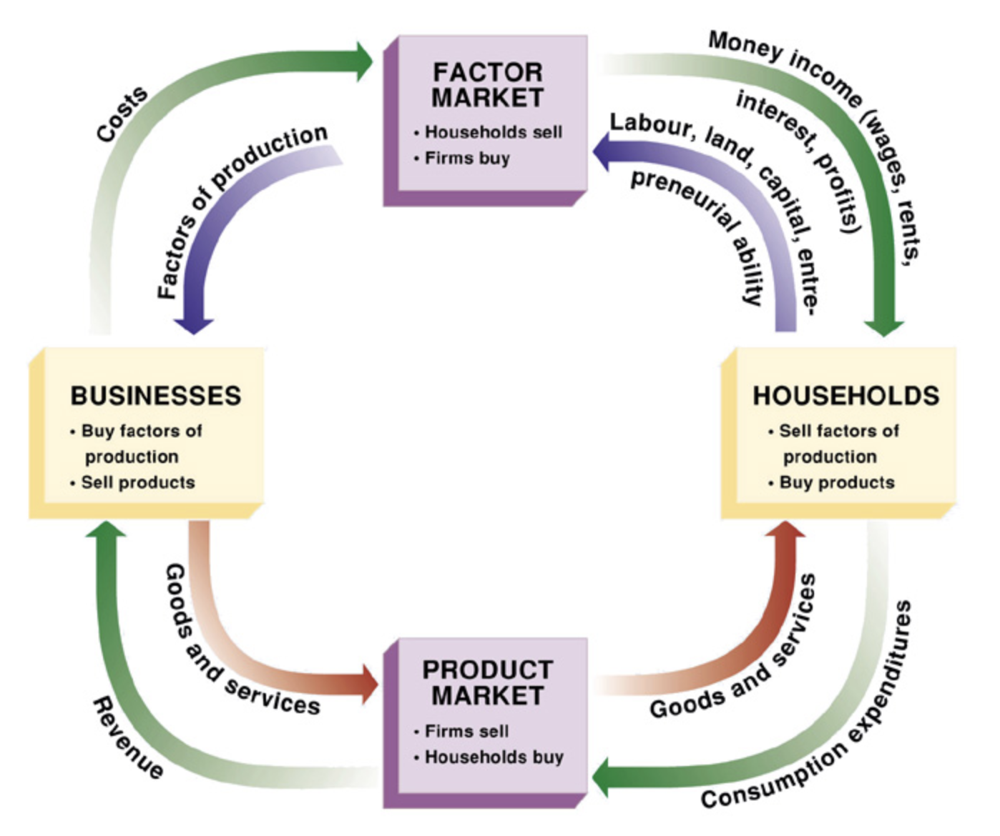
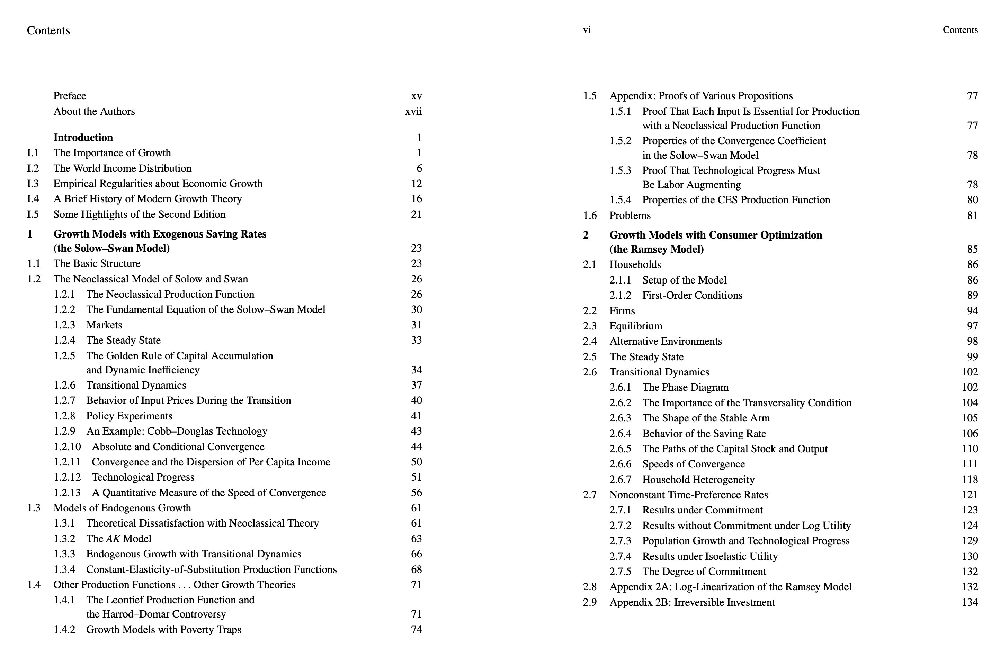
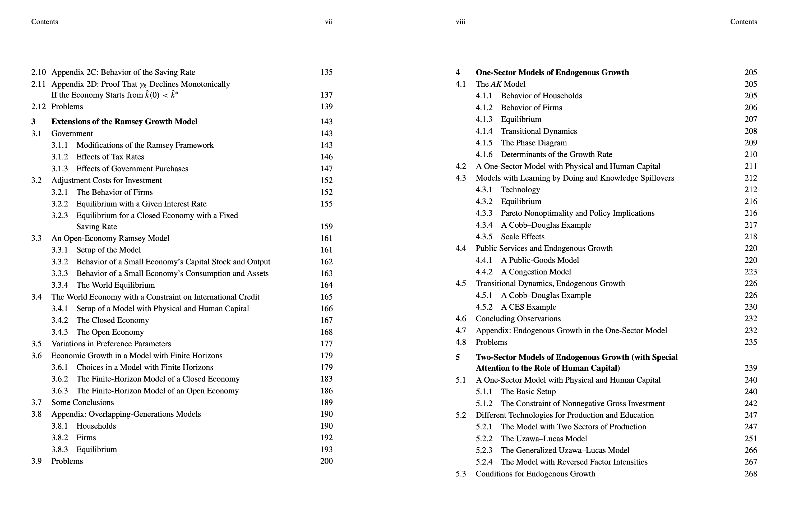
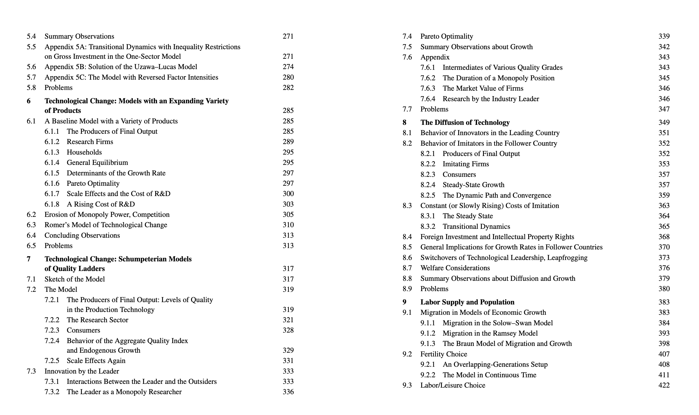
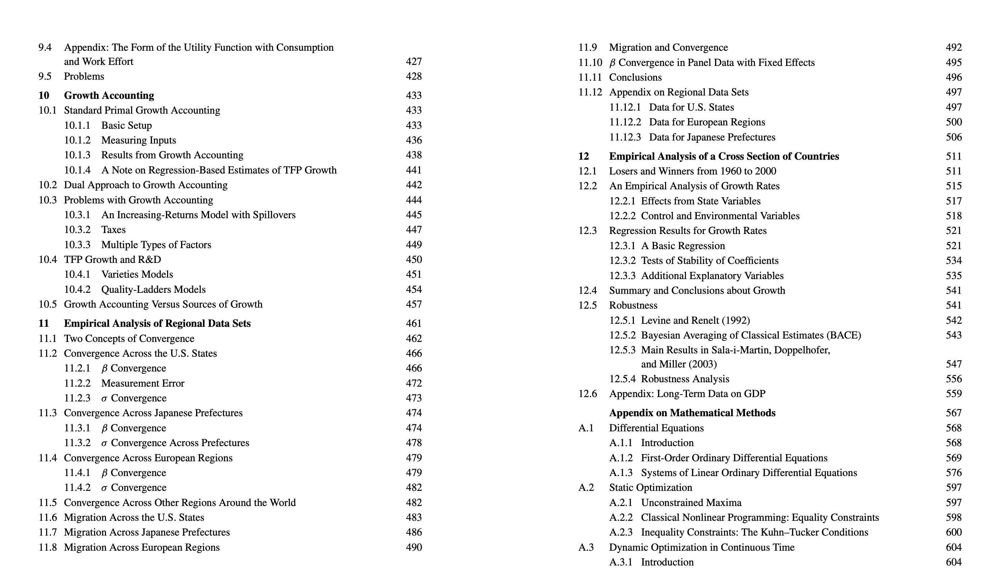
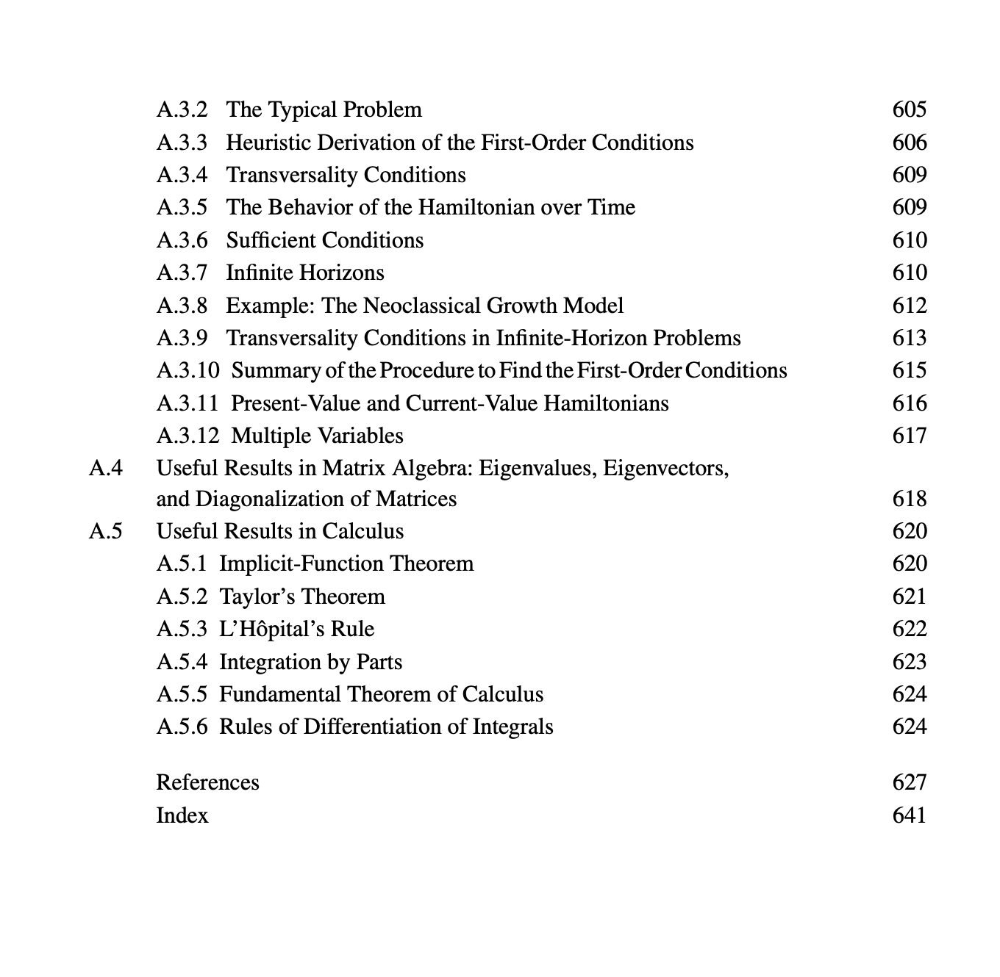

# A Primer and Notes from Economics

Economics is a large field with a lot of sub-fields. 
Economists use models to describe data, make predictions about the future. 
Models are abstractions, that are reasonably enough to capture economic data. 

I’ve been slowly covering graduate level textbook, Economic Growth by Robert J. Barro, Xavier Sala-i-Martin. 
My primary motivation is to understand and formalize with the terms economists describe about towns, countries. 
In this, I am hoping to cover the basics to fill the gaps of my understanding, required to contribute on economic questions that I have been trying to answer. 

The book goes through economic growth theories, emphasizing on empirical models. 
In this, I am covering only what I need for my understanding. 

It’s hard to conduct experiments in macro-economics, so we have to rely on formal modeling. 
The models can describe abstractly the economy with parameters and it is a simple way to understand them. 
One important economic activity is production, which employed workers all engage majority of the time throughout their life. 
Production is inputs which can be labor time, raw materials et cetera, is turned into output. 
Economic activity can be described as production of goods and services for sale. 

Steps towards conducting economic modeling: 

a. Mathematical Model (formal model)
b. Mathematical solution 
c. Explanation for that particular phenomenon 
d. Phenomenon that we aim to explain 

Typically, in most of the macroeconomics courses, you’d have a model for economy. It would consist of households, firms, markets involving factors of production, with flow of input and output. These again are communicated mathematically as it is easier to describe them. 

{width="69%" height="70%"}

An example is firms produce goods (Y) with capital (K) and labor (L) as inputs (production function). Households buy these goods, sell some of their time as labor in the market, invest their savings in capital markets. Market forces makes sure prices of goods (p), capital (interest rate, r) and labor (wages w) adjust.

## Clarifying terms

When I was going through the economics textbook, I got confused by the term, **capital**
In everyday parlance, the term capital usually means, extra money or additional savings that you have. 
Businesses often use this to speak of, we need initial capital to start a business. In Tamil Nadu, people say, initial investment. 

However, capital in economics textbook is referred as a broad term. In general it is referred to **assets** that are used to produce 
goods and services. When we are reading economics technical works from National Bureau of Economic Research, American Economic Association,
We'd come across these terms repeatedly. 

In Adam Smith's Wealth of Nations, Smith describes, wages, profit, and rent are sources of revenue, which maps to capital, labor, land.
In this case, he is saying capital is not money, it's fixed and circulating. 

When you come across economic growth, we would ask, where is this growth coming from? 
For that, We use Growth accounting, where economic growth is broken down relative factors that are contributing. 
In my perception for even looking at companies, this can be used or even towns. 
So, Growth accounting breaks down economic growth. 

In Growth accounting, Capital means machinery, equipment, buildings, infrastructure, technology used in production. 
So, We hope this is not confused when we are exploring and contributing on works of Economics. 

## Economic Growth

We can say economic growth is the increase in market value of goods and services produced by an economy in a time period. 
Economic growth happens due to many factors, and one factor that I think is occuring in India, state of Tamil Nadu is due to population increase. 
So, when it occurs due to population growth, it's called extensive growth. 

We frequently hear about economic growth in terms of percentage rate of increase in real gross domestic product (GDP)
GDP is compared to population, which gets us per capita income. And when, per capita income is growing, we have intensive growth. 

Growth in productivity, which is ration of output to input can help in economic growth. 
When productivity is increasing, cost of goods decreases causing increase in per capita GDP. 
Demographically, many economists have stated lack of participation of women in Indian workforce, which could impact economic growth. 

Another factor is human capital, I first encountered human capital in Agricultural Economist and Nobel Prize Winner (1979) Theodore Shultz's work. 
Theodore personally observed farmers engaged in agriculture, helped them. He came to the conclusion that human capital contributed to economic growth. 
Thomas Sowell uses human capital in his works to describe wealth disparities among different ethnicities. 

Depending on economic school of thought, there are various explanations given towards Growth theories. 
This ranges from Classical, Adam Smith, Thomas Malthus to Neoclassical like Solow-Swan, Endogenous Growth theory. 

Each school has their assumptions and their own apporach. 

## Capital and Productivity

So Capital expands capacity of a society, individual, businesses to increase standard of living. 
And what creates increase in standard of living? Accumulation of capital goods, increasing in quality of human capital. 

When workers have more capital goods to use in their jobs, their productivity will increase. 
In general, more capital goods per worker, more output per worker. 

## Capital Accumulation

In literature, many use the term Capital formation instead of accumulation. 
Economists means net addition to capital stock, which is gross investment minus depreciation. 
In simple terms, Capital accumulation is process of acquiring additional capital stock used for production. 
Accumulation helps in increasing productivity capacity of an economy, drives growth by means of production. 

Fundamentally we express capital accumulation mathematically, 

$$ K_t+1=I_t+(1-δ)K_t $$

$$
\begin{aligned}
K_t &\text{ is the capital stock at time } t, \\
I_t &\text{ is the investment (or gross capital formation) during period } t, \\
\delta &\text{ is the depreciation rate of capital,} \\
K_{t+1} &\text{ is the capital stock at time } t+1.
\end{aligned}
$$

In short, what the mathematical expression is communicating capital stock next period, equals existing capital stock, 
after accounting for depreciation plus, new investment added. So, We can look at how an economy is moving over time through capital accumulation or capital formation. 

## Production Function

Production function is frequently used which describes maximum number of output one can gain, given a number of inputs. 
Usually, the inputs are labor, price of capital. 

Formal definition, production function gives technological relationship, between quantities of physical inputs, labor (L) and capital (C), 
quantities of output produced. 

$$
Q = f(L,K)
$$

Here, Q is the output, L is labor, K is capital. These forms can be extended more to include land, materials, technology. 

## Law of Diminishing Returns

It is great to hear about growth, We all want to grow maximum our firms, industries, towns, regions or country. 
However, the law of diminising returns states as we add more variables to the inputs, at certain point, the output will start to decrease.  

An easiest example to explain this, Say you own a barren farm land in Tirunelveli, Tamil Nadu. 
When you hire your first worker, the productivity is going to spike up. 
and then, the next worker, certainly, you can divide up the tasks, delegate. 
And then, by 50th worker, you probably have some idle in the barren farm land. 

In Mathematical terms, if output is given by production function, Y = F(K, L), law of diminishing returns to labor. 

$$\
\frac{\partial Y}{\partial L} > 0 \quad \text{but} \quad \frac{\partial^2 Y}{\partial L^2} < 0
$$

>We describe Marginal product of labor as: 
$$\
\frac{\partial Y}{\partial L}
$$

>Second derivative is telling us that marginal product of labor is falling, when labor is increased:
$$
\quad \frac{\partial^2 Y}{\partial L^2} < 0
$$

Partial derivative of output Y with respect to L is positive. 
In Tirunelveli's barren land terms, when we add little bit more labor while keeping other inputs fixed, output is going up. 

## Cobb–Douglas Production function

In economics, you need to quantitatively communicate various relationships. 
Economists, policy makers frequently ask questions around labor, economic growth, unemployment, inflation.

So, Cobb Douglas Production is an aggregate function that represents technological relationship, between amount of two or three,
inputs and amount of output that can be produced by the inputs. It's used to describe production and utility 

The most standard form for production of a single good with two factors is given by, 

$${\displaystyle Y(L,K)=AL^{\beta }K^{\alpha }}$$

So, Y is the total value of all goods produced in entire year. 
L is the labor input, K is the capital input, here if you recall earlier, capital will include machinery, equipment, know-how. 
A is total factor productivity, TFP measures efficiency of labor, capital, and other inputs given. TFP gives us how much can be produced, 
without adding more inputs. 

 α is capital elasticity of output, β is labor elasticity of output. 
 In short, what they are communicating is how much is the output changing with respect to 1% or any percentage change in labor, capital?

## Outline of Economic Growth by Robert Barro, Xavier Martin 

{width=125%}

{width=125%}

{width=125%}

{width=135%}

{width=125%}

So, this is the outline of topics to cover in order to understand Economic growth, describe, formulate solutions in this domain. 

## India's Economic Growth from 1947

Indian history, including economic history is a frequent topic. 
The reason why I am including it in the notes is because some of the earlier economical developmental models are relevant. 
We will gain a context for economic growth models. 

## Harrod–Domar Growth model

In Keynesian economics, the belief is that economy's total spending (aggregate demand), controls output and jobs. 
In short, if there's recession, there's less demand, so the government should step in and start spending or cut taxes, and why is that? 
To boost demand and persuade spending. 

So now, Harrod–Domar model is an keynesian economic growth model which is used to explain how growth rate of an economy depends on savings
and capital productivity. Growth is driven by investments (savings), that creates new productive capacity (capital) and generates income, increasing demand. 

$$ 
Y = f(K)
$$

We have an output Y, which is the production function, this is depended on only capital (K).

Let \( Y \) represent output, \( K \) capital stock, \( S \) total savings, \( s \) the savings rate, \( I \) investment, and \( \delta \) the depreciation rate of capital.

$$
\frac{dY}{dK} = c \Rightarrow \frac{Y}{K} = c
$$

The marginal product of capital is constant. 
In simple terms, adding more capital increases output at a constant rate, however we know this is not true. 

$$
f(0) = 0
$$

Capital is necessary for production, so zero capital means zero returns. Well, this is true. 

$$
sY = S = I
$$

Total savings is a constant fraction of output, and all savings are invested.

$$
\Delta K = I - \delta K
$$
Capital accumulation equals investment minus depreciation.

Anyway, Mahalanobis implemented India's economy into two sectors: 

### Sector Definitions

1. Sector 1 consists of capital goods
2. Sector 2 consists of consumer goods 

The goal was to allocate more investment to sector 1, that will drive up future productivity of the economy

### Mahalanobis Model 
$$ 
Y = Y_K + Y_C
$$

So K is output from capital goods, C is output from consumer goods. 

$$
\lambda_K = \text{Investment Share}
$$

The aim was to reallocate investment share into capital goods, rather than consumer goods. 

$$
\begin{aligned}
g &= s \cdot \left[ \beta_K \lambda_K + \beta_C (1 - \lambda_K) \right] \\[1em]
\text{where:} \\[0.5em]
g &= \text{Overall growth rate of the economy} \\
s &= \text{Savings rate} \\
\lambda_K &= \text{Investment share in capital goods sector} \\
\beta_K &= \text{Output per unit investment in capital goods} \\
\beta_C &= \text{Output per unit investment in consumer goods}
\end{aligned}
$$

The dynamic output in the Mahalanobis model is given by 

$$
Y_{t} = Y_{0} \left\{ 1 + \alpha_{0} 
\frac{\lambda_{k} \beta_{k} + \lambda_{c} \beta_{c}}{\lambda_{k} \beta_{k}} 
\left[ (1 + \lambda_{k} \beta_{k})^{t} - 1 \right] 
\right\}
$$

Where:

- $Y_{t}$ is the output at time $t$  
- $Y_{0}$ is the initial output  
- $\alpha_{0}$ is the initial capital–output coefficient  
- $\lambda_{k}$ is the investment share in the capital goods sector  
- $\lambda_{c} = 1 - \lambda_{k}$ is the investment share in the consumer goods sector  
- $\beta_{k}$ and $\beta_{c}$ are the output per unit of investment in each sector

Mahalanobis worked on developing two sector model from one sector of Harrod-Domar Growth model. 
The growth model is internally consistent. However there were issues. 

So the issue with this growth model was that it neglected Agriculture and basic needs for Indians. 
The emphasis was with heavy industry, so you have common issues as unemployment, poverty, and under-utilization of available manpower. 
Overall, India applied Harrod-Domar model from 1951-1955, then Mahalanobis's model until 1966, as there was a food crisis. 
However the model's influence lasted until 1991. 

## Solow–Swan Model

Solow got awarded Nobel Prize of Economics in 1987 for his Solow Swan model. 
The key distinction between Harrod-Domar model and Solow is that Harrod model assumed, growth comes from capital accumulation as long as there is enough labor. 
However, Solow updated this to include three factors of growth, capital, labor and technological growth. 

Solow model looks at how an economy grows by adding capital (recall my earlier explanation of capital), laborers, improvements in technology. 
The model predicts that there will be a steady state, where capital per worker and output per worker grow at a stable rate determined primarily by technological progress. 

Most of the textbooks will explain Solow-Swan model for economic growth. It also says, outcomes on total factor productivity can continuously increase standards of living. The reason is because capital and labor have diminishing returns, however, technology progress TFP can allow to continuously increase living standards. 

$$ 
Y=AK^αL^1−α
$$

The textbook variant comes in continuous time form

$$
Y(t) = K(t)^{\alpha} \left( A(t) \cdot L(t) \right)^{1 - \alpha}
$$

where, **Y(t)** is total output at time *t*, **K(t)** is the capital stock at time *t*, **L(t)** is the labor force at time *t*, **A(t)** is the level of technology at time *t*, which improves the productivity of labor, **α** is the capital share of output, where 0 < α < 1

What we need to remember is that the equation is communicating to us at any point in t, how much output the economy is producing. 
So, that is depended on how much capital, how much labor, how productive the labor through technology or experience/know-how. 

Now, Gregory Mankiw, Romer, Weil included human capital as part of the Solow-Swan Model, 

$$
Y(t) = K(t)^{\alpha} \, H(t)^{\beta} \, \left( A(t) \, L(t) \right)^{\,1 - \alpha - \beta}
$$

Don't forget Mankiw, it's the standard textbook in Economics. 

## Growth Accounting

Growth accounting is frequently used to decompose economic growth. 
So the economic growth might come from sources as increased capital, labor, technology. 
It only shows what happened, and it can't answer, Why it happened? 

And so how do we find out the economic growth? 
We use a production function, most frequently, Cobb-Douglas function. 
We break down the output growth by sum of growth rates of the inputs weighted by share of incomes. 
Growth Accounting decomposes Output per Worker into three factors: Productivity, Capital, and Labor.

On practical level, We'd hear something like this, Tirunelveli or say Chennai's economy is growing. 
And it grew by 5% or even 11%, earlier, there was a news about Tamil Nadu's economy growing at 11% 
That is a high number, so we want to find out, where that growth is coming from?

So, growth might be coming from having more workers in a sector. 
It could be we have more capital being introduced, so workers are being more productive. 

So, we are back to cobb-douglas function. 
Primary reason, why we use it because Cobb-Douglas production has been empirically validated using manufacturing data, from 1899-1922. 

$$Y_t = A_t K_t^{\alpha} L_t^{1-\alpha}$$

When we take logarithms of this function, it becomes additive. 
And therefore, it is easier to decompose from seperate contributions. 

Here we have decomposed form, we want to know output per worker, so we divide by number of workers (N).

$$\frac{Y_t}{N_t} = (A_t)^{\frac{1}{1-\alpha}} \left(\frac{K_t}{Y_t}\right)^{\frac{\alpha}{1-\alpha}} \frac{L_t}{N_t}$$

Total Factor Productivity (TFP), we derive from Cobb douglas function. 
Here we need only $$ A_t $$. We can measure technology or efficiency of inputs being used through this. 
It's rearranged algebrically. 

$$A_t = \frac{Y_t}{K_t^{\alpha} L_t^{1-\alpha}}$$

{width=125%}
*Credits:* Chapter 10, Economic Growth by Robert J. Barro, Xavier Sala-i-Martin. 

## Productivity

After looking at farm operations around the Globe. 
I looked at the Dutch, Canadians, I often wondered about productivity of farms in the Semi-arid town of Tirunelveli? 
How do we compare few farms objectively in an economic way? 

Think of a 50–100 acre farm in semi-arid Tirunelveli. Given that fixed land area, the key question is, how can we raise output per acre as much as possible, using better combinations of water, machinery, seeds, and labor? That is the heart of a productivity problem.

So productivity is expressed through production function in a variety of ways. 

Cobb Douglas Production Form, Leontief Production Function, We use Leontief production function only inputs must be used in fixed, non-substitutable proportions.
So, take making Cars, you need fixed 1 steering wheel and 4 tires. The ratio is 4:1. 

As Functional form, productivity can be expressed as $$Q=f(X_1,X_2, X_3, .... X_n)$$

We can express productivity also in Linear form, $$Q=(aX_1+bX_2+cX_3+ ...+dX_n)$$

# References {.unnumbered}

1. Barro, Robert J., and Xavier Sala-i-Martin. *Economic Growth*. 2nd ed., MIT Press, 2003.  
   [https://mitpress.mit.edu/9780262025539/economic-growth/](https://mitpress.mit.edu/9780262025539/economic-growth/)