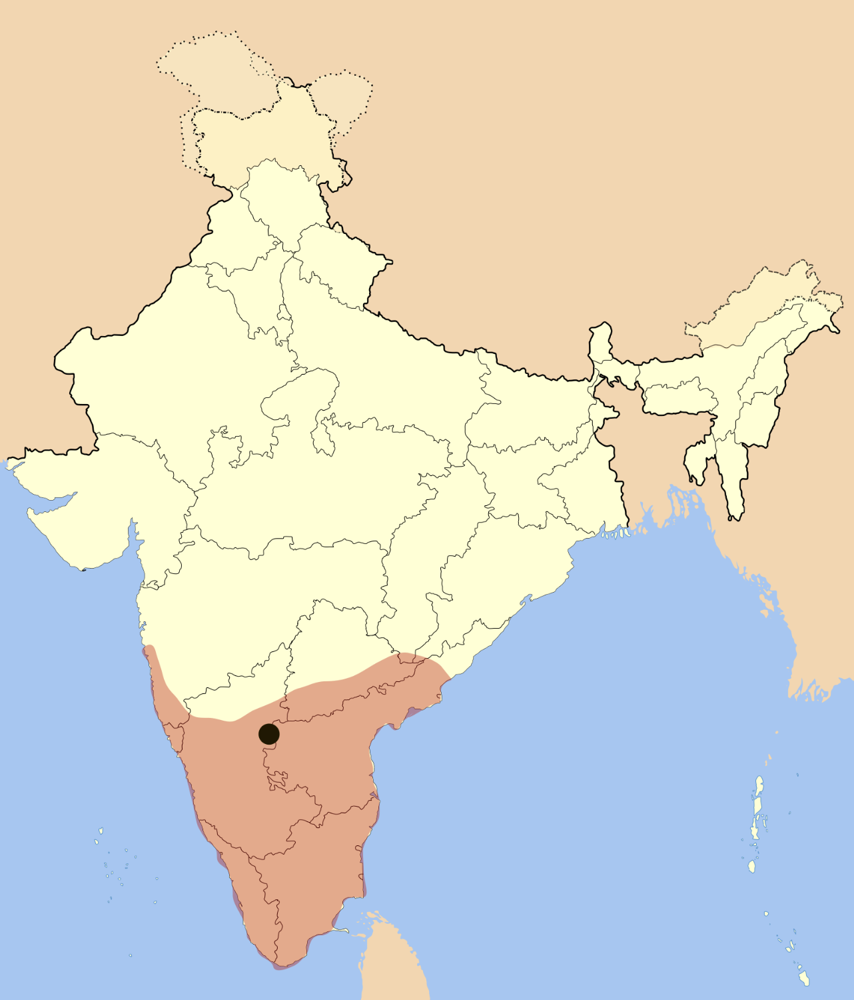
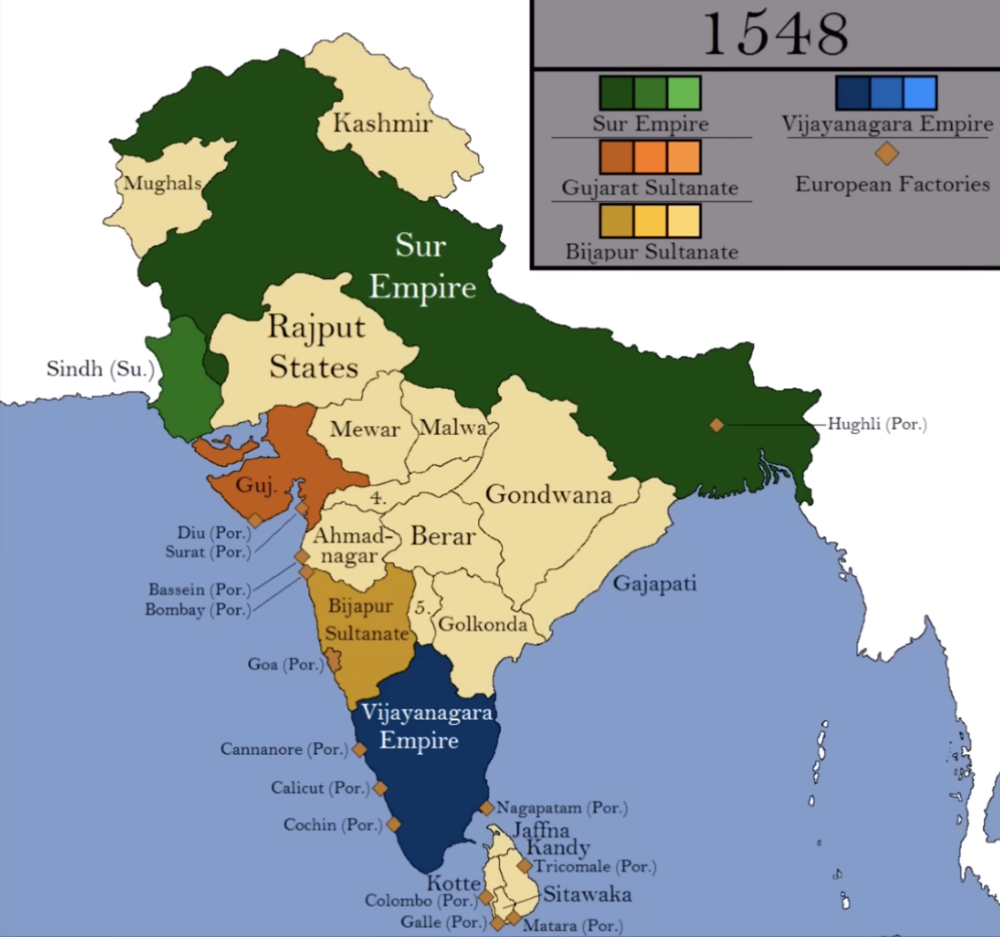

## How South Indians forgot their own civilization?

Every South Indian, who has roots from southern India is to be reminded that our region's history has existence for a few millennia. 

Controlled by political forces with vested agendas to keep their parties afloat; South India's public discourse has been diverted, neglecting their own history, leaving its people distracted by cinema.

> Almost 1000s of conversations, or even *millions*, among South Indians reveal scant discussions on key historical gaps: how regions were administered, rights of lay people, ancestors' mistakes to avoid, prosperous areas and why, and crucially, why science and technology did not develop further.

## Questions to raise: 
- How were regions administered?
- What rights did lay people have?
- What mistakes of ancestors must we avoid repeating?
- What areas prospered and why?
- Why did science and technology not develop further?

## Current Challenge
In commerce and industry, South Indian companies lag to reach technological forefronts in global-level, Why. 
At present, none of the technological breakthroughs come from South India, why?

{width="49%" height="30%"}

## Useful knowledge, Science and Technology, Castes: 

In my earlier-essays, I've hypothesized, caste-system silos puts people into hierarchical groups from truly viewing each other as equals and learning, exchanging knowledge, know-how, strategy from each other, two highlighting examples are if only Brahmins learnt vedas, read and wrote literature it was closed off. This also lead to majority population's resentment which later created reservation. 

Similiarly, Nagarathar chettiars established large tight-knit financial networks through lending money to people in Ceylon, Malaya, Singapore, Burmese farmers which created wealth among them and stayed within only them. This also lead to their financial demise

Vishwakarma castes, who helped to build Hindu temples, design magnificent architectures, guarded their metallurgic techniques, tool making. Wootz steel developed in South India was considered to be of finest quality. In 1795, Dr. George Pearson, a British chemist and physician studied and published detailed chemical analysis in  Philosophical Transactions of the Royal Society. Denis Diderot’s Encyclopédie (1751–1772), complied artisan techniques, manufacturing processes, scientific principles, which broke monopoly of guilds disseminating knowledge. 

{width="39%" height="20%"}

This is strictly contradictory to European enlightenment, where the men of letters tore the social fabric to create new fabric where every man was endowed with equal rights. Moreover, Isaac newton, a farmer could become president of Royal Society. In South Indian society, an Adivasi, Chakkiliyar can’t dream of being equal with South Indian-Brahmins, it is still the same way to this day. This seems to be the heart of South India’s lack of further progress as Europe modernized, with Japan following in a century, yet South India remaining in Semi-Feudal levels. There was democratization of useful knowledge through institutions to all, contrary to South India. Even to this day, silos present through strict social boundaries. 

{width="49%" height="30%"}

Economic Historian, Joel Mokyr states modern economic growth occurs, due to improved access to scientific ideas bidirectionally. There's two types of useful knowledge: propositional knowledge (episteme or Ω), society's understanding of natural regularities laws, and prescriptive knowledge (techne or Λ), the techniques for manipulating nature. The Why behind techniques gets confined to an extremely small demographic, elite. Each caste group made prescriptive knowledge fragmented, as there was no institutional mechanisms for cross-pollination. 

### Counterfactual history:

If South India broke caste-silos and if Wootz steel artisans formed democratic scientific and industrial guild, it would have been the birthplace of modern metallurgy or early machines, structural engineering. At present, South India's software engineering industry is at similar conundrums, there has been no vision, push to be at the forefront to be a global leader, even though the region has millions of software engineering workforce, Why? 

### Knowledge Instititons: 

Kerala school of astronomy and mathematics was founded by Madhava of Sangamagrama, which flourished during 14th to 16th centuries. It was largely Nambudiri‑Brahmin in composition and temple‑centered. Nambudiri Brahmins, as major temple controllers and landowners, indirectly funded scholarship and helped the school. Participation was restricted to upper-caste Sanskrit scholars, mainly Nambudiris and related groups; lower castes were not involved due to educational and social barriers. The Kerala School represented a peak of isolated intellectualism, the Vijayanagara Empire represented the height of South India's political and material organization, they all operated within their rigid social structures. The Vijayanagara emperors did not take any active interest. They mostly focused on tax collection from, agrarian stability to fund their military expansion. Krishnadevaraya was building magnificent temples to cement his ritual status (1520s), while, European monarchs and the early Medici in Italy were starting to fund navigators and engineers specifically to gain a "technological edge.

## The Vijayanagara Empire

Vijayanagar Kingdom was founded in 1336 by brothers, Harihara I and Bukka Raya, which extended entire South India, administering for almost two centuries up to 1646. The last Vijayanagara King, Sriranga III granted the British English East India company to build Fort St. George in 1640s. Historians describe Vijayanagara as an early agrarian empire. 

{width="49%" height="30%"}

Vijayanagar, the city was a symbol of vast power and wealth, travelers and visitors were impressed by the variety and quality of commodities that reached the city, architectural grandeur of palaces, temples. While Kannada was the official language, the court promoted Telugu, Tamil, few Sanskrit. The empire actively patronized Hindu temples, rebuilding and expanding, perfecting Dravidian architectural style, through gopurams, kalyanamandapas (marriage halls) and intricate pillar carvings, which became symbol of South Indian temple design. Sati was practiced throughout the Vijayanagara empire. 

The empire established foreign trade as well. Rice  Sugarcane, Diamonds and Iron were the major export. Horse was one of the most important commodity for civilization. Arabs and Portuguese traders controlled Horse trade. Horses came as far as Syria, Turkey, Arabia.

Among Kings of India, Krishnadevaraya stands as one of the foremost. This was due to his efficient administration, imperial expansion, increased tax yields from agricultural intensification and increased military strength. Land revenue was from 1/6th to 1/3th of the crop yield, Temples and Brahmans paid 1/20th to 1/30th taxes. He conducted durbar meetings with his ministers, created accountability by punishing misconduct, corruption. 

Burton Stein, a Scholar and Historian focusing on Indian history speaks Vijayanagar polity as Segmentary State polity. In this the Ruler has decentralized polity, sharing power among semi-autonomous, military leaders called, Nayakas. The ruler occupies ritual-symbolic authority, leading festivals, issues firman at the center. Vijayanagar emperor’s state religion was Hinduism, fostered environment for all religions, even as far as one emperor Deva Raya building, a mosque for the Muslims in Vijayanagara and placed a Quran before his throne.

Krishnadevaraya promoted arts and literature, spoke Telugu, Tamil, Kannada, Sanskrit and composed Amuktamalyada, a Telugu poetry, a  treatise on polity and administration. Eight Telugu poets assembled as Ashtadiggajas, composing Telugu epic poetry. It was early, 1565, the disastrous defeat of the Vijayanagar forces by Deccan Sultanates, lead by Ali Adil Shah in the Battle of Talikota. It led towards sacking and destruction of much of the cities of Vijayanagar, Hampi. 

{width="49%" height="30%"}

## Fragmentation and Decline

The sack of the capital after Talikota (1565) made the court relocated to Penukonda, Chandragiri, Vellore, imperial authority fragmented into powerful regional polities of South India. 

Due to collapse and fragmentation of Vijayanagar empire, the Nayaks (Governors) established their own kingdoms as Madurai, Ramnad, Thanjavur, Gingee Nayaks. Nayaks ruled majority of South India, even considering Tirunelveli district, who built the famous Thirumalai Nayakkar Mahal with Indo-Saracenic style. Thajavur Nayaks expanded Brihadeeswara Temple, which was built by Chola emperor Rajaraja I in year 1010 CE. Marathas took over Tanjore in 1674, with half brother of Shivaji establishing Thanjavur Maratha dynasty. Ramnad Nayaks were subordinate to Madurai Nayaks as Zamindars, who called themselves as Sethupathi. Nayaks promoted cosmopolitan court culture with Telugu, Tamil, and Maratha. Nayak Rule slowly fragmented due to succession disputes, with Chanda Sahib taking over Madurai in 1736. 

## Unfinished Modernity

South Indians speak highly of the Chera, Chola, Pandya, Vijayanagara Empire for their military expansion, maritime trade and Dravidian architectural brilliance. It is even worth revising the British Raj to help draw lessons, for enabling South India’s unfinished modernity, The caste system’s intellectual silos blocked the transmission and accumulation of knowledge, know-how, even to this day. In contrast, Europe and Japan’s Meiji Era, flattened their social hierarchies, built institutions that disseminated useful knowledge, encoded learning, and scientific academies were built in the pursuit of progress, welcomed non-nobles. South India’s modernity remains unfinished until it does the same.

## References

**Sewell, Robert** (1900). *A Forgotten Empire (Vijayanagar): A Contribution to the History of India*. London: Swan Sonnenschein & Co. Classic pioneering work on Vijayanagara.

**Sastri, K.A. Nilakanta** (1955). *A History of South India from Prehistoric Times to the Fall of Vijayanagar*. Oxford: Oxford University Press. Authoritative comprehensive history.

**Kulke, Hermann & Rothermund, Dietmar** (2004). *A History of India*. 4th edition. London: Routledge. Contains substantial sections on Vijayanagara.

**Stein, Burton** (1989). *Vijayanagara*. The New Cambridge History of India, Vol. I.2. Cambridge: Cambridge University Press. Comprehensive scholarly treatment.

**Karashima, Noboru** (2014). *A Concise History of South India: Issues and Interpretations*. New Delhi: Oxford University Press. Contextualizes Vijayanagara within broader South Indian history.

**Nuniz, Fernão** (c. 1535-1537). *Chronicle of Fernão Nuniz*. In Robert Sewell's *A Forgotten Empire (Vijayanagar): A Contribution to the History of India*. London: Swan Sonnenschein & Co., 1900.

**Paes, Domingo** (c. 1520-1522). *Narrative of Domingo Paes*. In Robert Sewell's *A Forgotten Empire*. Provides eyewitness accounts of Krishnadevaraya's reign.

**Mokyr, Joel** (2002). *The Gifts of Athena: Historical Origins of the Knowledge Economy*. Princeton: Princeton University Press. Comparative framework for understanding knowledge transmission and economic development in premodern societies.

