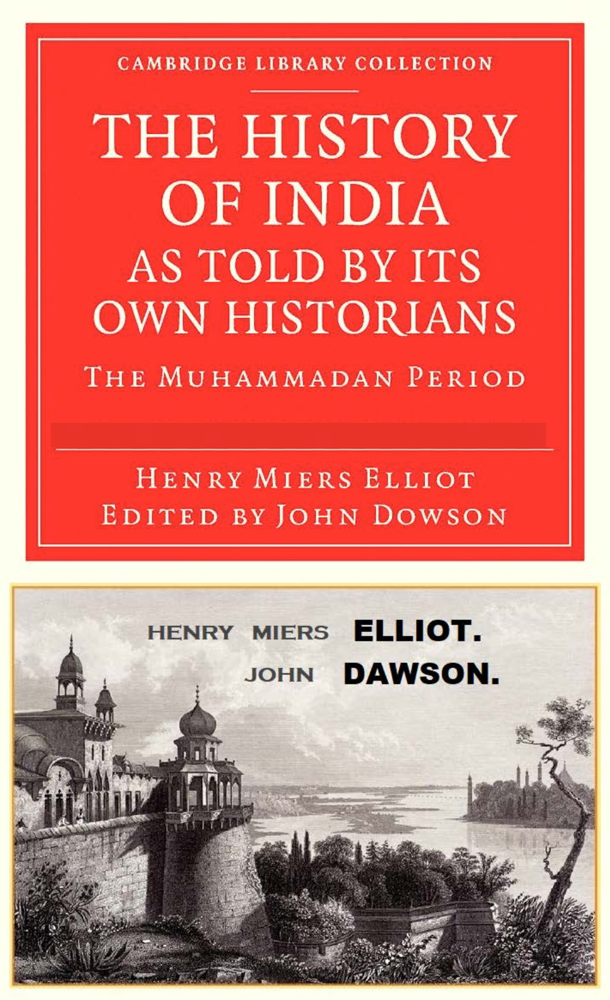
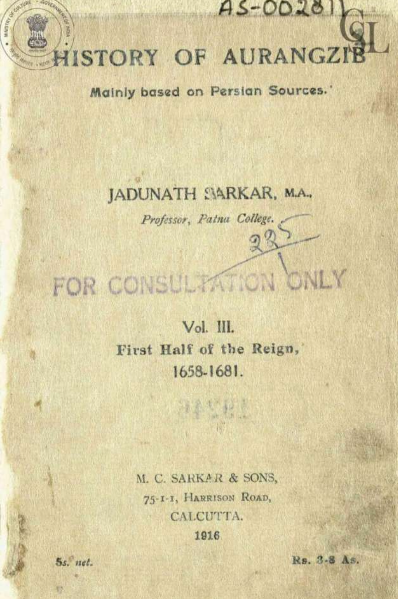

## Introduction

When Aurangzeb died in 1707, contemporary Persian chroniclers and court historians portrayed him in laudatory terms. Even dissenting voices of the time did not paint him in the deeply negative, almost in demonic, tones found in modern nationalist discourse. In conclusion, I argue, We need to decolonize the decolonising-Hindutva writers out of their colonialism bias. 

In this, I raise fundamental questions: 

1. Why was there no such demonization of Aurangzeb during or immediately after his reign?
2. How did a monarch who ruled India when it was a global economic powerhouse, contributing nearly 24% of world GDP, come as terrorizing in textbooks causing fear, political speeches, and his name removed from Indian street-names?

To address these questions, I examine historical accounts, writings of contemporary chroniclers, and interpretations advanced by modern historians.

Reliability here means triangulation, where court chronicles, administrative records, traveler accounts, and memoirs converge, confidence rises, where they diverge, we treat claims as contested rather than as moral certainties.

## 1. What role did Aurangzeb play in Indian History?

Aurangzeb holds a pivoted place in Indian History (1658–1707). 
In his time, India was the economic-superpower, contributing 24-25% of the Global GDP. 
His empire surpassed Qing China, as largest economy and manufacturing super power. 
This wealth attracted European Merchants to India. 

Aurangazeb's military was one of the strongest armies in the world.
He extended Mughal Empire to greatest territorial extent. 
He had tremendous stamina spending 25 years fighting in Deccan. 
Aurangzeb spent most of his reign on military campaigns, 
personally directing operations in the Deccan for over two decades.
He refused to give up and choose to fight, the hardest region of India for military conquest, Deccan. 

Once territories were acquired, he implemented social and political institutional goveranance as patronized the book, Fatawa-e-Alamgiri (1672). 

Even after he died, Aurangzeb in 1707, did not have highly negative image, nothing as grievous to the point of changing names of historically important roads and cities in India. 

So, I began wondering? 
Why? 
How come some strands of his life occupied Indian memory, while other strands focusing on piety, discipline, statecraft became secondary?

First question, How do come to know about the life of Aurangzeb? 

Aurangzeb was born on November 3, 1618, in Dahod, Gujarat.
Aurangzeb died on March 3, 1707 in Ahmednagar at age 88. 


## 2. Official Court Sources

The first major account of his life, Aurangzeb comes to us from Muhammad Kazim’s ʿĀlamgīrnāmah (1668–1669). 
This work began compiling, when Aurangzeb was alive. After Aurangzeb died, We have an account of his life in Persian, Maasir-i ‘Alamgiri written by Saqi Musta‘id Khan was completed in 1710. So the official documents, give high accounts of praising him. 


## 3. Ground Level Source

Bhimsen Saxena, a Hindu soldier. He provides us, a firsthand account of Mughal campaigns in the Deccan. 
He was a news-writer attached to Aurangzeb’s Deccan campaigns. 

In year 1707, he wrote a memoir Tārīkh-i Dilkashā (History that Warms the Heart). His account is politically ambivalent towards Aurangzeb, he expresses both loyalty and anger, when contrasting with Shah Jahan. Bhimsen complaints in his account about land-lords being corrupt, exploiting peasants. He critiques the state in terms of administering. He does not frame the conflict as a religious war between Hindus and Muslims.

So I asked, What changed, how did he become Villian? 
Did we discover any newer documents, sources? 
Unfortunately, that wasn’t the case. 
An Indian Historian Jadunath Sarkar came to mind on Aurangzeb. 
He was prolific, mainly gathering as much evidence through primary, secondary sources. Jadunath Sarkar lived during 1870 – 1958. 
Aurangzeb died in 1707? 
I wondered, How did he know about Aurangzeb in 1707?

These were questions on the back of my mind. 
Considering, the question of reliable Indian History. 

## 4. Accounts after his death (1700-1750)

After Aurangzeb died, Mughals still were in charge, it was not until 1757 - 1765; British came to power in Bengal. Khafi Khan’s Muntakhab al-Lubab’s, is a Persian language book about the history of India, completed around 1732, in this work, he asks, What went wrong during Mughal Rule? As he is explaining to Mughal elites, who are living as consequence of Aurangzeb’s policies. In this the context is set towards Mughal decline. This account is was a critique of policy, not a condemnation of Islam or even Hindu vs Muslim. 


## 5. Italian Niccolao Manucci’s accounts

Niccolao Manucci was a Venetian Writer, (1638 – 1717). He arrived as a 17 year old  in  1656 to Surat. He wrote accounts of  Mughal Empire. He worked for Dara Shikoh, both as artilleryman and Physician. After Dara’s execution, He worked for Raja Jai Singh. He then left to work for Portuguese Goa, and then went back to work for Shah Alam in 1678. Manucci worked for East India Company and Mughal administration in Arcot. Manucci dissuaded Europeans to come to India for a career. 

He published His four-volume Storia do Mogor (1653–1708), written in Italian-Portuguese mix, detailing court scandals, harem customs, succession wars, folk beliefs (e.g cobra omens), and daily life, claiming firsthand accuracy. He died in Chennai. 

His writings are stylized as moral framing and court scandal style. In Manucci’s account is where you find a mix of observations colored by his Venetian adventurer's biases, personal experiences, and occasional exaggerations rather than pure inversion or wholesale negation. 


## 6. The English Administrators and Historians (1770s–1870s)

Henry Miers Elliot (1808 – 20 December 1853) was a British Civil Servant. 
He published his famous work, “Indian History told its own Historians, The Muhammadan period.” in 1867–1877. This work translated Arabic & Persian Muslim chroniclers, aiming to show Muslim rulers' violence to show how British rule was civilizing. His work became a foundational, though controversial, source for understanding Muslim India, criticized for selective translations, bias, and downplaying cultural aspects. In the Preface of Henry Miers Elliot & John Dawson’s book goes in details about how British administration provided more roads, and their administration was far better than early Mughal rule. He expressed hope that it will make our native subjects more sensible of the immense advantages accruing to them under the mildness and equity of our rule.

 **The preface states, the crimes, vices, and occasional virtues of Musulman despotism.**


Alexander Dow (1736-1779) was a Scottish infantry officer in the employ of the East India Company. At the publication of this work, The English East India Company had gained Bengal by 1761. Alexander Dow’s History of Hindostan 1772, Dissertation on the Origin and Nature of Despotism in Hindostan and an Enquiry into the State of Bengal; with a Plan for Restoring that Kingdom to its former Prosperity. In this work, Aurangzeb is painted negatively. Dow's depiction was influential in shaping the British colonial-era understanding of the Mughal Empire and its decline. He portrays Aurangzeb as a religious bigot whose rigid adherence to Islamic law (Sharia), reversal of tolerant policies, and reimposition of the jizya tax on non-Muslims created unrest and conflict within the empire. 

It is in Indian History told its own Historians, where, the The Muhammadan period turns violent, and that Indians are grateful for the British Rule. The British Rule is on the Civilizing mission to rescue India from Tyrannical, Muhammadan period. 

::: {.callout-note}

{fig-alt="Dowson Bias"} 
:::

Sir Henry Miers Elliot and posthumously edited/completed by John Dowson, offering crucial insights into Muslim rule in India while reflecting Elliot's colonial perspective on British rule's superiority. The preface is extremely revealing: it explicitly announces a desire to show the “crimes, vices, and occasional virtues of Musulman despotism.

>Does this ring a bell? 

Nationalist Indian Historians accounts from 1880-1940s such as Dhadhabhai Naroaji, R.C Dutt’s account, We find similar beliefs - How?

In this time, the tables are turned, It is the British who become villains. 
And it comes in the form of how, “British stole the wealth from Indians” 

I encourage and ask every Indian, But what about reliable Indian History? 
Do we find similar accounts? 

We find how the same Musulman despotism turns into British despotism. 
And now, What we find, Hindutva rule has turned to earlier eras as vile, wicked. 

The Hindutva rule is simple, Congress was wicked, British were vile, that all Indians were slave for 1000 years, until we are here to rescue you.  


## 7. Jadunath Sarkar (1870 — 1958)

Jadunath Sarkar was a prolific, Indian Historian. 
He was known for extensive, archival-based work on the Mughal Empire. 
The issue with Jadunath Sarkar’s method is that, he inserted themes that did not match correctly with Maʾās̱ir-i ʿĀlamgīrī translation. For example, Maʾās̱ir-i ʿĀlamgīrī was complied in 1710 by Musta'id Khan, a Court official. It only has high praise, yet Jadunath Sarkar uses the same source and creates the image of religious bigotry. In other words, Sarkar’s paratext (titles, headings, thematic packaging) can become an interpretive machine that manufactures a more uniformly negative Aurangzeb. Due to this reason, Sarkar’s work is not completely reliable. 

::: {.callout-note}
Jadunath Sarkar's Aurangazeb: Where he inserts and portays biased projections

Sarkar’s paratext titles, headings, thematic packaging clearly violates his own objective standards. 
As a reader, I wonder, Why is it called Hindu reaction? And Why call it Invasion? 
It simply could be Raja Jai Singh's reaction and War between Aurangazeb and Rajputs for territority.  

In the outline, He has concluded, Law sanctifies plunder and massacre of unbelievers, The Muslim State is a theocracy, hence toleration impossible. These are not a work of Historical Scholarship.

{fig-alt="Jadunath Bias"} 


As I go through this work, I wonder how a Historian who has spent his career and life's effort on this?

Sarkar’s method privileges textual paratexts over administrative correspondence, 
generating a moralizing reading absent in Persian originals.
For example, He says Mathura Hindus, creates moralizing themes. 
In this Chapter there's Sikhs as well, Sikhs do not consider themselves as Hindus. 
It is clearly, wrong in its factual inaccuracies, selective causation, and derogatory framing of Sikh evolution as a "degeneration" that provoked Mughal conflict.

{fig-alt="Jadunath Bias"} 


In this Chapter, we notice the methodological flaws of Jadunath's historiography, it substitutes political analysis with geographical description, reduces legitimate state practices to criminality through loaded language “robbers,” “blackmail,” “servile” and projects modern religious binaries onto a seventeenth‑century power struggle. 

By asserting, without documentary evidence, that Aurangzeb pursued a plan of forcible conversion of the Hindus, the author converts a complex succession crisis and imperial assertion of authority into a teleological narrative of communal conquest. He rests his argument rests heavily on colonial gazetteers and romanticized sources like James Tod, while treating partisan Mughal chronicles uncritically and ignoring administrative records and treaty practices. 

As a result, imperial expansion is naturalized as strategic necessity, Rajput sovereignty is delegitimized, and historical causation is displaced by ideology—producing not critical history, but a colonial moral fable structured around geography, religion, and presumed civilizational conflict.

{fig-alt="Jadunath Bias"} 

In the years 1600-1700, there was no Democracy. 
Sarkar is writing in 1900s, where Democracy existed, morever in this chapter. 
He has picked up the British writers and has absolute claims such as toleration is impossible. 
These statement is false, In Mughal Empire, Jesuits even visited, there were Hindus who practiced their religion. 
"toleration is impossible" would mean, none existed and everyone stopped practicing their own faith. 

{fig-alt="Jadunath Bias"} 

Jadunath's bias in inserting his paratext, thematic injections. 
He starts the chapter saying, Such open attacks on Hinduism by all the
forces of Government naturally produced great discontent among the persecuted sect. Some
frantic attempts were made on the Emperor's life, but they were childish and ended in failure.

In this as a reader, I wonder, Why is it called Hindu reaction?
It clearly is not Hindu reaction. 

{fig-alt="Jadunath Bias"} 

:::


## 8. The English Historian who fictionalized Hindu-Muslim divide

This English historian, specifically set to the audience to this memory. 
Akbar’s rule was syncretism and Aurangazeb’s rule was tyrant and bigoted. 

This historian is James Mill, father of John Stuart Mill, considered the most Influential English speaking philosopher of the nineteenth century. 
James Mill published six volume work of History of India by 1820. 
This work brought James Mill to fame. I want to add that until this point in Indian History. The early British scholars, administrators revered Indians. 
As british administration all looked at India as an exotic place. 
A lot of them took Indian women as wives, took Bibis, thus we have Anglo-Indians. 

However, the policies shifted radically after James Mill’s Indian History from 1830s. British administration dissuaded and looked down on Indians, the perception shifted of India. 

From 1860s-1950s, the Indian Nationalists writers such as Jadunath Sarkar, RC Majumdar pick this up and throughout their works, present Auraganzeb in same negative light? 


## 9. Political Theory of Kings

In Persian-Islamic worldview, the King was Padshah (imperial sovereign)
He was above nobles, regional factions, regional elites. 
The King was described as zillullah (Shadow of God on Earth)
This meant, the King’s authority is the earthly instrument of order and justice.
The King was not divine, yet any rebellion was not just viewed as political disobedience, but threat to his empire’s social-order. 

Mughal Political thought followed Nasir al-Din Tusi’s Akhlaq-i Nasiri tradition, in which the ideal ruler was framed as one who secured the wellbeing of diverse religious groups, not Muslims alone. The Mughal emperor was imagined as the manager of plural society. The King’s Sovereignty was tested through force, protection, and expansion. His duty was to defend roads, suppress rebels, secure revenue flows, and punish disorder.

This is an important context to remember when understanding life of Aurangzeb. 
He lived in a time, when democracy did not exist, which meant, not all Indians, had equal rights. We have modern institutions in India such as Judicial system, Civil Servants, Modern Schools, Colleges. We have taken these for granted as Indians. 

Temples, Mosques played a central role for administering. Especially it occupied as symbolic political power of the kings. The power of King did not have any checks or balances, the only check was another King or Empire could take away his entire kingdom, not only that, take away imperial treasury, pillage. In the midst of all these, interpreting life of Aurangzeb is important to view through this context. 

Aurangzeb didn’t stop governing a plural empire, he tried to stabilize imperial sovereignty under extreme stress as he was expanding, by narrowing the empire’s legitimacy bargain, leaning harder on Islamic legal symbolism like jizya and juristic authority, and treating independent mass religious leadership, like Sikh Gurus, as potential political rebellion. 


## 10. Conclusion

In my quest for finding reliable Indian History, I turned to Aurangzeb (1618–1707).
He is the most politically contested ruler in India’s early modern past. To the Hindu Nationalist, He is the most Vile King of India. To the less religious Indians, He was a great king, who expanded India’s territory. To Pakistanis, He was a great king who ruled according to Islamic faith. Decolonizing the Decolinizing Hindutva writers, therefore, requires not replacing one grand narrative with another, but calibrating degrees of belief in accordance with the density of contemporaneous source agreement.

## 11. The Missing Data: A Historiographical Chart
```{mermaid}
%%{init: {"theme":"base","themeVariables":{"fontSize":"28px"}}}%%
timeline
title Timeline 1: Primary Sources During Aurangzeb's Lifetime (1618-1707)

1618-1658 : Birth of Aurangzeb (October 1618)
              : Early court chronicles begin documenting his career
              : Ishwar Das - Futuhat-i-Alamgiri (military campaigns)

1653-1708 : Niccolao Manucci - Storia do Mogor (court observations)
              : Italian physician's detailed accounts of imperial court

1656-1669 : Francois Bernier - Travels in Mughal Empire (1670)
              : French physician and philosopher's influential account

1658 : Accession of Aurangzeb to the throne
              : Official court chronicle - Maasir-i-Alamgiri begins
              : Dastur al-Alamgiri (imperial instructions compiled)

1663-1707 : Saqi Musta'id Khan - Maasir-i-Alamgiri
              : Official court chronicle (Persian manuscript)

1668-1707 : Khafi Khan - Muntakhab-ul-Lubab
              : Contemporary court observer's historical narrative

1670 : Francois Bernier's Travels published
              : Shaped European perceptions of Aurangzeb

1676 : Jean-Baptiste Tavernier - Travels in India
              : French gem merchant's commercial observations

1677-1707 : Collection of imperial letters and decrees compiled
              : Munsha'at-i-Alamgiri (diplomatic correspondence)

1681-1687 : William Hedges - Diary (EIC records)
              : English East India Company perspectives

1696 : John Ovington - Voyage to Surat
              : English commercial observations

1698 : John Fryer - New Account of East India and Persia
              : Detailed English travel account

1699-1700 : Gemelli Careri - Giro del mondo
              : Italian traveler's perspective

1707 : Death of Aurangzeb (March 1707, Ahmednagar)
              : End of primary source period begins transition era

```

```{mermaid}
%%{init: {"theme":"base","themeVariables":{"fontSize":"28px"}}}%%
timeline
title Timeline 2: Post-Aurangzeb Transition Period (1707-1757)

1707 : Death of Aurangzeb (March 1707)
              : Succession wars between brothers begin
              : Immediate fragmentation of authority

1707-1712 : War of Succession - Bahadur Shah I
              : Court chronicles document succession conflicts
              : Regional powers assert independence

1712-1719 : Muhammad Shah's reign
              : Factory records document trade disruptions
              : EIC consultation books record company responses

1720s : Rise of Maratha expansion
              : Regional chronicles emphasize Maratha perspective
              : Sabhasad Bakhar (Maratha chronicle)

1730s : Nizam-ul-Mulk in Deccan
              : Persian chronicles document decentralization
              : Siyar-ul-Mutaakhirin begins composition

1740s : Anglo-French conflicts in Carnatic
              : EIC records document company expansion
              : Factory correspondence details Mughal decline

1751-1757 : Battle of Plassey preparations
              : British archives document company diplomacy
              : Persian correspondence collections assembled

1757 : Battle of Plassey
              : End of transition period
              : Beginning of British political dominance


```


```{mermaid}
%%{init: {"theme":"base","themeVariables":{"fontSize":"28px"}}}%%
timeline
title Timeline 3: British Colonial Era Sources (1757-1857)

1757-1765 : Battle of Plassey to Diwani
              : EIC records document political transition
              : Factory correspondence preserved

1784 : Asiatic Society of Bengal founded
              : Manuscript collection begins
              : Journal of Asiatic Society launches

1792-1817 : Sir William Jones's translations
              : Persian chronicles made accessible
              : Orientalist scholarship framework

1808-1853 : Sir Henry Miers Elliot's source collection
              : History of India as Told by Its Own Historians
              : Multi-volume Persian chronicle translations

1817 : James Mill - The History of British India
              : Interpretive framework established
              : Despotism narrative popularized

1820s-1830s : Colebrooke translations
              : Mughal legal documents published
              : Administrative records compiled

1840s-1850s : Persian Correspondence Collections
              : Imperial Record Department assembles
              : Diplomatic documents published

1851-1857 : Final compilation work
              : Elliot's posthumous publications
              : End of era before 1857 Rebellion

```


```{mermaid}
%%{init: {"theme":"base","themeVariables":{"fontSize":"28px"}}}%%
timeline
title Timeline 4: Nationalist Indian Historiography (1900-1950)

1900-1910 : Early nationalist scholarship emerges
              : Challenge to colonial historiography begins
              : University history departments expand

1912-1920 : Jadunath Sarkar's early works
              : Studies in Mughal India (1919)
              : The Mughal Administration (1920)
              : Persian source methodology refined

1920-1930 : Expansion of Indian historical scholarship
              : R.C. Majumdar's publications begin
              : University departments mature

1930 : Jadunath Sarkar - Aurangzeb (single volume biography)
              : Makes scholarly work accessible
              : Establishes interpretive framework

1932-1940 : Five-volume History of Aurangzib continues
              : Volume III (1932) - Deccan wars
              : Volume IV (1942) - Later reign
              : Volume V (1952, posthumous)

1936 : Bharatiya Vidya Bhavan founded
              : Publications emphasizing Indian perspectives
              : History and Culture series begins

1940-1947 : Independence movement influences historiography
              : Nationalist interpretations strengthen
              : Archival research expands

1947 : Indian Independence
              : New political context for historiography
              : Post-colonial scholarship begins

1950 : End of nationalist era
              : Sarkar's final volume published
              : Transition to post-independence scholarship


```


```{mermaid}
%%{init: {"theme":"base","themeVariables":{"fontSize":"28px"}}}%%
timeline
title Timeline 5: Modern Academic Historiography (1950-2000)

1950-1960 : Post-independence scholarship establishes
              : Satish Chandra's early publications
              : University history departments expand

1957 : Satish Chandra - Parties and Politics at Mughal Court
              : Institutional analysis framework
              : Political structure methodology

1960-1970 : Social and economic history approaches
              : Irfan Habib - Agrarian System of Mughal India (1963)
              : C.U. Wills's economic history articles
              : Social structure analysis

1970-1980 : Revisionist approaches emerge
              : Temple policy debates refined
              : Community studies expand
              : Regional resistance analysis

1980-1990 : International scholarship grows
              : J.F. Richards's publications
              : Cambridge History of India chapters
              : Comparative imperial studies

1993 : J.F. Richards - The Mughal Empire
              : Comprehensive synthesis published
              : International academic perspective

1995-2000 : Post-colonial theory influence
              : Subaltern studies expansion
              : Revisionist religious policy analysis
              : End of millennium scholarship

2000 : Transition to contemporary period
              : New methodologies emerge
              : Digital archives begin development

```


```{mermaid}

%%{init: {"theme":"base","themeVariables":{"fontSize":"28px"}}}%%
timeline
title Timeline 6: Contemporary Scholarship (2000-2025)

2000-2010 : Digital archives transform research
              : Manuscript digitization begins
              : Online databases expand access
              : New methodologies emerge

2010-2015 : Revisionist scholarship gains momentum
              : Digital South Asia Library launches
              : JISC digitization projects complete
              : Persian manuscript access improves

2016-2017 : Audrey Truschke's major works
              : Aurangzeb: The Man and The Myth (2017)
              : Challenges established narratives
              : Sparks public debate

2018 : Sashi Singh - Aurangzeb: Rise and Fall
              : Academic work reaches general readers
              : Contemporary biography tradition

2020-2022 : COVID-era scholarship continues
              : Michael H. Fisher - Aurangzeb (2022)
              : Comprehensive modern biography
              : Digital publication expands

2022 : Pratyay Nath - Towards a People's History
              : Social history methodology
              : Common soldiers' perspectives
              : Subaltern approaches mature

2023-2024 : Journal publications continue
              : Journal of Asian Studies articles
              : Royal Asiatic Society publications
              : Temple policy debates renewed

2024 : Contemporary debates intensify
              : Aurangzeb's legacy contested
              : Scholarly and public discourse
              : Digital humanities methods expand

2025 : Current state of scholarship
              : Multiple interpretive frameworks
              : International scholarly community
              : Ongoing public engagement


```
