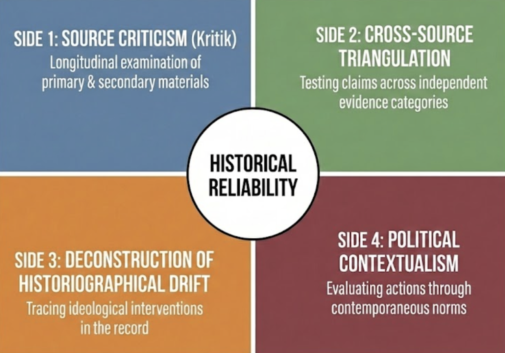
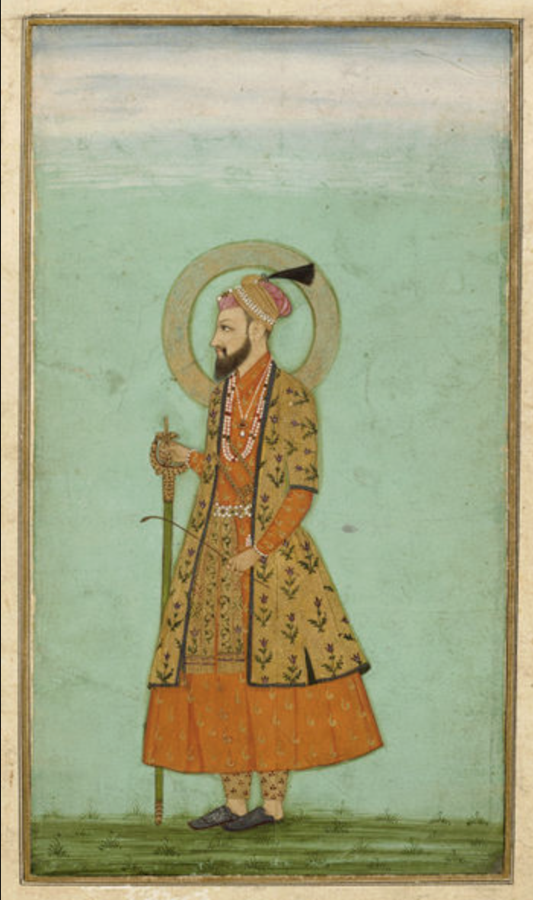
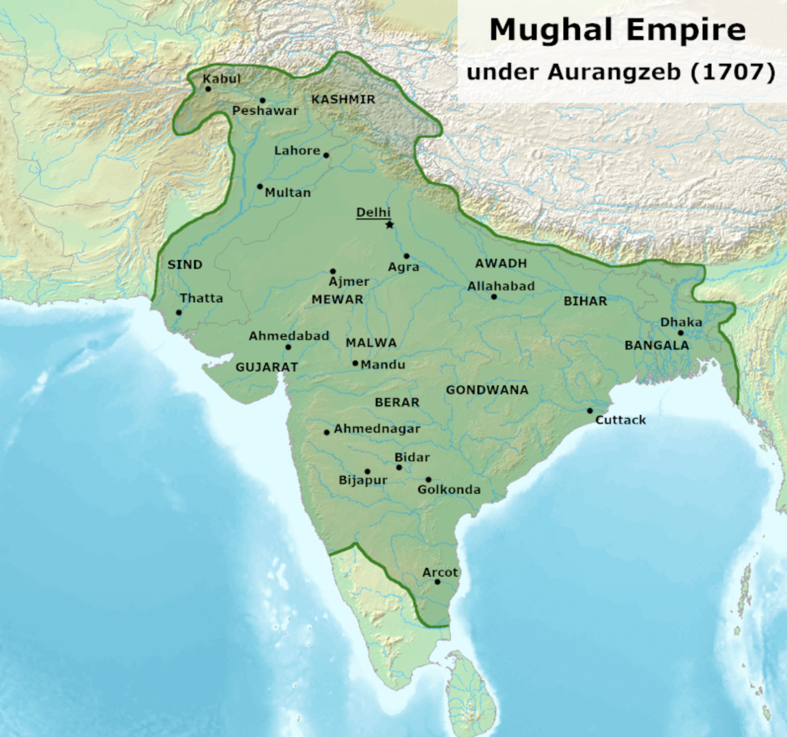
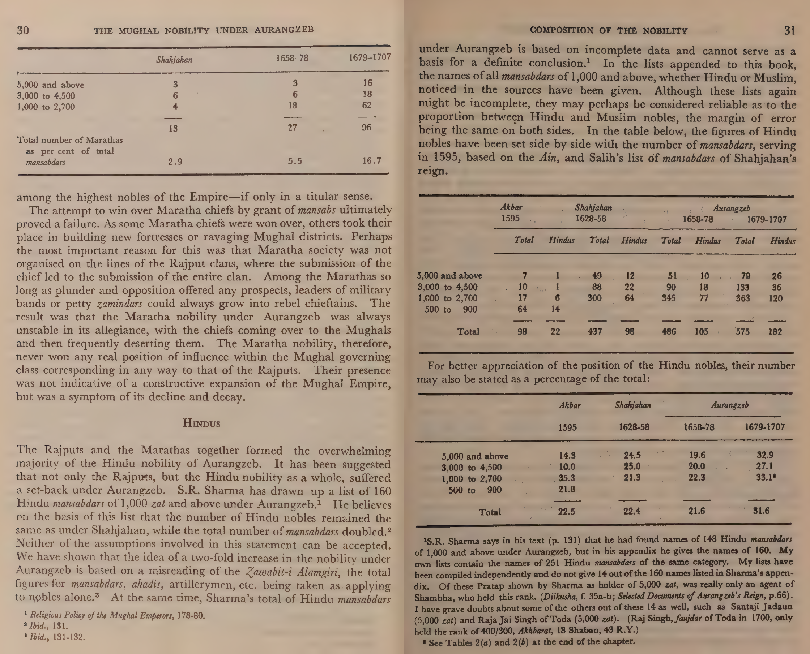
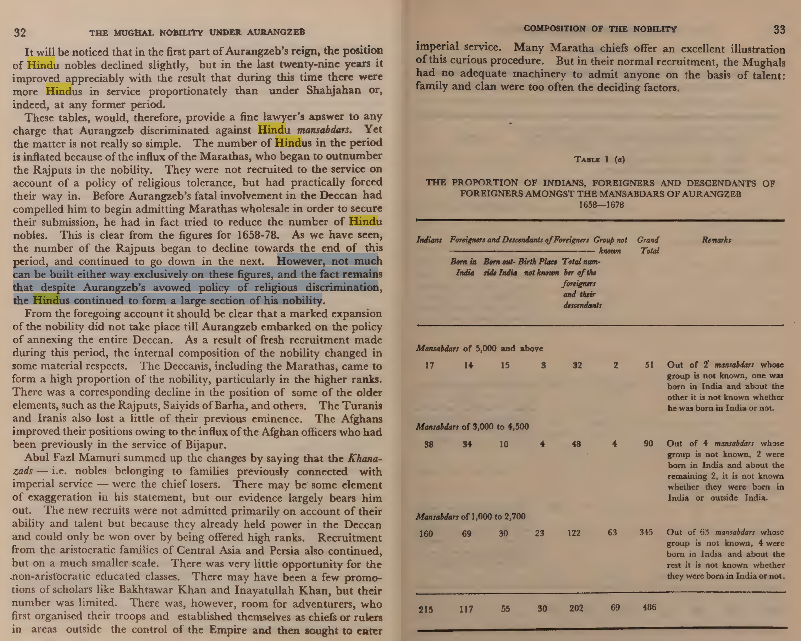

## Introduction: Problem of Reliability

When Aurangzeb died in 1707, contemporary Persian chroniclers and court historians generally portrayed him in laudatory or institutionally conventional terms. Even dissenting voices from the broader period did not typically describe him in the highly mythologized, demonic, or civilizationally apocalyptic language common in modern politics.

This discrepancy raises a core historiographical problem. How did the historical record diverge so dramatically from later public memory? Why does a ruler who governed one of the richest empires in the early modern world now often appear in popular discourse primarily as a symbol of religious persecution? And what does this tell us about Indian historiography more broadly?

This essay approaches these questions through source comparison rather than ideological inheritance. Reliability here means triangulation. When court chronicles, administrative records, memoirs, traveler accounts, and later archival scholarship converge, confidence rises. When they diverge, claims must remain contested rather than treated as settled moral truths.

## Method: How this essay establishes reliability?

To answer these questions, this essay introduces an **Evidence-Based Square** for historical reliability. Claims are classified as **high-confidence**, **moderate**, **contested**, or **unsupported** depending on how they fare across four dimensions. Using Aurangzeb as a case study, this essay argues that historical reliability improves when moral narratives are subordinated to comparative source analysis, and when divergence among sources is treated as evidentiary contestation rather than inherited certainty. In this essay, historical reliability is established through the **Evidence-Based Square**.

### Evidence-Based Square

**Side 1: Source Criticism (Kritik)**  
A longitudinal examination of primary and secondary materials, tracking how the record moves from seventeenth-century Persian manuscripts to modern academic interpretation.

**Side 2: Cross-Source Triangulation (Triangulation)**  
Testing claims across independent categories such as court chronicles, private memoirs, traveler accounts, administrative evidence, and epigraphic or regional material. Reliability rises where convergence appears. Divergence signals contestation.

**Side 3: Deconstruction of Historiographical Change among Writers (Drift)**  
A genealogical tracing of how selective translation, editorial intervention, headings, summaries, and later ideological framing converted administrative records into moralized historical narratives.

**Side 4: Political Contextualism (Context)**  
Evaluating imperial conduct within seventeenth-century norms of sovereignty, law, hierarchy, and order, rather than imposing modern constitutional or communal frameworks anachronistically.

::: {.callout-note}
{fig-alt="How we establish reliability"}
:::

### How This Essay Assesses Sources?

A source is a produced object. It is not the past itself. It is a human artifact generated under specific institutional, political, linguistic, and psychological conditions.

Modern historiography was shaped by Leopold von Ranke’s emphasis on archival inquiry and primary materials, but later historians such as Marc Bloch [@bloch1949] and Lucien Febvre [@febvre1973] broadened the field by reminding us that historical truth is not discovered by naive trust in documents. Sources must be situated, compared, and interrogated. For each source, this essay asks:

- Who produced it?
- For whom was it written?
- Under what constraints?
- With what incentives?
- In what genre?
- Through what transmission history?

Two layers of source criticism are used.

**External criticism** asks whether the document is what it claims to be.  
**Internal criticism** asks how truthful, rhetorical, partial, strategic, or distorted it may be even if authentic.

No source gives pure truth. Historical knowledge is probabilistic. Reliability comes through structured comparison.

### Applicability of Evidence-Based Square:

1. **Source criticism (Kritik)**: examination of genre, production incentives, and authorial constraints  
2. **Cross-source triangulation (Triangulation)**: assessment of convergence with independent source types  
3. **Historiographical mediation (Drift)**: identification of later editorial or interpretive distortions  
4. **Political-institutional contextualization (Context)**: evaluation of compatibility with contemporaneous political norms  

The goal is not to classify every source as simply true or false. The goal is to give the reader a disciplined framework for identifying domains of reliability.

### Formal Model

Formally, for any source `S` and claim `C`, reliability is expressed as:

`R(C | S) = f(K, T, D, Cx)`

Where:

- `K` = genre constraints and production incentives (**Kritik**)
- `T` = convergence with independent source types (**Triangulation**)
- `D` = degree of later editorial or interpretive distortion (**Drift**)
- `Cx` = compatibility with contemporaneous political norms (**Context**)

Using this square, claims can be classified as:

1. **High-confidence** — consistent across all four dimensions  
2. **Moderate** — broadly consistent across three dimensions with limited discrepancy  
3. **Contested** — major divergence in at least two dimensions  
4. **Unsupported** — fails minimum evidentiary standards across multiple dimensions   

In this way, we have an operational way to quantify reliability without reducing it to a binary true/false. 
The Evidence-Based Square allows for nuanced interpretation while maintaining rigorous standards of historical inquiry.

## Aurangzeb in Indian History: Why he is important?

Aurangzeb occupies a central place in Indian history because he ruled during the late high phase of Mughal imperial power. During his period, India remained one of the largest economic zones in the world, supported by textiles, agrarian extraction, artisanal output, and global trade **[@maddison2001]**. Mughal India was not a civilizational ruin waiting for salvation. It was a major imperial formation with fiscal, military, and administrative depth **[@habib1963]**.

Aurangzeb was born in 1618 in Dahod, Gujarat, and died in 1707 in Ahmednagar. His reign saw the Mughal Empire reach its greatest territorial extent **[@richards1993]**. He was tireless in military campaigning, especially in the Deccan, where he spent decades personally directing imperial war.

This is precisely why the later caricature is historically interesting. Immediately after his death, his public image did not resemble the modern political myth **[@khan1710; @khafikhan1732]**. That later transformation requires explanation. Aurangzeb died on March 3, 1707 in Ahmednagar at age 88.

::: {.callout-note}

{fig-alt="Aurangzeb Emperor" fig-width=6 fig-height=2 width=50%}

:::

::: {.callout-note}

{fig-alt="Extent of Mughal Empire under Aurangzeb" width=80% height=600px}

:::

## Political Theory of Mughal Kings

In this section, we step back from the question of Aurangzeb’s personal motives to examine the broader political theory of Mughal kingship. This is important because it provides the institutional and ideological context within which Aurangzeb operated. Understanding Mughal sovereignty helps us interpret his actions without anachronistically imposing modern categories of religious fanaticism or communal conflict.

The Mughal political order was not a modern constitutional state. It was an early modern fiscal-military empire. Its legitimacy did not depend on democratic consent, rights discourse, or modern secular liberalism. Mughal kingship was organized around sovereignty, order, justice, hierarchy, and revenue.

Abu’l-Fazl ibn Mubarak ( 1551 –  1602) was a grand vizier, chief secretary, and confidant of the Mughal emperor Akbar.
He [@abulfazl1590] presents the ruler as the “Shadow of God on Earth,” not in the sense of divinity, but as the earthly guarantor of social and political order. 
The Mughal sovereign existed to secure revenue, maintain roads and trade, regulate elites, prevent disorder, and preserve hierarchy.

This political ethic drew on the broader Persianate **akhlaq** tradition associated with thinkers such as Nasir al-Din al-Tusi [@tusi] and Jalal al-Din Davani [@dawani_akhlaq]. Within that framework, kingship was justified as a moral and political necessity to prevent chaos. Rebellion was not usually treated as legitimate opposition but as a threat to the political order [@alam2004].

This matters for interpreting Aurangzeb. If one reads seventeenth-century Mughal statecraft through twentieth-century communal categories alone, one commits anachronism. 
Aurangzeb must be evaluated within the institutional logic of pre-modern sovereignty, where revenue, rebellion, territorial control, and political hierarchy structured rule more deeply than modern identity politics allows.

## Popular Issues and sources for Aurangzeb's Life

Aurangzeb remains alive in Indian public memory because he is repeatedly used as a political symbol. 
He is invoked in disputes over religion, nationalism, identity, and Mughal legitimacy. 
Many of the most emotionally charged claims about him come from later retellings rather than disciplined source comparison.
He is used as polarized political weapon in Indian political discourse. 
Polarized claims about Aurangzeb's reign persist as contested history, mirrored in political moves like renaming Delhi's Aurangzeb Road to Dr. APJ Abdul Kalam Road.

In this section, We apply the Evidence-Based Square to a few recurring controversies.

#### Fratricide

During the succession struggle after Shah Jahan’s illness, Aurangzeb defeated Dara Shikoh and Murad and later had them executed. This is a real and high-confidence event [@kazim1668; @bernier1670]. But it must be read within the Timurid-Mughal tradition of contested succession. The empire did not operate under a clean law of primogeniture. Imperial inheritance was often violent, and fratricidal succession struggles were not unique to Aurangzeb [@richards1993]

#### Sambhaji (1689)
The execution and torture of Sambhaji is strongly attested across Mughal, Maratha, and European traditions [@khan1710; @manucci1907]. The event itself is high-confidence. The question of motive is more complicated. Retaliation, war logic, and Deccan counterinsurgency are better-supported explanations than simplistic claims of ideological theocracy [@richards1993; @truschke2017]

#### The Satnamis revolt of 1672

Satnamis regarded as a religious sect founded in the mid-17th century in northern India, particularly in the regions of present-day Uttar Pradesh and Madhya Pradesh. The Satnamis rejected caste distinctions and emphasized devotion to a single, formless God. They were often marginalized by both Hindu and Muslim elites. The start of the revolt was when a Mughal soldier was killed or mistreated a Satnami.The Satnami revolt of 1672 is best understood as a localized agrarian and sectarian uprising rather than a civilizational Hindu–Muslim war. Near-contemporary sources describe conflict with Mughal officials, armed mobilization, and violent suppression [@khan1710; @saxena1707]. Later communal framing shows substantial interpretive drift [@habib1963].

#### Execution of Guru Tegh Bahadur

Guru Tegh Bahadur was the ninth of ten gurus who founded the Sikh religion and was the leader of Sikhs. 
The execution of Guru Tegh Bahadur is well attested, there is broad agreement that he was executed on Aurangzeb’s orders in 1675.
But motive of the execution remains contested. Sikh tradition emphasizes martyrdom in defense of conscience and community [@grewal1998]. Mughal political framing emphasizes sedition, unauthorized mobilization, and imperial discipline [@khan1710]. The event is high-confidence; the motive remains contested [@mcleod2004]

#### Jizya Tax Reimposition 1679

Aurangzeb enacted jizyah in 1679 (April 2) with about 22 years service into his rule. 
The text of Fatwa proclaimed by Aurangazeb is rarely read, indicates many exemption for various classes of people, such as those who were indigent, without employment, unable to work on account of poor health. The reimposition of jizya in 1679 occurred after many years of rule and during periods of significant fiscal pressure [@khan1710]. Administrative exemptions limited its reach, and Hindu participation in imperial service remained high [@ali1966]. The later framing of jizya as straightforward proof of systematic forced conversion is not supported by the broader administrative pattern [@chandra2003].

This is compiled from  Fatawa-i-Alamgiri, Jizya chapter (vol. 2:244-245) in the 1973 Beirut edition by Dar al-Ma‘rifah. 

::: {.callout-caution collapse="true"}
#### From Jizya Chapter, Al-Fatawa al-Alamgiriyyah = Al-Fatawa al-Hindiyyah fi Madhhab al-Imam al-A‘zam Abi Hanifah al-Nu‘man (Beirut: Dar al-Ma‘rifah, 1973), 2:244-245

[Jizyah] refers to what is taken from the Dhimmis, according to [what is stated in] al-Nihayah. It is obligatory upon [1] the free, [2] adult members of [those] who are generally fought, [3] who are fully in possession of their mental faculties, and [4] gainfully employed, even if [their] profession is not noble, as is [stated in] al-Sarajiyyah. There are two types of [jizyah]. [The first is] the jizyah that is imposed by treaty or consent, such that it is established in accordance with mutual agreement, according to [what is stated in] al-Kafi. [The amount] does not go above or below [the stipulated] amount, as is stated in al-Nahr al-Fa’iq. [The second type] is the jizyah that the leader imposes when he conquers the unbelievers (kuffar), and [whose amount] he imposes upon the populace in accordance with the amount of property [they own], as in al-Kafi. This is an amount that is pre-established, regardless of whether they agree or disagree, consent to it or not.

The wealthy [are obligated to pay] each year forty-eight dirhams [of a specified weight], payable per month at the rate of 4 dirhams. The next, middle group (wast al-hal) [must pay] twenty-four dirhams, payable per month at the rate of 2 dirhams. The employed poor are obligated to pay twelve dirhams, in each month paying only one dirham, as stipulated in Fath al-Qadir, al-Hidayah, and al-Kafi. [The scholars] address the meaning of “gainfully employed”, and the correct meaning is that it refers to one who has the capacity to work, even if his profession is not noble. The scholars also address the meaning of wealthy, poor, and the middle group. Al-Shaykh al-Imam Abu Ja‘far, may Allah the most high have mercy on him, considered the custom of each region decisive as to whom the people considered in their land to be poor, of the middle group, or rich. This is as such, and it is the most correct view, as stated in al-Muhit. Al-Karakhi says that the poor person is one who owns two hundred dirhams or less, while the middle group owns more than two hundred and up to ten thousand dirhams, and the wealthy [are those] who own more than ten thousand dirhams. The support for this, according to al-Karakhi is provided by the fatawa of Qadi Khan (d. 592/1196). It is necessary that in the case of the employed person, he must have good health for most of the year, as is stated in al-Hidayah. It is mentioned in al-Idah that if a dhimmi is ill for the entire year such that he cannot work and he is well off, he is not obligated to pay the jizyah, and likewise if he is sick for half of the year or more. If he quits his work while having the capacity [to work] he [is still liable] as one gainfully employed, as is [stated in] al-Nihayah. The jizyah accrues, in our opinion, at the beginning of the year, and it is imposed on the People of the Book (whether they are Arab, non-Arab, or Majians) and idol worshippers (‘abdat al-awthan) from among the non-Arabs, as in al-Kafi…The [jizyah] is not imposed on the idol worshippers from among the Arabs or from among the apostates, where they exist. Their women and children [are considered] as part of a single liability group (fi’). [In other words], whoever from among their men do not submit to Islam shall be killed, and no jizyah is imposed upon their women, children, ill persons or the blind, or likewise on the paraplegic, the very old, or on the unemployed poor, as is stated in al-Hidayah.
:::

Many were exempted, such as Women and children, the ill, Blind, paraplegic, very old, unemployed poor and Idol worshippers among Arabs or apostates. 

M. Athar Ali, an Indian historian of medieval Indian history. Aurangzeb pragmatically recruited Hindus especially among Marathas and Rajputs for military survival during endless Deccan wars, even while imposing jizya

::: {.callout-note}

{fig-alt="M. Athar Ali"}
:::

::: {.callout-note}

{fig-alt="Hindu noble participation rose post-1679 jizya "} 
:::

#### Temple Destructions

Temple destruction under Aurangzeb and earlier Muslim rulers followed a consistent medieval pattern: targeting enemy kings' temples as political punishment after conquest, not mass religious erasure [@eaton2000].

Selective temple destruction under Aurangzeb is historically real and high-confidence in certain documented cases, including major temples such as Kashi Vishwanath and Keshavdev [@khan1710]. But the stronger claim of universal or systematic iconoclasm across all Hindu sacred life is not supported by the evidence. Quantitative and contextual studies suggest selectivity, political correlation, and significant later amplification [@eaton2000; @truschke2017]

## Primary sources from Aurangzeb's lifetime

The most reliable way to understand Aurangzeb is to examine sources from or near his own lifetime. 

### Aurangzeb’s own writing

One of the most important windows into Aurangzeb's mind is the **Rukaʿāt-i-Ālamgīrī**, a curated collection of his correspondence. These letters, written to sons, commanders, governors, and court officials, reveal concern with revenue, discipline, military logistics, appointments, punishment, and governance in real time [@alamgiri_letters].

Applied through the Evidence-Based Square, these letters rank high in reliability for administrative mentality and state priorities. 
They are near-contemporary internal documents with limited later interpretive drift.

### Official Court Sources

The first major official account is Muhammad Kazim’s **ʿĀlamgīrnāmah**, written during Aurangzeb's own lifetime [@kazim1668]. Saqi Mustaʿid Khan’s **Maʾās̱ir-i ʿĀlamgīrī** later continues the record [@khan1710]. These works are court chronicles and therefore rhetorically shaped. But they remain crucial for political and administrative fact-patterns.

Their tone is panegyrical, but that does not make them useless. 
The Evidence-Based Square gives them high structural reliability for major political events when triangulated with other materials.

### Ground Level Source

Bhimsen Saxena’s **Tārīkh-i Dilkashā** offers a different perspective [@saxena1707]. As a Hindu participant connected to Mughal Deccan campaigns, he supplies a more ground-level view of corruption, strain, local disorder, and governance failure. He does not narrate the Deccan primarily as a civilizational war between Hindus and Muslims. That absence itself is important evidence.

### European accounts

European travelers provide outside observations, though each comes with genre limitations.

**Niccolao Manucci** is rich in texture and court anecdote, but frequently mixes observation with rumor, dramatization, and personal bias [@manucci1907].
He was a Venetian adventurer and physician who served at the courts of Shah Jahan and Aurangzeb from 1653 to 1708. His *Storia do Mogor* is a valuable source for Mughal court life, but his reliability is compromised by his tendency to sensationalize and his outsider perspective.

**François Bernier** is more analytically focused and gives important reflections on administration, landholding, and imperial structure[@bernier1670]. His portrait of Aurangzeb emphasizes capacity, austerity, administrative rigor, and legal seriousness. He was a French physician who treated Dara Shikoh (1656–58) and returned to the Mughal court (1668–71). His *Travels in the Mogul Empire* provides detailed observations on Mughal governance, but his European background and limited tenure may have influenced his interpretations.

**Jean-Baptiste Tavernier** accounts are highly insightful and reliable for trade, taxation, commercial administration, and imperial order[@tavernier1889]. He is less interested in moral demonization than in how the empire actually functioned. He was a French gem merchant who made six India voyages (1638–49, 1664–67). His *Travels in India* offers insights into Mughal economic and administrative practices, but his focus on commerce may have limited his understanding of broader political dynamics.

These sources are most useful when treated as supplementary and cross-checked rather than as standalone truth.

## Accounts after Aurangzeb death: Earliest Persian critiques

After Aurangzeb's death, critical Persian reflection does emerge, but not yet in the fully communalized form of modern myth.

### Khafi Khan

Khafi Khan, writing after Aurangzeb but before full British political dominance, asks what went wrong during Mughal rule[@khafikhan1732]. His criticism is important because it shows that imperial critique did exist internally. Yet even here the language is not identical to the later civilizational demonology of colonial and nationalist retellings.
The key point is this, early post-Aurangzeb critique does not automatically produce the modern villain. That figure is built later.

## Early English Historians 

### James Mill

James Mill is the most famous historian of British India whose work was influential in shaping early English perceptions of the Mughal period.
His work went through multiple editions, with the first published in 1817 **[@mill1817]**. It was widely read and became a standard reference for British understanding of Indian history during the colonial period. 

James Mill (1773–1836) never traveled to India and knew none of the Indian languages. In this way, he put himself as neural observor and objective historian. 
He produced the famous *The History of British India* **[@mill1817]**, in which he divided Indian history into Hindu, Muslim, and British periods.

Mill does not portray Aurangzeb as uniquely fanatical. Rather, he places him within a broader “Muslim period” characterized, in Mill’s scheme, by despotism and stagnation. This suggests that the specific Aurangzeb-as-religious-villain narrative was not an original English consensus but a later historiographical construction.

Applied through the Evidence-Based Square, Mill is low reliability for historical interpretation and motive analysis. 
He is best treated as a system-level theorist of “oriental despotism,” not a reliable source on Aurangzeb’s policies or intentions.

### Francis Gladwin

Francis Gladwin (1745–1813) was a Persian scholar and East India Company officer who translated the *Ain-i-Akbari* and published *The History of Hindostan, During the Reigns of Jehangir, Shahjehan, and Aurangzeb* **[@abulfazl1590]**.

Gladwin worked from Persian manuscripts and provides moderate reliability for political and administrative facts but limited reliability for motive attribution. His work exhibits orientalist framing in the preface that contrasts Akbar’s tolerance with Aurangzeb’s coercion.

### James Talboys Wheeler

James Talboys Wheeler was a bureaucrat-historian of the British Raj and professor at Madras Presidency College. 
He published *The History of India: From the Earliest Ages to the Present Time* in multiple volumes between 1867 and 1881 **[@wheeler1867india]**. In his treatment of Aurangzeb, Wheeler emphasizes religious bigotry as a central cause of Mughal decline, portraying Aurangzeb as a fanatic whose policies alienated Hindu elites and provoked rebellion.

Wheeler foregrounded religious bigotry as a central cause of Mughal decline. Applied through the Evidence-Based Square, his work indicates low reliability for causal interpretation and is best treated as an English narrative consolidator of the Aurangzeb as a bigot thesis.

## Late English Historians

### Vincent A. Smith

Vincent Arthur Smith (1843–1920), an Irish historian and member of the Indian Civil Service, published *The Oxford History of India* around 1919–1920 **[@smith1919]**. His treatment of Aurangzeb reproduces and intensifies the moralized English narrative of systematic religious persecution.

Applied through the Evidence-Based Square, Smith represents a consolidation of the English “religious villain” tradition, not high-confidence historical evidence for Aurangzeb’s governing motives or state policy.

### Stanley Lane-Poole

Stanley Lane-Poole (1854–1931) published *Aurangzeb and the Decay of the Mughal Empire* **[@lanepoole1893]**. He argued that Aurangzeb’s policies, especially the reversal of Akbar’s tolerant approach, were a primary cause of Mughal decline.

Applied through the Evidence-Based Square, Lane-Poole is low reliability for causal interpretation. He is best treated as an English moral interpreter of decline, not a high-confidence authority on Aurangzeb’s policies or motivations.

### William Irvine: Late English Archival Historian

William Irvine (1840–1911) was a British civil servant and historian specializing in Mughal administration. Unlike Dow or Lane-Poole, Irvine worked extensively with Persian archival material and Mughal court chronicles **[@irvine1922]**. He also edited Manucci’s *Storia do Mogor* **[@manucci1907]**.

Irvine approached Aurangzeb less as a moral symbol and more as an administrator governing an overextended imperial system. He emphasized Aurangzeb’s laborious, methodical, frugal, and austere character while arguing that it was incorrect to reduce the emperor’s policy solely to religious bigotry.

Applied through the Evidence-Based Square, Irvine indicates high reliability for administrative and structural analysis. His portrayal of Aurangzeb as an austere, methodical ruler constrained by institutional limits qualifies as high-confidence historical interpretation.

## Early Indian Nationalist Historians: The Reversal of Villains

A similar narrative pattern appears in Indian nationalist economic history of the late nineteenth and early twentieth centuries. Writers such as Dadabhai Naoroji **[@naoroji1901poverty]** and R. C. Dutt **[@dutt1902economic]** recast British rule as the principal cause of India’s decline, most notably through the "drain of wealth" thesis and analyses of English rule deindustrializing India **[@naoroji1901poverty; @dutt1902economic]**.

In this reversal, the moral roles shift, where English historians had emphasized Muhammadan despotism **[@mill1817; @smith1919]**, nationalist historians identified British exploitation as the central historical crime. Yet the underlying structure of explanation remains the same. 
the identity of the villain just shifted from the "Muslim Despot" to the "British Exploiter."Complex historical processes are reduced to a single dominant villain. Applied through the Evidence-Based Square, these works represent a critical **Drift** in historiography where economic data was used to construct a counter-polemic against the colonial "civilizing mission" narrative.

## Paratext and the Making of a Villain by Jadunath Sarkar

Sir Jadunath Sarkar (1870–1958) was a prolific Indian historian who worked tirelessly on gathering evidence and collecting primary sources **[@sarkar1912]**. Few Indian historians of the early twentieth century matched his archival energy, linguistic competence, or sheer productivity. He travelled extensively, often by foot or third-class train, to locate historical sites and documents. Over his lifetime, he produced more than twenty major volumes on Mughal and Maratha history. Many remain indispensable repositories of translated documents and narrative detail. His prose is vivid, confident, and accessible, and his command of Persian chronicles was exceptional for his generation.

::: {.callout-note}
## Figure: Portrait of Jadunath Sarkar
{fig-alt="Jadunath" width="50%"}
:::

### Jadunath Sarkar’s Method

The issue with Jadunath Sarkar’s method is not primarily with his industry or his access to sources. The primary issue is with how meaning is imposed on those sources through paratext: chapter titles, thematic framing, headings, summaries, and moral judgments that guide the reader before the evidence is examined. In Sarkar’s hands, paratext does not merely organize material; it frequently pre-interprets it.

Chapter titles like “MATHURA HINDUS OPPRESSED,” “Hindu Reaction,” and “Islamic State Church,” together with assertions such as “The Muslim State is a theocracy, hence toleration is impossible,” function as preloaded moral verdicts **[@sarkar1912]**.

::: {.callout-note}
## Figure: In this paratext title, Sarkar frames Islam as inheritently intolerant and oppressive, and Hinduism as inherently victimized and reactive. This framing is not derived from the evidence but is imposed on it.
{fig-alt="Jadunath" width="80%"}
:::

Sarkar’s reliance on his own English translations of Persian terms often flattened the nuanced vocabulary of Mughal 'Siyasat' (statecraft) into the modern English 'persecution,' a clear instance of linguistic Drift. This choice of translation is not neutral; it carries connotations that shape the reader’s moral interpretation of events. For example, translating 'Siyasat' as 'persecution' rather than 'state policy' or 'political strategy' imposes a modern moral framework onto a term that in its original context had a broader range of meanings related to governance and power dynamics **[@khan1710]**.

Sarkar inserted themes that do not correctly match the *Maʾasir-i ʿAlamgiri* translation **[@khan1710]**. For example, *Maʾasir-i ʿAlamgiri*, compiled in 1710 by Mustaʿid Khan, is a courtly text full of praise. Yet Sarkar uses the same source and creates an image of religious bigotry. This claim is not derived from any single Mughal document but appears as an interpretive axiom placed before the presentation of administrative evidence.

::: {.callout-note}
## Figure: In Mughal times, clearly Hinduism was not a monolithic category, and many Sikhs were not Hindus. Yet Sarkar’s chapter title “Hindu Reaction” frames the conflict in communal terms that do not match the political reality of the time.
{fig-alt="Jadunath" width="90%"}
:::

*Maʾasir-i ʿAlamgiri* does not present Aurangzeb as uniquely cruel, fanatical, or driven by systematic hatred toward Hindus, nor does it portray the Mughal state as an ideologically rigid theocracy **[@khan1710]**. On the contrary, it documents Hindu nobles holding mansabs, temple endowments being renewed in some regions, and pragmatic political alliances. Sarkar’s claim that the Mughal state was structurally theocratic is therefore untenable in light of revenue records showing sustained Hindu participation at senior administrative levels **[@ali1966]**.

Muzaffar Alam and Sanjay Subrahmanyam note that Sarkar often converted political conflicts, especially those involving Rajput or temple-linked elites, into communal narratives by his choice of chapter structure and vocabulary **[@alamsubrahmanyam2012]**. The distortion here is not simply mistranslation from Persian text, but macro-framing: how evidence is grouped and morally summarized.

::: {.callout-note}
## Figure: One can call this as War of Rajputs. 
{fig-alt="Jadunath" width="90%"}
:::

In other words, Sarkar’s paratext can become an interpretive machine that manufactures a more uniformly negative Aurangzeb. For this reason, Sarkar’s moral framing is methodologically unreliable and historiographically contested.

::: {.callout-note}
## Figure: Sarkar says, MATHURA HINDUS OPPRESSED. But the evidence shows that the conflict was between Aurangzeb and the Rajput rulers of Mathura, who were not necessarily representative of all Hindus, and that many local Hindu elites continued to serve in the Mughal administration.

{fig-alt="Jadunath" width="90%"}
:::

### Methodological Critique of Sarkar’s *History of Aurangzeb*

R. C. Majumdar admired Sarkar’s archival labour **[@majumdar1970]**. 
S. R. Sharma criticized Sarkar for reducing complex fiscal and military conflicts to religious causation and for treating Mughal chronicles as transparent fact rather than rhetorical court documents **[@sharma1940]**.

**Summary of issues:**

1. **Misleading chapter titles**: “Hindu Reaction” mischaracterizes what was a political conflict between Aurangzeb and Rajput rulers over territory. The chapter also includes Sikhs, who do not identify as Hindus **[@grewal1998]**.
2. **Unsupported absolute claims**: The assertion that “the Muslim State is a theocracy, hence toleration is impossible” contradicts administrative evidence: Jesuit missionaries visited the Mughal court, Hindu nobles held mansabs, and temple endowments were renewed in multiple regions **[@ali1966; @truschke2017]**.
3. **Loaded language**: Terms like “robbers,” “blackmail,” and “servile” transform legitimate state practices into criminality, substituting political analysis with moral condemnation.
4. **Source bias**: Sarkar relies heavily on English gazetteers and romanticized accounts like James Tod while treating Mughal chronicles uncritically and ignoring revenue records documenting sustained Hindu participation at senior administrative levels **[@ali1966]**.
5. **Unsubstantiated core claims**: The assertion that Aurangzeb pursued “forcible conversion of the Hindus” lacks documentary evidence and converts a complex succession crisis into a teleological narrative of communal conquest **[@chandra2003]**.

Applied to Sarkar’s *History of Aurangzeb* [@sarkar1912], the Evidence-Based Square indicates a clear bifurcation of reliability. While the text demonstrates high reliability for chronological and geographical data, it exhibits low reliability for motive attribution and causal framing. Consequently, Sarkar should not be dismissed, but rather utilized as a foundational translator and compiler of Mughal records. However, as a historical interpreter, he remains methodologically compromised, his extensive use of ideological paratext materially engineered the modern image of Aurangzeb as a religious villain

### Counter-Refutation of objections

To ensure historical reliability, this essay engages with major historiographical objections, especially from nationalist and Hindutva-aligned critics, and answers them using contextual and material evidence grounded in the Evidence-Based Square.

1. **Temple destruction and the “apologist” charge**. 
Critics’ view: Aurangzeb's 1669 order to demolish temples proves a religious motive and reflects deep Hindu trauma. 

**Refutation**: the April 1669 decree targeted specific centers such as Thatta, Multan, and Benares teaching “false books,” not a universal proscription **[@eaton2000]**. Richard Eaton’s mapping and architectural evidence show selectivity. Correlation with local rebellions suggests political reprisals, not theological purges **[@eaton2019; @truschke2017]**.

2. **Jadunath Sarkar’s method and theocracy thesis**. 
Critics’ view: downplaying Sarkar’s reading of an Islamic theocracy ignores his linguistic expertise and archival labor. 

**Refutation**: empirical data contradict Sarkar’s conclusion. As M. Athar Ali documents, Hindu mansabdars increased from 22.5% under Shah Jahan to 31.6% under Aurangzeb **[@ali1966]**. Aurangzeb's wars against Bijapur and Golconda, both Muslim states, reveal a political rather than confessional logic **[@richards1993]**.

3. **Sikh martyrdom and Guru Tegh Bahadur**. 
Critics’ view: using Persian chronicles invalidates Sikh tradition, which views the Guru’s execution as a defense of faith and conscience. 

**Refutation**: Mughal and Sikh narratives embody different truths. Persian sources describe sedition and political mobilization **[@khan1710]**, whereas Sikh texts preserve spiritual testimony **[@grewal1998]**. Triangulated analysis suggests that Aurangzeb's motive reflected *siyasat* (state discipline) more than *shariʿa* coercion **[@mcleod2004]**.

4. **The jizya and religious bigotry**. 
Critics’ view: reimposing jizya in 1679 marks Aurangzeb's intent to Islamize the state.

**Refutation**: the twenty-one-year delay undermines the claim of innate bigotry. Fiscal and political motives during the Rathor rebellion and Deccan wars are contextually stronger **[@chandra2003]**, while exemptions for loyal Hindu allies indicate that political allegiance often outweighed religious identity **[@ali1966]**.

### Mini-demo: How the Evidence-Based Square classifies a claim?

**Claim (popular):** Aurangzeb pursued systematic forcible conversion.”

* **Kritik**: Court chronicles **[@kazim1668; @khan1710]** and letters **[@alamgiri_letters]** are rhetorical genres, they must be treated as interested texts, not raw facts.
* **Triangulation**: Compare imperial correspondence, court chronicle narrative, and regional memoirs/travel accounts **[@saxena1707; @manucci1907]**.
* **Drift**: Watch for later headings and paratext that convert political conflict into communal narrative **[@elliot1867; @sarkar1912]**.
* **Context**: Evaluate policies within seventeenth-century statecraft: revenue, rebellion control, and legitimacy bargaining **[@habib1963; @richards1993]**.

**Classification**: **Highly Exaggerated**. Evidence shows strong state coercion in multiple domains, but systematic conversion is not consistently supported across independent source types **[@truschke2017; @chandra2003]**.

## Modern Scholarly Works

An important contribution to the historiographical analysis of Aurangzeb is Saleem Khan’s 1998 work at SOAS, London. 
Khan examines the wide variance in modern scholarly portrayals of Aurangzeb, with particular attention to British writers and nationalist history writing.

::: {#fig-pdfs layout-ncol=2}
{width=640px height=480px}
:::

Rather than advancing a wholly new interpretation of Aurangzeb's reign, Khan’s contribution lies in historiographical diagnosis. Through comparative reading of contemporary Mughal sources alongside British historians and later nationalist scholars, he shows that the most extreme claims about **Aurangzeb's alleged religious fanaticism do not arise directly from seventeenth-century evidence.** Instead, they emerge through interpretive frameworks, selective emphasis, and narrative aggregation introduced in later historical writing.

Khan does not deny specific events such as temple destruction or the reimposition of jizya. Rather, he shows that extreme claims emerge not from contemporary evidence, but from later interpretive frameworks. This essay treats Khan’s observations as a test case by re-evaluating them using an explicit reliability framework based on Kritik, Triangulation, Drift, and Context. The result is not a moral rehabilitation, but a calibrated reassessment of claim reliability.

### Naveen Kanalu Ramamurthy’s PhD Dissertation on Imperial Governance in the Mughal World of Legal Normativism

Rather than offering a biographical or moral assessment of Aurangzeb Alamgir, Ramamurthy undertakes a structural analysis of Mughal sovereignty, reconstructing how imperial governance functioned through law, administration, and political economy in the late seventeenth and early eighteenth centuries.

::: {#fig-pdfs layout-ncol=2}
{width=640px height=480px}
:::

Ramamurthy reconstructs Mughal governance as a normatively layered legal and institutional order. 
He challenges narratives of Aurangzeb's rule as simplistic "Muslim orthodoxy," arguing instead for a "legal normativism" where Hindus faced less state control in social matters than Muslims, fostering legal subjectivity across castes. Mughal legal culture proved highly resilient, influencing post-Mughal polities and early British East India Company governance amid empire collapse. Sovereignty emerges as a juridical-financial elite-governed relation, not king-centric or purely pluralistic, with parallels to Ottoman systems

When evaluated through the Evidence-Based Square, his findings strongly reinforce the Context and Kritik dimensions. His analysis demonstrates that Mughal governance operated through differentiated legal registers, treating religious communities autonomously in personal affairs while maintaining legal equality in public and fiscal life. By contrast, interpretations emphasizing legal normativism, fiscal-juridical integration, and state capacity show high contextual fit and convergence across independent source types.

## Conclusion

Indian history becomes reliable when claims about the past are grounded in triangulation across independent contemporary sources, interpreted within their political and institutional context, and analytically separated from later ideological framing. Aurangzeb's case demonstrates that reliability collapses when source comparison is displaced by moral narrative, selective quotation, and paratextual pre-interpretation.

Where Persian court chronicles, administrative records, memoirs, and near-contemporary travel accounts converge, historical confidence increases; where they diverge, interpretations must remain probabilistic and contested rather than elevated into civilizational certainties.

Across imperial correspondence, official chronicles, participant memoirs, and early European observers, the strongest convergence concerns the structural logic of Mughal rule: fiscal extraction, military logistics, patronage management, frontier warfare, and rebellion control. By contrast, the modern thesis of Aurangzeb as a uniquely religious villain exhibits the inverse reliability profile. It depends disproportionately on late English syntheses and nationalist paratext, amplifies selective episodes into monocausal explanations, and repeatedly violates contextual constraints by projecting modern communal categories onto early-modern sovereignty.

The widening gap between seventeenth-century documentation and contemporary political memory is therefore best explained as historiographical drift: the cumulative effect of selection, translation, editorial framing, periodization, and moral abstraction, rather than the result of new primary evidence.

The broader implication is methodological. Historical reliability increases when propositions are classified by cross-source convergence and when evidentiary divergence is preserved as analytical uncertainty rather than resolved through inherited narrative templates. Aurangzeb functions in this study not merely as a controversial ruler, but as a diagnostic case through which the mechanisms of reliability and distortion in Indian historiography become empirically visible. In modern political discourse, he remains among the most contested figures of India’s early modern past: vilified within Hindu nationalist memory, defended as an imperial consolidator in secular historiography, and celebrated in Pakistan as an Islamic sovereign. The divergence of these reputations is itself a final demonstration of the central thesis of this essay: historical meaning is not discovered solely in archives, but constructed through the epistemic practices by which sources are selected, framed, and interpreted.

## List of all Sources

:::{#refs}

:::