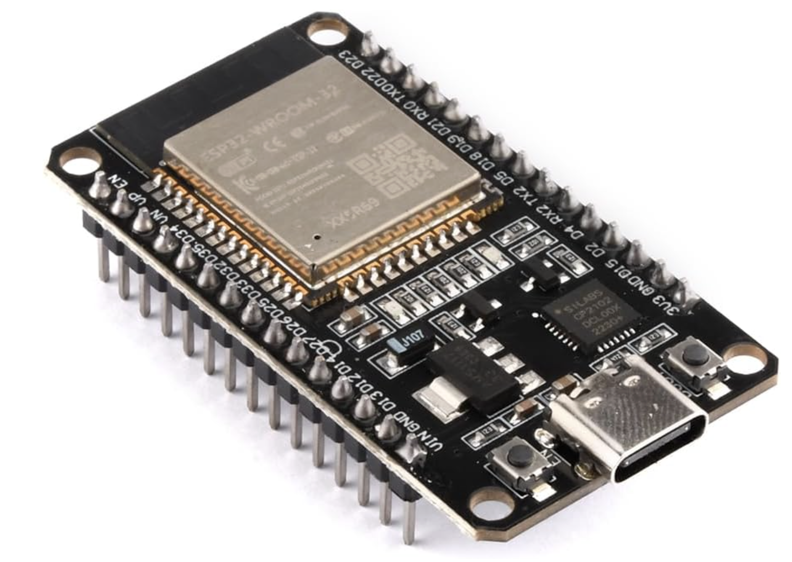
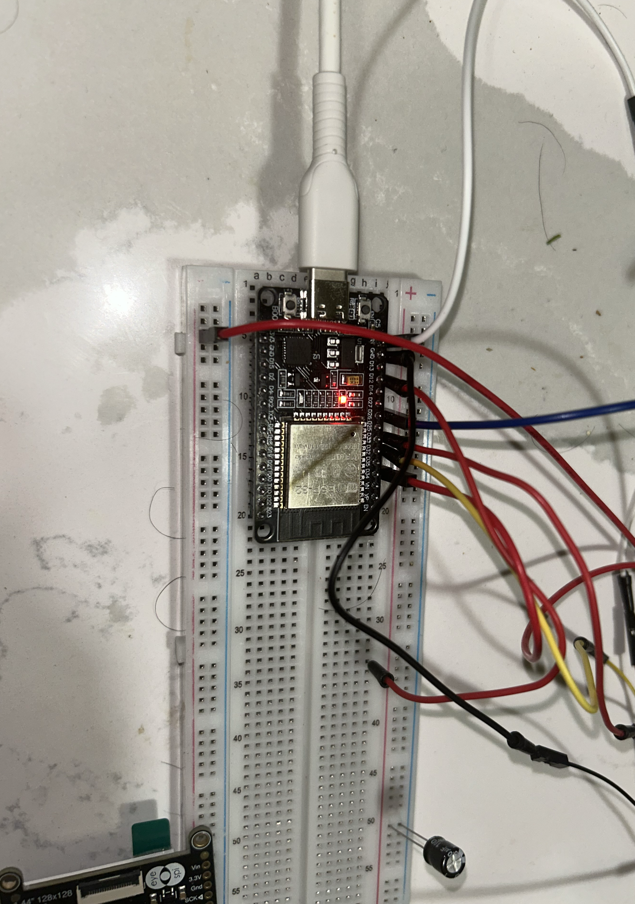
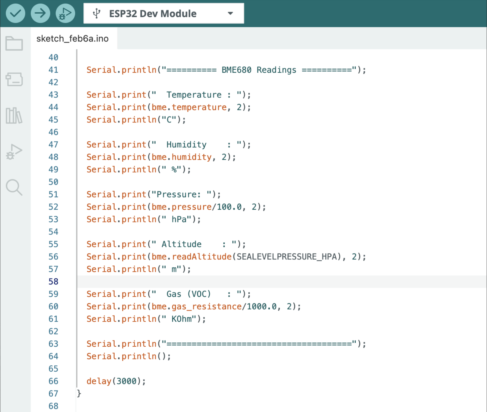
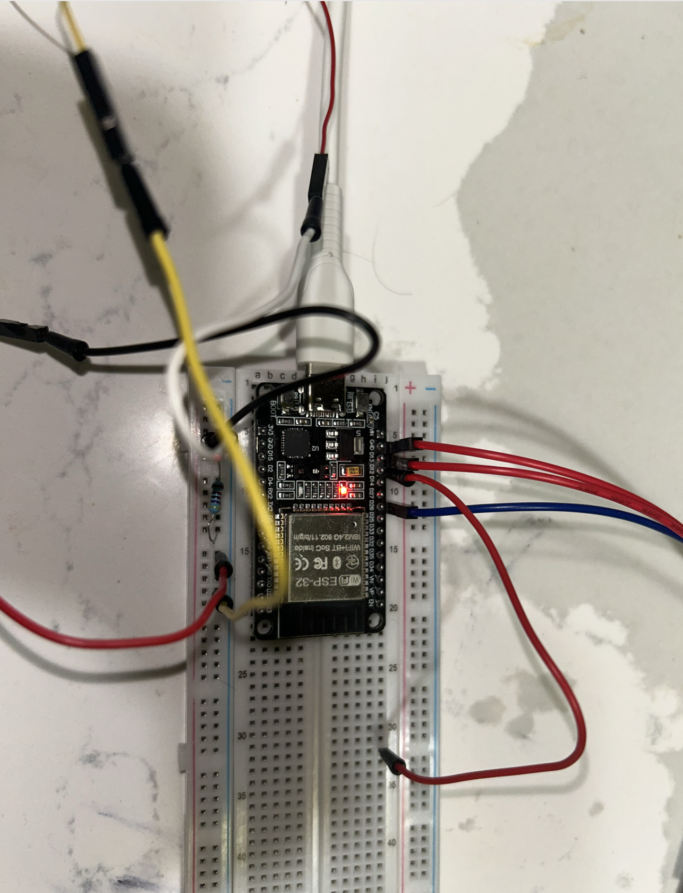
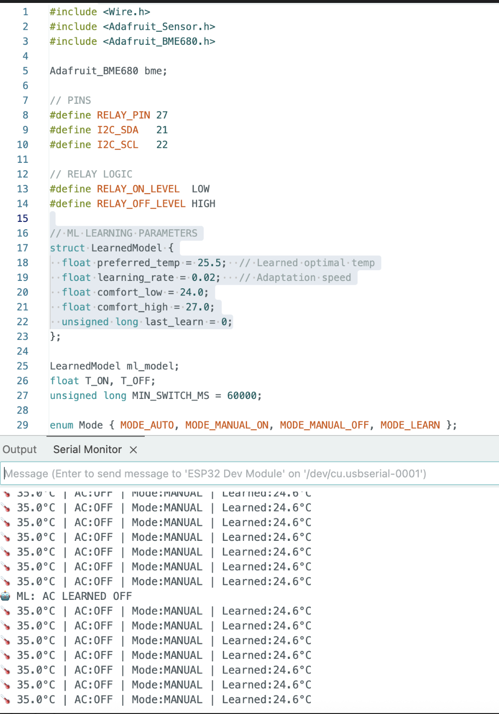

In this tutorial, I share how to build a Microcontroller Relay and Temperature Sensor. For Hardware and Software, you will need the pre-requiste components. Most of these can be bought online or local electronics store.

## Objective

1. To show how to control a relay
2. How to read temperature using an ESP32 and BME680 sensor

## Components required

1. ESP32-C Dev-Board
2. Breadboard
3. Jumper Cables
4. USB-C Cable
5. Songle Relay 5V (Inland)
6. BME680
7. Arduino IDE (Software)
8. Install dependency libraries in IDE

In implementing this project, I am reminded of Professor Poovammal who taught Computer Architecture class for my undergrad-engineering. The class was most engaging and allowed me to understand Computer Architecture. Few years later, Code written by Charles Petzold book allowed me to understand from bottom-up method from zero to one to web browsers on how computers work.

My recommendation is to always use technical textbook or original patent work for defining and understanding. There are many blogs which has easier ways to understand and describing. It’s best to understand from original works. The reason is you will become comfortable in understanding technical domain. It’s highly important as an Engineer or Scientist, you’d need to become familiar with newer domains.

## Conceptual background

### Micro-controller

A microcontroller is a complete computer on a single chip.

For defintion, We refer Paul Scherz and Simon Monk’s *Practical Electronics for Inventors*. In Chapter 13, Micro-controllers, the authors state:

> The microcontroller is essentially a computer on a chip. It contains a processing unit, ROM, RAM, serial communications ports, ADCs, and so on. In essence, a microcontroller is a computer, but without the monitor, keyboard, and mouse. These devices are called microcontrollers.

For this Tutorial, We use ESP32, dev-kit with Type-C. ESP32 is an accessible micro-controller with Wifi, Bluetooth features.



### Relay

Relays are like switches, which we can use for remote control. We use Inland Single 5V Relay Module for Arduino available from local electronics store as Micro-Center. Our module uses SONGLE 5v high-quality relay. It can also be used to control lighting, electrical and other equipment. The modular design makes it easy to expand with the ESP32. The relay output is by a light-emitting diode.


### Breadboard

`US Patent D228136 (1971) by Ronald J. Portugal (E&L Instruments)` The founding patent of the modern solderless breadboard. Definition: A reusable construction base for prototyping electronic circuits without soldering.

Our breadboard connected on a Type-C with ESP32 along with Dupont wires.

<figure>

<figcaption>Breadboard wiring for ESP32 + BME680 sensor and relay setup.</figcaption>
</figure>

### Jumper Cables

Definition (IEEE/Technical): An electrical wire with a connector or pin at each end used to interconnect components on a breadboard or prototype circuit, without soldering. Also called DuPont wires.

Variants: Male-to-Male, Male-to-Female, Female-to-Female — differentiated by solid (breadboard) or socket (header) tips.

### USB-C Cable

Standard: USB-IF Type-C Specification 1.0 (August 2014), adopted as IEC 62680-1-3 in 2016. Definition: A 24-pin, fully reversible connector and cable assembly specification covering electromechanical performance, device detection, interface configuration, and USB Power Delivery (USB PD). USB-C is a connector standard, not a protocol.

### AdaFruit BME680

Definition: A 4-in-1 MEMS environmental sensor measuring gas (VOCs), humidity, pressure, and temperature. Housed in a 3.0 × 3.0 × 1.0 mm LGA package.

Adafruit BME680 connected to ESP32 on a breadboard with Dupont wires.

<figure>

<figcaption>BME680 environmental sensor module wiring for ESP32 (I²C: VCC-3.3V, GND, SDA-GPIO21, SCL-GPIO22).</figcaption>
</figure>


### Arduino IDE

Definition: A cross-platform Integrated Development Environment (Windows/macOS/Linux) built on the Processing IDE in Java. Features a code editor with syntax highlighting, one-click compile/upload, and a software library derived from the Wiring project supporting C and C++. Programs are called sketches (`.ino` extension).

Source: Arduino Official Documentation


<figure>

<figcaption>Arduino IDE with code, libraries installed (Adafruit BME680, Adafruit Sensor), and sketch ready for BME680 I²C wiring.</figcaption>
</figure>

## Wiring the Circuit

1. Setup the Breadboard
2. Fix the ESP32 dev board to communication lane of Breadboard
3. Connect the ESP32 USB-C to your laptop
4. Install Arduino IDE
5. Use Jumper pins to connect the Relay Module with Breadboard

Once you have this setup, this should be enough to test On/Off of Relay.

::: {#fig-esp32 fig-align="left"}
{width=350 height=450}
:::

## Uploading the Test Code

In the IDE setup this code to check if both works:

```cpp
void setup() {
  Serial.begin(115200);
  delay(500);
  Serial.println("Hello ESP32");
}

void loop() {
  Serial.println("tick");
  delay(1000);
}

After this step, Execute this code in IDE

```cpp
#define RELAY_PIN 25  // Change if using different GPIO

void setup() {
  Serial.begin(115200);
  while (!Serial);
  Serial.println("Relay Sound Test - Listen for clicks!");
  pinMode(RELAY_PIN, OUTPUT);
  digitalWrite(RELAY_PIN, HIGH);  // Relay off initially (no click yet)
  Serial.println("Relay initialized. Toggling every 1 second...");
}

void loop() {
  digitalWrite(RELAY_PIN, LOW);   // Turn relay ON (click)
  Serial.println("Relay ON");
  delay(1000);

  digitalWrite(RELAY_PIN, HIGH);  // Turn relay OFF (click)
  Serial.println("Relay OFF");
  delay(1000);
}
```

This will give output On/OFF and show if your relay works.

# Integrating the BME680 Sensor

Install the required dependent libraries in the Arduino IDE.  
We use the **Adafruit_BME680** library and **Adafruit_Sensor.h** (part of Adafruit Unified Sensor library). [web:1]

## Library Installation

To interface with the BME680 sensor on ESP32, first install the necessary libraries via the Arduino IDE Library Manager:

- Open **Sketch > Include Library > Manage Libraries**.
- Search for **"Adafruit BME680"** and install the library by Adafruit.
- Search for **"Adafruit Unified Sensor"** and install it (provides `Adafruit_Sensor.h`).
- Restart the Arduino IDE after installation. [web:1][web:3]

These libraries handle I²C communication and sensor data parsing for temperature, humidity, pressure, and gas readings.

## Hardware Connections

Connect the BME680 sensor to the ESP32 using custom I²C pins.  
Power the sensor with 3.3V (not 5V, as BME680 is 3.3V compatible). [web:1]

### Pin Assignments

| BME680 Pin | ESP32 Pin | Description          |
|------------|-----------|----------------------|
| VCC        | 3.3V     | Power supply        |
| GND        | GND      | Ground              |
| SDA        | GPIO 33  | I²C Data (SDA_PIN)  |
| SCL        | GPIO 32  | I²C Clock (SCL_PIN) |

### Wiring Diagram

This setup uses I²C protocol on custom pins with 100 kHz speed and address `0x77`.
```{mermaid}
graph TD
    BME_VCC[BME: VCC] --> ESP_3V3[ESP32: 3.3V]
    BME_GND[BME: GND] --> ESP_GND[ESP32: GND]
    BME_SDA[BME: SDA] --> ESP_SDA[ESP32: GPIO33 SDA_PIN]
    BME_SCL[BME: SCL] --> ESP_SCL[ESP32: GPIO32 SCL_PIN]

    style BME_VCC fill:#e1f5fe
    style BME_GND fill:#e1f5fe
    style BME_SDA fill:#e1f5fe
    style BME_SCL fill:#e1f5fe
    style ESP_3V3 fill:#f3e5f5
    style ESP_GND fill:#f3e5f5
    style ESP_SDA fill:#f3e5f5
    style ESP_SCL fill:#f3e5f5
```


### Pin Map

Connect the BME680 sensor to ESP32 using these pin assignments for reliable I²C communication.

| ESP32 Pin     | BME680 Pin | Description      |
|---------------|------------|------------------|
| 3V3           | VIN / VCC  | Power supply     |
| GND           | GND        | Ground           |
| GPIO33 (SDA)  | SDA        | I²C Data line    |
| GPIO32 (SCL)  | SCL        | I²C Clock line   |

**Note:** Use 3.3V only - BME680 is not 5V tolerant.

### ASCII Schematic

```
ESP32 (Dev Board) BME680 Breakout (I²C)
3V3 -------------------------------> VIN / VCC
GND -------------------------------> GND
GPIO33 (SDA) -----------------------> SDA
GPIO32 (SCL) -----------------------> SCL
```

### Expected Output

After successful initialization, the BME680 sensor provides comprehensive environmental readings:
```
BME680 Sensor Readings
Sensor initialized successfully!
========== BME680 Readings ==========
Temperature : 23.45 C
Humidity    : 45.67 %
Pressure    : 1013.25 hPa
Altitude    : 150.23 m
Gas (VOC)   : 25.67 KOhm
```

**Typical parameter ranges:**

- **Temperature**: -40°C to 85°C
- **Humidity**: 0–100% RH
- **Pressure**: 300–1100 hPa
- **Altitude**: Derived from pressure (sea level reference)
- **Gas (VOC)**: Volatile Organic Compounds resistance in kΩ (lower = higher pollution)

This output confirms proper wiring and library operation on your custom I²C pins (GPIO33/32).


We test few more cycles and notice the results from Adafruit BME680. 

<figure>

<figcaption>The figure illustrates real-time BME680 sensor data captured in the Arduino IDE Serial Monitor during evaluation of an elementary machine learning capability</figcaption>
</figure>


## Conclusion

The BME680 readings confirm the sensor is wired and functioning correctly on the ESP32's 
custom I²C pins (GPIO33/GPIO32). The temperature of 23.45°C and humidity of 45.67% RH 
fall comfortably within normal indoor ranges, while the pressure reading of 1013.25 hPa 
places the setup near sea level, consistent with the derived altitude of 150.23 m.

The gas resistance reading of 25.67 kΩ indicates moderate VOC levels in the ambient air. 
It's worth noting that the BME680's gas sensor requires a warm-up period before readings 
stabilize, expect some drift in the first few minutes after powering on, particularly 
on first use.

Overall, this project demonstrates a clean I²C integration between the ESP32 and BME680, 
delivering reliable multi-parameter environmental data over a single two-wire bus. From 
here, the natural next steps are logging readings over time, adding thresholds for alerts, 
or feeding the data into a dashboard for visualization.