In this tutorial, We accomplish two objectives: 

1. To teach the basics of soldering for beginners, including common mistakes and how to fix them
2. To walk through the process of building a simple alarm clock, demonstrating how to apply soldering skills in a real project

## Why Learn Soldering?

*Soldering is a fundamental skill in electronics that allows you to create permanent connections between components and circuit boards. It is essential for building reliable and durable electronic devices, including our simple alarm clock project.* Once you can solder headers, modules, buttons, connectors, and breakout boards reliably, you are no longer just testing ideas. You are beginning to build real hardware.

### Wiring Becomes Complex

As we build more features in breadboard, the wiring becomes more complex. It is easy to lose track of connections, and troubleshooting becomes a nightmare.

{fig-cap="Complex Wiring" width=45%}

At that stage, it becomes easier and more reliable to move the design onto a PCB and solder the components permanently.


## How to Solder?

In this section, I will explain a simple beginner method for soldering using the same tools and modules I used in this project. 
The goal is not just to melt solder onto metal, but to make a clean electrical and mechanical connection between the PCB pad and the component pin. 
For a beginner, the easiest starting point is usually soldering header pins onto a breakout board such as the ST7735 display.

### Components Required for Soldering

Components and tools are the foundation of good soldering. 
A beginner should not expect to achieve good results with a cheap iron, low-quality solder, or no flux. 
The right tools make the process easier to learn and more likely to succeed. I recommend investing in a decent soldering station with temperature control, good quality solder wire (preferably lead-free for safety), rosin flux paste, a brass wool tip cleaner, and desoldering braid for correcting mistakes.

### Soldering Kit

<div class="image-row">

{fig-cap="The Weller soldering station used for this project. A temperature-controlled station makes soldering far easier to learn because the iron maintains stable heat rather than fluctuating unpredictably." width=45%}

{fig-cap="The soldering iron resting in its stand. The stand is not optional decoration; it is a critical safety component that gives the hot iron a secure home whenever it is not in the user’s hand." width=45%}

</div>

<div class="image-row">

{fig-cap="Close-up of the soldering iron tip. The tip is the part that touches the pad and pin, transferring heat into the joint so that solder can flow properly." width=40%}

{fig-cap="Rosin paste flux used in the soldering process. Flux improves wetting, helps solder flow cleanly, and is especially useful when correcting poor joints or soldering headers onto breakout boards." width=40%}

</div>

<div class="image-row">

{fig-cap="Desoldering braid and rework setup near the RTC module. Mistakes are part of electronics work, and braid is one of the most useful tools for removing excess solder and cleaning up bridged joints." width=55%}

{fig-cap="Brass wool cleaner used to clean the soldering tip. Keeping the tip clean is essential because oxidation and burnt residue reduce heat transfer and lead to poor solder joints." width=35%}

</div>

<div class="image-row">

{fig-cap="Solder wire used to create the electrical and mechanical joint between the header pin and the copper pad." width=35%}

{fig-cap="RTC module after soldering. This kind of image is useful for discussing whether the header is aligned well and whether the solder joints are clean, even, and electrically reliable." width=45%}

</div>

The solder wire is the joining material that forms the actual electrical and mechanical bond. 

A beginner should think of it not as glue, but as conductive metal that flows around the heated surfaces and solidifies into the joint. 
The RTC module shown here is a useful example.

### Step 1 Prepare the Soldering Setup

Before touching the board, set up the tools properly.

<div class="image-row">

{fig-cap="A temperature-controlled soldering station makes beginner soldering much easier because the heat stays stable." width=45%}

{fig-cap="The soldering iron should always rest safely in its stand when not in use." width=45%}

</div>

A good beginner setup includes:

- soldering station
- soldering iron
- solder wire
- flux
- brass wool cleaner
- desoldering braid
- the PCB or breakout board
- the component to be soldered

Make sure the board is stable, the iron is hot, and the workspace is clean. Before soldering, set the station to about 615°F (325°C) for lead-free solder. This is a good starting point for most beginner soldering tasks. Too hot can burn the board and components, while too cold can lead to poor joints.

### Step 2 Understand the Iron tip

The tip is the part that transfers heat into the joint.

<figure style="margin-left:0; text-align:left; width:40%;">
  
  <figcaption style="text-align:left;">
    The soldering iron tip is what heats the pad and pin so the solder can flow properly.
  </figcaption>
</figure>

A beginner mistake is to think soldering means putting solder directly onto the tip and dropping it onto the board. That is not the right idea. The correct idea is to use the tip to heat the **pad and the pin together**, and then feed solder into that heated joint.

### Step 3 Keep the tip clean

A dirty tip makes soldering much harder.

{fig-cap="Clean the iron tip often so heat transfer stays strong and predictable." width=35% fig-align="left"}

Before starting, and also between joints, clean the tip in the brass wool. A clean tip transfers heat better and makes cleaner joints.

### Step 4 Use flux when needed

Flux helps solder flow where it should.

{fig-cap="Flux helps the solder wet the pad and pin properly, especially when correcting or reworking joints." width=40% fig-align="left"}

For a beginner, flux is extremely helpful. If the solder is not flowing cleanly, or if a joint looks rough, apply a little flux and try again.

### Step 5 Understand the solder wire

The solder wire is the metal that forms the joint.

{fig-cap="Solder wire is fed into the heated joint to form the electrical and mechanical connection." width=35% fig-align="left"}

The solder is not meant to form a giant blob. You only need enough solder to form a small, neat joint around the component lead and the copper pad.

### Step 6 Start with something simple, such as header pins

One of the easiest beginner soldering tasks is attaching male header pins to a breakout board.

{fig-cap="A loose male header strip before soldering. This is one of the most common first soldering tasks in beginner electronics." width=40% fig-align="left"}

This is a very good beginner exercise because it teaches:

- alignment
- heat control
- solder quantity
- how to inspect a joint

### Step 7 Place the header pins correctly

The easiest way to keep header pins straight is to use a breadboard or the board itself to hold them in position.

{fig-cap="Header Pins on a Breadboard, For Soldering make sure to align them properly." width=45%}

{fig-cap="Header Pin with a BME." width=45%}

Insert the header pins into the board so they pass through the plated holes. Make sure the header is straight before soldering.

### Step 8 Solder one pin first

Before soldering everything, solder only one pin first. 
Keep the temperature at about 615°F (325°C) for lead-free solder.

{fig-cap="A good way to begin is to align the header pins properly and solder one pin first before doing the rest." width=45%}

This is the safest beginner method:

1. Hold the board and header in the correct position
2. Heat one pad and one pin together
3. Feed a small amount of solder into that joint
4. Remove the solder wire
5. Remove the iron
6. Let the joint cool

Then inspect the board. If the header is crooked, reheat that single joint and straighten it. Only after alignment looks good should you solder the remaining pins.

### Step 9 How to Make a Proper Solder Joint

A proper solder joint is made in this order:

1. Touch the iron tip to the **pad and the pin together**
2. Wait briefly so both heat up
3. Feed solder into the joint, not just onto the iron tip
4. Use only a small amount
5. Remove the solder wire first
6. Remove the iron
7. Let the joint cool without movement

This is the most important beginner habit. 
The solder should flow because the metal parts are hot, not because the iron tip alone melted the solder.

### Step 10 Inspect what a good result looks like

A good soldered board looks neat, straight, and mechanically stable.

<div class="image-row">

{fig-cap="A good soldering example. The header is straight and the joints are small, clean, and controlled." width=75%}

{fig-cap="Another good soldering example. Clean joints make the board easier to trust electrically and mechanically." width=85%}

</div>

A good joint usually looks:

- Small
- Smooth
- Clean
- Firmly attached
- Not cracked
- Not blob-like
- Not bridging into the next pin

The main goal is not beauty alone. The goal is a reliable connection.

### Step 11 Fix Mistakes with Desoldering Braid

If too much solder is used, or if two pads become bridged, use desoldering braid.

{fig-cap="Desoldering braid is very useful for correcting excess solder and cleaning bridged joints." width=55% fig-align="left"}

Place the braid on the unwanted solder, then place the iron on top of the braid. The braid will absorb the extra solder. This is one of the most useful recovery tools for beginners.

### Step 12 Simple Beginner Rules

A few simple rules make soldering much easier:

- Keep the tip clean
- Heat the pad and pin together
- Use only enough solder to form a neat joint
- Solder one pin first when alignment matters
- Use flux when the joint looks stubborn
- Inspect every joint before moving on
- Fix mistakes calmly with desoldering braid

### A Poor Soldering Example

One of the most useful ways to learn soldering is to look directly at poor soldering examples and understand why they are poor. 

Many beginners only see the word “bad joint,” but they do not yet know what that means in practice. 
A real example is much more helpful. In the following RTC header soldering photos, the joints are visibly inconsistent. 

Some contain too much solder, some appear rounded and blob-like rather than neatly wetted between the pad and the pin, and some do not inspire confidence in either their mechanical stability or their electrical reliability.

<div class="image-row">

{fig-cap="Poor soldering example on the RTC module. The solder joints are bulky and uneven rather than neat and controlled." width=45%}

{fig-cap="Another view of poor soldering. Excess solder and uneven joint shape make inspection and reliability more difficult." width=45%}

</div>

<div class="image-row">

{fig-cap="A close view showing why beginners must inspect joints carefully. A joint can be electrically questionable even when the board appears assembled." width=45%}

{fig-cap="Poor header soldering often leads to joints that look swollen, inconsistent, and mechanically untrustworthy." width=45%}

</div>

<div class="image-row">

{fig-cap="When too much solder is applied, the joint loses its clean geometry and becomes harder to evaluate." width=45%}

</div>

Poor solder joints usually share a few common traits. They often contain more solder than necessary, which creates large rounded blobs instead of a small clean fillet between the pin and the pad. They may also look dull, rough, or irregular, suggesting that the surfaces were not heated evenly or that the solder did not flow correctly. 

### How to Fix a Poor Solder Joint

The good news is that poor soldering does not mean the board is ruined. 

This is where flux and desoldering braid become extremely important. A small amount of fresh flux helps the solder flow more cleanly when reheating the joint. If there is too much solder, desoldering braid can remove the excess and allow the joint to be rebuilt more neatly. After that, the pin and pad can be reheated together, and a smaller, cleaner amount of solder can be applied. For beginners, the most common causes of poor joints are applying too much solder, not heating the pad and pin together, moving the part before the joint cools, or working with a dirty tip. 

### Good Soldering Example: RTC Module

To understand the difference more clearly, it helps to compare the poor RTC soldering examples with a more acceptable result. In the better result below, the header is straighter, the joints are smaller and more consistent, and the solder appears to form a more controlled connection between each pin and pad. 

{fig-cap="A better RTC soldering result. The goal is not visual perfection, but cleaner geometry, better consistency, and more reliable electrical and mechanical connection." width=45%}

### Good Soldering Example: ST7735 display breakout

The ST7735 display breakout is a very good example of a board that needs clean header soldering. The row of holes along the edge of the module is designed for header pins. If the pins are not soldered straight and cleanly, the display may not fit properly into a breadboard or may have unreliable connections.

<div class="image-row">

{fig-cap="The ST7735 display breakout before header installation. The plated through-holes along the edge are where the header pins must be aligned and soldered." width=95%}

{fig-cap="The display breakout with header pins positioned and soldered cleanly. Proper alignment is one of the most important parts of beginner assembly." width=95%}

</div>

## How to Build a Simple Alarm Clock?

In this section, I will walk through how I designed and built the alarm clock kit step by step. Although the finished device looks simple from the outside, it is actually a small embedded system made from several cooperating parts: a microcontroller, a real-time clock chip, a crystal oscillator, a backup battery holder, a four-digit display, a buzzer, sensors, buttons, resistors, capacitors, and the power input.

### How to design and build the alarm clock from scratch?

1. Define the required features
2. Partition the system into subsystems
3. Choose an RTC-based architecture with MCU control
4. Design stable 5V power
5. Create sensor and button interfaces
6. Drive a multiplexed 4-digit display
7. Add a transistor-driven buzzer path
8. Preserve time with a coin-cell-backed RTC
9. Implement firmware as a state machine
10. Translate the schematic into PCB and enclosure form
11. Validate the product under real use conditions 

### Before You Start

Before soldering anything, it is worth doing three things carefully. First, sort all parts by type and by value. Second, compare each component against the PCB labels. Third, dry fit a few parts into the board without soldering to understand where they go and which parts have polarity or orientation.

For this build, the parts that need the most attention for orientation are:

- D1 diode
- U1 and U2 IC sockets
- C3 electrolytic capacitor
- BT1 battery holder
- DS1 four-digit display
- the two integrated circuits inserted at the very end

By contrast, standard resistors, small ceramic capacitors, the thermistor, and most simple two-lead passive parts do not usually have polarity, though they still need to be placed in the correct board positions.

### Practical Build Order Summary

For quick reference, the assembly order is:

1. Resistors (`R13`, `R14`, `R16`, `R18`, `R19`, `R20`, `R21`)
2. Thermistor (`R17`)
3. Diode (`D1`)
4. IC sockets (`U1`, `U2`)
5. Ceramic capacitors (`C1`, `C2`, `C4`, `C5`)
6. Crystal (`Y2`)
7. Transistor (`Q1`)
8. Photoresistor (`R15`)
9. Electrolytic capacitor (`C3`)
10. DC jack
11. Battery holder (`BT1`)
12. Buzzer (`LS1`)
13. Push buttons (`S1`, `S2`)
14. Four-digit display (`DS1`)
15. Inspect all solder joints
16. Insert ICs
17. Insert coin cell battery
18. Power and test
19. Assemble acrylic enclosure
20. Set time and alarm

### Step 1: Install the resistors

The resistors are a good place to start because they are low-profile and mechanically easy to hold in place. Bend each resistor lead close to the body, place it in the correct pair of holes, push it flush to the board, bend the leads slightly on the back to hold it in position, solder the two leads, and then trim the excess lead length.

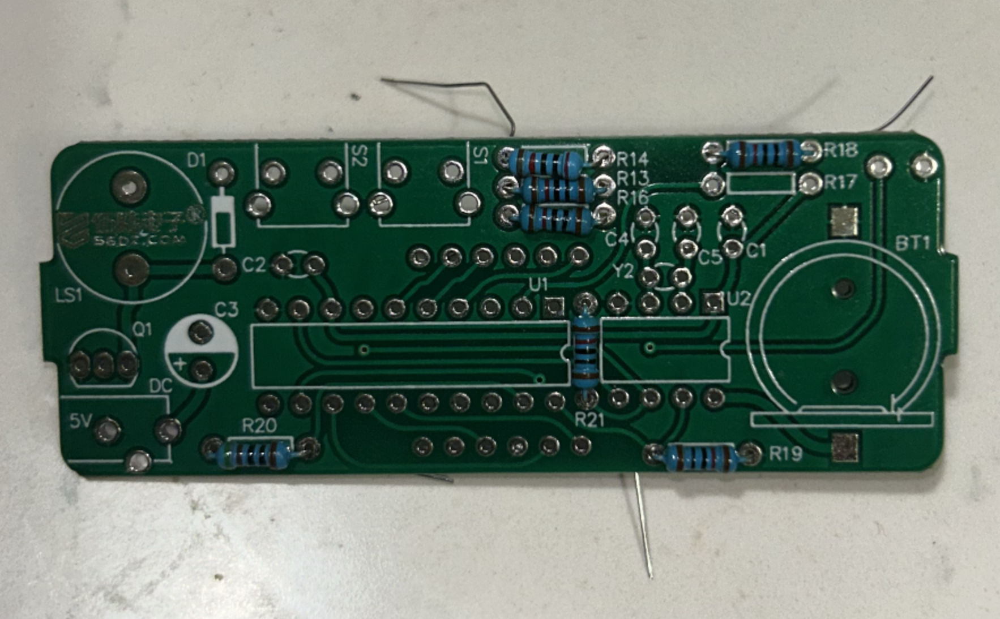{fig-alt="Installing Resistors" width=70% fig-align="left"}

For this clock kit, the resistor positions are:

- `R13`, `R16`, `R18`, `R19`, `R21` → 10 kΩ resistors
- `R14` → 20 kΩ resistor
- `R20` → 510 Ω resistor

Resistors do not have polarity, so electrically they can be inserted either way. However, it is still good practice to align the color bands in a consistent direction, because this makes later inspection easier.

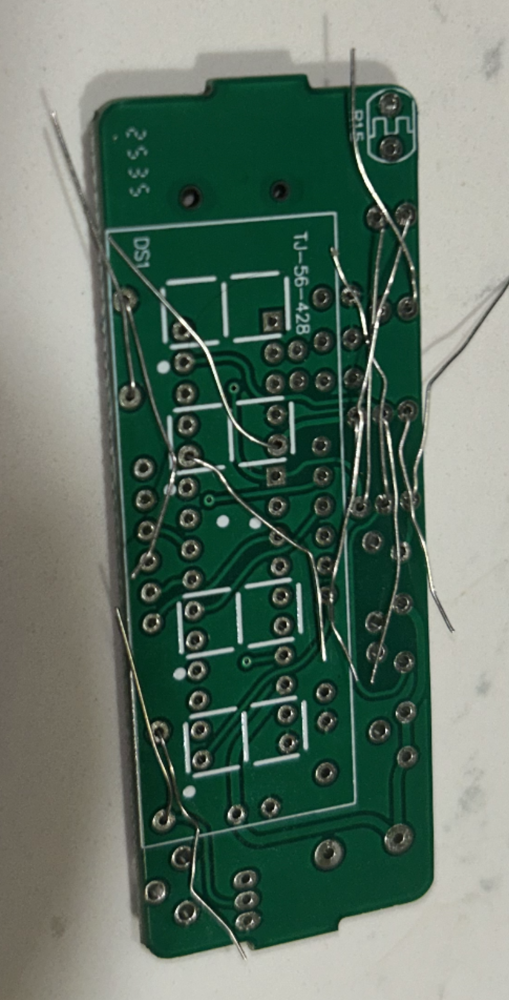{fig-alt="Installing Resistors" width=40% fig-align="left"}

At the beginner level, resistor identification often causes confusion. The easiest practical approach is not to rely only on memory, but to separate the resistors physically before soldering. Put the five 10 kΩ resistors in one group, the single 20 kΩ resistor in another, and the single 510 Ω resistor in another. Once they are grouped, installation becomes much easier.

### Step 2: Install the thermistor

Next, place the thermistor at `R17`. The thermistor is the temperature-sensing component used by the clock to estimate room temperature. In this kit, it behaves like a temperature-dependent resistor. As temperature changes, its resistance changes, and the controller uses that change to estimate temperature.

The thermistor is a two-lead part and usually does not require polarity. Insert it into the holes marked `R17`, solder it, and trim the excess leads.

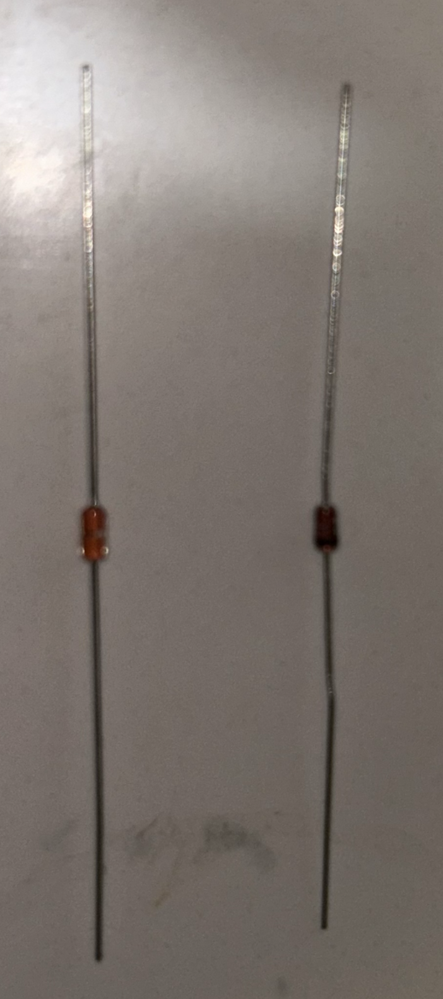{fig-alt="Thermistor and Diode" width=30% fig-align="left"}

Because it is a sensor, it is good to leave it sitting slightly above the PCB rather than pressed tightly against the board. This allows it to respond a little more freely to ambient air temperature instead of being dominated entirely by board temperature.

### Step 3: Install the diode

Now install `D1`, the small signal diode. This part **does have polarity**, so orientation matters.

The diode body has a band on one side, and that band must match the band marking printed on the PCB silkscreen. If the band is reversed, the circuit may not behave correctly. Insert the diode, solder the two leads, and trim them.

This is one of the first places in the build where a beginner should pause and deliberately inspect before soldering. The part may fit physically in both directions, but only one direction is electrically correct.

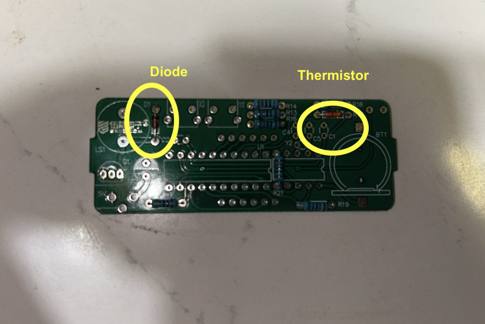{fig-alt="Installing Diode and Thermistor" width=70% fig-align="left"}

### Step 4: Install the IC sockets

The next step is to install the two IC sockets:

- `U1` → DIP-20 socket for the main microcontroller
- `U2` → DIP-8 socket for the RTC chip

These sockets are very important because they allow the integrated circuits to be inserted later without exposing the chips themselves to soldering heat. This is common in beginner kits and is a very good design choice.

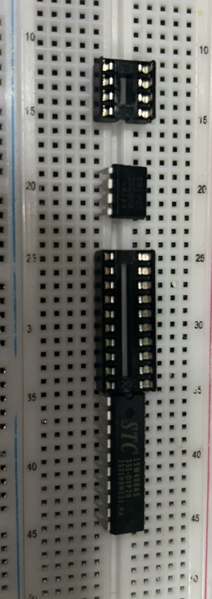{fig-alt="Installing IC Sockets" width=40% fig-align="left"}

Each socket has a **notch** at one end. The notch must align with the notch marking printed on the PCB. Insert both sockets carefully, hold them flat against the board, solder one pin first, check that the socket is seated straight, and then solder the remaining pins.

A good beginner trick is to solder one corner pin first, inspect alignment, and only then continue. If the socket is crooked, it is much easier to fix after one pin than after all pins have been soldered.

### Step 5: Install the small ceramic capacitors

Now install the four small ceramic capacitors. In this kit, there are two different kinds:

- `C1`, `C2` → the two capacitors marked `104`
- `C4`, `C5` → the two smaller capacitors marked `22`

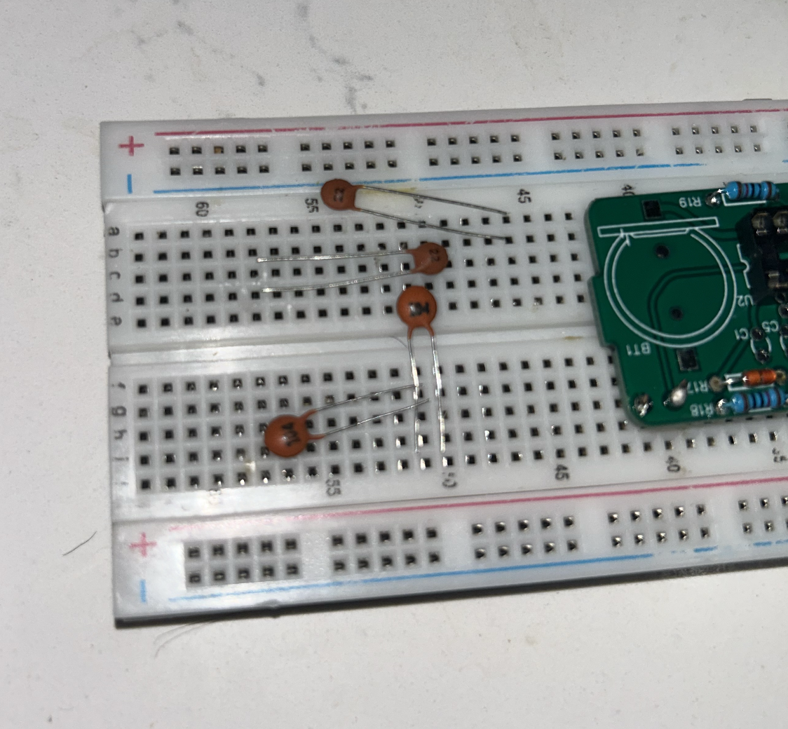{fig-alt="Installing Ceramic Capacitors" width=70% fig-align="left"}

These small capacitors do not have polarity, so they can be inserted either way. Their job is different depending on location. The `104` capacitors are typically used for decoupling and local power stabilization, while the small `22` capacitors support the crystal timing section.

Insert each capacitor into the correct location, solder it, and trim the leads. Since these are also low-profile parts, it is efficient to install them before moving on to taller components.

### Step 6: Install the crystal oscillator

Install the `Y2` crystal oscillator next. This is the 32.768 kHz crystal that provides a stable reference for the real-time clock chip. It is one of the parts that allows the alarm clock to keep proper time instead of drifting randomly.

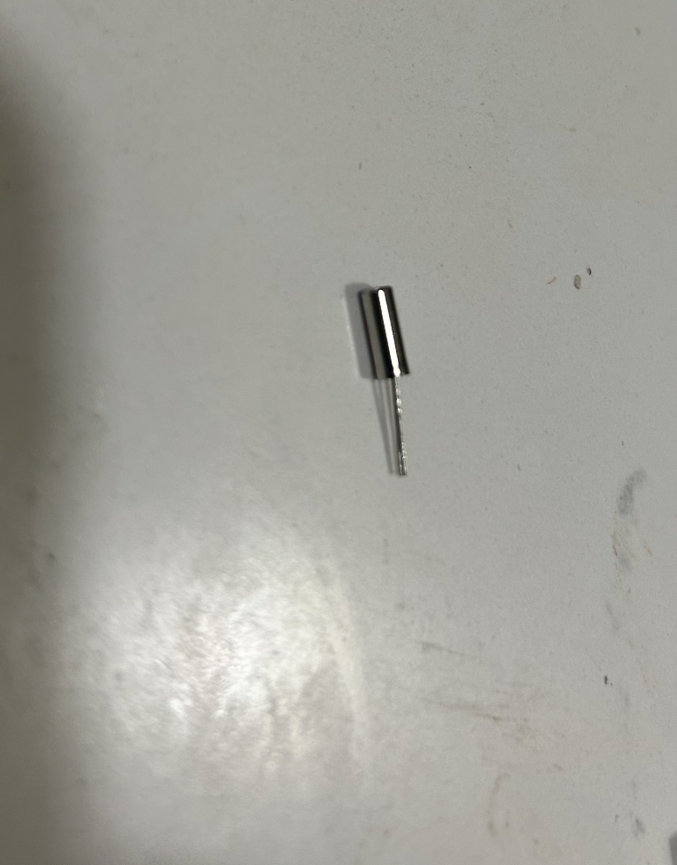{fig-alt="Crystal Oscillator" width=40% fig-align="left"}

The crystal does not normally have polarity. Place it in the holes marked `Y2`, solder the leads, and trim the excess. As with the thermistor, it is often a good idea not to press it too hard against the PCB. Leaving a small gap can reduce mechanical stress.

### Step 7: Install the transistor

Install `Q1`, the S8550 transistor. This part is used as a switching or drive stage, most likely to help the controller operate the buzzer.

Unlike a resistor, the transistor **does have orientation**. Match the flat side and lead arrangement of the transistor to the outline printed on the PCB. Do not force it if the leads do not line up naturally. Once it matches the board outline correctly, solder the leads and trim them.

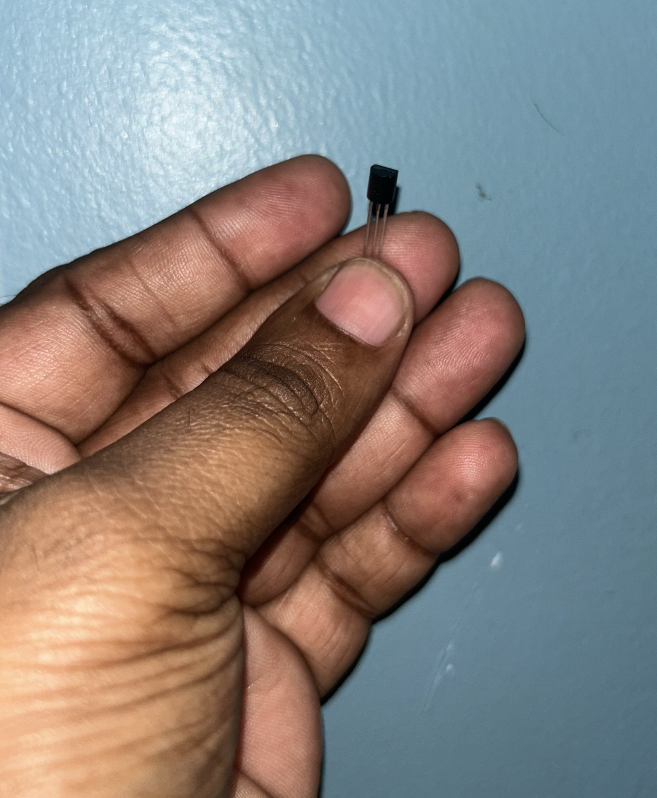{fig-alt="Transistor" width=50% fig-align="left"}

This is another place where the board silkscreen should be treated as the guide. Through-hole transistors look simple, but they are easy to rotate incorrectly if one is not paying attention.

### Step 8: Install the light sensor

Install the photoresistor at `R15`. This is the light-dependent resistor that lets the clock estimate ambient brightness for display dimming or brightness control.

The photoresistor is usually not polarized, so it can be inserted either way electrically. However, since it is meant to sense light, it should not be buried too low against the board. Leave it positioned so it can actually “see” room light once the enclosure is assembled.

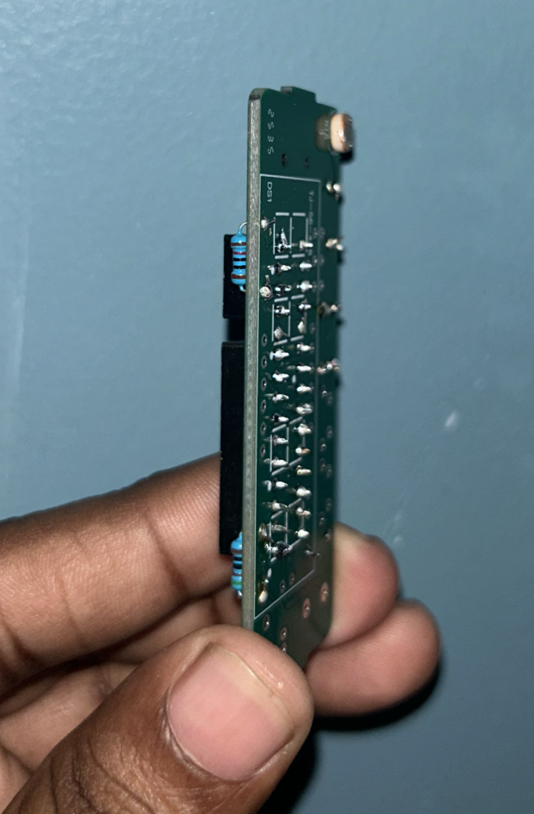{fig-alt="Installing Photoresistor" width=40% fig-align="left"}

Solder the two leads and trim them.

### Step 9: Install the electrolytic capacitor

Install `C3`, the 100 µF electrolytic capacitor. This part **does have polarity**, so orientation matters.

Electrolytic capacitors usually have:

- a **longer lead** for positive
- a **stripe on the body** marking the negative side

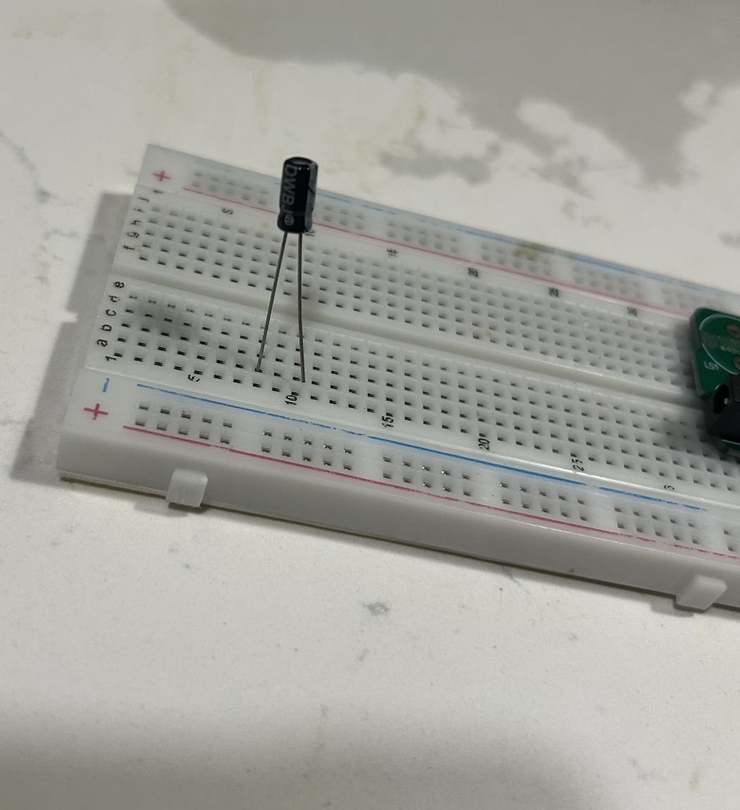{fig-alt="Installing Capacitor" width=40% fig-align="left"}

Match the positive lead to the `+` marking on the PCB. The striped negative side should go to the non-`+` hole.

This capacitor helps smooth the power rail and stabilize the clock when the display and buzzer draw current. Insert it, confirm the polarity one more time, then solder and trim the leads.

### Step 10: Install the DC power jack

Install the DC barrel jack at `DC`. This is the main power entry point for the clock.

This part is larger and more mechanical than the earlier components. Push it fully into place so it sits properly on the PCB, then solder its pins. Because it is a connector, it is worth applying enough heat to make a strong joint, since this part experiences repeated mechanical stress when the power plug is inserted or removed.

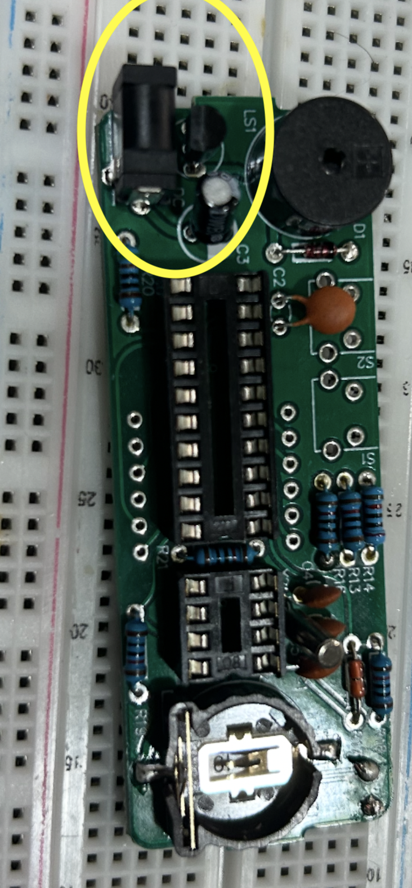{fig-alt="Installing DC Power Jack" width=40% fig-align="left"}

A weak solder joint here can make the entire clock seem unreliable even when the rest of the board is assembled correctly.

### Step 11: Install the backup battery holder

Install the `BT1` battery holder. This holder keeps the real-time clock running when main power is removed, so the clock does not forget the time and date.

The battery holder is installed on the **component side** of the PCB, but the soldering is still done on the **back side** where the tabs come through the board. Fit it into place, hold it flat, and solder the metal tabs carefully.

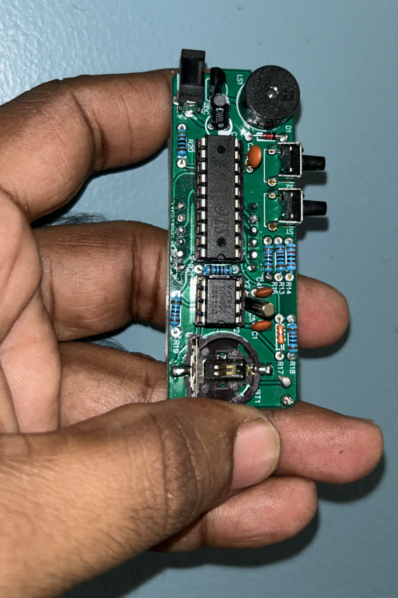{fig-alt="Installing Battery Holder" width=40% fig-align="left"}

Do **not** insert the CR1220 battery yet. It is better to finish the rest of the board first and insert the battery during the final test stage.

This part deserves patience because it is both electrical and mechanical. A poor joint here can lead to intermittent backup power.

### Step 12: Install the buzzer

Install `LS1`, the buzzer. This is the part that generates the alarm sound.

Depending on the exact buzzer supplied in the kit, there may or may not be a visible polarity marking on the case. If the buzzer has a `+` sign, that lead should be matched to the positive side indicated in the kit instructions or board layout. If the board marking is not obvious, compare the placement carefully against the printed manual before soldering.

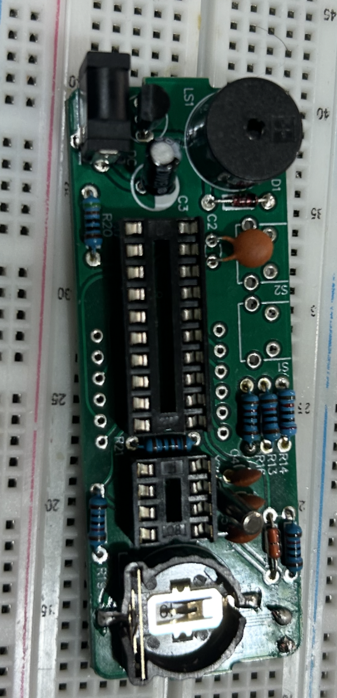{fig-alt="Installing Buzzer" width=40% fig-align="left"}

Because the buzzer is a large cylindrical part, make sure it is seated straight and not tilted awkwardly. Solder its leads firmly, since it is one of the most visually prominent parts on the clock.

### Step 13: Install the push buttons

Now install the two pushbuttons:

- `S1`
- `S2`

These are the user interface controls for changing settings such as time, alarm, and display modes. The buttons must sit flat against the board and line up well with the acrylic enclosure openings.


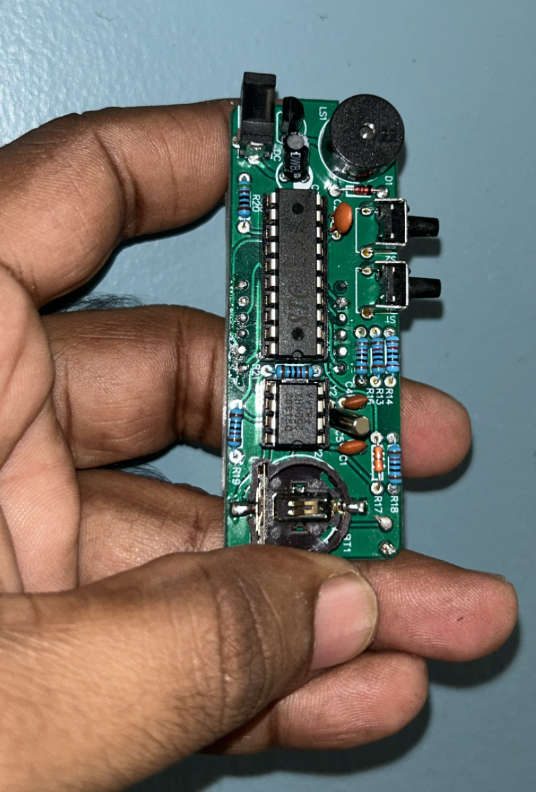{fig-alt="Installing Push Buttons" width=70% fig-align="left"}

In many cases, the four-legged tactile switches fit naturally only in the correct orientation relative to the hole pattern. Insert both, make sure they sit straight, then solder their pins. Since these are physical interface parts, clean mechanical placement matters as much as electrical connection.

### Step 14: Install the 4-digit display

Install `DS1`, the four-digit seven-segment display. This is one of the most important orientation-sensitive parts in the entire build.

Before soldering, compare the display carefully against the PCB outline and the printed kit diagram. In particular, check the **decimal point orientation** and make sure the display matches the direction shown in the manual. If the display is rotated incorrectly, the clock will not look right even if the electrical connections are otherwise valid.

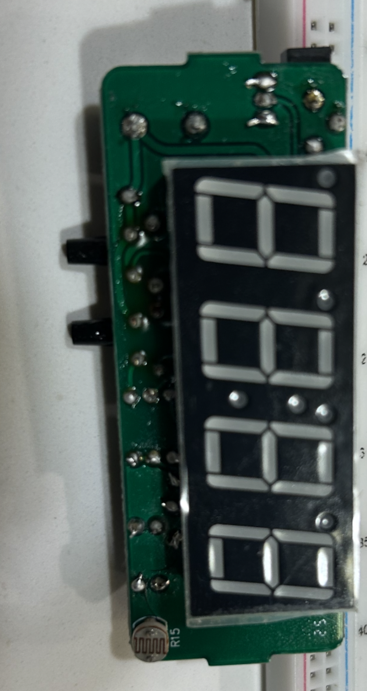{fig-alt="Installing Display" width=40% fig-align="left"}

A good method is:

1. place the display into the PCB
2. verify the orientation from the front
3. solder one corner pin
4. inspect alignment again
5. solder the remaining pins

Because the display has many pins, avoid using too much solder. The goal is a neat joint on each pin, not large blobs.

### Step 15: Inspect all solder joints

Before inserting the chips or powering the board, inspect everything carefully.

Look for:

- unsoldered pins
- dull or cracked joints
- solder bridges between neighboring pads
- wrong component values
- wrong polarities
- crooked sockets or display
- clipped leads still stuck on the board

This is the stage where patience saves time. Five extra minutes of inspection here can prevent an hour of debugging later.

### Step 16: Insert the integrated circuits

Only after all soldering is complete should the ICs be inserted into their sockets.

Insert:

- the `STC15W404AS` into `U1`
- the `DS1302` into `U2`

Each chip has a notch or dot indicating orientation. That must match the notch direction of the socket and the PCB marking. If the IC legs are slightly flared outward, gently straighten them before insertion.

{fig-alt="Installing ICs" width=70% fig-align="left"}

Never force the chip into the socket. Align all pins first, then press evenly.

### Step 17: Insert the backup battery

Now place the `CR1220` battery into the holder. Make sure the polarity matches the holder design. This battery is responsible for preserving time when the main supply is removed.


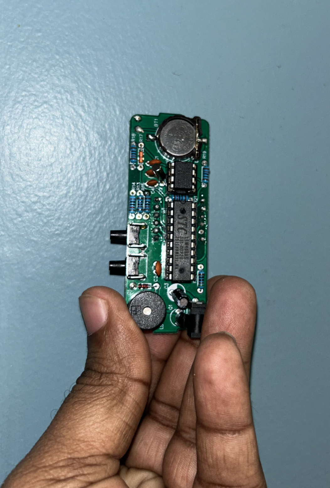{fig-alt="Installing Battery Backup" width=70% fig-align="left"}

### Step 18: First power-up

Connect the clock to its 5V power input and perform the first power-up test.

At this stage, you want to check:

- does the display light up?
- do digits appear correctly?
- do the buttons respond?
- does the buzzer make sound when expected?
- does the board remain stable without flicker or resets?

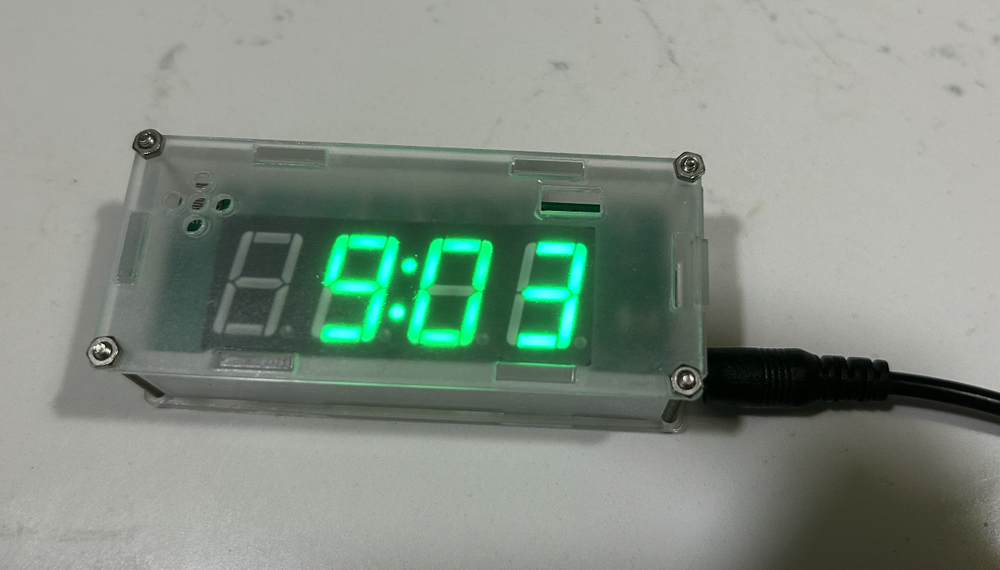{fig-alt="First Power Up" width=40% fig-align="left"}

If something does not work, do not panic. The most common causes are:

{fig-alt="Second Power Up" width=70% fig-align="left"}

- incorrect resistor placement
- reversed diode or electrolytic capacitor
- poor solder joint on the display
- IC inserted backward
- bridge between adjacent pins
- battery holder or power jack joint issue

### Step 19: Assemble the acrylic enclosure

Once the board is working, assemble the acrylic shell. The enclosure includes the front and back panels, side panels, stand pieces, screws, and nuts.

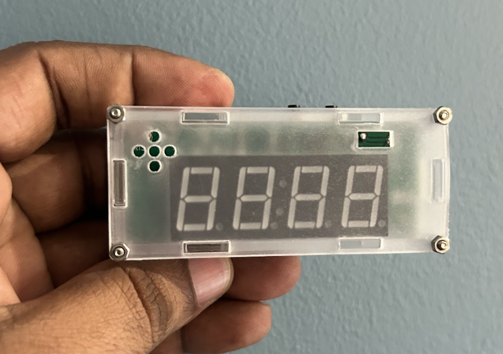{fig-alt="Acrylic Enclosure front view" width=70% fig-align="left"}

Build the enclosure slowly and make sure:

- the display window lines up with the digits
- the button openings line up with `S1` and `S2`
- the power jack remains accessible
- the buzzer openings are not blocked
- the sensor openings still allow light and air exposure

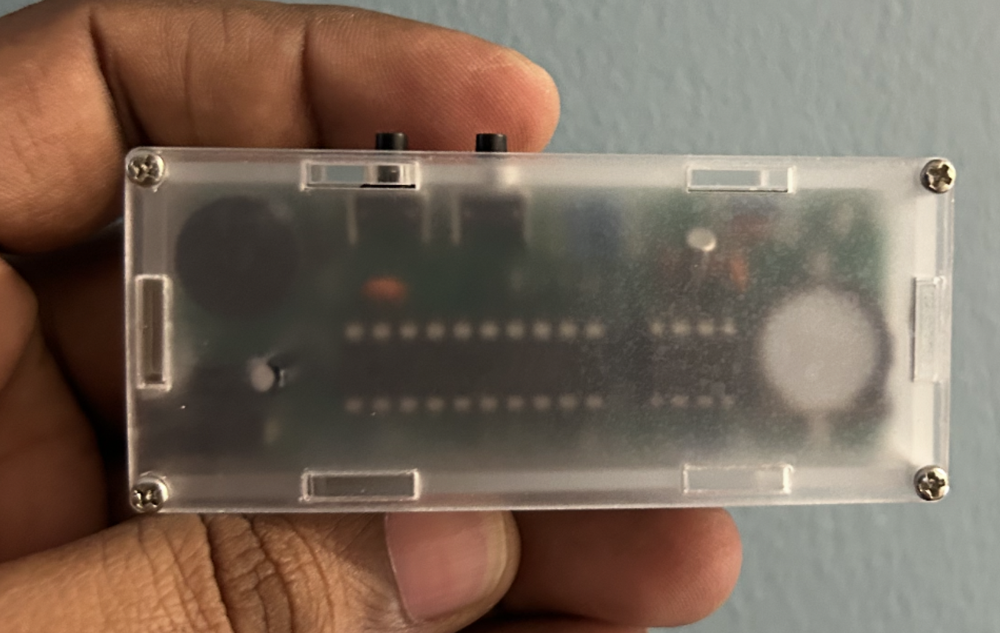{fig-alt="Acrylic Enclosure back view" width=70% fig-align="left"}

Tighten the screws enough to hold the structure firmly, but do not over-tighten them and crack the acrylic.

### Step 20: Final setup

After the enclosure is complete, power the clock again and set the time, date, and alarm. At that point, the project has moved from a loose collection of components to a real working device. That transition is what makes small electronics projects so satisfying. 

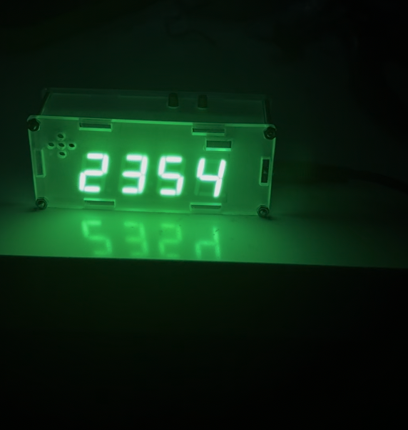{fig-alt="Completed alarm clock" width=70% fig-align="left"}

We began with individual parts, resistors, capacitors, chips, sensors, connectors, and a blank PCB, and by careful assembly, inspection, and testing, We now have a functional alarm clock that can be used in daily life.

## Demonstration Video


```{=html}
<video width="50%" controls preload="metadata">
  <source src="/images/tutorials/soldering/alarm/democlock.mp4" type="video/mp4">
  Your browser does not support the video tag.
</video>
```