## Introduction

Handheld game consoles have existed since the 1970s. Over time, they evolved from simple black-and-white games into advanced devices with color displays, powerful processors, and large game libraries. In my childhood, I owned a few handheld consoles. I also spent a lot of time playing games on the PlayStation, PC, and Game Boy. At that time, I did not think much about the hardware and software behind those systems. Later, I became more curious about how these devices were actually built.

In this tutorial, we will go through the basics of building a simple 8051-handheld game console.

## Brick Game: 9999 in 1

The Brick Game was an iconic 1990s handheld LCD console, primarily known for playing Tetris on a 10x20 grid, along with variations like snake, racing, and shooter games.

{width=20%}

It was around 1998 when I got introduced to Brick Game on my train journey. For a Middle schooler, it was engaging, exciting, and genuinely fun. For Parents, it was an affordable, easy way to distract and keep the attention of their children. 

The architecture itself is conceptually simple, even though the original devices used custom integrated chips.

**Build Order Summary:**

1. Custom IC (microcontroller)
2. A Monochrome 10x20 LCD grid display, 
3. A Single-sided PCB 
4. Rubber membrane keypad
5. Piezo speaker
6. Two AA batteries
7. Plastic injection-molded shell
8. SPDT slide (On/Off)

It was extremely popular among developing countries and post-Soviet Union countries. 
I think the sales numbers are around 100-300 million, where total revenues might be around $250-$500 million. 
Reason for high sales were lower cost, fun, portable, and long battery life. 

## Building the Handheld Console

The construction of the handheld console involves three stages: component selection, hardware assembly, and firmware programming. After collecting the required components, they are soldered onto the PCB following the circuit layout. The system is then completed by programming the microcontroller using C-based firmware to implement display control, input handling, and game execution

## Components

The handheld console is built from a small set of electronic and mechanical components. Each part plays a specific role in power delivery, input handling, display control, sound generation, or structural assembly.

| Image | Component |
|:-----:|:----------|
| 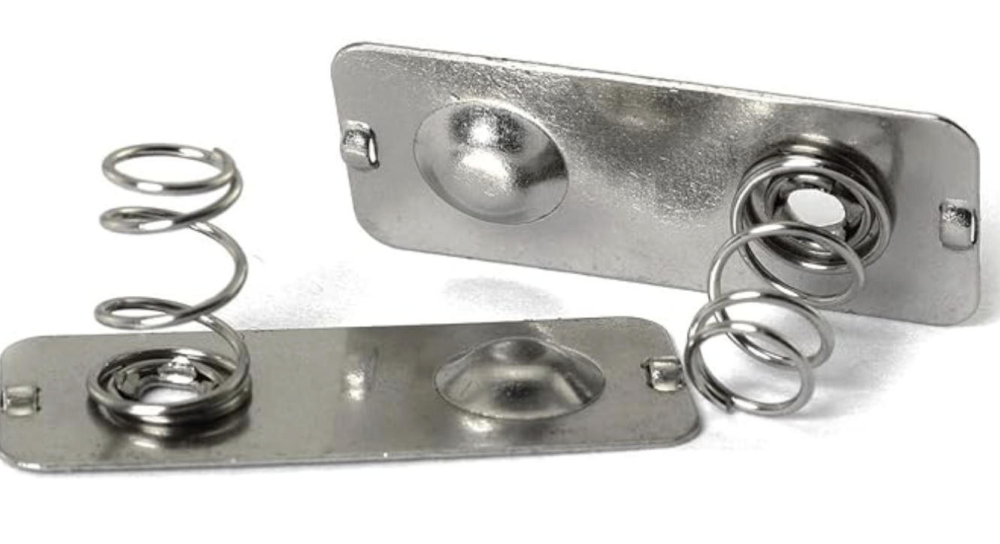{width=45%} | **Battery Connectors** <br> Spring-loaded metal contacts that hold the AA batteries and maintain reliable electrical contact. |
| 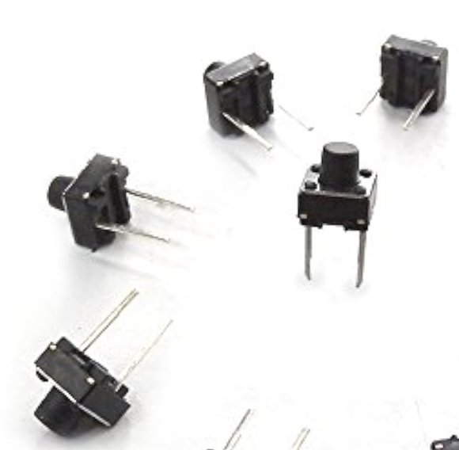{width=45%} | **Tactile Buttons** <br> Momentary switches used for gameplay input. They register a signal only while pressed. |
| 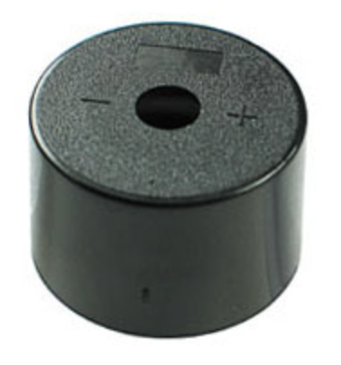{width=45%} | **Buzzer** <br> A passive buzzer used to generate sound effects and simple tones during gameplay. |
| 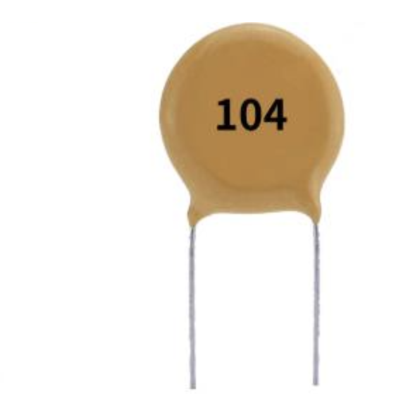{width=45%} | **Ceramic Capacitor (100nF)** <br> A decoupling capacitor that filters high-frequency noise and stabilizes the MCU power supply. |
| 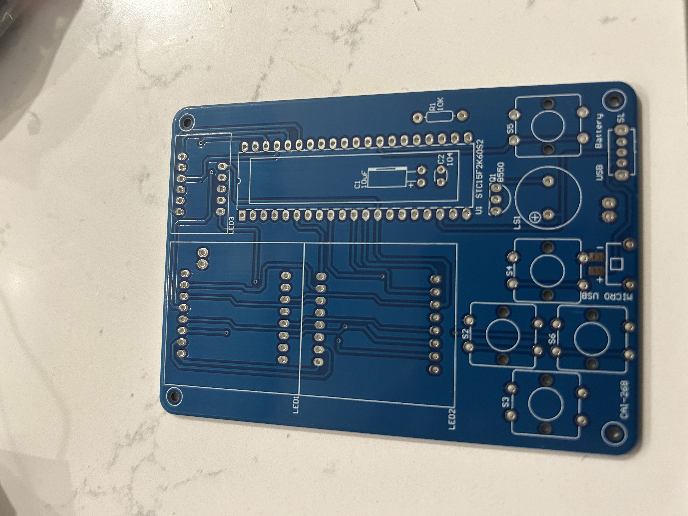{width=45%} | **PCB** <br> The printed circuit board that connects all components and provides the physical layout of the console. |
| 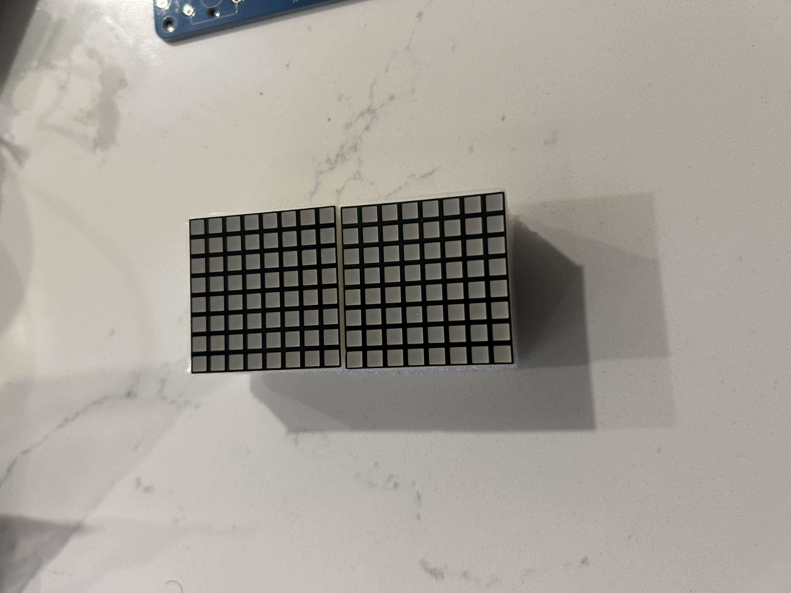{width=45%} | **LED Dot Matrix Displays** <br> Two 8×8 LED matrix modules that form the main game display. The MCU controls them to render shapes, movement, and animations. |
| 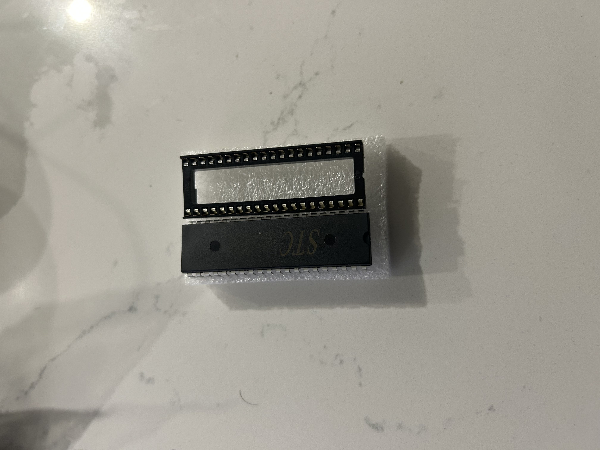{width=45%} | **STC Microcontroller** <br> The STC15F2K60S2 is the main controller of the console, responsible for display output, button input, sound, and game logic. |
| 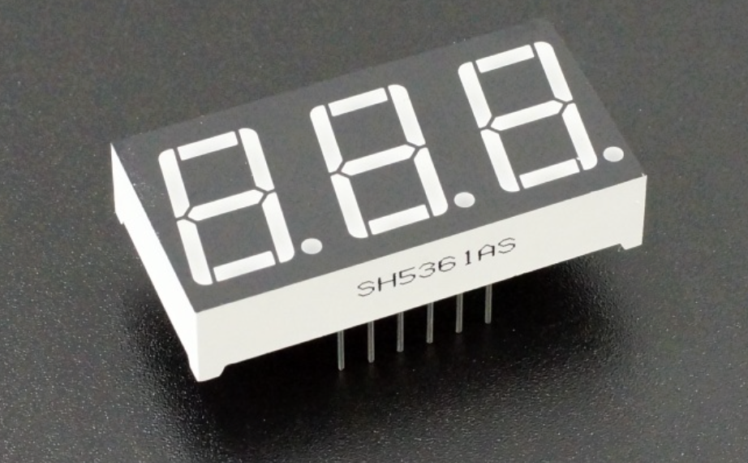{width=45%} | **7-Segment Display** <br> A 3-digit display used to show scores, counters, or other game information. |
| 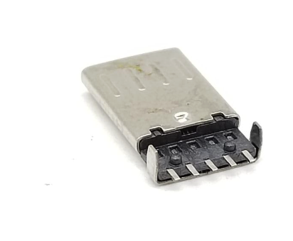{width=45%} | **Micro USB Connector** <br> Supplies 5V power and also allows the microcontroller to be programmed through STC-ISP. |
| 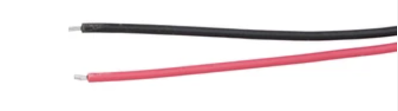{width=45%} | **Power Wires** <br> Red and black wires that connect the battery terminals to the PCB power rails. |
| 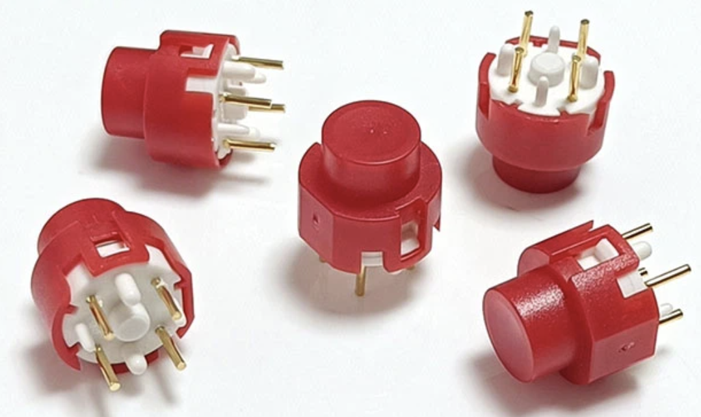{width=45%} | **Button Caps** <br> Plastic caps fitted over the tactile switches to make the controls easier and more comfortable to press. |
| 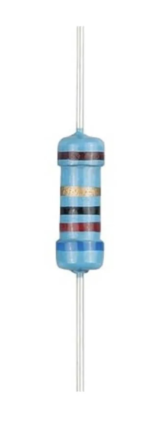{width=45%} | **Resistor (10KΩ)** <br> Helps maintain a defined logic level and prevents unstable or floating input signals. |
| 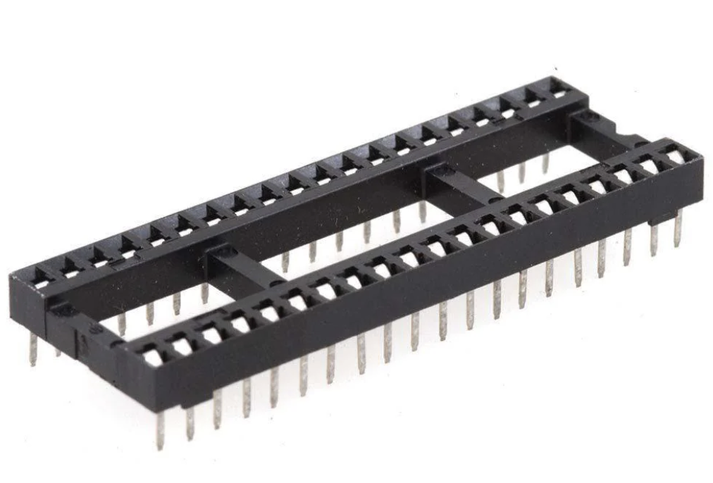{width=45%} | **DIP IC Socket (40-pin)** <br> Holds the microcontroller and allows it to be inserted or removed without direct soldering to the PCB. |
| 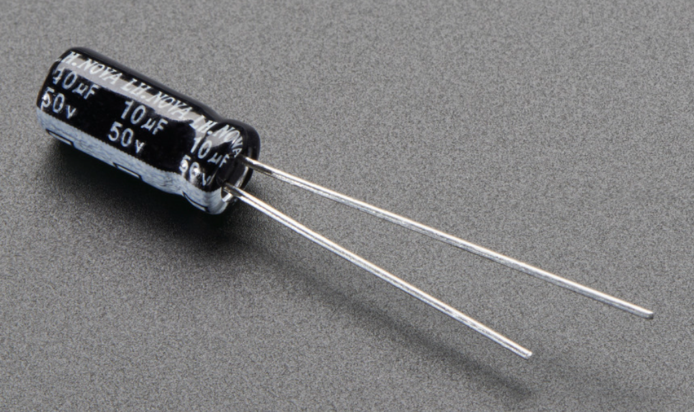{width=45%} | **Electrolytic Capacitor (10µF)** <br> Smooths power fluctuations and helps stabilize the system during rapid switching. |
| 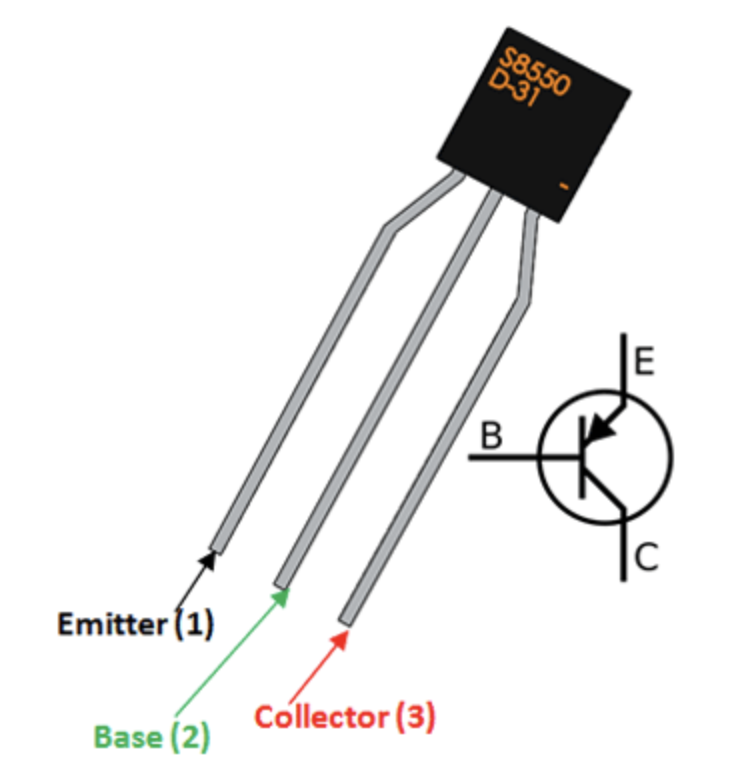{width=45%} | **S8550 PNP Transistor** <br> Acts as a switch that allows the MCU to control the buzzer without supplying the full current directly. |


## How to design? 

Here's the full end-to-end design process:

## System Design

Designing a handheld game console begins with defining what the system must do and then selecting the hardware and software needed to support those functions. For this project, the goal is to build a simple handheld device that can display game graphics, respond to button presses, generate sound, and run from a compact power source. Once those requirements are clear, the design can be broken into several subsystems: the microcontroller, power supply, display, input, audio, PCB layout, and firmware.

### 1. Define the Requirements

Before drawing the schematic, the first step is to define the core requirements of the device. This handheld console must:

- display numbers and game patterns on LED-based displays
- generate sound through a buzzer
- detect user input through push buttons
- operate from USB power or batteries
- run simple game logic on an embedded microcontroller

These requirements determine the overall architecture of the system and the categories of components needed.

### 2. Choose the Microcontroller

The microcontroller is the central controller of the system, so it must provide enough input/output pins, support simple embedded development, and remain inexpensive. For this design, the **STC15F2K60S2** is a practical choice because it offers:

- a large number of GPIO pins for displays and buttons
- 5V operation, which matches USB power directly
- an internal oscillator, reducing external parts
- low cost and strong availability in hobbyist kits

Because the console uses multiplexed displays, button inputs, and a buzzer, the MCU must coordinate several tasks at once while remaining simple enough for a small embedded system.

### 3. Design the Power Supply

The console must receive stable power for reliable operation. USB provides **5V**, which is sufficient for the microcontroller and display system used in this project. A proper power design includes:

- a USB input connector
- a power switch
- a **100nF ceramic capacitor** for high-frequency decoupling
- a **10µF electrolytic capacitor** for smoothing lower-frequency ripple

These capacitors are placed close to the MCU power pins to prevent voltage instability, noise, and erratic behavior during switching.

### 4. Design the Display Subsystem

The display system in this console uses both a **7-segment display** and **8×8 LED dot-matrix modules**. Since the number of available MCU pins is limited, the LEDs are driven using **multiplexing**.

#### 7-Segment Display

Each digit in a 7-segment display contains 7 LED segments plus a decimal point. Driving multiple digits directly would consume too many pins, so the design activates one digit at a time in rapid succession. Because this switching happens very quickly, the human eye perceives all digits as continuously lit.

In this arrangement, the MCU typically controls:

- segment lines
- digit-select lines

This approach significantly reduces the number of pins required.

#### Dot-Matrix Display

The dot-matrix display follows the same principle. An 8×8 matrix contains 64 LEDs, but it is not driven with 64 separate control lines. Instead, the MCU scans rows and columns one at a time, rapidly refreshing the display to create the appearance of a stable image.

This method allows the console to display patterns, characters, and game blocks while using far fewer I/O pins than direct control would require.

### 5. Design the Buzzer Circuit

A passive buzzer typically draws more current than a microcontroller pin can safely supply. For that reason, the buzzer is not driven directly from the MCU. Instead, the circuit uses an **S8550 PNP transistor** as a switching element.

In this design:

- the MCU provides the control signal
- the transistor handles the higher current path
- a resistor limits base current and protects the control side of the circuit

This allows the system to generate tones safely and reliably without overloading the microcontroller.

### 6. Design the Button Inputs

The tactile buttons are used as digital inputs to the MCU. Each button is connected between an MCU input pin and ground. The input is held at a default high state using a pull-up resistor, either internal or external. When the button is pressed, the signal is pulled low.

This is known as an **active-low** input configuration. It is widely used in embedded design because it is simple, reliable, and easy to interface with firmware.

### 7. Draw the Schematic

Once the subsystems are defined, the next step is to capture the complete circuit in schematic form. A tool such as **KiCad** or **EasyEDA** can be used to place components, label nets, and verify connectivity.

At this stage, the designer defines:

- the electrical relationships between all components
- power and ground distribution
- signal paths between the MCU, displays, buttons, and buzzer
- connector placement and programming access

The schematic is the logical blueprint of the system and must be correct before PCB design begins.

### 8. Design the PCB

After the schematic is complete, the circuit is translated into a physical PCB layout. In this stage, the designer places components in practical positions and routes copper traces between them.

Important layout decisions include:

- placing the MCU near the center of the logic section
- keeping the USB connector at the board edge
- positioning displays and buttons for user access
- using wider traces for power
- using narrower traces for signal routing
- adding a ground plane to improve electrical stability

The final PCB layout is exported as **Gerber files** for fabrication.

### 9. Fabricate and Assemble the Hardware

With the PCB files complete, the board can be manufactured by a PCB fabrication service such as **JLCPCB** or **PCBWay**. Once the board is delivered, the components are soldered in a practical order:

1. resistors and capacitors
2. IC sockets and transistors
3. connectors
4. displays
5. buttons and larger through-hole parts

This order helps keep the board flat during assembly and makes soldering easier.

### 10. Write the Firmware

The final stage is firmware development. The microcontroller is programmed in **C** using tools such as **SDCC** or **Keil C51**. The firmware is responsible for coordinating the entire console.

Its main functions include:

- scanning button inputs
- updating the display buffer
- multiplexing the LED displays
- generating buzzer tones
- executing the game logic

The hardware provides the physical platform, but the firmware turns it into a working handheld console. 

## Architecture

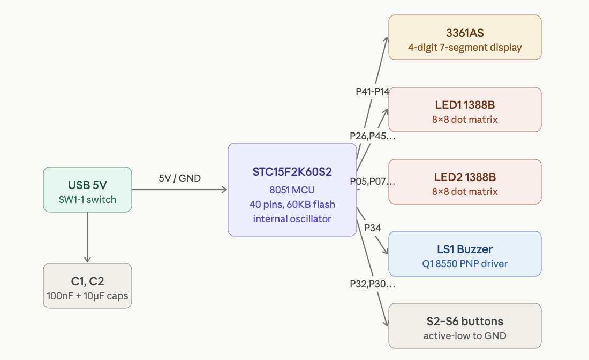{width=80%}

At the center of this handheld console is the **STC15F2K60S2**, an 8051-compatible microcontroller that acts as the main controller for the entire system. It is responsible for scanning button inputs, driving the LED displays, generating buzzer output, and executing the game logic. Although the 8051 architecture is old, this chip is a modern and much faster implementation, making it well suited for small embedded systems like this one.

One of the main reasons this microcontroller fits the project is that it combines **enough memory, a high pin count, integrated timing features, and direct 5V operation** in a single low-cost package. The chip provides up to **63.5 KB of Flash program memory**, **2 KB of SRAM**, and on-chip EEPROM, which is more than enough for a compact game such as Tetris and the supporting display logic.

A major advantage of the STC15F2K60S2 is its **1T 8051 architecture**. Traditional 8051 microcontrollers typically require 12 clock cycles per instruction, but this chip executes instructions much more efficiently. In practice, that makes it significantly faster than a classic 8051 while preserving compatibility with the same instruction set. For a project like this, that extra speed is valuable because the microcontroller must handle display refresh, button input, and game execution at the same time.

Another practical benefit is the **integrated internal oscillator**. Because the chip does not require an external crystal for basic operation, the hardware becomes simpler and cheaper. Fewer external parts are needed, PCB routing is easier, and the overall design is more compact.

The voltage range of the microcontroller also makes it convenient for this console. Since it can operate directly from approximately **5V**, it works naturally with USB power and avoids the need for a dedicated regulator in this design. That simplifies both the schematic and the PCB layout.

The chip also provides a large number of **general-purpose I/O pins**, which is critical in a handheld console. These pins are needed to interface with the 7-segment display, the dot-matrix LED modules, the push buttons, and the buzzer circuit. Because the display system is multiplexed, the MCU must rapidly switch and coordinate multiple outputs while still reading user input reliably.

Its built-in **timers** are especially important for this project. A timer interrupt can be used to refresh the display at a fixed interval, which allows the LEDs to appear continuously lit even though they are actually being scanned one row or digit at a time. Without this timing control, the display would flicker or behave inconsistently.

The STC15F2K60S2 also includes additional features such as **ADC channels, UART communication, SPI support, and ISP/IAP programming capability**. Not all of these are heavily used in this specific build, but they make the chip flexible for future extensions and simplify development. In particular, **In-System Programming (ISP)** allows the firmware to be uploaded without requiring a specialized external programmer.

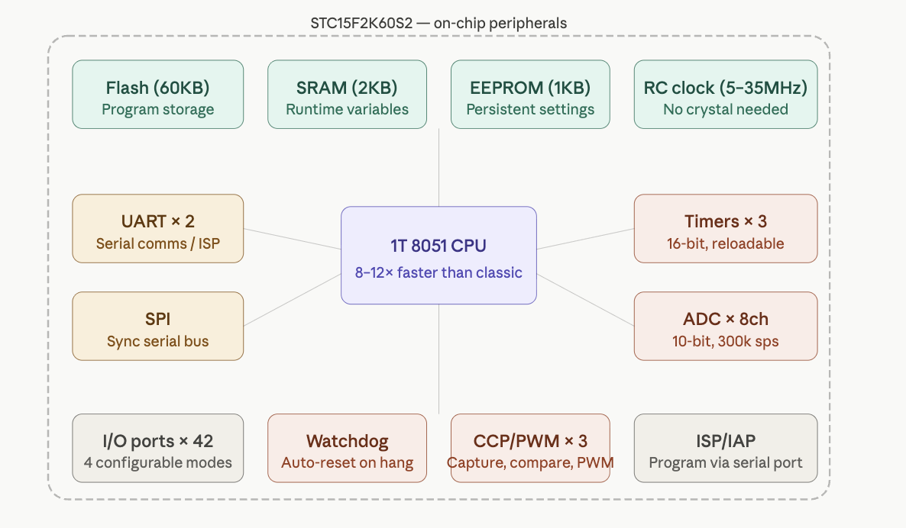{width=80%}

Overall, the architecture of this handheld console is built around a simple but effective idea: a single microcontroller coordinates input, display scanning, sound generation, and game execution. The STC15F2K60S2 is a strong fit because it is inexpensive, fast enough for real-time control, easy to integrate into a 5V design, and capable of driving the full system with relatively few supporting components.

::: {.callout-note}
## Why this MCU works well here

The STC15F2K60S2 is a good fit for this console because it offers:

- enough GPIO for displays, buttons, and buzzer
- direct 5V operation
- timer support for display multiplexing
- sufficient Flash and RAM for simple game firmware
- easy in-system programming
:::

With the design decisions mapped out, it's time to move from paper to workbench. The following steps walk through the full physical assembly, from inspecting the bare PCB to powering on the completed console.

## How to Build the Handheld Console

This section walks through the complete assembly of a handheld game console, from bare PCB to a fully working device running Tetris. The build involves soldering through-hole and surface-mount components onto a custom PCB driven by an **STC15F2K60S2** 8051-compatible microcontroller.

## Hardware 

### Step 1: Inspect the Bare PCB

::: {layout-ncol=1}
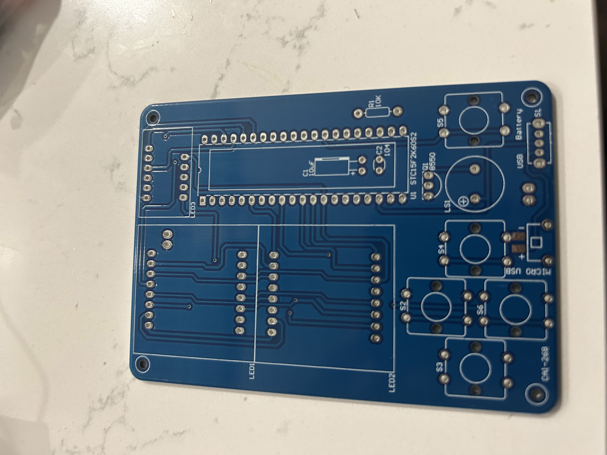{width=70%}
:::

Start by examining the front of the bare blue PCB. You can identify all the major footprints before soldering anything:

- **LED1 / LED2** — two 8×8 dot-matrix LED module sockets (left half of board)
- **LED3** — 3-digit 7-segment display socket (top right)
- **U1 STC15F2K60S2** — 40-pin DIP IC socket (center right)
- **C1 10µF / C2 104** — decoupling capacitors
- **R1 10K** — pull-up resistor
- **Q1 8550** — PNP transistor footprint for the buzzer driver
- **LS1** — passive buzzer
- **S1–S6** — six tactile push-button footprints
- **MICRO USB** — programming port
- **USB / Battery / SL** — power selection header

Take a moment to cross-reference each silkscreen label before picking up a soldering iron.


### Step 2: Solder the Small Passive Components

::: {layout-ncol=1}
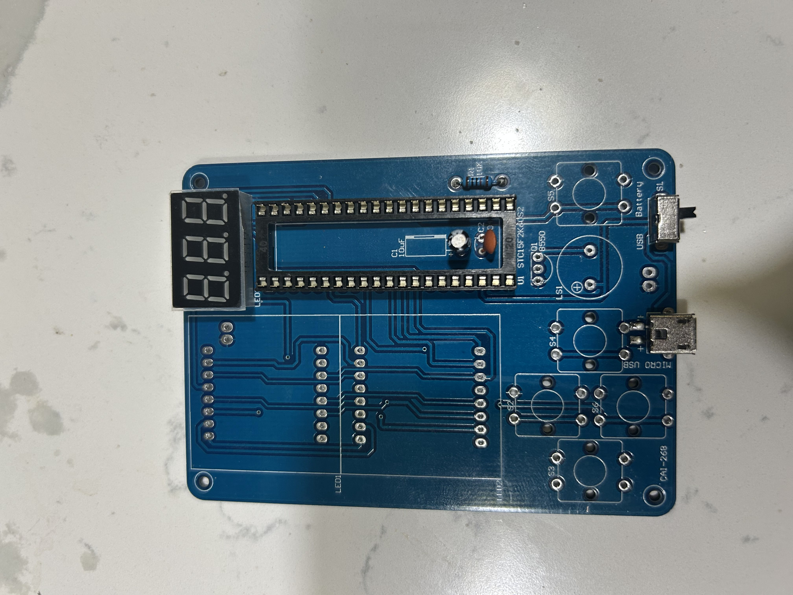{width=70%}
:::

Solder the smallest components first so they sit flat before bulkier parts crowd the workspace:

1. **IC socket (U1)** — Place the 40-pin DIP socket, ensuring the notch faces up (toward LED3). Tack two opposite corners, confirm alignment, then solder all 40 pins.
2. **C1 (10µF electrolytic)** — Mind polarity; the longer leg goes in the `+` hole.
3. **C2 (104 ceramic disc)** — Non-polarized; orientation does not matter.
4. **R1 (10KΩ resistor)** — Bend legs, insert, and trim flush after soldering.
5. **Q1 (8550 transistor)** — Match the flat face to the silkscreen outline.
6. **Micro USB (programming port)** — Flux the pads well before soldering; the connector must sit flush.
7. **USB / Battery power connector** — Solder the 5-pin header flat to the board.

> **Tip:** Solder in order of component height — flat components first, tall components last — so the board lies stable on your work surface.

### Step 3: Solder the Dot-Matrix LED Modules

::: {layout-ncol=1}
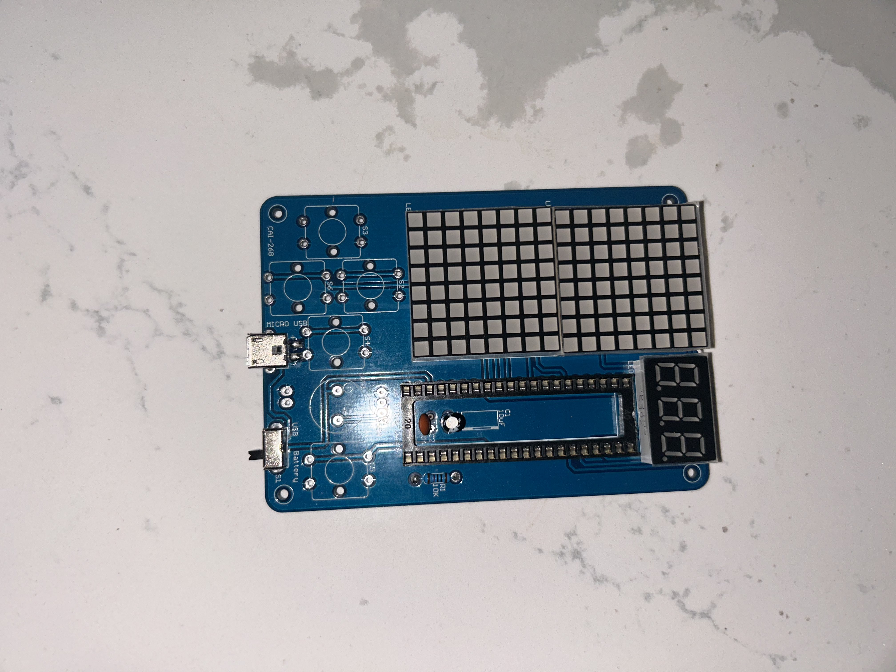{width=70%}
:::

The two 8×8 dot-matrix modules (LED1 and LED2) insert from the **front** of the board and are soldered from the **back**. This photo shows the board flipped over after the modules have been pressed into their footprints.

- Each module has **16 pins** (8 per side). Confirm each pin is seated before soldering.
- Do **not** mix up LED1 and LED2 — the modules are identical, but the top matrix (LED1) and bottom matrix (LED2) are addressed separately by the firmware.
- After soldering, inspect from the front to confirm the LED dot faces are flush and straight.


### Step 4: Attach the 7-Segment Display and Buttons

::: {layout-ncol=1}
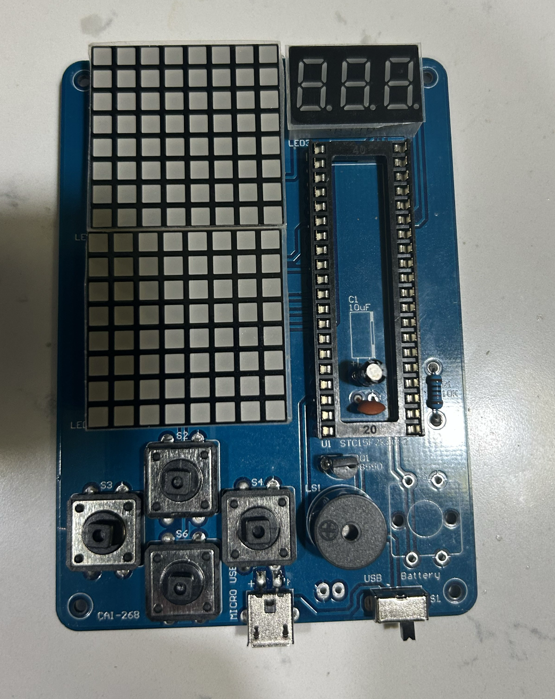{width=70%}
:::

With the matrices in place, add the remaining display and input components:

- **LED3 (3-digit 7-segment display)** — Insert into the top-right socket. The decimal-point side faces right.
- **S1–S6 push buttons** — The six tactile switches snap into their footprints. Apply light pressure until you hear a click, then solder all four legs of each switch.
- **LS1 (passive buzzer)** — The `+` marking on the buzzer aligns with the `+` pad on the silkscreen.

At this stage the board is populated but the IC and button caps are not yet fitted.

### Step 5: Insert the Microcontroller

::: {layout-ncol=1}
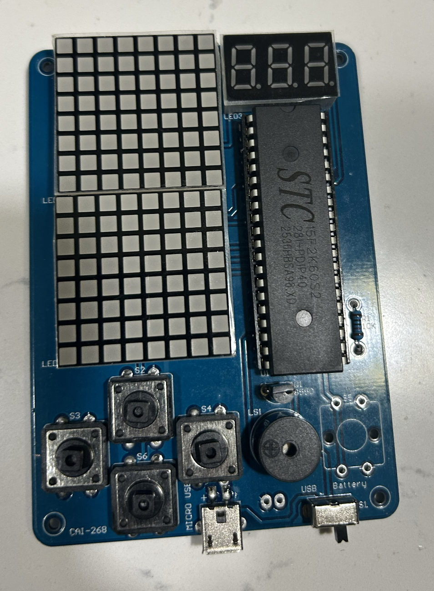{width=70%}
:::

Insert the **STC15F2K60S2** into the 40-pin socket soldered in Step 2:

- Locate **pin 1** (marked with a dot or notch on the IC body) and align it with pin 1 of the socket.
- Gently bend all 40 legs to 90° by pressing the IC against a flat surface, then seat it evenly — do not force it.
- Confirm the IC sits flush and no legs are bent or bridging before applying any power.

The chip is marked `STC15F2K60S2 / 2836RBS / A98XD` on the label visible in this photo.

### Step 6: Prepare the Acrylic Case

::: {layout-ncol=1}
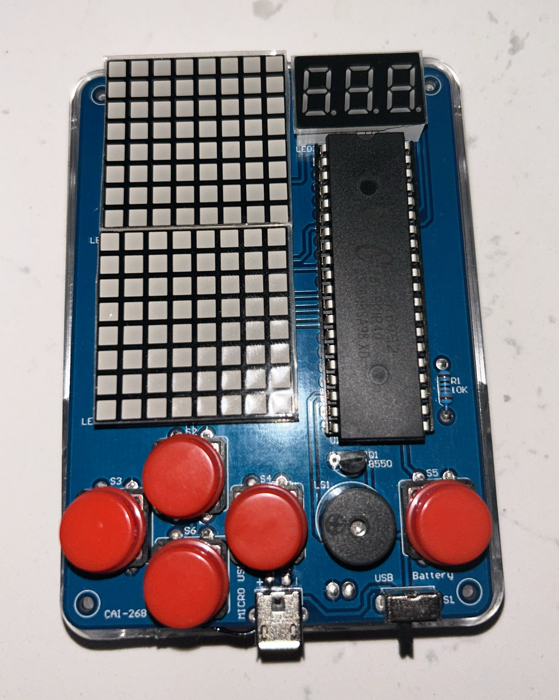{width=70%}
:::

The kit includes a two-piece **clear acrylic enclosure**. The bottom panel has a **3×AA battery holder** (4.5 V) riveted to it with a JST-style connector that plugs into the `Battery` header on the PCB.

- Peel the protective film from both acrylic panels.
- Verify the battery-holder wires are long enough to reach the PCB connector once assembled.
- The standoff posts in the corners are press-fit; they can be gently tapped with a fingertip to seat fully.

---

### Step 7: Fit the Button Caps

::: {layout-ncol=1}
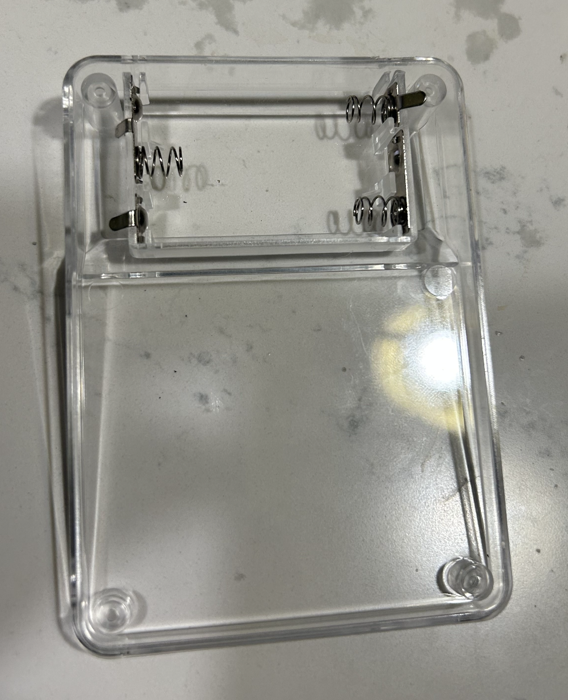{width=70%}
:::

Press the six **red dome button caps** over each tactile switch:

- Four caps cover **S2, S3, S4, S6** (the directional cluster on the left).
- One cap covers **S1** (center of the cluster).
- One cap covers **S5** (the action button on the right).

The caps are friction-fit and simply push straight down. They should click lightly and spring back when pressed.


### Step 8: First Power-On Test

::: {layout-ncol=1}
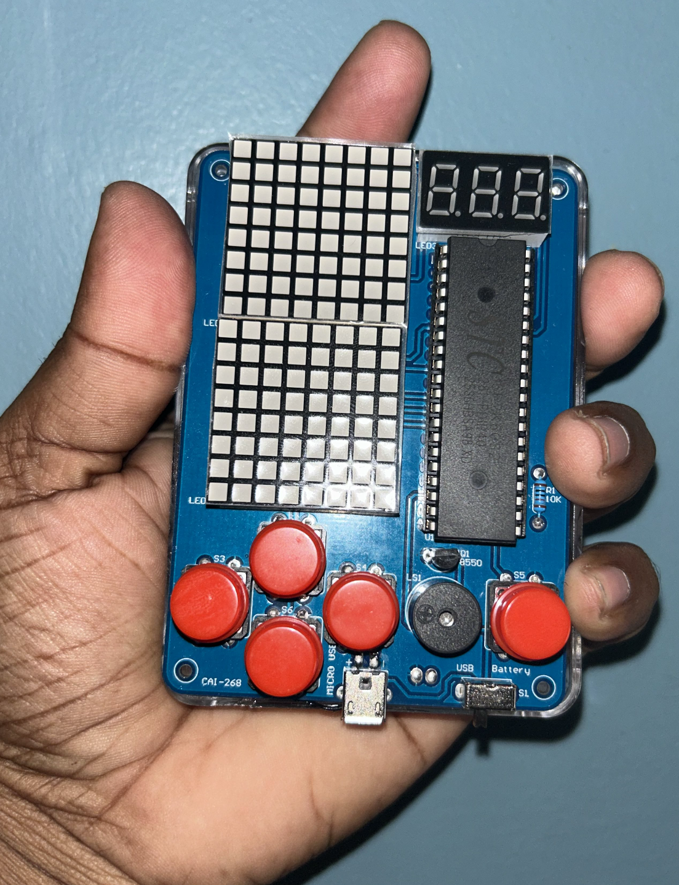{width=70%}
:::

Before closing the case, power the board over **Micro USB** or batteries and verify:

| Component | Expected behavior |
|---|---|
| 7-segment display (LED3) | Shows `8.8.` test pattern |
| Dot-matrix modules (LED1/2) | All LEDs illuminate |
| Buzzer (LS1) | Short startup tone |
| Buttons S1–S6 | Each responds to press |

If any LED matrix is dark, check for lifted pins at that module's footprint. 
If the display is absent, verify the IC is seated correctly and that C1 polarity is correct.


### Step 9: Install the Batteries and Check the Back

::: {layout-ncol=1}
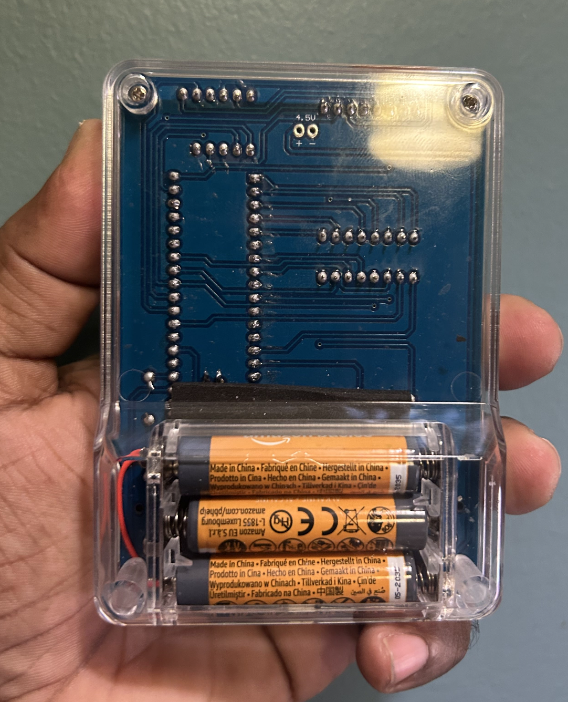{width=70%}
:::

Flip the device over to load batteries:

1. Insert three **AA batteries** into the holder, observing polarity (spring = negative).
2. Route the battery connector wire to avoid pinching against the PCB.
3. The back panel is also your view of the **PCB solder side** — inspect the solder joints from this angle for any cold or bridged joints before closing.

The board label `4.5V` near the battery pads is a useful reminder that the device runs on three cells in series, not a Li-ion cell.


### Step 10: Final Assembly

::: {layout-ncol=1}
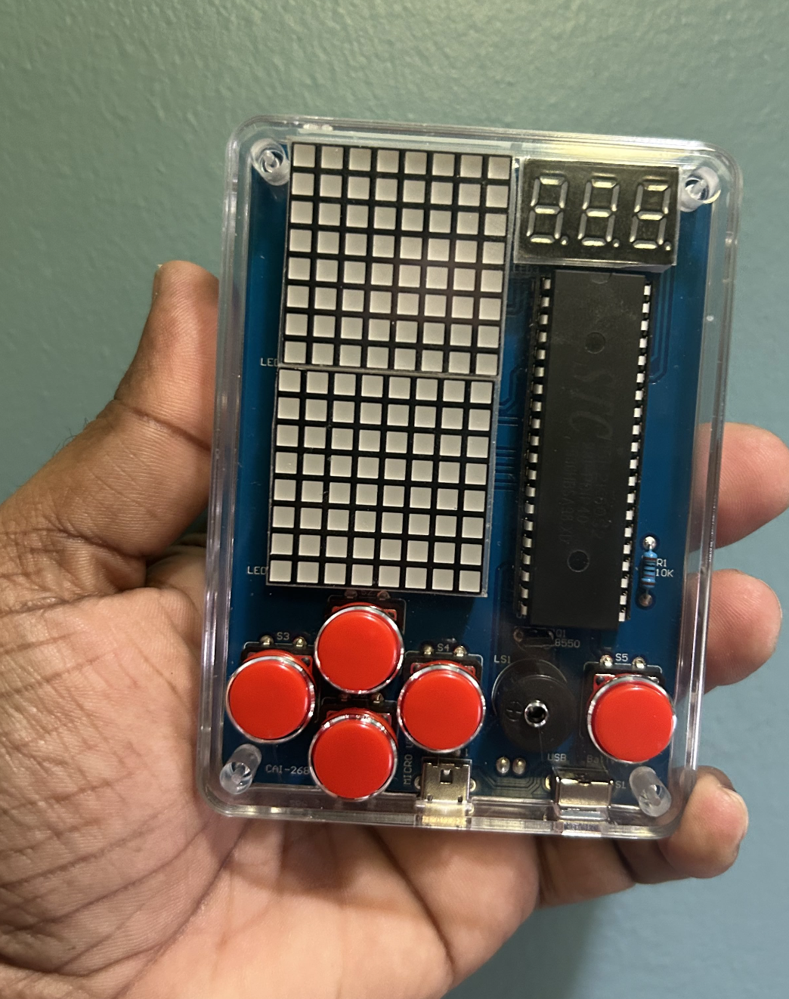{width=70%}
:::

Sandwich the PCB between the two acrylic panels:

1. Place the PCB on the bottom panel, lining up the four corner holes with the standoffs.
2. Thread the four **M2 screws** through the top panel, through the PCB, and into the bottom standoffs.
3. Tighten finger-tight — over-tightening can crack the acrylic.
4. Confirm the Micro USB port, USB connector, and battery slide-switch (SL) are all accessible through their respective cutouts.

The assembled unit is compact enough to fit in one hand, as shown above.


### Step 11: Power On and Navigate the Menu

::: {layout-ncol=1}
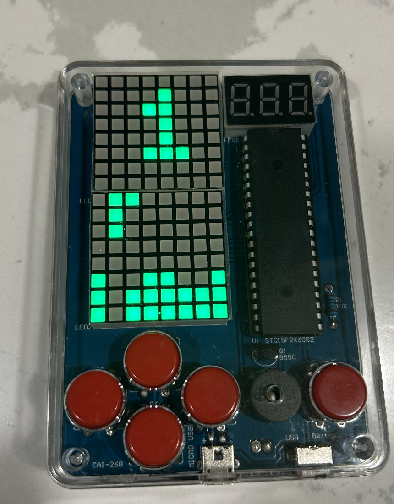{width=70%}
:::

Slide **SL** to the `ON` position. The 7-segment display shows `000` (score) and the dot-matrix matrices light up with the game menu. Use the button cluster to navigate:

| Button | Function |
|---|---|
| S2 (up) | Move piece up / menu up |
| S6 (down) | Move piece down / menu down |
| S3 (left) | Move piece left |
| S1 (right) | Move piece right |
| S4 | Rotate piece |
| S5 | Pause / select |

Select **Tetris** from the menu and the falling-block game begins immediately.

### Step 12: Play!

::: {layout-ncol=1}
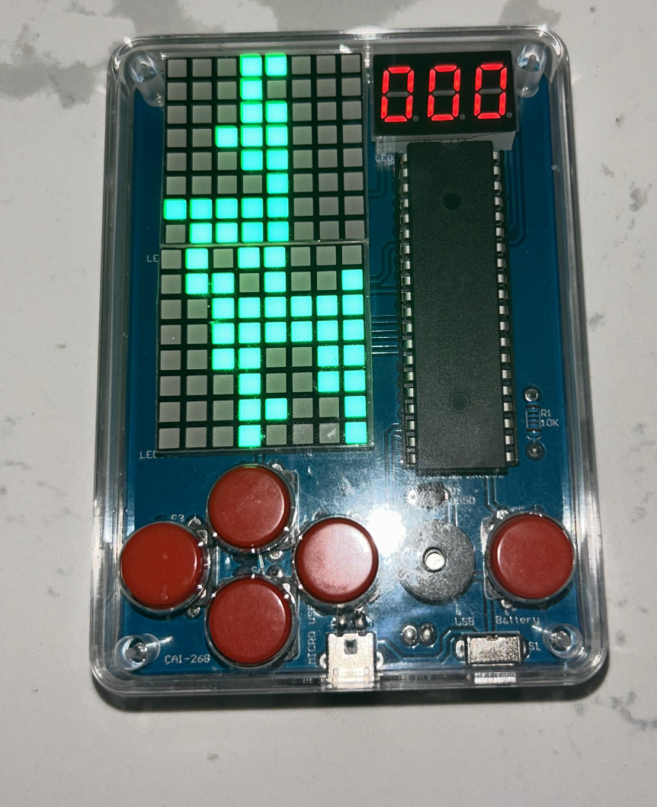{width=70%}
:::

The firmware pre-loaded on the STC15F2K60S2 includes Tetris as its primary game. Pieces fall from the top of the 8×16 display area (spanning both LED matrices), and complete horizontal lines are cleared for points shown on the 7-segment display.

The buzzer sounds on line clears, level-ups, and game-over events. Speed increases automatically as your score rises.

---

# Demo



> The video above shows the completed console running Tetris at speed, demonstrating the LED matrix gameplay, 7-segment scoring, and buzzer audio feedback.

## Firmware & Software

Once the hardware is assembled, the handheld console becomes functional through firmware running on the **STC15F2K60S2** microcontroller. The firmware is written in **C** using **SDCC** or **Keil C51**, and the compiled `.hex` file is uploaded using **STC-ISP**.

At a high level, the firmware performs three tasks:

- refreshes the LED displays
- reads button inputs
- runs the game logic

Display refreshing is handled through timer-driven multiplexing, while the main loop continuously updates gameplay.

The timer interrupt fires every ~1ms. Each time it fires, it activates one row of the LED matrix and moves to the next. 
Because this cycles through all 16 rows faster than the eye can detect, the display appears fully lit.

### Flashing the Chip

STC microcontrollers enter programming mode at power-on. To flash the firmware:

1. Open **STC-ISP**
2. Select `STC15F2K60S2`
3. Choose the correct COM port
4. Click **Download/Program**
5. Power-cycle the board

When the board restarts, the bootloader detects the programmer and uploads the firmware automatically.

## Game Code

The following code implements the Tetris firmware for the handheld console. It defines the board state, tetromino data, display multiplexing, button handling, collision logic, scoring, audio feedback, rendering, and the main game loop.

```c
#include <STC15.H>
#include <stdint.h>

/* ─────────────────────────────────────────────
   PORT DEFINITIONS
   Adjust these to match your PCB's routing.
   ───────────────────────────────────────────── */
#define ROW_PORT   P0
#define COL_PORT   P2
#define SEG_PORT   P1
#define DIGIT_PORT P3

#define BTN_LEFT   P4_0
#define BTN_RIGHT  P4_1
#define BTN_DOWN   P4_2
#define BTN_ROT    P4_3
#define BTN_PAUSE  P4_4
#define BUZZER     P4_5

#define BOARD_WIDTH  8
#define BOARD_HEIGHT 16

uint8_t board[BOARD_HEIGHT]       = {0};
uint8_t framebuffer[BOARD_HEIGHT] = {0};

const uint16_t PIECES[7][4] = {
    { 0x0F00, 0x2222, 0x00F0, 0x4444 },
    { 0x6600, 0x6600, 0x6600, 0x6600 },
    { 0x0E40, 0x4C40, 0x4E00, 0x4640 },
    { 0x06C0, 0x4620, 0x06C0, 0x4620 },
    { 0x0C60, 0x2640, 0x0C60, 0x2640 },
    { 0x0E20, 0x4C00, 0x8E00, 0x6400 },
    { 0x0E80, 0xC400, 0x2E00, 0x4600 }
};

typedef struct {
    int8_t  x;
    int8_t  y;
    uint8_t type;
    uint8_t rotation;
} Piece;

Piece current;
Piece next;

uint8_t rng_state = 42;
uint8_t current_row   = 0;
uint8_t seg_digits[3] = {0, 0, 0};
uint8_t prev_rot   = 1;
uint8_t prev_pause = 1;
uint8_t score = 0;
uint8_t tick_counter  = 0;
uint8_t drop_interval = 40;
uint8_t first_spawn   = 1;

const uint8_t SEG7[10] = {
    0x3F, 0x06, 0x5B, 0x4F, 0x66,
    0x6D, 0x7D, 0x07, 0x7F, 0x6F
};

void board_clear() {
    uint8_t i;
    for (i = 0; i < BOARD_HEIGHT; i++)
        board[i] = 0;
}

uint8_t board_get(int8_t x, int8_t y) {
    if (x < 0 || x >= BOARD_WIDTH || y < 0 || y >= BOARD_HEIGHT)
        return 1;
    return (board[y] >> (7 - x)) & 1;
}

void board_set(int8_t x, int8_t y, uint8_t val) {
    if (x < 0 || x >= BOARD_WIDTH || y < 0 || y >= BOARD_HEIGHT)
        return;
    if (val)
        board[y] |=  (1 << (7 - x));
    else
        board[y] &= ~(1 << (7 - x));
}

uint8_t piece_get(uint16_t mask, uint8_t x, uint8_t y) {
    return (mask >> (15 - (y * 4 + x))) & 1;
}

uint16_t current_mask() {
    return PIECES[current.type][current.rotation];
}

void delay_ms(uint8_t ms) {
    uint8_t i, j;
    while (ms--) {
        for (i = 0; i < 114; i++)
            for (j = 0; j < 1; j++);
    }
}

uint8_t rand8() {
    rng_state = rng_state * 109 + 89;
    return rng_state;
}

void timer0_isr() interrupt 1 {
    TH0 = 0xFC;
    TL0 = 0x66;

    if (current_row < 16) {
        ROW_PORT = 0xFF;
        COL_PORT = ~framebuffer[current_row];
        ROW_PORT = ~(1 << (current_row % 8));
    } else {
        uint8_t digit = current_row - 16;
        DIGIT_PORT = 0x00;
        SEG_PORT   = SEG7[seg_digits[digit]];
        DIGIT_PORT = (1 << digit);
    }

    current_row = (current_row + 1) % 19;
}

void timer0_init() {
    TMOD &= 0xF0;
    TH0 = 0xFC;
    TL0 = 0x66;
    ET0 = 1;
    TR0 = 1;
    EA  = 1;
}

uint8_t button_pressed(bit btn_pin) {
    if (btn_pin == 0) {
        delay_ms(15);
        if (btn_pin == 0)
            return 1;
    }
    return 0;
}

uint8_t button_edge(bit btn_pin, uint8_t *prev) {
    uint8_t cur = (btn_pin == 0) ? 0 : 1;
    uint8_t pressed = (*prev == 1 && cur == 0);
    *prev = cur;
    return pressed;
}

uint8_t collision(int8_t dx, int8_t dy, uint8_t new_rotation) {
    uint8_t x, y;
    uint16_t mask = PIECES[current.type][new_rotation];

    for (y = 0; y < 4; y++) {
        for (x = 0; x < 4; x++) {
            if (!piece_get(mask, x, y))
                continue;
            if (board_get(current.x + x + dx,
                          current.y + y + dy))
                return 1;
        }
    }
    return 0;
}

void move_piece(int8_t dx, int8_t dy) {
    if (!collision(dx, dy, current.rotation)) {
        current.x += dx;
        current.y += dy;
    }
}

void rotate_piece() {
    uint8_t new_rot = (current.rotation + 1) % 4;

    if (!collision(0, 0, new_rot)) {
        current.rotation = new_rot;
    } else if (!collision(-1, 0, new_rot)) {
        current.rotation = new_rot;
        current.x -= 1;
    } else if (!collision(1, 0, new_rot)) {
        current.rotation = new_rot;
        current.x += 1;
    }
}

void lock_piece() {
    uint8_t x, y;
    uint16_t mask = current_mask();

    for (y = 0; y < 4; y++) {
        for (x = 0; x < 4; x++) {
            if (piece_get(mask, x, y))
                board_set(current.x + x, current.y + y, 1);
        }
    }
}

void update_7seg(uint8_t val) {
    seg_digits[0] = val / 100;
    seg_digits[1] = (val / 10) % 10;
    seg_digits[2] = val % 10;
}

void clear_lines() {
    int8_t y;
    uint8_t lines = 0;

    for (y = BOARD_HEIGHT - 1; y >= 0; y--) {
        if (board[y] == 0xFF) {
            int8_t yy;
            for (yy = y; yy > 0; yy--)
                board[yy] = board[yy - 1];
            board[0] = 0x00;
            lines++;
            y++;
        }
    }

    const uint8_t points[5] = {0, 1, 3, 5, 8};
    if (lines > 0 && lines <= 4)
        score += points[lines];
    if (score > 99) score = 99;

    update_7seg(score);
}

void buzzer_tone(uint16_t freq_hz, uint16_t duration_ms) {
    uint16_t half_period_us = 500000UL / freq_hz;
    uint16_t cycles = (uint32_t)duration_ms * freq_hz / 1000;
    uint16_t i;

    for (i = 0; i < cycles; i++) {
        BUZZER = 0;
        uint16_t d = half_period_us / 10;
        while (d--);
        BUZZER = 1;
        d = half_period_us / 10;
        while (d--);
    }
    BUZZER = 1;
}

void buzzer_click()    { buzzer_tone(1000,  20);  }
void buzzer_line()     { buzzer_tone(880,   80);  }
void buzzer_tetris()   { buzzer_tone(1320,  200); }
void buzzer_gameover() { buzzer_tone(220,   800); }

void spawn_piece() {
    if (first_spawn) {
        rng_state ^= TL0;
        first_spawn = 0;
    }

    current       = next;
    current.x     = 2;
    current.y     = 0;

    next.type     = rand8() % 7;
    next.rotation = 0;
}

void render() {
    uint8_t x, y;
    uint16_t mask = current_mask();

    for (y = 0; y < BOARD_HEIGHT; y++)
        framebuffer[y] = board[y];

    for (y = 0; y < 4; y++) {
        for (x = 0; x < 4; x++) {
            if (piece_get(mask, x, y)) {
                int8_t bx = current.x + x;
                int8_t by = current.y + y;
                if (by >= 0 && by < BOARD_HEIGHT &&
                    bx >= 0 && bx < BOARD_WIDTH)
                    framebuffer[by] |= (1 << (7 - bx));
            }
        }
    }
}

void update_speed() {
    if      (score >= 50) drop_interval = 4;
    else if (score >= 30) drop_interval = 8;
    else if (score >= 20) drop_interval = 16;
    else if (score >= 10) drop_interval = 24;
    else                  drop_interval = 40;
}

void pause_game() {
    while (button_edge(BTN_PAUSE, &prev_pause) == 0) {
        delay_ms(16);
    }
}

void game_over() {
    board_clear();
    score = 0;
    first_spawn = 1;
    update_7seg(0);
    delay_ms(1000);

    next.type = rand8() % 7;
    next.rotation = 0;
    spawn_piece();
}

void game_init() {
    board_clear();
    score         = 0;
    tick_counter  = 0;
    drop_interval = 40;
    first_spawn   = 1;
    prev_rot      = 1;
    prev_pause    = 1;
    rng_state     = 73;

    next.type     = rand8() % 7;
    next.rotation = 0;
    spawn_piece();
    update_7seg(0);
}

void main() {
    timer0_init();
    game_init();

    while (1) {
        if (button_pressed(BTN_LEFT))
            move_piece(-1, 0);

        if (button_pressed(BTN_RIGHT))
            move_piece( 1, 0);

        if (button_pressed(BTN_DOWN))
            move_piece( 0, 1);

        if (button_edge(BTN_ROT, &prev_rot))
            rotate_piece();

        if (button_edge(BTN_PAUSE, &prev_pause))
            pause_game();

        if (tick_counter >= drop_interval) {
            tick_counter = 0;

            if (!collision(0, 1, current.rotation)) {
                current.y++;
            } else {
                lock_piece();
                buzzer_click();
                clear_lines();
                update_speed();
                spawn_piece();

                if (collision(0, 0, current.rotation))
                    game_over();
            }
        }

        render();
        delay_ms(16);
        tick_counter++;
    }
}
