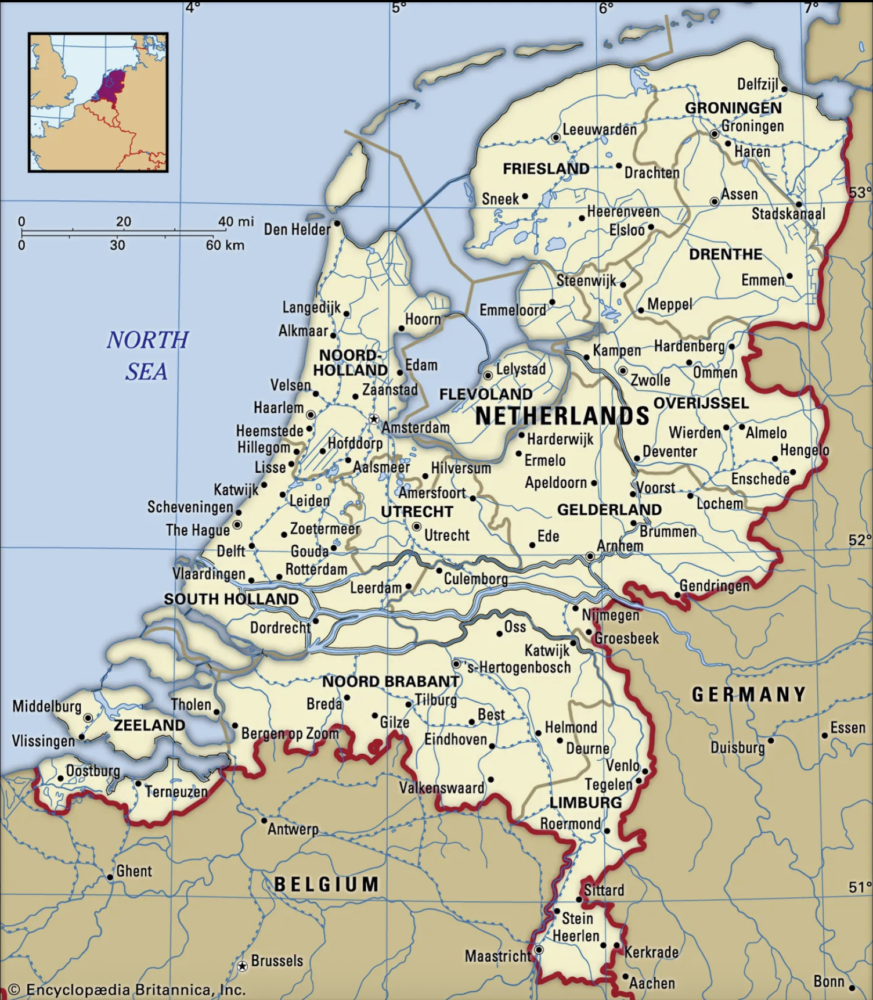
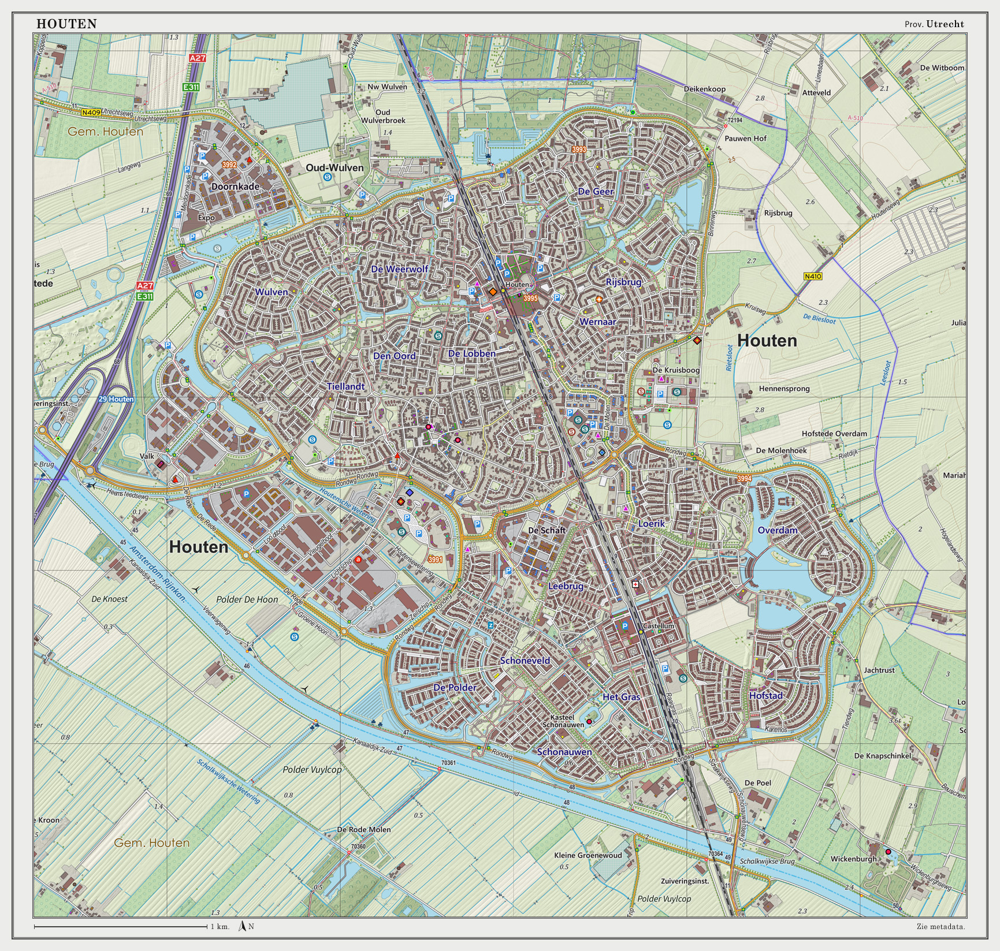
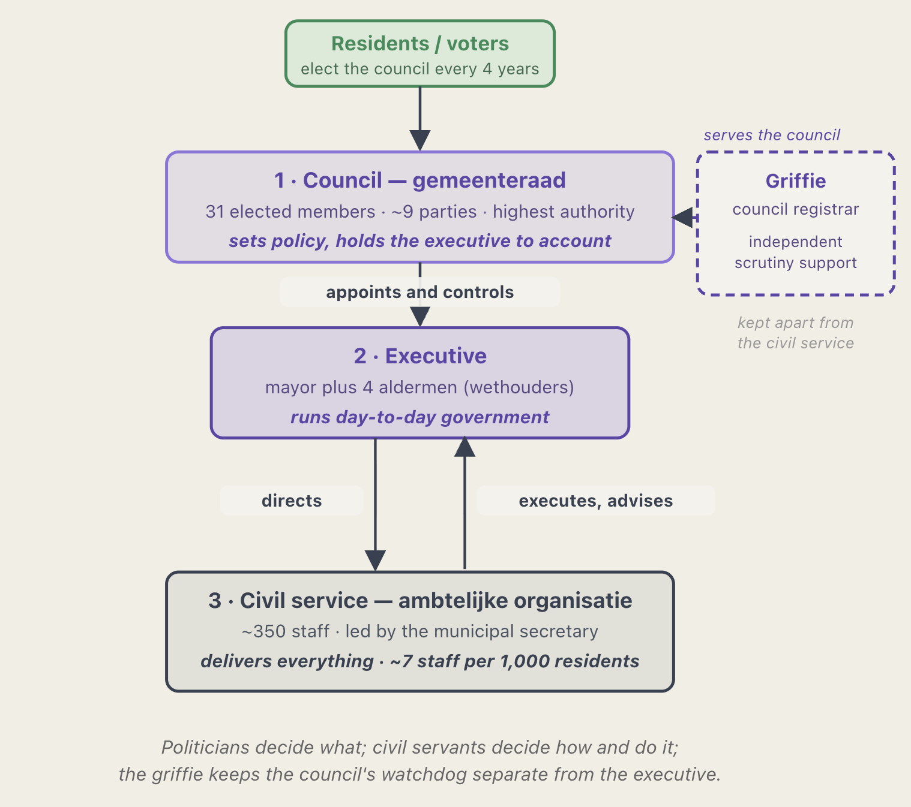
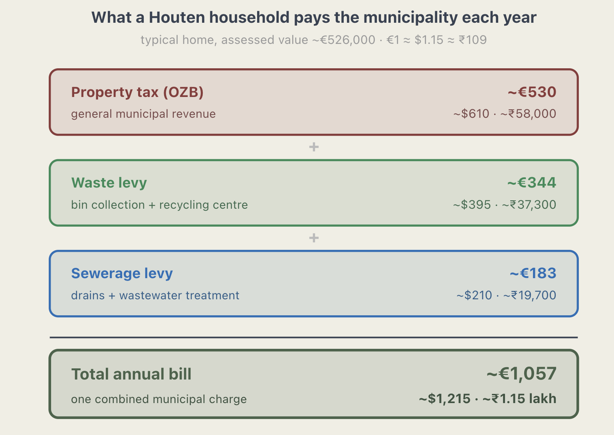

## Introduction

Many Indians who have been abroad do notice the stark difference between their own cities and well planned cities around the World. 
The discussions usually end up with complaints, about the lack of proper urban planning in Indian cities. 
In those discussions, people often point out the lack of green spaces, poor pedestrian infrastructure, and inadequate public transportation.
Many of these issues are interconnected and can be addressed through comprehensive urban planning strategies.

I decided to explore: 

1. **How well planned towns work?**
2. **What makes them livable?**
3. **What could be done to improve urban planning in towns of India?**

In this post, I focus on only the first question. For answering the first question, I will only focus on the case of Houten, a Dutch town that has successfully implemented world-class urban planning.

The Netherlands has a population of about 18.4 million people living in 12 provinces, among West, South, East and North regions. Houten is located in Utrecht, province. From Amsterdam, it is about 45 minutes by Car and 20 mins from Utrecht city. Urbanism is meticulously understanding the environment, and designing encompassing, physical form of cities, town planning, and the distinct cultural ways of life experienced by people living in the city. 

{#fig-twopaths fig-alt="Map of the Netherlands" out-width="65%"}
Netherlands map[@britannica_netherlands]. Source: *Encyclopaedia Britannica*, https://www.britannica.com/place/Netherlands

The Netherlands has few towns, cities that comes on the global ranking of Urban-Planned towns. 
This means, the towns would have higher living standard, with reasonable amount of trees, infrastructure. 
It also has proper space for bicycles and cars in the town. 

The Netherlands, known for world class cycling infrastructure, Innovative water management, and people centric design.
The Dutch are also known for decentralized design, purposefully avoid concentrating national wealth, government, and business in a single hub. The government sits in The Hague, while Amsterdam serves as the financial and cultural capital. They invented the woonerf, a residential street design where pedestrians, cyclists, and low-speed cars share the space equally without traditional curbs or traffic lights.

## Houten
Houten is 14.5 kms from Utrecht, Netherlands. Utrecht, Netherlands has a population of about 378,140 people.
Houten is considered one of the best designed towns in Netherlands. Some consider it as one of the best in the World. 
In Urban planning sphere, it was deliberately designed as Bicycle-friendly. The town’s whole structure makes cycling, walking, and train use easier than driving for daily local life. The Urban planning of Houten was designed by Dutch urban planner Robert Derks from the firm Wissing. 
Derks documented the planning process in his book "Het groen omarmd" (The Green Embraced).

{#fig-houten fig-alt="Houten" out-width="65%"}

**The Houten-Model**

**Design Principles:**

1. The Inversion Theory - green and people first, cars last
2. Ring Road System - a circular road system that minimizes through-traffic
3. Central Spine - a green corridor running through the center of the town
4. Strategic Car Access - cars reach homes but can't cut through the town center
5. 15-Minute City - ensuring all essential services are within a 15-minute walk or cycle

Houten's revolutionary approach, known as "Inversie-stedenbouw" (inversion urbanism), fundamentally reversed traditional planning priorities. 
Instead of starting with roads and adding green space as an afterthought, Houten began with green infrastructure as the foundation.

**Principles applied in Houten:**

- **Green First:** The central green spine and network of parks were designed first as the structural backbone.
- **Buildings Second:** Residential and commercial buildings were then arranged to embrace and enhance these green spaces.
- **Cars Last:** Vehicle access was accommodated only after the pedestrian, cycling, and green networks were established.
- **Continuous Green Network:** Rather than isolated parks, Houten created an interconnected system of green corridors, waterways, and open spaces.

## How is the Town Structured? 

In conventional planning, the road network often comes first. 
Land is then divided into plots, buildings are constructed, and parks, footpaths, cycle lanes, drains, and public spaces are added later if there is space left.
Levittown, New York in Long Island, is an example of this conventional approach.

{#fig-twopaths fig-alt="Reform" width="65%"}

In conventional postwar planning, the development is built around the private car.
Land is divided into plots, houses go up first, and the shared fabric, parks, footpaths, cycle lanes, public space is added later if room remains. 
Levittown, New York, on Long Island has 17,000 near-identical homes laid out for the automobile, with schools, shops, and parks following the houses rather than shaping them. Daily life there assumes a car for almost every trip. 

Houten begins from the opposite assumption. Houten inverted this logic. Its planners began with the green structure, public space, walking routes, cycling routes, schools, and town center connections. Buildings were then placed around this framework. Cars were accommodated, but they were not allowed to dominate the local structure of the town.

::: {.callout-note .callout-inversion title="Inversion Urbanism"}
Plan the slow, green, human network **first** then fit buildings around it, and let cars in **last**.
:::

The basic principle is that the slowest and most vulnerable users, children, pedestrians, cyclists, elderly people, and local residents, should receive the most direct and protected routes. Cars should remain useful, but they should not be allowed to cut through every neighborhood or control the design of public space.

### Ring Road System

The most famous part of Houten’s model is its ring road system. Instead of allowing cars to move directly through the town, Houten directs most car traffic to an outer ring road. From this ring road, cars enter residential neighborhoods through limited access points. This means a car can reach a house, but it usually cannot use the neighborhood as a shortcut. If a driver wants to go from one neighborhood to another, the route often requires going back to the ring road.

```{=html}
<figure style="margin: 2rem auto; max-width: 580px;">
<svg viewBox="0 0 600 620" xmlns="http://www.w3.org/2000/svg" font-family="system-ui, -apple-system, sans-serif">

  <!-- green skeleton -->
  <circle cx="300" cy="300" r="200" fill="#88DDA9" fill-opacity="0.18"/>

  <!-- ring road -->
  <circle cx="300" cy="300" r="200" fill="none" stroke="#FC8F0E" stroke-width="11"/>
  <text x="300" y="48" text-anchor="middle" font-size="15" font-weight="700" fill="#C26A00">Outer ring road</text>

  <!-- railway -->
  <line x1="70" y1="300" x2="530" y2="300" stroke="#374151" stroke-width="5" stroke-dasharray="2 8" stroke-linecap="round"/>
  <circle cx="300" cy="300" r="13" fill="#ffffff" stroke="#374151" stroke-width="3"/>
  <text x="300" y="335" text-anchor="middle" font-size="13" fill="#374151">Station</text>

  <!-- CAR ROUTE: up to the ring, along it, and back down -->
  <path d="M 170 235
           L 158 130
           A 200 200 0 0 1 442 130
           L 430 235"
        fill="none" stroke="#FC8F0E" stroke-width="4.5"
        stroke-dasharray="10 7" stroke-linecap="round"/>
  <polygon points="158,128 152,144 166,142" fill="#FC8F0E"/>
  <polygon points="430,235 422,221 438,223" fill="#FC8F0E"/>

  <!-- BIKE ROUTE: straight across -->
  <line x1="170" y1="235" x2="430" y2="235" stroke="#3E99F2" stroke-width="6" stroke-dasharray="11 6" stroke-linecap="round"/>
  <polygon points="430,235 414,228 414,242" fill="#3E99F2"/>

  <!-- CAR label, on a backing panel so it reads over the ring -->
  <rect x="178" y="172" width="244" height="22" rx="5" fill="#F4F2EC" fill-opacity="0.92"/>
  <text x="300" y="188" text-anchor="middle" font-size="13" fill="#C26A00" font-style="italic" font-weight="700">car: out to the ring, along, and back</text>

  <!-- BIKE label, on a backing panel -->
  <rect x="215" y="206" width="170" height="22" rx="5" fill="#F4F2EC" fill-opacity="0.92"/>
  <text x="300" y="222" text-anchor="middle" font-size="13" fill="#1E6FB8" font-style="italic" font-weight="700">bike: straight across</text>

  <!-- home & school -->
  <circle cx="170" cy="235" r="11" fill="#8D74DC"/>
  <circle cx="430" cy="235" r="11" fill="#8D74DC"/>
  <text x="170" y="270" text-anchor="middle" font-size="14" font-weight="700" fill="#5B45A8">Home</text>
  <text x="430" y="270" text-anchor="middle" font-size="14" font-weight="700" fill="#5B45A8">School</text>

  <!-- legend -->
  <g font-size="14" fill="#374151">
    <line x1="150" y1="545" x2="185" y2="545" stroke="#FC8F0E" stroke-width="5"/>
    <text x="195" y="550">Ring road (car traffic)</text>
    <line x1="150" y1="575" x2="185" y2="575" stroke="#3E99F2" stroke-width="6" stroke-dasharray="11 6"/>
    <text x="195" y="580">Cycling &amp; walking routes</text>
    <line x1="150" y1="605" x2="185" y2="605" stroke="#374151" stroke-width="5" stroke-dasharray="2 8"/>
    <text x="195" y="610">Railway</text>
  </g>

</svg>
<figcaption style="text-align:center; font-size:0.9rem; color:#666; margin-top:0.75rem; line-height:1.4;">
Filtered permeability: the same Home&nbsp;&rarr;&nbsp;School trip is short and direct by bike, but a long detour out to the ring road and back by car.
</figcaption>
</figure>
```

Cyclists and pedestrians experience the exact opposite. Where a car must detour out to the ring and back, a person on foot or on a bike moves straight through the town along a dense internal web of paths. This reversal has a name: **filtered permeability**, the network is deliberately "permeable" to walking and cycling while "filtering out" through-traffic by car. The walking and cycling routes are not just available; they are engineered to be *shorter and more direct* than the equivalent drive.

```{=html}
<figure style="margin: 2rem auto; max-width: 560px;">
<svg viewBox="0 0 600 460" xmlns="http://www.w3.org/2000/svg" font-family="system-ui, -apple-system, sans-serif">

  <!-- two neighborhood blocks -->
  <rect x="70"  y="120" width="180" height="180" rx="8" fill="#8D74DC" fill-opacity="0.12" stroke="#8D74DC" stroke-opacity="0.4"/>
  <rect x="350" y="120" width="180" height="180" rx="8" fill="#8D74DC" fill-opacity="0.12" stroke="#8D74DC" stroke-opacity="0.4"/>
  <text x="160" y="290" text-anchor="middle" font-size="13" fill="#5B45A8" font-weight="600">Neighborhood A</text>
  <text x="440" y="290" text-anchor="middle" font-size="13" fill="#5B45A8" font-weight="600">Neighborhood B</text>

  <!-- CAR: road that stops at the filter (the gap) -->
  <line x1="70"  y1="170" x2="270" y2="170" stroke="#FC8F0E" stroke-width="9" stroke-linecap="round"/>
  <line x1="330" y1="170" x2="530" y2="170" stroke="#FC8F0E" stroke-width="9" stroke-linecap="round"/>
  <!-- the filter: a barrier in the road -->
  <line x1="288" y1="155" x2="312" y2="185" stroke="#C0392B" stroke-width="4" stroke-linecap="round"/>
  <line x1="312" y1="155" x2="288" y2="185" stroke="#C0392B" stroke-width="4" stroke-linecap="round"/>
  <text x="300" y="135" text-anchor="middle" font-size="12" fill="#C0392B" font-weight="700">filter: cars stop here</text>

  <!-- BIKE: path that passes straight through the gap -->
  <line x1="70" y1="240" x2="530" y2="240" stroke="#3E99F2" stroke-width="6" stroke-dasharray="11 6" stroke-linecap="round"/>
  <polygon points="530,240 514,233 514,247" fill="#3E99F2"/>
  <text x="300" y="225" text-anchor="middle" font-size="12" fill="#1E6FB8" font-weight="700">bikes &amp; people pass straight through</text>

  <!-- legend -->
  <g font-size="13" fill="#374151">
    <line x1="120" y1="390" x2="155" y2="390" stroke="#FC8F0E" stroke-width="7"/>
    <text x="165" y="395">Car road (broken by the filter)</text>
    <line x1="120" y1="418" x2="155" y2="418" stroke="#3E99F2" stroke-width="6" stroke-dasharray="11 6"/>
    <text x="165" y="423">Walking &amp; cycling path (continuous)</text>
  </g>

</svg>
<figcaption style="text-align:center; font-size:0.85rem; color:#666; margin-top:0.6rem; line-height:1.4;">
Filtered permeability: a deliberate break in the road network stops cars from cutting through, while the walking and cycling network stays unbroken.
</figcaption>
</figure>
```

In Houten this is the organizing principle of the whole place. The payoff shows up for the people in the community, getting to school, the station, the shops, a park, a playground, or a friend's house. For each of these, cycling is faster and convenient. 

## Filtered permeability

The diagrams earlier showed the *principle*: the bike goes straight through, the
car detours out to the ring. This section is about the two questions a planner asks
 *how is that actually built into the ground*, and *does it measurably work?*

### How the filter is physically built

"Filtered permeability": leaving the walking-and-cycling network continuous while deliberately breaking
the car network. In Houten, this includes:

- **Modal filters:** a bollard, gate, or planted break that a bike or pedestrian
  passes but a car cannot, placed where a street would otherwise become a through-route.
- **Bicycle-permeable cul-de-sacs:** streets that read as dead ends to a driver but
  connect onward for cycles, so the car network is a series of branches off the ring
  while the cycle network is a continuous web.
- **Grade separation at the ring:** underpasses and tunnels carry cyclists *under* the busy ring road and rail line, so the two networks cross without conflicting.
- **Contraflow and short-cuts:** one-way streets opened to two-way cycling, and
  cut-throughs where roads are closed to motor traffic, which shorten the bike trip
  relative to the drive.

The design philosophy behind this has a name in the Dutch literature, *unbundling*
(*ontvlechten*): deliberately separating the car network from the cycle network rather
than running both down the same streets. The filter is the unbundling made physical.

```{=html}
<figure style="margin: 2rem auto; max-width: 560px;">
<svg viewBox="0 0 600 660" xmlns="http://www.w3.org/2000/svg" font-family="system-ui, -apple-system, sans-serif">

  <!-- green skeleton -->
  <circle cx="300" cy="300" r="230" fill="#88DDA9" fill-opacity="0.15"/>

  <!-- cycle path that exits UNDER the ring (drawn first so the ring covers it) -->
  <line x1="360" y1="200" x2="505" y2="108" stroke="#3E99F2" stroke-width="5" stroke-dasharray="10 6" stroke-linecap="round"/>
  <polygon points="505,108 489,107 497,122" fill="#3E99F2"/>

  <!-- ring road (covers the cycle line at the crossing = underpass) -->
  <circle cx="300" cy="300" r="230" fill="none" stroke="#FC8F0E" stroke-width="10"/>

  <!-- tunnel portal at the crossing -->
  <rect x="447" y="126" width="24" height="20" rx="3" fill="#F4F2EC" stroke="#374151" stroke-opacity="0.55"/>
  <text x="476" y="142" font-size="11.5" fill="#1E6FB8" font-weight="600">underpass</text>

  <!-- four neighbourhood zones (faint) -->
  <rect x="205" y="162" width="190" height="66" rx="10" fill="#8D74DC" fill-opacity="0.10" stroke="#8D74DC" stroke-opacity="0.35"/>
  <rect x="362" y="208" width="76" height="184" rx="10" fill="#8D74DC" fill-opacity="0.10" stroke="#8D74DC" stroke-opacity="0.35"/>
  <rect x="205" y="372" width="190" height="66" rx="10" fill="#8D74DC" fill-opacity="0.10" stroke="#8D74DC" stroke-opacity="0.35"/>
  <rect x="162" y="208" width="76" height="184" rx="10" fill="#8D74DC" fill-opacity="0.10" stroke="#8D74DC" stroke-opacity="0.35"/>

  <!-- CAR branches: each spur comes off the ring and forks into two dead-ends -->
  <g stroke="#FC8F0E" stroke-width="7" stroke-linecap="round" fill="none">
    <path d="M300,70 L300,150"/><path d="M300,150 L240,200"/><path d="M300,150 L360,200"/>
    <path d="M530,300 L450,300"/><path d="M450,300 L400,240"/><path d="M450,300 L400,360"/>
    <path d="M300,530 L300,450"/><path d="M300,450 L240,400"/><path d="M300,450 L360,400"/>
    <path d="M70,300 L150,300"/><path d="M150,300 L200,240"/><path d="M150,300 L200,360"/>
  </g>

  <!-- BIKE mesh: one continuous loop through every node, plus two diameters -->
  <polyline points="240,200 360,200 400,240 400,360 360,400 240,400 200,360 200,240 240,200"
            fill="none" stroke="#3E99F2" stroke-width="5" stroke-dasharray="10 6" stroke-linecap="round"/>
  <line x1="360" y1="200" x2="240" y2="400" stroke="#3E99F2" stroke-width="5" stroke-dasharray="10 6" stroke-linecap="round"/>
  <line x1="400" y1="360" x2="200" y2="240" stroke="#3E99F2" stroke-width="5" stroke-dasharray="10 6" stroke-linecap="round"/>

  <!-- cul-de-sac turning heads: car dead-ends sitting on the mesh nodes -->
  <g fill="#F4F2EC" stroke="#FC8F0E" stroke-width="4">
    <circle cx="240" cy="200" r="6"/><circle cx="360" cy="200" r="6"/>
    <circle cx="400" cy="240" r="6"/><circle cx="400" cy="360" r="6"/>
    <circle cx="360" cy="400" r="6"/><circle cx="240" cy="400" r="6"/>
    <circle cx="200" cy="360" r="6"/><circle cx="200" cy="240" r="6"/>
  </g>

  <!-- station / hub at the centre -->
  <circle cx="300" cy="300" r="12" fill="#ffffff" stroke="#374151" stroke-width="3"/>

  <!-- key labels on backing panels -->
  <rect x="186" y="80" width="228" height="22" rx="5" fill="#F4F2EC" fill-opacity="0.92"/>
  <text x="300" y="96" text-anchor="middle" font-size="12.5" fill="#C26A00" font-weight="700" font-style="italic">car: every branch dead-ends</text>

  <rect x="200" y="324" width="200" height="22" rx="5" fill="#F4F2EC" fill-opacity="0.92"/>
  <text x="300" y="340" text-anchor="middle" font-size="12.5" fill="#1E6FB8" font-weight="700" font-style="italic">bike: one connected mesh</text>

  <!-- legend -->
  <g font-size="13.5" fill="#374151">
    <line x1="90" y1="592" x2="125" y2="592" stroke="#FC8F0E" stroke-width="7" stroke-linecap="round"/>
    <text x="134" y="597">Ring road &amp; car branches &mdash; each spur dead-ends</text>
    <line x1="90" y1="622" x2="125" y2="622" stroke="#3E99F2" stroke-width="5" stroke-dasharray="10 6" stroke-linecap="round"/>
    <text x="134" y="627">Continuous cycle mesh (bike &amp; foot)</text>
  </g>

</svg>
<figcaption style="text-align:center; font-size:0.85rem; color:#666; margin-top:0.75rem; line-height:1.4;">
The two networks, overlaid: by car, every neighbourhood is a dead-end spur hanging off the ring, so a neighbour-to-neighbour trip must return to the ring. By bike, the same nodes are stitched into one continuous mesh through the centre; so the cyclist crosses directly. Each small ring is a cul-de-sac for cars <em>and</em> a junction on the cycle web.
</figcaption>
</figure>
```

### Rail Integration

The railway station is what keeps this local network from becoming a closed loop. Houten was conceived as a bicycle-*and*-rail town, and the two halves depend on each other: cycling solves the short distances inside the town, and rail solves the long ones beyond it. A resident can cycle a few minutes from home to the central station, leave the bike, and reach Utrecht shortly after; with connections, much of the Randstad becomes accessible without needing a car for the first leg. The later Houten Castellum station extended the same arrangement to the town's southern growth. Without the railway, Houten's compact, car-light design would risk leaving residents stranded; with it, the bicycle becomes the first leg of a regional journey rather than a constraint on one.

```{=html}
<figure style="margin: 2rem auto; max-width: 600px;">
<svg viewBox="0 0 620 230" xmlns="http://www.w3.org/2000/svg" font-family="system-ui, -apple-system, sans-serif">

  <!-- LOCAL zone (bike) -->
  <rect x="20" y="50" width="280" height="120" rx="10" fill="#88DDA9" fill-opacity="0.18"/>
  <text x="160" y="40" text-anchor="middle" font-size="13" font-weight="700" fill="#2E8B57">Inside Houten — short trips</text>

  <!-- REGIONAL zone (rail) -->
  <rect x="320" y="50" width="280" height="120" rx="10" fill="#374151" fill-opacity="0.10"/>
  <text x="460" y="40" text-anchor="middle" font-size="13" font-weight="700" fill="#374151">Beyond Houten — long trips</text>

  <!-- home -->
  <circle cx="65" cy="110" r="11" fill="#8D74DC"/>
  <text x="65" y="142" text-anchor="middle" font-size="12" font-weight="600" fill="#5B45A8">Home</text>

  <!-- bike leg -->
  <line x1="80" y1="110" x2="285" y2="110" stroke="#3E99F2" stroke-width="6" stroke-dasharray="11 6" stroke-linecap="round"/>
  <polygon points="285,110 269,103 269,117" fill="#3E99F2"/>
  <text x="180" y="98" text-anchor="middle" font-size="12" font-style="italic" fill="#1E6FB8" font-weight="700">cycle a few minutes</text>

  <!-- station (the hinge) -->
  <circle cx="310" cy="110" r="16" fill="#ffffff" stroke="#374151" stroke-width="3"/>
  <text x="310" y="160" text-anchor="middle" font-size="12" font-weight="700" fill="#374151">Station</text>

  <!-- rail leg -->
  <line x1="335" y1="110" x2="555" y2="110" stroke="#374151" stroke-width="5" stroke-dasharray="2 8" stroke-linecap="round"/>
  <polygon points="555,110 539,103 539,117" fill="#374151"/>
  <text x="450" y="98" text-anchor="middle" font-size="12" font-style="italic" fill="#374151" font-weight="700">train to Utrecht &amp; beyond</text>

  <!-- destination -->
  <circle cx="570" cy="110" r="11" fill="#374151"/>
  <text x="570" y="142" text-anchor="middle" font-size="12" font-weight="600" fill="#374151">Region</text>

</svg>
<figcaption style="text-align:center; font-size:0.85rem; color:#666; margin-top:0.5rem; line-height:1.4;">
The station is the hinge: cycling covers the short distances inside the town, rail covers the long ones beyond it.
</figcaption>
</figure>
```


### Green-Blue Network

The town's green structure does the quiet work that makes all of this hold together. Houten is organized around a continuous system of green corridors, parks, water features, play spaces, and landscape routes, and these are not the decorative offcuts left over once the buildings are placed. They are the skeleton the town is built on. The same green corridors that give children somewhere to play are the ones that carry the cycle paths; the same waterways that manage drainage also shape where neighborhoods begin and end. 

Because the green network and the movement network are one and the same, a calm, planted environment isn't a luxury added on top of mobility, it *is* the mobility. This is why Houten reads as more livable and community-minded than a conventional suburb: green space, movement, and everyday life were never separate systems competing for the same ground. They were designed as one.

```{=html}
<figure style="margin: 2rem auto; max-width: 480px;">
<svg viewBox="0 0 480 420" xmlns="http://www.w3.org/2000/svg" font-family="system-ui, -apple-system, sans-serif">

  <!-- three overlapping roles -->
  <circle cx="240" cy="150" r="115" fill="#88DDA9" fill-opacity="0.30"/>
  <circle cx="170" cy="265" r="115" fill="#3E99F2" fill-opacity="0.22"/>
  <circle cx="310" cy="265" r="115" fill="#FDD113" fill-opacity="0.30"/>

  <!-- role labels -->
  <text x="240" y="95"  text-anchor="middle" font-size="14" font-weight="700" fill="#2E8B57">Recreation</text>
  <text x="240" y="113" text-anchor="middle" font-size="11" fill="#2E8B57">parks &amp; play</text>

  <text x="118" y="300" text-anchor="middle" font-size="14" font-weight="700" fill="#1E6FB8">Mobility</text>
  <text x="118" y="318" text-anchor="middle" font-size="11" fill="#1E6FB8">cycle &amp; walk routes</text>

  <text x="362" y="300" text-anchor="middle" font-size="14" font-weight="700" fill="#B8860B">Water</text>
  <text x="362" y="318" text-anchor="middle" font-size="11" fill="#B8860B">drainage &amp; cooling</text>

  <!-- the shared center -->
  <text x="240" y="218" text-anchor="middle" font-size="13" font-weight="700" fill="#374151">one green</text>
  <text x="240" y="236" text-anchor="middle" font-size="13" font-weight="700" fill="#374151">network</text>

</svg>
<figcaption style="text-align:center; font-size:0.85rem; color:#666; margin-top:0.5rem; line-height:1.4;">
Houten's green-blue structure is a single network doing three jobs at once, recreation, mobility, and water management share the same ground.
</figcaption>
</figure>
```
The green-blue network performs multiple functions at once:

- it gives residents access to recreation and nature
- it carries walking and cycling routes
- it shapes neighborhood identity
- it supports drainage and water management
- it cools the urban environment
- it creates safe routes for children and elderly residents
- it prevents the town from becoming a continuous mass of asphalt and buildings

For professionals, this is a case of **multi-functional infrastructure**. The same corridor can support mobility, stormwater, ecology, recreation, and social life. This is especially relevant for Indian cities facing heat, flooding, and public-space shortages. A drainage channel should not be treated only as an engineering trench. A park should not be treated only as decoration. A shaded pedestrian path should not be treated as optional. These systems can be designed together.

## Hierarchy of Movement

Houten also works because it has a clear hierarchy of movement. Fast and heavy traffic belongs on the outer road. Local car access belongs inside neighborhoods but at low speeds and limited volumes. Cycling and walking receive direct routes through the center. Rail connects the town to the region. Green corridors and public spaces link daily destinations. This hierarchy prevents all forms of movement from fighting for the same street space.

```{=html}
<figure style="margin: 2rem auto; max-width: 560px;">
<svg viewBox="0 0 600 440" xmlns="http://www.w3.org/2000/svg" font-family="system-ui, -apple-system, sans-serif">

  <!-- tier 1: ring road -->
  <rect x="40" y="30" width="520" height="62" rx="8" fill="#FC8F0E" fill-opacity="0.16" stroke="#FC8F0E" stroke-width="2"/>
  <rect x="40" y="30" width="8" height="62" rx="4" fill="#FC8F0E"/>
  <text x="68" y="56" font-size="15" font-weight="700" fill="#C26A00">Outer ring road</text>
  <text x="68" y="78" font-size="12.5" fill="#7a5a2e">Fast, heavy through-traffic — kept to the edge</text>

  <!-- tier 2: local car access -->
  <rect x="40" y="104" width="520" height="62" rx="8" fill="#8D74DC" fill-opacity="0.14" stroke="#8D74DC" stroke-width="2"/>
  <rect x="40" y="104" width="8" height="62" rx="4" fill="#8D74DC"/>
  <text x="68" y="130" font-size="15" font-weight="700" fill="#5B45A8">Local car access</text>
  <text x="68" y="152" font-size="12.5" fill="#5a4a85">Inside neighborhoods only — low speed, low volume</text>

  <!-- tier 3: cycling & walking -->
  <rect x="40" y="178" width="520" height="62" rx="8" fill="#3E99F2" fill-opacity="0.14" stroke="#3E99F2" stroke-width="2"/>
  <rect x="40" y="178" width="8" height="62" rx="4" fill="#3E99F2"/>
  <text x="68" y="204" font-size="15" font-weight="700" fill="#1E6FB8">Cycling &amp; walking</text>
  <text x="68" y="226" font-size="12.5" fill="#2c5f8a">Direct routes straight through the centre</text>

  <!-- tier 4: rail -->
  <rect x="40" y="252" width="520" height="62" rx="8" fill="#374151" fill-opacity="0.10" stroke="#374151" stroke-width="2"/>
  <rect x="40" y="252" width="8" height="62" rx="4" fill="#374151"/>
  <text x="68" y="278" font-size="15" font-weight="700" fill="#374151">Rail</text>
  <text x="68" y="300" font-size="12.5" fill="#4b5563">Connects the town to the wider region</text>

  <!-- tier 5: green corridors -->
  <rect x="40" y="326" width="520" height="62" rx="8" fill="#88DDA9" fill-opacity="0.22" stroke="#2E8B57" stroke-width="2"/>
  <rect x="40" y="326" width="8" height="62" rx="4" fill="#2E8B57"/>
  <text x="68" y="352" font-size="15" font-weight="700" fill="#2E8B57">Green corridors &amp; public space</text>
  <text x="68" y="374" font-size="12.5" fill="#3c6b4f">The connective tissue linking daily destinations</text>

  <text x="300" y="418" text-anchor="middle" font-size="12.5" font-style="italic" fill="#666">Each mode gets its own space — so none has to fight for the street.</text>

</svg>
<figcaption style="text-align:center; font-size:0.85rem; color:#666; margin-top:0.5rem; line-height:1.4;">
Houten's hierarchy of movement: five layers, each with a defined role, so fast traffic, local access, cycling, rail, and green space never compete for the same ground.
</figcaption>
</figure>
```

Houten’s strength is integration: land use, cycling, walking, rail, green space, schools, neighborhood design, traffic filtering, and long-term maintenance are treated as one system. Cycling became the natural daily choice because the whole town was arranged to make it direct, safe, and useful.

Houten’s operational and long term success also depended on continuity. The design principles were protected and extended over decades. Later phases of Houten continued the same underlying logic: **green-first planning**, **cycle priority**, **controlled car access**, and **neighborhood structure**. This long-term design discipline is one of the main reasons why Houten succeeded.

## Transportation: Bicycle network Houten

The cycling network is treated like a public utility, continuous, legible, maintained, connected to schools and stations, and protected from heavy traffic. 
For civil engineers, the important question is how it is built: width, surface, buffer, gradient, crossing treatment, drainage, lighting, and maintenance access.

A civil engineer thinks in section: how wide, how high, what gradient, what surface, what clearance, what drainage, and what maintenance access? 
Those details matter. Houten’s cycling infrastructure broadly follows the Dutch CROW design[@crow2017bicycle] logic: directness, safety, comfort, coherence, and attractiveness.

### Cycle path cross-sections

| Facility | CROW width | When used |
|----------|-----------:|-----------|
| One-way cycle track | **2.0 m min · 2.5 m desirable** | branches off the main network |
| Two-way cycle track (solitary) | **3.0 m min · 3.5–4.0 m standard** | Houten's red through-routes |
| By volume (one-way) | 2.0 m ≤150/hr · 3.0 m 150–750/hr · 4.0 m >750/hr | sized to demand, not guessed |
| Local pinch points | down to 1.5 m | only briefly, e.g. at a constrained crossing |

: CROW cycle-facility widths as applied in Houten {.striped .hover}

The defining detail is the **separation** beside it. A Dutch cycle *track* (as opposed to a painted lane) is physically divided from the carriageway
by a verge, raised kerb, or planted strip, typically **1.5–2.0 m** of buffer. This is the *ontvlechten* (unbundling) principle made concrete: the car network and the cycle network do not share a surface. The tracks themselves are **machine laid red asphalt** a continuous, smooth, low-rolling-resistance surface that stays usable in rain and winter, with the red colour doing the legibility work so the network reads as one object across the whole town.

```{=html}
<figure style="margin: 2rem auto; max-width: 620px;">
<svg viewBox="0 0 640 300" xmlns="http://www.w3.org/2000/svg" font-family="system-ui, -apple-system, sans-serif">

  <!-- sky/background -->
  <rect x="0" y="0" width="640" height="180" fill="#ffffff"/>
  <!-- ground -->
  <rect x="0" y="180" width="640" height="40" fill="#E9E4D8"/>
  <line x1="0" y1="180" x2="640" y2="180" stroke="#9c9485" stroke-width="2"/>

  <!-- carriageway -->
  <rect x="30" y="150" width="190" height="30" fill="#FC8F0E" fill-opacity="0.85"/>
  <line x1="125" y1="155" x2="125" y2="175" stroke="#ffffff" stroke-width="2" stroke-dasharray="8 6"/>
  <text x="125" y="140" text-anchor="middle" font-size="12.5" font-weight="700" fill="#C26A00">Carriageway</text>

  <!-- separation verge -->
  <rect x="220" y="166" width="90" height="14" fill="#88DDA9"/>
  <path d="M245 166 q3 -10 6 0 M260 166 q3 -10 6 0 M275 166 q3 -10 6 0" fill="none" stroke="#2E8B57" stroke-width="1.6"/>
  <text x="265" y="138" text-anchor="middle" font-size="11.5" font-weight="700" fill="#2E8B57">Verge</text>

  <!-- two-way cycle track -->
  <rect x="310" y="158" width="230" height="22" fill="#3E99F2" fill-opacity="0.85"/>
  <line x1="425" y1="160" x2="425" y2="178" stroke="#ffffff" stroke-width="1.5" stroke-dasharray="6 5"/>
  <text x="425" y="140" text-anchor="middle" font-size="12.5" font-weight="700" fill="#1E6FB8">Two-way cycle track (red asphalt)</text>

  <!-- dimension lines -->
  <g stroke="#374151" stroke-width="1.2" fill="#374151" font-size="12">
    <!-- carriageway dim -->
    <line x1="30" y1="245" x2="220" y2="245"/>
    <line x1="30" y1="240" x2="30" y2="250"/>
    <line x1="220" y1="240" x2="220" y2="250"/>
    <text x="125" y="263" text-anchor="middle">~5.5–6.0 m</text>
    <!-- verge dim -->
    <line x1="220" y1="245" x2="310" y2="245"/>
    <line x1="220" y1="240" x2="220" y2="250"/>
    <line x1="310" y1="240" x2="310" y2="250"/>
    <text x="265" y="263" text-anchor="middle">1.5–2.0 m</text>
    <!-- cycle dim -->
    <line x1="310" y1="245" x2="540" y2="245"/>
    <line x1="310" y1="240" x2="310" y2="250"/>
    <line x1="540" y1="240" x2="540" y2="250"/>
    <text x="425" y="263" text-anchor="middle">3.5–4.0 m</text>
  </g>

  <text x="320" y="290" text-anchor="middle" font-size="11.5" font-style="italic" fill="#666">Typical section: the cycle track is physically unbundled from the carriageway by a planted verge, not a painted line.</text>

</svg>
<figcaption style="text-align:center; font-size:0.85rem; color:#666; margin-top:0.4rem; line-height:1.4;">
A typical Houten cross-section, to CROW standards. The buffer between car and bike is the design — paint is not separation.
</figcaption>
</figure>
```

**Crossing the ring and the rail: Grade separation**

Where the cycle network meets the ring road or the railway, Houten does not negotiate the conflict with signals:  it **removes** it, by carrying cyclists *under* the barrier in an underpass or *over* it on a bridge. The governing standard here is not width but **social safety** (*sociale veiligheid*): a tunnel a cyclist is afraid to use at night has failed, however structurally sound. The CROW[@crow2017bicycle] rules of thumb as built in Houten:

- **Vertical clearance**:  a minimum of about **2.5 m**, often **2.5–3.0 m**, so the
  space feels open rather than a culvert.
- **Sightline through**:  the underpass is straight and short enough that you can see
  daylight at the far end before you enter it; no blind corners, no hidden recesses.
- **Width and light**: generous width (wider than the path it carries), bright even
  lighting, and where possible a partly open top or rooflight so daytime use needs no
  lamps.
- **Gradient**:  ramps kept gentle for comfort and for less-able cyclists, in the order
  of **1:20–1:25** on the longer approaches, steeper only over short rises.
- **Drainage**: because the underpass dips below grade it is the low point of the
  local surface, so it needs a sump with a pump or a generously sized infiltration
  drain; a flooded tunnel is the most common failure mode of this detail.

At the key internal ring connection, Houten goes further still, with a **multi-level,
segregated road-and-cycle roundabout** : cars and bikes resolved onto different
planes entirely. At at-grade points the standard Dutch treatment applies: a
**continuous annular cycle track set back ~5 m** from the circulatory carriageway (so
a car clears the crossing without blocking a cyclist), with cyclists given priority on
urban roundabouts.

```{=html}
<figure style="margin: 2rem auto; max-width: 600px;">
<svg viewBox="0 0 620 280" xmlns="http://www.w3.org/2000/svg" font-family="system-ui, -apple-system, sans-serif">

  <!-- ground mass -->
  <rect x="0" y="60" width="620" height="160" fill="#E9E4D8"/>

  <!-- ring road on top -->
  <rect x="240" y="60" width="150" height="26" fill="#FC8F0E" fill-opacity="0.85"/>
  <line x1="315" y1="64" x2="315" y2="82" stroke="#ffffff" stroke-width="2" stroke-dasharray="7 5"/>
  <text x="315" y="52" text-anchor="middle" font-size="12.5" font-weight="700" fill="#C26A00">Ring road (over)</text>

  <!-- the cut: underpass void -->
  <path d="M40 150
           L210 150
           Q250 150 270 120
           L360 120
           Q380 150 420 150
           L580 150
           L580 200
           L40 200 Z"
        fill="#ffffff" stroke="#9c9485" stroke-width="1.5"/>

  <!-- cycle path through the underpass -->
  <path d="M40 175 L215 175 Q250 175 268 150 L362 150 Q380 175 415 175 L580 175"
        fill="none" stroke="#3E99F2" stroke-width="6" stroke-linecap="round"/>
  <polygon points="580,175 564,168 564,182" fill="#3E99F2"/>

  <!-- clearance dimension -->
  <line x1="315" y1="86" x2="315" y2="148" stroke="#374151" stroke-width="1.2"/>
  <line x1="308" y1="86" x2="322" y2="86" stroke="#374151" stroke-width="1.2"/>
  <line x1="308" y1="148" x2="322" y2="148" stroke="#374151" stroke-width="1.2"/>
  <rect x="328" y="104" width="92" height="20" rx="4" fill="#F4F2EC" fill-opacity="0.95"/>
  <text x="374" y="118" text-anchor="middle" font-size="12" fill="#374151" font-weight="700">≥ 2.5–3.0 m</text>

  <!-- gradient label -->
  <text x="120" y="168" text-anchor="middle" font-size="11.5" font-style="italic" fill="#1E6FB8">ramp ~1:20</text>

  <!-- daylight/ sightline note -->
  <text x="500" y="168" text-anchor="middle" font-size="11.5" font-style="italic" fill="#2E8B57">daylight visible through</text>

  <text x="310" y="232" text-anchor="middle" font-size="12.5" font-weight="700" fill="#374151">Cyclists pass UNDER the ring — conflict removed, not signalised</text>
  <text x="310" y="252" text-anchor="middle" font-size="11.5" font-style="italic" fill="#666">Social safety governs: straight, lit, open-ended, drained at the low point.</text>

</svg>
<figcaption style="text-align:center; font-size:0.85rem; color:#666; margin-top:0.4rem; line-height:1.4;">
The ring crossing in section. The expensive, invisible part of filtered permeability is the grade separation that makes the bike route genuinely continuous.
</figcaption>
</figure>
```
## Transportation: Car usage in Houten

 **Houtenaars own plenty of cars.** The measured mode split for journeys *within* Houten is striking, cycling around **34%**, walking **14%**, public transport **5%** and the **private car still about 46%.** For short trips under 7.5 km the bike does much better (cycling ~48%, car ~29%), and for trips to the town centre cycling reaches ~61%. But the town has **not** abolished the car, it has **demoted it for local trips while leaving it available for everything else.**

```{=html}
<figure style="margin: 2rem auto; max-width: 560px;">
<svg viewBox="0 0 600 320" xmlns="http://www.w3.org/2000/svg" font-family="system-ui, -apple-system, sans-serif">

  <text x="300" y="30" text-anchor="middle" font-size="14" font-weight="700" fill="#374151">Mode share for trips inside Houten</text>

  <!-- bars -->
  <g font-size="12.5" fill="#374151">
    <!-- car 46 -->
    <rect x="170" y="55" width="276" height="34" rx="4" fill="#FC8F0E" fill-opacity="0.85"/>
    <text x="160" y="77" text-anchor="end" font-weight="700">Car</text>
    <text x="456" y="77" font-weight="700" fill="#C26A00">46%</text>
    <!-- bike 34 -->
    <rect x="170" y="99" width="204" height="34" rx="4" fill="#3E99F2" fill-opacity="0.85"/>
    <text x="160" y="121" text-anchor="end" font-weight="700">Bicycle</text>
    <text x="384" y="121" font-weight="700" fill="#1E6FB8">34%</text>
    <!-- walk 14 -->
    <rect x="170" y="143" width="84" height="34" rx="4" fill="#2E8B57" fill-opacity="0.85"/>
    <text x="160" y="165" text-anchor="end" font-weight="700">Walk</text>
    <text x="264" y="165" font-weight="700" fill="#2E8B57">14%</text>
    <!-- pt 5 -->
    <rect x="170" y="187" width="30" height="34" rx="4" fill="#8D74DC" fill-opacity="0.85"/>
    <text x="160" y="209" text-anchor="end" font-weight="700">Transit</text>
    <text x="210" y="209" font-weight="700" fill="#5B45A8">5%</text>
  </g>

  <text x="300" y="258" text-anchor="middle" font-size="12" font-style="italic" fill="#666">For short trips (&lt;7.5 km) the picture flips: bike ~48%, car ~29%.</text>
  <text x="300" y="282" text-anchor="middle" font-size="12" font-style="italic" fill="#666">To the town centre, cycling reaches ~61%.</text>
  <text x="300" y="306" text-anchor="middle" font-size="11" fill="#999">Source: OVIN / Goudappel-Coffeng survey data, via Hickman (2025).</text>

</svg>
<figcaption style="text-align:center; font-size:0.85rem; color:#666; margin-top:0.5rem; line-height:1.4;">
The honest number: the car still carries nearly half of all internal trips. Houten <em>demoted</em> the car for short local journeys, it did not eliminate it.
</figcaption>
</figure>
```

::: {.callout-warning title="The limit of the model, stated plainly"}
Houten is a **micro-scale** solution. It brilliantly solves the short, internal, everyday trip, school, shop, station, friend's house, and pushes those onto the bike. It does **not** solve the longer regional and commuter journeys, which is why the car still takes ~46% of internal trips and car *ownership* remains high. 
:::

## Schools, Children, Supermarket and Mobility

One of Houten’s strongest achievements is the placement of schools and daily destinations along the slow-mobility network. This gives children a degree of independence that is rare in car-dominated suburbs. In many towns, children depend on parents for every trip because the street network is unsafe. This creates traffic congestion near schools, wastes family time, increases pollution, and reduces children’s freedom. 

{#fig-houten fig-alt="Houten High School" out-width="65%"}

Houten shows another possibility, if schools are directly connected to safe cycling and walking routes, children can move more independently. All vital urban functions, including schools, are located directly at the main cycle network. Bicycle routes to schools are direct, smooth, and high-quality. Asphalt surfaces, Red-colored, recognizable paths, No traffic lights on main routes, ensuring flowing cycle traffic without delays. 

{#fig-houten fig-alt="A cycle route and a footpath in a residential area of Houten" out-width="65%"}

At intersections with car roads, bicycle traffic flows through tunnels or bridges, keeping cyclists separate from cars. 

Because schools are on the protected bike network and only ~1.6 km away, 99% of children go to school by bike or other active modes, and many cycle independently from a young age. Average cycling distance to the nearest primary school is less than 0.6 km. And 18% of Houten residents live ≤500 m from a grocery store. 
50% live <1 km from a grocery store. The average is 1.2 km.

::: {.callout-tip appearance="simple"}
A truly well-planned town lets children move safely on their own, without every trip to school becoming a family transport operation.
:::

Houten is well-served by Dutch grocery chains, with 18% of residents living ≤500 m from a grocery store and 50% within 1 km
The Houten weekly market runs every Thursday from 08:00 to 14:00 at the central Winkelcentrum 't Rond. It’s the perfect place to shop for fresh, local produce, cheeses, baked goods, and household items right in the heart of the city.

In this picture, Jumbo, an international supermarket chain is visible, notice the infrastructure, designated zoning for cycling. On the right side, there is Jumbo with a dedicated parking lot for car users. 

{#fig-houten fig-alt="An area of Houten with a Jumbo supermarket" out-width="65%"}

The town also has dedicated, Cafe and active nightlife areas, cultural center for events and activities, Nieuwegeinse Golfclub (Golf-area) and Churches for religious worship areas.

### Houten's Network, Layer by Layer

Houten is not a single-use bedroom suburb. It combines housing, schools, shops, railway stations, public services, parks, sports fields, water corridors, and local employment areas within a compact town structure. The town center and station area carry the higher-intensity civic and commercial functions. Residential neighborhoods are placed around green corridors and cycle routes. Schools and sports facilities sit close to the cycling network. Larger car-oriented access is pushed outward toward the ring road. This creates a hierarchy: quiet residential life inside, regional movement by rail, car circulation at the edge, and daily services placed where walking and cycling can reach them.

```{=html}
<style>
.leaflet-control-layers {
  font-size: 16px !important;
  line-height: 1.6 !important;
  padding: 10px 14px !important;
  background: #ffffff !important;
  border-radius: 8px !important;
  box-shadow: 0 2px 8px rgba(0,0,0,0.25) !important;
}
.leaflet-control-layers label {
  font-size: 16px !important;
  font-weight: 500 !important;
  color: #1a1a1a !important;
  margin-bottom: 4px !important;
}
.leaflet-control-layers-overlays {
  line-height: 1.8 !important;
}
.leaflet-popup-content {
  font-size: 15px !important;
  color: #1a1a1a !important;
}
.leaflet-container {
  font-size: 15px !important;
}
</style>
```

```{r}
#| echo: false
#| message: false
#| warning: false

library(leaflet)
library(sf)
library(dplyr)

osm <- readRDS("houten_osm.rds")
roads <- st_transform(osm$roads, 4326)
rail  <- if (!is.null(osm$rail)) st_transform(osm$rail, 4326) else roads[0, ]

for (nm in c("highway", "name", "bicycle", "foot")) {
  if (!nm %in% names(roads)) roads[[nm]] <- NA_character_
}
if (!"railway" %in% names(rail)) rail$railway <- NA_character_

major_roads <- roads |> filter(highway %in% c(
  "motorway","trunk","primary","secondary",
  "motorway_link","trunk_link","primary_link","secondary_link"))
tertiary_roads <- roads |> filter(highway %in% c("tertiary","tertiary_link"))
residential_streets <- roads |> filter(highway %in% c("residential","living_street","unclassified"))
cycle_paths <- roads |> filter(highway == "cycleway" | bicycle %in% c("designated","yes"))
footways_paths <- roads |> filter(highway %in% c("footway","path","pedestrian","steps"))
service_roads <- roads |> filter(highway == "service")

cols <- list(major="#E8590C", tertiary="#F0A500", residential="#6741D9",
             cycle="#1C7ED6", foot="#2F9E44", rail="#212529", service="#15AABF")

add_group <- function(map, data, group, color, weight, opacity = 0.65) {
  if (is.null(data) || nrow(data) == 0) return(map)
  addPolylines(map, data = data, group = group, color = color,
               weight = weight, opacity = opacity,
               popup = paste0("<b>", group, "</b>"))
}

m <- leaflet(height = 650, options = leafletOptions(preferCanvas = TRUE)) |>
  # Light base map WITHOUT labels
  addProviderTiles(providers$CartoDB.PositronNoLabels) |>
  setView(lng = 5.165, lat = 52.030, zoom = 13) |>
  # High pane so labels sit above the road lines (overlayPane = 400)
  addMapPane("labels", zIndex = 450)

m <- add_group(m, major_roads, "Major Roads", cols$major, 3)
m <- add_group(m, tertiary_roads, "Tertiary Roads", cols$tertiary, 2)
m <- add_group(m, service_roads, "Service Roads", cols$service, 1, opacity = 0.5)
m <- add_group(m, footways_paths, "Footways & Paths", cols$foot, 1, opacity = 0.5)
m <- add_group(m, cycle_paths, "Cycle Paths", cols$cycle, 1.5, opacity = 0.7)
m <- add_group(m, residential_streets, "Residential Streets", cols$residential, 0.8, opacity = 0.55)
m <- add_group(m, rail, "Railway Lines", cols$rail, 2.5, opacity = 0.7)

# Labels-only layer ON TOP, drawn into the high pane
m <- m |> addProviderTiles(
  providers$CartoDB.PositronOnlyLabels,
  options = providerTileOptions(pane = "labels"))

m |> addLayersControl(
  overlayGroups = c("Major Roads","Tertiary Roads","Residential Streets",
                    "Cycle Paths","Footways & Paths","Railway Lines","Service Roads"),
  options = layersControlOptions(collapsed = FALSE))
```

<small style="font-size: 14px; color: #333;">
Map data: OpenStreetMap[@osm_houten] contributors. Visualization by Rick Rejeleene, after the Houten street-network map idea shown by Langley Urbanist Society.
</small>

## Land Use and the Zoning Mechanism

A diagram of green corridors explains the *shape* of Houten. It does not explain why forty years later, a developer cannot simply buy a plot beside the central spine and put a drive-through and a car park on it.  It is a **legal instrument** that binds every square metre of the town to a permitted
use, and it is the single most under-appreciated reason the inversion model survived into its second generation.

The original brief deliberately mixed uses so that daily needs sit *inside* the cycling network rather than out on the ring. In broad terms the built land breaks down roughly as follows, useful as a planning order of magnitude rather than a cadastral fact:

| Land use | Share of built area (approx.) | What it includes |
|----------|------------------------------:|------------------|
| **Residential** | ~55–60% | Low-rise houses and modest apartments, ~50,000 residents |
| **Green & blue / public space** | ~20% | The spine, parks, water, sports fields, play areas |
| **Roads, cycle tracks, parking** | ~10% | Ring, internal streets, the red cycle web, station transferia |
| **Centres & retail** | ~5% | Two station-side centres (Houten Centrum, Castellum) |
| **Employment / civic / schools** | ~8–10% | Schools, offices, sports halls, cultural and care buildings |

: Indicative land-use split for built-up Houten {.striped .hover}

The structurally important number is the last three rows together: **shops, schools, jobs and civic buildings are placed beside the two railway stations and along the slow network**, not banished to a motorway junction. Each station sits in the *core* of its ring, so that, by the original design rule, no home is more than about two kilometres from a station, and the shops, library and amenities are at the station plaza you can already cycle to. Mixed use is therefore not decoration; it is what makes the 15-minute distances real.

::: {.callout-note title="Why the mix matters more than the buildings"}
A green corridor with nothing to cycle *to* is a park, not a transport network. Houten works because the destinations, school, shop, station, sports hall, were deliberately scattered *along* the slow network at the planning stage. Separate the uses (housing here, retail by the motorway, jobs in a business park) and the bicycle stops being useful the moment you need to buy anything. Land-use mix is the hidden half of filtered permeability.
:::

## Governance and Finance

Design and planning are the theoretical part. The real test of a town like Houten is whether the *machine behind it* the budget, the payroll, the people who show
up at the depot every morning, actually adds up. A town planner will not be convinced by cycle-path photos, they will ask **where the money comes from, where
it goes, who is paid to do the work, and what is set aside for the future.** 

This section answers those questions with Houten's own 2026 figures[@houten2026budget].

## Finances: Where the Money Comes From?

Houten's total 2026 budget is about **€151 million**. 
If we translate to USD, that is **~\$174 million**. 
In Indian rupees, **~₹1,650 crore**, for a town of just over 50,000 people. 

Per resident, that works out to roughly **€2,950 / \$3,390 / ₹3.2 lakh per year.** 
Crucially, Houten does not make most of this. Much of this funding is *transferred* from the Dutch central government.

| Source of income | EUR | USD | INR |
|------------------|-----|-----|-----|
| **Central government** (gemeentefonds) | €90.1 m | \$103.6 m | ₹982 cr |
| Area-development proceeds | €24.6 m | \$28.3 m | ₹268 cr |
| **Property tax (OZB)** | €18.3 m | \$21.0 m | ₹199 cr |
| Waste levy (afvalstoffenheffing) | €6.4 m | \$7.4 m | ₹70 cr |
| Sewerage levy (rioolheffing) | €4.1 m | \$4.7 m | ₹45 cr |
| Draw from general reserve | €4.2 m | \$4.8 m | ₹46 cr |
| General fees / permits (leges) | €1.4 m | \$1.6 m | ₹15 cr |
| Tourist & burial taxes | €0.5 m | \$0.6 m | ₹5 cr |
| **Total** | **€151 m** | **\$174 m** | **₹1,650 cr** |

: Houten's 2026 income {.striped .hover}

::: {.callout-important title="The single most important governance fact"}
**About 60% of the budget is not raised locally, it is a block grant from The Hague.**
A Dutch town has limited power to grow its own income; its main lever is the property
tax (OZB), which Houten *raised* for 2026 because central transfers are shrinking. This
is the opposite of fiscal independence, and it is why every Dutch municipality watches
the national "gemeentefonds circulaires" the way a farmer watches the monsoon.
:::

```{=html}
<div class="houten-budget">
  <div class="houten-budget-title">
    Houten 2026 income: €151.1m / $173.8m / ₹1,647 cr
  </div>

  <div class="houten-budget-row">
    <div class="houten-budget-label">59.6%: Central government grant: €90.1m / $103.6m / ₹982 cr</div>
    <div class="houten-budget-bar-wrap"><div class="houten-budget-bar" style="width:59.6%; background:#48634a;"></div></div>
    <div class="houten-budget-note">The gemeentefonds: a national block grant from The Hague to the municipality.</div>
  </div>

  <div class="houten-budget-row">
    <div class="houten-budget-label">16.3%: Area-development proceeds: €24.6m / $28.3m / ₹268 cr</div>
    <div class="houten-budget-bar-wrap"><div class="houten-budget-bar" style="width:16.3%; background:#8a6f3f;"></div></div>
    <div class="houten-budget-note">Income from land and area-development activity.</div>
  </div>

  <div class="houten-budget-row">
    <div class="houten-budget-label">12.1%: Property tax (OZB): €18.3m / $21.0m / ₹199 cr</div>
    <div class="houten-budget-bar-wrap"><div class="houten-budget-bar" style="width:12.1%; background:#8b3a3a;"></div></div>
    <div class="houten-budget-note">The main locally raised tax on homes and non-residential property.</div>
  </div>

  <div class="houten-budget-row">
    <div class="houten-budget-label">4.2%: Waste levy: €6.4m / $7.4m / ₹70 cr</div>
    <div class="houten-budget-bar-wrap"><div class="houten-budget-bar" style="width:4.2%; background:#6f7f58;"></div></div>
    <div class="houten-budget-note">Fee paid by households for waste collection and processing.</div>
  </div>

  <div class="houten-budget-row">
    <div class="houten-budget-label">2.8%: Draw from general reserve: €4.2m / $4.8m / ₹46 cr</div>
    <div class="houten-budget-bar-wrap"><div class="houten-budget-bar" style="width:2.8%; background:#6f6f83;"></div></div>
    <div class="houten-budget-note">Using savings/reserves to balance the budget or fund planned needs.</div>
  </div>

  <div class="houten-budget-row">
    <div class="houten-budget-label">2.7%: Sewerage levy: €4.1m / $4.7m / ₹45 cr</div>
    <div class="houten-budget-bar-wrap"><div class="houten-budget-bar" style="width:2.7%; background:#3f748a;"></div></div>
    <div class="houten-budget-note">Fee for sewerage, drainage, wastewater, and related water-management costs.</div>
  </div>

  <div class="houten-budget-row">
    <div class="houten-budget-label">1.0%: Other financial/organisational income: €1.5m / $1.7m / ₹16 cr</div>
    <div class="houten-budget-bar-wrap"><div class="houten-budget-bar" style="width:1.0%; background:#9a7a56;"></div></div>
    <div class="houten-budget-note">Other budgeted income listed in the municipal summary.</div>
  </div>

  <div class="houten-budget-row">
    <div class="houten-budget-label">0.9%: General fees and permits: €1.4m / $1.6m / ₹15 cr</div>
    <div class="houten-budget-bar-wrap"><div class="houten-budget-bar" style="width:0.9%; background:#b85c38;"></div></div>
    <div class="houten-budget-note">Fees for permits, documents, and municipal services.</div>
  </div>

  <div class="houten-budget-row">
    <div class="houten-budget-label">0.3%: Tourist and burial taxes: €0.5m / $0.6m / ₹5 cr</div>
    <div class="houten-budget-bar-wrap"><div class="houten-budget-bar" style="width:0.3%; background:#7a5c99;"></div></div>
    <div class="houten-budget-note">Small local taxes from tourism and burial-related charges.</div>
  </div>
</div>
```

## Municipal Finances: Where the Money Goes?

Houten's 2026 budget is organised into **six programmes**. A programme is simply a
large policy bucket: money grouped around a public purpose, not one single project.

The surprising lesson is this: **Houten is famous for cycling and green planning, but
most of its municipal spending is not on cycle paths or roads. It is on care, welfare,
and social support.**

```{=html}
<style>
.houten-budget {
  margin: 1.5rem 0;
  padding: 1rem;
  background: #f8f7f1;
  border-left: 5px solid #48634a;
  font-family: system-ui, -apple-system, BlinkMacSystemFont, "Segoe UI", sans-serif;
}

.houten-budget-title {
  font-size: 1.15rem;
  font-weight: 700;
  margin-bottom: 1rem;
}

.houten-budget-row {
  margin: 0.9rem 0;
}

.houten-budget-label {
  font-weight: 700;
  margin-bottom: 0.25rem;
}

.houten-budget-bar-wrap {
  width: 100%;
  height: 26px;
  background: #e4e1d8;
  border-radius: 4px;
  overflow: hidden;
}

.houten-budget-bar {
  height: 26px;
  border-radius: 4px;
}

.houten-budget-note {
  margin-top: 0.25rem;
  font-size: 0.95rem;
  line-height: 1.35;
}

.social { width: 51%; background: #8b3a3a; }
.green { width: 20.2%; background: #4f7f58; }
.admin { width: 17%; background: #6f6f83; }
.cycling { width: 4.2%; background: #d9a441; }
.safety { width: 4%; background: #b85c38; }
.democracy { width: 3.6%; background: #7a5c99; }
</style>

<div class="houten-budget">
  <div class="houten-budget-title">
    Houten 2026 budget: €151.1m / $173.8m / ₹1,647 cr
  </div>

  <div class="houten-budget-row">
    <div class="houten-budget-label">51.0%: Social care and welfare: €77.1m / $88.7m / ₹840 cr</div>
    <div class="houten-budget-bar-wrap"><div class="houten-budget-bar social"></div></div>
    <div class="houten-budget-note">Youth care, Wet maatschappelijke ondersteuning, elderly and disability support, welfare, benefits, social participation.</div>
  </div>

  <div class="houten-budget-row">
    <div class="houten-budget-label">20.2%: Green and future-proof Houten: €30.5m / $35.1m / ₹332 cr</div>
    <div class="houten-budget-bar-wrap"><div class="houten-budget-bar green"></div></div>
    <div class="houten-budget-note">Nature, housing, climate adaptation, sustainability, energy transition.</div>
  </div>

  <div class="houten-budget-row">
    <div class="houten-budget-label">17.0%: Finance, overhead, and reserves: €25.7m / $29.6m / ₹280 cr</div>
    <div class="houten-budget-bar-wrap"><div class="houten-budget-bar admin"></div></div>
    <div class="houten-budget-note">Municipal organisation, buffers, long-term finance, administration.</div>
  </div>

  <div class="houten-budget-row">
    <div class="houten-budget-label">4.2%: Cycling, mobility, and road safety: €6.4m / $7.4m / ₹70 cr</div>
    <div class="houten-budget-bar-wrap"><div class="houten-budget-bar cycling"></div></div>
    <div class="houten-budget-note">Cycle routes, public transport, traffic safety, less car dominance.</div>
  </div>

  <div class="houten-budget-row">
    <div class="houten-budget-label">4.0%: Safety and enforcement: €6.0m / $6.9m / ₹65 cr</div>
    <div class="houten-budget-bar-wrap"><div class="houten-budget-bar safety"></div></div>
    <div class="houten-budget-note">Public order, police liaison, emergency coordination, digital safety.</div>
  </div>

  <div class="houten-budget-row">
    <div class="houten-budget-label">3.6%: Democracy and resident services: €5.4m / $6.2m / ₹59 cr</div>
    <div class="houten-budget-bar-wrap"><div class="houten-budget-bar democracy"></div></div>
    <div class="houten-budget-note">Citizen participation, local democracy, service desk, resident involvement.</div>
  </div>
</div>
```

In this budget diagram, the **width of each stream is based on euros**. The labels also
show the approximate dollar and Indian rupee equivalents using the same conversion
used in the table: **€1 ≈ $1.15 ≈ ₹109**.

The chart shows the central budget lesson clearly: Houten is famous for cycling,
but cycling and mobility are only a small part of municipal spending. The largest
flow is the social domain: youth care, Wmo support, welfare, benefits, and support
for residents who need help.

So the visible town, cycle paths, green routes, safe streets, is only one layer.
Behind it sits the expensive layer: **care, welfare, administration, maintenance, and municipal capacity.**

**Houten's largest cost is social care, welfare, administration, and long-term municipal capacity.**

Source: [Gemeente Houten, Begroting 2026](https://www.houten.nl/gemeentelijke-organisatie/wet-en-regelgeving/begrotingen-jaarrekeningen-en-jaarverslagen)

## Administration: Who actually runs the town?

Houten is run by elected councillors, an executive of mayor and aldermen, and a
professional civil service. The councillors decide the town's direction, the
executive manages the government, and the civil servants turn decisions into roads,
parks, permits, budgets, services, and maintenance. The council has its own separate
staff — the *griffie* — so it can supervise the executive independently.

{#fig-admin fig-alt="Diagram of how the town is run" out-width="65%"}

::: {.callout-note title="What the politicians are paid — and who decides"}
None of these figures is set in Houten. Pay is fixed nationally by the
**Rechtspositiebesluit decentrale politieke ambtsdragers**, scaled only to the
town's population class (Houten ≈ 51,000 residents), and indexed +3.5% for 2026.
A council cannot vote itself a raise. Converted at €1 ≈ \$1.15 ≈ ₹109.

| Office | Nature of pay | EUR / month | USD / month | INR / month |
|--------|---------------|------------:|------------:|------------:|
| Councillor (*raadslid*) | *allowance* — part-time (~16–20 hrs/wk) | ~€1,900 | ~\$2,185 | ~₹2.1 lakh |
| Alderman (*wethouder*) | *salary* — full-time | ~€9,500 | ~\$10,925 | ~₹10.4 lakh |
| Mayor (*burgemeester*) | *salary* — full-time | **€10,062.61** | **\$11,572** | **₹10.97 lakh** |

The mayor's figure is exact; the councillor and alderman rows are close estimates
for Houten's class. On top of the mayor's base salary sit **8% holiday pay, a 9.8%
year-end payment, a fixed €450 / \$520 / ₹49,000 annual bonus**, an untaxed expense
allowance (*ambtskostenvergoeding*) of **€412 / \$474 / ₹45,000 net per month**, and
ABP pension. That brings the mayor's **all-in salary to roughly €143k / \$164k /
₹1.56 crore a year**, plus the expense allowance on top. Aldermen receive the same
8% holiday pay and an 8.3% year-end payment; councillors get no holiday pay but a
small health-insurance contribution.

National range for context: aldermen run from **€6,110 / \$7,030 / ₹6.7 lakh** per
month in the smallest municipalities to **€12,875 / \$14,810 / ₹14 lakh** in the
largest; councillors from **€1,306 / \$1,500 / ₹1.4 lakh** to **€3,200 / \$3,680 /
₹3.5 lakh**.
:::

> The rupee figures are straight exchange-rate conversions, **not** purchasing-power:
> read ₹10.97 lakh/month as "a full Dutch mayoral wage," not as what the role would
> or should pay in India.

## Administration: Who actually keeps the green and the streets?

The crew that *physically is* Houten is remarkably small. 

The **Groenbeheer, Afvalbeheer en Buitendienst (GAB)** team means Green, Waste and Outdoor Service. 
They maintain **about 380 hectares of public green and 30 sports fields** with a few dozen people, backed by a separate handful of enforcement officers. 

Pay follows the national **CAO Gemeenten** scale, so it is not negotiated locally. 
Figures are gross, include the 17.05% benefits budget (*IKB*) in the annual column, and convert at €1 ≈ \$1.15 ≈ ₹109.

| Role (CAO scale) | How many | Hours / week | Gross / month (EUR · USD · INR) | All-in / year incl. IKB (EUR · USD · INR) |
|------------------|---------:|-------------:|--------------------------------|--------------------------------------------|
| Outdoor worker — green / waste / trees / grey (scale 5) | ~41 | 40 | €2,760–3,579 · \$3,170–4,120 · ₹3.0–3.9 lakh | €39–50k · \$45–58k · ₹42–55 lakh |
| Cluster lead / foreman (*voorman*, scale 7–8) | ~4 | 40 | €3,199–4,556 · \$3,680–5,240 · ₹3.5–5.0 lakh | €45–64k · \$52–74k · ₹49–70 lakh |
| Enforcement officer (BOA, scale 7) | 7 | 36 | €3,199–4,065 · \$3,680–4,680 · ₹3.5–4.4 lakh | €45–57k · \$52–66k · ₹49–62 lakh |
| **Total public-realm crew** | **~52** | — | — | **≈ €2.4m · \$2.8m · ₹26 cr / year** |

: Team GAB and enforcement — headcount, hours, and pay {.striped .hover}

The outdoor service works a **40-hour week** (against the 36-hour office standard), banking four "saved hours" a week as extra leave; the day starts at the
*gemeentewerf* (municipal depot) with jobs handed out over coffee, and in winter the same crew runs the gritting rota. 

## Waste Management in Houten: Self-Reliance 

Houten runs its own waste system end to end, and, importantly, it is **fully cost-recovered**: the municipality owns every bin, underground container, and
recycling skip, and every cent of the cost is covered by the household waste levy (*afvalstoffenheffing*) rather than the general budget. This is the "polluter pays" principle applied cleanly.

**Team GAB (~45 people)** maintains the green, waste and outdoor service, split into four clusters, waste/recycling, green, trees, and "grey" (paving, sweeping), plus a separate **7-FTE enforcement (BOA)** team for fly-tipping and dumping. 

For context, the whole municipality runs on ~350 staff. Pay is set nationally by the **CAO Gemeenten** scale, not locally.

| Role (CAO scale) | How many | Hrs / wk | Gross / month | All-in / year, incl. IKB |
|------------------|---------:|---------:|--------------:|-------------------------:|
| Outdoor / waste worker (scale 5) | ~41 | 40 | €2,760–3,579<br>\$3,170–4,120<br>₹3.0–3.9 L | €39–50k<br>\$45–58k<br>₹42–55 L |
| Foreman / cluster lead (scale 7–8) | ~4 | 40 | €3,199–4,556<br>\$3,680–5,240<br>₹3.5–5.0 L | €45–64k<br>\$52–74k<br>₹49–70 L |
| Enforcement officer / BOA (scale 7) | 7 | 36 | €3,199–4,065<br>\$3,680–4,680<br>₹3.5–4.4 L | €45–57k<br>\$52–66k<br>₹49–62 L |

: Salaries of the workers who take care of the waste and outdoor service (CAO Gemeenten 2026) {.striped .hover}

> The split of the ~45-person team between clusters isn't separately published, the
> council reports only the team total. Rupee figures are exchange-rate conversions,
> **not** purchasing power, read ₹3 L/month as "a full Dutch professional wage."

On top of salary: **ABP pension**, 8% holiday pay, a year-end bonus, 28 days' leave, and employer-paid health insurance. The outdoor crew works a **40-hour week** (banking four "saved hours" weekly as extra leave), starting at the depot at dawn; in winter the same crew runs the gritting rota.

The system's resilience is in how absence is handled. 
A sick worker is paid **100% of salary for 52 weeks, then 70% for weeks 53–104**, cannot be dismissed during that time, and the employer must actively help them back to work, while the bins still get emptied via standby rosters and temporary hire, which is why part of the budget is ring-fenced for cover. The through line is **a real career ladder for a manual job**, a one year contract leading to a permanent one, with training through the in-house *Houten Academie*, which is how the crew stays small, skilled and stable rather than large and casual.

### Finances: Taxes for Residents

A Houten household gets one annual municipal bill of three charges. On a typical home
(assessed value ~€526,000), at €1 ≈ \$1.15 ≈ ₹109:

| Charge | What it covers | EUR / yr | USD / yr | INR / yr |
|--------|----------------|---------:|---------:|---------:|
| **Property tax (OZB)** | General municipal revenue — *not* earmarked | ~€530 | ~\$610 | ~₹58,000 |
| **Waste levy** (*afvalstoffenheffing*) | Bin collection + recycling centre | ~€344 | ~\$395 | ~₹37,300 |
| **Sewerage levy** (*rioolheffing*) | Drains + wastewater treatment | ~€183 | ~\$210 | ~₹19,700 |
| **Total** | | **~€1,057** | **~\$1,215** | **~₹1.15 lakh** |

: What a Houten household pays the municipality each year {.striped .hover}

OZB runs at roughly **0.10% of a home's assessed (WOZ) value**, reset yearly — a
€300,000 home pays ~€253, Houten's pricier average home ~€530. For 2026 the council
raised local taxes **15%** to close a shortfall, yet household taxes here stay low
compared with neighbouring towns.

The part that matters for how the town is funded: the three charges work in **two
completely different ways.**

{#fig-charges fig-alt="Taxes in Houten" out-width="40%"}

The **waste and sewerage levies are cost-recovery**  by law they can only recoup the cost of those services, never turn a profit. The **property tax (OZB) is the opposite**: general revenue that funds everything the levies don't roads, the green-blue network, parks, schools, social care, so it maintains the town only *indirectly*, and is **not** a ring-fenced maintenance tax.

And the biggest income source isn't local tax at all, it's the central-government transfer (the *gemeentefonds*). 
That dependence is exactly why cuts to those transfers tipped Houten's 2026 budget into the "ravijnjaar" crisis and forced the unpopular 15% OZB rise.

## Acknowledgements


*Special thanks to Calvin Andriga, from Beverwijk, The Netherlands. He attended Johan Cruyff College in Amsterdam.*
*He opened my eyes to the importance of Dutch urban planning and Water management*
*I am thankful for his support and guidance.*

::: {.float-left}
{#fig-twopaths fig-alt="Calvin Andriga" width="25%" height="25%"}
:::
