# Introduction

Many Indians who have been abroad do notice the stark difference between their own cities and well planned cities around the World. 
The discussions usually end up with complaints, about the lack of proper urban planning in Indian cities.  In those discussions, people often point out the lack of green spaces, poor pedestrian infrastructure, and inadequate public transportation. Many of these issues are interconnected and can be addressed through comprehensive urban planning strategies.

This post is long, but I hope it will be useful for those who are interested in urban planning, and for those who are involved in the planning of towns in India. I hope you would consider being patient, able to read it in parts, and come back to it later. I have tried to make it as simple as possible, but the topic is complex, and requires a lot of background knowledge. 

In my previous post, <a href="https://rickrejeleene.me/Tamil/posts/2026-06-20-UrbanPlanningHouten/index.html"><strong>How Did Houten Build a World-Class Planned Town?</strong></a> 

I explored how this Dutch town was designed around a clear hierarchy: green spaces first, bicycles and pedestrians next, cars last, with long-term maintenance built into the plan. One of the key distinction of the Dutch town is that the slowest and most vulnerable users, children, pedestrians, cyclists, elderly people, and local residents, should receive the most direct and protected routes. Cars should remain useful, but they should not be allowed to cut through every neighborhood or control the design of public space. <br> 

<strong> Direct link:</strong> <a style="overflow-wrap:anywhere;" href="https://rickrejeleene.me/Tamil/posts/2026-06-20-UrbanPlanningHouten/index.html">https://rickrejeleene.me/Tamil/posts/2026-06-20-UrbanPlanningHouten/index.html</a>

One of the questions in that post was, **What could be done to improve urban planning in towns of India?** 

To answer this question, We first need to survey Urban planning theories, practices, challenges. Next, We'd need to look at the current condition of Urban planning, issues, challenges, and potential solutions. I selected South India, as I am more familiar with the region and have lived there for many years.

::: {.callout-note}
## Before you start: the one-line version

This post is long, so here is the whole argument in one line. **South Indian cities like Tirunelveli are underperforming because the plan and the power to carry it out sit in different hands.** The body that draws the plan can't be voted out; the body residents *can* vote out has neither the authority over land use nor the money to deliver it. Everything below builds to one fix: put planning, money, staff, and maintenance in a single accountable body, **delivery first**, and gate all growth on one rule, *no layout approval without infrastructure capacity.*
:::

# Urban Planning 

The field of Urban planning is interdisciplinary, combining architecture, civil engineering, sociology, economics, environmental science, and public policy. 
The goal of urban planning is to design, regulate the use of land, transportation, infrastructure and public spaces in a way that promotes sustainable development, economic growth, and social well-being of a town. 

Urban planners achieve these complex goals by creating a long-term Master Plan that blends rigorous data analysis with community input, and then enforcing that vision through legal regulations and financial tools.

## How do planners achieve this goal?

First, they gather demographic, environmental, and spatial data using tools like Geographic Information Systems (GIS) to understand the town's current state and future needs. 
Next, they synthesize this data with feedback from public forums to outline specific objectives for housing, transit, and economic growth. 
Finally, planners turn these abstract goals into reality by writing legally binding zoning codes that dictate how land and buildings can be used, alongside budgeting public funds through Capital Improvement Programs to construct the necessary roads, parks, and utilities.

**What happens if there is no proper urban planning?**

Without urban planning, cities often grow in a disorganized way, leading to traffic congestion, overcrowded neighborhoods, weak infrastructure, poor drainage, and unreliable public services[@niti2021urbanPlanningCapacity]. Housing can become scarce and expensive, pushing many people into unsafe or informal settlements, while pollution, loss of green space, and higher disaster risks make daily life unhealthy and less resilient. Over time, the city becomes harder and more expensive to manage, and inequality usually gets worse because access to jobs, transport, schools, and healthcare becomes uneven.

All this trouble in Bangalore, Chennai, Tirunelveli, Madurai. While, many speak of this issue, I decided to explore the issue in depth, and find out what are the existing works of Urban Planning in South India, and what are the challenges, and potential solutions.


# Existing works of Urban Planning in South India

Town Planning in Madras by H.V. Lanchester (1918)[@lanchester1918madras]. Henry Vaughan Lanchester ( 1863–1953) was an English architect working in London. In 1912, he visited India and prepared a report on the planning of New Delhi, as well as preparing plans for Madras. Lanchester was also a town planner, co-founder of the Town Planning Institute, and a Gold medalist of the Royal Institute of British Architects.

While searching for early works on Indian urban planning, I came across this work, What struck me is that many problems he identified more than a century ago still sound familiar today: weak drainage, stagnant water, poor sanitation, overcrowded areas, scattered public buildings, uncontrolled suburban growth, railway barriers, poor housing, neglected open spaces, and inadequate municipal finance. Lanchester saw that Madras had great natural advantages, the sea, rivers, tanks, canals, palm groves, and open land, but lacked coherent civic order. His solution was a full citywide plan based on surveys, drainage, housing, transport, parks, finance, and administration. His most useful principle was: “emulate, not imitate.” India should not blindly copy Europe or modern global cities, but adapt sound planning principles to Indian conditions. A century later, Chennai’s challenge remains the same: not merely to expand, but to maintain, finance, govern, and beautify the city with civic discipline.

## Patrick Geddes 

Sir Patrick Geddes was a Scottish sociologist, pioneering town planner. He is known for, earliest examples of the 'think globally, act locally' concept in social science. Patrick Geddes believed in studying the city as a living social-ecological organism before making a plan. In his work, In Cities in Evolution, the 1949 editor notes that his central thesis became “survey before plan” or “diagnosis before treatment,” meaning that planning must begin with close study of geography, history, economy, social life, health, culture, and daily habits before any intervention. Geddes believed that the city was a living relationship between, Place, Work, and Folk. Place, Work, Folk is his famous triad[@geddes1915citiesEvolution]. 

“Place” means the geography and ecology of the town: rivers, tanks, coast, soil, climate, trees, streets, and built form.
“Work” means the economy: occupations, markets, crafts, trade, transport, and production.
“Folk” means the people: families, communities, customs, institutions, festivals, habits, and local civic life.
His main planning principle was survey before plan.

Geddes came to India in 1914 after being invited by Lord Pentland, the Governor of Madras Presidency. He spent roughly a decade connected with India, worked as a freelance town planner, later became the first Professor of Sociology and Civics at the University of Bombay. He published, Report on the Towns in the Madras Presidency, 1914–15.

Otto Koenigsberger, a German refugee architect contributed to Indian modernism and urban planning. 
He wanted a low-cost, place-specific architecture, based on local cultural needs, environmental conditions, building materials, and existing building forms. 
Koenigsberger criticized the old colonial classification of Indian architecture into labels such as “Dravidian,” “Chalukyan,” and “Indo-Aryan"

He realised that supposedly universal Western planning concepts were often obsolete in the developing-world context, where local problems required local solutions.

Like Geddes, Koenigsberger understood that planning should not begin with cars, officials, or monumental buildings. It should begin with daily life: women, children, workers, schools, markets, shade, safety, and access. First in India, he worked as an Architect for Government of Mysore State. He designed hundreds of public and private buildings, including bus terminals, theatres, and buildings at the Indian Institute of Science (IISc), including Metallurgy and Aeronautical Engineering departments. He designed the urban master plans for planned cities like Bhubaneswar (the capital of Odisha) and Jamshedpur, alongside industrial settlements like Bhadravati. He became a naturalized Indian citizen in 1950. One of the most important contribution for India is climate-design manual. He suggested that, A building in the tropics should not be designed as if climate is an afterthought. Climate should shape the building from the beginning: site, orientation, wall thickness, roof, windows, ventilation, shade, daylight, and noise control[@koenigsberger1974tropicalHousing]. This means, first understanding temperature, humidity, sun, wind, rainfall, and human comfort, then translate that into practical design decisions.

## Ananya Roy {.unnumbered}

Ananya Roy is a Professor of Urban Planning, Social Welfare, and Geography. In her work, she says, the state itself produces informality. The state also produces informality through ambiguity, exceptions, selective regularisation, and selective punishment. In her published work, Why India Cannot Plan Its Cities? [@roy2009indiaCannotPlan] 

Roy argues that India’s planning regime is itself informalized: a system of deregulation, ambiguity, and exception. This creates development opportunities, but also makes governance and justice difficult. 


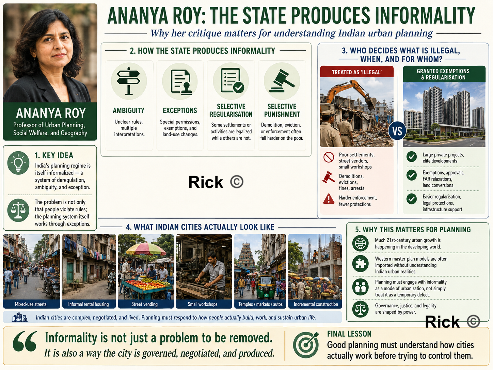{#fig-houten fig-alt="State Informality" out-width="65%"}

In India, many say “Slums, encroachments, street vendors, illegal colonies, these are the problem. Roy reverses the question, who decides what is illegal, when, and for whom? 

A poor settlement may be demolished as illegal, while a large private project may receive exemptions, regularisation, land-use changes, or special approvals. The real issue is that the planning system itself works through exceptions. In her work, Urban Informality, Towards an Epistemology of Planning, argues that much 21st-century urban growth is happening in the developing world, but urban theory and planning ideas still often come from Western city models[@roy2005urbanInformality]. 

So for India, it means, that we are importing master-plan thinking, before even understanding the actual Indian city's needs, mixed-use streets, informal rental housing, street vending, small workshops, temples, markets, autos, encroachments, political negotiations, and incremental construction.

## Official Government Diagnosis of Indian Urban Planning

NITI Aayog’s 2021 report, Reforms in Urban Planning Capacity in India, gives the official diagnosis, India is heading toward a major urban transition: urban growth is expected to account for 73% of India’s population increase by 2036. Indian cities face serviced-land shortages, congestion, infrastructure pressure, air pollution, flooding, water scarcity, and drought. 

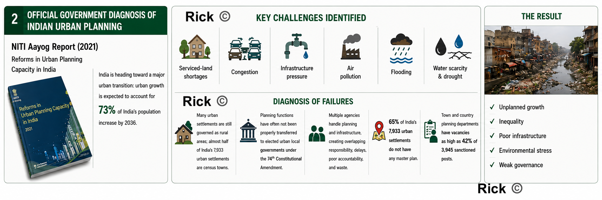{#fig-houten fig-alt="Government Diagnosis" out-width="65%"}

The report identifies several concrete underperformance issues, Many Indian urban settlements are still governed as rural areas; almost half of India’s 7,933 urban settlements are census towns. Planning functions[@niti2021urbanPlanningCapacity] have often not been properly transferred to elected urban local governments under the 74th Constitutional Amendment [@constitution74th]. Multiple agencies handle planning and infrastructure, creating overlapping responsibility, delays, poor accountability, and waste. NITI report says 65% of India’s 7,933 urban settlements do not have any master plan, and town and country planning departments have vacancies as high as 42% of 3,945 sanctioned posts. 

## Jane Jacobs {.unnumbered}

Jane Jacobs is an important figure in Urban planning. While she did not visit India nor her work was directly related to Indian urban planning, her ideas about the importance of mixed-use development, walkability, and the social life of neighborhoods have influenced urban planners worldwide. In The Death and Life of Great American Cities, her attack was on modernist, top-down planning that destroyed working neighborhoods in the name of “order,” “renewal,” highways, towers, and superblocks. Her core idea was A good city is not a machine. It is a living, complex social organism. 

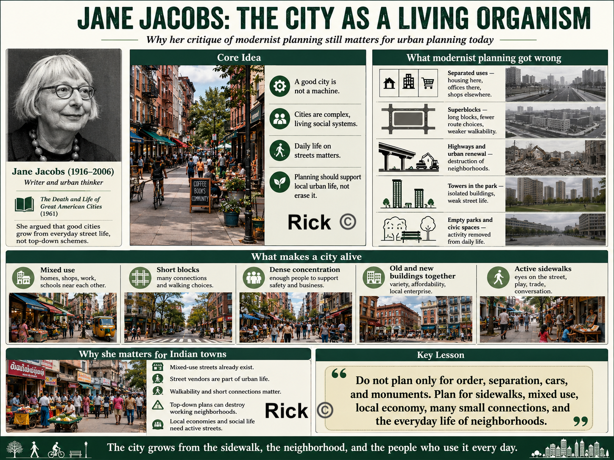{#fig-houten fig-alt="Jane Jacobs" out-width="65%"}


Jane Jacobs says, Housing here, offices there, shops elsewhere, schools elsewhere i.e separating uses too much and kills street life. Superblocks reduce walking choices, reduce shopfronts, and make streets empty. Public housing towers, highways, civic centers, and isolated parks often destroy local economic and social networks. Her suggestion is mixed use, short blocks, dense population, old and new buildings with active sidewalks and local self-organization. 

## Christopher Alexander {.unnumbered}

Christopher Alexander sees cities as a **living structure** made from repeated human activities.

A town is alive when it supports ordinary life: children walking to school, women buying vegetables, elderly people sitting near thresholds, buses stopping, vendors setting up, rainwater flowing, trees giving shade, and families moving between house, street, shop, school, place of worship, market, clinic, and workplace.

When planning ignores these repeated patterns of life, it produces dead urban forms such as hot roads without shade, houses without thresholds, layouts without centers, markets without drainage or loading space, bus stops without seating, parks without users, drains without maintenance, and streets where pedestrians, vendors, two-wheelers, cars, water, and waste are in constant conflict.

Alexander's work is especially relevant to Tamil Nadu and South Indian towns because **our towns are already full of life.** Streets are active. Markets are important. Bus stops are heavily used. Schools shape daily movement. Religious spaces organize social life. Small shops support local economies. The underperformance is that the physical environment often does not support this life with dignity, comfort, safety, shade, drainage, beauty, and order.

Instead of beginning only with land-use categories, road widths, zoning maps, floor-space index, parking standards, plot approvals, and infrastructure drawings, he asks us to begin with life itself:

- What activities happen here every day?
- What repeated needs are not being supported?
- Which places already function as centers?
- Which edges help public life, and which edges kill it?
- Which outdoor spaces are shaped and loved, and which are leftover?
- Which small repairs would make the whole town stronger?

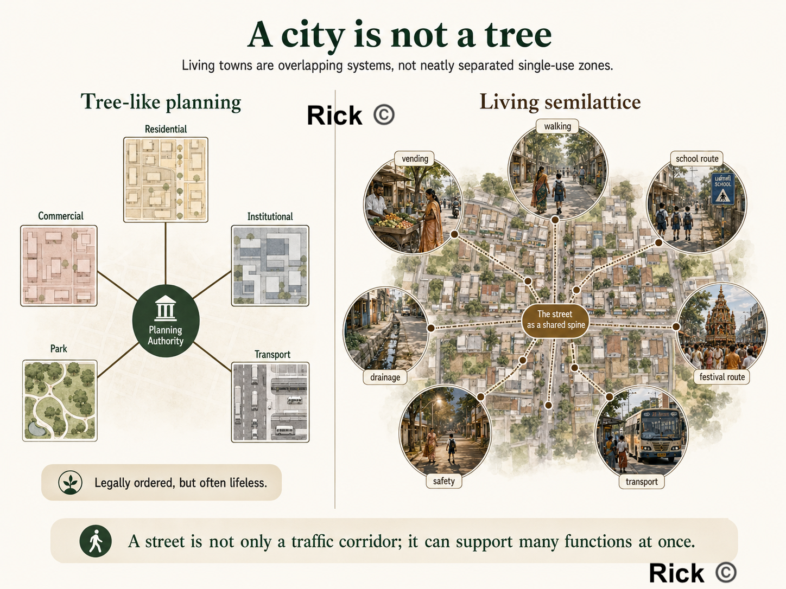{#fig-houten fig-alt="Christopher Alexander's City as SemiLattice" out-width="65%"}

This makes Alexander a powerful urban planning thinker.

***

### The Timeless Way: Does the South Indian town feel alive?

In *The Timeless Way of Building*, Alexander argues that great buildings and towns have a living quality, what he famously calls the **"quality without a name."** This quality is the deeper feeling that a place supports human life naturally.

For planning, this means the first test of a town is not the width of its roads or the legality of its layout. The first test is whether **people can live well there.**

| Question | Why it matters |
|---|---|
| Can children walk safely to school? | A town that endangers children is not well planned. |
| Can elderly people sit and rest in shade? | Walking requires rest points, shade, and dignity. |
| Can women wait for buses safely? | Public transport must include safety, visibility, lighting, seating, and comfort. |
| Can vendors earn without being treated as nuisances? | Informal work is part of urban life and needs physical structure. |
| Can people walk at noon without heat exhaustion? | In Tamil Nadu, shade is basic infrastructure. |
| Can rainwater drain during heavy rain? | Drainage is not a technical afterthought; it shapes everyday life. |
| Can people gather in the evening? | Public life needs usable streets, squares, tank edges, and shaded spaces. |
| Do homes, shops, schools, clinics, worship, and transport support one another? | Good towns are made from connected uses, not isolated zones. |


::: {.callout-tip}
## Alexander's first planning lesson
A town is successful when ordinary life becomes easier, safer, more comfortable, and more beautiful.
:::

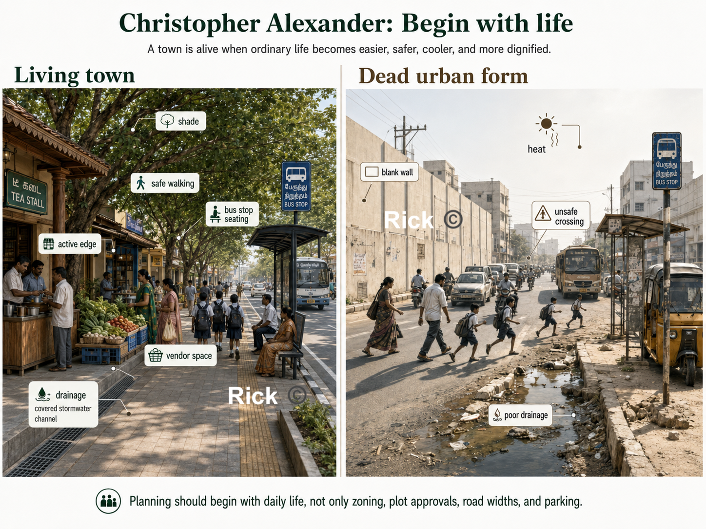{#fig-houten fig-alt="Christopher Alexander's Planning with Life" out-width="65%"}

### Patterns: repeated problems need repeated solutions

Alexander's most famous contribution is the idea of a **pattern language**. 
A pattern is a recurring relationship between human need, physical space, social behavior, and environmental conditions.

In Tamil Nadu, such patterns already exist:

| Local pattern | What it supports |
|---|---|
| A shaded street | Walking, vending, waiting, conversation |
| A *thinnai* at the front of a house | Rest, social contact, transition between private and public life |
| A tea stall near a bus stop | Waiting, information, social life, informal safety |
| A temple / church / mosque street | Worship, processions, festivals, markets, gathering |
| A school approach road | Children's mobility, parent waiting, vendors, traffic calming |
| A market street | Food economy, women's work, logistics, drainage, waste collection |
| A tank bund | Water management, cooling, walking, memory, ecology, public space |

A planning system may miss these patterns. It may call a vendor an encroacher, a tea stall a nuisance, a tank a vacant site, a *thinnai* an outdated feature, or a market street a traffic problem.

::: {.callout-note}
## Question to ask
What life-pattern is this place supporting, and how can physical design strengthen it?
:::

This is why planning must move from abstract categories to lived reality:

- A **fish market** is a system of fishermen, women vendors, cold storage, drainage, washable surfaces, waste collection, loading space, retail, household food systems, credit, transport, and public health.
- A **school** is a system of children, parents, teachers, stationery shops, snack vendors, buses, two-wheelers, crossings, shade, toilets, play, and neighborhood safety.
- A **hospital** is a system that creates a patient district, pharmacies, diagnostics, food stalls, autos, buses, lodges, emergency access, toilets, shaded waiting, and quiet recovery.


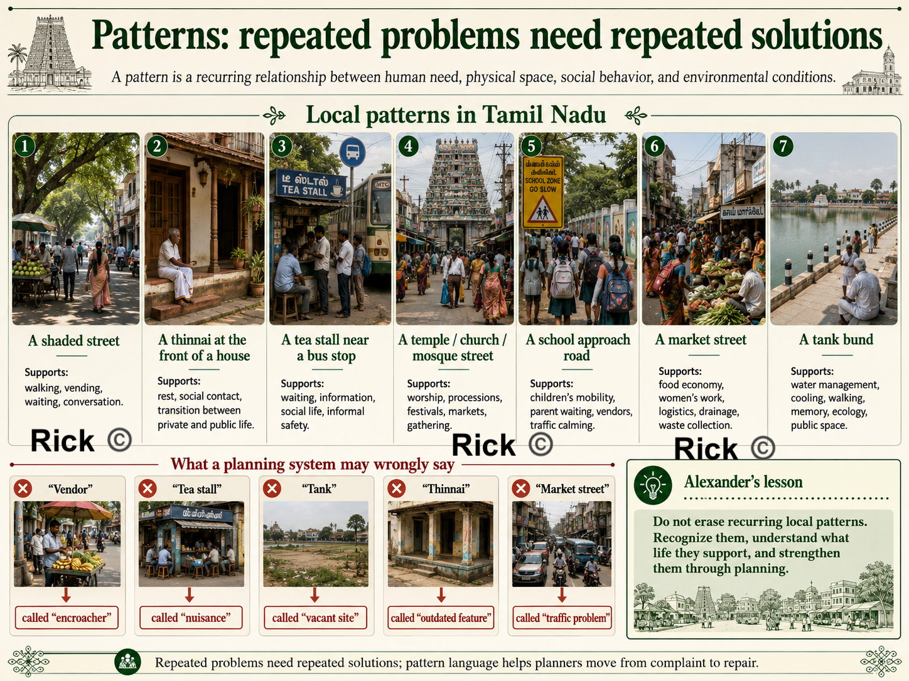{#fig-houten fig-alt="Christopher Alexander's Local Patterns" out-width="65%"}


### A city needs overlap

In *A City is Not a Tree*, Alexander criticizes the modern habit of separating urban life into neat, isolated categories, residential here, commercial there, institutional elsewhere, parks separately, transport corridors separately, industry outside, and public facilities in isolated plots.

He argues that living cities are not simple tree-like hierarchies. They are **semilattices**: overlapping systems where one place supports many functions at once. This is very relevant to Indian towns.

A street may also be a walking route, a vending space, a drainage edge, a school route, a social space, a delivery corridor, a festival route, a parking area, a place of surveillance and safety, and a place where small businesses survive.

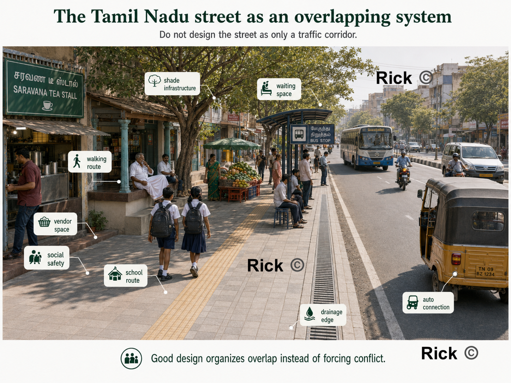{#fig-houten fig-alt="Christopher Alexander Street" out-width="65%"}

A bus stop is also a waiting space, shade point, tea-shop edge, auto connection, women's safety zone, information point, and everyday social node.

So the planning question is **"Which activities need to overlap, and how can we design the overlap well?"**

This is one reason many modern layouts fail. 
They may be legally approved, but they produce only plots, compound walls, heat-trapping roads, car dependence, unused open-space-reservation land, and no real neighborhood center. Such a layout sells land, but it does not yet create urban life.

A good neighborhood needs a recognizable center, shaded walking routes, small shops, schools and clinics nearby, parks that are actually used, public transport access, water and drainage systems, places for children, places for elderly people, and social edges where people can meet.

> Without these, a layout is only real estate.

### Centers: strengthen existing life before inventing new projects

In *The Nature of Order*, Alexander develops the idea of **centers**. 
A center is any place, edge, activity, or spatial focus that organizes life around it.

| Existing center | How planning can strengthen it |
|---|---|
| Bus stop | Add shade, seating, lighting, route information, safe crossing, active edges |
| School gate | Add slow-street design, shaded waiting, raised crossings, vendor bays, cycle parking |
| Market street | Add drainage, washable floors, toilets, waste collection, loading space |
| Tank bund | Restore water flow, prevent sewage, add shaded walking paths and ecological edges |
| Worship street | Protect procession space, manage vendors, improve lighting, shade, and drainage |
| Hospital street | Add wheelchair access, autos, pharmacies, shaded waiting, toilets, and food access |
| Tea-shop corner | Improve safety, waste, seating, and shade instead of erasing it |

This gives us a practical diagnostic tool: *what centers of life already exist here, and does this project strengthen or weaken them?* 
A commercial complex should strengthen the street, not turn its frontage into a dead parking apron. 
A school should strengthen the school street, not discharge children into traffic.

::: {.callout-important}
## Principle for South Indian towns
Do not begin by replacing local life; begin by strengthening the centers that already exist.
:::

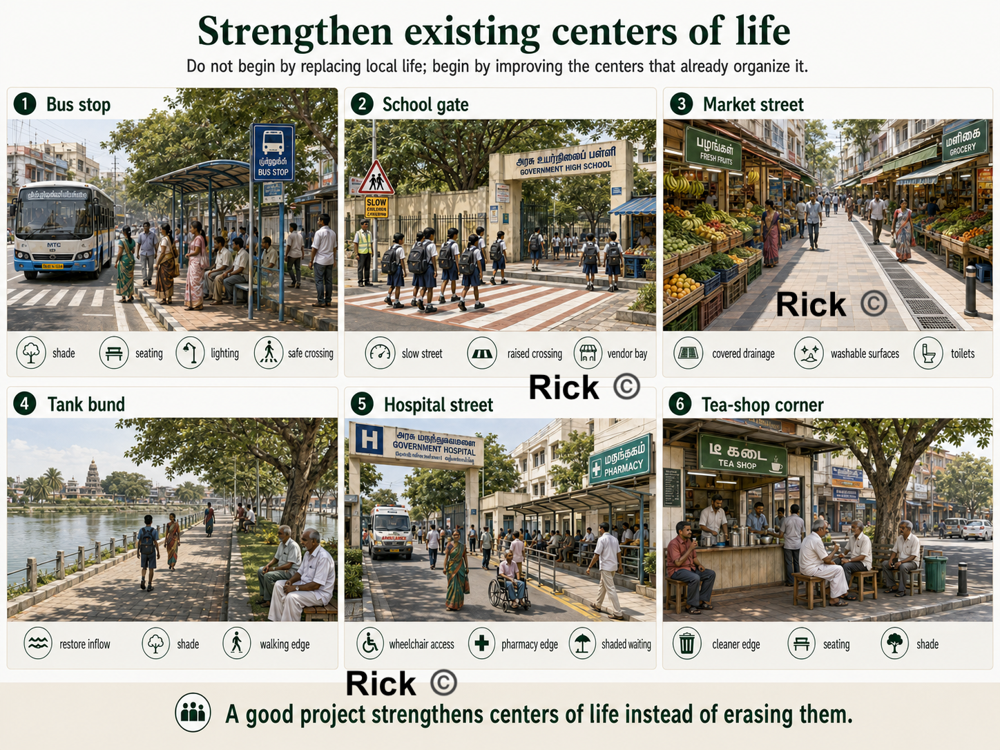{#fig-houten fig-alt="Strengthening Centers" out-width="65%"}

### Positive outdoor space: public space should not be leftover land

Alexander emphasizes **Positive Outdoor Space**. Outdoor space should be intentionally shaped, shaded, bounded, entered, watched, and used.

Many modern parks, setbacks, plazas, and open-space plots fail because they are too exposed to sun, poorly edged, empty, disconnected, unsafe, or purposeless.

A good public space needs shade, edges, seating, entrances, lighting, nearby activity, clear paths, safety, and a reason for people to be there. A temple square, church courtyard, shaded bazaar street, or tank edge may succeed because it is shaped by life; a modern reservation plot may fail because it is leftover land without social energy.

| Place | Alexanderian repair |
|---|---|
| Park | Add shade, play, walking loop, seating, active edges, lighting, and maintenance |
| School street | Add crossings, shade, waiting space, slow traffic, vendor organization |
| Market | Add roof/shade, drainage, platforms, toilets, waste collection, loading space |
| Bus stop | Add seating, lighting, safe crossing, route information, shade |
| Commercial complex | Add shaded pedestrian edge, small shopfronts, trees, seating, street connection |
| Tank bund | Add ecological edge, walking path, seating, shade, water protection |

> Public space must be designed as a place, not treated as leftover land.

***

### Edges and thresholds: buildings must help the street

Alexander pays close attention to the edge between public and private life. In South India, this matters because many modern houses produce blank compound walls, exposed concrete, metal gates, dead setbacks, and heat-trapping front yards.

The **thinnai**, verandah, shaded entrance, courtyard, low wall, tree, and front platform created a gradual transition between street and house, supporting social life, rest, neighborly contact, shade, and informal surveillance. Modern planning often loses this intelligence, treating each plot as an isolated private object.

Alexander would ask: **Does the building improve the street?**

::: {.columns}
::: {.column width="48%"}
**A good edge provides**

- doors and windows facing the street
- shaded entrances
- verandahs or semi-public thresholds
- trees and planting
- low or porous compound walls where possible
- active shopfronts on commercial streets
- seating near public buildings
:::
::: {.column width="4%"}
:::
::: {.column width="48%"}
**A bad edge produces**

- blank compound walls
- exposed parking lots
- dead setbacks
- hostile gates
- dark corners
- no shade
- no relationship to the street
:::
:::

Streets become safer and more comfortable when buildings watch them, shade them, and give them activity. 


### Scale: planning must reach the bench, tree, drain, and doorway

 *A Pattern Language* moves from regions and towns to neighborhoods, buildings, rooms, windows, walls, seats, and construction details.

A town fails at the level of the bus shelter, drain cover, footpath, window, tree pit, bench, doorway, compound wall, courtyard, and market platform.

| Scale | Planning question |
|---|---|
| Region | Where does water come from and where does it drain? |
| Town | Where are the major centers, transit routes, markets, hospitals, schools, and tanks? |
| Neighborhood | Is there a walkable center with shops, schools, public space, and transport? |
| Street | Is it shaded, safe, drained, lit, and usable by pedestrians? |
| Building | Does it improve the street and respond to climate? |
| Threshold | Is there a humane transition between public and private life? |
| Detail | Do benches, trees, drains, crossings, windows, and shaded edges actually work? |

Many Indian plans draw large land-use maps but ignore the small details that determine daily comfort. 
Alexander says, planning must continue all the way down to the human body: where a person walks, waits, sits, sweats, crosses, rests, buys, sells, and gathers.


### Piecemeal growth: repair the town through many small acts

In *A New Theory of Urban Design*, Alexander argues that cities should grow as coherent wholes. This corrects the mega-project mentality common in Indian urban improvement, flyovers, road widening, large bus stands, malls, riverfront projects, and smart-city beautification schemes.

He asks whether each project **heals or damages the larger urban fabric.** A flyover may improve vehicle movement but destroy walking, shade, shopfronts, and crossings. A road-widening project may increase speed but remove trees and make the street more dangerous.

Many Tamil Nadu towns can improve through hundreds of coordinated small repairs:

| Broken pattern | Repair |
|---|---|
| Street too hot | Add trees, verandahs, shade structures, lighter surfaces, rest points |
| Market dirty | Add drainage, washable floors, toilets, waste systems, vendor platforms |
| Bus stop unsafe | Add lighting, visibility, seating, shade, crossing, route information |
| School street chaotic | Add slow speeds, raised crossings, waiting bays, vendor organization |
| Park unused | Add shade, edges, play, seating, walking loop, surrounding activity |
| Tank neglected | Restore water flow, prevent sewage, add shaded paths and public access |

Alexander's practical genius as he moves us from complaint to repair. 
The town becomes better through many acts of repair that reinforce one another.

***

### Sequence: repair must happen in the right order

A good town is generated through the right sequence of decisions. 

For a Tamil Nadu ward, the repair sequence might look like this:

1. **Map existing centers** schools, bus stops, markets, tanks, clinics, worship places, tea shops, shaded junctions, active streets.
2. **Fix water and drainage first** without drainage, markets, streets, parks, and housing layouts will fail.
3. **Create shaded walking spines** connect homes, schools, shops, bus stops, markets, and public spaces.
4. **Protect vulnerable users**  improve routes used by children, women, elderly and disabled people, patients, and pedestrians.
5. **Strengthen public centers** upgrade markets, bus stops, school streets, tank edges, and clinic streets.
6. **Repair building edges** encourage active frontages, shaded thresholds, verandahs, shopfronts, porous compound walls.
7. **Add small public outdoor rooms** usable squares, seating pockets, play spaces, shaded corners, tank-edge gathering places.
8. **Maintain and adjust** keep cleaning, pruning, desilting, repairing, lighting, and monitoring usage.

This sequence tells the municipality what to repair first, what to protect, and how small projects can strengthen the larger town.

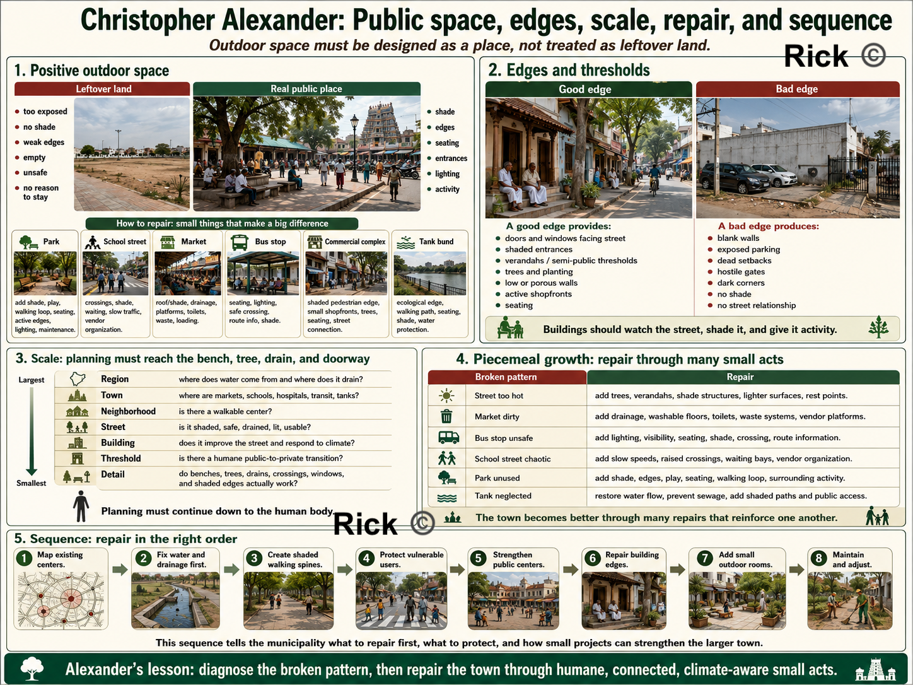{#fig-houten fig-alt="Alexander's Outdoor Spacet" out-width="85%"}

### Participation: the users of a place must help diagnose it

Alexander's *The Oregon Experiment* shows that planning should involve the people who actually use the environment. 
Participation means residents, shopkeepers, vendors, school staff, children, women, elderly and disabled people, sanitation workers, bus users, and local officials all help identify broken patterns.

Each group sees something different:

| User group | What they know |
|---|---|
| Children | Dangerous crossings, hostile streets, missing play areas |
| Women | Unsafe waiting spaces, poor lighting, lack of toilets, harassment points |
| Elderly people | Missing shade, seating, slow crossings, uneven surfaces |
| Vendors | Customer flow, loading needs, waste, water, shade, storage |
| Shopkeepers | Street activity, parking pressure, pedestrian movement |
| Sanitation workers | Waste accumulation, blocked drains, maintenance failures |
| Bus users | Waiting discomfort, route confusion, unsafe crossings |
| Patients' families | Hospital-street needs: food, toilets, autos, shade, pharmacies |

Where do people gather? 
Where is it too hot? 
Where does water stagnate? 
Where do women feel unsafe? 
Where do children cross? 
Where do vehicles move too fast? 
Where do vendors need space? 
Which walls kill the street? 
Which trees must be protected? 
This turns participation into **diagnosis**


### Housing: recover climate, threshold, and family life

Many modern Tamil Nadu homes are built as RCC boxes with flat exposed roofs, cement plaster, decorative facades, metal grills, and limited climate response. They may be expensive, yet thermally uncomfortable.

A Christopher Alexander inspired house design would ask: 

| Question | Design implication |
|---|---|
| Does the entrance have shade? | Add verandah, porch, *thinnai*-like edge, or shaded transition |
| Can air move through the house? | Plan cross-ventilation, courtyards, high vents, openable windows |
| Does the roof reduce heat gain? | Use insulation, ventilated roof layers, reflective finish, shaded terrace |
| Is the west wall protected? | Add shading, vegetation, buffer spaces, fewer exposed openings |
| Is there usable outdoor space? | Provide courtyard, service court, shaded side yard, terrace garden |
| Is there a public-to-private gradient? | Use threshold, front room, courtyard, inner rooms, rear service space |
| Does the house support daily work? | Provide drying, washing, storage, cooking support, guest waiting, children's space |
| Does it help the street? | Avoid dead compound walls; create dignified, shaded, watched edges |

This means recovering their intelligence — shade, verandahs, courtyards, *thinnais*, deep openings, local materials, vegetation, transitional spaces — while adapting them to modern sanitation, privacy, structure, affordability, and safety.


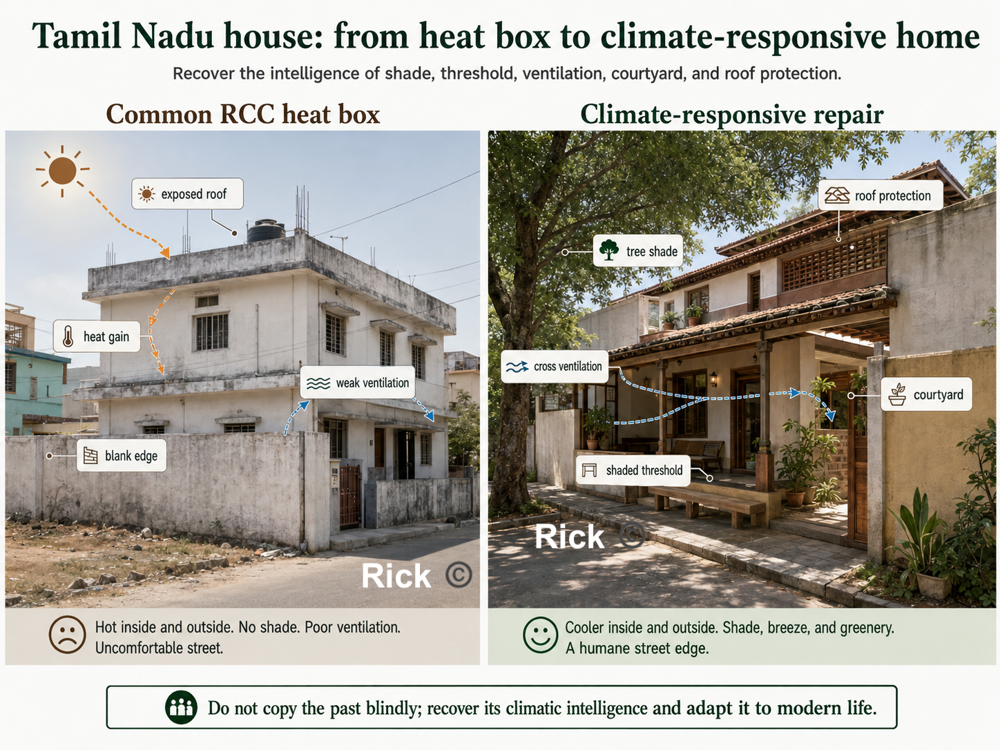{#fig-houten fig-alt="Climate Responsive Housing" out-width="65%"}

### Governance: a pattern language can become a civic language

A pattern language can become a shared vocabulary among engineers, planners, officials, elected representatives, builders, residents, vendors, shopkeepers, and community groups. One reason planning fails is that each department sees only its own responsibility:

| Actor | Usually sees |
|---|---|
| Road engineer | Carriageway, drains, road surface |
| Traffic police | Flow and enforcement |
| Revenue department | Land boundaries |
| Public health department | Waste and sanitation |
| Electricity board | Poles, wires, transformers |
| Builder | Plot value and approvals |
| Resident | Parking, water, safety, convenience |
| Vendor | Livelihood and customer access |

Alexander's method gives these groups a common question: **what pattern is broken here, and what repair would strengthen the whole?**

A school street, for example, is a combined pattern of children's mobility, parent waiting, vendors, school buses, two-wheelers, crossings, shade, drainage, lighting, and neighborhood safety. If each department acts separately, conflict increases. If they use a pattern-language approach, they can design one complete solution, shaded footpaths, slow speeds, raised crossings, parent waiting bays, organized vendors, cycle parking, lighting, trees, covered drains, and timed traffic management.

***

### Production and maintenance

A plan may look good on paper, but contractor practice, poor detailing, weak supervision, cheap materials, bad drainage slopes, missing shade, or lack of maintenance can destroy the result.

A good planning process must ask: Who builds it? Who supervises it? Are the details climate-responsive? Are materials appropriate? Can it be repaired? Who cleans it? Who waters the trees? Who desilts the drains? Who maintains lights, benches, toilets, and footpaths? Who prevents parking or encroachment from destroying the design?

No pattern survives without care. Trees must be watered and pruned. Drains must be cleaned. Market waste must be collected. Bus shelters must be repaired. Tank inflows must be protected. Footpaths must remain walkable.

> Maintenance is not separate from design. It is part of the life of the pattern.

***
::: {.callout-important}
## The stronger conclusion
Alexander teaches us how to recognize and repair living structure. But for Tamil Nadu, his method must be joined with finance, law, engineering, climate science, social justice, municipal capacity, and democratic governance.
:::
***

### An Alexander checklist for planning a town {.unnumbered}

Walk any street, ward, or project and run through this. Every unchecked box is a repair waiting to happen.

- [ ] **Life**  
*What human activities happen here?* <br>
Begin with walking, waiting, selling, buying, studying, worshipping, resting, and gathering.

- [ ] **Centers** 
*What existing centers of life are here?* <br> 
Strengthen bus stops, markets, tanks, schools, worship streets, clinic streets, and tea-shop corners.
- [ ] **Patterns** 
*What recurring needs does this place fail to support?* <br> 
Look for repeated failures: heat, unsafe crossings, flooding, dead walls, weak markets, poor bus stops.

- [ ] **Overlap** 
*Has planning separated what should be connected?* <br> 
Markets, schools, hospitals, bus stops, and streets are overlapping systems, not single-use objects.

- [ ] **Outdoor space** 
*Is public space shaped or leftover?* <br> 
Parks, squares, streets, and tank edges should be shaded, bounded, watched, entered, and used.

- [ ] **Edges** *Do buildings help the street or kill it?* <br> 
Verandahs, shopfronts, windows, trees, and thresholds strengthen streets; blank walls weaken them.

- [ ] **Scale** 
*Does the plan connect large and small?* <br> 
Region, water, ward, street, building, threshold, bench, tree, and drain must work together.

- [ ] **Sequence** <br> 
*What should be repaired first?* 
Begin with water, drainage, shade, walking, vulnerable users, public centers, and maintenance.

- [ ] **Participation** *Who actually uses this place daily?* <br> 
Include women, children, elders, vendors, shopkeepers, bus users, sanitation workers, and residents.

- [ ] **Climate** *Does the place work in heat, rain, humidity, and glare?* <br> 
Shade, ventilation, drainage, trees, roof design, materials, and walkability are essential.

- [ ] **Production** 
*Will construction produce life or dead form?* <br> 
Contractor practice, detailing, supervision, materials, and user input all matter.

- [ ] **Maintenance** 
*Who will care for it after construction?* <br> 
No design survives without cleaning, pruning, desilting, repair, lighting, enforcement, and budget.

- [ ] **Local language** 
*Is the solution rooted in Tamil life and climate?* <br> 
Use local intelligence: *thinnai*, courtyard, tank, shaded street, market, festival street, monsoon drainage.

- [ ] **Wholeness** 
*Does each intervention strengthen the larger town?* <br> 
A road, park, school, hospital, house, market, or drain should improve its surroundings.

- [ ] **Dignity** 
*Does it make ordinary lives easier, safer, and more beautiful?* <br> 
The final test is daily dignity for children, women, workers, elders, vendors, pedestrians, and families.


# Tamil Nadu's Urban Planning

The most important legislation for urban planning in Tamil Nadu is the Tamil Nadu Town and Country Planning Act, 1971.
Tamil Nadu Combined Development and Building Rules (TNCDBR), 2019. 

Regulatory bodies are DTCP (Directorate of Town and Country Planning), CMDA (Chennai Metropolitan Development Authority). Developments in hilly regions (like The Nilgiris, Kodaikanal, and Yercaud) are subject to stricter regulations reviewed by the Hill Area Conservation Authority (HACA) and require Architectural Aesthetic clearance. Compliance and Enforcement is enforced by the local municipal corporation, which is responsible for issuing building permits, conducting inspections, and ensuring adherence to zoning regulations. 

Tamil Nadu master plans legally include land use, roads, traffic circulation, public utilities, amenities, development control, and implementation phasing. So the problem is not that transport, drainage, water supply, sewage, or infrastructure are completely absent from the planning framework. In practice, the most visible public artifact often becomes the coloured land-use map. The plan may show residential, commercial, industrial, institutional, agricultural, and water-body land uses, but these categories are not always converted into a ward-level, financed, enforceable, and maintained delivery system. What's needed is a planning system that connects land use with movement, water, sewage, stormwater drainage, public transport, footpaths, markets, parks, staffing, municipal finance, enforcement, and long-term maintenance.

The plan and the power to carry it out are often sitting in different hands.

**Physical Layer:**

The physical weakness is that land use often becomes the dominant public language of planning, while movement, water, drainage, public realm, infrastructure capacity, density, climate comfort, and maintenance are not always organized into a clear delivery system.

The Tamil Nadu Town and Country Planning Act, 1971 gives land use a central place, but it also includes roads, traffic circulation, public utilities, amenities, future development, and improvement of bad layouts or slum areas. Therefore, the weakness is not the absence of these ideas in law. The weakness is whether these provisions become funded, mapped, enforceable, and maintained systems at the ward and street level.

The result is the pattern Tirunelveli makes concrete, built-up areas expanded, agricultural land declined, and water bodies shrank. Growth happened, but it was not always shaped by a strong integrated framework of land use, water, transport, infrastructure, and enforcement. This is why the Tirunelveli case must be read also as a governance, infrastructure, finance, and maintenance story.

**Financial Layer:**

Tamil Nadu's cities run on a thin and dependent municipal revenue base. Municipal revenue depends heavily on own-source revenue such as property tax, user charges, fees, and state or central transfers. Where own-source revenue is weak, cities struggle to finance drains, footpaths, sewage, parks, streetlights, public toilets, and long-term maintenance. 

Property tax should be one of the backbone revenue sources[@worldBank2020propertyTaxDiagnostic] for urban local bodies, but it often underperforms because of outdated valuation, weak collection, exemptions, and political reluctance to revise rates[@awasthi2020propertyTaxIndia]. When municipal own-source revenue is weak, capital works and long-term maintenance become dependent on state grants, schemes, and delayed project funding. The result is familiar: cities may announce master-plan projects, but struggle to fund drains, footpaths, sewage, parks, public toilets, and maintenance at the ward level. When a city can't fund maintenance, a master plan becomes a wish list. 

There is genuine movement in the right direction. In January 2026, Coimbatore Corporation raised ₹150.85 crore and Tiruppur Corporation raised ₹100 crore through municipal bonds, after Chennai had raised ₹205.59 crore[@tnMunicipalBonds2026]. These funds are largely linked to underground drainage and urban-development projects. That's the right direction, cities borrowing against their own future revenue rather than waiting for ad hoc state grants, but the sums are tiny against the backlog, and bonds require exactly the credible own-revenue stream that many ULBs still lack.

**Administrative layer**

Now look at who actually plans a Tamil Nadu city. In many cases, statutory planning is not fully controlled by the elected city government. The planning authority is often chaired by state-appointed district administration, with technical control sitting in the Town and Country Planning Department[@tirunelveliLPAOfficial]. Tirunelveli shows this clearly: the Tirunelveli Local Planning Authority is chaired by the District Collector, while the Regional Deputy Director of Town and Country Planning serves as Member Secretary.

This means the elected city corporation is responsible for many everyday urban services, but does not fully control the larger statutory planning framework.

The planning authority is largely a state-controlled institutional structure staffed by appointed officers. This means the mayor and councillors whom residents elect do not have full control over land-use planning. Chennai is the clearest case. It has been approximately thirty three years since the 74th Amendment, but the power of town planning has never been devolved to the Greater Chennai Corporation. 

The master plan is still prepared by CMDA, a parastatal running under the 1971 Act. 
This creates a familiar Indian urban-governance problem: elected local bodies carry public-facing responsibility, while major planning powers often sit with state-created parastatal agencies and state-appointed executives.

And the body the Constitution designed to stitch the fragments together, the Metropolitan Planning Committee for any metro over a million people, exists mostly on paper, across most states, parastatals and SPVs bypass elected ULBs, producing fragmented authority and blurred accountability.

Chennai shows the same fragmentation at a larger scale. Greater Chennai Corporation covers about 426 sq. km., but the wider Chennai Metropolitan Area is planned through CMDA and includes multiple corporations, municipalities, town panchayats, and panchayat unions[@cmdaOfficial; @tnHUDPolicyNote2024]. 

Water, drainage, transport, planning, land development, and local services are handled through different agencies. This fragments accountability because water, drainage, transport, planning, and land development are handled by different agencies, while residents experience the city as one connected system.

# Tirunelveli Case Study

::: {.callout-important}
## The takeaway in one minute

Tirunelveli has the old core, the institutions, the Thamirabarani system, the tanks, the villages. What it lacks is **one accountable body with the authority, money, and staff to deliver and maintain a plan.** Right now the body that draws the plan (the Local Planning Authority, chaired by the District Collector) is not the body residents can vote out (the Corporation), so **the plan and the power to carry it out sit in different hands.**

Every problem in this post collapses into three families of underperformance:

- **Paradigm**: the wrong *kind* of plan: a static land-use colour map for a city that is mixed-use, informal, incremental, hot, and organised by water.
- **Content**: even as a map, the layers are missing: no mobility, density, hydrology, heat, public-realm, or infrastructure-capacity layer.
- **Delivery**: the binding constraint: split authority, thin municipal finance, vacant technical posts, no maintenance, ad-hoc enforcement.

**The fix, in order:** fix **delivery first** (one elected-answerable body holding planning + money + staff + maintenance), build the **atlas** in parallel, and make one rule structural **no layout approval without infrastructure capacity.** Fix those, and the same land begins to work as a city.
:::

This is the Existing Land Use Map, 2021 for the Tirunelveli Local Planning Area. 
It shows how land within the larger Tirunelveli planning region was being used in 2021. 
It appears as a larger city-region, with an urban core surrounded by agricultural land, village settlements, water systems, institutional clusters, transport corridors, and scattered industrial areas.

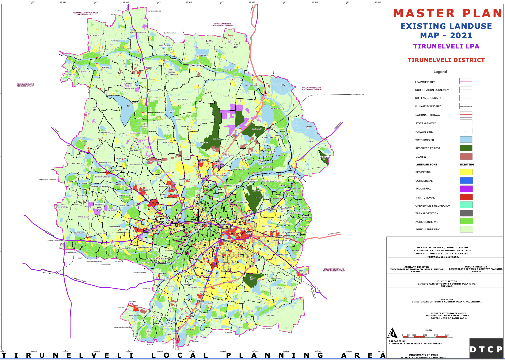{#fig-houten fig-alt="Master Plan Map 2021" out-width="65%"}

The map is describing, functional geography of the Tirunelveli region: where people live, where they work, where institutions are located, where farming continues, where water systems exist, and where the city is expanding.

The densest developed area is around the Tirunelveli–Palayamkottai urban core.
The core appears as the most intensely urbanized part of the map. It is where the yellow, blue, red, and grey land uses are most concentrated. This likely corresponds to the older built-up parts of Tirunelveli, Palayamkottai, market areas, institutional zones, transport hubs, schools, colleges, hospitals, religious institutions, government offices, and dense residential neighborhoods.

**Residential Land**

Residential land, shown in yellow, is concentrated in the urban core but also spreads outward into the surrounding areas. This suggests that Tirunelveli has been expanding beyond the old city into nearby villages and peri-urban land. The residential growth does not appear as one clean, planned block. Instead, it spreads in patches and strips, especially along major roads. This indicates outward urban expansion, where former agricultural or village land is gradually converted into housing layouts, colonies, and mixed-use development.

**Commercial Land**

Commercial land, shown in blue, is much more limited than residential land. It appears mostly in and around the main urban core and along certain transport corridors or junctions. This suggests that Tirunelveli’s commercial economy is still highly centralized. Shops, markets, business streets, service areas, and retail activity are likely concentrated in older central locations rather than evenly distributed across the entire planning area.This is important because a centralized commercial structure can increase pressure on the old city core, especially if outer residential areas do not have strong local centers of their own.

**Institutional Land**

Institutional land, shown in red, is visible in the core and in scattered locations across the planning area. This includes land used for schools, colleges, hospitals, religious institutions, government offices, and public institutions. Tirunelveli and Palayamkottai have historically had strong educational, religious, administrative, and medical functions. The red institutional patches reflect that role. Palayamkottai especially appears to have an important institutional character. There are also institutional pockets along roads and in outer areas, showing that colleges, schools, hospitals, and public facilities are also contributing to the outward spread of the city.

**Agricultural land**

One of the biggest features of the map is that much of the Local Planning Area is still agricultural.
The map distinguishes between, dry agriculture, shown in pale green, and wet agriculture, shown in brighter green.
This shows that Tirunelveli’s planning area is still strongly rural and agrarian outside the main urban core.
The city is not expanding into empty land. It is expanding into an existing agricultural landscape, with villages, irrigation systems, tanks, fields, and rural roads.

**Water Bodies**

The light blue areas show water bodies: tanks, lakes, ponds, channels, and other water-related features. These are spread across the region and are closely related to agriculture, drainage, irrigation, groundwater recharge, and flood management. The map shows that Tirunelveli’s future planning cannot be separated from its water system. Any careless urban expansion into tanks, canals, low-lying land, or wet agricultural areas could create flooding and drainage problems. The dark green areas indicate reserved forests. These appear as large ecological blocks in parts of the planning area.

**Road and Industrial Land**

The map shows national highways, state highways, railway lines, and major roads passing through and around the region. The urban growth appears strongly connected to these corridors. This suggests a radial and corridor-based urban pattern. Development is not spreading evenly in all directions. It is extending along roads, highways, and transport routes. Many Indian cities and towns: the road comes first, then housing layouts, shops, petrol bunks, colleges, marriage halls, warehouses, industries, and commercial strips begin to appear along it.

Industrial land, shown in purple or magenta, appears in selected pockets rather than as one large, continuous industrial zone. These industrial areas seem to be located near transport corridors and outer growth areas. The pink outer boundary marks the Local Planning Area.


## Main land-use categories shown

The legend divides the Tirunelveli Local Planning Area into several major land-use and planning categories.

| Colour / Symbol | Meaning | What it indicates |
|---|---|---|
| <span style="color:#f4d03f;">■</span> Yellow | Residential | Areas mainly planned or occupied for housing and neighbourhood development. |
| <span style="color:#2471a3;">■</span> Blue | Commercial | Shops, markets, business streets, retail activity, and other commercial uses. |
| <span style="color:#8e44ad;">■</span> Purple / Magenta | Industrial | Land allocated for factories, workshops, industrial estates, and related employment uses. |
| <span style="color:#c0392b;">■</span> Red | Institutional | Schools, colleges, hospitals, government offices, religious institutions, and public facilities. |
| <span style="color:#48c9b0;">■</span> Cyan / Turquoise | Open space and recreation | Parks, playgrounds, public open spaces, and recreational areas. |
| <span style="color:#7f8c8d;">■</span> Grey | Transportation | Roads, railway lines, transport corridors, terminals, and movement infrastructure. |
| <span style="color:#00b050;">■</span> Bright green | Wet agriculture | Irrigated agricultural land, usually associated with paddy fields or water-supported cultivation. |
| <span style="color:#a9dfbf;">■</span> Pale green | Dry agriculture | Non-irrigated or less water-intensive agricultural land. |
| <span style="color:#5dade2;">■</span> Light blue | Water bodies | Rivers, tanks, ponds, canals, reservoirs, and other surface water features. |
| <span style="color:#145a32;">■</span> Dark green | Reserved forest | Protected forest land and ecologically sensitive green areas. |
| <span style="color:#ff69b4;">━</span> Pink boundary | Local Planning Area boundary | The outer planning boundary within which the land-use plan applies. |
| <span style="color:#000000;">━</span> Black / other lines | Boundaries and networks | Village boundaries, roads, railways, planning boundaries, and other administrative or infrastructure lines. |


## PDF version of Tirunelveli Master Plan Map 2021
```{=html}
<iframe src="../../images/urbanplanning/TamilNadu/TirunelveliUrbanPlanning.pdf" width="100%" height="600px"></iframe>
```

## PDF Version of entire Tirunelveli Master Plan Document 2041

```{=html}
<iframe src="../../images/urbanplanning/TamilNadu/TVL-MASTER-PLAN-FINAL-DRAFT-REPORT-VOL-I_compressed.pdf" width="100%" height="600px"></iframe>
```

Tirunelveli LPA is expected to grow from about 7.34 lakh people (0.734 million people) in 2011 to about 9.56 lakh (0.956 million people) by 2041[@tirunelveliMasterPlan2041]. So the plan is preparing for more houses, more water demand, more sewage, more transport pressure, and outward expansion.

The Master Plan document, treats Tirunelveli as a mixed economy: agriculture still matters, but future growth is pushed through MSME, SIPCOT expansion, Tata Power Solar, wind energy, service sector growth, skill development, markets, and industrial corridor. It studies housing typology, ownership, housing shortage, slum population, houseless population, and affordable housing schemes. The key point is: growth is not just land conversion, Tirunelveli needs affordable, serviced, connected housing. The master plan document notes 168 houseless households / 716 houseless people in Tirunelveli Corporation in 2011. 

By 2041, total LPA water demand is projected at 130.32 MLD, and sewage generation at 104.26 MLD [@tirunelveliMasterPlan2041]. The plan says urban areas need expanded UGSS, while rural/rest-of-LPA areas may need DEWATS. Solid waste and stormwater drainage are treated as major infrastructure gaps, with stormwater/rainwater harvesting receiving a very large cost allocation. 

**Transport and Mobility**

The Master plan document does include road hierarchy, footpath availability, accident data, black spots, traffic counts, pedestrian counts, and public transport. Later proposals include ring road, road widening, bus fleet replacement, bus shelters, mass transit, footpaths, pedestrian crossings, cycle tracks, freight management, junction improvements, and smart signals. 

The Tirunelveli Master Plan 2041 does recognize the need for blue infrastructure and connected water-resource planning. However, the challenge is whether this idea becomes an enforceable, mapped, ward-level blue-green infrastructure system with protected tanks, canals, wetlands, floodplains, recharge zones, tree corridors, sewage control, maintenance schedules, and public monitoring.

The Master Plan also envisions a carbon-neutral Tirunelveli LPA, with a renewable energy corridor, solar farm, riparian buffers, climate action plan, blue infrastructure, lake/tank rejuvenation, riverfront/lakefront development, abandoned quarry revival, urban forest, district park, street-vendor space, integrated market, grain-market shifting, SIPCOT expansion, mobility plan, TOD, heritage buffers, and peri-urban development.

**Cost and Finances**

The total proposed block cost is about ₹7,557.83 crore, equal to about $792 million, which is $0.79 billion[@tirunelveliMasterPlan2041]. The spending is phased across FY 2023–28, 2028–33, 2033–38, and 2038–43. The biggest spending areas are mobility/transportation, stormwater drainage and rainwater harvesting, economic-sector projects, water supply, and electricity. Implementation is divided across many agencies, including the Forest Department, Water Resources Department, Highways Department, local bodies, the Local Planning Authority, and Tirunelveli Corporation.

## What can we uncover from the Tirunelveli Existing Land Use Map?

The Tirunelveli Existing Land Use Map shows how land was being used in 2021. 
We can notice many things from the Map, Tirunelveli is growing as a larger city-region without a sufficiently strong urban structure to organize that growth.

The map shows residential, commercial, institutional, industrial, agricultural, forest, water, and transport uses. 

At present, the existing land-use map helps us see Tirunelveli as a city-region divided into land-use categories. But a city is not made functional simply by assigning colours to land.

**A City is made functional, organized, when land use, roads, public transport, drainage, water bodies, schools, markets, parks, employment, public space, and infrastructure are planned together.**


### 1. Land use is shown: Urban Performance needs to be included

The map tells us what land is used for, but not whether that land use works well. 
For a livable city, the master plan map must be combined with a performance map that shows how well the land use is functioning.

A residential area may have poor roads, no footpaths, weak drainage, no shade, no parks, and limited public transport. 
A commercial area may be congested, unsafe for pedestrians, and poorly served by buses. 
An institutional area may contain schools or hospitals, but the streets around it may be overloaded or unsafe.

### 2. Growth follows roads instead of planned neighbourhoods

To me, this communicates that planning is not guiding growth. 
In the earlier post, Houten, Netherlands, was shown as a city that grew along a planned network of streets and public transport.

Development appears to spread along major roads and highways. 
This creates **Ribbon development**, where housing layouts, shops, petrol bunks, colleges, marriage halls, warehouses, workshops, and commercial strips grow along road corridors.

Over time, the same road is forced to act as a highway, market street, bus route, parking area, pedestrian space, school access road, and local street. 
The outcome of this type of development is congestion, unsafe walking, poor access management, road widening difficulty, and fragmented agricultural land.

What would help Tirunelveli is  **Nodal development, supported by a centres-and-corridors planning framework**, where growth is concentrated around planned centres, bus stops, junctions, schools, markets, and civic spaces, while agricultural and ecological buffers are protected.

Centres/nodes = town centres, railway stations, bus hubs, school clusters, markets, civic spaces, hospital areas.
Corridors = transit routes, arterial roads, greenways, utility corridors.
Protected areas = agriculture, tanks, drainage channels, wetlands, reserved forests, floodplains, green buffers.


### 3. The Old Core is Overloaded

As someone, who grew up in this district and city. The traffic, congestion , and parking issues are very common in the Tirunelveli–Palayamkottai core.
While, one could certainly say, it's because the city is 2000 years old, and we do not have proper maintenance and planning.  

The Tirunelveli–Palayamkottai core contains the highest concentration of markets, institutions, hospitals, schools, colleges, government offices, transport hubs, religious institutions, and dense residential areas.

This makes the core important, but also overloaded. 
If outer areas lack strong local centres, people must keep travelling inward for work, shopping, education, health care, transport, and government services.

The outcome is traffic congestion, parking pressure, overloaded junctions, slow bus movement, unsafe walking, and pressure on older market and institutional streets.

Tirunelveli needs planned **secondary centres**: neighbourhood centres, health-care centres, education centres, market centres, transport nodes, and employment centres.
This could mean, the Urban planners in the city, should identify and strengthen existing centres in the outer areas, and create new centres where none exist.


### 4. Residential expansion needs to include complete neighbourhood structure

The Yellow residential areas spread outward, but the map does not show whether these areas are complete neighbourhoods.
A complete neighbourhood needs more than housing plots. 

It needs local shops, schools, anganwadis, clinics, parks, playgrounds, bus stops, shaded walking routes, drainage, street lighting, and safe access to main roads.
Many new layouts are developed in reverse order: Land is converted first, houses appear next, and infrastructure comes later. This creates **layout-first urbanization**.

If we notice, in places like Houten in the Netherlands, residential growth was not treated as isolated housing plots. Housing, cycling routes, green space, water bodies, schools, rail access, and traffic circulation were planned together. The result is that neighbourhoods are not merely residential zones; they are connected, walkable, cyclable, and supported by everyday services.

Where residential expansion is not tied to complete-neighbourhood planning, the outcome is fragmented colonies, two-wheeler dependence, weak public life, missing parks, unsafe school access, and expensive infrastructure retrofitting.

### 5. Density is required to be included

The Map does not show population density, building density, household density, or future growth pressure. 
Two residential areas may both be yellow, but one may be low-density housing while another may contain apartments, rental rooms, informal housing, or mixed-use streets.

Without density data, planners cannot know where roads, drainage, water supply, sewage, schools, parks, and public transport are under pressure.
The outcome is **infrastructure mismatch**, village roads become urban roads, drainage channels become overloaded, schools become crowded, and low-lying areas become surrounded by buildings.

### 6. Water bodies are shown, but hydrology is not fully planned

For everyone who grew up in the city, they would hear stories of how lakes, ponds and tanks disappeared. 
In those conversations, people would say, this used to be an Agricultural farm, with lot of water bodies, but now people have sold it for plot and housing. 

If we ask why this happened, one answer is that water bodies are often treated as isolated blue patches on a land-use map rather than as part of a connected hydrological system. 
The other problem is weak enforcement: tanks, canals, surplus channels, low-lying areas, and wet agricultural lands are not always protected before urban expansion reaches them.

The map shows rivers, tanks, ponds, canals, and water bodies. 
But these should not be treated as isolated blue patches. 
They are part of a connected water system involving the Thamirabarani River, tanks, canals, surplus channels, wetlands, wet agriculture, low-lying lands, and groundwater recharge areas.

Tirunelveli may face flooding, waterlogging, blocked drains, sewage contamination, groundwater decline, loss of wet agriculture, tank encroachment, and increased heat.

Water bodies should therefore be planned as **blue-green infrastructure**: a connected system of rivers, tanks, canals, wetlands, floodplains, recharge areas, parks, tree corridors, and drainage channels.

### 7. Agriculture is treated as land, not as a regional support system

Much of the Local Planning Area remains agricultural. 
This land supports food production, livelihoods, groundwater recharge, flood absorption, open landscape, local cooling, and village identity.
It is certainly true, that we need to protect certain agricultural land. 

If agricultural land is treated merely as future real estate, urban growth will become scattered and speculative. Housing layouts will appear in isolated locations, villages will become fragmented, infrastructure will become expensive to extend, and the ecological balance between settlements, tanks, fields, and drainage channels will weaken.

In other words, agriculture should not be treated as leftover land. It should be planned as part of Tirunelveli’s food, water, flood-control, climate, livelihood, and landscape system.

> Which agricultural lands must be protected, which can become green-blue buffers, and which can be urbanized only after infrastructure is planned?

### 8. Industrial areas need compatibility planning

Industrial land appears in selected pockets, often near transport corridors. 
Industry is necessary for employment, manufacturing, logistics, repair, and agro-processing. But it must be properly located, buffered, serviced, and connected.

A land-use map can show where industrial land exists, but it should also show whether that industry is compatible with surrounding uses.
It does not tell us whether there are truck routes, service roads, worker bus access, drainage systems, wastewater treatment, fire-safety access, pollution buffers, noise controls, dust management, or safe separation from homes, schools, hospitals, agricultural land, and water bodies.

Without compatibility planning, industrial growth can create land-use conflict. 
Trucks may enter local residential streets. Workshops and warehouses may overload narrow roads. 
Polluting or water-intensive activities may threaten tanks, canals, groundwater, and agricultural land. Industrial pockets near villages can also create noise, dust, traffic danger, and pressure for further scattered development.

At present, the map shows industrial areas as isolated land-use patches, but it does not clearly show the supporting system around them. A good industrial plan should classify industries by risk and intensity: light industry, repair, warehousing, agro-processing, logistics, heavy industry, and potentially hazardous uses should not be treated the same way. Each type needs different road access, buffer distance, environmental controls, fire access, water supply, waste management, and relationship to nearby settlements.

For Tirunelveli, industrial planning should therefore include industrial compatibility zones. Cleaner and smaller employment uses can be closer to towns if they are well-managed. Heavy, polluting, high-truck, or water-intensive industries should be placed in properly serviced industrial estates with buffers, truck access, drainage, wastewater treatment, and safe distance from homes, schools, hospitals, tanks, and agricultural areas.

### 9. Public realm is almost invisible

Public realm is defined as any publicly owned streets, pathways, right of ways, parks, publicly accessible open spaces and any public and civic building and facilities.

The map needs to show where people actually experience the city: footpaths, shaded streets, bus shelters, public toilets, vending zones, school waiting areas, hospital frontages, market streets, tank bunds, temple streets, church streets, mosque streets, railway station forecourts, seating areas, and safe crossings. This is a major weakness because Indian streets are also spaces of work, waiting, vending, worship, movement, conversation, and social life.

When public realm is not planned, pedestrians walk on carriageways, bus users wait in the sun, vendors are treated as encroachers, schoolchildren face unsafe traffic, and the city loses dignity at the human scale.

### 10. Heat and climate comfort are missing

Tirunelveli is a hot city. 
The Map needs to include heat islands, tree canopy, shaded walking routes, exposed bus stops, paved heat-storage areas, or neighbourhoods lacking parks.
Especially for this city, it gets extremely hot and as Otto Koenigsberger wrote in 1965, "the climate of the city is a major determinant of the form of the city and the design of its buildings." He would consider it first, before planning the layout of streets, blocks, and buildings.

Heat affects children, elderly people, street vendors, bus users, construction workers, and households without air-conditioning. 
If heat is ignored, people avoid walking and depend more on vehicles.

A good plan for Tirunelveli[@imdTamilNaduClimate] must treat shade as infrastructure, because climate, solar exposure, ventilation, and thermal comfort shape how buildings and streets are actually used in tropical regions [@koenigsberger1974tropicalHousing]. It needs to include street trees, shaded footpaths, cool roofs, parks, tank-bund restoration, shaded bus stops, and water-sensitive landscapes.

### 11. Infrastructure capacity is not visible

The map should also show whether areas have adequate water supply, sewage, stormwater drainage, solid waste systems, electricity capacity, road width, fire access, or public transport frequency.

If development approval is based mainly on land conversion and road access, infrastructure comes late. 
Houses appear first, drains, sewage, parks, bus access, streetlights, and road upgrades come later.
The outcome is narrow roads, open drains, waterlogging, sewage overflow, no footpaths, no parks, weak street lighting, irregular water supply, and high retrofitting costs.

### 12. Social inequality and informal economy are not mapped

The map appears neutral, but cities are not socially neutral. 
It does need to show low-income settlements, sanitation gaps, water access inequality, school access gaps, informal workers, street vendors, women’s safety, elderly populations, or disability access. It also does not properly show the informal economy: tea stalls, petty shops, flower sellers, vegetable vendors, repair shops, pushcarts, tailoring shops, small eateries, auto stands, and weekly markets.

In Tirunelveli, there are areas where low-income households, informal workers, and street vendors are concentrated. 
These areas need special attention in planning.
In my view, access to water, sanitation, schools, clinics, bus stops, and safe walking routes are to be included for all residents, but especially for those who are most vulnerable.

Indian law recognizes street vending[@prsStreetVendors2021] as a livelihood that must be regulated through surveys, vending certificates, vending zones, and Town Vending Committees rather than treated only as encroachment [@streetVendorsAct2014]. And over and over again, we notice how suddenly the government will demolish buildings or remove vendors, without providing alternatives.

## What happens when poor urban planning is accepted as normal?

Poor town planning affects daily life, household costs, public health, economic productivity, environmental safety, and social dignity.
It affects a child walking to school, an elderly person reaching a clinic, a woman waiting for a bus in the sun, a vendor trying to earn a living, a family buying land in a new layout, and a farmer whose land is fragmented by speculative growth.

A badly planned city will have issues like Roads become congested. Drains overflow. Tanks disappear. Walking becomes unsafe. Heat becomes unbearable. Public spaces vanish. Every household becomes dependent on private vehicles. Infrastructure becomes too expensive to retrofit. Finally, people begin to accept disorder as normal.

Many people across Tamil Nadu experience this in different ways. The point of this analysis is to explain why these problems keep recurring, and what kinds of planning, finance, engineering, governance, and maintenance reforms are needed to address them.

## Summary of Tirunelveli’s Urban Planning

The Tirunelveli Existing Land Use Map shows a city-region in transition. 
What is required is a city-region organized by a strong planning framework.

The raw materials of a good city are already present, the old urban core, educational institutions, hospitals, markets, transport corridors, the Thamirabarani River system, tanks, agricultural land, villages, forests, and regional connections.

But these raw materials must be organized, work together, and be made functional.

**The map shows Tirunelveli growing outward. We ask the question, can this growth can be organized into a safe, serviced, walkable, climate-resilient, and socially functional South Indian city-region?**

## What would a better urban planning map show?

Now, anyone reading this might ask, great we know the issues. 
And now, how would a better urban planning map look like? And how can we make it happen?

A serious urban plan cannot be represented by one coloured land-use sheet alone. 
A good master plan should be a **planning atlas**: a set of maps showing different systems of the city and how they interact[@niti2021urbanPlanningCapacity].

The existing Tirunelveli map speaks for the question, > What is the land currently used for?

But good planning requires asking many more questions so problems are solved before they become crises.

> How do people move? 
> Where does water flow? 
> Which areas flood? 
> Where is density increasing? 
> Which neighbourhoods lack parks, schools, clinics, drains, and bus access? Which agricultural lands and tanks must be protected? 
> Where should growth happen first? 
> How will the city become more walkable, shaded, serviced, and climate-resilient?

### A better planning atlas for Tirunelveli

| Map layer | What it should show | Why it matters |
|---|---|---|
| Existing land-use map | Residential, commercial, institutional, industrial, agriculture, forest, water, transport | Shows current land function |
| Urban structure map | Core, secondary centres, neighbourhood centres, employment zones | Organizes the city spatially |
| Density map | Population, buildings, households, growth pressure | Shows infrastructure demand |
| Mobility hierarchy map | Highways, arterials, collectors, local streets, bus and freight routes | Prevents overloaded roads |
| Public transport map | Bus routes, stops, frequency, railway access | Reduces private-vehicle dependence |
| Walkability and cycling map | Footpaths, crossings, shaded routes, school routes | Improves everyday safety |
| Blue-green infrastructure map | River, tanks, canals, wetlands, parks, tree corridors | Protects water, cooling, ecology, drainage |
| Flood and drainage map | Low-lying areas, waterlogging, stormwater channels | Prevents risky construction |
| Infrastructure capacity map | Water, sewage, stormwater, waste, electricity, fire access | Links growth to services |
| Social infrastructure map | Schools, clinics, hospitals, parks, libraries, toilets | Shows access to daily needs |
| Public realm map | Markets, religious streets, bus stands, tank bunds, vending zones | Maps where public life happens |
| Heat and climate map | Heat islands, shade gaps, tree canopy, exposed bus stops | Makes planning climate-sensitive |
| Risk and compatibility map | Quarries, industry, truck routes, accident zones, sensitive uses | Prevents land-use conflict |
| Agricultural protection map | Wet/dry agriculture, village commons, green buffers | Controls land conversion |
| Growth phasing map | Immediate, future, no-build, and infrastructure-first zones | Prevents scattered expansion |
| Implementation map | Public land, acquisition, funding, responsible agencies | Connects the plan to execution |


## Who is responsible for urban planning in Tirunelveli?

Tirunelveli's urban planning is not controlled by one single elected city body. In my survey, this seems to be one of the biggest problems. The city is governed by multiple agencies, each with its own responsibilities, but no single elected city-level agency has full authority over planning, infrastructure, finance, enforcement, and maintenance.

Responsibility is split between the **Tirunelveli Local Planning Authority**, the **Directorate of Town and Country Planning**, the **District Collector**, and the **Tirunelveli City Municipal Corporation**.

The **Local Planning Authority** prepares and regulates the larger master plan for the Tirunelveli Local Planning Area. 
It is chaired by the **District Collector**, while the Regional Deputy Director of **Town and Country Planning serves as Member Secretary** [@tirunelveliLPAOfficial].

The **Municipal Corporation** is responsible for day-to-day urban services inside the city: roads, drains, street lights, sanitation, public health, building permissions, solid waste, parks, local maintenance, and civic complaints. 

The elected mayor and councillors represent the people, but executive power sits mainly with the **Corporation Commissioner** and municipal officers.

::: {.callout-important}
## The core governance problem
The body that prepares the plan is not the same body that must maintain the city every day.  
So the city of Tirunelveli suffers from fragmented responsibility, planning, engineering, sewage, drainage, public health, finance, and enforcement are not fully integrated.
:::

## Municipal staff capacity

According to the official staff-position data from Tirunelveli Corporation, the city has serious technical vacancies [@tirunelveliVacancy2024].

| Function | Sanctioned | In position | Vacant |
|---|---:|---:|---:|
| City Engineer | 1 | 0 | 1 |
| Executive Engineer | 3 | 1 | 2 |
| Assistant / Junior Engineer | 16 | 12 | 4 |
| Technical Assistant / Public Works Overseer | 32 | 5 | 27 |
| City Health Officer | 1 | 0 | 1 |
| Sanitary Inspector | 20 | 7 | 13 |
| Assistant City Planner | 2 | 1 | 1 |
| Planning Inspector | 12 | 0 | 12 |

This matters because urban planning requires people who can inspect, supervise, maintain, and enforce the plan on the ground.
The most important takeaway for South Indian towns is operating, maintaining and enforcing the plan. 
These are the weakest links, which explains why Tirunelveli has a master plan on paper, but the city is still experiencing congestion, flooding, sewage overflow, unsafe walking, and weak public space.

South India has many trained engineers and technical graduates. So the issue is also, whether municipalities have sanctioned posts, filled posts, stable staffing, field supervision, budgets, equipment, and accountability systems to use that talent effectively.

::: {.callout-note}
## Practical implication
A city cannot enforce building rules, maintain drains, inspect layouts, prevent encroachments, or operate sanitation properly if its engineering, planning, and public-health posts are vacant.
:::

## Sewage system

A proper sewage system should work as a continuous chain:

```{=html}
<div class="flow-box">
House connection → Street sewer → Trunk sewer → Pumping station → Sewage treatment plant → Treated reuse / safe discharge
</div>
```
<br> 

If any part of this chain fails, sewage enters stormwater drains, canals, tanks, groundwater, and the Thamirabarani River[@ngtThamirabarani2021]. The Thamirabarani River has faced pollution pressure [@pibThamirabarani2025] from sewage, solid waste, and urban discharge. 

This is why sewerage cannot be treated as a separate engineering project. It must be connected to stormwater management, house connections, treatment plants, river protection, enforcement, and continuous monitoring.

Tirunelveli City Municipal Corporation proposed a sewerage system to cover the entire town, with the river and railway line shaping the sewerage zones [@adbTirunelveliUGSS2018].

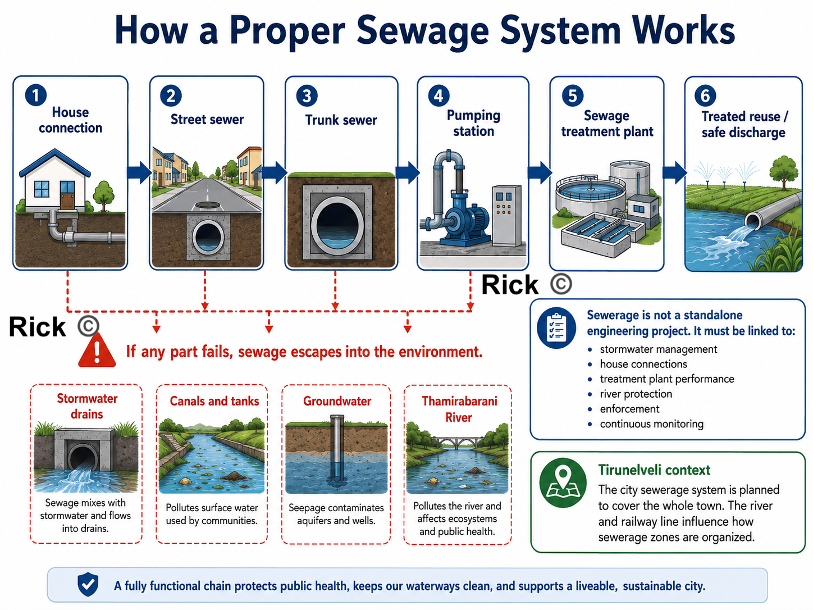{#fig-houten fig-alt="Tirunelveli Sewage System" out-width="65%"}

## Maintenance and operations

Urban planning does not end after drawing a master plan or building infrastructure. 
A city survives through continuous operation and maintenance.

| Urban system | What must be maintained |
|---|---|
| Sewerage | House connections, manholes, pumping stations, treatment plants, overflow points |
| Stormwater drains | Desilting, blockage removal, culvert cleaning, monsoon preparation |
| Roads | Pothole repair, resurfacing, utility-cut restoration, junction safety |
| Solid waste | Door collection, street sweeping, market waste, transfer points |
| Public health | Toilets, vector control, sanitation inspections, waste enforcement |
| Water bodies | Tank protection, canal flow, sewage prevention, encroachment control |
| Public realm | Footpaths, shade trees, bus stops, lights, benches, parks |

::: {.callout-tip}
## Planning lesson
Maintenance must be treated as part of urban planning.
Maintenance is what will keep the plan alive after construction.
:::

## Enforcement

Tirunelveli needs predictable, rule-based enforcement, not sudden action after problems become severe.
This means, everyone is aware of predictable rules, and the city enforces them consistently.

The city must enforce:

- no building without planning permission and building permit
- no layout approval without roads, drains, water, sewage, streetlights, and open space
- no occupation without completion certificate and service checks
- no sewage discharge into stormwater drains or river channels
- no construction on tanks, canals, drainage channels, floodplains, and low-lying areas
- no road cutting without proper restoration
- no regularisation that rewards repeated violations

Weak or ad-hoc enforcement creates the familiar pattern: sewage enters drains, drains overflow, roads are cut and not restored, tanks are encroached, and layouts are approved before infrastructure is complete.

## What the city of Tirunelveli needs?

Tirunelveli needs an accountable **urban delivery system**: a practical structure for planning, implementation, maintenance, operations, monitoring, and enforcement.
The city needs to create a **City Planning, Infrastructure, and Maintenance Cell** under the Corporation Commissioner, formally linked with the Tirunelveli Local Planning Authority.

This cell needs to include:

- town planners
- civil engineers
- sewerage engineers
- stormwater-drainage engineers
- GIS staff
- public-health officials
- ward officers
- finance staff
- enforcement officers

Its first task should be to create a public **Urban Systems Web Dashboard**.

| Map / register | Purpose |
|---|---|
| Sewerage coverage map | Shows which houses are connected and which depend on septic tanks |
| Sewage outfall map | Tracks where sewage enters drains, canals, and the river |
| Stormwater drain map | Shows blocked drains, missing links, and flooding points |
| Road-maintenance register | Tracks potholes, resurfacing, utility cuts, and contractor responsibility |
| Building approval map | Shows approved layouts, illegal layouts, and violations |
| Water-body protection map | Protects tanks, canals, floodplains, and wet agricultural areas |
| Ward maintenance dashboard | Shows complaints, repair status, costs, and delays |

## Immediate priorities

1. Fill critical vacancies in engineering, planning, sanitation, and public-health posts.
2. Complete underground sewerage work with full house connections.
3. Repair old and damaged sewer lines.
4. Identify and close every sewage-mixing point near the Thamirabarani.
5. Create ward-level maintenance schedules for drains, roads, lights, toilets, parks, and markets.
6. Link every new layout approval to infrastructure capacity.
7. Publish monthly ward-wise metrics, dashboard in public website for sewage, drainage, roads, sanitation, and enforcement.

::: {.callout-important}
## Central argument
Tirunelveli's problem is fragmented responsibility, weak staffing, poor maintenance, incomplete sewage operations, and uneven enforcement.
A better solution is to connect master planning, municipal engineering, sewage management, drainage, public health, ward maintenance, finance, and legal enforcement into one accountable city system.
:::

# Synthesis: Three Families of Underperformance

The underperformance problems described so far may look like separate complaints, imported planning models, coloured land-use maps, overloaded cores, disappearing tanks, vacant engineering posts, weak sewage systems, and polluted rivers.

But they fall into three connected families of underperformance:

- **Planning mindset:** the city is treated too much like a coloured land-use map, instead of a living system of people, water, streets, heat, markets, schools, housing, agriculture, and daily movement.

- **Missing planning layers:** the plan does not fully show mobility, density, hydrology, heat, public realm, infrastructure capacity, social inequality, or growth phasing.

- **Weak delivery system:** even when the plan says the right things, authority, money, staff, enforcement, and maintenance are split across different bodies.

The order matters. Mindset shapes the plan, the plan shapes what gets built, and the delivery system determines whether anything is actually implemented and maintained.

## Family 1: Paradigm: the wrong *kind* of plan for this kind of city

This is what Geddes, Koenigsberger, Jacobs, Roy, and Alexander are all arguing, each in their own language. A Tamil Nadu master plan is a **static, end-state, land-use zoning map**. But the South Indian city is mixed-use, informal, incremental, hot, and organized by water. So the instrument is mismatched to its object. It treats the actual life of the city, street vendors, the temple-street core, tanks, mixed-use frontages, the *thinnai* as encroachments and nuisances to be cleared, rather than as the living structure to build *on*.

This is the deepest underperformance, because it is upstream of everything else. Before we ask whether a plan is well-made or well-funded, we have to notice that the plan is the wrong *type*: a fixed drawing of a future end-state, where what the city needs is a **process**, diagnosis before plan, life before land-use, repair before replacement.

## Family 2: Content: even as a map, most of the layers are missing

Grant, for a moment, that a land-use map is the right instrument. The Tirunelveli map still fails on its own terms, because it shows what land is *for* but not how the city *works*. It has no mobility hierarchy, no density layer, no hydrology, no heat map, no public-realm map, no infrastructure-capacity layer, no equity layer, and no growth-phasing.

Every visible symptom in the case study is downstream of these missing layers:

- Growth follows roads because there is no mobility-and-centres structure to guide it, producing **ribbon development**.
- The Tirunelveli–Palayamkottai core overloads because there are no planned **secondary centres**.
- New colonies arrive before services because there is no infrastructure-first rule, **layout-first urbanisation**.
- Tanks are built over because water bodies are drawn as isolated blue patches, not as a connected **blue-green system**.
- Streets are hostile because heat, shade, and the public realm were never mapped at all.

## Family 3: Delivery: the binding constraint

Now grant that we have a perfect sixteen-layer atlas. Tirunelveli *still* would not change, because of who holds the plan and who holds the power.

- **Plan–power split.** The plan is prepared by a state arm, the Local Planning Authority chaired by the District Collector, with the DTCP on the technical side, a body residents cannot vote out. It must be executed by a Corporation that has neither legal authority over land use nor the money to build. Thirty years after the 74th Amendment, town-planning powers have not been devolved.
- **Money.** Municipal revenues run on a thin, dependent base, barely 53% from own sources, property tax underperforming on outdated valuation, capital outlay squeezed to about 1.4% of GSDP against a national average of 2.1%, and operation-and-maintenance chronically unfunded[@prsTNBudget2022]. 
- **Capacity.** The technical posts that would inspect, maintain, and enforce the plan sit vacant, City Engineer 0 of 1, Planning Inspectors 0 of 12, most Technical Assistant and Sanitary Inspector posts empty. The constraint is not a shortage of engineers in South India; it is sanctioned posts left unfilled.
- **Maintenance and enforcement vacuum.** Even built infrastructure decays without ward-level upkeep, and enforcement arrives as the periodic bulldozer rather than a predictable, rule-based system.

::: {.callout-important}
## The single most important point
These three families are not equally fixable, and **Family 3 is the bottleneck.** We could fix the paradigm and produce a beautiful planning atlas, fixing Families 1 and 2 completely, and Tirunelveli would still not change, because no one who can be voted out controls the land use or the budget.

**The plan and the power to carry it out are often sitting in different hands.** Every other reform depends on closing that gap first.
:::

# Solutions: attacking each family at its root

## Fixing the paradigm: plan life, not just land

Shift the master plan from an end-state zoning map to a **process**:

- **Diagnose before plan** (Geddes). Begin by mapping existing centres and life-patterns, bus stops, markets, tanks, school streets, temple streets, tea-shop corners, before assigning any colors.
- **Centres-and-corridors, not ribbons.** Concentrate growth around planned nodes and transit corridors; protect agricultural, tank, and floodplain buffers as a deliberate act, not as leftover land.
- **Protect and strengthen the informal city** (Roy, Jacobs). Give vendors, mixed-use frontages, and incremental housing physical structure and legal standing, instead of zoning them out and then demolishing them.
- **Adopt a repair sequence** (Alexander) as the actual order of work: water and drainage first, then shaded walking spines, then protection of vulnerable users, then strengthening of public centres, then building edges, then small outdoor rooms, then maintenance.

## Fixing the content: build the atlas, and measure performance

Replace the single land-use sheet with the **planning atlas** already proposed in this post (urban structure, density, mobility hierarchy, public transport, walkability, blue-green, flood, infrastructure capacity, social infrastructure, public realm, heat, risk, agricultural protection, growth phasing, implementation). Two additions make it bite:

1. **A performance / outcome layer.** Not merely "this is residential," but "does this residential area actually have footpaths, drainage, bus access, and shade?" A land-use map says what land is *for*; a performance map says whether it *works*.
2. **Human-scale design instruments.** Form-based **street sections** for the key corridors and the temple core, so "public realm" becomes an enforceable drawing, right-of-way allocated to carriageway, footpath, drains, trees, and bus access, rather than an aspiration.

## Fixing delivery: start here

This is the family that decides whether anything on paper becomes real.

- **Close the plan–power gap.** Devolve planning to the elected Corporation under the 74th Amendment, or at minimum make the Local Planning Authority formally answerable to it, and constitute a functioning District / Metropolitan Planning Committee. Concretely, stand up a **City Planning, Infrastructure & Maintenance Cell** under the Corporation Commissioner, town planners, civil and sewerage and drainage engineers, GIS and public-health staff, ward officers, finance and enforcement officers, as the single body that unifies the fragmented agencies under one authority residents can actually vote on.
- **Fund it, and tie the funding to the plan.** Fix property-tax valuation and coverage first, it is the largest own-source lever. Then add **land-value capture along the proposed BRTS / TOD corridors** (a betterment levy or transit-linked charge), so the mobility investment helps pay for itself. Layer **municipal bonds** on top, the ₹150.85 crore raised by Coimbatore and ₹100 crore by Tiruppur in January 2026, following Chennai's ₹205.59 crore, show the route works, and **ring-fence operation-and-maintenance budgets** so upkeep stops being the first casualty of a tight year.
- **Make one rule structural: no layout approval without infrastructure capacity.** A single "infrastructure-first" regulation, no approval unless trunk water, sewerage, drainage, and road capacity exist or are bonded, kills layout-first urbanisation at its regulatory root. This deserves to be a headline reform, not a buried line.
- **Staff it, and enforce predictably.** Fill the sanctioned-but-vacant technical posts; publish monthly ward-wise dashboards for sewage, drainage, roads, sanitation, and enforcement; and, crucially **pair enforcement with alternatives**. Relocate vendors and informal residents to serviced space rather than demolishing, so enforcement becomes a predictable rule rather than a periodic shock.

## The issue → root → solution map
 
Every problem raised across this post, collapsed onto the three families and paired with the reform that addresses it. Read top to bottom, it is also a rough order of work: paradigm and content shape *what* to build, but the delivery rows decide *whether anything gets built at all*.
 
| Issue | Root family | Primary solution |
|---|---|---|
| Land-use map treated as the whole plan | Paradigm | Shift to a *diagnose-before-plan* process; map existing centres and life-patterns before assigning colours |
| Informal economy treated as encroachment | Paradigm | Give vendors, mixed-use frontages, and incremental housing legal standing and designated physical space |
| Road-based ribbon growth | Content | Centres-and-corridors (nodal) structure with a mobility hierarchy; protect buffers between corridors |
| Overloaded old core | Content | Plan and strengthen secondary centres so trips no longer all funnel inward |
| Layout-first colonies | Content | Complete-neighborhood standards, shops, schools, parks, drainage, bus access, before occupation |
| No density layer | Content | Map population and building density to size roads, drainage, water, schools, and transit |
| Tanks shown as isolated patches; flooding | Content | Statutory connected blue-green network with a no-build register and a custodian agency |
| Agriculture treated as future real estate | Content | Classify land: protect / green-blue buffer / urbanise only after infrastructure is planned |
| Scattered industrial pockets | Content | Compatibility zoning by intensity, with buffers, truck routes, and wastewater treatment |
| Public realm invisible | Content | Public-realm and walkability layers; form-based street sections for corridors and the core |
| Heat not mapped | Content | Treat shade as infrastructure, street trees, cool roofs, shaded footpaths and bus stops |
| Social inequality not mapped | Content | Add an equity layer; prioritise water, sanitation, and safe access for the most vulnerable |
| Plan made by an unelected body; no devolution | Delivery | Devolve planning under the 74th Amendment; a functioning DPC/MPC; a City Planning & Maintenance Cell |
| Weak municipal finance; unfunded O&M | Delivery | Property-tax reform, land-value capture on TOD corridors, municipal bonds; ring-fence maintenance |
| Vacant technical posts | Delivery | Fill sanctioned engineering, planning, and sanitation posts; staff a permanent maintenance cell |
| Infrastructure capacity not tied to approvals | Delivery | Infrastructure-first rule, no layout approval without trunk capacity, existing or bonded |
| Growth phasing unclear | Delivery | Phase growth into immediate / future / no-build / infrastructure-first zones |
| Ad-hoc enforcement; sudden demolitions | Delivery | Predictable, rule-based enforcement paired with relocation alternatives |
| Maintenance treated as an afterthought | Delivery | Ward-level maintenance schedules and public dashboards; O&M built into the design |
 

::: {.callout-tip}
## The sequence that matters
Fix delivery first, authority, money, staff, maintenance, because it gates everything else. Build the atlas in parallel. And within the physical work, follow Alexander's order: **water and drainage before roads, shade before beautification, vulnerable users before vehicles, and maintenance treated as part of the design, not an afterthought.**
:::

The raw materials of a good city are already present in Tirunelveli, the old core, the institutions, the Thamirabarani system, the tanks, the villages, the regional connections. The underperformance is that the plan is ill-suited, drawn without most of its layers, by a body that cannot deliver it. Fix those three things in that order, and the same land begins to work as a city.

# Bay Village, Ohio, USA

I am familiar with this town. So I am choosing this as another example of showing a planning atlas.
**Many might speak, the comparison with Bay Village is not valid because it is a small town in the USA.** 

**Bay Village is not used here as a population-equivalent comparison.**
It is used as a planning-document example: a small town showing how master planning can include neighbourhoods, connectivity, village centre design, bicycle routes, public input, and implementation priorities, rather than relying only on one land-use map.

The point is that even a small town prepares multiple planning layers, neighbourhood strengthening, connectivity, village center redevelopment, trails, bioswales, mixed-use development, civic space, and bicycle routes. The Cuyahoga County Planning Commission says Bay Village’s master plan focused on strengthening neighborhoods, connecting the community, and reimagining the Village Center; it also mentions a multimodal trail, bioswales, mixed-use development, a library, and Village Green.

And so, the town experiences higher quality of life, better public space, safer walking and cycling, and a more organized urban structure.

## PDF example: Bay Village Master Plan

```{=html}
<iframe 
  src="../../images/urbanplanning/TamilNadu/bay-village-master-plan.pdf" 
  width="100%" 
  height="650px"
  style="border: 1px solid #ccc;">
</iframe>
```
[Open the Bay Village Master Plan PDF](../../images/urbanplanning/TamilNadu/bay-village-master-plan.pdf)

The plan is about neighborhood quality, local connectivity, lakefront access, bicycle/pedestrian movement, housing choice, Village Center redevelopment, green infrastructure, and implementation. Bay Village’s planning document is better as a delivery-oriented planning document because it turns goals into actions, priorities, partners, timelines, cost categories, zoning changes, design guidelines, and capital improvement programs.

### 1. It begins with public input and community priorities

The Bay Village planning process used a community survey, project team, steering committee, and public meetings. The survey sent 1,200 questionnaires, received 576 responses, and reported a 48% response rate with a 95% confidence level [@bayVillagePresentation2017].

This matters because the plan is also a record of what residents value: neighbourhood character, parks, Lake Erie, walking, cycling, housing options, infrastructure, and the Village Center.

For Tirunelveli, this is an important lesson, Public participation could mean collecting objections after the plan is drafted. It should become part of the diagnosis, where people walk, where drains fail, where children cross roads, where women feel unsafe, where vendors need space, where sewage enters drains, where tanks are encroached, and which neighbourhoods lack parks, clinics, bus access, and footpaths.

### 2. It organizes planning around clear visions

The Bay Village plan is organized around several practical visions:

- keeping a commitment to place
- continuing dedication to parks, recreation, and Lake Erie
- diversifying housing options
- establishing a pedestrian and bicycle friendly community
- creating a more vibrant Village Center
- maintaining and greening city infrastructure
- building community

All these become planning categories, goals, and actions. For example, the plan connects neighbourhood character with design guidelines, housing with aging-in-place, transportation with bicycle and pedestrian networks, and infrastructure with green stormwater management [@bayVillagePresentation2017].

This is better than treating the city mainly as residential, commercial, industrial, institutional, agricultural, and water-body colours. Land-use colour is useful, but it does not by itself tell us whether the city works.

### 3. It treats movement as a local network

Bay Village planning gives strong attention to walking and cycling. The plan calls for a pedestrian and bicycle friendly community with dedicated lanes, trails, enhanced crosswalks, and public transit connections to parks, amenities, and institutions [@bayVillagePresentation2017].

The Bay Village bicycle map is also practical. It does not merely show roads. It distinguishes routes with more traffic, routes with less traffic, and cut-throughs or paths. It also marks schools, the library, the community garden, and the Village Bicycle Cooperative [@bayVillageBikeRoutesPDF].

This is a major contrast with many South-Indian town plans. In Tirunelveli, We can wonder whether children can walk to school safely, whether bus stops have shade, whether crossings exist, whether cyclists have safe routes, whether elderly people can walk to shops, and whether neighbourhoods are connected without forcing every trip through the congested core.

### 4. It reimagines the town center as a public place

Bay Village identified that its Village Center was dominated by parking lots and car-centric design. The plan proposed a more walkable, bikable, mixed-use Village Center, with retail, residential uses, a planned library, and a Village Green [@countyPlanningBayVillageMasterPlan; @bayVillagePresentation2017].

This is important because Bay Village is asking whether the commercial center functions as a civic place. 
Does it support walking? 
Does it create a gathering space? 
Does it support local retail? 
Does it produce “feet on the street”? 
Does it strengthen community identity?

Tirunelveli needs this kind of thinking for its old core, market streets, bus stands, railway station areas, hospital streets, school clusters, temple/church/mosque streets, and emerging outer centres. A commercial area needs to be designed as a public realm.

### 5. It connects infrastructure with green design

Bay Village’s plan includes a vision for “Maintaining & Greening City Infrastructure.” It says infrastructure includes roads, crosswalks, sidewalks, sewers, and storm sewers, and that the city should address stormwater and flooding through green infrastructure. The highlighted actions include tree protection, sewer separation or disconnection policy during major projects, and wider use of green infrastructure such as bioswales, rain gardens, pervious pavement, green parking lots, and riparian setbacks [@bayVillagePresentation2017].

This is one of the strongest lessons for South Indian town like Tirunelveli. Drainage, sewerage, tanks, canals, streets, trees, and flood control should not be separate departments acting after underperformance. They should be planned together as a blue-green infrastructure system.

### 6. It has implementation tables

The strongest part of the Bay Village planning method is implementation. The presentation says implementation tables include priorities, potential partners, funding alignment, grant applications, timelines, priority levels, and estimated cost categories [@bayVillagePresentation2017].

That is a big difference from a plan that only says what land is used for. A real plan asks:

- Who will do this?
- In what order?
- With what funding?
- With which partner?
- Is it high, medium, or low priority?
- Is it a 1–2 year, 2–3 year, 3–5 year, 5+ year, or ongoing action?
- Does it require zoning, design guidelines, development regulations, capital improvement programs, or project funding?

This is exactly what Tirunelveli needs, a good implementation system.

## South Indian towns could learn from Bay Village

Bay Village's approach is effective because the planning document is more directly tied to **daily civic delivery**.

| Planning question | Bay Village approach | Tirunelveli lesson |
|---|---|---|
| What is the plan for? | A 10-year guide for city action, funding, zoning, design, and public investment | The master plan should become a delivery system|
| Who participates? | Survey, project team, steering committee, public meetings | Ward-level diagnosis should include residents, vendors, school users, bus users, sanitation workers, and engineers |
| How is movement planned? | Bike routes, crosswalks, trails, sidewalks, local connections, school/library routes | Tirunelveli needs safe walking, shaded routes, school streets, bus access, and cycle routes |
| How is the center treated? | Village Center as mixed-use, walkable, civic, retail, library, Village Green | Tirunelveli needs secondary centres and better public realm around markets, institutions, bus stands, hospitals, and schools |
| How is infrastructure treated? | Roads, sidewalks, sewers, storm sewers, green infrastructure, tree protection | Tirunelveli needs sewerage, stormwater, tanks, canals, streets, and trees planned together |
| How is implementation handled? | Priorities, partners, timelines, cost categories, funding streams, ordinances, CIP | Tirunelveli needs responsible agencies, budgets, phasing, maintenance registers, dashboards, and enforcement |
| What is the planning language? | Neighbourhoods, connectivity, parks, lakefront, housing, Village Center, infrastructure, community | Tirunelveli should move beyond colour-coded land use into a planning atlas and urban delivery system |


## Map example: Bay Village Bicycle Routes

```{=html}
<iframe 
  src="../../images/urbanplanning/TamilNadu/bay-village-bicycle-routes.pdf" 
  width="100%" 
  height="650px"
  style="border: 1px solid #ccc;">
</iframe>
```

[Open the Bay Village Bicycle Routes Map](../../images/urbanplanning/TamilNadu/bay-village-bicycle-routes.pdf)

# Popular Complaints and Technical Translation

In this section, we translate common complaints from people into urban, civil and architectural planning terms, and then suggest possible solutions. The goal is to make the diagnosis and prescription clear, so that residents, elected officials, and technical staff can all understand the problem and work together on a solution.

::: {.diagnosis-table}

| Popular complaint | Technical diagnosis | Possible planning solution |
|---|---|---|
| “The roads are bad.” | Poor **right-of-way design**, weak **street hierarchy**, and an unsafe **carriageway–pedestrian interface**. | Redesign the **right-of-way** to clearly allocate space for carriageway, footpaths, drains, trees, utilities, crossings, and bus access; introduce a proper street hierarchy with different design standards for arterials, collectors, and local streets. |
| “There are no proper footpaths.” | Lack of **continuous pedestrian infrastructure**, poor **walkability**, and weak **universal accessibility**. | Build continuous footpaths, remove utility obstructions, provide ramps and safe crossings, improve surface quality, and connect walking routes to schools, bus stops, markets, clinics, and parks. |
| “There is too much traffic.” | Poor **modal hierarchy**, weak **traffic circulation planning**, and a car-dominated **level of service**. | Prioritize buses, walking, and cycling; reduce through-traffic in local neighborhoods; improve junction design; and integrate land use with public transport corridors so trips are shorter and less car-dependent. |
| “There is flooding every monsoon.” | Failed **stormwater management**, blocked **natural drainage channels**, and loss of **blue-green infrastructure**. | Restore tanks, canals, wetlands, and drainage channels; upgrade stormwater capacity; protect floodplains; desilt drains regularly; and treat water bodies and open land as part of the city’s flood-management system. |
| “The city is too hot.” | Urban **heat-island effect**, poor **thermal comfort**, and high **surface albedo/thermal mass problems**. | Expand tree canopy, add shaded streets and bus stops, reduce exposed hard surfaces, promote climate-responsive building materials, and improve ventilation and cooling through urban design and landscape planning. |
| “The buildings are ugly.” | Weak **urban design controls**, poor **frontage design**, and dead **street edges**. | Introduce urban design guidelines for active frontages, shaded setbacks, compound-wall control, signage discipline, and building forms that contribute positively to the public realm. |
| “Buildings come up randomly everywhere.” | Uncoordinated **built form**, plot-by-plot development, and weak **development control regulations**. | Strengthen development control regulations, guide building massing and setbacks, coordinate infrastructure with approvals, and move from isolated plot approval toward area-based planning and design control. |
| “The city is sprawling.” | Low-density **peri-urban expansion**, fragmented **land conversion**, and weak **growth management**. | Contain outward sprawl through growth boundaries, phased infrastructure provision, denser mixed-use development, and better planning of expansion areas before agricultural land and water systems are lost. |
| “There are no good parks or open spaces.” | Lack of an **open-space network**, poor **public realm provision**, and leftover **OSR land**. | Plan an interconnected open-space network of parks, playgrounds, shaded streets, tank edges, and neighborhood greens; ensure OSR land is usable, maintained, shaded, and connected to daily life. |
| “Planning is bad.” | Fragmented **statutory planning**, weak **implementation capacity**, and poor **institutional coordination**. | Integrate land use, transport, drainage, housing, and public space planning; strengthen municipal staffing and technical capacity; and improve coordination between planning authorities, corporations, utilities, and line departments. |
| “The city has no money.” | Weak **own-source revenue**, low **capital expenditure**, and unfunded **operation and maintenance**. | Improve property tax and user-charge systems, expand own-source revenue, build stronger municipal finance, increase capital investment, and fund long-term operation and maintenance rather than only one-time project construction. |

:::
