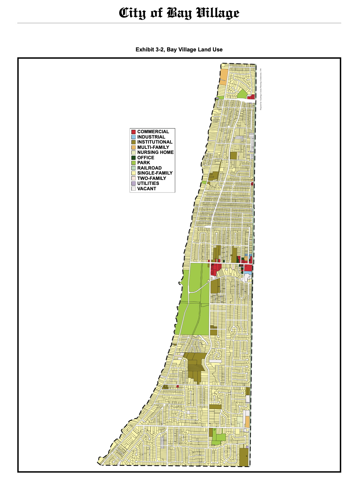

# Urban Planning in South India {.section-title}

## Issues, theories, Tirunelveli, and a Repair Sequence

I began with a simple question,  

> Why are so many South Indian towns poorly planned?

The easy answers are “bad roads” “missing parks” or "more trees". 

What I found was a chain of linked causes: **land use, water, mobility, finance, governance, and maintenance are not treated as one delivery system.**

---

## Main argument

::: {.lead}
A livable city requires integration of **land, water, movement, public life, and delivery capacity**.
:::

A city becomes functional when these layers are planned, maintained and works together:

| Physical system | Social system | Delivery system |
|---|---|---|
| Land use, roads, buses, footpaths, drainage, tanks, sewage, parks | Housing, schools, markets, worship streets, vendors, jobs, daily movement | Finance, staffing, enforcement, maintenance, public monitoring |

::: {.note-box}
The post moves from **master plan as map** to **master plan as delivery system**.
:::

---

## Three families of underperformance

| Family | What it means | What it produces |
|---|---|---|
| **Planning mindset** | The city is treated like a coloured land-use sheet, not a living system. | Roads without shade, parks without users, layouts without centres. |
| **Missing planning layers** | Mobility, drainage, density, heat, public realm, sewage, finance, and maintenance are not fully integrated. | Congestion, flooding, unsafe walking, weak public spaces, unreliable services. |
| **Weak delivery system** | Authority, money, staff, enforcement, and maintenance sit in different hands. | Plans look correct, but implementation underperforms. |

---

# Urban planning theories {.section-title}

## The theoretical spine of this work

Each theory and thinker gives a practical lens to apply

| Thinker | Core idea | Use for South Indian towns |
|---|---|---|
| **H. V. Lanchester** | Emulate, not imitate. | Adapt planning principles to Indian climate, finance, civic life, and local institutions. |
| **Patrick Geddes** | Survey before plan. | Study place, work, and folk before drawing projects. |
| **Otto Koenigsberger** | Climate must shape design. | Heat, shade, ventilation, rain, and materials are planning issues. |
| **Ananya Roy** | Informality is produced by the state too. | Ask who gets punished, regularised, exempted, or ignored. |
| **Jane Jacobs** | Street life is evidence. | Mixed use, active edges, short blocks, and local economy matter. |
| **Christopher Alexander** | Cities are living structures. | Repair centres, patterns, edges, outdoor space, and everyday dignity. |

---

## Lanchester and Geddes

| Lens | Planning lesson | Tirunelveli translation |
|---|---|---|
| **Lanchester** | Civic order needs drainage, housing, open space, roads, finance, and administration. | Do not copy European form; adapt principles to Tamil climate, tanks, markets, streets, and civic capacity. |
| **Geddes** | Survey before plan: diagnose before intervention. | Map tanks, fields, bus routes, schools, markets, religious streets, flood paths, and daily movement first. |

::: {.note-box}
Start with what's already working in South Indian town of Tirunelveli.
:::

---

## Koenigsberger: Climate is infrastructure

In South India, heat, humidity, glare, monsoon rain, ventilation, and shade decide whether streets, houses, markets, bus stops, schools, and parks actually work.

| Planning question | Design implication |
|---|---|
| Can people walk at noon? | Shade trees, verandahs, arcades, rest points, lighter surfaces. |
| Where does rainwater go? | Drainage slopes, desilting, tank protection, stormwater routes. |
| How does air move? | Cross-ventilation, courtyards, street orientation, building spacing. |
| Which surfaces trap heat? | Roof protection, shaded west walls, vegetation, cool materials. |

---

## Jane Jacobs: street life as evidence

::: {.visual-focus}

::: {.visual-img}

:::

::: {.visual-text}
<h3>Key question</h3>

Does the street support everyday life?

A good city is not only ordered from above. It is also shaped by mixed use, active streets, short blocks, local shops, children, elders, vendors, and “eyes on the street.”
:::

:::

---

## Ananya Roy: informality

::: {.visual-focus}

::: {.visual-img}

:::

::: {.visual-text}
<h3>Key question</h3>

Who decides what is illegal, when, and for whom?

Planning can create informality through ambiguity, exception, and selective enforcement.
:::

:::

---

## NITI Aayog: official diagnosis

::: {.visual-focus}

::: {.visual-img}

:::

::: {.visual-text}
<h3>Diagnosis</h3>

Fragmented planning, missing master plans, vacancies, and weak capacity.

The problem is not only urban growth. It is weak planning capacity and fragmented authority.
:::

:::

---

## Alexander: city as semilattice

::: {.visual-focus}

::: {.visual-img}

:::

::: {.visual-text}
<h3>Key Idea</h3>

A city is overlapping systems, not isolated zones.

A living city is not a simple tree of residential here, commercial there, roads elsewhere.
:::

:::

---

## Alexander: planning with life

::: {.visual-focus}

::: {.visual-img}

:::

::: {.visual-text}
<h3>Key test</h3>

Does ordinary life become easier, safer, and more beautiful?

Planning must begin with children, elders, women, vendors, shade, water, markets, and walking.
:::

:::

---

## Alexander: local patterns and street overlap

::: {.visual-grid-2}

::: {.visual-card-large}

<h3>Local patterns</h3>

Tamil towns already have life: markets, bus stops, tanks, worship streets, schools.
:::

::: {.visual-card-large}

<h3>Street as overlap</h3>

A street is walking, vending, drainage, shade, delivery, safety, and social life.
:::

:::

---

## Alexander: repair existing centres

::: {.visual-focus}

::: {.visual-img}

:::

::: {.visual-text}
<h3>Repair principle</h3>

Strengthen centres that already exist.

Repair bus stops, markets, school gates, tank bunds, worship streets, and tea corners.
:::

:::

---

## Alexander: outdoor space and housing

::: {.visual-grid-2}

::: {.visual-card-large}

<h3>Positive outdoor space</h3>

Public space must be shaped, shaded, entered, watched, used, and maintained.
:::

::: {.visual-card-large}

<h3>Climate housing</h3>

Recover verandahs, courtyards, shade, thresholds, ventilation, and humane street edges.
:::

:::

---

## Alexander’s first test for South Indian towns

| Question | Why it matters |
|---|---|
| Can children walk safely to school? | A town that endangers children is not well planned. |
| Can elderly people sit in shade? | Walking requires rest, shade, and dignity. |
| Can women wait safely for buses? | Public transport is also lighting, visibility, toilets, and seating. |
| Can vendors earn without being erased? | Informal work needs physical structure, not only eviction. |
| Can rainwater drain? | Drainage is not a technical afterthought; it shapes everyday life. |
| Can people gather in the evening? | Public life needs shaded, safe, and maintained places. |

---

# Tirunelveli case study {.section-title}

## What the 2021 land-use map shows

::: columns
::: {.column width="46%"}
The existing land-use map shows Tirunelveli as a larger city-region:

- Tirunelveli–Palayamkottai dense core
- outward residential expansion
- commercial concentration in older centres
- institutional clusters
- road-corridor growth
- agricultural landscape
- tanks, channels, water bodies
- selected industrial pockets
:::

::: {.column width="54%"}
{fig-alt="Tirunelveli existing land use map 2021" width="98%"}
:::
:::

---

## Land-use legend table

| Colour / Symbol | Meaning | Planning question |
|---|---|---|
|  Yellow | Residential | Are homes connected to schools, shops, buses, parks, water, and sewage? |
|  Blue | Commercial | Does commerce create walkable centres or congested strips? |
|  Purple / Magenta | Industrial | Are truck routes, buffers, waste, water, and worker access planned? |
|  Red | Institutional | Are schools, hospitals, colleges, and public offices safely accessible? |
|  Cyan | Open space / recreation | Are parks shaded, maintained, entered, watched, and used? |
|  Grey | Transportation | Does the road network support walking, buses, freight, and safety? |
|  Bright green | Wet agriculture | Is irrigated land protected as food, water, and flood infrastructure? |
|  Pale green | Dry agriculture | Is peri-urban growth managed without scattered sprawl? |
|  Light blue | Water bodies | Are tanks, canals, ponds, and rivers protected as blue infrastructure? |

---

## Numbers to remember

| Metric | Number | Why it matters |
|---|---:|---|
| 2011 LPA population | **7.34 lakh** | Baseline population for planning. |
| Projected 2041 population | **9.56 lakh** | More housing, water, sewage, transport, and land pressure. |
| Projected water demand | **130.32 MLD** | Water planning must match growth. |
| Projected sewage generation | **104.26 MLD** | Sewerage capacity and treatment are central, not optional. |
| Proposed block cost | **₹7,557.83 crore** | Implementation depends on phasing, agencies, and finance. |
| Coimbatore municipal bond raise | **₹150.85 crore** | Shows why own-source revenue and credible borrowing matter. |

---

## What does the map require?

A land-use map shows us **what land is used for**. It does not tell us whether the city's urban planning works.

| Missing questions | Why it matters |
|---|---|
| Are there continuous footpaths? | Walking is the base layer of daily urban life. |
| Are streets shaded? | Heat makes mobility and public life unequal. |
| Does drainage work during rain? | Flooding is a planning failure, not only a weather event. |
| Is sewage treated before discharge? | Sewerage protects tanks, canals, groundwater, and rivers. |
| Are buses accessible and reliable? | Transport shapes access to schools, jobs, hospitals, and markets. |
| Are parks actually usable? | Open space must be designed and maintained, not leftover. |

---

# Patterns seen in a South Indian town:Tirunelveli {.section-title}

## Pattern 1: Growth follows roads

| Existing pattern | Consequence | Better planning direction |
|---|---|---|
| Housing layouts, shops, petrol bunks, colleges, marriage halls, warehouses, and workshops grow along roads. | The same road becomes highway, market street, bus route, parking area, and pedestrian space. | Move toward **centres-and-corridors planning**. |
| Development spreads in strips instead of neighbourhood centres. | Long trips, congestion, weak local public life. | Build local centres around transit, schools, markets, parks, and services. |
| Roads become the main development logic. | Planning reacts after congestion appears. | Plan land use, mobility, drainage, and utilities together before conversion. |

---

## Pattern 2: The Old core is overloaded

::: {.lead}
When outer residential areas lack strong local centres, everyone keeps depending on the old core.
:::

| Result | What it means |
|---|---|
| Congestion in historic streets | Old streets carry too many functions without redesign. |
| Pressure on central markets and institutions | Economic and institutional life remains too centralized. |
| Longer daily trips | Outer housing does not become complete neighbourhoods. |
| Unsafe walking and parking conflicts | Streets become contested space. |
| Weak neighbourhood identity outside the core | New areas become layouts, not places. |

---

## Pattern 3: Agriculture is not empty land

Agricultural land supports food production, livelihoods, groundwater recharge, flood absorption, cooling, village identity, and open landscape structure.

| Common question | Better question |
|---|---|
| Which agricultural land can be urbanized? | Which agricultural land must remain part of the regional support system? |
| How fast can land be converted into layouts? | Which lands protect water, food, flood storage, ecology, and rural livelihoods? |
| Where can the city expand cheaply? | Where can growth happen without creating long-term infrastructure debt? |

---

## Pattern 4: Water bodies are infrastructure

Tanks, channels, wetlands, canals, and river edges are not decorative blue areas.

| Water-body function | Planning implication |
|---|---|
| Irrigation and groundwater recharge | Protect inflows, outflows, catchments, and recharge zones. |
| Flood storage and stormwater movement | Keep floodplains, low-lying land, channels, and tank chains open. |
| Cooling and public landscape | Treat tank bunds and river edges as blue-green public space. |
| Pollution control | Stop sewage, solid waste, and illegal discharge. |
| Ecology and memory | Protect cultural and ecological identity, not only water volume. |

::: {.note-box}
A blue-green network must be mapped, protected, financed, maintained, and monitored.
:::

---

## Sewage is a chain

| Link | Failure mode | Planning responsibility |
|---|---|---|
| House connection | Homes not connected to the network. | Connection drives, inspections, public communication. |
| Street sewer | Blockage, leakage, illegal discharge. | Maintenance, repair, monitoring. |
| Trunk sewer | Capacity mismatch. | Phasing and hydraulic design. |
| Pumping station | Power failure, poor operation. | Operations budget, backup power, staff. |
| STP | Underperformance or bypassing. | Performance monitoring, compliance, reuse planning. |
| Reuse / safe discharge | Treated water not reused; polluted outfall. | River protection, agriculture reuse, enforcement. |

::: {.note-box}
If any link fails, sewage enters stormwater drains, canals, tanks, groundwater, and the river.
:::

---

## Mobility: beyond road widening

The master plan includes road hierarchy, footpaths, accident data, traffic counts, public transport, ring road, bus shelters, pedestrian crossings, cycle tracks, freight management, and junction improvements.

| The real test | Users affected |
|---|---|
| Do footpaths connect continuously? | Children, elderly people, disabled people, bus users. |
| Are school streets slowed and protected? | Children, parents, teachers, vendors. |
| Are bus stops shaded, lit, and safe? | Women, students, workers, patients. |
| Are freight and truck routes separated from local streets where needed? | Residents, pedestrians, shops, schools. |
| Are junctions designed for people, not only vehicles? | Everyone outside a car. |

---

# Delivery system {.section-title}

## Finance: the core engine for maintenance and operations

::: {.lead}
When a city cannot fund maintenance, the master plan becomes a wish list.
:::

| Needed revenue engine | Why it matters |
|---|---|
| Updated and collected property tax | Backbone for local urban services. |
| Realistic water, sewage, and solid-waste user charges | Keeps systems operating after construction. |
| Grants tied to measurable delivery | Reduces symbolic projects and improves accountability. |
| Municipal bonds where revenue capacity is credible | Helps finance large infrastructure, but requires trustworthy revenue. |
| Annual maintenance budgets | Prevents roads, drains, parks, toilets, and lights from failing after inauguration. |

---

## Governance: who is responsible?

::: {.lead}
The plan and the power to carry it out often sits in different hands.
:::

| Fragment | Problem |
|---|---|
| Planning authority | May be state-controlled or chaired by appointed administration. |
| Municipal corporation | Handles visible daily services but may not fully control statutory planning. |
| Line departments | Water, highways, transport, electricity, drainage, and land can sit in different agencies. |
| Residents | Experience the city as one connected system. |

::: {.note-box}
Fragmented authority is producing poor accountability resulting in ineffective maintenance and operations.
:::

---

## Two working models: Houten and Bay Village

::: {.lead}
A Dutch new town and a small American lakeside suburb show what a
functioning delivery system looks like at town scale.
:::

::: {.visual-grid-2}

::: {.visual-card-large}

<h3>Houten, Netherlands (~50,000)</h3>

Planned from the 1970s around cycling and walking: a car ring road outside,
direct bike and pedestrian routes inside, neighbourhood centres within a
short ride of every home. Through-traffic never enters living streets.
:::

::: {.visual-card-large}

<h3>Bay Village, Ohio, USA (~16,000)</h3>

An ordinary suburb that has a stable property-tax base, maintained parks and streets, walkable schools, and a
local government residents can hold accountable.
:::

:::

::: {.takeaway}
Neither is a template to copy. Both **pair a clear physical plan with the
money, staff, and maintenance to deliver it** — the combination South Indian
towns could incorporate.
:::

---

## "But these are small, rich towns": Why the comparison holds?

::: {.lead}
Neither town is used as a **population-equivalent** comparison.
Both are used as **Planning-Maintenance-Operation** examples: proof that even small towns plan in layers, maintain and operate effectively.
:::

| Objection | Answer |
|---|---|
| Bay Village has only ~16,000 people. | That is the point. Even a town this small prepares a multi-layer plan, neighbourhood strengthening, connectivity, village-centre redesign, trails, bioswales, mixed-use development, and civic space, with public input and implementation priorities. |
| Houten is a wealthy Dutch new town. | The goal is not wealth, it is learning the template of **Sequencing**, **Maintenance** and **Operation**. Houten decided its mobility hierarchy *before* growth, so every layout that followed inherited safe routes and local centres. |
| South Indian towns are larger and denser. | Larger towns need **more** planning layers, not fewer. If a 16,000-person suburb plans connectivity and public space explicitly, a 9.5-lakh city-region requires more comprehensive planning, maintenance and operations. |

::: {.note-box}
I know Bay Village personally, which is why it appears here, it is planned, maintained, and operates efficiently.
:::

## How do Houten and Bay Village serve as models?

| Stronger places usually have | Tirunelveli needs |
|---|---|
| Clear land-use and mobility hierarchy | Neighbourhood centres, not only ribbon growth. |
| Protected routes for vulnerable users | Walkable school, market, hospital, and bus streets. |
| Park and open-space systems | Usable, shaded, maintained public spaces. |
| Ward / neighbourhood-level service planning | Local performance maps. |
| Reliable tax base | Funded maintenance and credible borrowing. |
| Accountable local administration | Clearer agency responsibility. |
| Long-term maintenance routines | Drain, footpath, sewage, park, streetlight, and tank care. |

---

## Repair Sequence {.section-title}

::: {.lead}
Repair the city by connecting planning, infrastructure, finance, maintenance, and accountability.
:::

---

## The repair steps

::: {.sequence-layout}

::: {.sequence-left}

Do first

| Step | Repair |
|---:|---|
| 1 | Map centres: schools, markets, tanks, bus stops, clinics, worship streets. |
| 2 | Fix water, sewage, and drainage. |
| 3 | Create shaded walking spines. |
| 4 | Protect children, women, elderly people, disabled people, patients, and pedestrians. |
:::

::: {.sequence-right}

Then build around it

| Step | Repair |
|---:|---|
| 5 | Strengthen markets, bus stops, school streets, tank edges, and hospital streets. |
| 6 | Repair building edges and public outdoor spaces. |
| 7 | Fund maintenance, monitoring, enforcement, and service performance. |
:::

:::

::: {.takeaway}
The rule: **Do not approve layouts without infrastructure capacity.**
:::

---

## Takeaway 1: What's urgently needed for South Indian towns?

::: {.lead}
South Indian towns such as Tirunelveli need a **delivery system**.
:::

| Problem | Meaning |
|---|---|
| **Planning mindset** | The city is treated too much like a land-use colour map, instead of a living system of people, water, streets, markets, schools, housing, agriculture, and daily movement. |
| **Missing layers** | Mobility, density, hydrology, heat, public realm, infrastructure capacity, social inequality, and growth phasing are not fully visible. |
| **Weak delivery** | Authority, money, staff, enforcement, operations, and maintenance are split across different bodies. |

::: {.takeaway}
The plan and the power to carry it out must come together.
:::

---

## Takeaway 2: The Repair Sequence

::: {.lead}
We'd need to move from **master plan as map**  to **master plan as delivery system**.
:::

| Shift | What it means |
|---|---|
| **Map → Atlas** | Add mobility, water, sewage, stormwater, heat, density, public realm, finance, risk, and phasing layers. |
| **Layout approval → Infrastructure capacity** | No growth without water, sewage, drainage, road access, schools, parks, public transport, and maintenance capacity. |
| **Projects → Maintenance** | Build only what can be cleaned, repaired, funded, enforced, monitored, and operated over time. |
| **Imitation → Local repair** | Strengthen Tamil urban life: tanks, markets, shaded streets, school streets, bus stops, vendors, agriculture, and neighbourhood centres. |

::: {.takeaway}
A well-planned town is produced by **engineering + finance + law + climate design + municipal capacity + democratic accountability**.
:::

---

## Final Takeaway: The Test of Planning

::: {.lead}
The final test is whether residents living in the town feel safe, happy, served, and connected.
:::

::: {.pill-grid}
children walk safely
women wait safely
elders rest in shade
vendors earn with dignity
markets stay clean
tanks carry water
streets drain
buses serve people
homes stay cooler
neighbourhoods function
:::

::: {.takeaway}
For South Indian towns, the urban planning goal is to make the city **livable, safe, serviced, shaded, walkable, climate-resilient, and accountable**.
:::