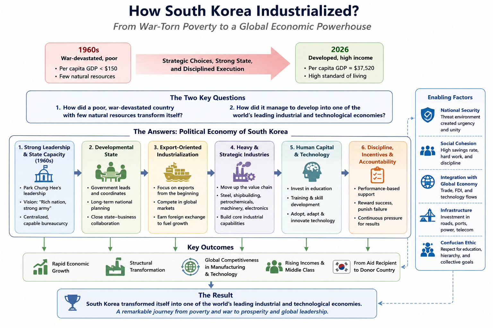

# Introduction

In my earlier posts, I explored the development, industrialization of several East Asian economies. 
This included Taiwan, Japan, Singapore, and China. I also discussed about early Russian empire's industrialization in the early 20th century.

In this post, We focus on South Korea and its remarkable journey from a war-torn nation to a global economic powerhouse.
South Korea is popular among younger Indians for cultural exports like, Korean dramas, K-pop, films, cosmetics, and consumer brands have gained a large following in India.

However, there's a remarkable story behind South Korea's economic transformation that is worth exploring, especially for those interested in developmental economics and the lessons it offers for other nations.

The focus of this post is to answer these two questions, 

**1. How did a poor, war-devastated country with few natural resources transformed itself?**

**2. How did it manage to develop into one of the world's leading industrial and technological economies?**

# South Korea (대한민국)

<figure style="display: inline-block; width: 500px; max-width: 100%; margin: 1.5rem 0; padding: 0;">
  
  <figcaption style="margin-top: 0.5rem; margin-left: 6%; padding: 0; text-align: left;">
    Map of South Korea. 
  </figcaption>
</figure>

South Korea has a population of about 51 million people and a land area of 100,472 km² [@koreaOverview2026]. 
In 2026, the per capita income of South Korea is about $37,520. This makes it as developed country with a high standard of living [@imfKorea2026].
In 1960, South Korea's GDP per capita was below $158, and the country was one of the poorest in the world [@worldBankKorea1960].

South Korea has about 6 Provinces[@moisKoreaProvinces] plus three special self-governing provinces, Gangwon, Jeonbuk, and Jeju [@koreaOverview2026].
Seoul is a separate special city and the national capital,[@moisKoreaProvinces] it is geographically surrounded by Gyeonggi but is not part of Gyeonggi Province. Gyeonggi Province is the most populous province. It's the manufacturing and tech hub surrounding Seoul. 

In Semiconductor leadership, South Korea dominates the global microchip and memory market[@investKoreaSemiconductors]. They also built one of the world's fastest and most pervasive broadband and 5G networks [@oecdConnectivity2025]. Seoul–Gyeonggi–Incheon, commonly called the Capital Area, concentrates headquarters, universities, research, logistics, finance, and advanced manufacturing [@investKoreaCapitalRegion2025].

This makes us wonder, How does a country with a GDP per capita of $158 in 1960 assemble, within a few generations, the industrial firms, engineering capacity, infrastructure, universities, export networks, and state institutions needed to compete at the technological frontier?

# Transformation of South Korea

The authors in this book argue that it is important to understand Political Economy of South Korea to understand its economic transformation.

Park Chung Hee was the leader of South Korea from 1963–1979 [@kim2011PoliticalHistory].
Park Chung Hee is a man with a very complex personality, which can be grasped only by combining analytic opposites. 
First, a soldier of imperial Japan before 1945 and an artillery officer in South Korea’s rapidly modernizing armed forces after 1948. 
Park looked like another bureaucrat, colorless in style and pragmatic in outlook. Beneath this appearance, however, hid his revolutionary ideological vision of “rich nation, strong army.”

Second, as a son of a poor peasant, he also looked like a materialist only interested in kyông-chae chaeiljuui (economy first) when presiding over monthly, weekly, and even daily meetings on industrial and construction projects. The way he commanded those meetings was, however, more Nietzschian, trying to instill in people his “can do” spirit (hamyôn tôenda) that idealized the power of the human will [@kim2011PoliticalHistory]. 

Third, in a similarly paradoxical way, Park saw Meiji Japan’s genros of low-samurai class origins as his role models.
The genrō came from relatively lower-status samurai background, rather than from the traditional top hereditary elite. 
They became,  Japan’s real governing elite, and core political architects of the new Meiji state. 

Park ruled in most un-Japanese ways, preferring top down rather than collective leadership and command rather than consensus building. 
Fourth, Park was a populist with a deep contempt for South Korea’s traditional elites, whom he held responsible for the Chosôn dynasty’s colonial subjugation in 1910. 

He was also an elitist with a dirigiste vision[state plays an active role] of modernization, critical of his people’s alleged passivity, opportunism, indolence, and defeatism.

<figure style="display: inline-block; width: 500px; max-width: 100%; margin: 1.5rem 0; padding: 0;">
  
  <figcaption style="margin-top: 0.5rem; margin-left: 6%; padding: 0; text-align: left;">
    Ezra Vogel's book, Park Chung Hee Era, Transformation of South Korea.
  </figcaption>
</figure>

The Park Chung-Hee Era: The Transformation of South Korea is an edited compilation of some twenty-one separate chapters.
Ezra Vogel, was an American sociologist (1930—2020). He was the Professor of Social Sciences at Harvard University. 

The Author Ezra Vogel puts Park Chung Hee in the category of the twentieth century’s great modernizers, with the likes of Mustafa Kemal Atatürk, Lee Kuan
Yew, and Deng Xiaoping. Many of Park Chung Hee’s personal qualities, from a spirit of “deep patriotism” to a “sense of direction,” to a keen understanding of geopolitics, to a strategic mind capable of nurturing political power, Vogel argues, constituted the ingredients of a great nation-builder.

## Machinery of Korean Industrialization

::: {.callout-tip}
## 1. A cleared field

Land reform dismantled the landlord class before rapid industrialization began.
:::

::: {.callout-tip}
## 2. Command became competence

The military regime discovered that coercion could seize the state but technocratic institutions were required to run an economy.
:::

::: {.callout-tip}
## 3. Credit was the master instrument

Control of banking allowed the state to determine who received capital, on what terms, and for what industries.
:::

::: {.callout-tip}
## 4. Protection came with an export test

Domestic protection created learning time; international markets provided the performance test.
:::

::: {.callout-tip}
## 5. Korea deliberately entered hard industries

Steel, automobiles, shipbuilding, machinery, and chemicals were strategic bets rather than automatic outcomes of comparative advantage.
:::

::: {.callout-tip}
## 6. Japan was both teacher and rival

Korea absorbed Japanese capital, technology, institutions, and industrial knowledge while seeking ultimately to surpass Japan.
:::

## Part One: Born in a Crisis

**"Economically South Korea grew out of poverty into an industrial powerhouse in one generation."**

The Korean War (1950 to 1953) transformed 600,000 personnel into large modern force. 
American military encouraged them all to see themselves as agents of National development. 
Park had considered a coup as early as 1956 and began serious planning around 1960.
Park Chung Hee converted military frustration into a planned takeover of the government in 1961.
Park Chung Hee built a secret deliberately loose coalition of generals, military officers, intelligence contacts. 

On May 16, Park found that the plot had leaked again and that military police were beginning to arrest participants.
Rather than retreating, he personally addressed hesitant soldiers, presenting the coup as a patriotic, bloodless action against corruption and national collapse. Coup forces then captured central Seoul, army headquarters, the Blue House area, government buildings, and the Korean Broadcasting Company. 
Blue House (Cheong Wa Dae), located in Seoul's Jongno District, was the official executive office and presidential residence of South Korea until 2022.
By about 4:15 a.m., they controlled the three branches of government and broadcast a manifesto claiming that the civilian Chang Myôn government was corrupt and incompetent. The public platform promised anti-communism, stronger ties with the United States and other allies, anti-corruption, economic development, national unification, and an eventual return to civilian politicians.

Park applied Divide and Rule tactics to consolidate power. Park’s junta selectively restored political activity. It permitted weak politicians or groups willing to cooperate, while continuing to ban major opponents of military rule. The junta understood that repression alone was not enough. It needed to demonstrate that military rule could deliver something civilian governments had not: visible economic progress and administrative competence.

Park used the KCIA, organized by Kim Jong-pil, as the regime’s political enforcement and intelligence arm. It monitored suspected opponents and countercoup activity, influenced civilian politics covertly, and advised on foreign affairs, inter-Korean policy, and economic strategy.

Park also eliminated rivals within his own coalition. He first used Chang To-yông’s rank (Lieutenant General) and reputation to make the coup look like it had military-wide backing. Next, he purged Chang and his allies in July 1961 once Park no longer needed that protection. Further purges removed senior generals who had participated in the coup and might claim a share of power. By March 1963, Park had dismantled rival military factions and become the unchallenged leader of the armed forces and the regime.

### Park's Relationship with the US

The US had provided financial aid to South Korea, and at one point it made up 80% of Government's revenues. 
The US took the posture of wait and see, rather than restoring the previous government. Park used this time to build political machinery.
North Korea remained a constant threat and appeared stronger than South Korea. During Park's trip to Washington in 1961, Both sides agreed South Korea needed rapid economic development to compete with North Korea. Park communicated the government was temporary and that he would step down once the country was stabilized. The US had enormous influence over Park. However, US could pressure Park, but Park repeatedly maneuvered around that pressure, eliminated rivals, and ultimately entered and narrowly won the 1963 presidential election. 

Park inherited demoralized, technically weak bureaucracy with only limited pockets of expertise. 
Park Chung-hee and allied officers replaced South Korea’s elected government with the Supreme Council for National Reconstruction (SCNR).
The SCNR was a military junta. The military junta rapidly created powerful institutions. KCIA, rather than economists or neutral technocrats, was initially the crucial architect of this system. Early policy was often reckless rather than technocratic. The junta assumed it could compel savings, direct private activity, and rapidly reorganize the economy by decree. Those “shock therapy” experiments frequently failed or caused disruption. The junta learned that it could not simply order the economy to grow, but had to create incentives for private actors to invest, produce, and export.

Park learned that economic growth required more than coercion. He gradually shifted economic authority away from the KCIA toward specialized bureaucrats and technocrats, and accepted a more pragmatic balance between state direction and market incentives. Initially, the junta treated leading business owners as corrupt Illicit profiteers. They began arresting them and threatening heavy taxes, fines, and confiscation. The Regime then recognized that these firms had the managerial capacity and capital needed their help to industrialize, the country. 

### Guided Capitalism

In Park's May 1961 Plan, aimed to double South Korea’s GNP in ten years by sustaining 7.1 percent annual growth. Park called this guided capitalism: private business would still exist, but the state would direct capital, investment, and industrial priorities rather than let chaebol groups determine the economy.
U.S. officials considered the plan unrealistically ambitious, more a wish list for foreign aid than an implementable strategy.

Park put Song Yo-ch’an in charge of implementing reforms and treated civilian government like a military organization, Long working days, Task forces and deadlines, Detailed job assignments, Strict discipline and dismissals for poor performance. This improved administrative speed and introduced some useful management practices. However, it could not solve a core problem, economic development requires technical expertise, coordination across many actors, and cooperation from businesses and not simply orders from above. After the 1962 currency crisis, Park learnt, KCIA could be effective at political control but was dangerous as an economic policymaker. Economic policy needed professional civilian experts, especially in finance, banking, budgeting, and planning[@kim2011Leviathan]. After mid-1962, the KCIA largely retreated from economic management. The Ministry of Finance, its Financial Management Bureau, and eventually the Economic Planning Board gained more control over credit, foreign loans, budgets, and investment decisions [@kim2011StateBuilding].

## Part Two: Politics

Park was a man of ideas, not just action, and that South Korea's modernization can't be explained by structural constraints or coalition politics.
The way Park implemented was through three linked strategies. 

### Economic Nationalism

He implemented economic nationalism in the form of protection, specific export oriented industrial policy. 
This was because, the problem was that South Korea had no internationally competitive industries. Park's answer combined import protection (shielding domestic producers from foreign competition), industrial policy (the state picking sectors and channeling subsidized credit, tax breaks, and licenses to them), and export promotion (forcing those firms to compete abroad rather than just sitting behind the wall). Park carried a guided democracy and state corporatism, and top-down social mobilization along military lines of order and discipline. In Politics, park played defense, stop anyone from becoming his equal, rivals were trapped, building a faction required money, and money gave the KCIA a file to destroy them with. In economics he played offense, the vision of a "second Japan" was something even opponents could believe in. The author argues it was his real source of power. 

The author says, it's puzzling to notice, how the South Korean armed forces could be intensely politicized and genuinely professionalized at the same time. 
First, Park sealed the military off from every political and social force except himself. Second, a dual-track promotion system. North Korea was ahead economically until 1974 and spent a quarter of its GNP on defense, The Guam Doctrine and troop withdrawals pushed him toward self-reliance. There's a famous idea that South Korea grew because it had a brilliant, autonomous economic bureaucracy, technocrats insulated from politics who made smart decisions. The author says no, The bureaucracy was good, but it was good at doing what Park told it to do. Its coherence came from him, not from itself.

For economic modernization, South Korea had almost no capital. Building steel mills and shipyards was insanely risky for private firms. So Park made a bargain with the chaebol, take the risk, and if you fail, I'll bail you out. Cheap loans, tax breaks, monopoly licenses, protection from imports. Firms borrowed enormously to build things they'd never have built otherwise. Banks held the debt. Now nobody could be allowed to fail. One bankruptcy would break Park's promise to every other firm and blow up the banks. So there was no exit. And with no threat of failure, firms kept over borrowing and over-building. The only way to stay afloat was to keep growing fast, which meant more borrowing. Boom, crisis, rescue, boom again.

### Political Power

Park organized ministries into a pyramid, EPB on top, Finance beside it, sectoral ministries below, Construction and Transport at the bottom as patronage prizes. He put his own core-ministry people into the lower ministries' top jobs so they'd never resist. Recruitment was genuinely meritocratic and competitive; loyalty was to Park personally. Normally markets discipline firms, perform or go bankrupt. Park had removed that. So he tried to substitute paperwork, export targets, price controls, forced stock listings. It didn't work, because firms could always get another subsidy, and because hitting an export target might just mean you were good at collecting subsidies. After 1972, Park doubled down, heavy industry on a massive scale, financed by forcing people's pension money into it. It hit its targets years early and was also a bubble: inflation, huge deficits, low returns. The correction came too late, right as the political crisis broke. Park gave out favors, but he demanded results, exports, real factories.

Yushin regime, Yushin (유신) means "revitalizing reform". 
Park Chung-hee’s 1972 shift from an already authoritarian but electoral system to a far more explicit, constitutionally entrenched dictatorship.
In practice it gave him a lifetime presidency, no more direct elections, a hand-picked body rubber-stamping his re-election, a third of the National Assembly appointed by him, and unlimited emergency decree powers. There were two camps in this, Voluntarists and Structuralists.

Voluntarists (Park's defenders) see a Meiji revolutionary choosing yushin out of will and vision.
He had a vision (catch up with the West, deter the North, become a second Japan in his own lifetime) and concluded that electoral politics couldn't deliver it fast enough. Structuralists were mostly Park's critics. Structuralists split into an economic variant (yushin was necessary to mobilize capital for HCI) and a sociopolitical variant (yushin was necessary to suppress the discontent his growth strategy generated). Yushin (유신, 維新) is the name of the constitution, Park imposed on 17 October 1972, and by extension the name for the last seven years of his rule, the yushin regime, 1972–1979.

## Part Three: Economy and Society

### The State and the Chaebol

The State and the Chaebol, formed an asymmetrical partnership. The state provided the chaebol with cheap credit, tax breaks, and protection from foreign competition. In return, the chaebol were expected to meet export targets and invest in industries that the state deemed strategic. Park used state control over banks, foreign loans, and industrial licensing to direct investment toward national development plans. But chaebol leaders retained substantial managerial autonomy, helped generate policy ideas, and sometimes shaped regulations themselves. The relationship mixed developmental goals with patronage, the state generated rents to induce investment but tried to discipline firms through performance targets, rivalry among conglomerates, and occasional withdrawal of support. Park arrests 21 business leaders for "illicit wealth accumulation" then reverses course after a June 1961 meeting with Yi Pyŏng-ch'ŏl of Samsung. 

Fines were cut 90%, then halved again, the charges were leverage, not punishment. Park nationalized the banks, centralized power in the EPB, excluded both multinationals and state-owned enterprises as growth engines. The FKI is created as a channel to organize and monopolize big-business loyalty. Foreign loans become the ticket to growth, with the state guaranteeing 90% of repayment. 

Negative real interest rates make loan-financed expansion nearly irresistible. The modern chaebol form takes shape here, cross-shareholding, cross-loan guarantees, inter-firm subsidies, centralized planning offices. Hyundai and Hanjin boom off Vietnam. Samsung's 1967 saccharin-smuggling scandal permanently cools its relationship with Park. Over-investment produces a debt crisis, resolved by the August 3, 1972 Emergency Decree, which froze curb-market debt and mainly benefited the chaebol. 

### Heavy and Chemical Industrialization

HCI is heavy and chemical industrialization. The HCI drive completes the structure. Ten groups dominate five targeted industries, roughly 70% of investment funds flow to a handful of firms. General trading companies (1975, modeled on Japanese sogo shosha) and the Middle East construction boom, both chaebol ideas, not state ones, follow. Samsung pioneers the chairman's secretariat as a governance model others copy.

South Korea's automobile industry was not a miracle. It emerged through a high-risk state–chaebol strategy that combined industrial protection, subsidized finance, technology partnerships, recurring crises, and the willingness to restructure or abandon failing firms. Park Chung-hee aimed to create a nationally owned, export-oriented automobile champion capable of competing with multinational corporations. That ambition was economically hazardous. South Korea had a small domestic market, limited capital and technology, weak supplier networks, and little reason to expect global automakers to help create future competitors. Yet the state pressed ahead, protecting local firms, directing credit, requiring local content, and supporting indigenous vehicle development.

From, 1962–69, The industry began as foreign-model assembly under protection from imports. Saenara assembled Nissan cars but collapsed quickly; Sinjin later assembled Toyota vehicles. Political factionalism strongly shaped which firms received licenses. Since the Late 1960s–73, The government grew dissatisfied with simple assembly and low local content. It pushed firms to develop domestic parts, engines, supplier networks, and eventually original Korean models. The state’s Long-Term Plan called for a domestically designed “citizen car,” very high local content, localized component suppliers, and export-oriented growth. This strategy favored Hyundai’s goal of producing its own brand rather than remaining dependent on a multinational partner. Hyundai separated itself from competitors by rejecting a constrained joint venture with Ford and pursuing an independent car: the Pony. It used foreign technology selectively, design from Italy, engine-related technology from the United Kingdom and Japan, and extensive assistance from Mitsubishi—while retaining Korean ownership and management. The State guaranteed foreign loans, tax benefits, preferential policy credit, and Park’s personal support made the project feasible.

The industry repeatedly produced excess capacity and financial distress. Saenara, Sinjin, Asia Motors, Kia, and Daewoo all faced failure, takeover, or restructuring at different points. During the 1980–81 crisis, the government attempted to force a Hyundai–Saehan/Daewoo merger and to give Kia a commercial-vehicle monopoly. The merger failed because Hyundai resisted becoming subordinate to General Motors, preserving its ability to create and market independent models. 

### Steel Industry

South Korea in 1961 had a GNP of $1.9 billion and per capita income of roughly $80. Its first electric-furnace steel company opened in 1963 and produced twelve tons of crude steel. Fewer than ten developing countries then operated integrated mills. On any conventional reading, Korea belonged in light manufacturing.

Park decided otherwise, and steel sat on his list of strategic industries from 1961 onward — as a measure of military capacity, of technological progress, and of his own claim to lead. Getting there took eight years and four failures. Chaebol consortia collapsed for want of funding in 1961 and 1962. USAID and the US Export-Import Bank refused, partly because Washington was then using aid to pressure Park on civilian rule. The World Bank concluded in 1968 that Korea's comparative advantage lay in labour-intensive machinery, and the international KISA consortium dissolved behind that verdict. Park fired two deputy prime ministers over the failures.

At the Third Korea–Japan Ministerial Meeting in August 1969, Korea secured the diversion of Japanese colonial reparation funds, grants and concessional loans, not commercial debt, to build the mill. Japan agreed for reasons largely geopolitical, and partly because its steelmakers expected POSCO to remain an inefficient infant industry. Once the money was committed, the World Bank reappraised the project as viable. Nothing about Korea's markets or resources had changed; only the terms of the financing had. Phase I was completed in July 1973 at 1.03 million tons. POSCO was profitable from its first year of operation. By 1981 the World Bank was describing it as the world's most efficient steel producer.

### Rural Support for Park

Yŏch'onyado is a Korean political saying that the countryside belongs to the government, the city to the opposition. It's the conventional wisdom about how Park's electoral coalition worked. The author attacks yŏch'onyado, the received wisdom that the countryside reliably backed the government while cities backed the opposition, because farmers were culturally conformist and available for top-down mobilization. The author of this chapter accepts the rural support but rejects the explanation. Park's rural policy zigzagged, pro-agriculture during the junta (1961–63), an agricultural squeeze to fund export industry (1964–68), then price supports and Saemaŭl Undong (1968–79) — and rural voting zigzagged with it. His test case is Chŏlla, the one large farming region with no favorite son in the 1967 race and therefore free to vote its economic interest, Park had carried all 34 of its counties in 1963 and lost 23 of them in 1967, at the height of the squeeze. Farmers behaved like James Scott's rational peasants, and Park had to behave like a rational mobilizer in return. The point for the growth model is that the countryside was never a free input, Park had to buy it back after 1968, and the price supports and rural spending that bought it were, in Lee's phrase, politically timely but economically unsustainable.

Myung-Lim Park, a Political Scientist, examines the dissident intellectuals who opposed Park from outside formal politics, refusing to form a party on the grounds that institutional entry would compromise their moral authority. His central correction is that they were not born radicals, the founding generation were anticommunist Christian refugees from the North whose magazine Sasanggye endorsed the 1961 coup. They radicalized in step with Park's own hardening into nationalists over the 1965 Japan treaty, democracy activists over the 1969 third-term amendment, and social reformers after the tailor Chŏn T'ae-il burned himself to death in 1970 demanding that the state enforce its own labor laws. Churches supplied sanctuary, funding, an underground press, and eventually liberation theology. The chaeya were strong enough to block Park from institutionalizing authoritarian rule but never strong enough to end it.

## Part Four: International Relations

### Security and Vietnam War 

Min Yong Lee, a Korean Historian, examines the Vietnam War. 
The author rejects both, Park as mercenary and Park as coerced client. 
Park had proposed sending troops in 1961 and been turned down by Kennedy. 
Johnson came asking only in 1964. He then sent the Tiger Division, one of the army's best units and the one responsible for defending Seoul, and Korea ended up supplying the second-largest foreign contingent after the Americans. Lee argues the motive was political before economic, keep US troops from being redeployed out of Korea, modernize the army through combat, and make Park indispensable enough that Washington would not join his domestic opponents. Underneath sits the fear of abandonment dating to the 1950 Acheson Line, sharpened by the absence of an automatic-response clause in the 1953 defense treaty. The returns were real, a tenfold rise in exports to South Vietnam, substantial military hardware, American help securing foreign loans, as were the costs, including roughly 16,000 casualties and lasting Agent Orange claims. Lee's structural point is that the leverage was contingent: the same rigid anticommunism that made Park valuable in 1965 made him an obstacle once Washington turned toward détente.

### Collaboration with Japan

Jung-Hoon Lee is a South Korean professor of international relations and former government ambassador-at-large for North Korean human rights.
Jung-Hoon Lee reads the 1965 treaty as the moment economic ties were decoupled from political reconciliation , a split that has never closed. Park took the pragmatic route, accepting reparations without an unambiguous apology and without settling the Tokdo question, and paid for it with the largest protests of his early rule. Lee's defense is a counterfactual, given how relations had gone under Syngman Rhee, it is hard to see a harder line producing reconciliation, and Park appears to have concluded that history simply could not be rectified. The reframing that matters is his shift from panil (anti-Japan) to kŭgil (beat Japan), normalization as the instrument for acquiring the capital, technology, and markets to beat Japan at its own game of statist modernization. Within a year Japan overtook the United States as Korea's largest trading partner, and the reparation funds became seed money for strategic projects including POSCO. Relations then survived the 1973 kidnapping of Kim Dae-jung from Tokyo and the 1974 assassination of Park's wife, because the fall of Saigon restored the shared security logic.

### Alliance crisis with the United States

Yong-jick Kim, a scholar and researcher in Korean history and communication politics. He covers the three disputes that nearly broke the alliance, congressional hearings on human rights from 1974, Carter's pledge to withdraw all US ground troops, and the Koreagate lobbying scandal. His framing is that all three were self-inflicted. Emergency decrees created the human rights problem, and hiring Pak Tong-sŏn to buy congressional support against the Guam Doctrine created the scandal. All three also ended anticlimactically, not because Park prevailed but because American domestic politics turned against Carter, with the Defense Department, the Joint Chiefs, and Congress combining to freeze the withdrawal by 1979. Kim's conclusion is the one that matters for the endgame: although Carter's policy was defeated, four years of pressure discredited Park at home, energized the opposition, and split his inner circle into hard-liners and soft-liners — the division that produced his assassination.

Sung Gul Hong, a Korean Political Scientist reconstructs the weapons program Park ordered in November 1971, a year before yushin, when Park Chung
Hee asked O Wôn-ch’ôl, then a newly appointed member of the Blue House senior staff whether Korea could build a bomb. The Agency for Defense Development worked on design and delivery while the atomic energy institute pursued French reprocessing technology and a Canadian heavy-water reactor. Hong's comparative point is that this was the one unambiguous American victory of the 1970s, elsewhere Korea held its ground until Washington reversed itself, because the US would not risk destabilizing its client, but on nonproliferation there was nothing to negotiate. Park abandoned reprocessing in 1975 and then pursued capability indirectly on the Japanese model, nuclear technology without weapons. Hong cautions against reading this as personal obsession: within a week of taking office Carter ordered planning to remove all nuclear weapons from Korea, so the fear of abandonment was well founded, and the nuclear card arguably restrained American withdrawal.

## Part Five: Comparative Perspective

**Nation Rebuilders, Mustafa Kemal Atatürk, Lee Kuan Yew, Deng Xiaoping, and Park Chung Hee.**

Ezra Vogel, the volume's co-editor and a Harvard emeritus professor, selects the only four twentieth-century leaders who inherited countries in turmoil, built new systems, generated very rapid growth, and left transformations that outlived them, with the change driven from within, which is what excludes Japan, Taiwan, and Hong Kong, where outsiders held the leverage. 

The shared traits are deep patriotism, hardening through struggle, comfort with hierarchy, an ability to separate hostility toward imperial powers from willingness to use imperial knowledge, and enough skill at holding power to see the takeoff through. Vogel then names six ways Park differed, he came to power by coup with the least legitimacy of the four, Korea had a more democratic prior system, so his repression read as reversal rather than order, his patriotism was compromised by service in the Japanese army and by the 1965 normalization; his mobilization of capital exceeded the others', and the resistance it generated is what pushed him toward yushin. He had the fewest contacts outside the military and leaned instead on the KCIA and police, and he alone faced two constituencies he could not silence, the US government and the churches. Vogel's judgment is that none of the four did more to raise living standards or launch heavy industry, and none faced stronger opposition.

South Korea under Park Chung Hee and the Philippines under Ferdinand Marcos. Paul Hutchcroft of the Australian National University pairs two leaders born in 1917 who declared martial law within weeks of each other in late 1972, both personalist, both with weak ruling parties, both hosting American bases, and who produced rapid industrialization in one case and kleptocracy in the other. His explanation combines structure and agency. Structurally, the Korean state historically faced weak countervailing social forces, and land reform plus the Korean War destroyed the yangban landlord class outright, whereas the Philippine state was porous and continually raided by an entrenched oligarchy. On agency, Park was obsessed with national development and accumulated little personally, while Marcos's developmentalist rhetoric masked familial enrichment. Hutchcroft's formulation is a chiasmus, private agency with a public purpose in Korea, public agency with a private purpose in the Philippines. He closes with a counterfactual,  Filipino Park would have been frustrated by institutions that never responded to command; a Korean Marcos would have found a centralized state ideal for plunder.

**The Perfect Dictatorship? South Korea versus Argentina, Brazil, Chile, and Mexico.**

Jorge Domínguez of Harvard builds a checklist for a politically effective dictatorship, low resistance at installation, leadership unity, succession rules, delegation to civilian experts, use of legislatures and parties, co-optation over repression, state corporatism, and ranks five cases against it. His central finding is counterintuitive, easy installation was counterproductive. Regimes that struggled to install themselves, Brazil and Mexico, were forced to develop succession rules and consultative machinery, and they lasted; regimes that installed easily never discovered the incentive to broaden. 

Korea scores as an above-median performer in the 1960s, using its legislature, sponsoring a party, preferring co-optation, and repressing at low levels, and a below-median performer after 1972, with yushin worsening performance on every dimension. Domínguez calls this political decay and attributes it plainly to Park caring more for personal power than for building a durable regime. He also finds the relationship between dictatorship and growth indeterminate: Korea and Brazil grew well, Chile and Argentina did not.

**Industrial Policy in Key Developmental Sectors**

South Korea versus Japan and Taiwan. 

Gregory Noble of the University of Tokyo is the corrective to Korean exceptionalism. He first rejects the Latin American comparison, yushin's triggers were security and politics, not a crisis of accumulation, then argues that differences across industries were often larger than differences across countries. POSCO resembled both Nippon Steel and Taiwan's China Steel. Korean auto policy closely tracked Japan's. The one genuine Korean distinctive was the aggressive use of preferential credit and state loan guarantees, and a willingness to fund growth at the expense of profitability. Noble explains that politically rather than culturally: Japan was democratic and Taiwan held local elections, so both weighed local reactions, while the KMT had lost the mainland to inflation and never put development above stability. Park had no comparable party, so reliance on the chaebol was simultaneously a growth recipe and a search for allies and funders. He also credits Chun's post-Park reorganization, not Park, with the auto industry's decisive efficiency breakthrough.

## Conclusion

Byung-Kook Kim, a Korean Political Scientist, concludes the book [@kim2011PostPark] by asking a simple question, Park Chung Hee died in 1979, but did the system he created die with him?  His answer is largely no. 

The economic system grew at double digits by socializing the risks of corporate expansion. 
It left manufacturing carrying a debt-equity ratio of 488% when Park died. Its unfixable flaw was the absence of an exit policy. 
Letting a major chaebol fail would have saddled state banks with bad loans, disrupted integrated supplier networks, and destroyed Park's credibility as guarantor with every other firm and foreign lender. 

Genuine bank reform would have required bankruptcies and mass layoffs, breaking the implicit bargain under which workers accepted company unionism in exchange for job security. Opening to foreign investment would have forced transparent accounts and stripped Park of discretionary control over credit. So he substituted state-brokered business swaps and subsidized debt restructuring, designed as rescue rather than discipline, which deepened moral hazard rather than curing it. Every successor repeated the substitution. Chun Doo-hwan, South Korean army general who seized power after Park(1980 to 1988), broke the macro boom-bust cycle but met the 1985 crisis with rescue money. Roh Tae-woo, a former army general and close associate of Chun Doo-hwan who became South Korea’s president from 1988 to 1993. Roh replicated Chun's programs,  Kim Young-sam's 1993 specialization policy collapsed when Samsung lobbied its way into car manufacturing in 1994. 

Only the Asian financial crisis and Kim Dae-jung's presidency produced integrated financial, corporate, and labor restructuring, dissolving Daewoo and splitting Hyundai. Kim's irony is that it took the Weberian bureaucracy Park built to destroy the boom-bust economy Park built. The state did not disappear, it shed its developmentalist ethos and returned as a regulator. The surviving chaebol purged their expansionist gene but kept family ownership and imperial governance, becoming cash-hoarding and risk-averse and Korea shed the worst moral hazard and graduated from hypergrowth in the same motion.

The political system proved the most durable. Park's successors copied his triple strategy of regionalist agitation, ideological mobilization, and money politics, and each grew worse. Regionalism fragmented into mini-regionalisms, the left-right struggle became a progressive-conservative one in which progressives packaged themselves as anti-Park and conservatives personified their ideals in a continually reinvented image of Park, money politics worsened until two former presidents were prosecuted in 1995.

The coercive system was the one that genuinely collapsed, though only after 1987. Kim recounts its methods without euphemism, the 1974 People's Revolutionary Party case, in which eight death sentences were confirmed by the Supreme Court and carried out within a day. About 1,184 people imprisoned for opposition activity by 1979. The 1988 human rights hearings, the 1993 purge of the Hanahoe, and the 1995 trials ended the politics of terror. But not the habit, the intelligence service wiretapped executives and politicians during the 1997 election, and roughly 1,800 people were wiretapped under Kim Dae-jung.

Kim's account of the assassination sits here too. Before 1978 an implicit understanding of predictable limits let Park isolate the chaeya from the moderate opposition and repress them harshly. Kim Young-sam's expulsion from the National Assembly in 1979 broke that understanding and united them, at exactly the moment Park's inner circle had been purged down to two deadlocked security chiefs with no strategist, dealmaker, or critic left between them.

# Korea among the East Asian Developmental States

Having now looked at Japan, Taiwan, Singapore, China, and Russia, some patterns repeat and some do not.

**What repeats:** 

Every successful case in this series began with a redistribution that destroyed a landed elite. Japan's occupation-era land
reform, Taiwan's under the KMT, Korea's in 1948–50 followed immediately by the Korean War. Hutchcroft's chapter [@hutchcroft2011ReverseImage] makes this explicit for Korea, the destruction of the yangban landlord class removed the one social group that could have acted as a countervailing force against the state. This contrasts sharply with the Philippines, where a powerful landed oligarchy survived and continued to constrain the state. Joe Studwell argues the same point across the region in [*How Asia Works*](https://rickrejeleene.me/Tamil/posts/book4/). This book supplies the Korean evidence for it. 

Singapore is an important exception. Its development did not begin through the same kind of agrarian land redistribution, reminding us that there was never a single Asian path to development.

A second recurring pattern in Japan, Taiwan, and South Korea was the deliberate state control of finance. South Korea pushed this particularly far.
The government controlled the banking system and used access to credit as one of its most powerful instruments for influencing private firms [@kim2011Leviathan]. One unusually heterodox example came in 1965, when Chang Ki-yŏng introduced what Byung-Kook Kim calls a "reverse margin system." Deposit interest rates were set above lending rates, meaning that state-controlled banks effectively absorbed the difference while favored borrowers gained access to subsidized capital [@kim2011Leviathan]. 

This amounted to a deliberate transfer through the financial system toward firms selected for investment and expansion. 
But subsidized capital was not supposed to be unconditional, In Korea, access to credit became increasingly connected to exports and other performance measures. Firms that demonstrated export success could obtain further credit, licenses, foreign exchange, and opportunities for expansion [@kim2011Leviathan; @studwell2013HowAsiaWorks].

Japan repeatedly appears as a reference point in South Korea's development. Park's slogan *puguk kangbyŏng* is the Korean reading of Meiji Japan's *fukoku kyōhei*; his *yushin* is the Korean reading of *ishin*, restoration. Korean bureaucrats copied Japanese industrial laws verbatim and worked in the vocabulary of administrative guidance and industrial rationalization. What I wrote earlier about MITI describes machinery that Korea imported wholesale, then ran differently, top-down instead of consensual, shock therapy instead of gradualism.

**What does not repeat.** 

Gregory W. Noble, a political scientist at the University of Tokyo who specializes in the comparative political economy and industrial policy of East Asia, compares South Korea's industrial strategy with those of Japan and Taiwan [@noble2011IndustrialPolicy]. Gregory Noble's [@noble2011IndustrialPolicy] finding is that policy differences across *industries* were often larger than differences across *countries*. POSCO resembled both Nippon Steel and Taiwan's China Steel, and Korean auto policy closely tracked Japan's. The one genuine Korean distinctive was the aggressive use of preferential credit and state loan guarantees, and a willingness to fund growth at the expense of profitability. Taiwan's government pioneered semiconductors and then privatized, leaving financing to the companies. Korea never did the equivalent. Noble's explanation is political rather than cultural. Japan was democratic and Taiwan held local elections, so both governments had to weigh local reactions and both supported parts suppliers. Korea had a strong president and no local elections, and focused on assemblers. The KMT had lost the mainland to inflation and never put development above stability, and it did not need campaign money from business. Park had no comparable party organization, so reliance on the chaebol was simultaneously a growth recipe and a search for allies and funders.

**The Singapore and Deng comparisons.** 

Vogel's chapter puts Park alongside Lee Kuan Yew, Deng Xiaoping, and Atatürk, and the differences matter more than the similarities. Lee was elected. Deng was chosen by a Party plenum. Park came by coup, into a country that had already had a democratic system, which is why his repression read as reversal rather than as the imposition of order. He also had the fewest contacts outside the military and the weakest instinct for public persuasion, so he leaned on the KCIA and the police where Lee and Deng could argue. Vogel's judgment is that none of the four did more to raise living standards, and none faced stronger opposition.

**What this book adds.** 

The earlier books in this series are mostly about policy. This one is about politics. It argues that the policy cannot be understood without it. Most of Park's individual economic decisions were wrong by orthodox standards. What made the system work was the sequence, unorthodox expansion, crisis, unorthodox shock therapy, expansion again, with Park able to redirect the entire bureaucracy at each turn. Byung-Kook Kim's line is that the rationality lived in the relationships between policies, not in any one of them.

## South Korean Industrial Policy

**Larry E. Westphal (1990), “Industrial Policy in an Export-Propelled Economy: Lessons from South Korea’s Experience”**

Westphal argues that South Korea did not industrialize through either pure free markets or central planning. Instead, it combined markets with selective state intervention. The government used credit, taxes, subsidies, import restrictions, licensing, and public enterprises to influence industrial development, but these policies were tied to an export-oriented strategy.

Korea essentially followed two tracks. 
First, it made exporting easier for industries that were already competitive. Second, while intervening more aggressively to create new industries. Exporters could access imported machinery, raw materials, and intermediate goods with fewer restrictions and could obtain working capital through the banking system. 

At the same time, the government deliberately promoted industries such as steel, petrochemicals, shipbuilding, machinery, automobiles, and electronics.
The key insight is that protection was not supposed to be permanent. 
If we look at India's industries, it is clear that many of them are still protected and have not been forced to compete in world markets.

*Journal of Economic Perspectives*, 4(3), 41–59.

[📄 Read the full paper](https://www.aeaweb.org/articles?id=10.1257%2Fjep.4.3.41){target="_blank"}

Firms that received support were increasingly expected to export and compete at world prices. 
In that sense, the strategy was protection, learning, productivity, exports, and then international competitiveness. 
Export performance became a way of testing whether supported firms were actually becoming capable.

Westphal also emphasizes technological learning. 
Industrialization was not about buying foreign machines. 
Workers, engineers, managers, and suppliers must learn how to operate, maintain, improve, and adapt technology. 
These capabilities spread across firms and industries, so one industrial capability can help create another. In the paper, Westphal is also careful not to claim that industrial policy always works. South Korea made mistakes, especially during the heavy-industry drive of the 1970s, when too many industries were promoted at once and some plans were pursued too rigidly. His takeaway is that governments should target selectively, demand international competitiveness, continuously gather information, and change course when policies are not working.

For Westphal, South Korea’s success came from combining state support with international market discipline. 
The government helped firms build capabilities, but firms ultimately had to prove themselves in world markets.
This resembles Japan's approach under MITI, which I discussed in my earlier post on [*MITI and Japan's Industrial Policy*](https://rickrejeleene.me/Tamil/posts/2026-03-16-MITIJapan/).

# What this means for India?

The State of Tamil Nadu already builds Hyundai cars. The Sriperumbudur plant has been running since 1998. It is one of the chaebol that Park Chung Hee assembled out of state-guaranteed foreign loans in the 1960s and 70s. Chennai's auto cluster, Foxconn and Pegatron in electronics, Tiruppur's knitwear, Coimbatore's machine tools, Tamil Nadu is, by most measures, India's most industrialized state. The missing comparison with Gyeonggi Province of South Korea is not manufacturing itself, but the depth of domestic ownership, supplier capabilities, technology accumulation, capital-goods production, and decades of compounding into globally competitive firms.

## Five Structural differences between South Korea and India

**Large workforce is trapped in Agriculture.**

India's problem is that the transition of moving from agriculture to industry remains incomplete.
Agriculture continues to employ more than 45 percent of India's workforce, while nearly 70 percent of manufacturing employment remains concentrated
in informal micro and small enterprises. The World Bank estimates that labour productivity in manufacturing firms employing fewer than five workers
is only about one-eighth that of firms employing more than one hundred.

**Land reform that actually happened.** 

This is one of the least discussed differences. South Korea's landlord class was largely dismantled by land reform in the late 1940s and early 1950s, with the Korean War further breaking the old rural order. Hutchcroft's comparison with the Philippines shows why this mattered: Korea entered industrialization without a powerful landed oligarchy capable of capturing the state [@hutchcroft2011ReverseImage].

India also carried out land reform after independence, especially by abolishing zamindari and other intermediaries. But tenancy reform, land ceilings, and redistribution were much more uneven. India therefore did not achieve the same nationwide restructuring of rural landholding that Korea did, leaving landed elites with greater political weight in many regions.

**A state that could set the price of capital.** 

Park's central instrument was credit, who got loans, at what rate, on what conditions. Nothing about Tamil Nadu's toolkit resembles this. A state government can offer land, power, infrastructure, skills, and clearances. It cannot set interest rates, allocate foreign exchange, guarantee overseas borrowing, or write tariff policy. Those sit with Delhi and the RBI. When people ask why no Indian state has replicated industrial policies of Korea, part of the answer is structural, the Korean model was run with instruments that Indian states do not possess.

**Protection with a deadline.** 

This is Westphal's point and it is the one that transfers most cleanly. Korea protected industries and then forced them into export markets, using export performance as the test of whether support was working. India protected and did not test. The licence raj created firms optimized for the domestic market and for managing the government, not for competing at world prices. Tiruppur is interesting precisely because it grew the other way, export-facing from early on, without much state direction, and it looks more like Taiwan's SME clusters than like Korea's chaebol.

**Korea accumulated technological capability much more aggressively**

The difference becomes particularly striking in research and development. India's gross expenditure on R&D was only 0.64 percent of GDP in 2020–21. South Korea spends roughly 5 percent of GDP on R&D. This is important because industrialization does not end when a multinational builds an assembly plant. Workers, engineers, suppliers and domestic firms must progressively learn how to design components, manufacture machinery, improve production processes, develop materials, create intellectual property and eventually produce technologies of their own. India needs to focus on turning those factories into technological capabilities that compound over decades.

## The Take Aways for India 

1. Fix land and agriculture before, not during, the industrial push
2. Tie support to export performance, and make the test real
3. Give protection an expiry date
4. Build supplier networks, not just assembly plants
5. Invest in the capability to absorb technology, engineers, technicians, maintenance, adaptation, because as Westphal argues, buying machines is not the same as learning to use and improve them
6. Keep an exit policy. Let failing firms fail

Tamil Nadu can act directly on land administration, infrastructure, supplier development, technical skills, cluster formation, and bureaucratic execution. But Korea's most powerful instruments bank credit allocation, tariffs, foreign exchange policy, sovereign loan guarantees, and trade policy belonged to a national government. A genuine Korean style industrial strategy for India therefore requires coordination between states and New Delhi rather than expecting Tamil Nadu alone to reproduce Seoul's toolkit. So the state must work together with central government (New Delhi) to create national industrial policy, and then the state can implement it locally

# Related posts

## Japan

1. [Modernization of Japan](https://rickrejeleene.me/Tamil/posts/2026-03-07-BookReviewJapan/index.html)
2. [MITI Japan: Industrial Policy of Japan, 1925–1975](https://rickrejeleene.me/Tamil/posts/2026-03-16-MITIJapan/index.html)
3. [Japan as No.1 by Ezra Vogel](https://rickrejeleene.me/Tamil/posts/2026-03-26-JapanNo1/index.html)

## China

1. [Modern History of China](https://rickrejeleene.me/Tamil/posts/2026-04-25-HistoryChina/index.pdf)
2. [How Deng Xiaoping Transformed China](https://rickrejeleene.me/Tamil/posts/2026-05-29DengChinaEzra/index.html)
3. [What Can We Learn from Wang Chuanfu, the Orphan Who Built BYD?](https://rickrejeleene.me/Tamil/posts/2025-07-13-BYD/index.html)

## East Asia and Taiwan

1. [East Asia's Industrialization: What It Means for India](https://rickrejeleene.me/Tamil/posts/2026-04-13-EastAsiaIndustrialization/index.html)
2. [How Asia Works by Joe Studwell](https://rickrejeleene.me/Tamil/posts/book4/index.html)

## Singapore

1. [Modernization of Singapore: Behind Its Transformation](https://rickrejeleene.me/Tamil/posts/2026-07-18-SingaporeStory/)

## Russia

1. [How Russia's Industrialization Started in the 19th Century](https://rickrejeleene.me/Tamil/posts/2025-11-29-RussianHistory/index.html)

## Theory of Economic Growth

1. [Notes from Simon Kuznets on Economic Growth](https://rickrejeleene.me/Tamil/posts/2026-06-07-NotesKuznetEconomicGrowth/index.html)
2. [Economic Transitions: From Feudalism to Economic Prosperity](https://rickrejeleene.me/Tamil/posts/2025-08-20-Feudalism-Economy/index.html)