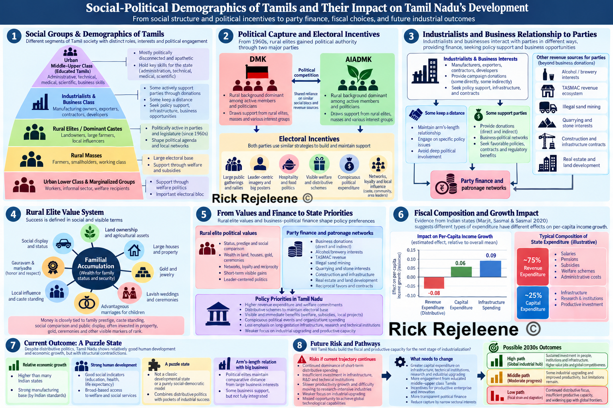
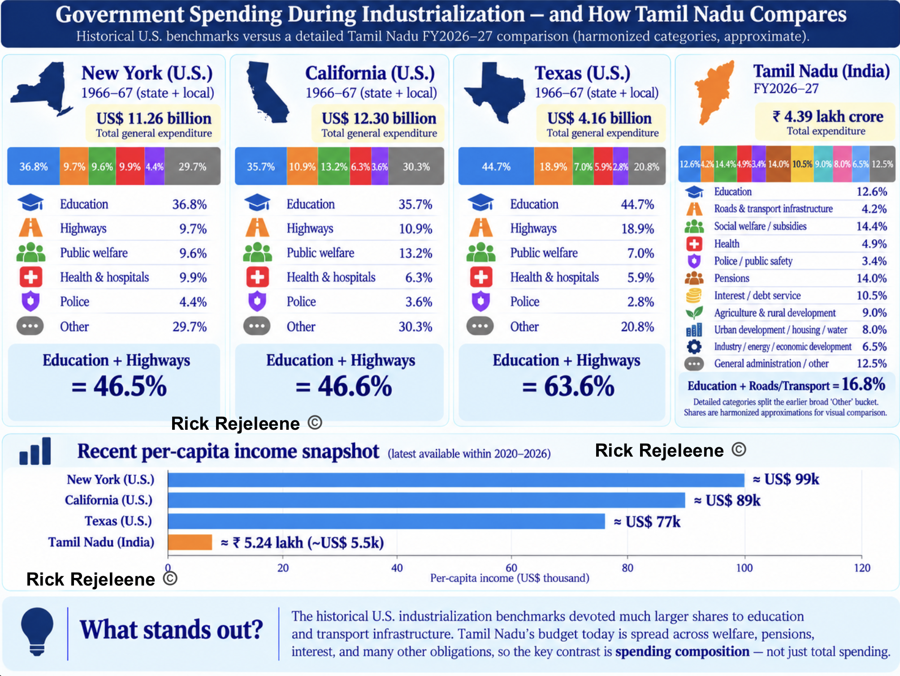

# Related posts

- [Why Tamil Nadu Elects Film Stars?](https://rickrejeleene.me/Tamil/posts/2026-05-06-ThreeTamilNadu/)

- [Thevar Caste: A Social Group in Tamil Nadu](https://rickrejeleene.me/Tamil/posts/2025-08-14-Kallar-Caste/index.html)
- [Nadars: From Palm Trees to Entrepreneur & Wealthiest social-groups](https://rickrejeleene.me/Tamil/posts/2025-08-29-Nadar/index.html)
- [Tamil Brahmins: From Village Priests to Software Engineers and Industrialists](https://rickrejeleene.me/Tamil/posts/2025-08-19-Tamil-Brahmins/index.html)
- [Kongu Region of Tamil Nadu](https://rickrejeleene.me/Tamil/posts/2025-10-10-Kongu/index.html)
- [Caste in Tamil Nadu by Anthropologist Diane P. Mines](https://rickrejeleene.me/Tamil/posts/2025-08-14-Caste-System-Anthropologist/index.html)
- [Caste and Electoral Politics in Tamil Nadu by K.A. Manikumar](https://rickrejeleene.me/Tamil/posts/book2/index.html)
- [Why India Needs a New Political Theory for the Modern World](https://rickrejeleene.me/Tamil/posts/2026-01-22-IndiaPoliticalTheory/index.html)
- [India Needs a Professional Political Class](https://rickrejeleene.me/Tamil/posts/2026-04-19-SlidesEastAsia/index.html)


# Introduction

Why care about the finances of Tamil Nadu's government? 
Because a budget is the clearest record of what a state actually prioritizes, and of the path it is taking towards industrialization.

Many Tamils would say the state is already industrialized, and by Indian standards that is largely true. 
Tamil Nadu is one of the country's leading manufacturing states. 
My argument is about the next stage. Measured against global frontiers, the state's industry is concentrated in lower-value manufacturing and assembly rather than in research-intensive sectors. The social structure is semi-feudal due to Tamils adhering to caste identities for political-voting bloc, endogamous marriage, issuing caste-certificate for all that reinforces the caste-identity.

Largely, my writings have focused on what the state requires, for building the capacity to move up.

I argue that the budget is where this can be tested. Governments change, but spending choices shape the state's economic capacity for years. 
Political culture explains why those choices are made, but the fiscal record shows what they are. 
The following sections examine who holds political authority and what they prioritize, trace how the state has raised and spent money since 1950, and finally project where the current pattern leads in the 2030s.

# Earlier Post

This essay follows from an earlier piece: [*Why Tamil Nadu Elects Film Stars?*](https://rickrejeleene.me/Tamil/posts/2026-05-06-ThreeTamilNadu/)
I examined the social structure underlying Tamil Nadu's politics. 
I argued that Tamil Nadu contains different political worlds. 

The urban professional and technical classes tend to value competence, credentials, institutional performance and technocratic administration, but they are comparatively weak participants in mass electoral politics. Political power is rooted much more deeply in rural and small-town society, where political parties operate through local networks, welfare delivery, caste and kinship relationships, symbolic leadership and visible responsiveness from the state. Politics allows to focus on policy priorities, policy priorities become budgets, and budgets, repeated over decades, shape the productive capacity of the state. This essay therefore moves from political sociology to political economy.

**The question, then, is what this political structure has produced fiscally?**
Based on the fiscal and administrative evidence, I argue that Tamil Nadu has become increasingly effective at distributing income but is not yet organized around building the technological, scientific and industrial capabilities required to reach the global high-income frontier. 

Political culture helps explain why spending priorities emerge. The fiscal record allows us to examine what those priorities have actually produced.
To understand where Tamil Nadu is going, we therefore have to follow the money. 

# Social-Political Demographics Of Tamils

Tamil Nadu presents an unusual political-economy case. Social anthropologist John Harriss and Political Scientist Andrew Wyatt describe the state as a Puzzle. This is because, despite not closely resembling the classic developmental-state model, Tamil Nadu has relative economic growth and human development [@harriss_wyatt_2019]. 

They argue that the state has combined elements of both developmental and social-democratic politics, while maintaining a comparatively arm's-length relationship between Political elites and Large Business Interests. This is important because Tamil Nadu's past industrial success does not necessarily mean that its political institutions are organized around long-term industrial upgrading. The institutions that supported earlier industrialisation may not be sufficient for movement toward research-intensive industry, advanced engineering, technological capability and substantially higher productivity, which will pull the state towards frontier global capabilities. 

::: {.column-page}
{fig-align="center" width="100%"}
:::

This mechanism is not unique to Tamil Nadu. Economists Marjit, Sasmal and Sasmal, using evidence from major Indian states, argue that democratic governments face political incentives to direct expenditure toward distributive purposes that can strengthen their electoral support base [@marjit_sasmal_sasmal_2020]. Their empirical results further associate a larger share of revenue expenditure with slower growth in per-capita income, while capital expenditure and infrastructure spending are positively associated with per-capita income.

Tamil Nadu can therefore be examined as a specific political-economy case: whether electoral incentives have progressively directed fiscal capacity toward immediately distributive and recurring commitments rather than the long-gestation investments in infrastructure, technical institutions, research and productive capacity required for the next stage of industrialization. The sections that follow trace how Tamil Nadu's spending composition has changed since 1950 and assess whether the state is building the fiscal and productive capacity required for further industrial upgrading..

In Tamil Nadu’s Legislature, the educated Tamils are disconnected and apathetic towards the concrete policy for making budget decisions[@rejeleene_2026_tamilnadu_politics]. The educated Tamils are mostly middle-upper class Tamils. This bloc of Tamils are not engaged, active politically. 
This is dangerous for the state, as the middle-upper class Tamils largely hold administrative, technical, medical, scientific skills of the state. 

I broadly argue, this is not applied religiously to institutions of the state, as these skills help to operate the institutions and create output. 
While, I am skeptical of when this cut off took, but I largely surmise it took place in 1960s, where the rural elite Tamils took over the political authority of Tamil state, through the two parties. In both the parties, the demographics of actively engaged members and politicians are from rural backgrounds. 

In parts of rural and small-town Tamil society, ethnographic work suggests that wealth and status have historically been expressed strongly through land, housing, gold, kinship obligations, ceremonies and locally visible forms of prestige. So, familial accumulation is wealth pursued primarily as land, houses, gold, property and security for the extended family, rather than continuously reinvested into productive enterprises, technology or institutions. The latter allows the state to increase its productive capabilities to produce goods and services required for global economy. 

In some rural and small-town Tamil social settings, success is understood in intensely social and visible terms. The objective is not only to become economically productive, but also to become a big person in relation to others in the local community. This can involve owning land, building a large house, accumulating gold, conducting an expensive wedding, displaying prosperity, securing advantageous marriages for one’s children, maintaining influence in the locality, and ensuring that the family is treated with gauravam and mariyadhai—honour, respect, and social standing. In such settings, economic success can therefore be expressed in highly relational and publicly visible forms, rather than only through reinvestment into productive enterprises, technology, or institutions.

Money therefore becomes closely tied to family prestige, caste standing, social comparison and public display. Wealth is frequently converted into property, jewellery, ceremonies and other visible markers of rank rather than into productive enterprises, technical institutions, research or long-term industrial investment. The underlying value system is therefore often familial, status-conscious and relational. 

Anthropologist Eleanor Power's ethnographic[@power_ready_2018] and network study of two Tamil villages describes how social capital is acquired. It is accumulated through relationships, reputation, reciprocity, and participation in village life. Increasingly, the political organization came to rely heavily on rural Tamil's values, personal networks, symbolic loyalty, public displays of support, large gatherings, leader-centered imagery, hospitality, and conspicuous political expenditure. I hypothesize that some of these political practices scale upward through party organizations and electoral competition. 

Once political competition operates through these social networks, parties have incentives to provide benefits that are visible, personal and immediately attributable: subsidized rice, free electricity for farmers, loan waivers, marriage assistance, gold, household appliances, housing support, livestock, cash transfers and other concessions. From the 1990s through the 2026 electoral cycle, such promises became a recurring feature of competition between the major Dravidian parties. This is the mechanism through which social values can enter the state budget: benefits that can be received, displayed and socially recognized generate immediate political returns, while investments in laboratories, research universities, advanced engineering or industrial technology produce benefits that are slower, more diffuse and harder for voters to attribute to a particular government. Once distributive programs are established, they also become politically costly to withdraw, turning electoral promises into recurring fiscal commitments.

The fiscal record is consistent with the cumulative effect of this incentive structure. Tamil Nadu moved from occasional revenue surpluses in the early 2010s to persistent revenue deficits, while capital expenditure remained a comparatively small component of total spending. By 2023–24, revenue expenditure had reached about ₹3.10 lakh crore while capital expenditure was only about ₹40,500 crore. 

By 2026–27, revenue expenditure is budgeted at roughly ₹4.06 lakh crore against revenue receipts of ₹3.50 lakh crore, producing a revenue deficit of about ₹55,775 crore, while capital outlay is about ₹56,985 crore. This does not establish that every welfare program is economically unproductive, nor that rural political culture alone caused the fiscal outcome. It does, however, show how decades of competition around immediately visible and recurring benefits can progressively narrow the fiscal room available for less visible, long-horizon investments in infrastructure, research, engineering and technological capability.

# Finances of Tamil Nadu Government  

The English East India has had major presence in Tamil Nadu since early 1600s. 
In 1639, EIC secured a strip of land on the Coromandel Coast from the local Nayak rulers.
They built Fort St. George in 1640, which became the nucleus of modern-day Chennai[@greater_chennai_corporation_origin].
However, if we are to put an exact date, it was around 1802, Madras Presidency folded under the administrative control of English.

From the year's 1880 to 1940, the Madras Presidency[@imperial_gazetteer_madras_1908] financed itself mainly through land revenue, excise duties on alcohol, salt taxes, stamps and registration fees, irrigation charges, and other local taxes. Most spending went toward revenue administration, police and courts, irrigation and public works, roads, famine relief, education, and health services, while part of the revenues[@madras_board_revenue_1880] also supported the wider British Indian government, including central administration, debt, and military costs. Over time, especially after the 1920s, Madras gained greater fiscal autonomy, and by 1939 it began shifting away from dependence on land revenue and excise toward sales taxation, which later became a major source of state revenue.

Before we look into the details of the budget, finances of the Government. 
We might wonder, Does the Chief Minister have an account, where all the taxes of people gets redirected? 
How does that work? Tamil Nadu's taxes do not go into an account belonging to the Chief Minister, Finance Minister, or an individual department.

The Tamil Nadu's Government funds is managed through the state's principal banking account maintained through the Reserve Bank of India.
Article 266 of the Indian-Constitution[@constitution_india_article266], says the taxes from different sources goes into Consolidated Fund of the State.
We are not going into the details of where the money is coming from, but yes, it's taxes. 
RBI describes itself as the government's banker. It receives and pays money on behalf of government departments, while commercial banks may act as RBI's authorised agents.

**So where is this account located for Tamil Nadu's Government?**

RBI [@rbi_banker_government] says the principal account of each participating State government is maintained at,  Reserve Bank of India, Central Accounts Section (CAS) Nagpur with title, Government Deposit Account – State. 

Consolidated Fund of Tamil Nadu is fundamentally a constitutional and accounting fund.
The underlying government cash is handled through the government's banking relationship with the Reserve Bank of India, with authorised commercial banks serving as agents for collections and payments.

There's three major funds for Government of Tamil Nadu. 
1. Consolidated Fund of Tamil Nadu
2. Public Account of Tamil Nadu
3. Contingency Fund of Tamil Nadu

Chief Minister cannot simply access the account. 
He makes the policy decision and obtain legislative authorisation, then it goes through a process, department, RBI. 

# Budget of Tamil Nadu Government 

In this section, we'd examine the finances of Tamil Nadu Government. 
First, we'd look at how the revenues were raised. At this stage, it looks like sales tax generated 1/3rd of the revenue for the state. 
And the state has raised most of its revenue by itself, rather than depending on union government. 

We also want to remember, A relatively large portion of economic activity was agricultural, rural and lightly monetised.

At this point in India's history, India had got independence. 
Therefore, we can't expect much and priorities are mostly to re-build the state and population wise, literacy was around 19-20%.
This is to highlight how revenue is raised by the government. 

**Composition of Revenue**

```{r}
#| echo: false
#| warning: false
#| message: false
#| tbl-cap: "Composition of Madras State Government Revenue, 1950–51"
#| tbl-label: tbl-madras-revenue-1950

library(dplyr)
library(gt)
library(tibble)

# RBI average working-day exchange rate for 1950–51:
# ₹477.50 per US$100 = ₹4.775 per US$1
fx_1950_51 <- 4.775

madras_revenue_1950 <- tribble(
  ~source,                                      ~crore, ~percent,
  "Sales taxes (including motor-spirit tax)",   16.75,   28.8,
  "Land revenue",                                6.94,   11.9,
  "Stamp duties",                                4.88,    8.4,
  "Registration",                                1.08,    1.9,
  "State excise",                                0.55,    1.0,
  "Other State taxes and duties",                5.69,    9.7,
  "Total State own-tax revenue",                35.89,   61.7,
  "Share of Union income tax",                   8.29,   14.3,
  "Grants from the Union Government",            0.20,    0.3,
  "Other revenue",                              13.78,   23.7,
  "Total revenue",                              58.16,  100.0
) |>
  mutate(
    # ₹1 crore = ₹10 million
    # Therefore:
    # USD million = ₹ crore × 10 / ₹ per US$
    usd_million = crore * 10 / fx_1950_51
  )

madras_revenue_1950 |>
  select(source, crore, usd_million, percent) |>
  gt() |>
  tab_header(
    title = md("**Madras State Government Revenue, 1950–51**"),
    subtitle = md("Nominal values in Indian rupees and contemporary US dollars")
  ) |>
  cols_label(
    source = "Revenue source",
    crore = "₹ crore",
    usd_million = "US$ million",
    percent = "Share (%)"
  ) |>
  tab_spanner(
    label = "Historical nominal value",
    columns = c(crore, usd_million)
  ) |>
  fmt_number(
    columns = crore,
    decimals = 2
  ) |>
  fmt_number(
    columns = usd_million,
    decimals = 1
  ) |>
  fmt_number(
    columns = percent,
    decimals = 1
  ) |>
  tab_style(
    style = cell_text(weight = "bold"),
    locations = cells_body(
      rows = source %in% c(
        "Total State own-tax revenue",
        "Total revenue"
      )
    )
  ) |>
  tab_style(
    style = cell_fill(color = "#f2f2f2"),
    locations = cells_body(
      rows = source == "Total State own-tax revenue"
    )
  ) |>
  tab_style(
    style = cell_fill(color = "#e5e5e5"),
    locations = cells_body(
      rows = source == "Total revenue"
    )
  ) |>
  cols_width(
    source ~ pct(48),
    crore ~ pct(16),
    usd_million ~ pct(20),
    percent ~ pct(16)
  ) |>
  tab_options(
    table.font.size = px(14),
    data_row.padding = px(5)
  ) |>
  tab_source_note(
    source_note = md(
      "**Sources:** First Finance Commission of India; Reserve Bank of India historical exchange-rate series.  
      **USD conversion:** RBI average for 1950–51 = ₹4.775 per US$1.  
      US-dollar figures are **contemporary nominal dollars**, not inflation-adjusted modern dollars."
    )
  )
```

**Revenue of Madras State until 1965**

The steady rise in Madras State's revenue should not be interpreted as an equivalent increase in real economic wealth. 
These figures are reported in current rupees, meaning that inflation alone increased the monetary value of taxable sales and other transactions. At the same time, population growth, industrialisation, urbanisation and expanding commerce enlarged the state's tax base. As consumers purchased more manufactured goods and the value of commercial transactions increased, sales-tax receipts grew, rising property transactions increased stamp and registration revenues, while excise and other taxes also contributed. 

Revenue receipts additionally included Madras's share of Union taxes and grants from the Government of India. Consequently, revenue could increase even without a proportional increase in tax rates. Between 1957–58 and 1964–65, nominal revenue rose from ₹62.56 crore to ₹147.31 crore about 13% per year on average, but part of this increase reflected higher prices and fiscal changes rather than real economic growth alone.

**Agriculture:** Most people still depended on farming. Rice was central, along with groundnut, cotton, sugarcane, millets and other crops. Irrigation projects, fertilizer use and electrification were becoming increasingly important.

**Traditional industry:** Textiles were huge, especially around Coimbatore. There were also spinning mills, handlooms, leather, sugar mills, cement, paper and food processing.
New modern industry: Engineering and heavy manufacturing were expanding. Chennai/Madras had automobiles, railway equipment and engineering factories; Neyveli was developing lignite and electricity; and BHEL's Tiruchirappalli heavy-boiler project was being established in this period. BHEL itself was incorporated in 1964, with its Tiruchirappalli plant forming part of India's new heavy-industry strategy.

**Trade and services:** Madras city was already a major commercial, administrative and port center. 
Coimbatore, Madurai, Tiruchirappalli and Salem were growing regional markets connecting villages, factories and wholesalers.


```{r}
#| echo: false
#| warning: false
#| message: false
#| tbl-cap: "Revenue and Real Fiscal Capacity of Madras State, 1950–51 to 1964–65"
#| tbl-label: tbl-madras-revenue-real-1950-1965

library(dplyr)
library(gt)
library(tibble)

# ------------------------------------------------------------
# 1. Historical Madras State revenue
# ------------------------------------------------------------

madras_revenue_series <- tribble(

  ~year,      ~revenue_crore, ~fx_inr_usd, ~note,

  "1950–51",       58.16,       4.7750,
  "Composite Madras State",

  "1951–52",       58.75,       4.7815625,
  "",

  "1952–53",       58.02,       4.7825,
  "",

  "1953–54",       22.77,       4.7625,
  "Partial-year figure after separation of Andhra; not directly comparable",

  "1954–55",       42.86,       4.7778125,
  "Post-Andhra Madras State",

  "1955–56",       51.70,       4.789375,
  "",

  "1956–57",          NA,       4.7922,
  "States Reorganisation year; excluded pending harmonised figure",

  "1957–58",       62.56,       4.7832,
  "Reorganised Madras State",

  "1958–59",       69.95,       4.7654,
  "",

  "1959–60",       81.11,       4.7680,
  "",

  "1960–61",       93.00,       4.7682,
  "",

  "1961–62",       99.91,       4.7720,
  "",

  "1962–63",      118.25,       4.7720,
  "",

  "1963–64",      135.02,       4.7829,
  "",

  "1964–65",      147.31,       4.7600,
  "Revised Estimate (RE)"
)


# ------------------------------------------------------------
# 2. Historical Wholesale Price Index
#
# Original series:
# 1961–62 = 100
#
# We rebase it below so:
# 1960–61 = 100
# ------------------------------------------------------------

wpi_series <- tribble(

  ~year,      ~wpi_1961_62,

  "1950–51",   86.1,
  "1951–52",   91.4,
  "1952–53",   79.9,
  "1953–54",   83.6,
  "1954–55",   77.9,
  "1955–56",   73.9,
  "1956–57",   84.2,
  "1957–58",   86.7,
  "1958–59",   90.2,
  "1959–60",   93.6,
  "1960–61",   99.8,
  "1961–62",  100.0,
  "1962–63",  103.8,
  "1963–64",  110.2,
  "1964–65",  122.3

) |>
  mutate(

    price_index_1960_61 =
      wpi_1961_62 / 99.8 * 100

  )


# ------------------------------------------------------------
# 3. Census population benchmarks
#
# Comparable territory of reorganised Madras State
#
# 1951 = 30,119,047
# 1961 = 33,686,953
# 1971 = 41,199,168
# ------------------------------------------------------------

pop_1951 <- 30119047
pop_1961 <- 33686953
pop_1971 <- 41199168


# Annual geometric population growth rates

growth_1951_61 <-
  (pop_1961 / pop_1951)^(1 / 10) - 1

growth_1961_71 <-
  (pop_1971 / pop_1961)^(1 / 10) - 1


# ------------------------------------------------------------
# 4. Estimate annual population
#
# Per-capita values are shown only from 1957–58 onward
# because earlier territorial changes make direct comparison
# misleading.
# ------------------------------------------------------------

population_series <- tribble(

  ~year,      ~mid_year,

  "1957–58",  1957.5,
  "1958–59",  1958.5,
  "1959–60",  1959.5,
  "1960–61",  1960.5,
  "1961–62",  1961.5,
  "1962–63",  1962.5,
  "1963–64",  1963.5,
  "1964–65",  1964.5

) |>
  mutate(

    population = case_when(

      mid_year <= 1961 ~
        pop_1951 *
        (1 + growth_1951_61)^(mid_year - 1951),

      mid_year > 1961 ~
        pop_1961 *
        (1 + growth_1961_71)^(mid_year - 1961)

    ),

    population_million =
      population / 1e6

  )


# ------------------------------------------------------------
# 5. Combine revenue, inflation, population, and exchange rates
# ------------------------------------------------------------

madras_revenue_real <- madras_revenue_series |>

  left_join(
    wpi_series,
    by = "year"
  ) |>

  left_join(
    population_series,
    by = "year"
  ) |>

  mutate(

    # Nominal contemporary USD value
    usd_million =
      revenue_crore * 10 / fx_inr_usd,

    # Revenue expressed in 1960–61 prices
    real_revenue_1960_crore =
      revenue_crore *
      100 / price_index_1960_61,

    # Nominal revenue per resident
    revenue_per_capita =
      revenue_crore *
      1e7 / population,

    # Inflation-adjusted revenue per resident
    real_revenue_per_capita =
      real_revenue_1960_crore *
      1e7 / population

  )


# ------------------------------------------------------------
# 6. Render table
# ------------------------------------------------------------

madras_revenue_real |>

  select(

    year,
    revenue_crore,
    real_revenue_1960_crore,
    population_million,
    revenue_per_capita,
    real_revenue_per_capita,
    usd_million,
    note

  ) |>

  gt() |>

  tab_header(

    title = md(
      "**Madras State Revenue and Real Fiscal Capacity, 1950–51 to 1964–65**"
    ),

    subtitle = md(
      "Inflation-adjusted values are expressed in **1960–61 prices**"
    )

  ) |>

  cols_label(

    year =
      "Fiscal year",

    revenue_crore =
      html(
        "Nominal revenue<br>(₹ crore)"
      ),

    real_revenue_1960_crore =
      html(
        "Real revenue<br>(₹ crore)"
      ),

    population_million =
      html(
        "Population<br>(million)"
      ),

    revenue_per_capita =
      html(
        "Nominal revenue<br>per person (₹)"
      ),

    real_revenue_per_capita =
      html(
        "Real revenue<br>per person (₹)"
      ),

    usd_million =
      html(
        "Nominal revenue<br>(US$ million)"
      ),

    note =
      "Historical note"

  ) |>

  fmt_number(

    columns = c(
      revenue_crore,
      real_revenue_1960_crore
    ),

    decimals = 2

  ) |>

  fmt_number(

    columns = population_million,
    decimals = 2

  ) |>

  fmt_number(

    columns = c(
      revenue_per_capita,
      real_revenue_per_capita
    ),

    decimals = 2

  ) |>

  fmt_number(

    columns = usd_million,
    decimals = 1

  ) |>

  sub_missing(

    columns = c(
      revenue_crore,
      real_revenue_1960_crore,
      population_million,
      revenue_per_capita,
      real_revenue_per_capita,
      usd_million
    ),

    missing_text = "—"

  ) |>

  # Highlight important transition years
  tab_style(

    style = cell_text(
      weight = "bold"
    ),

    locations = cells_body(

      rows = year %in% c(
        "1950–51",
        "1953–54",
        "1956–57",
        "1957–58",
        "1960–61",
        "1964–65"
      )

    )

  ) |>

  # Shade territorial-break years
  tab_style(

    style = cell_fill(
      color = "#f3f3f3"
    ),

    locations = cells_body(

      rows = year %in% c(
        "1953–54",
        "1956–57"
      )

    )

  ) |>

  # Better horizontal spacing
  cols_width(

    year ~ pct(8),

    revenue_crore ~ pct(11),

    real_revenue_1960_crore ~ pct(11),

    population_million ~ pct(9),

    revenue_per_capita ~ pct(12),

    real_revenue_per_capita ~ pct(12),

    usd_million ~ pct(11),

    note ~ pct(26)

  ) |>

  tab_options(

    table.font.size = px(12),

    heading.title.font.size = px(22),

    heading.subtitle.font.size = px(14),

    data_row.padding = px(6),

    column_labels.padding = px(8),

    table.width = pct(100)

  ) |>

  tab_source_note(

    source_note = md(
      paste0(

        "**Sources:** Revenue receipts from the First, Second, Third, ",
        "and Fourth Finance Commission reports and Madras State budget ",
        "figures reproduced therein. Exchange rates from Reserve Bank ",
        "of India historical INR–USD data. Wholesale prices from the ",
        "Office of the Economic Adviser, Government of India, historical ",
        "Wholesale Price Index series. Population benchmarks from the ",
        "Census of India, 1951, 1961, and 1971.  \n\n",

        "**Method:** Historical WPI values have been rebased so that ",
        "**1960–61 = 100**. Real revenue therefore expresses each year's ",
        "receipts in approximately 1960–61 rupees. Population between ",
        "census years is estimated using geometric interpolation. ",
        "Per-capita values are presented only from **1957–58 onward**, ",
        "because the separation of Andhra in 1953 and States Reorganisation ",
        "in 1956 make earlier territorial comparisons misleading. ",
        "The WPI is an all-India wholesale-price measure rather than a ",
        "Madras-specific consumer-price index, so the real-revenue figures ",
        "should be interpreted as approximate measures of purchasing power."

      )
    )

  )
```


**Revenue of Tamil Nadu until 1991**

Between 1950 and 1991, Madras State/Tamil Nadu underwent a major expansion in fiscal capacity. Revenue receipts rose from ₹58 crore to more than ₹5,000 crore as the economy became larger, more urbanized, industrialized and monetized, the tax base broadened, and intergovernmental transfers increased. However, much of the increase in nominal revenue also reflects inflation and the declining value of the rupee. The approximately 87-fold increase in nominal receipts should therefore not be interpreted as an 87-fold increase in real economic wealth.

```{r}
#| echo: false
#| warning: false
#| message: false
#| tbl-cap: "Government revenue of Madras State and Tamil Nadu, 1950–51 to 1990–91"
#| tbl-label: tbl-tn-revenue-1950-1991

library(dplyr)
library(gt)
library(tibble)

# ============================================================
# MADRAS STATE / TAMIL NADU GOVERNMENT REVENUE, 1950–1991
#
# A. Nominal revenue (₹ crore)
#    Actual revenue receipts in current rupees.
#
# B. Real revenue per capita (1980–81 ₹)
#    Revenue receipts adjusted for both:
#       - inflation
#       - population
#
# C. Revenue as % of NSDP
#    Revenue receipts relative to the size of the state economy.
#
# IMPORTANT:
# B and C are calculated consistently from 1971–72 onward.
#
# For the 1950s and 1960s, territorial changes and changes in
# historical state-income base series make a single comparable
# real-per-capita series much less straightforward.
# Rather than manufacture false precision, those cells are
# marked "n/a".
# ============================================================


# ------------------------------------------------------------
# 1. NOMINAL REVENUE RECEIPTS
# ------------------------------------------------------------

tn_revenue <- tribble(

  ~start_year, ~year,      ~revenue_crore, ~note,

  # ---- Composite Madras State -------------------------------

  1950, "1950–51",   58.16,
  "Composite Madras State",

  1951, "1951–52",   58.75,
  "",

  1952, "1952–53",   58.02,
  "",

  1953, "1953–54",   22.77,
  "Partial year after Andhra separated on 1 Oct 1953; not directly comparable",

  1954, "1954–55",   42.86,
  "Post-Andhra Madras State",

  1955, "1955–56",   51.70,
  "",

  1956, "1956–57",      NA,
  "States Reorganisation transition year; harmonised figure omitted",

  # ---- Reorganised Madras State -----------------------------

  1957, "1957–58",   62.56,
  "Reorganised Madras State",

  1958, "1958–59",   69.95,
  "",

  1959, "1959–60",   81.11,
  "",

  1960, "1960–61",   93.00,
  "",

  1961, "1961–62",   92.18,
  "Later Fifth Finance Commission figure; Fourth FC reported ₹99.91 cr",

  1962, "1962–63",  118.25,
  "",

  1963, "1963–64",  135.02,
  "",

  1964, "1964–65",  147.31,
  "Revised Estimate (RE)",

  1965, "1965–66",  172.80,
  "",

  1966, "1966–67",  194.55,
  "",

  1967, "1967–68",  233.39,
  "",

  1968, "1968–69",  277.28,
  "RE; Madras State renamed Tamil Nadu on 14 Jan 1969",

  # ---- Tamil Nadu -------------------------------------------

  1969, "1969–70",  283.61,
  "",

  1970, "1970–71",  313.90,
  "",

  1971, "1971–72",  400.34,
  "",

  1972, "1972–73",  438.15,
  "",

  1973, "1973–74",  499.77,
  "",

  1974, "1974–75",  520.29,
  "",

  1975, "1975–76",  535.72,
  "",

  1976, "1976–77",  628.98,
  "",

  1977, "1977–78",  682.05,
  "Revised Estimate (RE) in source",

  1978, "1978–79",  733.49,
  "",

  1979, "1979–80",  849.82,
  "Budget Estimate (BE) in source",

  1980, "1980–81", 1279.96,
  "",

  1981, "1981–82", 1441.55,
  "",

  1982, "1982–83", 1678.00,
  "",

  1983, "1983–84", 1962.51,
  "",

  1984, "1984–85", 2227.51,
  "",

  1985, "1985–86", 2638.32,
  "",

  1986, "1986–87", 2879.13,
  "",

  1987, "1987–88", 3091.89,
  "",

  1988, "1988–89", 3488.87,
  "",

  1989, "1989–90", 4199.78,
  "",

  1990, "1990–91", 5087.88,
  "Final pre-1991 economic-reform fiscal year"
)


# ------------------------------------------------------------
# 2. HISTORICAL ECONOMIC CONTEXT, 1971–72 TO 1990–91
#
# Source:
# Mahalakshmi, G. & Ramesh, C. (2017)
# "Impact of Economic Reforms in Expenditure Pattern
#  of Tamil Nadu"
# International Journal of Advanced Research, 5(1), 679–684.
# DOI: 10.21474/IJAR01/2798
#
# Published table provides:
#
# exp_current_crore
#   Revenue expenditure at current prices.
#
# exp_real_pc_1980
#   Revenue expenditure per capita at constant
#   1980–81 prices.
#
# exp_pct_nsdp
#   Revenue expenditure as % of NSDP.
#
# We use these published quantities to recover the same
# inflation/population adjustment and NSDP denominator
# for the REVENUE RECEIPTS series.
# ------------------------------------------------------------

tn_context <- tribble(

  ~start_year, ~exp_current_crore, ~exp_real_pc_1980, ~exp_pct_nsdp,

  1971,  357.36, 186.72, 13.25,
  1972,  417.03, 193.60, 14.69,
  1973,  472.63, 183.79, 13.77,
  1974,  528.36, 174.01, 14.52,
  1975,  557.92, 187.72, 14.99,
  1976,  628.36, 195.18, 14.60,
  1977,  706.12, 202.89, 14.99,
  1978,  753.51, 209.84, 15.00,
  1979,  849.55, 202.20, 13.94,

  1980, 1152.25, 241.63, 15.96,
  1981, 1359.89, 254.75, 15.67,
  1982, 1576.08, 268.30, 17.87,
  1983, 1910.80, 295.15, 18.69,
  1984, 2210.34, 311.70, 18.38,
  1985, 2449.75, 318.72, 17.90,
  1986, 2775.70, 332.96, 18.14,
  1987, 3374.81, 364.45, 18.58,
  1988, 3763.04, 371.32, 18.43,
  1989, 4730.79, 425.28, 19.77,
  1990, 5641.29, 451.17, 20.38
)


# ------------------------------------------------------------
# 3. CALCULATE THE THREE INTERPRETIVE MEASURES
# ------------------------------------------------------------

tn_fiscal <- tn_revenue |>

  left_join(
    tn_context,
    by = "start_year"
  ) |>

  arrange(start_year) |>

  mutate(

    # ========================================================
    # A. NOMINAL REVENUE
    #
    # Already given by revenue_crore.
    # ========================================================


    # ========================================================
    # B. REAL REVENUE PER CAPITA
    #
    # Published real expenditure per capita already adjusts
    # for inflation and population.
    #
    # Revenue receipts / revenue expenditure
    # gives the ratio between the two nominal fiscal series.
    #
    # Applying that ratio to published real expenditure
    # per capita gives real revenue receipts per capita
    # in the same 1980–81 rupees.
    # ========================================================

    real_revenue_per_capita =
      if_else(
        !is.na(exp_current_crore),
        (revenue_crore / exp_current_crore) *
          exp_real_pc_1980,
        NA_real_
      ),


    # ========================================================
    # Reconstruct nominal NSDP
    #
    # If:
    #
    # expenditure / NSDP × 100 = exp_pct_nsdp
    #
    # then:
    #
    # NSDP = expenditure / (exp_pct_nsdp / 100)
    # ========================================================

    nsdp_crore =
      if_else(
        !is.na(exp_current_crore),
        exp_current_crore /
          (exp_pct_nsdp / 100),
        NA_real_
      ),


    # ========================================================
    # C. REVENUE AS % OF NSDP
    # ========================================================

    revenue_pct_nsdp =
      if_else(
        !is.na(nsdp_crore),
        100 * revenue_crore / nsdp_crore,
        NA_real_
      ),


    # --------------------------------------------------------
    # Historical grouping
    # --------------------------------------------------------

    period = case_when(

      start_year <= 1952 ~
        "1950–53 · Composite Madras State",

      start_year <= 1956 ~
        "1953–56 · Territorial transition",

      start_year <= 1970 ~
        "1957–70 · Reorganised Madras State / early Tamil Nadu",

      start_year <= 1979 ~
        "1971–79 · Tamil Nadu",

      TRUE ~
        "1980–90 · Tamil Nadu"
    )
  )


# ------------------------------------------------------------
# 4. DISPLAY TABLE
# ------------------------------------------------------------

tn_fiscal |>

  select(
    period,
    start_year,
    year,
    revenue_crore,
    real_revenue_per_capita,
    revenue_pct_nsdp,
    note
  ) |>

  gt(
    groupname_col = "period"
  ) |>

  tab_header(

    title = md(
      "**Madras State / Tamil Nadu Government Revenue, 1950–51 to 1990–91**"
    ),

    subtitle = md(
      "Nominal revenue, real revenue per resident, and revenue relative to the state economy"
    )
  ) |>

  cols_label(

    year =
      "Fiscal year",

    revenue_crore =
      "A. Nominal revenue (₹ crore)",

    real_revenue_per_capita =
      "B. Real revenue per capita (1980–81 ₹)",

    revenue_pct_nsdp =
      "C. Revenue as % of NSDP",

    note =
      "Historical note"
  ) |>

  # ----------------------------------------------------------
  # Formatting
  # ----------------------------------------------------------

  fmt_number(
    columns = revenue_crore,
    decimals = 2,
    use_seps = TRUE
  ) |>

  fmt_number(
    columns = real_revenue_per_capita,
    decimals = 0,
    use_seps = TRUE
  ) |>

  fmt_percent(
    columns = revenue_pct_nsdp,
    decimals = 1,
    scale_values = FALSE
  ) |>

  # Make unavailable historical values explicit
  sub_missing(
    columns = c(
      revenue_crore,
      real_revenue_per_capita,
      revenue_pct_nsdp
    ),
    missing_text = "n/a"
  ) |>

  cols_hide(
    columns = start_year
  ) |>

  # ----------------------------------------------------------
  # Highlight major historical breaks
  # ----------------------------------------------------------

  tab_style(
    style = cell_fill(
      color = "#f3f3f3"
    ),
    locations = cells_body(
      rows = start_year %in% c(
        1953,
        1956,
        1968,
        1971,
        1980
      )
    )
  ) |>

  # Bold beginning of comparable B/C series and final year
  tab_style(
    style = cell_text(
      weight = "bold"
    ),
    locations = cells_body(
      rows = start_year %in% c(
        1971,
        1990
      )
    )
  ) |>

  opt_row_striping() |>

  cols_width(

    year ~ pct(12),

    revenue_crore ~ pct(18),

    real_revenue_per_capita ~ pct(22),

    revenue_pct_nsdp ~ pct(18),

    note ~ pct(30)
  ) |>

  tab_options(

    table.font.size = px(13),

    data_row.padding = px(4),

    table.width = pct(100)
  ) |>

  # ----------------------------------------------------------
  # Interpretation notes
  # ----------------------------------------------------------

  tab_source_note(
    source_note = md(
      "**A. Nominal revenue:** Current rupees received by the government. This rises with inflation as well as with real economic growth, tax changes and Central transfers."
    )
  ) |>

  tab_source_note(
    source_note = md(
      "**B. Real revenue per capita:** Revenue receipts expressed in 1980–81 rupees per resident. This removes much of the effect of inflation and population growth and is therefore a much better measure of real fiscal capacity per person."
    )
  ) |>

  tab_source_note(
    source_note = md(
      "**C. Revenue as % of NSDP:** Revenue receipts divided by Net State Domestic Product at current prices. This measures government revenue relative to the size of Tamil Nadu's economy."
    )
  ) |>

  tab_source_note(
    source_note = md(
      "**Availability:** B and C are shown from 1971–72 onward using a consistent published economic series. Earlier values are marked n/a rather than mixing incompatible territorial and historical price-base series."
    )
  ) |>

  tab_source_note(
    source_note = md(
      "**Economic-context source:** Mahalakshmi and Ramesh (2017), International Journal of Advanced Research, 5(1), 679–684, DOI 10.21474/IJAR01/2798. The study reports RBI-sourced revenue expenditure, NSDP from Economic Surveys and the Handbook of Statistics, and uses a national-income deflator at 1980–81 prices."
    )
  )
```

# Post-Liberalisation

India's economic liberalisation in 1991 marks a useful dividing point in examining Tamil Nadu's public finances. The state's economy became increasingly integrated with private investment, manufacturing, services and international trade, but liberalisation did not remove the importance of the state budget. The composition of government expenditure still determined how much fiscal capacity was directed toward recurring expenditure versus long-lived productive assets.

Between 1991–92 and 2009–10, Tamil Nadu's nominal revenue receipts increased from ₹6,775.66 crore to ₹55,844.14 crore. Revenue expenditure increased from ₹8,679.52 crore to ₹59,375.35 crore over the same period [@krishnan_arunachalam_2018].

The important point to note, nominal growth alone does not tell us whether the state was accumulating productive capacity. Tamil Nadu recorded a revenue deficit in 15 of the 19 fiscal years between 1991–92 and 2009–10. Only during 2005–06 through 2008–09 did the revenue account remain continuously in surplus before returning to a ₹3,531 crore revenue deficit in 2009–10, [@krishnan_arunachalam_2018; @cag_tn_state_finances_2010].

Capital expenditure presents a more complicated picture. It was only ₹279 crore, or 3.12% of revenue-plus-capital expenditure, in 1991–92. By 2007–08 it had risen to ₹7,462 crore and 14.80% of expenditure, before reaching ₹9,104 crore in 2008–09 and falling to ₹8,573 crore in 2009–10. Capital expenditure relative to NSDP increased from only 0.86% in 1991–92 to 1.99% in 2009–10, reaching a temporary peak of 2.53% in 2008–09 [@mahalakshmi_ramesh_2017].

Therefore, the post-1991 fiscal history is dramatically larger nominal sums, while the composition of expenditure shifted substantially. Capital investment became more important during the 2000s than it had been during the early 1990s, but recurring revenue expenditure continued to absorb the overwhelming majority of annual expenditure.

Revenue expenditure is roughly the government's ongoing operating cost. Examples include salaries, pensions, subsidies, interest payments, administration, maintenance, education and healthcare operating expenses. Capital expenditure is intended more toward assets or investment that can provide benefits over many years: highways, water systems, government buildings, major equipment, irrigation projects, power infrastructure, etc.


```{r}
#| echo: false
#| warning: false
#| message: false
#| tbl-cap: "Tamil Nadu Government Finances after Liberalisation, 1991–92 to 2009–10"
#| tbl-label: tbl-tn-budget-1991-2010

library(dplyr)
library(gt)
library(tibble)

# ============================================================
# TAMIL NADU GOVERNMENT FINANCES, 1991–92 TO 2009–10
#
# Revenue receipts and revenue expenditure:
#   RBI State Finances series, reproduced by
#   Krishnan & Arunachalam (2018).
#
# Capital expenditure:
#   Mahalakshmi & Ramesh (2017), based on RBI Bulletins
#   and RBI historical fiscal data.
#
# 2005–06 to 2009–10:
#   Cross-checked against CAG State Finances / Finance Accounts.
#
# Exchange rates:
#   RBI financial-year annual average INR per US dollar.
#
# IMPORTANT:
# "Total expenditure" below = revenue expenditure +
# capital expenditure. Loans and advances are not included.
#
# US-dollar amounts are CONTEMPORARY NOMINAL dollars.
# They are not inflation-adjusted modern US dollars.
# ============================================================


tn_post_reform <- tribble(

  ~year,     ~revenue_receipts, ~revenue_expenditure,
  ~revenue_balance, ~capital_expenditure,
  ~capital_pct_total, ~capital_pct_nsdp, ~fx_inr_usd,

  "1991–92",  6775.66,  8679.52, -1903.86,  279.09,  3.12, 0.86, 24.4737,
  "1992–93",  7016.33,  8542.53, -1526.20,  322.37,  3.64, 0.85, 26.4100,
  "1993–94",  8066.15,  8758.00,  -691.85,  550.52,  5.91, 1.07, 31.3600,
  "1994–95",  9219.40,  9634.95,  -415.55,  679.95,  6.59, 1.11, 31.4000,
  "1995–96", 10599.25, 10910.57,  -311.32,  590.94,  5.14, 0.85, 33.4600,

  "1996–97", 11961.28, 13064.89, -1103.61,  919.64,  6.58, 1.16, 35.5000,
  "1997–98", 13586.95, 14950.85, -1363.90, 1467.79,  8.94, 1.58, 37.1600,
  "1998–99", 14260.83, 17697.40, -3436.57, 1153.32,  6.12, 1.09, 42.0600,
  "1999–00", 16327.53, 20727.83, -4400.30,  644.93,  3.02, 0.54, 43.3300,

  "2000–01", 18316.67, 21752.44, -3435.77, 1546.88,  6.64, 1.19, 45.6900,
  "2001–02", 18818.03, 21556.97, -2738.94, 1777.91,  7.62, 1.35, 47.6900,
  "2002–03", 20836.76, 25687.70, -4850.94, 1627.54,  5.96, 1.18, 48.3953,
  "2003–04", 23705.70, 25270.94, -1565.24, 3589.90, 12.44, 2.33, 45.9516,
  "2004–05", 28451.53, 29154.87,  -703.34, 4563.97, 13.54, 2.36, 44.9315,

  "2005–06", 33959.98, 32008.67,  1951.31, 4054.56, 11.24, 1.77, 44.2735,
  "2006–07", 40913.23, 38264.97,  2648.26, 5952.37, 13.46, 2.15, 45.2495,
  "2007–08", 47520.52, 42975.01,  4545.51, 7462.23, 14.80, 2.38, 40.2607,
  "2008–09", 55042.52, 53590.26,  1452.26, 9104.30, 14.52, 2.53, 45.9933,
  "2009–10", 55844.14, 59375.35, -3531.21, 8572.59, 12.62, 1.99, 47.4433

) |>
  mutate(

    # Revenue expenditure + capital expenditure.
    # This definition excludes loans and advances.
    total_expenditure =
      revenue_expenditure + capital_expenditure,

    # ₹1 crore = ₹10 million.
    # US$ billion = ₹ crore / (100 × ₹ per US$)
    revenue_usd_billion =
      revenue_receipts / (100 * fx_inr_usd),

    expenditure_usd_billion =
      total_expenditure / (100 * fx_inr_usd),

    capital_usd_billion =
      capital_expenditure / (100 * fx_inr_usd),

    balance_status =
      if_else(
        revenue_balance >= 0,
        "Surplus",
        "Deficit"
      )
  )


tn_post_reform |>
  select(
    year,
    revenue_receipts,
    revenue_usd_billion,
    total_expenditure,
    expenditure_usd_billion,
    revenue_balance,
    capital_expenditure,
    capital_pct_total,
    capital_pct_nsdp
  ) |>

  gt() |>

  tab_header(
    title = md(
      "**Tamil Nadu Government Finances, 1991–92 to 2009–10**"
    ),
    subtitle = md(
      "Actual historical expenditure and receipts; nominal rupees and contemporary US dollars"
    )
  ) |>

  cols_label(
    year = "Fiscal year",
    revenue_receipts = "Revenue receipts (₹ crore)",
    revenue_usd_billion = "Revenue receipts (US$ bn)",
    total_expenditure = "Revenue + capital expenditure (₹ crore)",
    expenditure_usd_billion = "Revenue + capital expenditure (US$ bn)",
    revenue_balance = "Revenue surplus / deficit (₹ crore)",
    capital_expenditure = "Capital expenditure (₹ crore)",
    capital_pct_total = "Capital share of expenditure (%)",
    capital_pct_nsdp = "Capital expenditure / NSDP (%)"
  ) |>

  fmt_number(
    columns = c(
      revenue_receipts,
      total_expenditure,
      revenue_balance,
      capital_expenditure
    ),
    decimals = 0,
    use_seps = TRUE
  ) |>

  fmt_number(
    columns = c(
      revenue_usd_billion,
      expenditure_usd_billion
    ),
    decimals = 2
  ) |>

  fmt_number(
    columns = c(
      capital_pct_total,
      capital_pct_nsdp
    ),
    decimals = 2
  ) |>

  # Highlight the start of liberalisation,
  # early-2000s capital-investment jump,
  # and final year.
  tab_style(
    style = cell_text(weight = "bold"),
    locations = cells_body(
      rows = year %in% c(
        "1991–92",
        "2003–04",
        "2005–06",
        "2009–10"
      )
    )
  ) |>

  # Shade revenue-surplus years.
  tab_style(
    style = cell_fill(color = "#f2f2f2"),
    locations = cells_body(
      rows = year %in% c(
        "2005–06",
        "2006–07",
        "2007–08",
        "2008–09"
      )
    )
  ) |>

  opt_row_striping() |>

  cols_width(
    year ~ pct(8),
    revenue_receipts ~ pct(12),
    revenue_usd_billion ~ pct(10),
    total_expenditure ~ pct(15),
    expenditure_usd_billion ~ pct(11),
    revenue_balance ~ pct(13),
    capital_expenditure ~ pct(11),
    capital_pct_total ~ pct(10),
    capital_pct_nsdp ~ pct(10)
  ) |>

  tab_options(
    table.font.size = px(11),
    data_row.padding = px(4),
    table.width = pct(100)
  ) |>

  tab_source_note(
    source_note = md(
      "**Sources:** Reserve Bank of India State Finances series; Comptroller and Auditor General of India, Tamil Nadu Finance Accounts; Krishnan and Arunachalam (2018); Mahalakshmi and Ramesh (2017)."
    )
  ) |>

  tab_source_note(
    source_note = md(
      "**USD conversion:** RBI financial-year average INR/US$ exchange rates. Dollar figures are contemporary nominal equivalents and should not be interpreted as present-day purchasing power."
    )
  ) |>

  tab_source_note(
    source_note = md(
      "**Interpretation:** A negative revenue balance means recurring revenue expenditure exceeded revenue receipts. It is not the same as the fiscal deficit, which additionally incorporates capital expenditure and net lending."
    )
  )
```

The scale of Tamil Nadu's government expanded enormously after liberalisation. 
The composition of expenditure is more revealing than the nominal size of the budget. 
Revenue receipts increased about 8.2-fold between 1991–92 and 2009–10. 
The revenue expenditure increased about 6.8-fold. 
Capital expenditure increased much faster in nominal terms, by roughly 31 times, although from an exceptionally low base.

The early post-reform years were particularly weak in terms of capital formation. 
Capital expenditure represented only 3.12% of revenue-plus-capital expenditure in 1991–92. 
It temporarily improved during the middle of the decade it fell back to only3.02% in 1999–2000. 
Capital expenditure in that year was just 0.54% of NSDP [@mahalakshmi_ramesh_2017].

A noticeable change occurred after 2003. Capital expenditure rose from ₹1,628 crore in 2002–03 to ₹3,590 crore in 2003–04. 
It rose to ₹4,564 crore in 2004–05. By 2007–08, capital expenditure accounted for 14.80% of expenditure. 
In 2008–09 it reached ₹9,104 crore, equivalent to 2.53% of NSDP [@mahalakshmi_ramesh_2017].

At the same time, Tamil Nadu's revenue account remained structurally difficult. 
The state ran a revenue deficit every year from 1991–92 through 2004–05. 
Four consecutive revenue surpluses followed between 2005–06 and 2008–09. 
The position reversed in 2009–10, when the state recorded a revenue deficit of approximately ₹3,531 crore. 
The fiscal deficit that year was substantially larger at approximately ₹11,807 crore. 
This is because the fiscal deficit also includes capital expenditure and net lending. [@cag_tn_state_finances_2010]

This distinction matters for developing the state's industries and gaining frontier economic capabilities i.e industrialisation. 
Revenue expenditure is not inherently wasteful in itself such as education, health, policing, administration and maintenance all require recurring expenditure. Nevertheless, an economy attempting to move toward higher-productivity manufacturing, research-intensive industry and advanced infrastructure requires sustained capital formation. The post-1991 record therefore shows improvement in Tamil Nadu's capital investment during the 2000s, but from a remarkably low starting point.

# Present 2010s - 2024: What happened after 2010?

This is recent budget, finances of the Government. 
What we can notice from the table is government's day-to-day spending grew faster than its income.
In 2010–11, the government collected about ₹70,000 crore and spent roughly ₹73,000 crore on salaries, pensions, subsidies, welfare programs, administration, education, healthcare and other recurring expenses.

By 2023–24, government income had risen to about ₹2.65 lakh crore, this is good news. 
But the commitment and recurring expenditure had climbed even faster to about ₹3.10 lakh crore [@cag_tn_finance_accounts_2010_2024; @cag_tn_finances_2024].
For a brief period in 2011–12 and 2012–13, Tamil Nadu actually collected slightly more than it spent on these recurring expenses.
Since 2013–14, however, it has spent more than it collects every single year.

By 2019–20, this annual gap had grown to about ₹36,000 crore. 
During COVID it exploded to more than ₹62,000 crore. 
Even after the economy recovered, the gap remained large: about ₹45,000 crore in 2023–24[@cag_tn_finances_2020; @cag_tn_finances_2022; @cag_tn_finances_2024]
This is certainly bad news. 

## Where is the money going?

This is where the budget becomes important for Tamil Nadu's future.
There are broadly two ways a government can spend money.

It can spend on running the state today: salaries, pensions, subsidies, welfare schemes, interest payments, administration, schools and hospitals.
Or it can spend on building assets for future: roads, transport systems, water infrastructure, power systems, industrial infrastructure and other long-lived investments.

In 2023–24, Tamil Nadu spent about:

* ₹3.10 lakh crore on running the government and its programs.
* Only about ₹40,500 crore on building capital assets.

Capital investment therefore represented only about 11% of total expenditure [@cag_tn_finances_2024].
Even more strikingly, the CAG found that nearly 69% of Tamil Nadu's recurring expenditure was already tied up in relatively difficult-to-cut commitments such as salaries, pensions, interest, subsidies and grants [@cag_tn_finances_2024].

So, it's unfortunate, the Tamil Nadu government has less freedom to invest on developing frontier sectors, capabilities. 

> "We are going to spend massively on research universities, advanced manufacturing infrastructure, power systems, new industrial cities, laboratories, transportation and technology."

This is the real problem. It's not that, tamil Nadu is a poor state government that spends no money.
It over-spends large amount of money. The problem is that an increasing share of its fiscal capacity is required simply to keep the existing system running.

Borrowing can temporarily fill the gap, but borrowing is most economically useful when it creates assets that increase future productivity. 
If debt is increasingly needed to finance existing obligations, the state gains debt without receiving an equivalent increase in productive capacity.

If Tamil Nadu wants to become a genuinely high-income economy, this is clearly not a good direction for the state. 

Moving from today's economy toward one capable of producing incomes comparable with richer industrial economies requires far more than welfare programs and ordinary infrastructure maintenance. It requires sustained investment in energy, transportation, research, universities, laboratories, advanced manufacturing, automation, biotechnology, electronics and new industrial capacity.

```{r}
#| echo: false
#| warning: false
#| message: false
#| tbl-cap: "Tamil Nadu Government Finances, 2010–11 to 2023–24"
#| tbl-label: tbl-tn-finances-2010-2024

library(dplyr)
library(gt)
library(tibble)

# ============================================================
# TAMIL NADU GOVERNMENT FINANCES, 2010–11 TO 2023–24
#
# All fiscal figures are ACTUAL ACCOUNTS.
#
# revenue_balance:
#   positive = revenue surplus
#   negative = revenue deficit
#
# Contemporary USD conversion:
#   US$ billion = ₹ crore / (100 × INR per US$)
#
# These dollar values are nominal historical dollar equivalents.
# They are NOT inflation-adjusted to present-day dollars.
# ============================================================

tn_2010_2024 <- tribble(

  ~year, ~revenue_receipts, ~revenue_expenditure,
  ~revenue_balance, ~capital_expenditure,
  ~fiscal_deficit, ~fx_inr_usd,

  "2010–11",  70188,  72916,  -2728, 12436, 16647, 45.5626,
  "2011–12",  85202,  83838,   1364, 16336, 17274, 47.9229,
  "2012–13",  98828,  97067,   1761, 14568, 16519, 54.4099,
  "2013–14", 108036, 109824,  -1788, 17173, 20583, 60.5019,
  "2014–15", 122420, 128828,  -6408, 17803, 27163, 61.1436,
  "2015–16", 129008, 140993, -11985, 18995, 32627, 65.4685,
  "2016–17", 140231, 153195, -12964, 20709, 56170, 67.0720,
  "2017–18", 146280, 167874, -21594, 20203, 39840, 64.4549,
  "2018–19", 173741, 197201, -23459, 24311, 47335, 69.9229,
  "2019–20", 174526, 210435, -35909, 25632, 60179, 70.8970,
  "2020–21", 174076, 236402, -62326, 33068, 93983, 74.2250,
  "2021–22", 207492, 254030, -46538, 37011, 81835, 74.5039,
  "2022–23", 243749, 279964, -36215, 39530, 81886, 80.3635,
  "2023–24", 264597, 309718, -45121, 40500, 90430, 82.7897

) |>
  mutate(

    # ----------------------------------------------------------
    # Contemporary nominal US-dollar equivalents
    # ₹1 crore = ₹10 million
    # Therefore ₹ crore / (100 × FX) = US$ billion
    # ----------------------------------------------------------

    revenue_receipts_usd_bn =
      revenue_receipts / (100 * fx_inr_usd),

    revenue_expenditure_usd_bn =
      revenue_expenditure / (100 * fx_inr_usd),

    capital_expenditure_usd_bn =
      capital_expenditure / (100 * fx_inr_usd),

    fiscal_deficit_usd_bn =
      fiscal_deficit / (100 * fx_inr_usd),

    # ----------------------------------------------------------
    # Capital share of core expenditure
    #
    # Denominator =
    # revenue expenditure + capital expenditure
    #
    # Loans and advances are deliberately excluded.
    # ----------------------------------------------------------

    capital_share_core =
      100 * capital_expenditure /
      (revenue_expenditure + capital_expenditure)
  )


tn_2010_2024 |>

  select(
    year,
    revenue_receipts,
    revenue_receipts_usd_bn,
    revenue_expenditure,
    revenue_balance,
    capital_expenditure,
    capital_expenditure_usd_bn,
    capital_share_core,
    fiscal_deficit
  ) |>

  gt() |>

  tab_header(
    title = md(
      "**Tamil Nadu Government Finances, 2010–11 to 2023–24**"
    ),
    subtitle = md(
      "Actual accounts · nominal rupees and contemporary US-dollar equivalents"
    )
  ) |>

  cols_label(

    year =
      "Fiscal year",

    revenue_receipts =
      "Revenue receipts (₹ crore)",

    revenue_receipts_usd_bn =
      "Revenue receipts (US$ bn)",

    revenue_expenditure =
      "Revenue expenditure (₹ crore)",

    revenue_balance =
      "Revenue balance (₹ crore)",

    capital_expenditure =
      "Capital expenditure (₹ crore)",

    capital_expenditure_usd_bn =
      "Capital expenditure (US$ bn)",

    capital_share_core =
      "Capital share of core expenditure (%)",

    fiscal_deficit =
      "Fiscal deficit (₹ crore)"
  ) |>

  fmt_number(
    columns = c(
      revenue_receipts,
      revenue_expenditure,
      revenue_balance,
      capital_expenditure,
      fiscal_deficit
    ),
    decimals = 0,
    use_seps = TRUE
  ) |>

  fmt_number(
    columns = c(
      revenue_receipts_usd_bn,
      capital_expenditure_usd_bn
    ),
    decimals = 2
  ) |>

  fmt_number(
    columns = capital_share_core,
    decimals = 1
  ) |>

  # Revenue-surplus years
  tab_style(
    style = cell_fill(color = "#f2f2f2"),
    locations = cells_body(
      rows = year %in% c(
        "2011–12",
        "2012–13"
      )
    )
  ) |>

  # Major historical points
  tab_style(
    style = cell_text(weight = "bold"),
    locations = cells_body(
      rows = year %in% c(
        "2010–11",
        "2013–14",
        "2019–20",
        "2020–21",
        "2023–24"
      )
    )
  ) |>

  opt_row_striping() |>

  cols_width(
    year ~ pct(9),
    revenue_receipts ~ pct(12),
    revenue_receipts_usd_bn ~ pct(10),
    revenue_expenditure ~ pct(14),
    revenue_balance ~ pct(12),
    capital_expenditure ~ pct(13),
    capital_expenditure_usd_bn ~ pct(10),
    capital_share_core ~ pct(11),
    fiscal_deficit ~ pct(12)
  ) |>

  tab_options(
    table.font.size = px(11),
    data_row.padding = px(4),
    table.width = pct(100)
  ) |>

  tab_source_note(
    source_note = md(
      "**Fiscal sources:** Comptroller and Auditor General of India, Tamil Nadu Finance Accounts and State Finances Audit Reports for the respective years."
    )
  ) |>

  tab_source_note(
    source_note = md(
      "**Exchange-rate source:** Reserve Bank of India, historical financial-year average INR/US$ exchange-rate series."
    )
  ) |>

  tab_source_note(
    source_note = md(
      "**Revenue balance:** Positive values represent a revenue surplus; negative values represent a revenue deficit."
    )
  ) |>

  tab_source_note(
    source_note = md(
      "**Capital share:** Capital expenditure divided by revenue expenditure plus capital expenditure. Loans and advances are excluded from this calculated denominator."
    )
  ) |>

  tab_source_note(
    source_note = md(
      "**USD figures:** Contemporary nominal dollar equivalents only. They are not adjusted for US or Indian inflation and should not be interpreted as present-day purchasing power."
    )
  )
```

```{r}
#| echo: false
#| warning: false
#| message: false
#| tbl-cap: "Selected turning points in Tamil Nadu's fiscal position"
#| tbl-label: tbl-tn-fiscal-turning-points

tn_2010_2024 |>
  filter(
    year %in% c(
      "2010–11",
      "2012–13",
      "2015–16",
      "2019–20",
      "2020–21",
      "2023–24"
    )
  ) |>
  select(
    year,
    revenue_receipts,
    revenue_expenditure,
    revenue_balance,
    capital_expenditure,
    fiscal_deficit
  ) |>
  gt() |>
  tab_header(
    title = md(
      "**Selected Fiscal Turning Points, 2010–2024**"
    )
  ) |>
  cols_label(
    year = "Fiscal year",
    revenue_receipts = "Revenue receipts (₹ crore)",
    revenue_expenditure = "Revenue expenditure (₹ crore)",
    revenue_balance = "Revenue surplus / deficit (₹ crore)",
    capital_expenditure = "Capital expenditure (₹ crore)",
    fiscal_deficit = "Fiscal deficit (₹ crore)"
  ) |>
  fmt_number(
    columns = where(is.numeric),
    decimals = 0,
    use_seps = TRUE
  ) |>
  opt_row_striping() |>
  tab_options(
    table.font.size = px(12),
    data_row.padding = px(5),
    table.width = pct(100)
  )
```

# From 2024 to Present and Future

Tamil Nadu's economy is growing rapidly. 
The State Government's finances, however, are not improving at the same pace.

Revenue is rising substantially. The problem is a large part of that revenue is already committed before the Government can invest in new productive capacity.
In 2024–25, Tamil Nadu collected ₹2.83 lakh crore in revenue, but spent ₹3.29 lakh crore on recurring expenditure. This produced a revenue deficit of approximately ₹45,840 crore.

The situation worsened in 2025–26. The revised estimate places revenue receipts at ₹3.10 lakh crore against revenue expenditure of ₹3.79 lakh crore, producing a revenue deficit of approximately ₹69,219 crore. For 2026–27, the Government expects revenue to rise to ₹3.50 lakh crore. But recurring expenditure is also expected to rise to ₹4.06 lakh crore. The State therefore still expects a revenue deficit of approximately ₹55,775 crore [@prs_tn_budget_2026_27].

This matters because a State trying to move from middle-income industrialisation toward advanced manufacturing, engineering, research, infrastructure and high-productivity employment needs fiscal room for long-term investment.

```{r}
#| echo: false
#| warning: false
#| message: false
#| tbl-cap: "Tamil Nadu's Current Fiscal Position, 2024–25 to 2026–27"
#| tbl-label: tbl-tn-current-fiscal-position

library(dplyr)
library(gt)
library(tibble)

tn_current <- tribble(
  ~year,      ~status,    ~revenue_receipts, ~revenue_expenditure,
  ~capital_outlay, ~gsdp,     ~population_million,

  "2024–25",  "Actual",              282829,              328669,
                  47108, 3115998, 77.165,

  "2025–26",  "Revised estimate",    309698,              378917,
                  51443, 3567818, 77.394,

  "2026–27",  "Budget estimate",     350027,              405802,
                  56985, 4067312, 77.582
) |>
  mutate(
    revenue_deficit =
      revenue_expenditure - revenue_receipts,

    revenue_per_person =
      revenue_receipts * 1e7 /
      (population_million * 1e6),

    capital_per_person =
      capital_outlay * 1e7 /
      (population_million * 1e6),

    capital_pct_gsdp =
      100 * capital_outlay / gsdp
  )

tn_current |>
  select(
    year,
    status,
    revenue_receipts,
    revenue_expenditure,
    revenue_deficit,
    capital_outlay,
    revenue_per_person,
    capital_per_person,
    capital_pct_gsdp
  ) |>
  gt() |>
  tab_header(
    title = md(
      "**Tamil Nadu Government Finances: Where We Are Now**"
    ),
    subtitle = md(
      "Actuals, revised estimates and the current budget"
    )
  ) |>
  cols_label(
    year = "Fiscal year",
    status = "Figure",
    revenue_receipts = "Revenue receipts (₹ crore)",
    revenue_expenditure = "Revenue expenditure (₹ crore)",
    revenue_deficit = "Revenue deficit (₹ crore)",
    capital_outlay = "Capital outlay (₹ crore)",
    revenue_per_person = "Revenue per resident (₹)",
    capital_per_person = "Capital outlay per resident (₹)",
    capital_pct_gsdp = "Capital outlay / GSDP (%)"
  ) |>
  fmt_number(
    columns = c(
      revenue_receipts,
      revenue_expenditure,
      revenue_deficit,
      capital_outlay
    ),
    decimals = 0,
    use_seps = TRUE
  ) |>
  fmt_number(
    columns = c(
      revenue_per_person,
      capital_per_person
    ),
    decimals = 0,
    use_seps = TRUE
  ) |>
  fmt_number(
    columns = capital_pct_gsdp,
    decimals = 2
  ) |>
  opt_row_striping() |>
  tab_style(
    style = cell_text(weight = "bold"),
    locations = cells_body(
      rows = year == "2026–27"
    )
  ) |>
  cols_width(
    year ~ pct(8),
    status ~ pct(11),
    revenue_receipts ~ pct(12),
    revenue_expenditure ~ pct(13),
    revenue_deficit ~ pct(11),
    capital_outlay ~ pct(11),
    revenue_per_person ~ pct(12),
    capital_per_person ~ pct(12),
    capital_pct_gsdp ~ pct(10)
  ) |>
  tab_options(
    table.font.size = px(11),
    data_row.padding = px(4),
    table.width = pct(100)
  ) |>
  tab_source_note(
    source_note = md(
      "**Fiscal source:** Tamil Nadu Budget Documents 2026–27 and PRS Legislative Research."
    )
  ) |>
  tab_source_note(
    source_note = md(
      "**Population:** projected population from the Technical Group on Population Projections, Government of India."
    )
  )
```

By 2026–27, Tamil Nadu will collect roughly ₹45,000 per resident, while investing only about ₹7,300 per resident in capital assets.
The Government is becoming larger, but most of its resources are still required to operate the existing state. 
Only a relatively small amount is left for new infrastructure and productive assets. For Tamil Nadu to move toward a $30,000-per-person economy, it would need a much larger increase in productivity and investment in power, transport, research, advanced manufacturing, universities and technology.
Reaching a nominal US$30,000 per resident during the 2030s would require unusually rapid sustained growth in productivity and investment, particularly if the rupee continues to depreciate against the dollar. The US$30,000 figure is an example benchmark for the scale of productivity transformation under discussion.

# What Would It Take to Reach $30,000 Per Person?

Shanghai provides a useful comparison. In 2003, its GDP per resident was about US$4,600. By 2025, it had reached roughly US$32,000. The comparison is not exact because US$4,600 had greater purchasing power in 2003 and Shanghai is a dense city-region. What is useful is seeing how Shanghai directed public resources and investment while moving through the middle-income stage.

```{r}
#| echo: false
#| warning: false
#| message: false
#| tbl-cap: "Shanghai's Development Spending and Investment at About US$4,600 Per Resident, 2003"
#| tbl-label: tbl-shanghai-development-2003

library(dplyr)
library(gt)
library(tibble)

# Approximate exchange rates used only to make the scale easier to understand.
# 2003: about 8.28 yuan per US$1
# Current INR comparison: about ₹95.82 per US$1

yuan_per_usd <- 8.28
inr_per_usd <- 95.82

shanghai_2003 <- tribble(
  ~category, ~item, ~yuan_billion, ~reference_share,

  "Municipal government",
  "Total municipal expenditure",
  110.0,
  "17.6% of GDP",

  "Municipal government",
  "Basic construction",
  24.5,
  "22.3% of municipal budget",

  "Municipal government",
  "Science, education, culture and health",
  19.6,
  "17.8% of municipal budget",

  "Municipal government",
  "Technological renovation of enterprises",
  15.7,
  "14.3% of municipal budget",

  "Whole economy",
  "Total fixed-asset investment",
  245.0,
  "39.2% of GDP",

  "Whole economy",
  "Urban infrastructure investment",
  60.5,
  "9.7% of GDP",

  "Whole economy",
  "Industrial investment",
  80.0,
  "12.8% of GDP"
) |>
  mutate(
    usd_billion =
      yuan_billion / yuan_per_usd,

    inr_crore =
      usd_billion * inr_per_usd * 100
  )

shanghai_2003 |>
  select(
    category,
    item,
    yuan_billion,
    usd_billion,
    inr_crore,
    reference_share
  ) |>
  gt(
    groupname_col = "category"
  ) |>
  tab_header(
    title = md(
      "Shanghai: Where the Money Was Going in 2003"
    ),
    subtitle = md(
      "GDP per resident was approximately US$4,600"
    )
  ) |>
  cols_label(
    item = "Spending / investment",
    yuan_billion = "Yuan (bn)",
    usd_billion = "US$ (bn)",
    inr_crore = "₹ crore equivalent",
    reference_share = "Scale"
  ) |>
  fmt_number(
    columns = yuan_billion,
    decimals = 1,
    use_seps = TRUE
  ) |>
  fmt_number(
    columns = usd_billion,
    decimals = 2,
    use_seps = TRUE
  ) |>
  fmt_number(
    columns = inr_crore,
    decimals = 0,
    use_seps = TRUE
  ) |>
  opt_row_striping() |>
  cols_width(
    item ~ pct(32),
    yuan_billion ~ pct(13),
    usd_billion ~ pct(13),
    inr_crore ~ pct(18),
    reference_share ~ pct(24)
  ) |>
  tab_options(
    table.font.size = px(12),
    data_row.padding = px(5),
    table.width = pct(100)
  ) |>
  tab_source_note(
    source_note = md(
      "Sources: Shanghai municipal statistical reports for 2003. Municipal spending and economy-wide investment are different measures and should not be added together."
    )
  ) |>
  tab_source_note(
    source_note = md(
      "Currency: US-dollar values use the approximate 2003 exchange rate of 8.28 yuan per US$1. Rupee equivalents use ₹95.82 per US$1 only to make the scale easier to understand; they are not inflation- or purchasing-power-adjusted."
    )
  )
```

The table shows two parts of Shanghai's strategy. First, the municipal government directed large amounts toward construction, education, science and technological upgrading. Basic construction, science and education, and enterprise technological renovation together accounted for about 54% of municipal expenditure.

Second, government spending was only part of the development effort. Total fixed-asset investment across the Shanghai economy reached about 245 billion yuan, or US$29.6 billion, equivalent to nearly 40% of GDP. This included investment by state-owned enterprises, private companies and foreign investors. Industrial investment alone was about US$9.7 billion, while urban infrastructure investment was about US$7.3 billion. Shanghai was therefore not relying on the government budget to finance the entire transformation. The government helped build infrastructure, human capital and technological capacity, while the wider economy invested much larger amounts in factories, machinery and industry.

Technology was also already important. Shanghai spent about 2.06% of GDP on R&D in 2003. By 2025, when GDP per resident had reached roughly US$32,000, R&D expenditure had increased to about 4.5% of GDP. The development strategy therefore shifted gradually from heavy physical investment toward research, technology and higher-value industries.

This provides a useful benchmark for Tamil Nadu.
Tamil Nadu's GSDP in 2026–27 is projected at about ₹40.67 lakh crore. 
With roughly 77.6 million people, this works out to about ₹5.24 lakh, or roughly US$5,500, per resident. 
Reaching US$30,000 would therefore require output per person to increase by roughly five-and-a-half times.
This is a nominal-dollar benchmark rather than a prediction, the eventual dollar figure will depend on real growth, domestic inflation and the rupee-dollar exchange rate.

The present budget is not yet structured for a transformation of that scale.
Yet the composition of expenditure and its implications for long-run productivity receive considerably less attention in ordinary political debate than headline welfare programs, taxation and aggregate growth. 

In 2026–27, Tamil Nadu expects ₹3.50 lakh crore (about US$36.5 billion) in revenue. 
However, out of that amount, it is spending ₹4.06 lakh crore (about US$42.3 billion) on recurring expenditure. 
This leaves a revenue deficit of about ₹55,775 crore (US$5.8 billion). 
At the same time, capital outlay is only ₹56,985 crore (US$5.9 billion), or about 1.4% of GSDP [@prs_tn_budget_2026_27].

The comparison is striking: Tamil Nadu's revenue deficit is almost as large as its entire capital-outlay program.
A large part of the state's fiscal capacity is therefore required to maintain existing commitments before additional money can be directed toward new infrastructure and productive capacity.

```{r}
#| echo: false
#| warning: false
#| message: false
#| tbl-cap: "Tamil Nadu's Fiscal Position and the Requirements of a US$30,000-per-Person Economy"
#| tbl-label: tbl-tn-30000-transition

library(dplyr)
library(gt)
library(tibble)

tn_transition <- tribble(
  ~measure, ~current_position, ~constraint, ~needed_change,

  "GSDP per resident",
  "₹5.24 lakh / ~US$5,500",
  "Reaching US$30,000 requires roughly 5.5 times more output per resident.",
  "Growth must increasingly come from productivity, technology and higher value added per worker.",

  "Revenue receipts",
  "₹3.50 lakh crore / US$36.5 bn",
  "Revenue is substantial, but it does not cover recurring expenditure.",
  "Revenue needs to grow faster than routine expenditure as the economy expands.",

  "Revenue expenditure",
  "₹4.06 lakh crore / US$42.3 bn",
  "Recurring expenditure already exceeds recurring revenue.",
  "Protect productive services such as education and health, while slowing lower-return recurring commitments.",

  "Revenue deficit",
  "₹55,775 crore / US$5.8 bn",
  "Fiscal space is being used partly to finance the existing system rather than new productive capacity.",
  "Move toward a balanced revenue account during normal economic years.",

  "Capital outlay",
  "₹56,985 crore / US$5.9 bn; 1.4% of GSDP",
  "Public investment in new assets is small relative to the size of the economy and almost equal to the revenue deficit.",
  "Gradually increase productive capital outlay toward roughly 2.5–3% of GSDP where projects generate strong economic returns.",

  "Research and technology",
  "Not separately measured in this fiscal table",
  "Moving toward US$30,000 requires stronger research, engineering and technological capability.",
  "Increase sustained investment in research universities, applied-research institutes, laboratories and industrial technology.",

  "Private investment",
  "Not captured by state capital outlay",
  "Government alone cannot finance the transition to a high-productivity economy.",
  "Use infrastructure, research and industrial policy to induce much larger private investment in machinery, R&D and advanced manufacturing."
)

tn_transition |>
  gt() |>
  tab_header(
    title = md(
      "Tamil Nadu: What Must Change to Move Toward US$30,000 per Resident"
    ),
    subtitle = md(
      "Current fiscal position compared with the requirements of a higher-productivity economy"
    )
  ) |>
  cols_label(
    measure = "Measure",
    current_position = "Tamil Nadu, 2026–27",
    constraint = "Why it constrains the transition",
    needed_change = "What needs to change"
  ) |>
  opt_row_striping() |>
  cols_width(
    measure ~ pct(15),
    current_position ~ pct(20),
    constraint ~ pct(31),
    needed_change ~ pct(34)
  ) |>
  tab_options(
    table.font.size = px(11),
    data_row.padding = px(5),
    table.width = pct(100)
  ) |>
  tab_source_note(
    source_note = md(
      "Fiscal figures: Tamil Nadu Budget Documents 2026–27 and PRS Legislative Research. US-dollar equivalents are approximate."
    )
  ) |>
  tab_source_note(
    source_note = md(
      "The 2.5–3% capital-outlay range is an illustrative development benchmark rather than a statutory or proven threshold for reaching US$30,000 per resident."
    )
  )
```

Well, one might say, the solution is to cut government spending. 
However, the spending on Education, healthcare, infrastructure and research can all increase long-run productivity. 
The problem is that Tamil Nadu currently has little fiscal room after meeting existing recurring commitments.

::: {.column-page}
{fig-align="center" width="100%"}
:::

The spending mix in Figure 2 matters because it shapes the kind of economy a state can build. The historical comparisons in Figure 2 are intended as developmental benchmarks rather than same-year comparisons. New York, California and Texas are shown during the 1960s because this was a period when these states were expanding universities, highways, transport systems and other public infrastructure alongside rapid urban, industrial and population growth. In the 1960s, New York, California, and Texas devoted very large shares of public expenditure to education and transport infrastructure, helping expand skilled labor, mobility, urban growth, and the physical capacity needed for industrial expansion. Tamil Nadu’s FY2026–27 budget, by contrast, is more heavily committed to welfare, pensions, interest payments, subsidies, and other recurring obligations, leaving a smaller share for long-term capability building. The likely consequence is a harder transition to the next stage of development, slower productivity growth, weaker research and technical capacity, inadequate infrastructure upgrading, and greater difficulty moving from assembly- and labor-intensive industry toward higher-value engineering, advanced manufacturing, and innovation-led growth.

A useful illustration is the revenue deficit itself. 

If, over time, Tamil Nadu increased revenue and controlled recurring expenditure sufficiently to eliminate the ₹55,775 crore revenue deficit, equivalent fiscal space would be almost as large as the state's existing ₹56,985 crore capital-outlay program. 

In principle, capital investment could approach ₹1.1 lakh crore, or around 2.8% of current GSDP, without increasing the fiscal deficit. 
This is an illustration rather than a proposal to cut ₹55,775 crore of public services, revenue growth can also close the gap.

Even this would not by itself produce a US$30,000 economy. 
Government investment must act as a multiplier.
Better power systems should attract advanced manufacturing. 
Transport infrastructure should lower industrial costs. 
Research universities should generate engineers, patents and firms. 
Applied-research institutes should help local companies develop technologies rather than continuously import them.

This is ultimately the development objective examined in this essay: building frontier technological and productive capability

**So, what do we need to do?**

The budget therefore needs to move in three directions at once. 

**1. Reduce the structural revenue deficit** 

**2. Increase productive investment** 

**3. Use public spending to generate much larger private investment in technology and industrial capability.**

On the current fiscal structure, reaching US$30,000 per resident is therefore difficult to envision. The path becomes more credible if Tamil Nadu can progressively balance its recurring budget, raise productive capital formation, invest much more seriously in research and technological capability, and turn public investment into several times as much private industrial investment.


# References